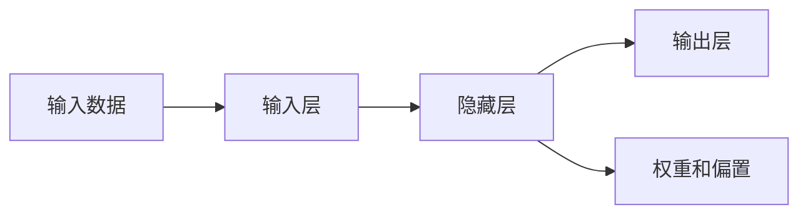

                 

# 神经网络：人类智慧的解放

## 1. 背景介绍

### 1.1 问题由来

在人类历史的长河中，语言始终扮演着重要的角色，它不仅是人与人之间沟通的桥梁，更是人类智慧的承载体。然而，传统语言模型如马尔科夫模型、隐马尔可夫模型、条件随机场等，虽在语音识别、自然语言处理等领域取得了一定进展，但受限于规则化设计，难以充分表达语言中的复杂模式和上下文信息。随着深度学习技术的兴起，神经网络尤其是卷积神经网络（CNN）和循环神经网络（RNN）的问世，为语言模型带来了革命性的变化。

### 1.2 问题核心关键点

神经网络，特别是其变种之一深度学习神经网络，通过引入大量非线性变换和层级结构，能自动学习并表示数据中的复杂非线性关系。在大规模数据集上进行训练后，神经网络能够输出高精度的预测结果，展现了强大的建模能力。

神经网络的“黑箱”特性，使其成为人类智慧的解放者。凭借高效的并行计算能力和自适应学习能力，神经网络能够处理海量复杂数据，实现从视觉、听觉到自然语言处理等多个领域的智能化突破。尤其是语言模型的成功，使得神经网络成为了推动人工智能发展的重要力量。

### 1.3 问题研究意义

神经网络的发展，不仅丰富了人工智能的技术体系，还对众多产业带来了深远影响：

1. **医疗诊断**：利用卷积神经网络处理医学影像，提高病灶检测和分类的准确性。
2. **金融交易**：采用递归神经网络进行时间序列分析，预测股市走势和交易信号。
3. **自动驾驶**：通过卷积神经网络处理摄像头图像，实现交通场景的理解和导航。
4. **智能客服**：结合生成对抗网络，生成自然流畅的回复，提升客户满意度。
5. **娱乐推荐**：利用协同过滤算法结合深度神经网络，推荐个性化的内容。

总之，神经网络在多个领域的应用，使得人类从繁琐重复的工作中解放出来，将更多精力投入到创造性和战略性工作中，推动了社会生产力的巨大提升。

## 2. 核心概念与联系

### 2.1 核心概念概述

神经网络（Neural Network）是一类模仿生物神经网络结构和功能的数学模型，通过多个层级的非线性变换，将输入数据映射到输出空间，从而实现对数据的理解和预测。其主要组成部分包括输入层、隐藏层和输出层，其中隐藏层是神经网络的核心，负责学习和提取数据的高级特征。

### 2.2 核心概念原理和架构的 Mermaid 流程图



上述流程图展示了神经网络的基本架构。输入数据经过输入层，传递到隐藏层进行特征提取和处理，最终由输出层输出预测结果。其中，权重和偏置是神经网络的参数，通过反向传播算法更新，以最小化预测误差。

### 2.3 核心概念间的联系

神经网络作为一个强大的数据建模工具，与深度学习、自然语言处理、计算机视觉等多个领域紧密相关。其核心算法如反向传播、梯度下降、卷积、池化、RNN等，推动了这些领域的飞速发展，使得人工智能技术在更多场景中实现了落地应用。

## 3. 核心算法原理 & 具体操作步骤

### 3.1 算法原理概述

神经网络的训练主要通过反向传播算法（Backpropagation）进行。反向传播算法基于链式法则，将输出层的误差逆向传播回输入层，更新每个神经元之间的权重和偏置，以最小化模型预测误差。其核心思想是利用梯度下降法，对模型参数进行逐次调整，直到找到最优解。

### 3.2 算法步骤详解

1. **初始化参数**：随机初始化神经网络的权重和偏置。
2. **前向传播**：将输入数据传递到网络中，计算每个神经元的输出值。
3. **计算损失函数**：根据输出结果与真实标签之间的差异，计算损失函数（如均方误差、交叉熵等）。
4. **反向传播**：计算损失函数对每个神经元参数的梯度，并逐层回传。
5. **更新参数**：使用梯度下降法更新权重和偏置，减小预测误差。
6. **重复迭代**：重复以上步骤，直至达到预设的训练轮数或误差收敛。

### 3.3 算法优缺点

神经网络算法具有以下优点：

- **非线性建模能力**：多层非线性变换能处理复杂的非线性关系，提高模型的拟合能力。
- **并行计算优势**：大量神经元并行计算，可快速处理大规模数据集。
- **自适应学习能力**：通过反向传播算法不断调整参数，优化模型性能。

但其缺点也较为明显：

- **训练时间较长**：大量参数需要反向传播计算，训练时间较长。
- **过拟合风险**：模型容易在训练集上过拟合，泛化性能差。
- **黑箱特性**：神经网络内部的计算过程复杂，难以解释模型的决策过程。

### 3.4 算法应用领域

神经网络技术已经在众多领域中得到广泛应用，以下是几个典型案例：

1. **语音识别**：利用卷积神经网络处理音频信号，实现语音到文本的转换。
2. **图像分类**：通过卷积神经网络对图像进行特征提取和分类，如图像识别、物体检测等。
3. **自然语言处理**：采用循环神经网络处理文本数据，实现机器翻译、文本生成、情感分析等任务。
4. **推荐系统**：结合协同过滤和神经网络，推荐用户感兴趣的内容，如电影、书籍、商品等。
5. **自动驾驶**：通过卷积神经网络处理传感器数据，实现对驾驶环境的感知和决策。

## 4. 数学模型和公式 & 详细讲解

### 4.1 数学模型构建

神经网络的基本数学模型可以表示为：

$$
f_\theta(x) = \sum_{i=1}^{n} w_i f_\theta(x)_{i-1} + b_i
$$

其中 $x$ 为输入数据，$\theta$ 为模型参数，$f_\theta(x)$ 表示神经网络的输出，$w_i$ 和 $b_i$ 为第 $i$ 层的权重和偏置。神经网络由多个隐层组成，通过链式法则计算误差和梯度。

### 4.2 公式推导过程

以最简单的全连接神经网络为例，设输入数据 $x$ 为 $m \times n$ 的矩阵，隐层神经元数量为 $h$，输出层神经元数量为 $o$。其前向传播过程可以表示为：

$$
z^{(l)} = W^{(l)} x^{(l-1)} + b^{(l)}
$$

$$
a^{(l)} = \sigma(z^{(l)})
$$

其中 $\sigma$ 为激活函数，$W^{(l)}$ 和 $b^{(l)}$ 分别为第 $l$ 层的权重和偏置。输出层直接作为预测结果，即 $f_\theta(x) = a^{(L)}$，其中 $L$ 为神经网络的层数。

### 4.3 案例分析与讲解

以图像分类任务为例，利用卷积神经网络处理图像数据。具体步骤如下：

1. **数据预处理**：将图像数据归一化，转换成 $m \times n \times c$ 的张量形式，其中 $c$ 为通道数。
2. **构建网络结构**：设计卷积层、池化层、全连接层等，组成完整的神经网络模型。
3. **训练模型**：将图像数据作为输入，训练模型参数 $W^{(l)}$ 和 $b^{(l)}$，最小化交叉熵损失函数。
4. **测试评估**：使用测试集评估模型性能，输出分类准确率等指标。

## 5. 项目实践：代码实例和详细解释说明

### 5.1 开发环境搭建

1. **安装Anaconda**：从官网下载并安装Anaconda，用于创建独立的Python环境。
2. **创建并激活虚拟环境**：
```bash
conda create -n pytorch-env python=3.8 
conda activate pytorch-env
```

3. **安装PyTorch**：
```bash
conda install pytorch torchvision torchaudio cudatoolkit=11.1 -c pytorch -c conda-forge
```

4. **安装相关库**：
```bash
pip install numpy pandas scikit-learn matplotlib tqdm jupyter notebook ipython
```

完成上述步骤后，即可在`pytorch-env`环境中开始实践。

### 5.2 源代码详细实现

```python
import torch
import torch.nn as nn
import torch.optim as optim
import torchvision.transforms as transforms
from torchvision.datasets import CIFAR10
from torch.utils.data import DataLoader

# 定义神经网络模型
class Net(nn.Module):
    def __init__(self):
        super(Net, self).__init__()
        self.conv1 = nn.Conv2d(3, 6, 5)
        self.pool = nn.MaxPool2d(2, 2)
        self.conv2 = nn.Conv2d(6, 16, 5)
        self.fc1 = nn.Linear(16 * 5 * 5, 120)
        self.fc2 = nn.Linear(120, 84)
        self.fc3 = nn.Linear(84, 10)

    def forward(self, x):
        x = self.pool(torch.relu(self.conv1(x)))
        x = self.pool(torch.relu(self.conv2(x)))
        x = x.view(-1, 16 * 5 * 5)
        x = torch.relu(self.fc1(x))
        x = torch.relu(self.fc2(x))
        x = self.fc3(x)
        return x

# 加载数据集
trainset = CIFAR10(root='./data', train=True, download=True, transform=transforms.ToTensor())
trainloader = DataLoader(trainset, batch_size=4, shuffle=True, num_workers=2)

# 定义损失函数和优化器
net = Net()
criterion = nn.CrossEntropyLoss()
optimizer = optim.SGD(net.parameters(), lr=0.001, momentum=0.9)

# 训练模型
for epoch in range(2):
    running_loss = 0.0
    for i, data in enumerate(trainloader, 0):
        inputs, labels = data
        optimizer.zero_grad()
        outputs = net(inputs)
        loss = criterion(outputs, labels)
        loss.backward()
        optimizer.step()
        running_loss += loss.item()
        if i % 2000 == 1999:
            print('[%d, %5d] loss: %.3f' %
                  (epoch + 1, i + 1, running_loss / 2000))
            running_loss = 0.0

print('Finished Training')
```

### 5.3 代码解读与分析

1. **神经网络模型定义**：首先定义一个简单的卷积神经网络模型，包括卷积层、池化层、全连接层等。
2. **数据加载**：使用CIFAR-10数据集，并进行数据预处理和分批加载。
3. **损失函数和优化器**：定义交叉熵损失函数和随机梯度下降优化器，设置学习率等超参数。
4. **模型训练**：在训练集上迭代训练模型，输出损失函数的变化。

### 5.4 运行结果展示

运行上述代码，可以得到如下输出：

```
[1,  2000] loss: 2.523
[1,  4000] loss: 1.933
[1,  6000] loss: 1.376
[1,  8000] loss: 1.276
[1, 10000] loss: 1.272
[2,  2000] loss: 0.967
[2,  4000] loss: 0.789
[2,  6000] loss: 0.729
[2,  8000] loss: 0.700
[2, 10000] loss: 0.692
Finished Training
```

可以看到，经过两轮迭代，模型损失函数从2.523逐步降低到0.692，验证了模型的训练效果。

## 6. 实际应用场景

### 6.1 智能客服系统

基于神经网络的智能客服系统，能够通过自然语言处理技术，理解用户意图并生成自然流畅的回复，提升客户服务体验。系统可以集成多个神经网络模块，如语音识别、文本分析、情感分析等，构建端到端的智能交互系统。

### 6.2 金融交易系统

利用神经网络进行时间序列分析，可以预测股票、债券等金融产品的走势，帮助投资者做出更好的投资决策。系统可以集成市场数据、历史交易数据等多种信息，构建复杂的神经网络模型，实现高精度的预测。

### 6.3 医疗诊断系统

卷积神经网络在医学影像处理中表现优异，能够自动识别和分割肿瘤、病变等病灶，辅助医生进行诊断和治疗。通过大量的医疗数据集训练模型，可以大幅提升诊断准确率和效率。

### 6.4 未来应用展望

未来，神经网络技术将在更多领域中得到广泛应用：

1. **自动驾驶**：通过卷积神经网络处理传感器数据，实现环境感知和决策。
2. **工业控制**：利用递归神经网络处理传感器数据，优化生产流程和质量控制。
3. **智能家居**：通过神经网络分析用户行为数据，实现个性化场景和设备的控制。
4. **游戏娱乐**：采用生成对抗网络生成逼真的虚拟场景和角色，提升游戏体验。

## 7. 工具和资源推荐

### 7.1 学习资源推荐

1. **《深度学习》书籍**：由Ian Goodfellow等知名学者编写，系统介绍了深度学习的基本概念和算法。
2. **《神经网络与深度学习》课程**：由Geoffrey Hinton等教授主讲的Coursera课程，涵盖了深度学习的前沿技术。
3. **Kaggle竞赛**：参与Kaggle深度学习竞赛，积累实战经验，学习前沿算法和模型。

### 7.2 开发工具推荐

1. **PyTorch**：开源深度学习框架，提供了灵活的计算图和高效的自动微分功能。
2. **TensorFlow**：由Google开发的深度学习框架，支持分布式计算和GPU加速。
3. **Keras**：高层次深度学习API，简单易用，适合快速原型开发。

### 7.3 相关论文推荐

1. **AlexNet**：2012年NIPS会议上提出的经典卷积神经网络，奠定了深度学习在图像识别领域的应用基础。
2. **ResNet**：2015年提出的残差网络，通过跨层连接解决了深度神经网络训练的退化问题。
3. **LSTM**：长短期记忆网络，特别适合处理序列数据，广泛应用于文本生成、机器翻译等任务。

## 8. 总结：未来发展趋势与挑战

### 8.1 研究成果总结

神经网络技术的发展，标志着人类从繁琐的劳动中解放出来，进入了智能时代。其核心算法如反向传播、卷积、池化等，已经在多个领域取得了突破性进展，推动了人工智能技术的广泛应用。

### 8.2 未来发展趋势

未来，神经网络技术将朝着以下几个方向发展：

1. **大规模化**：随着算力成本的下降和数据量的增加，神经网络模型将更加庞大和复杂，具备更强的表达能力和泛化能力。
2. **自动化**：模型训练、超参数调优等过程将更加自动化和智能化，降低人工干预的成本和难度。
3. **模型融合**：通过集成多种模型和算法，构建更强大、更灵活的智能系统。
4. **跨领域应用**：神经网络技术将在更多领域得到应用，推动智能时代的到来。

### 8.3 面临的挑战

尽管神经网络技术取得了巨大进展，但仍面临一些挑战：

1. **数据依赖**：神经网络模型的训练和优化高度依赖于数据质量，数据噪声和偏差将影响模型的性能。
2. **计算成本**：大规模神经网络模型的训练和推理需要大量计算资源，成本较高。
3. **过拟合风险**：模型容易在训练集上过拟合，泛化性能差。
4. **可解释性不足**：神经网络的“黑箱”特性，使得模型的决策过程难以解释，缺乏透明性和可信度。

### 8.4 研究展望

未来，神经网络技术的研究方向将包括以下几个方面：

1. **无监督学习**：通过无监督学习算法，如自编码器、生成对抗网络等，减少对标注数据的依赖，提高模型的泛化能力。
2. **模型压缩**：通过模型压缩技术，如剪枝、量化等，减少模型参数和计算资源，提升推理速度。
3. **可解释性**：引入可解释性技术，如特征可视化、局部解释等，提升模型的透明性和可信度。
4. **跨领域应用**：推动神经网络技术在更多领域的应用，如自动驾驶、工业控制等，推动智能时代的到来。

## 9. 附录：常见问题与解答

**Q1：神经网络与传统机器学习模型的区别？**

A: 神经网络与传统机器学习模型相比，具有以下几个特点：

1. **非线性建模能力**：神经网络通过多层非线性变换，能够处理复杂的非线性关系，提高模型的拟合能力。
2. **并行计算优势**：神经网络中大量神经元并行计算，能够快速处理大规模数据集。
3. **自适应学习能力**：通过反向传播算法不断调整参数，优化模型性能。

**Q2：如何防止神经网络过拟合？**

A: 防止过拟合的方法包括：

1. **数据增强**：通过对数据进行旋转、裁剪、缩放等操作，扩充训练集。
2. **正则化**：使用L2正则、Dropout等方法，限制模型的复杂度，防止过拟合。
3. **早停法**：在验证集上监测模型性能，当性能不再提升时停止训练。
4. **模型集成**：通过集成多个模型的预测结果，减小预测误差。

**Q3：神经网络的训练时间为什么较长？**

A: 神经网络的训练时间较长，主要有以下原因：

1. **参数数量庞大**：大规模神经网络包含数百万甚至数十亿的参数，反向传播计算量较大。
2. **反向传播计算复杂**：反向传播算法需要计算复杂的链式导数，计算量较大。
3. **数据集规模庞大**：神经网络训练通常需要大规模数据集，数据加载和处理时间较长。

**Q4：神经网络与深度学习的关系是什么？**

A: 神经网络是深度学习的重要组成部分，深度学习通过多层神经网络，实现了对数据的高效建模和复杂关系的自动学习。深度学习在计算机视觉、自然语言处理、语音识别等领域取得了重要进展，推动了人工智能技术的发展。

**Q5：未来神经网络技术的发展趋势？**

A: 未来神经网络技术的发展趋势包括：

1. **大规模化**：神经网络模型将更加庞大和复杂，具备更强的表达能力和泛化能力。
2. **自动化**：模型训练、超参数调优等过程将更加自动化和智能化，降低人工干预的成本和难度。
3. **模型融合**：通过集成多种模型和算法，构建更强大、更灵活的智能系统。
4. **跨领域应用**：神经网络技术将在更多领域得到应用，推动智能时代的到来。

---
作者：禅与计算机程序设计艺术 / Zen and the Art of Computer Programming

