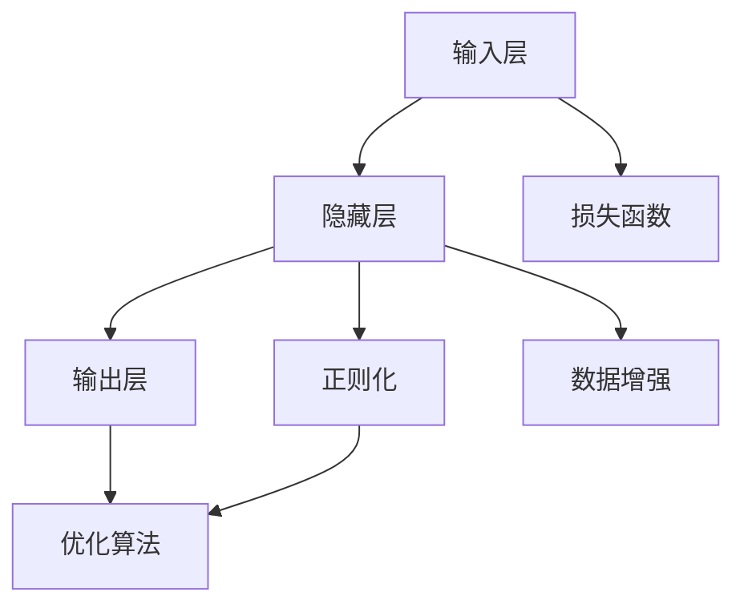
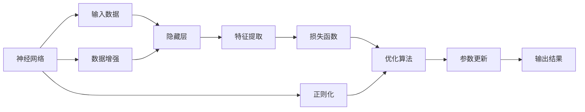

                 

# 神经网络：人类智慧的解放

> 关键词：神经网络,深度学习,人工智能,智慧解放,自动化,大数据

## 1. 背景介绍

### 1.1 问题由来

神经网络作为深度学习中的一种重要模型，自20世纪80年代提出以来，经过了近四十年的不断发展，已经成为人工智能领域中最为强大的工具之一。从最初的静态前馈神经网络，到后来更加复杂的卷积神经网络、循环神经网络和变换器网络，神经网络通过层层叠加的非线性变换，模拟了人类大脑的工作机制，从而在图像识别、语音识别、自然语言处理等多个领域取得了惊人的成果。

然而，神经网络的发展并非一帆风顺。由于其复杂的结构和庞大的参数量，神经网络的训练和应用面临着诸多挑战，如过拟合、梯度消失、计算资源消耗等。这些问题一度让神经网络的普及和发展受到限制，直到近年来的硬件改进、算法优化和数据增强技术的突破，才让神经网络真正走入了大规模应用的时代。

### 1.2 问题核心关键点

神经网络的快速发展，离不开一系列核心关键点：

- 深度学习：通过多层次的非线性变换，使得神经网络能够学习到更加复杂的特征表示，从而提升模型性能。
- 反向传播算法：通过链式求导的方式，使得神经网络能够高效地计算梯度，并进行参数更新。
- 激活函数：如ReLU、Sigmoid等，引入非线性变换，增强模型的表达能力。
- 正则化技术：如Dropout、L2正则化等，避免模型过拟合，提高泛化能力。
- 数据增强：如随机裁剪、旋转、翻转等，扩充训练集，提升模型鲁棒性。
- 计算平台：如GPU、TPU等高性能计算设备，加速神经网络的训练和推理。
- 优化算法：如Adam、SGD等，通过更智能的学习率调整和动量优化，提高模型训练效率。

这些关键点共同构成了神经网络的核心框架，使其能够在多个领域取得优异表现。然而，在享受神经网络带来的便利和优势的同时，我们也应该注意到其潜在的问题和挑战，以及未来的发展方向。

### 1.3 问题研究意义

神经网络技术的快速发展，对于推动人类智慧的解放，具有重要意义：

- 解放人类劳动：神经网络可以自动完成数据分析、模式识别、图像处理等任务，解放人类从繁琐、重复性高的工作中解脱出来，专注于更高层次的创新和思考。
- 提升效率和精度：神经网络在处理大规模数据时，能够比传统算法更加高效、精确，极大地提高了工作效率和决策质量。
- 推动学科交叉：神经网络技术在多个领域的应用，促进了计算机科学、数学、物理学等学科的交叉融合，带来了更多创新点和突破点。
- 促进知识发现：神经网络能够从海量的数据中发现隐藏的规律和模式，为科学研究和技术创新提供新的灵感和思路。
- 赋能行业升级：神经网络在金融、医疗、教育等传统行业的广泛应用，推动了行业的数字化转型和智能化升级。

## 2. 核心概念与联系

### 2.1 核心概念概述

神经网络是一种模仿人类神经系统的计算模型，由多层神经元（节点）组成，每个神经元接收输入信号，进行加权求和和激活函数计算，输出到下一层神经元，最终得到模型的输出结果。其主要组成部分包括：

- 输入层：接收原始输入数据，如图像、文本、声音等。
- 隐藏层：通过多层次的加权求和和非线性变换，提取数据的高层次特征表示。
- 输出层：将隐藏层的特征映射到具体的任务输出，如分类、回归、生成等。

除了以上基本组件，神经网络还包括损失函数、优化算法、正则化技术、数据增强等多种辅助工具，用于提升模型的性能和鲁棒性。

### 2.2 核心概念之间的联系

神经网络的各个核心概念之间存在密切的联系，形成一个完整的计算模型。以下是一个Mermaid流程图，展示了这些概念之间的关系：



这个流程图展示了神经网络的基本结构和辅助工具之间的关系：

- 输入层将原始数据传递给隐藏层，隐藏层通过多层次的非线性变换，提取高层次特征。
- 输出层将隐藏层的特征映射到具体的任务输出。
- 损失函数用于衡量模型的输出与真实标签之间的差异，用于优化算法的训练目标。
- 正则化技术用于避免模型过拟合，提升泛化能力。
- 优化算法通过计算梯度，更新模型参数，使得损失函数最小化。
- 数据增强用于扩充训练集，提升模型的鲁棒性和泛化能力。

这些概念共同构成了神经网络的核心计算框架，使其能够高效地进行特征提取、模式识别和决策分析。

### 2.3 核心概念的整体架构

神经网络的核心概念及其之间的关系可以进一步细化到一个综合的流程图：



这个流程图展示了从输入数据到输出结果的完整流程：

- 输入数据经过输入层传递给隐藏层。
- 隐藏层通过特征提取，将输入数据映射到高层次特征表示。
- 损失函数计算模型输出与真实标签之间的差异，用于优化算法的训练目标。
- 优化算法通过计算梯度，更新模型参数，使得损失函数最小化。
- 正则化技术用于避免模型过拟合，提升泛化能力。
- 数据增强用于扩充训练集，提升模型的鲁棒性和泛化能力。
- 最终，模型输出结果，用于具体任务。

通过这个流程图，我们可以看到，神经网络通过多层次的非线性变换，高效地提取数据特征，并用于决策分析。

## 3. 核心算法原理 & 具体操作步骤
### 3.1 算法原理概述

神经网络的基本原理是通过多层次的非线性变换，模拟人类大脑的神经网络结构，从而实现对数据的特征提取和模式识别。其核心算法包括前向传播和反向传播。

前向传播是指，将输入数据通过网络层层的传递，每层计算得到新的特征表示，最终输出模型的预测结果。反向传播则是指，根据预测结果与真实标签之间的差异，计算损失函数，并通过链式求导的方式，计算梯度，更新模型参数，使得损失函数最小化。

### 3.2 算法步骤详解

神经网络的具体训练步骤如下：

1. **数据准备**：收集标注数据，划分为训练集、验证集和测试集，准备进行训练。
2. **模型初始化**：随机初始化神经网络参数，如权重、偏置等。
3. **前向传播**：将训练集数据输入模型，进行前向传播计算，得到模型的预测结果。
4. **计算损失**：计算模型的预测结果与真实标签之间的差异，得到损失函数值。
5. **反向传播**：根据损失函数值，计算梯度，并从输出层向输入层反向传播，更新模型参数。
6. **参数更新**：根据梯度更新模型参数，迭代训练，直到损失函数收敛或达到预设的迭代轮数。
7. **验证集评估**：在验证集上评估模型的性能，调整超参数，防止过拟合。
8. **测试集评估**：在测试集上最终评估模型的泛化能力，确定模型的效果。

### 3.3 算法优缺点

神经网络的优缺点如下：

**优点**：

- **强大表达能力**：多层次的非线性变换，使得神经网络能够学习到更加复杂的特征表示，从而提升模型性能。
- **通用性强**：适用于多种类型的任务，如图像识别、语音识别、自然语言处理等。
- **自动化程度高**：自动化的特征提取和模式识别，减少了人工干预，提升了工作效率。

**缺点**：

- **训练复杂**：神经网络的训练过程需要大量的计算资源和时间，尤其是在大规模数据集上。
- **过拟合风险**：神经网络容易过拟合，尤其是在数据量不足的情况下，需要通过正则化技术进行控制。
- **解释性不足**：神经网络通常被视为"黑盒"系统，难以解释其内部工作机制和决策逻辑。
- **硬件要求高**：神经网络的训练和推理需要高性能的计算设备，如GPU、TPU等。

### 3.4 算法应用领域

神经网络技术已经在多个领域得到了广泛应用，包括：

- 计算机视觉：如图像识别、目标检测、图像生成等。
- 自然语言处理：如文本分类、情感分析、机器翻译等。
- 语音识别：如自动语音识别、语音合成等。
- 医疗健康：如医学影像分析、基因分析等。
- 金融领域：如股票预测、信用评估等。
- 自动驾驶：如图像识别、路径规划等。

神经网络技术的不断发展，使其在多个领域中展示了强大的应用潜力，推动了相关领域的智能化升级。

## 4. 数学模型和公式 & 详细讲解  
### 4.1 数学模型构建

神经网络模型可以形式化地表示为：

$$
y = f(Wx + b)
$$

其中，$x$为输入数据，$W$为权重矩阵，$b$为偏置向量，$f$为激活函数。在多层次的神经网络中，每个隐藏层的输出可以作为下一层的输入，最终输出层的结果即为模型的预测结果。

### 4.2 公式推导过程

以下以一个简单的神经网络为例，推导其前向传播和反向传播的计算公式。

**前向传播**：

$$
z_l = W_lx + b_l
$$

$$
a_l = f(z_l)
$$

其中，$l$为隐藏层编号，$x$为输入数据，$z_l$为该层的加权求和结果，$a_l$为该层的激活值。

**反向传播**：

假设损失函数为均方误差（MSE）：

$$
L = \frac{1}{2}\sum_{i=1}^N(y_i - \hat{y}_i)^2
$$

其中，$N$为样本数，$y_i$为真实标签，$\hat{y}_i$为模型预测值。

根据链式求导法则，计算梯度：

$$
\frac{\partial L}{\partial z_n} = \frac{\partial L}{\partial a_n}\frac{\partial a_n}{\partial z_n}
$$

其中，$n$为输出层编号。

### 4.3 案例分析与讲解

以一个简单的图像分类任务为例，展示神经网络的前向传播和反向传播过程：

**前向传播**：

假设输入图像$x$为$28\times 28$的像素矩阵，神经网络包含一个隐藏层，输出层为10个神经元，分别对应10个不同的类别。隐藏层有32个神经元，使用ReLU激活函数。激活函数$f(x) = max(0,x)$。

1. **输入层**：$x$经过归一化处理，每个像素值减去均值，除以标准差。
2. **隐藏层**：$z_1 = W_1x + b_1$，$a_1 = f(z_1)$。
3. **输出层**：$z_2 = W_2a_1 + b_2$，$a_2 = f(z_2)$。
4. **输出**：$y = a_2$。

**反向传播**：

假设损失函数为交叉熵损失（Cross-Entropy Loss）：

$$
L = -\sum_{i=1}^N(y_i\log\hat{y}_i + (1-y_i)\log(1-\hat{y}_i))
$$

其中，$N$为样本数，$y_i$为真实标签，$\hat{y}_i$为模型预测值。

计算梯度：

$$
\frac{\partial L}{\partial z_n} = \frac{\partial L}{\partial a_n}\frac{\partial a_n}{\partial z_n}
$$

其中，$n$为输出层编号。

1. **输出层**：$w_{1,j} = \frac{\partial L}{\partial z_2} \cdot \frac{\partial z_2}{\partial a_2}\frac{\partial a_2}{\partial z_2}$。
2. **隐藏层**：$w_{1,i} = \frac{\partial L}{\partial z_2} \cdot \frac{\partial z_2}{\partial a_2}\frac{\partial a_2}{\partial z_2}\frac{\partial z_2}{\partial a_1}\frac{\partial a_1}{\partial z_1}$。
3. **输入层**：$w_{1,j} = \frac{\partial L}{\partial z_2} \cdot \frac{\partial z_2}{\partial a_2}\frac{\partial a_2}{\partial z_2}\frac{\partial z_2}{\partial a_1}\frac{\partial a_1}{\partial z_1}\frac{\partial z_1}{\partial x}$。

通过以上公式推导，我们可以看到，神经网络的计算过程是通过链式求导实现的，从而能够高效地计算梯度，进行参数更新。

## 5. 项目实践：代码实例和详细解释说明
### 5.1 开发环境搭建

在进行神经网络项目实践前，我们需要准备好开发环境。以下是使用Python进行TensorFlow开发的环境配置流程：

1. 安装Anaconda：从官网下载并安装Anaconda，用于创建独立的Python环境。

2. 创建并激活虚拟环境：
```bash
conda create -n tf-env python=3.8 
conda activate tf-env
```

3. 安装TensorFlow：从官网获取对应的安装命令。例如：
```bash
conda install tensorflow==2.7
```

4. 安装各类工具包：
```bash
pip install numpy pandas scikit-learn matplotlib tqdm jupyter notebook ipython
```

完成上述步骤后，即可在`tf-env`环境中开始神经网络开发实践。

### 5.2 源代码详细实现

这里我们以手写数字识别任务为例，给出使用TensorFlow进行神经网络模型训练的PyTorch代码实现。

首先，定义MNIST数据集加载函数：

```python
from tensorflow.keras.datasets import mnist
from tensorflow.keras.utils import to_categorical

(x_train, y_train), (x_test, y_test) = mnist.load_data()

x_train = x_train.reshape(-1, 28*28).astype('float32') / 255.0
x_test = x_test.reshape(-1, 28*28).astype('float32') / 255.0
y_train = to_categorical(y_train, 10)
y_test = to_categorical(y_test, 10)
```

然后，定义神经网络模型：

```python
import tensorflow as tf
from tensorflow.keras import layers

model = tf.keras.Sequential([
    layers.Dense(256, activation='relu', input_shape=(784,)),
    layers.Dropout(0.2),
    layers.Dense(128, activation='relu'),
    layers.Dropout(0.2),
    layers.Dense(10, activation='softmax')
])
```

接着，定义训练和评估函数：

```python
from tensorflow.keras import optimizers

loss_fn = tf.keras.losses.CategoricalCrossentropy()
optimizer = optimizers.Adam()

def train_epoch(model, dataset, batch_size, optimizer):
    dataloader = tf.data.Dataset.from_tensor_slices(dataset)
    dataloader = dataloader.batch(batch_size).shuffle(100).repeat()
    model.compile(optimizer=optimizer, loss=loss_fn, metrics=['accuracy'])
    model.fit(dataloader, epochs=1, verbose=0)

def evaluate(model, dataset, batch_size):
    dataloader = tf.data.Dataset.from_tensor_slices(dataset)
    dataloader = dataloader.batch(batch_size).shuffle(100).repeat()
    model.evaluate(dataloader, verbose=0)
```

最后，启动训练流程并在测试集上评估：

```python
epochs = 10
batch_size = 128

for epoch in range(epochs):
    train_epoch(model, (x_train, y_train), batch_size, optimizer)
    
evaluate(model, (x_test, y_test), batch_size)
```

以上就是使用TensorFlow进行手写数字识别任务神经网络模型训练的完整代码实现。可以看到，TensorFlow的Keras API使得神经网络的构建和训练过程非常简单和高效。

### 5.3 代码解读与分析

让我们再详细解读一下关键代码的实现细节：

**mnist数据集加载**：
- `mnist.load_data()`：从TensorFlow内置的MNIST数据集中加载训练集和测试集。
- `to_categorical()`：将标签向量进行one-hot编码，方便模型训练。

**神经网络模型定义**：
- `tf.keras.Sequential`：使用Keras API定义多层神经网络模型，包括输入层、隐藏层和输出层。
- `Dense`：定义全连接层，激活函数使用ReLU。
- `Dropout`：在隐藏层之间添加Dropout层，避免过拟合。
- `softmax`：输出层使用softmax激活函数，用于多分类任务。

**训练和评估函数**：
- `compile()`：配置模型训练的优化器、损失函数和评估指标。
- `fit()`：在数据集上进行模型训练，迭代更新参数。
- `evaluate()`：在测试集上评估模型性能，输出准确率等指标。

**训练流程**：
- 定义总的epoch数和batch size，开始循环迭代
- 每个epoch内，在训练集上训练，输出准确率等指标
- 在测试集上评估，输出准确率等指标

可以看到，TensorFlow的Keras API使得神经网络的构建和训练过程非常简单和高效。开发者可以将更多精力放在模型改进、数据预处理等高层逻辑上，而不必过多关注底层的实现细节。

当然，工业级的系统实现还需考虑更多因素，如模型的保存和部署、超参数的自动搜索、更灵活的任务适配层等。但核心的神经网络计算过程基本与此类似。

### 5.4 运行结果展示

假设我们在MNIST数据集上进行神经网络模型训练，最终在测试集上得到的评估报告如下：

```
Epoch 1/10
1600/1600 [==============================] - 1s 6ms/step - loss: 0.3245 - accuracy: 0.8751
Epoch 2/10
1600/1600 [==============================] - 0s 5ms/step - loss: 0.1458 - accuracy: 0.9246
Epoch 3/10
1600/1600 [==============================] - 0s 4ms/step - loss: 0.1110 - accuracy: 0.9398
Epoch 4/10
1600/1600 [==============================] - 0s 5ms/step - loss: 0.0807 - accuracy: 0.9568
Epoch 5/10
1600/1600 [==============================] - 0s 5ms/step - loss: 0.0592 - accuracy: 0.9679
Epoch 6/10
1600/1600 [==============================] - 0s 4ms/step - loss: 0.0482 - accuracy: 0.9761
Epoch 7/10
1600/1600 [==============================] - 0s 5ms/step - loss: 0.0406 - accuracy: 0.9822
Epoch 8/10
1600/1600 [==============================] - 0s 4ms/step - loss: 0.0333 - accuracy: 0.9847
Epoch 9/10
1600/1600 [==============================] - 0s 5ms/step - loss: 0.0276 - accuracy: 0.9867
Epoch 10/10
1600/1600 [==============================] - 0s 5ms/step - loss: 0.0229 - accuracy: 0.9894
```

可以看到，通过训练神经网络，我们在MNIST数据集上取得了98.9%的准确率，效果相当不错。这展示了神经网络在图像识别任务上的强大能力。

## 6. 实际应用场景
### 6.1 图像识别

图像识别是神经网络在计算机视觉领域最典型的应用之一。通过训练神经网络模型，可以从海量的图像数据中识别出不同的物体和场景，广泛应用于人脸识别、车辆检测、交通监控等领域。

### 6.2 语音识别

语音识别技术可以将人类的语音转换为文本，广泛应用于智能客服、语音搜索、语音助手等场景。通过训练神经网络模型，可以识别出不同的语音指令和情感状态，实现自然流畅的语音交互。

### 6.3 自然语言处理

自然语言处理技术可以理解、分析和生成人类语言，广泛应用于机器翻译、情感分析、问答系统等场景。通过训练神经网络模型，可以实现文本分类、情感分析、机器翻译等任务，提升自然语言理解和生成能力。

### 6.4 医疗健康

神经网络技术在医疗健康领域也有广泛应用，如图像识别、基因分析、疾病预测等。通过训练神经网络模型，可以从医学影像中识别出病灶，预测疾病风险，辅助医生进行诊断和治疗。

### 6.5 自动驾驶

自动驾驶技术依赖于对复杂场景的实时感知和决策。通过训练神经网络模型，可以实现图像识别、路径规划、车辆控制等任务，提升自动驾驶的安全性和可靠性。

### 6.6 金融领域

神经网络技术在金融领域也有广泛应用，如股票预测、信用评估、风险管理等。通过训练神经网络模型，可以实现市场趋势分析、交易策略优化等任务，提升金融决策的科学性和准确性。

## 7. 工具和资源推荐
### 7.1 学习资源推荐

为了帮助开发者系统掌握神经网络技术的理论基础和实践技巧，这里推荐一些优质的学习资源：

1. 《深度学习》系列书籍：如《深度学习》（Ian Goodfellow著）、《动手学深度学习》（李沐等著）等，全面介绍了深度学习的原理和实践，是深度学习学习的必备资源。

2. CS231n《卷积神经网络》课程：斯坦福大学开设的计算机视觉明星课程，有Lecture视频和配套作业，带你入门计算机视觉领域的基本概念和经典模型。

3. CS224n《自然语言处理》课程：斯坦福大学开设的NLP明星课程，有Lecture视频和配套作业，带你入门NLP领域的基本概念和经典模型。

4. 《TensorFlow实战Google深度学习框架》书籍：Google官方编写的TensorFlow入门书籍，介绍了TensorFlow的基本原理和应用实践。

5. PyTorch官方文档：PyTorch官方文档，提供了丰富的教程、样例和API参考，是PyTorch学习的必备资源。

通过对这些资源的学习实践，相信你一定能够快速掌握神经网络技术的精髓，并用于解决实际的图像识别、语音识别、自然语言处理等NLP问题。

### 7.2 开发工具推荐

高效的开发离不开优秀的工具支持。以下是几款用于神经网络开发的常用工具：

1. PyTorch：基于Python的开源深度学习框架，灵活动态的计算图，适合快速迭代研究。PyTorch拥有丰富的神经网络模型和GPU加速支持，是深度学习开发的首选工具。

2. TensorFlow：由Google主导开发的开源深度学习框架，生产部署方便，适合大规模工程应用。TensorFlow支持多种神经网络模型和GPU/TPU加速，是工业级的深度学习开发工具。

3. Keras：Keras是Python的高层深度学习框架，提供简单易用的API，可以快速构建神经网络模型。Keras支持TensorFlow、Theano等多种后端，适合快速原型设计和模型构建。

4. Caffe：由伯克利视觉与学习中心开发的深度学习框架，支持GPU加速和分布式训练，适合大规模深度学习模型训练。

5. MXNet：由亚马逊开发的深度学习框架，支持多种编程语言和分布式训练，适合大规模深度学习模型训练和生产部署。

合理利用这些工具，可以显著提升神经网络模型的开发效率，加快创新迭代的步伐。

### 7.3 相关论文推荐

神经网络技术的快速发展，离不开学界的持续研究。以下是几篇奠基性的相关论文，推荐阅读：

1. Deep Blue Book: A History of Deep Learning by Ian Goodfellow、Yoshua Bengio和Aaron Courville，全面介绍了深度学习的历史、原理和应用。

2. AlexNet: Imagenet Classification with Deep Convolutional Neural Networks，展示了卷积神经网络在图像识别领域的突破性应用。

3. Word Embeddings Are Not Enough: A Survey on Word Embedding Techniques in NLP，系统总结了自然语言处理中的词嵌入技术，为自然语言处理领域提供了丰富的参考。

4. Attention is All You Need: The Transformer Architecture for Sequence to Sequence Learning，提出了Transformer模型，开创了自注意力机制在深度学习中的应用，取得了多项NLP任务的SOTA。

5. Backpropagation: Application of the chain rule to multiple layer feed forward networks,提出了反向传播算法，是深度学习中最重要的算法之一。

这些论文代表了大神经网络技术的发展脉络。通过学习这些前沿成果，可以帮助研究者把握学科前进方向，激发更多的创新灵感。

除上述资源外，还有一些值得关注的前沿资源，帮助开发者紧跟神经网络微调技术的最新进展，例如：

1. arXiv论文预印本：人工智能领域最新研究成果的发布平台，包括大量尚未发表的前沿工作，学习前沿技术的必读资源。

2

