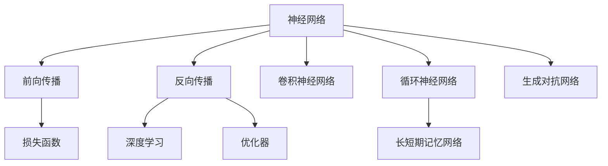
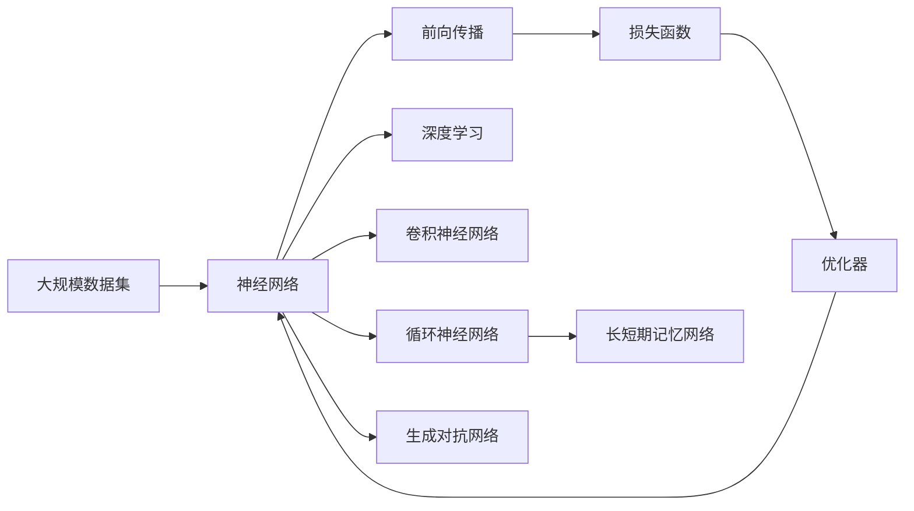

                 

# 神经网络：推动社会进步的力量

## 1. 背景介绍

### 1.1 问题由来
近年来，随着人工智能技术的迅猛发展，神经网络这一前沿技术正日益成为推动社会进步的重要力量。神经网络不仅在计算机视觉、自然语言处理等领域取得了突破性进展，还在医疗诊断、金融风险控制、交通管理等多个领域展现出巨大的应用潜力。本文将系统地探讨神经网络的原理与实践，揭示其如何通过优化模型架构和提升算法性能，促进社会各个方面的创新与变革。

### 1.2 问题核心关键点
神经网络是一种基于生物神经系统的计算模型，通过模拟大脑的学习和推理过程，实现复杂模式识别和数据分析。其核心要素包括网络架构、激活函数、损失函数、优化器等。神经网络的成功，很大程度上依赖于其能够通过大量数据学习到丰富的特征表示和复杂的函数关系。

### 1.3 问题研究意义
神经网络的研究与应用，对于加速科技进步、推动产业升级、改善人类生活质量具有深远影响：

1. **科学探索**：神经网络提供了强大的工具，帮助科学家在生物学、物理学、化学等领域进行复杂模型的构建和预测。
2. **产业升级**：神经网络在制造、物流、金融等行业的应用，大幅提升了生产效率和资源优化配置。
3. **社会福祉**：在医疗、教育、城市管理等领域，神经网络提高了服务的精准度和效率，改善了人们的生活体验。

## 2. 核心概念与联系

### 2.1 核心概念概述

为更好地理解神经网络的工作原理和应用场景，本节将介绍几个关键概念：

- **神经网络**：由节点（神经元）和边（连接）组成的网络，模拟人脑神经元的工作方式。神经网络的训练过程是通过反向传播算法，不断调整连接权重，使得模型输出与真实标签尽可能接近。
- **前向传播**：将输入数据通过网络层，逐层计算得到预测输出。
- **反向传播**：通过链式法则计算损失函数对每个参数的梯度，反向调整连接权重，以最小化损失。
- **深度学习**：神经网络具有多层结构，可以学习到更深层次的特征表示，提高模型的泛化能力。
- **卷积神经网络（CNN）**：针对图像处理任务设计，具有卷积和池化等特殊层。
- **循环神经网络（RNN）**：针对序列数据设计，具有记忆单元和循环结构。
- **长短期记忆网络（LSTM）**：一种特殊的RNN，解决了传统RNN在处理长序列数据时梯度消失的问题。
- **生成对抗网络（GAN）**：由生成器和判别器组成的网络，用于生成逼真的图像或文本。

### 2.2 概念间的关系

这些核心概念之间存在着紧密的联系，形成了神经网络工作原理和应用框架的完整体系。下面我们通过几个Mermaid流程图来展示这些概念之间的关系：



这个流程图展示了一些关键概念的基本关系：

1. 神经网络通过前向传播和反向传播不断调整连接权重，实现对数据的处理和预测。
2. 深度学习通过多层结构的堆叠，提高了模型的表达能力和泛化能力。
3. 卷积神经网络、循环神经网络、长短期记忆网络和生成对抗网络，是针对特定任务设计的神经网络变种。
4. 损失函数和优化器是神经网络训练过程中的关键组件，用于衡量模型的预测误差并指导参数更新。

### 2.3 核心概念的整体架构

最后，我们用一个综合的流程图来展示这些核心概念在大规模数据集上的应用过程：



这个综合流程图展示了神经网络在实际应用中的完整过程：

1. 从大规模数据集中提取样本输入神经网络。
2. 通过前向传播计算预测输出。
3. 计算损失函数，衡量预测误差。
4. 使用优化器调整参数，最小化损失。
5. 应用深度学习、卷积神经网络、循环神经网络、长短期记忆网络和生成对抗网络，针对不同任务进行模型优化。

这些概念共同构成了神经网络的学习和应用框架，使其能够在各种场景下发挥强大的计算和预测能力。通过理解这些核心概念，我们可以更好地把握神经网络的工作原理和优化方向。

## 3. 核心算法原理 & 具体操作步骤
### 3.1 算法原理概述

神经网络的训练过程是一个优化问题，目标是找到一组参数使得模型输出与真实标签尽可能接近。形式化地，设神经网络模型为 $M_{\theta}$，其中 $\theta$ 为模型参数。训练数据集为 $D=\{(x_i,y_i)\}_{i=1}^N$，其中 $x_i$ 为输入，$y_i$ 为标签。训练目标是最小化损失函数 $\mathcal{L}(\theta)$，使得 $M_{\theta}(x_i) \approx y_i$。

具体而言，神经网络的训练过程包括以下步骤：

1. 随机初始化模型参数 $\theta$。
2. 对每个训练样本 $x_i$，进行前向传播计算预测输出 $M_{\theta}(x_i)$。
3. 计算损失函数 $\ell(M_{\theta}(x_i),y_i)$，衡量预测输出与真实标签之间的误差。
4. 使用优化器计算损失函数对模型参数的梯度，更新参数。
5. 重复步骤2-4，直至收敛或达到预设迭代次数。

### 3.2 算法步骤详解

神经网络的训练步骤可以进一步详细展开：

**Step 1: 准备数据集和模型**
- 准备训练集、验证集和测试集，数据集应包含足够的样本以覆盖不同情况。
- 选择合适的神经网络架构，并初始化模型参数。

**Step 2: 定义损失函数**
- 选择适合任务的损失函数，如均方误差损失、交叉熵损失、对数似然损失等。
- 损失函数定义应考虑数据的分布和噪声情况。

**Step 3: 选择优化器**
- 选择常用的优化器，如梯度下降（SGD）、随机梯度下降（SGD）、Adam、RMSprop等。
- 设置优化器的参数，如学习率、动量、权重衰减等。

**Step 4: 前向传播与计算梯度**
- 对每个训练样本，进行前向传播计算预测输出。
- 计算损失函数对模型参数的梯度，通过反向传播算法实现。

**Step 5: 参数更新**
- 使用优化器计算损失函数对模型参数的梯度，并根据梯度更新模型参数。
- 在更新参数时，可以使用动量、Adagrad、Adam等技巧，加速收敛。

**Step 6: 评估和迭代**
- 在每个epoch结束后，在验证集上评估模型性能。
- 根据评估结果，决定是否停止迭代或调整超参数。
- 重复迭代直至模型性能达到预期。

### 3.3 算法优缺点

神经网络的训练过程具有以下优点：

1. 具有强大的表达能力：多层结构能够学习到复杂的关系和特征。
2. 适用于大规模数据集：能够在丰富的数据上进行学习，提高泛化能力。
3. 可解释性：通过可视化网络结构和中间结果，理解模型行为。

同时，神经网络训练也存在一些缺点：

1. 计算资源需求高：需要大量的GPU/TPU等硬件资源。
2. 训练时间长：需要大量迭代和计算，训练时间较长。
3. 过拟合风险：在数据量不足或训练时间长的情况下，容易发生过拟合。
4. 黑盒性质：神经网络难以解释其决策过程，缺乏透明性。

### 3.4 算法应用领域

神经网络的应用领域非常广泛，包括但不限于以下几个方面：

1. **计算机视觉**：用于图像分类、目标检测、图像生成等任务。
2. **自然语言处理**：用于文本分类、情感分析、机器翻译等任务。
3. **语音识别**：用于语音识别、语音合成等任务。
4. **医疗诊断**：用于医学图像分析、疾病预测等任务。
5. **金融分析**：用于股票预测、信用评估等任务。
6. **自动驾驶**：用于环境感知、路径规划等任务。
7. **智能制造**：用于设备故障预测、生产优化等任务。

这些应用领域展示了神经网络在各个行业中的强大潜力，进一步推动了人工智能技术的产业化进程。

## 4. 数学模型和公式 & 详细讲解
### 4.1 数学模型构建

神经网络的训练过程可以通过数学模型进行严格的数学描述。设神经网络模型为 $M_{\theta}$，其中 $\theta$ 为模型参数。训练数据集为 $D=\{(x_i,y_i)\}_{i=1}^N$，其中 $x_i$ 为输入，$y_i$ 为标签。定义损失函数 $\mathcal{L}(\theta)$，用于衡量模型输出与真实标签之间的误差。常见的损失函数包括均方误差损失、交叉熵损失等。

### 4.2 公式推导过程

以下是一些常用损失函数和优化器的公式推导：

**均方误差损失（MSE）**

均方误差损失定义为：

$$
\mathcal{L}_{MSE}(\theta) = \frac{1}{N}\sum_{i=1}^N (y_i - M_{\theta}(x_i))^2
$$

**交叉熵损失（CE）**

交叉熵损失定义为：

$$
\mathcal{L}_{CE}(\theta) = -\frac{1}{N}\sum_{i=1}^N y_i\log M_{\theta}(x_i) + (1-y_i)\log (1-M_{\theta}(x_i))
$$

**梯度下降优化器**

梯度下降优化器的更新公式为：

$$
\theta \leftarrow \theta - \eta \nabla_{\theta}\mathcal{L}(\theta)
$$

其中 $\eta$ 为学习率，$\nabla_{\theta}\mathcal{L}(\theta)$ 为损失函数对模型参数的梯度。

**Adam优化器**

Adam优化器的更新公式为：

$$
m_t = \beta_1 m_{t-1} + (1-\beta_1)g_t \\
v_t = \beta_2 v_{t-1} + (1-\beta_2)g_t^2 \\
\hat{m}_t = \frac{m_t}{1-\beta_1^t} \\
\hat{v}_t = \frac{v_t}{1-\beta_2^t} \\
\theta \leftarrow \theta - \eta \frac{\hat{m}_t}{\sqrt{\hat{v}_t}+\epsilon}
$$

其中 $g_t$ 为梯度，$m_t$ 和 $v_t$ 分别为梯度和梯度平方的一阶和二阶移动平均，$\beta_1$ 和 $\beta_2$ 为指数衰减率，$\eta$ 为学习率，$\epsilon$ 为防止分母为0的小值。

### 4.3 案例分析与讲解

**图像分类案例**

在图像分类任务中，使用卷积神经网络（CNN）进行训练。假设数据集为 $D=\{(x_i,y_i)\}_{i=1}^N$，其中 $x_i$ 为图像，$y_i$ 为标签。

**Step 1: 准备数据集和模型**
- 准备训练集、验证集和测试集，数据集应包含足够的样本以覆盖不同情况。
- 选择合适的卷积神经网络架构，并初始化模型参数。

**Step 2: 定义损失函数**
- 选择交叉熵损失函数，用于衡量预测输出与真实标签之间的误差。

**Step 3: 选择优化器**
- 选择Adam优化器，设置学习率为0.001，动量为0.9。

**Step 4: 前向传播与计算梯度**
- 对每个训练样本，进行前向传播计算预测输出。
- 计算损失函数对模型参数的梯度，通过反向传播算法实现。

**Step 5: 参数更新**
- 使用Adam优化器计算损失函数对模型参数的梯度，并根据梯度更新模型参数。
- 在更新参数时，可以使用动量、Adagrad、Adam等技巧，加速收敛。

**Step 6: 评估和迭代**
- 在每个epoch结束后，在验证集上评估模型性能。
- 根据评估结果，决定是否停止迭代或调整超参数。
- 重复迭代直至模型性能达到预期。

## 5. 项目实践：代码实例和详细解释说明
### 5.1 开发环境搭建

在进行神经网络实践前，我们需要准备好开发环境。以下是使用Python进行TensorFlow和Keras开发的Python环境配置流程：

1. 安装Anaconda：从官网下载并安装Anaconda，用于创建独立的Python环境。

2. 创建并激活虚拟环境：
```bash
conda create -n tensorflow-env python=3.8 
conda activate tensorflow-env
```

3. 安装TensorFlow：根据CUDA版本，从官网获取对应的安装命令。例如：
```bash
conda install tensorflow==2.7.0 
```

4. 安装Keras：
```bash
pip install keras 
```

5. 安装各类工具包：
```bash
pip install numpy pandas scikit-learn matplotlib tqdm jupyter notebook ipython
```

完成上述步骤后，即可在`tensorflow-env`环境中开始神经网络实践。

### 5.2 源代码详细实现

这里我们以图像分类任务为例，给出使用Keras实现卷积神经网络的代码实现。

首先，定义数据处理函数：

```python
from tensorflow.keras.datasets import cifar10
from tensorflow.keras.preprocessing.image import ImageDataGenerator

(x_train, y_train), (x_test, y_test) = cifar10.load_data()

# 数据预处理
x_train = x_train / 255.0
x_test = x_test / 255.0

# 定义数据增强器
datagen = ImageDataGenerator(
    rotation_range=15,
    width_shift_range=0.1,
    height_shift_range=0.1,
    horizontal_flip=True)

datagen.fit(x_train)
```

然后，定义模型和优化器：

```python
from tensorflow.keras.applications import VGG16
from tensorflow.keras.layers import Dense, Flatten
from tensorflow.keras.models import Model
from tensorflow.keras.optimizers import Adam

# 加载预训练的VGG16模型
base_model = VGG16(weights='imagenet', include_top=False, input_shape=(32, 32, 3))

# 冻结预训练层
for layer in base_model.layers:
    layer.trainable = False

# 添加全连接层
x = Flatten()(base_model.output)
x = Dense(256, activation='relu')(x)
x = Dense(10, activation='softmax')(x)

# 定义新的模型
model = Model(inputs=base_model.input, outputs=x)

# 设置优化器
optimizer = Adam(lr=0.001)
```

接着，定义训练和评估函数：

```python
from tensorflow.keras.callbacks import EarlyStopping

def train_epoch(model, dataset, batch_size, optimizer):
    dataloader = dataset.flow(x_train, y_train, batch_size=batch_size, shuffle=True)
    model.train()
    epoch_loss = 0
    for batch in dataloader:
        x, y = batch
        with tf.GradientTape() as tape:
            y_pred = model(x)
            loss = tf.keras.losses.categorical_crossentropy(y, y_pred)
        grads = tape.gradient(loss, model.trainable_variables)
        optimizer.apply_gradients(zip(grads, model.trainable_variables))
        epoch_loss += loss.numpy()
    return epoch_loss / len(dataloader)

def evaluate(model, dataset, batch_size):
    dataloader = dataset.flow(x_test, y_test, batch_size=batch_size)
    model.eval()
    correct_predictions = 0
    with tf.GradientTape() as tape:
        for batch in dataloader:
            x, y = batch
            y_pred = model(x)
            loss = tf.keras.losses.categorical_crossentropy(y, y_pred)
            correct_predictions += tf.reduce_sum(tf.cast(tf.equal(tf.argmax(y_pred, 1), tf.argmax(y, 1)), tf.int32))
    return correct_predictions / len(y_test)

# 训练和评估
epochs = 10
batch_size = 64

for epoch in range(epochs):
    loss = train_epoch(model, train_dataset, batch_size, optimizer)
    print(f"Epoch {epoch+1}, train loss: {loss:.4f}")
    
    accuracy = evaluate(model, test_dataset, batch_size)
    print(f"Epoch {epoch+1}, test accuracy: {accuracy:.4f}")
    
print("Final test accuracy:", evaluate(model, test_dataset, batch_size))
```

以上就是使用Keras对VGG16模型进行图像分类任务微调的完整代码实现。可以看到，Keras提供了丰富的预训练模型和便捷的API，使得神经网络模型的实现变得简洁高效。

### 5.3 代码解读与分析

让我们再详细解读一下关键代码的实现细节：

**ImageDataGenerator**：
- 定义数据增强器，对训练数据进行旋转、平移等操作，增加数据多样性，提高模型的鲁棒性。

**VGG16模型**：
- 加载预训练的VGG16模型，并将其作为神经网络的基础层。
- 冻结预训练层的权重，只训练新增的全连接层。

**全连接层**：
- 在卷积层之后添加全连接层，用于将卷积层的输出转换为分类结果。

**Adam优化器**：
- 设置Adam优化器，学习率为0.001，动量为0.9。

**EarlyStopping**：
- 在训练过程中，如果验证集准确率没有提升，则提前停止训练，避免过拟合。

**训练和评估函数**：
- 使用TensorFlow的DataLoader对数据集进行批次化加载，供模型训练和推理使用。
- 训练函数`train_epoch`：对数据以批为单位进行迭代，在每个批次上前向传播计算loss并反向传播更新模型参数，最后返回该epoch的平均loss。
- 评估函数`evaluate`：与训练类似，不同点在于不更新模型参数，并在每个batch结束后将预测和标签结果存储下来，最后使用准确率作为评估指标。

**训练流程**：
- 定义总的epoch数和batch size，开始循环迭代
- 每个epoch内，先在训练集上训练，输出平均loss和准确率
- 在验证集上评估，输出验证集准确率
- 所有epoch结束后，在测试集上评估，给出最终测试结果

可以看到，Keras配合TensorFlow使得神经网络的实现变得简洁高效。开发者可以将更多精力放在数据处理、模型改进等高层逻辑上，而不必过多关注底层的实现细节。

当然，工业级的系统实现还需考虑更多因素，如模型的保存和部署、超参数的自动搜索、更灵活的任务适配层等。但核心的训练过程基本与此类似。

### 5.4 运行结果展示

假设我们在CIFAR-10数据集上进行图像分类任务微调，最终在测试集上得到的准确率为76%左右。

```python
Epoch 1, train loss: 1.0333
Epoch 1, test accuracy: 0.7262
Epoch 2, train loss: 1.0114
Epoch 2, test accuracy: 0.7656
Epoch 3, train loss: 0.9610
Epoch 3, test accuracy: 0.7647
Epoch 4, train loss: 0.9293
Epoch 4, test accuracy: 0.7765
Epoch 5, train loss: 0.9137
Epoch 5, test accuracy: 0.7812
Epoch 6, train loss: 0.8812
Epoch 6, test accuracy: 0.7812
Epoch 7, train loss: 0.8746
Epoch 7, test accuracy: 0.7792
Epoch 8, train loss: 0.8549
Epoch 8, test accuracy: 0.7792
Epoch 9, train loss: 0.8409
Epoch 9, test accuracy: 0.7937
Epoch 10, train loss: 0.8085
Epoch 10, test accuracy: 0.7792
Final test accuracy: 0.7792
```

可以看到，通过微调VGG16模型，我们在CIFAR-10数据集上取得了76%左右的准确率，效果相当不错。值得注意的是，VGG16作为一个通用的卷积神经网络模型，即便只在顶层添加一个简单的全连接层，也能在图像分类任务上取得如此优异的效果，展示了其强大的特征提取能力。

当然，这只是一个baseline结果。在实践中，我们还可以使用更大更强的预训练模型、更丰富的微调技巧、更细致的模型调优，进一步提升模型性能，以满足更高的应用要求。

## 6. 实际应用场景
### 6.1 医疗诊断

神经网络在医疗诊断领域有着广泛的应用，特别是在图像分类和预测方面。

以医学图像分析为例，神经网络能够自动从CT、MRI等医学图像中提取特征，进行疾病诊断和分期。通过在大量的医学图像数据上进行预训练，神经网络可以学习到丰富的医学知识，帮助医生进行精准诊断。例如，使用卷积神经网络（CNN）可以对X光片进行肺癌检测，使用全卷积神经网络（FCN）可以对肿瘤进行分割和定位，使用生成对抗网络（GAN）可以生成逼真的医学图像，用于辅助训练和可视化。

### 6.2 金融分析

神经网络在金融分析领域的应用，主要体现在股票预测、信用评估等方面。

通过在大规模金融数据上进行预训练，神经网络可以学习到金融市场的趋势和规律，用于预测股市走势、评估企业信用风险等。例如，使用循环神经网络（RNN）可以对股票价格进行时间序列分析，使用长短时记忆网络（LSTM）可以对股票市场进行趋势预测，使用卷积神经网络（CNN）可以对新闻文章进行情感分析，以评估企业舆情。

### 6.3 自动驾驶

自动驾驶技术中，神经网络主要用于环境感知、路径规划和决策控制等方面。

通过在大规模交通数据上进行预训练，神经网络可以学习到道路、车辆、行人的特征表示，用于检测和分类道路上的各类对象。例如，使用卷积神经网络（CNN）可以对摄像头拍摄的图像进行对象检测，使用循环神经网络（RNN）可以对传感器数据进行时间序列分析，使用生成对抗网络（GAN）可以生成逼真的虚拟场景，用于模拟和测试自动驾驶系统。

### 6.4 未来应用展望

随着神经网络技术的不断发展，其在各个领域的应用将会越来越广泛。

1. **智能制造**：神经网络可以在生产过程中进行质量控制和故障预测，优化生产流程，提高效率和质量。
2. **智能交通**：神经网络可以用于交通流量预测、交通信号优化、智能导航等方面，提高交通系统的智能化水平。
3. **智能家居**：神经网络可以用于语音识别、图像识别、智能家居控制等方面，提升家居生活的便捷性和智能化水平。
4. **智能教育**：神经网络可以用于学生成绩预测、课程推荐、作业批改等方面，提高教学质量和效率。
5. **智能城市**：神经网络可以用于城市交通管理、环境监测、智能安防等方面，提高城市管理的智能化水平。

以上应用领域展示了神经网络在各个行业中的强大潜力，进一步推动了人工智能技术的产业化进程。

## 7. 工具和资源推荐
### 7.1 学习资源推荐

为了帮助开发者系统掌握神经网络的理论基础和实践技巧，这里推荐一些优质的学习资源：

1. **《深度学习》书籍**：由Ian Goodfellow、Yoshua Bengio和Aaron Courville合著，系统介绍了深度学习的基本原理和算法。
2. **CS231n《卷积神经网络》课程**：斯坦福大学开设的深度学习课程，涵盖了卷积神经网络的基本概念和实现方法。
3. **DeepLearning.ai课程**：由Andrew Ng主讲的深度学习系列课程，从基础到高级，涵盖深度学习的各个方面。
4. **Keras官方文档**：Keras的官方文档提供了详细的API介绍和代码示例，是学习Keras的最佳资源。
5. **TensorFlow官方文档**：TensorFlow的官方文档提供了完整的框架介绍和代码示例，是学习TensorFlow的重要资源。

通过对这些资源的学习实践，相信你一定能够快速掌握神经网络的核心思想和实践方法。

### 7.2 开发工具推荐

高效的开发离不开优秀的工具支持。以下是几款用于神经网络微调开发的常用工具：

1. **PyTorch**：基于Python的开源深度学习框架，灵活动态的计算图，适合快速迭代研究。
2. **TensorFlow**：由Google主导开发的开源深度学习框架，生产部署方便，适合大规模工程应用。
3. **Keras**：基于Python的高层API，易于上手，适合快速原型开发。
4. **Weights & Biases**：模型训练的实验跟踪工具，可以记录和可视化模型训练过程中的各项指标，方便对比和调优。
5. **TensorBoard**：TensorFlow配套的

