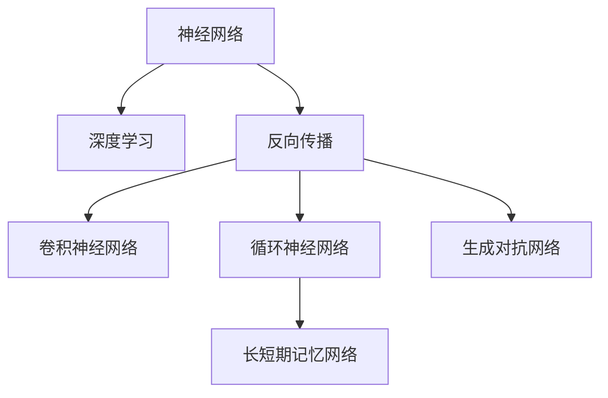
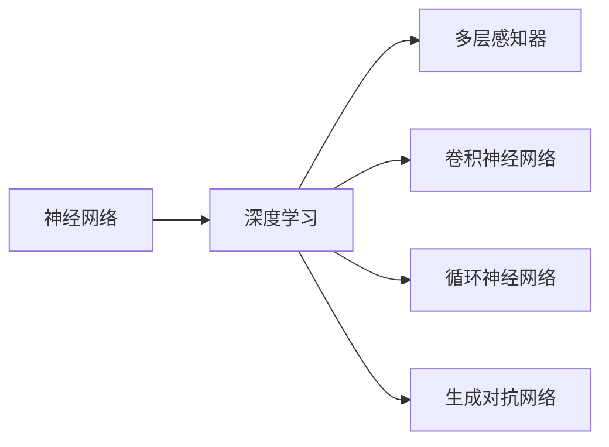
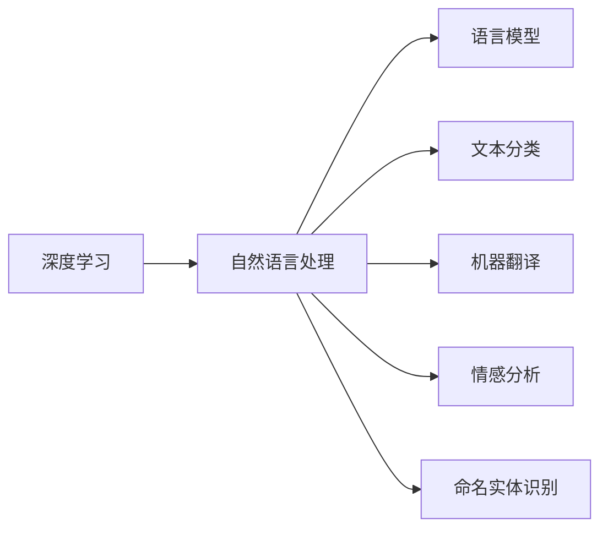
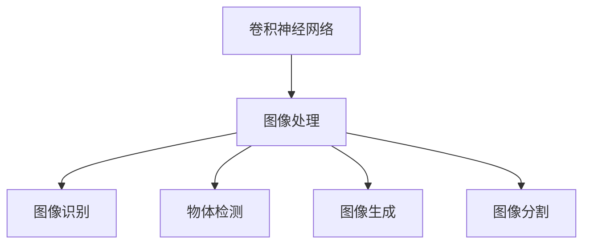
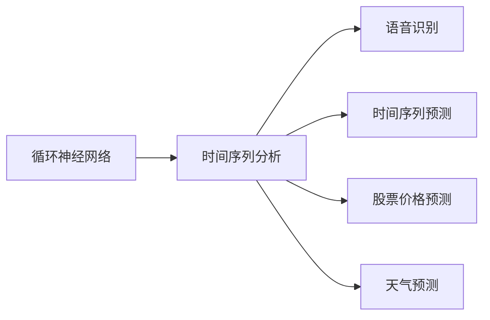
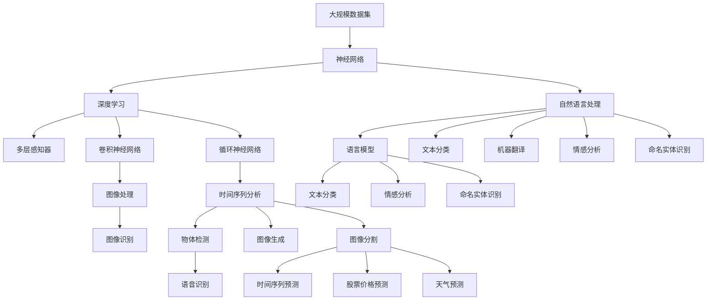

                 

# 神经网络：推动社会进步的力量

## 1. 背景介绍

### 1.1 问题由来
现代社会的进步和发展离不开科技的驱动，而神经网络作为一种强大的计算工具，正在重塑各行各业的面貌。从语音识别、图像处理到自动驾驶、医疗诊断，神经网络的应用领域日益广阔，影响深远。

神经网络是一种模仿生物神经系统的计算模型，通过多层次的计算单元（神经元）和连接权重进行信息处理，具备强大的非线性拟合能力和泛化能力。其核心思想在于通过反向传播算法，不断调整模型参数，最小化预测误差，从而逼近真实数据分布。

近年来，深度学习技术取得了飞速发展，大规模神经网络的模型结构和参数量也在不断增长。例如，谷歌的BERT模型、OpenAI的GPT系列模型等，以数十亿的参数规模，取得了在众多NLP任务上性能领先的突破。

神经网络不仅在学术界引起了广泛关注，其商业价值也得到了越来越多企业和政府机构的认可。从谷歌的自动驾驶项目，到IBM的Watson人工智能系统，再到中国的自动驾驶和智慧医疗项目，神经网络正在各行各业中发挥重要作用。

### 1.2 问题核心关键点
神经网络在驱动社会进步方面的核心关键点主要包括以下几个方面：

1. **计算能力**：神经网络利用强大的并行计算能力，可以处理大规模数据集，提供高效的信息处理能力。
2. **数据利用**：神经网络能够高效利用非结构化数据，如图像、音频、文本等，进行深度特征提取和分析。
3. **模型泛化**：神经网络通过多层次的非线性拟合，具备良好的泛化能力，能够在不同领域中推广应用。
4. **实时计算**：神经网络支持实时计算，适用于对实时数据流进行处理和决策，例如实时语音识别、图像识别等应用。
5. **自动化决策**：神经网络能够自动进行数据处理和决策，提高生产效率，减少人为误差。

### 1.3 问题研究意义
研究神经网络在驱动社会进步中的作用，具有重要意义：

1. **提升生产效率**：神经网络可以自动化处理大量数据，大大提升各行各业的生产效率。
2. **促进产业升级**：神经网络能够深入挖掘数据中的潜在知识，推动产业转型和升级。
3. **改善生活质量**：神经网络在医疗、交通、教育等领域的应用，能够显著改善人类生活质量。
4. **推动科技进步**：神经网络作为深度学习的重要组成部分，是推动人工智能和计算科学发展的重要力量。
5. **促进社会创新**：神经网络为跨学科研究和创新提供了新的工具和手段，推动社会进步和创新。

## 2. 核心概念与联系

### 2.1 核心概念概述

为更好地理解神经网络如何推动社会进步，本节将介绍几个密切相关的核心概念：

- **神经网络（Neural Network, NN）**：一种基于生物神经网络模型的计算模型，由多个层次的神经元（或称为节点）和连接权重构成，通过反向传播算法进行参数优化。
- **深度学习（Deep Learning, DL）**：一种基于多层神经网络的人工智能技术，能够处理复杂的多层次非线性映射关系，广泛应用于图像处理、语音识别、自然语言处理等领域。
- **反向传播（Backpropagation）**：一种神经网络训练算法，通过计算梯度来反向调整模型参数，最小化预测误差。
- **卷积神经网络（Convolutional Neural Network, CNN）**：一种特殊类型的神经网络，主要用于处理图像和视频数据，具有提取局部特征和自动平移不变性的能力。
- **循环神经网络（Recurrent Neural Network, RNN）**：一种能够处理序列数据的神经网络，通过循环结构实现状态更新和记忆，广泛用于文本处理、语音识别等任务。
- **长短期记忆网络（Long Short-Term Memory, LSTM）**：一种特殊的RNN结构，能够有效缓解梯度消失问题，适用于处理长序列数据。
- **生成对抗网络（Generative Adversarial Network, GAN）**：一种通过对抗训练的神经网络结构，能够生成高质量的合成数据，广泛应用于图像生成、文本生成等领域。

这些核心概念之间的逻辑关系可以通过以下Mermaid流程图来展示：



这个流程图展示了大规模神经网络的核心概念及其之间的关系：

1. 神经网络是深度学习的基础结构。
2. 反向传播是神经网络训练的算法核心。
3. 卷积神经网络和循环神经网络是神经网络的两大分支，分别用于处理图像和序列数据。
4. 长短期记忆网络是RNN的一种特殊结构，解决了传统RNN的梯度消失问题。
5. 生成对抗网络是一种基于对抗训练的神经网络结构，能够生成高质量的合成数据。

### 2.2 概念间的关系

这些核心概念之间存在着紧密的联系，形成了神经网络推动社会进步的完整生态系统。下面我通过几个Mermaid流程图来展示这些概念之间的关系。

#### 2.2.1 神经网络与深度学习的关系



这个流程图展示了神经网络与深度学习的关系。深度学习是指利用多层神经网络进行复杂任务的处理，其中多层感知器、卷积神经网络、循环神经网络和生成对抗网络都是深度学习的具体实现形式。

#### 2.2.2 深度学习与自然语言处理的关系



这个流程图展示了深度学习在自然语言处理领域的应用。自然语言处理是指利用深度学习技术处理和理解自然语言，其中语言模型、文本分类、机器翻译、情感分析和命名实体识别等都是常见的自然语言处理任务。

#### 2.2.3 卷积神经网络与图像处理的关系



这个流程图展示了卷积神经网络在图像处理领域的应用。卷积神经网络通过卷积操作提取图像中的特征，广泛应用于图像识别、物体检测、图像生成和图像分割等任务。

#### 2.2.4 循环神经网络与时间序列分析的关系



这个流程图展示了循环神经网络在时间序列分析领域的应用。循环神经网络通过循环结构实现时间序列数据的处理，广泛应用于语音识别、时间序列预测、股票价格预测和天气预测等任务。

### 2.3 核心概念的整体架构

最后，我们用一个综合的流程图来展示这些核心概念在大规模神经网络推动社会进步过程中的整体架构：



这个综合流程图展示了从大规模数据集到大规模神经网络推动社会进步的完整过程。大规模数据集通过神经网络进行深度学习，多层感知器、卷积神经网络和循环神经网络分别处理图像、文本和时间序列数据，生成对抗网络用于生成合成数据，自然语言处理中的语言模型、文本分类、机器翻译、情感分析和命名实体识别等任务都在大规模神经网络的推动下取得了显著进展。

## 3. 核心算法原理 & 具体操作步骤

### 3.1 算法原理概述

大规模神经网络的训练过程通常包括以下几个步骤：

1. **数据预处理**：对大规模数据集进行清洗、归一化和扩增等预处理操作，以提升模型训练效果。
2. **模型构建**：设计合适的神经网络架构，包括神经元层次、连接权重、激活函数等。
3. **损失函数定义**：定义合适的损失函数，如均方误差（MSE）、交叉熵（CE）等，用于衡量预测输出与真实标签之间的差异。
4. **参数初始化**：初始化模型参数，通常使用随机初始化或预训练模型参数。
5. **前向传播**：将输入数据输入神经网络，通过层层计算得到输出。
6. **损失计算**：计算输出与真实标签之间的损失，如均方误差或交叉熵。
7. **反向传播**：通过反向传播算法计算梯度，反向更新模型参数，以最小化损失。
8. **参数更新**：根据梯度更新模型参数，通常使用随机梯度下降（SGD）等优化算法。
9. **迭代训练**：重复以上步骤，直到模型收敛或达到预设的训练轮数。

### 3.2 算法步骤详解

大规模神经网络的训练过程可以分解为以下几个关键步骤：

**Step 1: 准备数据集**
- 收集大规模数据集，并进行预处理，包括数据清洗、归一化、扩增等。
- 将数据集划分为训练集、验证集和测试集，以便在训练过程中进行监控和评估。

**Step 2: 构建模型**
- 选择合适的神经网络架构，如卷积神经网络（CNN）、循环神经网络（RNN）、长短期记忆网络（LSTM）等。
- 定义神经元层次、连接权重和激活函数等模型参数。

**Step 3: 定义损失函数**
- 根据任务类型，选择适合的损失函数，如均方误差（MSE）、交叉熵（CE）等。
- 将训练数据输入模型，计算预测输出和真实标签之间的损失。

**Step 4: 初始化参数**
- 随机初始化模型参数，或加载预训练模型参数，以加快训练速度和提升模型效果。

**Step 5: 前向传播**
- 将训练数据输入模型，通过层层计算得到预测输出。

**Step 6: 损失计算**
- 计算预测输出与真实标签之间的损失，如均方误差或交叉熵。

**Step 7: 反向传播**
- 通过反向传播算法计算梯度，反向更新模型参数，以最小化损失。

**Step 8: 参数更新**
- 根据梯度更新模型参数，通常使用随机梯度下降（SGD）等优化算法。

**Step 9: 迭代训练**
- 重复以上步骤，直到模型收敛或达到预设的训练轮数。

在训练过程中，还需要注意以下几个关键点：

- **学习率调整**：根据模型训练情况，动态调整学习率，以避免过拟合或欠拟合。
- **正则化**：使用L2正则、Dropout等技术，防止过拟合，提高模型泛化能力。
- **数据增强**：通过对数据进行随机裁剪、旋转、翻转等操作，增加数据多样性，提升模型鲁棒性。
- **对抗训练**：引入对抗样本，提高模型鲁棒性，避免过拟合。
- **模型压缩**：使用模型压缩技术，如权重剪枝、量化等，减少模型参数量，提高计算效率。

### 3.3 算法优缺点

大规模神经网络的训练和应用过程具有以下优点：

1. **强大建模能力**：大规模神经网络通过多层次的非线性映射，能够处理复杂的数据结构和关系，具备强大的建模能力。
2. **广泛应用场景**：大规模神经网络已经在图像处理、语音识别、自然语言处理等领域取得广泛应用，效果显著。
3. **自动化特征提取**：神经网络能够自动提取数据中的特征，避免了手动特征工程的过程，提高了模型开发效率。
4. **实时计算能力**：神经网络支持实时计算，能够快速处理数据流，适用于对实时数据进行处理和决策。

同时，大规模神经网络的训练和应用过程也存在一些缺点：

1. **计算资源消耗大**：大规模神经网络需要大量计算资源进行训练，对硬件设备提出了较高要求。
2. **模型复杂度高**：大规模神经网络参数量庞大，模型结构复杂，调试和维护难度大。
3. **过拟合风险高**：大规模神经网络容易发生过拟合，特别是在训练数据不足的情况下。
4. **模型解释性差**：大规模神经网络通常被视为"黑盒"模型，难以解释其内部决策逻辑和推理过程。
5. **依赖数据质量**：大规模神经网络对数据质量和数据量的要求较高，需要大量高质量的数据进行训练。

### 3.4 算法应用领域

大规模神经网络的应用领域广泛，包括但不限于以下几个方面：

- **图像处理**：如图像识别、物体检测、图像生成等。
- **语音识别**：如语音转文字、语音合成等。
- **自然语言处理**：如语言模型、文本分类、机器翻译、情感分析、命名实体识别等。
- **时间序列分析**：如股票价格预测、天气预测、交通流量预测等。
- **医疗诊断**：如医学影像分析、疾病诊断等。
- **智能推荐**：如电商推荐、新闻推荐等。
- **自动驾驶**：如环境感知、路径规划等。
- **智能制造**：如质量检测、工艺优化等。
- **金融分析**：如风险评估、信用评分等。

大规模神经网络在这些领域的应用，已经带来了显著的效益和进步。例如，在医疗领域，大规模神经网络用于医学影像分析，显著提升了诊断效率和准确率。在金融领域，大规模神经网络用于风险评估，提高了金融机构的决策能力和风险控制能力。在自动驾驶领域，大规模神经网络用于环境感知和路径规划，提升了自动驾驶车辆的安全性和可靠性。

## 4. 数学模型和公式 & 详细讲解 & 举例说明

### 4.1 数学模型构建

在大规模神经网络的训练过程中，通常使用反向传播算法进行参数优化。设神经网络模型为 $f_\theta(x)$，其中 $\theta$ 为模型参数，$x$ 为输入数据。训练的目标是最小化损失函数 $L(\theta)$，常用的损失函数包括均方误差（MSE）和交叉熵（CE）。

以回归任务为例，均方误差的定义如下：

$$
L(\theta) = \frac{1}{n}\sum_{i=1}^n (y_i - f_\theta(x_i))^2
$$

其中 $y_i$ 为真实标签，$f_\theta(x_i)$ 为模型预测输出。

以分类任务为例，交叉熵的定义如下：

$$
L(\theta) = -\frac{1}{n}\sum_{i=1}^n \sum_{j=1}^c y_{ij} \log f_\theta(x_i)^{(j)}
$$

其中 $y_{ij}$ 为真实标签，$f_\theta(x_i)^{(j)}$ 为模型对第 $j$ 个类别的预测概率。

### 4.2 公式推导过程

以回归任务为例，使用梯度下降法进行模型参数更新。设学习率为 $\eta$，则参数更新公式为：

$$
\theta \leftarrow \theta - \eta \nabla_\theta L(\theta)
$$

其中 $\nabla_\theta L(\theta)$ 为损失函数对模型参数 $\theta$ 的梯度，可通过反向传播算法计算。

以分类任务为例，使用交叉熵损失函数进行模型训练。设真实标签为 $y_i \in [1,0,\dots,0]$，模型预测输出为 $f_\theta(x_i) \in [0,1,\dots,1]$，则交叉熵损失函数为：

$$
L(\theta) = -\frac{1}{n}\sum_{i=1}^n \sum_{j=1}^c y_{ij} \log f_\theta(x_i)^{(j)}
$$

在反向传播算法中，交叉熵损失函数的梯度计算如下：

$$
\frac{\partial L(\theta)}{\partial \theta_k} = -\frac{1}{n}\sum_{i=1}^n \sum_{j=1}^c y_{ij} \frac{\partial f_\theta(x_i)^{(j)}}{\partial \theta_k}
$$

其中 $f_\theta(x_i)^{(j)}$ 为模型对第 $j$ 个类别的预测概率，$\frac{\partial f_\theta(x_i)^{(j)}}{\partial \theta_k}$ 为对第 $j$ 个类别的预测概率关于模型参数 $\theta_k$ 的导数。

### 4.3 案例分析与讲解

以图像分类任务为例，使用卷积神经网络进行训练。假设数据集包含 $C$ 类图像，每类图像有 $n$ 张，图像大小为 $H \times W$，像素深度为 $D$。

**Step 1: 数据预处理**
- 将图像数据归一化到 $[0,1]$ 范围。
- 对图像进行随机裁剪、旋转、翻转等操作，增加数据多样性。

**Step 2: 构建模型**
- 设计卷积神经网络架构，包含卷积层、池化层、全连接层等。
- 定义激活函数、损失函数和优化器等模型参数。

**Step 3: 初始化参数**
- 随机初始化模型参数，或加载预训练模型参数，以加快训练速度和提升模型效果。

**Step 4: 前向传播**
- 将训练数据输入卷积神经网络，通过层层计算得到预测输出。

**Step 5: 损失计算**
- 计算预测输出与真实标签之间的交叉熵损失。

**Step 6: 反向传播**
- 通过反向传播算法计算梯度，反向更新模型参数，以最小化交叉熵损失。

**Step 7: 参数更新**
- 根据梯度更新模型参数，通常使用随机梯度下降（SGD）等优化算法。

**Step 8: 迭代训练**
- 重复以上步骤，直到模型收敛或达到预设的训练轮数。

例如，可以使用以下Python代码进行卷积神经网络训练：

```python
import torch
import torch.nn as nn
import torch.optim as optim
import torchvision
import torchvision.transforms as transforms
from torch.utils.data import DataLoader

# 定义模型架构
class Net(nn.Module):
    def __init__(self):
        super(Net, self).__init__()
        self.conv1 = nn.Conv2d(3, 6, 5)
        self.pool = nn.MaxPool2d(2, 2)
        self.conv2 = nn.Conv2d(6, 16, 5)
        self.fc1 = nn.Linear(16 * 5 * 5, 120)
        self.fc2 = nn.Linear(120, 84)
        self.fc3 = nn.Linear(84, C)

    def forward(self, x):
        x = self.pool(torch.relu(self.conv1(x)))
        x = self.pool(torch.relu(self.conv2(x)))
        x = x.view(-1, 16 * 5 * 5)
        x = torch.relu(self.fc1(x))
        x = torch.relu(self.fc2(x))
        x = self.fc3(x)
        return x

# 定义损失函数和优化器
criterion = nn.CrossEntropyLoss()
optimizer = optim.SGD(net.parameters(), lr=0.001, momentum=0.9)

# 加载数据集
train_loader = torch.utils.data.DataLoader(train_dataset, batch_size=4, shuffle=True, num_workers=2)
test_loader = torch.utils.data.DataLoader(test_dataset, batch_size=4, shuffle=False, num_workers=2)

# 训练模型
for epoch in range(2):
    running_loss = 0.0
    for i, data in enumerate(train_loader, 0):
        inputs, labels = data
        optimizer.zero_grad()
        outputs = net(inputs)
        loss = criterion(outputs, labels)
        loss.backward()
        optimizer.step()
        running_loss += loss.item()
        if i % 2000 == 1999:
            print('[%d, %5d] loss: %.3f' %
                  (epoch + 1, i + 1, running_loss / 2000))
            running_loss = 0.0

print('Finished Training')
```

## 5. 项目实践：代码实例和详细解释说明

### 5.1 开发环境搭建

在进行大规模神经网络训练和部署时，通常需要高性能的计算资源和专业的开发工具。以下是使用Python进行深度学习开发的常见环境配置流程：

1. 安装Anaconda：从官网下载并安装Anaconda，用于创建独立的Python环境。

2. 创建并激活虚拟环境：
```bash
conda create -n pytorch-env python=3.8 
conda activate pytorch-env
```

3. 安装PyTorch：根据CUDA版本，从官网获取对应的安装命令。例如：
```bash
conda install pytorch torchvision torchaudio cudatoolkit=11.1 -c pytorch -c conda-forge
```

4. 安装TensorFlow：从官网下载并安装TensorFlow，支持CUDA加速。例如：
```bash
pip install tensorflow-gpu
```

5. 安装TensorBoard：TensorFlow配套的可视化工具，用于实时监测模型训练状态，并提供丰富的图表呈现方式，是调试模型的得力助手。

6. 安装PyTorch Lightning：用于构建分布式深度学习应用和快速原型开发，支持GPU加速和分布式训练。

完成上述步骤后，即可在`pytorch-env`环境中开始深度学习开发。

### 5.2 源代码详细实现

下面我们以图像分类任务为例，使用PyTorch进行卷积神经网络训练和评估。

首先，定义图像分类任务的数据处理函数：

```python
import torch
import torch.nn as nn
import torchvision
import torchvision.transforms as transforms
from torch.utils.data import DataLoader

# 定义数据预处理函数
transform = transforms.Compose([
    transforms.ToTensor(),
    transforms.Normalize((0.5, 0.5, 0.5), (0.5, 0.5, 0.5))
])

# 加载数据集
train_dataset = torchvision.datasets.CIFAR10(root='./data', train=True,
                                           transform=transform, download=True)
test_dataset = torchvision.datasets.CIFAR10(root='./data', train=False,
                                           transform=transform, download=True)

# 创建数据加载器
train_loader = torch.utils.data.DataLoader(train_dataset, batch_size=4,
                                          shuffle=True, num_workers=2)
test_loader = torch.utils.data.DataLoader(test_dataset, batch_size=4,
                                         shuffle=False, num_workers=2)
```

然后，定义卷积神经网络模型：

```python
# 定义卷积神经网络架构
class Net(nn.Module):
    def __init__(self):
        super(Net, self).__init__()
        self.conv1 = nn.Conv2d(3, 6, 5)
        self.pool = nn.MaxPool2d(2, 2)
        self.conv2 = nn.Conv2d(6, 16, 5)
        self.fc1 = nn.Linear(16 * 5 * 5, 120)
        self.fc2 = nn.Linear(120, 84)
        self.fc3 = nn.Linear(84, 10)

    def forward(self, x):
        x = self.pool(torch.relu(self.conv1(x)))
        x = self.pool(torch.relu(self.conv2(x)))
        x = x.view(-1, 16 * 5 * 5)
        x = torch.relu(self.fc1(x))
        x = torch.relu(self.fc2(x))
        x = self.fc3(x)
        return x
```

接着，定义训练和评估函数：

```python
# 定义损失函数和优化器
criterion = nn.CrossEntropyLoss()
optimizer = torch.optim.SGD(net.parameters(), lr=0.001, momentum=0.9)

# 定义训练函数
def train(epoch):
    net.train()
    running_loss = 0.0
    for i, data in enumerate(train_loader, 0):
        inputs, labels = data
        optimizer.zero_grad()
        outputs = net(inputs)
        loss = criterion(outputs, labels)
        loss.backward()
        optimizer.step()
        running_loss += loss.item()
        if i % 2000 == 1999:
            print('[%d, %5d] loss: %.3f' %
                  (epoch + 1, i + 1, running_loss / 2000))
            running_loss = 0.0

# 定义评估函数
def test():
    net.eval()
    correct = 0
    total = 0
    with torch.no_grad():
        for data in test_loader:
            inputs, labels = data
            outputs = net(inputs)
            _, predicted = torch.max(outputs.data, 1)
            total += labels.size(0)
            correct += (predicted == labels).sum().item()

    

