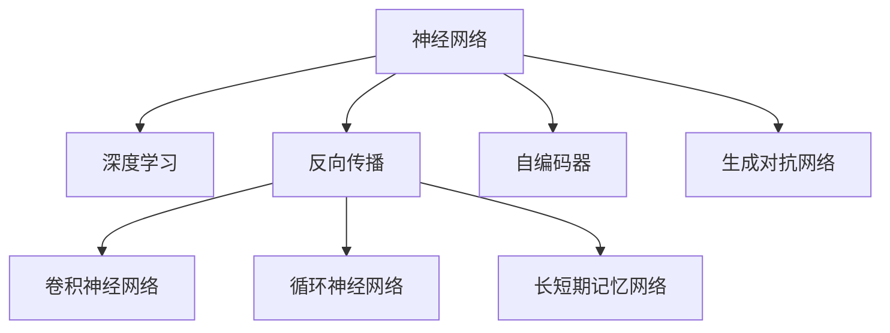
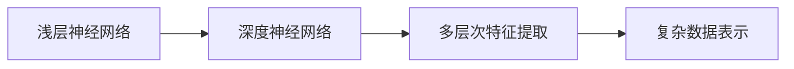
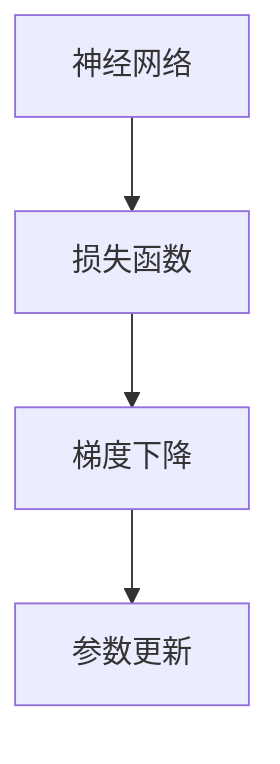
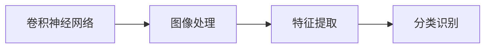
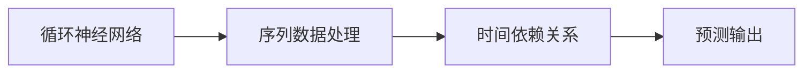
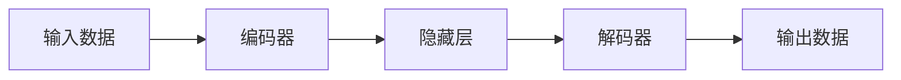
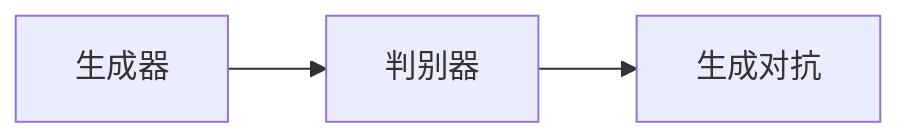
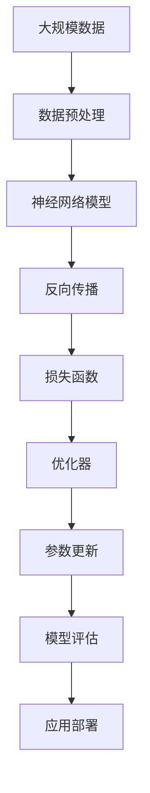

                 

## 1. 背景介绍

### 1.1 问题由来
神经网络（Neural Networks, NN）作为人工智能领域的核心技术，自20世纪80年代以来一直在迅速发展，推动了计算机视觉、语音识别、自然语言处理等多个领域的进步。近年来，深度学习技术的大规模应用，使得神经网络在图像识别、语音识别、自然语言理解等方面取得了显著成果，成为了改变人类生产生活方式的重要工具。

### 1.2 问题核心关键点
神经网络的核心在于其结构和训练方法。神经网络由大量的神经元（或称为节点）组成，通过多个层次的特征提取和转换，最终输出预测结果。其训练过程主要通过反向传播算法（Backpropagation），通过优化损失函数来调整网络参数，使得网络输出的预测结果与实际结果尽可能接近。

当前，深度学习神经网络已经广泛应用于计算机视觉、语音识别、自然语言处理等领域，并取得了显著成果。然而，神经网络也面临着一些挑战，如模型可解释性不足、训练数据需求量大、过拟合风险高等问题。

### 1.3 问题研究意义
神经网络技术的发展，对于推动社会进步具有重要意义：

1. **提高生产力**：在工业制造、医疗诊断、金融预测等领域，神经网络能够自动化地处理大量数据，提高工作效率，减少人为错误。
2. **改善生活质量**：在交通管理、智能家居、教育培训等领域，神经网络能够提供个性化、智能化的服务，提升人们的生活质量。
3. **促进创新创业**：神经网络技术为创业者提供了新的工具和方法，催生了诸多基于人工智能的新型产业，如自动驾驶、智能客服等。
4. **推动科学研究**：神经网络为科学家提供了强大的数据分析和模式识别工具，加速了科学研究的进程，打开了新的研究方向。

因此，深入研究和掌握神经网络技术，对于推动社会进步具有深远影响。本文将详细探讨神经网络的核心概念、原理和应用，以及未来发展趋势和面临的挑战，希望能够为读者提供全面的技术指引。

## 2. 核心概念与联系

### 2.1 核心概念概述

为了更好地理解神经网络及其相关技术，本节将介绍几个关键概念：

- **神经网络**：由大量神经元（节点）组成，通过层次化的特征提取和转换，最终输出预测结果的计算模型。
- **深度学习**：使用多层神经网络进行学习和训练，从而能够处理更复杂的数据和任务。
- **反向传播**：通过梯度下降等优化算法，反向更新神经网络参数，最小化损失函数。
- **卷积神经网络（CNN）**：应用于图像处理任务，通过卷积操作提取局部特征，使用池化操作减小特征维度。
- **循环神经网络（RNN）**：应用于序列数据处理任务，能够处理变长的输入序列，捕捉序列的时间依赖关系。
- **长短期记忆网络（LSTM）**：一种特殊的RNN，通过门控机制控制信息流动，解决RNN的梯度消失问题。
- **自编码器（AE）**：用于无监督学习的神经网络结构，能够学习数据的低维表示，用于数据降维、特征提取等任务。
- **生成对抗网络（GAN）**：由生成器和判别器组成的神经网络结构，能够生成逼真、多样化的数据，用于图像生成、语音合成等任务。

这些概念之间的逻辑关系可以通过以下Mermaid流程图来展示：



这个流程图展示了神经网络的核心概念及其之间的关系：

1. 神经网络是深度学习的基础，由多个层次的神经元组成。
2. 反向传播是神经网络训练的核心算法，通过梯度下降优化参数。
3. 卷积神经网络、循环神经网络和长短期记忆网络是特定类型的神经网络，适用于不同类型的任务。
4. 自编码器和生成对抗网络是神经网络在无监督学习和生成任务中的重要应用。

### 2.2 概念间的关系

这些核心概念之间存在着紧密的联系，形成了神经网络的完整生态系统。下面我们通过几个Mermaid流程图来展示这些概念之间的关系。

#### 2.2.1 神经网络的构建流程


这个流程图展示了神经网络的构建流程：

1. 输入层接收原始数据，如图片、文本等。
2. 隐含层对输入数据进行特征提取和转换。
3. 输出层将隐含层的特征映射到目标输出，如分类、回归等。

#### 2.2.2 深度学习的优势



这个流程图展示了深度学习的优势：

1. 浅层神经网络只能处理简单的数据表示。
2. 深度神经网络能够通过多层次的特征提取，处理更复杂的数据表示。
3. 深度神经网络在图像识别、语音识别等复杂任务上取得了显著成果。

#### 2.2.3 反向传播的优化



这个流程图展示了反向传播的优化过程：

1. 神经网络对输入数据进行前向传播，得到预测结果。
2. 将预测结果与真实结果进行比较，计算损失函数。
3. 通过梯度下降等优化算法，反向更新网络参数。

#### 2.2.4 卷积神经网络的应用



这个流程图展示了卷积神经网络在图像处理中的应用：

1. 卷积神经网络通过卷积操作提取图像的局部特征。
2. 使用池化操作减小特征维度，提取更重要的特征。
3. 将特征映射到输出层，进行分类或回归预测。

#### 2.2.5 循环神经网络的应用



这个流程图展示了循环神经网络在序列数据处理中的应用：

1. 循环神经网络能够处理变长的输入序列，捕捉序列的时间依赖关系。
2. 通过门控机制控制信息流动，解决RNN的梯度消失问题。
3. 将序列数据映射到输出层，进行分类或回归预测。

#### 2.2.6 自编码器的工作原理



这个流程图展示了自编码器的工作原理：

1. 输入数据通过编码器进行特征提取，映射到低维空间。
2. 解码器将低维特征映射回原始空间，重构输入数据。
3. 通过重构误差最小化，自编码器学习数据的低维表示。

#### 2.2.7 生成对抗网络的结构



这个流程图展示了生成对抗网络的结构：

1. 生成器通过随机噪声生成逼真、多样化的数据。
2. 判别器区分生成数据与真实数据，进行判别训练。
3. 生成器与判别器通过对抗训练，不断优化生成数据的逼真度。

### 2.3 核心概念的整体架构

最后，我们用一个综合的流程图来展示这些核心概念在大规模应用中的整体架构：



这个综合流程图展示了从数据预处理到模型部署的完整过程。大规模数据经过预处理后，输入到神经网络模型中进行特征提取和转换。通过反向传播算法，最小化损失函数，优化模型参数。最终，模型在评估阶段进行性能验证，并部署到实际应用中，为人类社会带来改变。

## 3. 核心算法原理 & 具体操作步骤

### 3.1 算法原理概述

神经网络的核心算法包括前向传播、反向传播、梯度下降等。其核心思想是通过多层神经元的组合，学习输入数据与输出结果之间的映射关系。以下是神经网络算法原理的详细描述。

#### 3.1.1 前向传播

前向传播是神经网络的核心算法之一，通过逐层计算得到最终输出结果。其步骤如下：

1. 输入数据 $x$ 经过输入层，得到神经元的输入 $a_0$。
2. 输入 $a_0$ 经过第一层神经元 $z_1 = W_1 a_0 + b_1$，计算得到输出 $a_1 = \sigma(z_1)$。
3. 输出 $a_1$ 经过第二层神经元 $z_2 = W_2 a_1 + b_2$，计算得到输出 $a_2 = \sigma(z_2)$。
4. 依次类推，直到最后一层，得到最终输出 $a_L$。

前向传播的计算公式为：

$$
a_{l+1} = \sigma(W_l a_l + b_l)
$$

其中 $a_l$ 表示第 $l$ 层神经元的输入，$z_l = W_l a_l + b_l$ 表示第 $l$ 层神经元的线性变换结果，$\sigma$ 表示激活函数，如sigmoid、ReLU等。

#### 3.1.2 反向传播

反向传播是神经网络训练的核心算法，通过计算梯度并反向更新参数，最小化损失函数。其步骤如下：

1. 计算最终输出 $a_L$ 与真实输出 $y$ 之间的损失函数 $L$。
2. 反向计算每一层神经元的输出 $\delta_l$ 和梯度 $\Delta_l$。
3. 通过链式法则，计算损失函数对每一层参数的梯度 $\frac{\partial L}{\partial W_l}$ 和 $\frac{\partial L}{\partial b_l}$。
4. 根据梯度下降等优化算法，更新每一层参数 $W_l$ 和 $b_l$。

反向传播的计算公式为：

$$
\Delta_l = \frac{\partial L}{\partial z_l} \cdot \frac{\partial z_l}{\partial a_l} = \delta_{l+1} \cdot W_{l+1}^T
$$

$$
\frac{\partial L}{\partial W_l} = \Delta_l a_l^T, \quad \frac{\partial L}{\partial b_l} = \Delta_l
$$

其中 $\delta_l$ 表示第 $l$ 层神经元的误差，$W_l$ 和 $b_l$ 分别表示第 $l$ 层的权重和偏置，$\frac{\partial L}{\partial z_l}$ 表示损失函数对线性变换结果的偏导数。

#### 3.1.3 梯度下降

梯度下降是神经网络优化的核心算法，通过计算损失函数对参数的梯度，并按照梯度方向更新参数，最小化损失函数。其步骤如下：

1. 计算损失函数 $L$ 对参数 $W$ 和 $b$ 的梯度 $\frac{\partial L}{\partial W}$ 和 $\frac{\partial L}{\partial b}$。
2. 根据梯度下降算法，更新参数 $W$ 和 $b$。
3. 重复步骤1和2，直到损失函数最小化。

梯度下降的计算公式为：

$$
W = W - \eta \frac{\partial L}{\partial W}, \quad b = b - \eta \frac{\partial L}{\partial b}
$$

其中 $\eta$ 表示学习率，控制参数更新的步长。

### 3.2 算法步骤详解

神经网络的训练过程包括数据预处理、模型构建、前向传播、反向传播和参数更新等多个步骤。以下详细介绍每个步骤的具体实现。

#### 3.2.1 数据预处理

数据预处理是神经网络训练的前提，包括数据清洗、归一化、标准化等操作。其步骤如下：

1. 数据清洗：去除噪声数据、缺失数据等。
2. 数据归一化：将数据缩放到0到1之间，避免梯度爆炸。
3. 数据标准化：将数据转换为标准正态分布，提高模型训练效果。

#### 3.2.2 模型构建

模型构建是神经网络训练的基础，包括选择模型结构、初始化参数等。其步骤如下：

1. 选择模型结构：根据任务类型选择合适的神经网络结构，如CNN、RNN、LSTM等。
2. 初始化参数：随机初始化神经元权重 $W$ 和偏置 $b$，选择合适的初始化方法，如Xavier初始化、He初始化等。

#### 3.2.3 前向传播

前向传播是神经网络计算的核心，通过逐层计算得到最终输出结果。其步骤如下：

1. 输入数据 $x$ 经过输入层，得到神经元的输入 $a_0$。
2. 输入 $a_0$ 经过第一层神经元 $z_1 = W_1 a_0 + b_1$，计算得到输出 $a_1 = \sigma(z_1)$。
3. 输出 $a_1$ 经过第二层神经元 $z_2 = W_2 a_1 + b_2$，计算得到输出 $a_2 = \sigma(z_2)$。
4. 依次类推，直到最后一层，得到最终输出 $a_L$。

#### 3.2.4 反向传播

反向传播是神经网络优化的核心，通过计算梯度并反向更新参数，最小化损失函数。其步骤如下：

1. 计算最终输出 $a_L$ 与真实输出 $y$ 之间的损失函数 $L$。
2. 反向计算每一层神经元的输出 $\delta_l$ 和梯度 $\Delta_l$。
3. 通过链式法则，计算损失函数对每一层参数的梯度 $\frac{\partial L}{\partial W_l}$ 和 $\frac{\partial L}{\partial b_l}$。
4. 根据梯度下降等优化算法，更新每一层参数 $W_l$ 和 $b_l$。

#### 3.2.5 参数更新

参数更新是神经网络优化的最后一步，通过梯度下降等算法，不断调整网络参数，最小化损失函数。其步骤如下：

1. 计算损失函数 $L$ 对参数 $W$ 和 $b$ 的梯度 $\frac{\partial L}{\partial W}$ 和 $\frac{\partial L}{\partial b}$。
2. 根据梯度下降算法，更新参数 $W$ 和 $b$。
3. 重复步骤1和2，直到损失函数最小化。

### 3.3 算法优缺点

神经网络在处理复杂数据和任务方面表现出色，但也存在一些缺点：

#### 3.3.1 优点

1. **强大的特征提取能力**：神经网络能够通过多层次的特征提取，处理更复杂的数据表示。
2. **灵活的模型结构**：神经网络可以根据任务需求，灵活调整模型结构，适应不同的数据类型和任务类型。
3. **高效的自动化学习**：神经网络通过反向传播算法，自动学习输入数据与输出结果之间的映射关系，减少了人工调参的复杂度。
4. **广泛的应用场景**：神经网络已经广泛应用于计算机视觉、语音识别、自然语言处理等领域，具有广泛的应用前景。

#### 3.3.2 缺点

1. **过拟合风险**：神经网络在大规模数据训练时，容易过拟合，导致模型泛化性能下降。
2. **计算资源消耗大**：神经网络模型通常参数量较大，计算复杂度高，需要大量的计算资源和时间。
3. **可解释性不足**：神经网络模型通常被视为"黑盒"系统，难以解释其内部工作机制和决策逻辑。
4. **数据需求量大**：神经网络模型需要大量的标注数据进行训练，数据获取成本高，数据质量和分布也影响模型效果。

### 3.4 算法应用领域

神经网络已经在多个领域得到了广泛应用，具体如下：

#### 3.4.1 计算机视觉

神经网络在计算机视觉领域取得了显著成果，如图像识别、目标检测、图像生成等。卷积神经网络（CNN）是计算机视觉任务的主流模型，通过卷积操作提取图像的局部特征，使用池化操作减小特征维度，最终进行分类或回归预测。

#### 3.4.2 语音识别

神经网络在语音识别领域也取得了显著进展，如语音转文本、语音情感分析等。通过循环神经网络（RNN）或长短期记忆网络（LSTM），神经网络能够处理变长的输入序列，捕捉时间依赖关系，进行语音识别和情感分析。

#### 3.4.3 自然语言处理

神经网络在自然语言处理领域也具有广泛应用，如机器翻译、文本分类、命名实体识别等。通过Transformer结构，神经网络能够处理变长的文本序列，捕捉文本之间的依赖关系，进行自然语言处理任务。

#### 3.4.4 强化学习

神经网络在强化学习领域也有应用，如智能游戏、机器人控制等。通过深度强化学习算法，神经网络能够学习最优策略，解决复杂的决策问题。

#### 3.4.5 医疗诊断

神经网络在医疗诊断领域也具有应用前景，如医学图像分析、病历分析等。通过卷积神经网络（CNN）和长短期记忆网络（LSTM），神经网络能够处理医学图像和病历数据，进行疾病诊断和预测。

## 4. 数学模型和公式 & 详细讲解 & 举例说明

### 4.1 数学模型构建

神经网络的数学模型主要包括前向传播、损失函数、反向传播和优化算法。以下是数学模型的详细构建过程。

#### 4.1.1 前向传播模型

前向传播模型的数学公式如下：

$$
a_0 = x, \quad z_l = W_l a_{l-1} + b_l, \quad a_l = \sigma(z_l)
$$

其中 $x$ 表示输入数据，$a_0$ 表示输入层的输入，$z_l$ 表示第 $l$ 层神经元的线性变换结果，$a_l$ 表示第 $l$ 层神经元的输出，$\sigma$ 表示激活函数，如sigmoid、ReLU等。

#### 4.1.2 损失函数模型

常用的损失函数包括均方误差（MSE）、交叉熵（CE）等。以交叉熵损失函数为例，其数学公式如下：

$$
L = -\frac{1}{N} \sum_{i=1}^N y_i \log \hat{y}_i + (1-y_i) \log (1-\hat{y}_i)
$$

其中 $y_i$ 表示真实标签，$\hat{y}_i$ 表示神经网络的预测输出，$N$ 表示样本数量。

#### 4.1.3 反向传播模型

反向传播模型的数学公式如下：

$$
\delta_l = \frac{\partial L}{\partial z_l} \cdot \frac{\partial z_l}{\partial a_l} = \delta_{l+1} \cdot W_{l+1}^T
$$

$$
\frac{\partial L}{\partial W_l} = \delta_l a_{l-1}^T, \quad \frac{\partial L}{\partial b_l} = \delta_l
$$

其中 $\delta_l$ 表示第 $l$ 层神经元的误差，$W_l$ 和 $b_l$ 分别表示第 $l$ 层的权重和偏置，$\frac{\partial L}{\partial z_l}$ 表示损失函数对线性变换结果的偏导数。

#### 4.1.4 优化算法模型

常用的优化算法包括梯度下降（SGD）、Adam、Adagrad等。以Adam优化算法为例，其数学公式如下：

$$
\theta_{t+1} = \theta_t - \eta \frac{m_t}{\sqrt{v_t}+\epsilon}
$$

其中 $\theta_t$ 表示第 $t$ 次迭代后的模型参数，$m_t$ 表示第 $t$ 次迭代的梯度累积，$v_t$ 表示第 $t$ 次迭代的二阶矩估计，$\eta$ 表示学习率，$\epsilon$ 表示正则化项。

### 4.2 公式推导过程

以下是神经网络数学模型的详细推导过程。

#### 4.2.1 前向传播推导

前向传播的计算公式为：

$$
a_0 = x, \quad z_l = W_l a_{l-1} + b_l, \quad a_l = \sigma(z_l)
$$

其中 $x$ 表示输入数据，$a_0$ 表示输入层的输入，$z_l$ 表示第 $l$ 层神经元的线性变换结果，$a_l$ 表示第 $l$ 层神经元的输出，$\sigma$ 表示激活函数，如sigmoid、ReLU等。

#### 4.2.2 损失函数推导

以二分类任务为例，损失函数为交叉熵损失，其计算公式为：

$$
L = -\frac{1}{N} \sum_{i=1}^N y_i \log \hat{y}_i + (1-y_i) \log (1-\hat{y}_i)
$$

其中 $y_i$ 表示真实标签，$\hat{y}_i$ 表示神经网络的预测输出，$N$ 表示样本数量。

#### 4.2.3 反向传播推导

以一个神经元为例，其误差传播的计算公式为：

$$
\delta_l = \frac{\partial L}{\partial z_l} \cdot \frac{\partial z_l}{\partial a_l} = \delta_{l+1} \cdot W_{l+1}^T
$$

$$
\frac{\partial L}{\partial W_l} = \delta_l a_{l-1}^T, \quad \frac{\partial L}{\partial b_l} = \delta_l
$$

其中 $\delta_l$ 表示第 $l$ 层神经元的误差，$W_l$ 和 $b_l$ 分别表示第 $l$ 层的权重和偏置，$\frac{\partial L}{\partial z_l}$ 表示损失函数对线性变换结果的偏导数。

#### 4.2.4 梯度下降推导

以一个神经元为例，其梯度更新的计算公式为：

$$
W = W - \eta \frac{\partial L}{\partial W}, \quad b = b - \eta \frac{\partial L}{\partial b}
$$

其中 $\eta$ 表示学习率，控制参数更新的步长。

### 4.3 案例分析与讲解

#### 4.3.1 图像分类任务

以图像分类任务为例，卷积神经网络（CNN）是主流模型。其结构包括卷积层、池化层和全连接层。以LeNet-5为例，其结构如下：

```
输入层 (28x28x1) --> 卷积层 (28x28x6) --> ReLU --> 池化层 (14x14x6) --> ReLU --> 卷积层 (14x14x16) --> ReLU --> 池化层 (7x7x16) --> ReLU --> 全连接层 (400) --> ReLU --> 全连接层 (10) --> Softmax
```

其中，卷积层通过卷积操作提取图像的局部特征，池化层通过池化操作减小特征维度，全连接层通过线性变换得到最终输出。通过反向传播算法，神经网络能够学习到图像的特征表示，并进行分类预测。

#### 4.3.2 文本分类任务

以文本分类任务为例，循环神经网络（RNN）或长短期记忆网络（LSTM）是主流模型。其结构包括嵌入层、隐藏层和输出层。以LSTM为例，其结构如下：

```
输入 (1xN) --> 嵌入层 --> 隐藏层 (Nx128) --> 长短期记忆层 (128x128) --> Softmax
```

其中，嵌入层将文本转换为向量表示，隐藏层通过LSTM结构捕捉时间依赖关系，最终通过Softmax层进行分类预测。通过反向传播算法，神经网络能够学习到文本的特征表示，并进行分类预测。

## 5. 项目实践：代码实例和详细解释说明

### 5.1 开发环境搭建

在进行神经网络项目实践前，我们需要准备好开发环境。以下是使用Python进行TensorFlow开发的环境配置流程：

1. 安装Anaconda：从官网下载并安装Anaconda，用于创建独立的Python环境。

2. 创建并激活虚拟环境：
```bash
conda create -n tf-env python=3.8 
conda activate tf-env
```

3. 安装TensorFlow：根据CUDA版本，从官网获取对应的安装命令。例如：
```bash
pip install tensorflow
```

4. 安装各类工具包：
```bash
pip install numpy pandas sc

