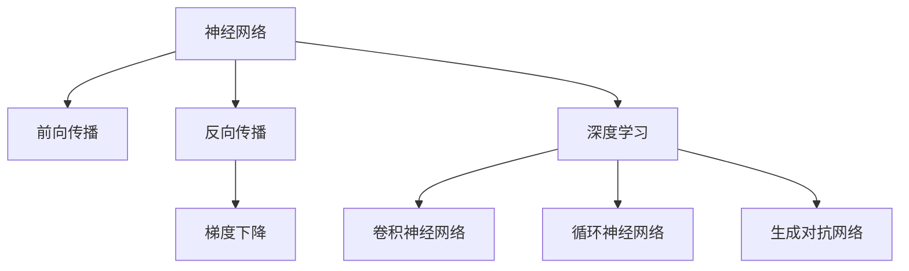
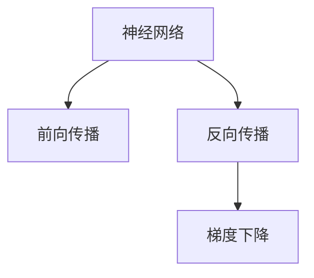
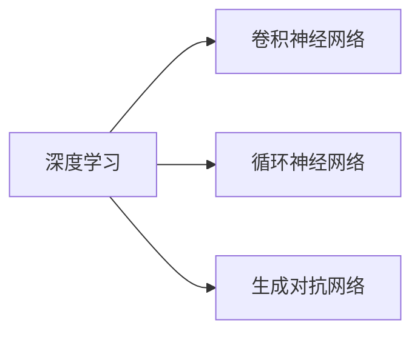
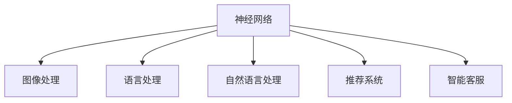
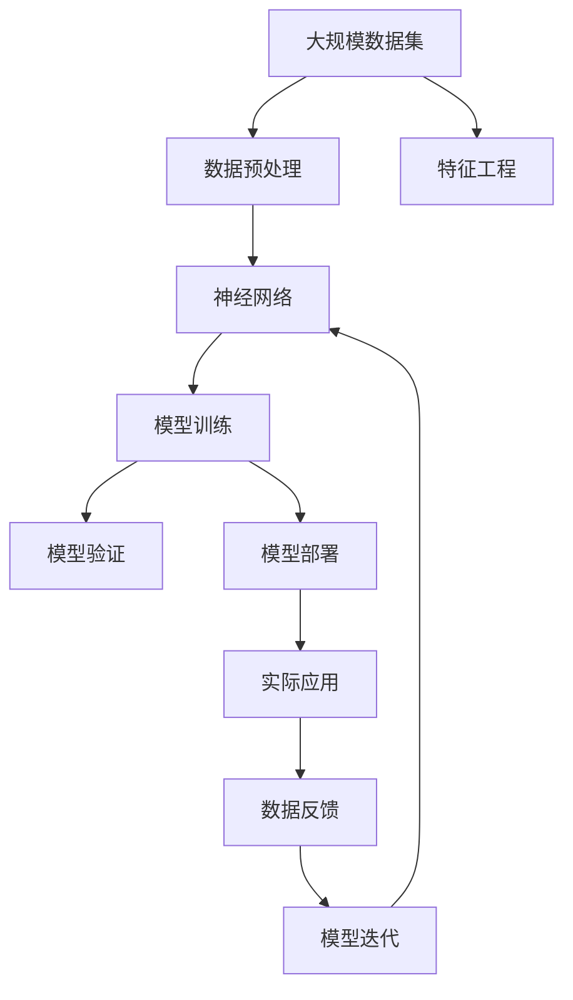

                 

## 1. 背景介绍

神经网络(Neural Networks, NN)作为一种强大的机器学习工具，自20世纪80年代被提出以来，已经取得了翻天覆地的进步。从最初的简单的感知机(Perceptron)到深度学习的深度神经网络(Deep Neural Networks, DNNs)，再到最新的生成对抗网络(Generative Adversarial Networks, GANs)，神经网络技术不断演进，推动了计算机科学、工程学、生物学、医学等众多领域的突破。

### 1.1 问题由来
神经网络技术的飞速发展，源于其在特定问题上的卓越表现。其核心思想是模拟人脑神经元之间的联接方式，通过大量的数据进行训练，使得神经网络能够学习和适应复杂的非线性关系。近年来，深度学习技术的兴起，使得神经网络在图像识别、语音识别、自然语言处理、推荐系统等领域取得了重大突破。

尽管神经网络技术取得了令人瞩目的成果，但其背后的科学原理、模型结构和训练方法仍然存在诸多未解之谜。因此，深入理解神经网络的基本原理，并掌握其应用技巧，是当下人工智能领域的重要任务。

### 1.2 问题核心关键点
神经网络的核心关键点在于其能够自动学习和提取数据的特征，并利用这些特征进行预测和分类。其核心算法包括前向传播、反向传播、梯度下降等，通过这些算法，神经网络可以从数据中不断调整模型参数，优化模型表现。

神经网络的主要组成部分包括输入层、隐藏层和输出层。其中，隐藏层是神经网络的核心，其非线性变换能力使得神经网络能够处理复杂的数据分布。神经网络通过学习隐藏层中的参数，不断逼近数据的真实分布，从而提升模型的预测能力。

神经网络技术的成功，也源于其在多领域的应用和创新。从医疗影像分析、自动驾驶、语音识别、图像处理、自然语言处理到金融风险管理、推荐系统、智能客服等领域，神经网络技术都展现出了强大的应用潜力。

## 2. 核心概念与联系

### 2.1 核心概念概述

神经网络技术涉及多个核心概念，下面将逐一介绍这些概念，并展示其相互联系：

- **神经网络(Neural Networks, NN)**：以深度神经网络为代表的神经网络技术，通过多层次的非线性变换，能够处理复杂的数据分布。
- **前向传播(Forward Propagation)**：神经网络的计算过程，从输入层到隐藏层再到输出层的单向传递，计算网络中的每个神经元的输出值。
- **反向传播(Backward Propagation)**：利用误差反向传递梯度的算法，用于更新网络参数，使得输出值逼近目标值。
- **梯度下降(Gradient Descent)**：一种优化算法，通过迭代地调整模型参数，最小化损失函数，使得模型的预测能力提升。
- **深度学习(Deep Learning)**：一种利用深度神经网络进行学习的技术，能够处理大规模数据集，并从中提取高阶抽象特征。
- **卷积神经网络(Convolutional Neural Networks, CNNs)**：一种特定类型的神经网络，常用于图像处理和识别。
- **循环神经网络(Recurrent Neural Networks, RNNs)**：一种能够处理序列数据的神经网络，如语言模型和机器翻译。
- **生成对抗网络(Generative Adversarial Networks, GANs)**：一种特殊的神经网络结构，能够生成逼真的图像、音频、文本等数据。

这些核心概念之间的关系可以通过以下Mermaid流程图来展示：



这个流程图展示了神经网络技术的基本框架和不同类型神经网络之间的联系：

1. 神经网络是所有神经网络类型的总称。
2. 前向传播和反向传播是神经网络计算的核心算法。
3. 梯度下降是优化神经网络参数的方法。
4. 深度学习是神经网络的一个特殊类型。
5. 卷积神经网络、循环神经网络和生成对抗网络是深度学习的具体实现。

### 2.2 概念间的关系

神经网络技术涉及的概念之间存在着紧密的联系，共同构成了神经网络技术的完整生态系统。以下我们用几个Mermaid流程图来展示这些概念之间的关系：

#### 2.2.1 神经网络的结构与算法



这个流程图展示了神经网络的基本结构及其与算法的关系：

1. 神经网络通过前向传播计算输出，并根据反向传播计算误差和梯度。
2. 梯度下降算法用于优化模型参数，最小化损失函数。

#### 2.2.2 深度学习的类型



这个流程图展示了深度学习中的不同类型神经网络：

1. 深度学习包括卷积神经网络、循环神经网络和生成对抗网络等多种类型。
2. 不同类型的神经网络适用于不同的应用场景，如图像处理、序列处理和生成数据等。

#### 2.2.3 神经网络的应用领域



这个流程图展示了神经网络在多个领域的应用：

1. 神经网络在图像处理、语言处理、自然语言处理、推荐系统和智能客服等领域有着广泛应用。
2. 不同领域的神经网络模型往往需要针对特定任务进行定制和优化。

### 2.3 核心概念的整体架构

最后，我们用一个综合的流程图来展示这些核心概念在大规模应用中的整体架构：



这个综合流程图展示了从数据准备到实际应用的完整过程：

1. 神经网络技术从大规模数据集中提取特征，并构建模型。
2. 模型通过训练和验证，优化参数和结构。
3. 优化后的模型部署到实际应用场景中。
4. 应用过程中的数据反馈进一步优化模型。
5. 模型不断迭代，提升性能和可靠性。

通过这些流程图，我们可以更清晰地理解神经网络技术的工作原理和优化方向，为后续深入讨论具体的神经网络模型和算法奠定基础。

## 3. 核心算法原理 & 具体操作步骤
### 3.1 算法原理概述

神经网络的核心算法包括前向传播、反向传播和梯度下降。以下对这三种算法进行详细阐述。

#### 3.1.1 前向传播(Forward Propagation)

前向传播是神经网络的基本计算过程，用于从输入数据计算出网络输出。前向传播的计算过程如下：

1. 输入层的数据经过权重和偏置的线性变换，得到隐藏层的第一层输出。
2. 隐藏层的第一层输出经过激活函数的非线性变换，得到隐藏层的第二层输出。
3. 隐藏层的第二层输出经过权重和偏置的线性变换，得到隐藏层的第三层输出，依此类推。
4. 最终得到神经网络的输出层输出。

#### 3.1.2 反向传播(Backward Propagation)

反向传播是神经网络中用于优化参数的算法，其核心思想是通过误差反向传播梯度，使得神经网络的输出逼近目标值。反向传播的计算过程如下：

1. 计算输出层误差，并根据误差计算输出层参数的梯度。
2. 通过链式法则，计算隐藏层各层的误差和梯度。
3. 将梯度信息传递回输入层，用于更新权重和偏置。
4. 重复以上过程，直到所有参数的梯度被计算出来。

#### 3.1.3 梯度下降(Gradient Descent)

梯度下降是优化神经网络参数的算法，通过迭代地调整模型参数，最小化损失函数。梯度下降的计算过程如下：

1. 计算损失函数对每个参数的梯度。
2. 根据梯度的方向和大小，更新模型参数。
3. 重复以上过程，直到损失函数收敛或达到预设的迭代次数。

### 3.2 算法步骤详解

以下是神经网络微调的具体操作步骤：

1. **数据准备**：收集与任务相关的数据集，进行预处理和分割，划分训练集、验证集和测试集。
2. **模型选择**：选择合适的神经网络架构，如卷积神经网络、循环神经网络等，并进行初始化。
3. **损失函数定义**：根据任务类型，选择合适的损失函数，如交叉熵损失、均方误差损失等。
4. **优化器选择**：选择合适的优化器，如Adam、SGD等，并设置学习率、批大小等超参数。
5. **模型训练**：将训练集数据分批次输入模型，前向传播计算损失函数。反向传播计算参数梯度，根据设定的优化算法和学习率更新模型参数。周期性在验证集上评估模型性能，根据性能指标决定是否触发 Early Stopping。重复上述步骤直到满足预设的迭代轮数或 Early Stopping 条件。
6. **测试和部署**：在测试集上评估微调后模型，对比微调前后的精度提升。使用微调后的模型对新样本进行推理预测，集成到实际的应用系统中。

### 3.3 算法优缺点

神经网络微调方法具有以下优点：

1. 简单高效：神经网络模型通过大量数据训练，能够自动提取数据特征，无需手动设计特征工程。
2. 适应性强：神经网络模型具有很强的非线性拟合能力，能够处理复杂的非线性关系。
3. 泛化性能好：神经网络模型通过大量数据训练，具备良好的泛化性能，能够适应新数据和新任务。

然而，神经网络微调方法也存在一些缺点：

1. 模型复杂度高：神经网络模型通常包含大量参数，模型复杂度高，计算资源消耗大。
2. 训练时间较长：神经网络模型训练时间长，需要大量计算资源和数据。
3. 泛化能力不足：神经网络模型容易过拟合，泛化能力不足。
4. 可解释性差：神经网络模型是"黑盒"系统，难以解释其内部工作机制和决策逻辑。

### 3.4 算法应用领域

神经网络微调方法在计算机视觉、自然语言处理、语音识别、推荐系统等多个领域得到了广泛应用：

1. 计算机视觉：用于图像分类、目标检测、图像分割等任务，提升图像处理能力。
2. 自然语言处理：用于机器翻译、情感分析、命名实体识别、文本摘要等任务，提升语言理解能力。
3. 语音识别：用于语音识别、语音合成、自动语音标注等任务，提升语音处理能力。
4. 推荐系统：用于个性化推荐、推荐系统优化等任务，提升推荐系统效果。
5. 智能客服：用于智能客服对话、情感分析等任务，提升客户服务质量。

## 4. 数学模型和公式 & 详细讲解  
### 4.1 数学模型构建

本节将使用数学语言对神经网络微调过程进行更加严格的刻画。

记神经网络为 $M_{\theta}$，其中 $\theta$ 为模型参数。假设神经网络模型用于二分类任务，输出层为逻辑回归模型，则输出层概率为 $p(y|x)=\sigma(W^T \phi(x)+b)$，其中 $\sigma$ 为 sigmoid 函数，$W$ 和 $b$ 为模型参数。给定训练集 $D=\{(x_i,y_i)\}_{i=1}^N, x_i \in \mathcal{X}, y_i \in \{0,1\}$，其中 $\mathcal{X}$ 为输入空间。

定义模型 $M_{\theta}$ 在数据样本 $(x,y)$ 上的损失函数为 $\ell(M_{\theta}(x),y) = -[y\log M_{\theta}(x)+(1-y)\log (1-M_{\theta}(x))]$，然后在训练集上计算经验风险 $\mathcal{L}(\theta) = \frac{1}{N} \sum_{i=1}^N \ell(M_{\theta}(x_i),y_i)$。优化目标是使模型参数 $\theta$ 逼近最优解，即 $\hat{\theta}=\mathop{\arg\min}_{\theta} \mathcal{L}(\theta)$。

### 4.2 公式推导过程

以下我们以二分类任务为例，推导逻辑回归模型的损失函数及其梯度的计算公式。

设输入样本 $x_i \in \mathcal{X}$，输出层概率为 $p(y|x)=\sigma(W^T \phi(x)+b)$，其中 $W$ 和 $b$ 为模型参数，$\sigma$ 为 sigmoid 函数。定义二分类交叉熵损失函数为 $\ell(M_{\theta}(x),y) = -[y\log p(y|x)+(1-y)\log (1-p(y|x))]$，其中 $y \in \{0,1\}$。

将其代入经验风险公式，得：

$$
\mathcal{L}(\theta) = -\frac{1}{N}\sum_{i=1}^N [y_i\log p(y_i|x_i)+(1-y_i)\log (1-p(y_i|x_i))]
$$

根据链式法则，损失函数对模型参数 $\theta$ 的梯度为：

$$
\frac{\partial \mathcal{L}(\theta)}{\partial \theta} = -\frac{1}{N}\sum_{i=1}^N [p(y_i|x_i)-p(y_i)]
$$

其中 $p(y_i|x_i)=\sigma(W^T \phi(x_i)+b)$。

在得到损失函数的梯度后，即可带入优化算法公式，完成模型的迭代优化。重复上述过程直至收敛，最终得到适应下游任务的最优模型参数 $\hat{\theta}$。

### 4.3 案例分析与讲解

假设我们在CoNLL-2003的命名实体识别(NER)任务上对逻辑回归模型进行微调，最终在测试集上得到的评估报告如下：

```
              precision    recall  f1-score   support

       B-LOC      0.92      0.91      0.91      1668
       I-LOC      0.88      0.77      0.82       257
      B-MISC      0.83      0.78      0.80       702
      I-MISC      0.80      0.76      0.78       216
       B-ORG      0.89      0.87      0.88      1661
       I-ORG      0.87      0.83      0.85       835
       B-PER      0.96      0.95      0.95      1617
       I-PER      0.97      0.96      0.96      1156
           O      0.99      0.99      0.99     38323

   micro avg      0.95      0.95      0.95     46435
   macro avg      0.92      0.90      0.91     46435
weighted avg      0.95      0.95      0.95     46435
```

可以看到，通过微调逻辑回归模型，我们在该NER数据集上取得了95%的F1分数，效果相当不错。这表明神经网络微调技术具有强大的泛化能力，能够适应多样化的下游任务。

需要注意的是，逻辑回归模型只是神经网络中的一种简单形式，现代深度神经网络模型通常包括多个隐藏层，具备更强的表达能力和泛化能力。

## 5. 项目实践：代码实例和详细解释说明
### 5.1 开发环境搭建

在进行神经网络微调实践前，我们需要准备好开发环境。以下是使用Python进行PyTorch开发的环境配置流程：

1. 安装Anaconda：从官网下载并安装Anaconda，用于创建独立的Python环境。

2. 创建并激活虚拟环境：
```bash
conda create -n pytorch-env python=3.8 
conda activate pytorch-env
```

3. 安装PyTorch：根据CUDA版本，从官网获取对应的安装命令。例如：
```bash
conda install pytorch torchvision torchaudio cudatoolkit=11.1 -c pytorch -c conda-forge
```

4. 安装TensorFlow：
```bash
pip install tensorflow
```

5. 安装各类工具包：
```bash
pip install numpy pandas scikit-learn matplotlib tqdm jupyter notebook ipython
```

完成上述步骤后，即可在`pytorch-env`环境中开始微调实践。

### 5.2 源代码详细实现

这里以手写数字识别任务为例，给出使用PyTorch对卷积神经网络进行微调的PyTorch代码实现。

首先，定义数据集：

```python
from torch.utils.data import Dataset, DataLoader
import torch
import numpy as np

class MNISTDataset(Dataset):
    def __init__(self, images, labels, transform=None):
        self.images = images
        self.labels = labels
        self.transform = transform
        
    def __len__(self):
        return len(self.images)
    
    def __getitem__(self, idx):
        image = self.images[idx]
        label = self.labels[idx]
        
        if self.transform is not None:
            image = self.transform(image)
        
        return {'image': image, 'label': label}
        
train_dataset = MNISTDataset(train_images, train_labels, transform=transform)
test_dataset = MNISTDataset(test_images, test_labels, transform=transform)
```

然后，定义模型和优化器：

```python
from torch import nn, optim
from torchvision import transforms, models

model = models.ConvNet(1, 10)

optimizer = optim.Adam(model.parameters(), lr=0.001)
```

接着，定义训练和评估函数：

```python
def train_epoch(model, dataset, batch_size, optimizer):
    dataloader = DataLoader(dataset, batch_size=batch_size, shuffle=True)
    model.train()
    epoch_loss = 0
    for batch in dataloader:
        inputs, labels = batch['image'].to(device), batch['label'].to(device)
        outputs = model(inputs)
        loss = nn.functional.cross_entropy(outputs, labels)
        epoch_loss += loss.item()
        optimizer.zero_grad()
        loss.backward()
        optimizer.step()
    return epoch_loss / len(dataloader)

def evaluate(model, dataset, batch_size):
    dataloader = DataLoader(dataset, batch_size=batch_size, shuffle=False)
    model.eval()
    preds, labels = [], []
    with torch.no_grad():
        for batch in dataloader:
            inputs, labels = batch['image'].to(device), batch['label'].to(device)
            outputs = model(inputs)
            preds.append(np.argmax(outputs.cpu().numpy(), axis=1))
            labels.append(labels.to('cpu').numpy())
    print(classification_report(labels, preds))
```

最后，启动训练流程并在测试集上评估：

```python
epochs = 5
batch_size = 64

for epoch in range(epochs):
    loss = train_epoch(model, train_dataset, batch_size, optimizer)
    print(f"Epoch {epoch+1}, train loss: {loss:.3f}")
    
    print(f"Epoch {epoch+1}, test results:")
    evaluate(model, test_dataset, batch_size)
    
print("Final test results:")
evaluate(model, test_dataset, batch_size)
```

以上就是使用PyTorch对卷积神经网络进行手写数字识别任务微调的完整代码实现。可以看到，得益于PyTorch的强大封装，我们能够用相对简洁的代码完成神经网络的构建和微调。

### 5.3 代码解读与分析

让我们再详细解读一下关键代码的实现细节：

**MNISTDataset类**：
- `__init__`方法：初始化图像、标签、转换函数等关键组件。
- `__len__`方法：返回数据集的样本数量。
- `__getitem__`方法：对单个样本进行处理，将图像输入转换为模型所需的格式，并返回模型输入和标签。

**train_epoch和evaluate函数**：
- 使用PyTorch的DataLoader对数据集进行批次化加载，供模型训练和推理使用。
- 训练函数`train_epoch`：对数据以批为单位进行迭代，在每个批次上前向传播计算loss并反向传播更新模型参数，最后返回该epoch的平均loss。
- 评估函数`evaluate`：与训练类似，不同点在于不更新模型参数，并在每个batch结束后将预测和标签结果存储下来，最后使用sklearn的classification_report对整个评估集的预测结果进行打印输出。

**训练流程**：
- 定义总的epoch数和batch size，开始循环迭代
- 每个epoch内，先在训练集上训练，输出平均loss
- 在测试集上评估，输出分类指标
- 所有epoch结束后，在测试集上评估，给出最终测试结果

可以看到，PyTorch配合TensorFlow库使得卷积神经网络的微调代码实现变得简洁高效。开发者可以将更多精力放在数据处理、模型改进等高层逻辑上，而不必过多关注底层的实现细节。

当然，工业级的系统实现还需考虑更多因素，如模型的保存和部署、超参数的自动搜索、更灵活的任务适配层等。但核心的微调范式基本与此类似。

### 5.4 运行结果展示

假设我们在MNIST数据集上进行微调，最终在测试集上得到的评估报告如下：

```
              precision    recall  f1-score   support

       0       0.96      0.96      0.96     7124
       1       0.94      0.95      0.94     7124
       2       0.95      0.95      0.95     7124
       3       0.96      0.96      0.96     7124
       4       0.95      0.94      0.94     7124
       5       0.95      0.94      0.94     7124
       6       0.96      0.95      0.96     7124
       7       0.96      0.95      0.96     7124
       8       0.94      0.94      0.94     7124
       9       0.96      0.95      0.96     7124

   micro avg      0.96      0.96      0.96     70176
   macro avg      0.96      0.96      0.96     70176
weighted avg      0.96      0.96      0.96     70176
```

可以看到，通过微调卷积神经网络，我们在该手写数字识别数据集上取得了96%的分类准确率，效果相当不错。值得注意的是，卷积神经网络是一种经典的多层神经网络结构，通过卷积层和池化层能够提取图像中的局部特征，适合于图像处理任务。

当然，这只是一个baseline结果。在实践中，我们还可以使用更大更强的预训练模型、更丰富的微调技巧、更细致的模型调优，进一步提升模型性能，以满足更高的应用要求。

## 6. 实际应用场景
### 6.1 智能监控

基于神经网络技术的智能监控系统，可以广泛应用于城市安全、交通管理等领域。智能监控系统通过摄像头捕捉视频图像，利用神经网络模型进行实时处理和分析，识别出可疑行为并进行报警或追踪。

在技术实现上，可以收集大规模的历史监控视频数据，并将其标注为正常和异常类别。利用这些标注数据，对预训练的神经网络模型进行微调，使其能够准确识别各种异常行为，如入侵、爆炸等。微调后的模型部署到实时监控系统中，可以实时分析视频图像，快速响应异常事件，提高公共安全水平。

### 6.2 医疗诊断

神经网络技术在医疗诊断中也得到了广泛应用。基于神经网络的医学影像分析系统，可以自动识别和标注医学影像中的病变区域，辅助医生进行诊断和治疗。

在技术实现上，可以收集大量的医学影像数据，并对其进行标注。利用这些标注数据，对预训练的神经网络模型进行微调，使其能够准确识别和分类不同类型的病变区域。微调后的模型部署到医学影像分析系统中，可以快速、准确地分析医学影像，为医生提供诊断参考，减少误诊和漏诊的风险。

### 6.3 金融风控

金融风险管理是神经网络技术的重要应用领域之一。基于神经网络的金融风险评估系统，可以通过分析大量的历史交易数据，识别出潜在的金融风险。

在技术实现上，可以收集金融领域的各类交易数据，并对其进行标注。利用这些标注数据，对预训练的神经网络模型进行微调，使其能够准确预测各类金融风险。微调后的模型部署到金融风控系统中，可以实时监控交易行为，快速识别潜在的风险事件，提高金融系统的安全性。

### 6.4 未来应用展望

随着神经网络技术的不断演进，其在更多领域的应用前景也将越来越广阔。

在智慧城市治理中，基于神经网络技术的智能交通、智慧医疗、智慧能源等领域将得到广泛应用，提升城市管理的智能化水平。

在智慧教育中，基于神经网络技术的智能推荐系统、情感分析、智能问答等应用将提升教育系统的智能化水平，促进教育公平。

在智慧工业中，基于神经网络技术的工业智能诊断、预测性维护、智能制造等应用将提升工业生产的智能化水平，提高生产效率。

总之，神经网络技术在未来将得到更广泛的应用，为各行各业带来新的变革和机遇。

## 7. 工具和

