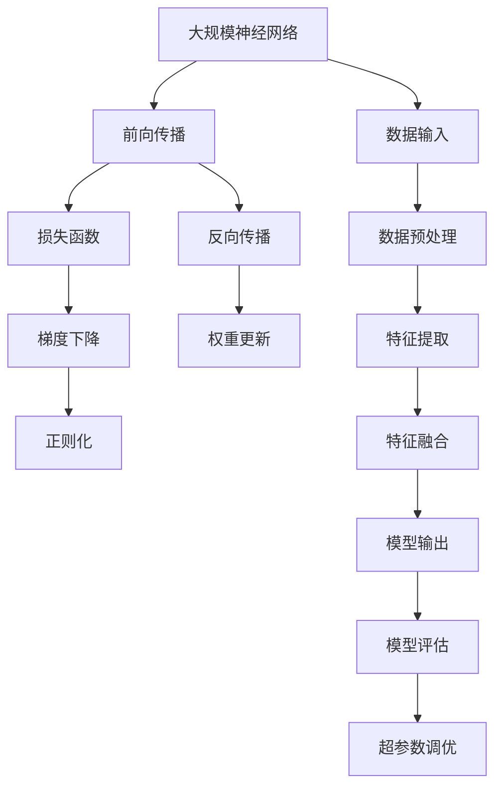

                 

## 1. 背景介绍

### 1.1 问题由来
神经网络（Neural Networks）自20世纪80年代问世以来，便以其强大的学习和表达能力，逐步成为人工智能的核心技术之一。从早期的多层感知机（Multilayer Perceptron, MLP）到卷积神经网络（Convolutional Neural Network, CNN）、循环神经网络（Recurrent Neural Network, RNN）、长短期记忆网络（Long Short-Term Memory, LSTM），再到如今的深度神经网络（Deep Neural Networks, DNNs）和深度学习（Deep Learning）范式，神经网络技术经历了多次升级迭代，其应用领域也从图像处理、语音识别扩展到自然语言处理、推荐系统、无人驾驶等领域。

### 1.2 问题核心关键点
神经网络技术的核心是模拟人类大脑的神经元网络结构，通过学习输入数据的不同特征，输出对应的分类或回归结果。核心关键点包括：

- **神经元（Neuron）**：神经网络的基本单元，接受输入信号，输出加权和。
- **权重（Weight）**：神经元之间连接的强度参数，初始随机生成，通过反向传播算法更新。
- **激活函数（Activation Function）**：非线性变换，引入非线性关系，如Sigmoid、ReLU等。
- **损失函数（Loss Function）**：衡量模型预测结果与真实结果之间的差异，如均方误差、交叉熵等。
- **反向传播算法（Backpropagation）**：通过链式法则计算损失函数对权重和偏置的梯度，从而更新模型参数。
- **梯度下降（Gradient Descent）**：最小化损失函数的优化算法，包括批量梯度下降（BGD）、随机梯度下降（SGD）、动量优化（Momentum）等。

神经网络技术的发展，从根本上改变了计算科学与工程领域的面貌，带来了诸如深度学习、计算机视觉、自然语言处理等前沿领域的迅猛进步。神经网络不仅在学术界备受瞩目，更在工业界大放异彩，广泛应用于图像识别、语音识别、推荐系统、智能客服、自动驾驶等多个领域。

### 1.3 问题研究意义
神经网络技术的研究和应用具有重大的理论和实际意义：

1. **推动科学进步**：神经网络技术结合了神经科学、统计学、计算机科学等领域的理论基础，为认知科学、神经工程等领域提供了新的研究工具和方向。
2. **增强生产力**：在工业界，神经网络能够自动处理和分析大量数据，提升决策效率和生产能力。
3. **变革服务模式**：在消费和社交媒体领域，神经网络技术推动了个性化推荐、语音交互、智能客服等新服务模式的出现，极大地提升了用户体验。
4. **促进社会进步**：在医疗、金融、城市管理等领域，神经网络技术提供了更为精准的预测和决策支持，助力社会治理和公共服务的智能化转型。

## 2. 核心概念与联系

### 2.1 核心概念概述

为了更好地理解神经网络技术的原理和应用，本节将介绍几个核心概念：

- **神经网络（Neural Network）**：由多个神经元（Neuron）通过有向边连接构成的图结构，用于处理输入数据，并输出相应的结果。
- **前向传播（Forward Propagation）**：将输入数据逐层传递，通过激活函数计算，得到最终输出结果的过程。
- **反向传播（Backpropagation）**：通过链式法则计算损失函数对权重和偏置的梯度，从而更新模型参数的过程。
- **损失函数（Loss Function）**：衡量模型预测结果与真实结果之间的差异，如均方误差（MSE）、交叉熵（Cross-Entropy）等。
- **梯度下降（Gradient Descent）**：一种优化算法，通过迭代调整模型参数，最小化损失函数，实现模型训练。
- **正则化（Regularization）**：通过引入惩罚项，防止模型过拟合，如L1正则、L2正则等。
- **过拟合（Overfitting）**：模型在训练集上表现良好，但在测试集上表现差的现象。
- **欠拟合（Underfitting）**：模型无法充分拟合训练数据，导致在训练集和测试集上表现都较差的现象。
- **深度学习（Deep Learning）**：基于多层神经网络的机器学习方法，通过多层次的特征提取和表示学习，提高模型的表达能力和泛化能力。

这些核心概念通过以下Mermaid流程图来展示它们之间的联系：

```mermaid
graph TB
    A[神经元 (Neuron)] --> B[前向传播 (Forward Propagation)]
    A --> C[权重 (Weight)]
    A --> D[激活函数 (Activation Function)]
    B --> E[损失函数 (Loss Function)]
    C --> F[反向传播 (Backpropagation)]
    D --> F
    E --> G[梯度下降 (Gradient Descent)]
    G --> H[正则化 (Regularization)]
    H --> I[过拟合 (Overfitting)]
    I --> J[欠拟合 (Underfitting)]
    J --> K[深度学习 (Deep Learning)]
```

### 2.2 概念间的关系

神经网络的核心概念之间存在着紧密的联系，形成了神经网络技术的完整生态系统。以下是它们之间的进一步解释：

- **前向传播**：从输入层到输出层，逐层传递输入数据，并通过激活函数计算得到最终输出。
- **反向传播**：利用前向传播的结果，计算损失函数对权重和偏置的梯度，并通过梯度下降等优化算法更新模型参数。
- **损失函数**：衡量模型预测结果与真实结果之间的差异，用于优化模型性能。
- **梯度下降**：最小化损失函数的优化算法，通过迭代调整模型参数，实现模型的训练。
- **正则化**：防止模型过拟合，通过引入惩罚项，平衡模型复杂度和泛化能力。
- **过拟合与欠拟合**：模型的训练和泛化问题，需要通过正则化和超参数调优来平衡。
- **深度学习**：通过多层次的特征提取和表示学习，提高模型的表达能力和泛化能力，是目前神经网络技术的主要发展方向。

这些概念共同构成了神经网络技术的核心框架，为模型训练和优化提供了理论基础和实践指导。

### 2.3 核心概念的整体架构

最后，我们用一个综合的流程图来展示这些核心概念在大规模神经网络技术中的整体架构：



这个综合流程图展示了从数据输入到模型输出的完整过程，以及其中涉及的训练、优化、评估等各个环节。通过这些流程图，我们可以更清晰地理解神经网络技术的工作原理和优化方向。

## 3. 核心算法原理 & 具体操作步骤

### 3.1 算法原理概述

神经网络的核心算法原理是通过学习输入数据的不同特征，输出对应的分类或回归结果。其基本步骤如下：

1. **数据预处理**：将原始数据转换为模型可以处理的形式，如标准化、归一化、特征提取等。
2. **模型初始化**：随机初始化权重和偏置，通常使用Xavier初始化或He初始化。
3. **前向传播**：输入数据逐层传递，通过激活函数计算，得到最终输出结果。
4. **损失计算**：将模型输出与真实结果进行对比，计算损失函数，如均方误差（MSE）、交叉熵（Cross-Entropy）等。
5. **反向传播**：利用前向传播的结果，计算损失函数对权重和偏置的梯度，并通过梯度下降等优化算法更新模型参数。
6. **模型评估**：在验证集或测试集上评估模型性能，如准确率、精度、召回率等。
7. **超参数调优**：通过网格搜索、随机搜索等方法，优化模型的超参数，如学习率、批次大小、正则化系数等。

### 3.2 算法步骤详解

下面是神经网络模型训练和优化的详细步骤：

#### 3.2.1 数据准备

数据准备是神经网络模型训练的第一步，包括数据清洗、特征提取、数据分割等。具体步骤如下：

1. **数据清洗**：去除数据中的噪声和异常值，保证数据的质量和一致性。
2. **特征提取**：将原始数据转换为模型可以处理的形式，如将文本转换为词向量、图像转换为卷积特征等。
3. **数据分割**：将数据集分为训练集、验证集和测试集，通常采用70%训练集、15%验证集、15%测试集的比例。

#### 3.2.2 模型初始化

模型初始化通过随机生成权重和偏置来实现。具体步骤如下：

1. **权重初始化**：权重初始化通常使用Xavier初始化或He初始化，以保证模型在训练过程中的稳定性。
2. **偏置初始化**：偏置初始化通常为0或正态分布，以保证模型在初始状态下的平衡性。

#### 3.2.3 前向传播

前向传播是将输入数据逐层传递，通过激活函数计算，得到最终输出结果。具体步骤如下：

1. **输入数据**：将预处理后的输入数据传递到第一层神经元。
2. **逐层传递**：每一层神经元接收上一层神经元的输出，并应用激活函数进行非线性变换。
3. **输出结果**：最终输出结果为模型预测的结果。

#### 3.2.4 损失计算

损失计算是将模型输出与真实结果进行对比，计算损失函数的过程。具体步骤如下：

1. **定义损失函数**：根据任务类型，选择适当的损失函数，如均方误差（MSE）、交叉熵（Cross-Entropy）等。
2. **计算损失值**：将模型输出与真实结果代入损失函数，计算损失值。

#### 3.2.5 反向传播

反向传播是通过链式法则计算损失函数对权重和偏置的梯度，从而更新模型参数。具体步骤如下：

1. **计算梯度**：通过反向传播算法计算损失函数对权重和偏置的梯度。
2. **更新参数**：使用梯度下降等优化算法更新模型参数，如SGD、Adam等。
3. **迭代优化**：重复上述过程，直到模型收敛。

#### 3.2.6 模型评估

模型评估是在验证集或测试集上评估模型性能的过程。具体步骤如下：

1. **评估指标**：根据任务类型，选择适当的评估指标，如准确率、精度、召回率等。
2. **计算指标**：将模型输出与真实结果进行对比，计算评估指标。
3. **模型调优**：根据评估结果，调整模型超参数，优化模型性能。

#### 3.2.7 超参数调优

超参数调优是通过网格搜索、随机搜索等方法，优化模型的超参数。具体步骤如下：

1. **选择超参数**：根据任务类型，选择适当的超参数，如学习率、批次大小、正则化系数等。
2. **调优方法**：使用网格搜索、随机搜索等方法，寻找最优超参数组合。
3. **验证结果**：在验证集上评估调优后的模型性能，选择最优模型。

### 3.3 算法优缺点

神经网络模型具有以下优点：

1. **强大的表达能力**：通过多层结构，能够学习到数据中的复杂特征和关系，提高模型的泛化能力。
2. **自适应学习**：能够自动学习数据中的特征和规律，不需要人工干预，适用于大规模数据的处理。
3. **灵活性高**：可以通过不同结构的网络模型和激活函数，适应不同的任务和数据。

同时，神经网络模型也存在以下缺点：

1. **参数量大**：模型的参数数量通常很大，需要大量计算资源和存储空间。
2. **训练时间长**：模型训练需要较长时间，特别是在数据量大、网络深度高的情况下。
3. **过拟合风险**：模型容易过拟合，特别是在训练数据不足或超参数调优不当的情况下。

### 3.4 算法应用领域

神经网络技术在多个领域得到了广泛应用，包括：

- **计算机视觉**：用于图像识别、物体检测、图像分割等任务，如卷积神经网络（CNN）、R-CNN、Faster R-CNN等。
- **自然语言处理**：用于文本分类、语言建模、机器翻译等任务，如循环神经网络（RNN）、长短期记忆网络（LSTM）、Transformer等。
- **语音识别**：用于语音识别、语音合成等任务，如卷积神经网络（CNN）、循环神经网络（RNN）、端到端神经网络等。
- **推荐系统**：用于个性化推荐、商品推荐等任务，如协同过滤（Collaborative Filtering）、深度学习推荐系统（DRLR）等。
- **自然语言生成**：用于文本生成、对话生成等任务，如语言模型（LM）、生成对抗网络（GAN）等。

这些领域的应用展示了神经网络技术的强大潜力和广泛应用前景。

## 4. 数学模型和公式 & 详细讲解 & 举例说明

### 4.1 数学模型构建

神经网络模型的数学模型通常包括以下几个组成部分：

- **输入层**：接收原始数据，如输入向量 $x$。
- **隐藏层**：通过权重和偏置进行特征提取，如隐藏层神经元 $h_1, h_2, ..., h_n$。
- **输出层**：将隐藏层特征映射到输出结果，如输出向量 $y$。

神经网络模型的数学表达式可以表示为：

$$
y = f(W_1x + b_1) * W_2 + b_2
$$

其中 $f$ 为激活函数，$W_1$ 和 $b_1$ 为第一层的权重和偏置，$W_2$ 和 $b_2$ 为第二层的权重和偏置。

### 4.2 公式推导过程

以下是对神经网络模型中前向传播和反向传播的数学推导：

#### 4.2.1 前向传播

前向传播的数学推导如下：

$$
z^{(l)} = W^{(l)}x^{(l-1)} + b^{(l)}
$$

$$
a^{(l)} = g(z^{(l)})
$$

其中 $z^{(l)}$ 为第 $l$ 层的线性变换结果，$a^{(l)}$ 为第 $l$ 层的激活结果，$g$ 为激活函数。

#### 4.2.2 反向传播

反向传播的数学推导如下：

$$
\frac{\partial L}{\partial z^{(l)}} = \frac{\partial L}{\partial a^{(l+1)}} * \frac{\partial a^{(l+1)}}{\partial z^{(l)}}
$$

$$
\frac{\partial L}{\partial W^{(l)}} = \frac{\partial L}{\partial z^{(l)}} * \frac{\partial z^{(l)}}{\partial x^{(l-1)}} = \frac{\partial L}{\partial a^{(l)}} * \frac{\partial a^{(l)}}{\partial z^{(l)}} * g'(z^{(l)})
$$

$$
\frac{\partial L}{\partial b^{(l)}} = \frac{\partial L}{\partial z^{(l)}} * 1 = \frac{\partial L}{\partial a^{(l)}} * \frac{\partial a^{(l)}}{\partial z^{(l)}}
$$

其中 $L$ 为损失函数，$g'$ 为激活函数的导数。

### 4.3 案例分析与讲解

以简单的线性回归任务为例，分析神经网络模型的训练过程：

1. **数据准备**：准备一组训练样本 $(x_1, y_1), (x_2, y_2), ..., (x_n, y_n)$。
2. **模型初始化**：随机初始化权重 $W$ 和偏置 $b$。
3. **前向传播**：计算预测结果 $\hat{y} = Wx + b$。
4. **损失计算**：计算损失函数 $L = \frac{1}{2}(x - \hat{y})^2$。
5. **反向传播**：计算梯度 $\frac{\partial L}{\partial W} = \frac{\partial L}{\partial x} * \frac{\partial x}{\partial W}$，更新权重和偏置。
6. **模型评估**：在测试集上评估模型性能，如均方误差（MSE）。

## 5. 项目实践：代码实例和详细解释说明

### 5.1 开发环境搭建

在进行神经网络模型训练和优化之前，我们需要准备好开发环境。以下是使用Python进行TensorFlow开发的环境配置流程：

1. 安装Anaconda：从官网下载并安装Anaconda，用于创建独立的Python环境。

2. 创建并激活虚拟环境：
```bash
conda create -n tensorflow-env python=3.8 
conda activate tensorflow-env
```

3. 安装TensorFlow：根据CUDA版本，从官网获取对应的安装命令。例如：
```bash
conda install tensorflow tensorflow-gpu -c tf
```

4. 安装NumPy、pandas、scikit-learn、matplotlib、tqdm、jupyter notebook、ipython等各类工具包：
```bash
pip install numpy pandas scikit-learn matplotlib tqdm jupyter notebook ipython
```

完成上述步骤后，即可在`tensorflow-env`环境中开始神经网络模型的开发。

### 5.2 源代码详细实现

这里我们以线性回归任务为例，给出使用TensorFlow实现神经网络模型的PyTorch代码实现。

首先，定义训练集和测试集：

```python
import tensorflow as tf
import numpy as np

# 定义训练集和测试集
train_X = np.array([[1.0], [2.0], [3.0], [4.0], [5.0]])
train_y = np.array([2.0, 4.0, 6.0, 8.0, 10.0])
test_X = np.array([[6.0], [7.0], [8.0], [9.0], [10.0]])
test_y = np.array([12.0, 14.0, 16.0, 18.0, 20.0])
```

然后，定义模型和优化器：

```python
# 定义线性回归模型
def linear_regression(input_dim):
    model = tf.keras.Sequential([
        tf.keras.layers.Dense(units=1, input_dim=input_dim)
    ])
    return model

# 定义优化器
optimizer = tf.keras.optimizers.SGD(learning_rate=0.01)
```

接着，定义训练和评估函数：

```python
# 定义训练函数
def train_model(model, x_train, y_train, x_test, y_test, epochs):
    train_losses = []
    test_losses = []
    for epoch in range(epochs):
        # 前向传播和损失计算
        with tf.GradientTape() as tape:
            y_pred = model(x_train)
            loss = tf.reduce_mean(tf.square(y_pred - y_train))
        # 反向传播和参数更新
        gradients = tape.gradient(loss, model.trainable_variables)
        optimizer.apply_gradients(zip(gradients, model.trainable_variables))
        # 保存损失值
        train_losses.append(loss)
        # 评估模型性能
        with tf.GradientTape() as tape:
            y_pred = model(x_test)
            loss = tf.reduce_mean(tf.square(y_pred - y_test))
        test_losses.append(loss)
    return train_losses, test_losses

# 训练模型
model = linear_regression(1)
train_losses, test_losses = train_model(model, train_X, train_y, test_X, test_y, epochs=100)

# 绘制损失曲线
plt.plot(train_losses, label='Train Loss')
plt.plot(test_losses, label='Test Loss')
plt.legend()
plt.show()
```

最后，启动训练流程并在测试集上评估：

```python
# 评估模型性能
test_predictions = model(test_X)
test_mse = tf.reduce_mean(tf.square(test_predictions - test_y))
print(f'Test MSE: {test_mse.numpy()}")
```

以上就是使用TensorFlow实现线性回归任务的完整代码实现。可以看到，得益于TensorFlow的强大封装，我们能够用相对简洁的代码完成神经网络模型的搭建和训练。

### 5.3 代码解读与分析

让我们再详细解读一下关键代码的实现细节：

**线性回归模型**：
- 定义一个单层神经网络模型，包含一个全连接层。
- 使用均方误差作为损失函数。

**训练函数**：
- 通过GradientTape记录前向传播和损失计算过程。
- 使用优化器更新模型参数。
- 保存每个epoch的训练损失和测试损失。

**训练流程**：
- 初始化模型和优化器。
- 在训练集上训练模型，输出训练损失。
- 在测试集上评估模型性能，输出测试损失。
- 可视化损失曲线。

**评估模型性能**：
- 在测试集上评估模型性能，输出均方误差。

可以看到，TensorFlow提供了便捷的API和功能，使得神经网络模型的开发和训练变得简单高效。在实际应用中，还需要结合具体任务，进行进一步的模型优化和超参数调优，以获得更好的性能。

## 6. 实际应用场景

### 6.1 图像识别

神经网络技术在图像识别领域取得了巨大成功。卷积神经网络（CNN）通过卷积层和池化层，对图像特征进行提取和降维，从而实现了高效的图像分类和目标检测。常见的应用场景包括：

- **手写数字识别**：MNIST数据集上的手写数字识别任务，使用了多层卷积和池化层，获得了98%以上的识别准确率。
- **物体检测**：R-CNN、Fast R-CNN、Faster R-CNN等模型，通过区域提议和RoI池化等技术，实现了精确的目标检测和定位。
- **图像分割**：U-Net模型通过编码器和解码器结构，实现了像素级别的图像分割。

### 6.2 语音识别

神经网络技术在语音识别领域也得到了广泛应用。基于深度学习的语音识别模型，通过时间序列的卷积和LSTM等结构，对音频特征进行建模，从而实现了高精度的语音识别和合成。常见的应用场景包括：

- **语音转文本**：使用RNN、LSTM等模型，将语音信号转换为文本序列，广泛应用于智能语音助手、语音识别等场景。
- **文本转语音**：使用GAN、WaveNet等模型，将文本转换为自然流畅的语音，广泛应用于语音合成、智能客服等场景。
- **语音情感分析**：使用深度学习模型，对语音信号进行情感分类，广泛应用于情绪识别、情感分析等场景。

### 6.3 自然语言处理

神经网络技术在自然语言处理领域的应用包括文本分类、机器翻译、情感分析等任务。基于深度学习的NLP模型，通过RNN、LSTM、Transformer等结构，对文本特征进行建模，从而实现了高效的NLP任务处理。常见的应用场景包括：

- **文本分类**：使用LSTM、GRU等模型，对文本进行分类，广泛应用于垃圾邮件过滤、情感分析等场景。
- **机器翻译**：使用Transformer等模型，对文本进行翻译，广泛应用于多语言翻译、智能客服等场景。
- **情感分析**：使用CNN、RNN等模型，对文本进行情感分析，广泛应用于舆情分析、情感预测等场景。

### 6.4 推荐系统

神经网络技术在推荐系统领域也有着广泛应用。基于深度学习的推荐模型，通过协同过滤、基于内容的推荐等技术，对用户行为和物品属性进行建模，从而实现了个性化的推荐。常见的应用场景包括：

- **协同过滤**：使用基于矩阵分解的模型，对用户行为进行建模，实现了高效的推荐。
- **基于内容的推荐**：使用CNN、RNN等模型，对物品属性进行建模，实现了更精准的推荐。
- **混合推荐**：结合协同过滤和基于内容的推荐，实现了更全面和精准的推荐。

## 7. 工具和资源推荐

### 7.1 学习资源推荐

为了帮助开发者系统掌握神经网络技术的理论基础和实践技巧，这里推荐一些优质的学习资源：

1. **《深度学习》课程**：斯坦福大学李飞飞教授的《深度学习》课程，涵盖了深度学习的基本概念和经典模型，是学习深度学习技术的绝佳资源。

2. **TensorFlow官方文档**：TensorFlow的官方文档，提供了详细的API参考和教程，是深度学习开发的必备资料。

3. **PyTorch官方文档**：PyTorch的官方文档，提供了丰富的示例和API参考，适合Python开发者使用。

4. **《神经网络与深度学习》书籍**：由深度学习领域的权威人士Michael Nielsen所著，系统介绍了神经网络的基本原理和深度学习技术，是深度学习学习的经典入门书籍。

5. **《Deep Learning Specialization》课程**：由深度学习领域的权威人士Andrew Ng教授所讲授的深度学习专项课程，覆盖了深度学习的基本概念和高级模型，是深度学习学习的全面资源。

通过对这些资源的学习实践，相信你一定能够快速掌握神经网络技术的精髓，并用于解决实际的深度学习问题。

### 7.2 开发工具推荐

高效的开发离不开优秀的工具支持。以下是几款用于深度学习开发常用的工具：

1. **TensorFlow**：由Google主导开发的深度学习框架，支持分布式计算和GPU

