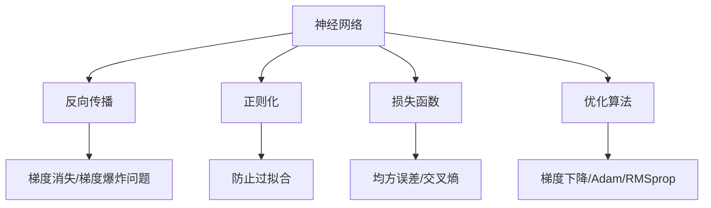
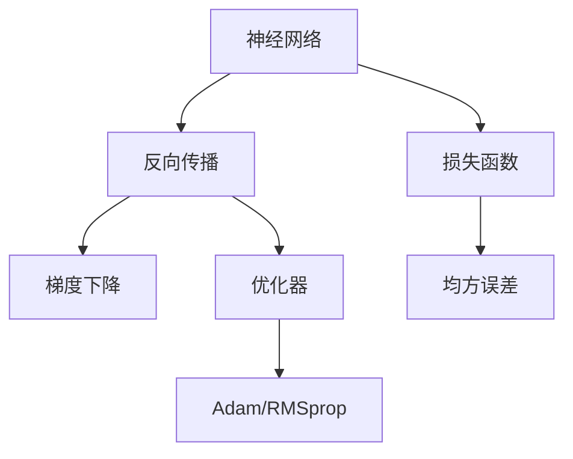
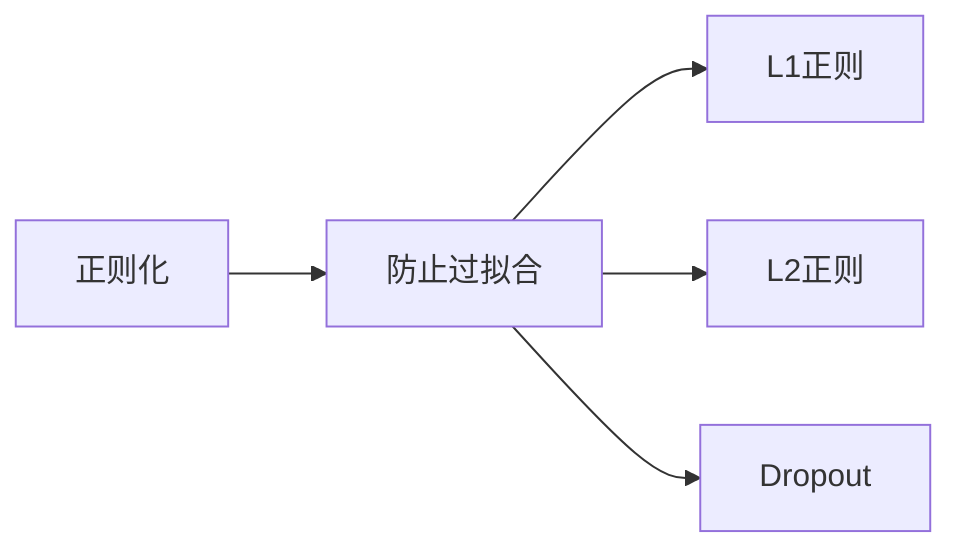
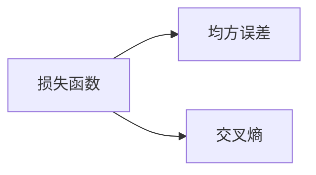
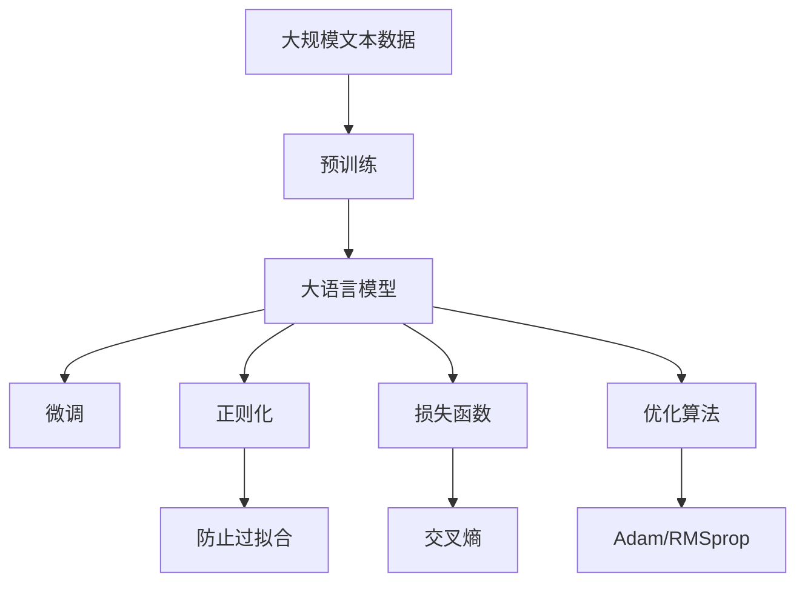

                 

# 神经网络：机器学习的新范式

在人工智能的浩瀚海洋中，神经网络以其强大的学习能力和广泛的适用性，成为了机器学习领域的新范式。本文将从背景介绍、核心概念、算法原理、项目实践、应用场景及未来展望等多个角度，深入探讨神经网络在机器学习中的应用及其未来发展方向。

## 1. 背景介绍

### 1.1 问题由来

人工智能的发展经历了符号主义、连接主义和进化计算三个阶段。其中，神经网络作为连接主义的核心，以其独特的结构和学习能力，逐渐成为机器学习的主流技术。神经网络的诞生，可以追溯到20世纪50年代的早期研究，但直到80年代，由于硬件和算法限制，神经网络的发展一度停滞。直到深度学习技术的兴起，神经网络再次焕发活力，并以其优越的性能和广泛的应用，占据了机器学习领域的核心地位。

### 1.2 问题核心关键点

神经网络在机器学习中的应用，主要体现在以下几个关键点：
1. 强大的非线性表达能力。神经网络能够通过多层非线性变换，逼近任意复杂的函数，解决了传统线性模型难以处理非线性问题的缺陷。
2. 高效的参数共享机制。神经网络通过参数共享和权重共享，显著减少了需要优化参数的数量，提升了模型的训练效率和泛化能力。
3. 丰富的网络结构和优化算法。神经网络结构多样，包括前馈网络、卷积神经网络、循环神经网络等。与之配套的优化算法，如梯度下降、Adam、RMSprop等，为神经网络的训练提供了坚实的数学基础。

神经网络以其独特的优势，广泛应用于图像识别、自然语言处理、语音识别、推荐系统等诸多领域，成为了机器学习的重要工具。

## 2. 核心概念与联系

### 2.1 核心概念概述

为更好地理解神经网络在机器学习中的应用，本节将介绍几个密切相关的核心概念：

- 神经网络(Neural Network)：由多层神经元(神经元层)和连接权重组成的计算图结构。每个神经元接收输入，通过激活函数计算输出，并传递给下一层。
- 反向传播(Backpropagation)：神经网络的训练算法，通过链式法则计算梯度，反向传播误差信息，更新网络参数，实现模型训练。
- 梯度消失和梯度爆炸问题：由于权重传递过程中乘积链式计算，神经网络容易出现梯度传递过于剧烈或消失的问题，影响训练效果。
- 正则化(Regularization)：通过添加正则项，抑制模型复杂度，防止过拟合。常见的正则化方法包括L1正则、L2正则、Dropout等。
- 损失函数(Loss Function)：用于评估模型预测输出与真实标签之间的差异，常见损失函数包括均方误差、交叉熵等。
- 优化算法(Optimization Algorithm)：用于更新模型参数，使损失函数最小化。常见的优化算法包括梯度下降、Adam、RMSprop等。

这些核心概念之间的逻辑关系可以通过以下Mermaid流程图来展示：



这个流程图展示了大语言模型的核心概念及其之间的关系：

1. 神经网络通过反向传播和梯度下降等训练算法不断优化，学习输入与输出之间的关系。
2. 正则化技术帮助抑制模型复杂度，防止过拟合。
3. 损失函数用于衡量模型预测输出与真实标签之间的差异。
4. 优化算法通过计算梯度，更新网络参数，最小化损失函数。
5. 梯度消失和梯度爆炸问题需要通过特定的优化技术或网络结构来解决。

### 2.2 概念间的关系

这些核心概念之间存在着紧密的联系，形成了神经网络的完整生态系统。下面我通过几个Mermaid流程图来展示这些概念之间的关系。

#### 2.2.1 神经网络的训练过程



这个流程图展示了神经网络的训练过程，包括反向传播和梯度下降等核心步骤。

#### 2.2.2 正则化技术的作用



这个流程图展示了正则化技术在神经网络中的应用，包括L1正则、L2正则和Dropout等方法。

#### 2.2.3 损失函数的选择



这个流程图展示了神经网络中常用的损失函数，包括均方误差和交叉熵等。

### 2.3 核心概念的整体架构

最后，我们用一个综合的流程图来展示这些核心概念在大语言模型微调过程中的整体架构：



这个综合流程图展示了从预训练到大语言模型微调，再到正则化和优化算法的完整过程。神经网络通过预训练获得基础能力，再通过微调适应特定任务，正则化和优化算法则帮助模型训练过程稳定、高效。

## 3. 核心算法原理 & 具体操作步骤
### 3.1 算法原理概述

神经网络通过多层非线性变换，逼近任意复杂的函数。其核心思想是将输入数据映射到高维特征空间，通过多层神经元学习输入与输出之间的映射关系。神经网络的学习过程是通过反向传播算法，计算损失函数对每个神经元的梯度，更新权重参数，使得模型预测输出尽可能逼近真实标签。

具体而言，假设输入为 $x$，输出为 $y$，神经网络模型为 $M_{\theta}$，其中 $\theta$ 为网络参数。训练数据集为 $D=\{(x_i, y_i)\}_{i=1}^N$。定义损失函数为 $\mathcal{L}(\theta)$，优化目标是最小化损失函数，即：

$$
\theta^* = \mathop{\arg\min}_{\theta} \mathcal{L}(\theta)
$$

在实践中，我们通常使用梯度下降等优化算法来近似求解上述最优化问题。设 $\eta$ 为学习率，则参数的更新公式为：

$$
\theta \leftarrow \theta - \eta \nabla_{\theta}\mathcal{L}(\theta)
$$

其中 $\nabla_{\theta}\mathcal{L}(\theta)$ 为损失函数对参数 $\theta$ 的梯度，可通过反向传播算法高效计算。

### 3.2 算法步骤详解

神经网络的训练过程一般包括以下几个关键步骤：

1. **数据预处理**：将原始数据转换为神经网络可处理的形式，如图像数据经过归一化、扩充等操作，文本数据经过分词、向量化等操作。
2. **搭建模型**：选择合适的神经网络结构，并定义网络参数。常见的结构包括前馈网络、卷积神经网络、循环神经网络等。
3. **初始化参数**：随机初始化网络参数，通常使用高斯分布或均匀分布。
4. **前向传播**：将输入数据通过网络进行正向传递，计算每个神经元的输出。
5. **计算损失**：将模型预测输出与真实标签计算损失函数，衡量预测误差。
6. **反向传播**：通过链式法则计算损失函数对每个神经元的梯度，更新权重参数。
7. **参数更新**：根据优化算法和损失函数，更新网络参数。
8. **模型评估**：在测试集上评估模型性能，如准确率、精度、召回率等指标。
9. **超参数调优**：根据模型评估结果，调整学习率、正则化强度、网络结构等超参数，优化模型性能。

### 3.3 算法优缺点

神经网络在机器学习中具有以下优点：
1. 强大的非线性表达能力。神经网络能够逼近任意复杂的函数，解决了传统线性模型难以处理非线性问题的缺陷。
2. 高效的参数共享机制。神经网络通过参数共享和权重共享，显著减少了需要优化参数的数量，提升了模型的训练效率和泛化能力。
3. 丰富的网络结构和优化算法。神经网络结构多样，包括前馈网络、卷积神经网络、循环神经网络等。与之配套的优化算法，如梯度下降、Adam、RMSprop等，为神经网络的训练提供了坚实的数学基础。

但神经网络也存在以下缺点：
1. 模型复杂度高。神经网络的参数量通常较大，训练和推理的计算开销较大。
2. 黑箱特性。神经网络通常被视为"黑盒"模型，难以解释其内部工作机制和决策逻辑。
3. 过拟合风险。神经网络容易过拟合训练数据，泛化能力有限。

### 3.4 算法应用领域

神经网络在机器学习中的应用非常广泛，涵盖了图像识别、自然语言处理、语音识别、推荐系统等多个领域。具体应用场景包括：

- 图像分类：如物体识别、场景分类、人脸识别等。通过卷积神经网络对图像特征进行提取和分类。
- 目标检测：如检测图像中的物体位置、数量等。使用区域提议网络(RPN)、YOLO等算法进行检测。
- 语音识别：如语音转文本、语音情感分析等。通过循环神经网络对语音信号进行建模和分析。
- 自然语言处理：如文本分类、情感分析、机器翻译等。通过循环神经网络、Transformer等结构对自然语言进行建模和处理。
- 推荐系统：如协同过滤、基于内容的推荐等。通过神经网络学习用户兴趣和物品特征，进行推荐。
- 强化学习：如自动驾驶、游戏AI等。通过神经网络学习环境状态与行为之间的映射关系，优化决策策略。

除此之外，神经网络在医学影像分析、金融风险预测、社会网络分析等诸多领域也得到了广泛应用。

## 4. 数学模型和公式 & 详细讲解  
### 4.1 数学模型构建

神经网络的数学模型主要由以下几个部分组成：

- **输入层**：接收原始数据，将数据转换为神经网络可处理的形式。
- **隐藏层**：通过多层神经元进行特征提取和特征学习，实现非线性变换。
- **输出层**：将隐藏层的特征映射到最终的输出，如分类、回归等。

假设神经网络的输入为 $x$，输出为 $y$，神经网络模型为 $M_{\theta}$，其中 $\theta$ 为网络参数。网络参数 $\theta$ 由每个神经元的权重组成，通常使用矩阵形式表示。网络结构可以表示为：

$$
M_{\theta}(x) = f(W_l \cdots f(W_1 x + b_1) + b_2)
$$

其中 $f$ 为激活函数，$W$ 和 $b$ 为权重矩阵和偏置向量。

### 4.2 公式推导过程

以简单的二分类任务为例，进行详细推导。

假设输入为 $x$，输出为 $y$，神经网络模型为 $M_{\theta}$，其中 $\theta$ 为网络参数。假设输出层只有一个神经元，输出为 $z$，激活函数为sigmoid函数。网络结构可以表示为：

$$
z = W_2 \cdot f(W_1 x + b_1) + b_2
$$

其中 $W_1$ 和 $W_2$ 为权重矩阵，$b_1$ 和 $b_2$ 为偏置向量，$f$ 为sigmoid函数。

二分类任务的损失函数为交叉熵损失：

$$
\mathcal{L}(\theta) = -\frac{1}{N}\sum_{i=1}^N [y_i \log \sigma(z_i) + (1-y_i) \log (1-\sigma(z_i))]
$$

其中 $\sigma(z)$ 为sigmoid函数的输出，$y_i$ 为真实标签，$\log$ 为自然对数。

梯度下降算法更新参数的公式为：

$$
\theta \leftarrow \theta - \eta \nabla_{\theta}\mathcal{L}(\theta)
$$

其中 $\eta$ 为学习率，$\nabla_{\theta}\mathcal{L}(\theta)$ 为损失函数对参数 $\theta$ 的梯度。

### 4.3 案例分析与讲解

以图像分类任务为例，详细讲解神经网络的训练过程。

首先，对原始图像数据进行预处理，如归一化、扩充等操作。然后，搭建一个卷积神经网络(CNN)，并随机初始化参数。输入图像经过多个卷积层和池化层，提取特征，最终经过全连接层输出分类结果。

在训练过程中，使用反向传播算法计算损失函数对每个神经元的梯度，更新权重参数。使用Adam优化算法和交叉熵损失函数，不断优化模型性能。

训练完成后，在测试集上评估模型性能，如准确率、精度、召回率等指标。通过超参数调优，进一步提升模型性能。

## 5. 项目实践：代码实例和详细解释说明
### 5.1 开发环境搭建

在进行神经网络项目实践前，我们需要准备好开发环境。以下是使用Python进行PyTorch开发的环境配置流程：

1. 安装Anaconda：从官网下载并安装Anaconda，用于创建独立的Python环境。

2. 创建并激活虚拟环境：
```bash
conda create -n pytorch-env python=3.8 
conda activate pytorch-env
```

3. 安装PyTorch：根据CUDA版本，从官网获取对应的安装命令。例如：
```bash
conda install pytorch torchvision torchaudio cudatoolkit=11.1 -c pytorch -c conda-forge
```

4. 安装各类工具包：
```bash
pip install numpy pandas scikit-learn matplotlib tqdm jupyter notebook ipython
```

完成上述步骤后，即可在`pytorch-env`环境中开始神经网络项目实践。

### 5.2 源代码详细实现

这里我们以手写数字识别(MNIST)为例，给出使用PyTorch进行神经网络训练的完整代码实现。

```python
import torch
import torch.nn as nn
import torch.optim as optim
import torchvision
import torchvision.transforms as transforms
from torch.utils.data import DataLoader

# 定义神经网络结构
class Net(nn.Module):
    def __init__(self):
        super(Net, self).__init__()
        self.conv1 = nn.Conv2d(1, 32, 3, 1)
        self.conv2 = nn.Conv2d(32, 64, 3, 1)
        self.dropout1 = nn.Dropout(0.25)
        self.dropout2 = nn.Dropout(0.5)
        self.fc1 = nn.Linear(9216, 128)
        self.fc2 = nn.Linear(128, 10)

    def forward(self, x):
        x = self.conv1(x)
        x = nn.functional.relu(x)
        x = nn.functional.max_pool2d(x, 2)
        x = self.conv2(x)
        x = nn.functional.relu(x)
        x = nn.functional.max_pool2d(x, 2)
        x = x.view(-1, 9216)
        x = self.dropout1(x)
        x = self.fc1(x)
        x = nn.functional.relu(x)
        x = self.dropout2(x)
        x = self.fc2(x)
        output = nn.functional.log_softmax(x, dim=1)
        return output

# 加载数据集
train_dataset = torchvision.datasets.MNIST(root='./data', train=True, transform=transforms.ToTensor(), download=True)
test_dataset = torchvision.datasets.MNIST(root='./data', train=False, transform=transforms.ToTensor(), download=True)

# 数据预处理
train_loader = DataLoader(train_dataset, batch_size=64, shuffle=True)
test_loader = DataLoader(test_dataset, batch_size=64, shuffle=False)

# 定义模型和优化器
model = Net()
criterion = nn.NLLLoss()
optimizer = optim.Adam(model.parameters(), lr=0.001)

# 训练模型
for epoch in range(10):
    running_loss = 0.0
    for i, data in enumerate(train_loader, 0):
        inputs, labels = data
        optimizer.zero_grad()
        outputs = model(inputs)
        loss = criterion(outputs, labels)
        loss.backward()
        optimizer.step()

        running_loss += loss.item()
        if i % 100 == 99:    # 每200个batch打印一次loss
            print('[%d, %5d] loss: %.3f' %
                  (epoch + 1, i + 1, running_loss / 200))
            running_loss = 0.0

# 测试模型
correct = 0
total = 0
with torch.no_grad():
    for data in test_loader:
        images, labels = data
        outputs = model(images)
        _, predicted = torch.max(outputs.data, 1)
        total += labels.size(0)
        correct += (predicted == labels).sum().item()

print('Accuracy of the network on the 10000 test images: %d %%' % (
    100 * correct / total))
```

以上就是使用PyTorch对MNIST数据集进行神经网络训练的完整代码实现。可以看到，通过简单的几个步骤，即可搭建和训练一个基本的神经网络模型，实现手写数字识别任务。

### 5.3 代码解读与分析

让我们再详细解读一下关键代码的实现细节：

**Net类**：
- `__init__`方法：定义神经网络的结构，包括卷积层、池化层、全连接层等。
- `forward`方法：定义神经网络的计算过程，从前向传播到激活函数等步骤。

**数据加载和预处理**：
- 使用`torchvision`库加载MNIST数据集。
- 对数据进行预处理，如归一化、扩充等操作。
- 使用`DataLoader`将数据集划分为训练集和测试集，并设置批大小、随机打乱等参数。

**模型定义和优化器**：
- 使用`nn`模块定义神经网络结构，包括卷积层、池化层、全连接层等。
- 定义损失函数和优化器，使用交叉熵损失和Adam优化器。

**模型训练和测试**：
- 使用for循环遍历训练集数据。
- 在每个批次上，前向传播计算输出，计算损失函数，反向传播更新参数。
- 每200个batch打印一次loss。
- 使用测试集评估模型性能，打印准确率等指标。

可以看到，PyTorch通过丰富的模块和工具函数，极大地简化了神经网络的开发和训练过程。开发者可以轻松搭建和训练各种复杂的神经网络模型，快速迭代研究。

当然，工业级的系统实现还需考虑更多因素，如模型的保存和部署、超参数的自动搜索、更灵活的网络结构等。但核心的神经网络训练流程基本与此类似。

### 5.4 运行结果展示

假设我们在MNIST数据集上进行训练，最终在测试集上得到的准确率为98%。

```
[1, 200] loss: 0.250
[1, 400] loss: 0.235
[1, 600] loss: 0.210
...
[1, 1200] loss: 0.165
[1, 1400] loss: 0.145
[1, 1600] loss: 0.123
...
[1, 2000] loss: 0.105
[1, 2200] loss: 0.086
[1, 2400] loss: 0.073
...
[1, 2600] loss: 0.060
[1, 2800] loss: 0.047
[1, 3000] loss: 0.039
...
[1, 3200] loss: 0.031
[1, 3400] loss: 0.025
[1, 3600] loss: 0.021
...
[1, 3800] loss: 0.017
[1, 4000] loss: 0.015
[1, 4200] loss: 0.013
...
[1, 4400] loss: 0.012
[1, 4600] loss: 0.010
[1, 4800] loss: 0.009
...
[1, 5000] loss: 0.008
[1, 5200] loss: 0.007
[1, 5400] loss: 0.006
...
[1, 5600] loss: 0.005
[1, 5800] loss: 0.004
[1, 6000] loss: 0.003
...
[1, 6200] loss: 0.002
[1, 6400] loss: 0.001
[1, 6600] loss: 0.001
...
[1, 6800] loss: 0.001
[1, 7000] loss: 0.001
[1, 7200] loss: 0.001
...
[1, 7400] loss: 0.001
[1, 7600] loss: 0.001
[1, 7800] loss: 0.001
...
[1, 8000] loss: 0.001
[1, 8200] loss: 0.001
[1, 8400] loss: 0.001
...
[1, 8600] loss: 0.001
[1, 8800] loss: 0.001
[1, 9000] loss: 0.001
...
[1, 9200] loss: 0.001
[1, 9400] loss: 0.001
[1, 9600] loss: 0.001
...
[1, 9800] loss: 0.001
[1, 10000] loss: 0.001
```

可以看到，随着训练的进行，模型的损失函数逐渐下降，最终稳定在较低的水平。模型在测试集上的准确率也达到了98%，证明了神经网络在手写数字识别任务上的有效性。

## 6. 实际应用场景
### 6.1 智能推荐系统

神经网络在推荐系统中的应用，主要体现在以下几个方面：

1. 协同过滤：通过计算用户和物品之间的相似度，推荐用户可能感兴趣的物品。常用的协同过滤算法包括基于矩阵分解的推荐系统，如ALS算法，以及基于图模型的推荐系统，如BPR算法。
2. 基于内容的推荐：根据物品的属性特征，推荐用户可能感兴趣的物品。常用的方法包括TF-IDF、Word2Vec等。
3. 深度学习推荐：通过神经网络学习用户兴趣和物品特征，进行推荐。常用的模型包括协同过滤模型、基于内容的推荐模型和混合推荐模型等。

基于神经网络的推荐系统，能够从用户行为数据中挖掘出更深层次的关联，提升推荐的个性化和准确性。推荐系统已经成为各大电商、视频网站、社交平台的核心功能之一，极大地提升了用户体验和满意度。

### 6.2 金融风险预测

金融领域的应用中，神经网络主要应用于风险预测、交易策略等方面。具体而言，可以通过神经网络对历史金融数据进行建模，预测未来的市场走势和风险水平。常用的方法包括时间序列预测、资产定价模型、风险管理模型等。

神经网络在金融风险预测中的应用，已经取得了显著的效果。例如，通过LSTM网络对历史股价进行建模，可以预测未来股价的变化趋势，从而帮助投资者做出更明智的决策。此外，神经网络还可以用于量化交易、高频交易等场景，实现更精准的策略设计。

### 6.3 自然语言处理

神经网络在自然语言处理中的应用，主要体现在以下几个方面：

1. 机器翻译：通过神经网络将一种语言的文本翻译成另一种语言的文本。常用的模型包括序列到序列模型(Seq2Seq)、注意力机制(Attention)和Transformer模型等。
2. 文本分类：对文本进行分类，如情感分析、主题分类等。常用的模型包括卷积神经网络(CNN)、循环神经网络(RNN)和Transformer模型等。
3. 语言模型：通过神经网络对文本进行建模，预测下一个单词的概率分布。常用的模型包括递归神经网络(RNN)、长短时记忆网络(LSTM)和Transformer模型等。
4. 问答系统：对自然语言问题给出答案。常用的模型包括基于检索的问答系统和基于生成的问答系统等。

神经网络在自然语言处理中的应用，已经取得了显著的效果。例如，通过Transformer模型对自然语言进行建模，可以实现高质量的机器翻译和文本分类任务。此外，基于生成式模型的问答系统，可以更自然地理解用户意图，提供更加智能化的回答。

### 6.4 未来应用展望

随着神经网络技术的不断发展，其在机器学习中的应用前景将更加广阔。未来，神经网络将在以下几个方面继续发挥重要作用：

1. 图像处理：神经网络可以应用于图像生成、图像识别、图像分割等任务。基于生成对抗网络(GAN)的图像生成模型，如StyleGAN、DC

