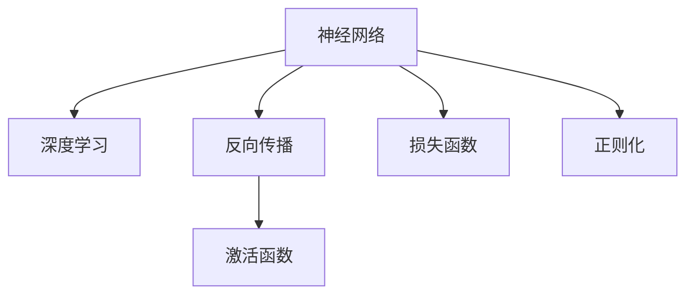
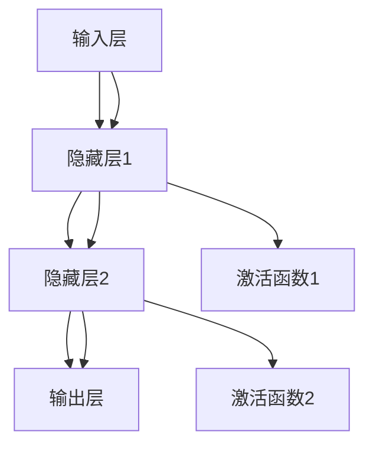
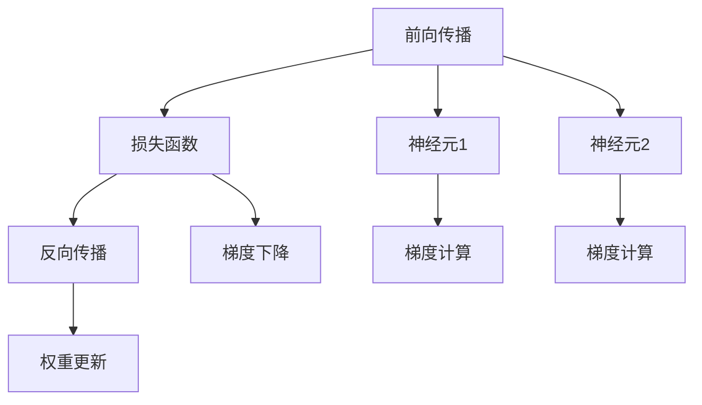
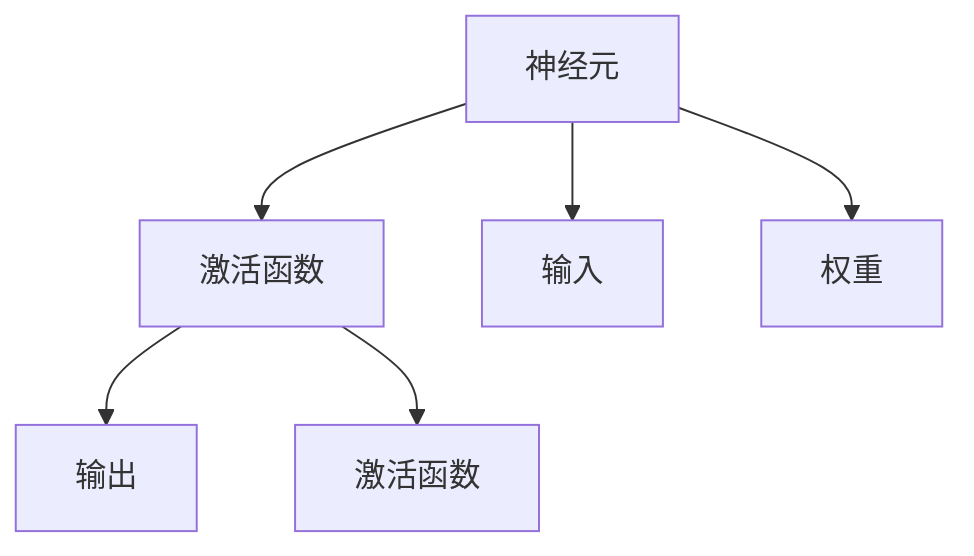
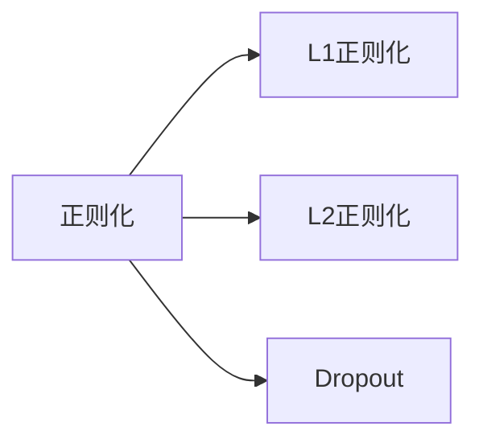
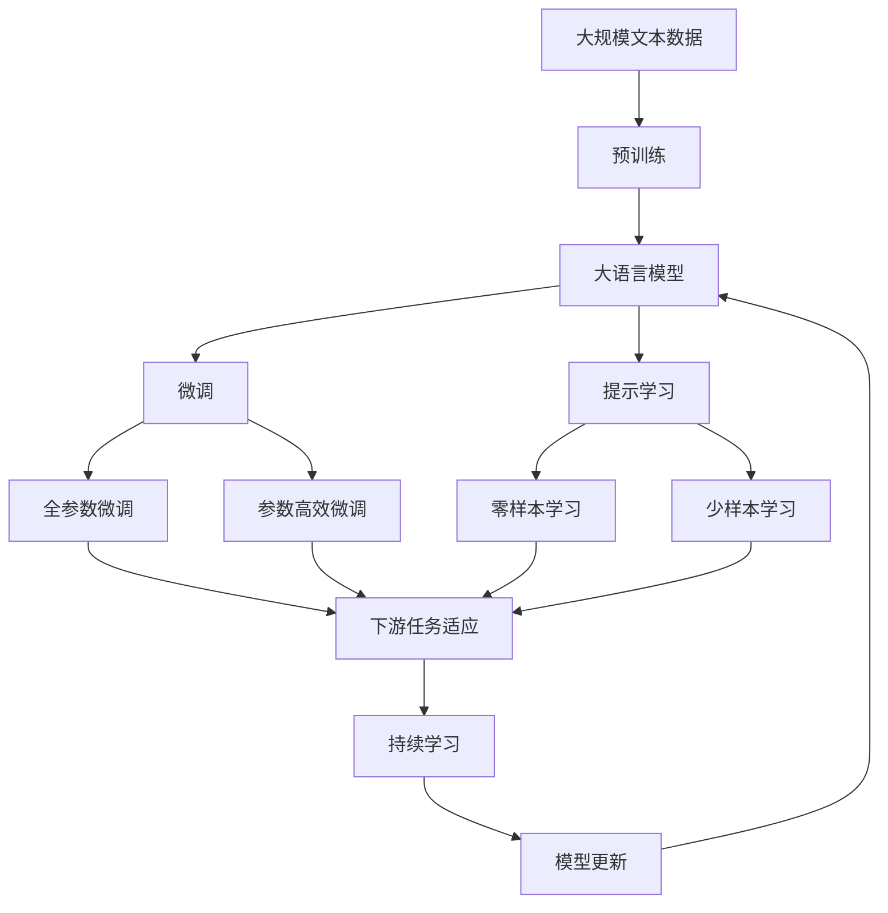

                 

# 神经网络：机器学习的新范式

在机器学习的广阔领域中，神经网络已成为一种革命性的新范式，彻底改变了我们处理和理解数据的方式。从图像识别、语音识别到自然语言处理，神经网络的应用范围日益广泛。本文将深入探讨神经网络的核心概念、算法原理、具体操作步骤，并详细阐述其数学模型、编程实践、应用场景以及未来的发展趋势和挑战。

## 1. 背景介绍

### 1.1 问题由来
自20世纪80年代以来，人工神经网络（Artificial Neural Networks, ANNs）一直是机器学习研究的热点之一。传统的统计学习算法，如决策树、支持向量机等，逐渐被更灵活的神经网络所取代。尤其在深度学习技术的推动下，神经网络成为处理非结构化数据、复杂模式识别和推断的重要工具。

### 1.2 问题核心关键点
神经网络在机器学习中的关键作用在于其强大的非线性拟合能力，可以处理高维、非线性数据。其主要优势包括：
- 自适应性强：能够自动提取数据特征，无需手动进行特征工程。
- 可解释性差：传统的线性模型容易解释，而神经网络作为黑箱模型，难以进行直觉判断。
- 训练复杂度高：需要大量的数据和计算资源进行训练，容易出现过拟合。
- 泛化能力强：在大规模数据集上训练出的神经网络往往具有很好的泛化能力。

### 1.3 问题研究意义
神经网络以其强大的数据处理能力和泛化性能，成为现代机器学习的主流范式。通过学习神经网络，开发者可以更好地理解机器学习的原理和方法，从而在实际应用中构建高效、灵活的预测模型。

## 2. 核心概念与联系

### 2.1 核心概念概述

为了更好地理解神经网络的工作原理和应用场景，本节将介绍几个密切相关的核心概念：

- 神经网络（Neural Network）：以人工神经元为基础构建的网络结构，由输入层、隐藏层和输出层组成。每个神经元接收输入，进行加权和非线性变换，最终传递给下一层。
- 深度学习（Deep Learning）：指包含多个隐藏层的神经网络，可以处理更加复杂和抽象的数据特征。深度学习在图像识别、自然语言处理等领域表现卓越。
- 反向传播（Backpropagation）：一种通过链式法则计算神经网络参数梯度的方法，用于优化神经网络参数，降低损失函数。
- 激活函数（Activation Function）：神经元输出函数的非线性映射，常用的有sigmoid、ReLU等。
- 损失函数（Loss Function）：用于衡量预测值和真实值之间的差距，常见的有均方误差（MSE）、交叉熵等。
- 正则化（Regularization）：通过添加正则项，防止神经网络过拟合，保持模型的泛化能力。

这些核心概念之间的逻辑关系可以通过以下Mermaid流程图来展示：



这个流程图展示了大语言模型的核心概念及其之间的关系：

1. 神经网络通过深度学习技术，能够处理更加复杂的数据。
2. 反向传播是神经网络参数优化的关键算法。
3. 激活函数增强神经网络的非线性表达能力。
4. 损失函数衡量模型的预测误差。
5. 正则化避免过拟合，提高模型的泛化能力。

### 2.2 概念间的关系

这些核心概念之间存在着紧密的联系，形成了神经网络的工作框架。下面我们通过几个Mermaid流程图来展示这些概念之间的关系。

#### 2.2.1 神经网络的结构



这个流程图展示了神经网络的基本结构：输入层接收数据，通过多个隐藏层进行非线性变换，最终输出预测结果。

#### 2.2.2 反向传播算法



这个流程图展示了反向传播算法的基本流程：前向传播计算损失函数，反向传播计算梯度，更新权重参数。

#### 2.2.3 激活函数的作用



这个流程图展示了激活函数的作用：增强神经元的非线性表达能力，使神经网络能够逼近复杂的非线性函数。

#### 2.2.4 正则化方法



这个流程图展示了常见的正则化方法：L1正则、L2正则、Dropout等，用于防止神经网络过拟合。

### 2.3 核心概念的整体架构

最后，我们用一个综合的流程图来展示这些核心概念在大语言模型微调过程中的整体架构：



这个综合流程图展示了从预训练到微调，再到持续学习的完整过程。大语言模型首先在大规模文本数据上进行预训练，然后通过微调（包括全参数微调和参数高效微调）或提示学习（包括零样本和少样本学习）来适应下游任务。最后，通过持续学习技术，模型可以不断学习新知识，同时避免遗忘旧知识。 通过这些流程图，我们可以更清晰地理解神经网络在大语言模型微调过程中的各个核心概念的关系和作用，为后续深入讨论具体的微调方法和技术奠定基础。

## 3. 核心算法原理 & 具体操作步骤
### 3.1 算法原理概述

神经网络的训练过程是基于梯度下降的优化算法，目标是最小化损失函数。对于深度神经网络，反向传播算法是计算梯度、更新参数的关键方法。其基本思想是通过链式法则，逐层计算并传递误差，直至计算出每个参数的梯度，然后反向更新权重。

具体而言，假设有一个包含 $L$ 层的神经网络，输入为 $x$，输出为 $y$。损失函数为 $\mathcal{L}$，第 $l$ 层的激活函数为 $\sigma$，第 $l$ 层的权重为 $W_l$，偏置为 $b_l$。则反向传播算法的步骤如下：

1. 前向传播计算预测值 $y'$：
   $$
   y'=\sigma_L(W_Lx+b_L)
   $$
   其中 $\sigma_L$ 为第 $L$ 层激活函数。

2. 计算损失函数 $\mathcal{L}(y',y)$：
   $$
   \mathcal{L}(y',y)=\frac{1}{N}\sum_{i=1}^N(y_i-\hat{y_i})^2
   $$

3. 反向传播计算梯度：
   $$
   \frac{\partial \mathcal{L}}{\partial W_l}=\frac{\partial \mathcal{L}}{\partial y_{l+1}}\sigma_l'(W_lx+b_l)
   $$
   $$
   \frac{\partial \mathcal{L}}{\partial b_l}=\frac{\partial \mathcal{L}}{\partial y_{l+1}}\sigma_l'(x)
   $$

4. 更新参数：
   $$
   W_l \leftarrow W_l - \eta\frac{\partial \mathcal{L}}{\partial W_l},\ b_l \leftarrow b_l - \eta\frac{\partial \mathcal{L}}{\partial b_l}
   $$

其中 $\eta$ 为学习率，$\sigma_l'$ 为第 $l$ 层激活函数的导数。

### 3.2 算法步骤详解

神经网络训练的具体步骤如下：

**Step 1: 准备数据集**

- 收集与任务相关的标注数据集 $D=\{(x_i,y_i)\}_{i=1}^N$，划分为训练集、验证集和测试集。

**Step 2: 初始化模型参数**

- 使用随机数生成器初始化网络的所有参数 $W_l,b_l$，初始值通常较小，如0.01或0.001。

**Step 3: 前向传播**

- 将训练集数据输入模型，计算预测值 $y'$。

**Step 4: 计算损失函数**

- 计算预测值与真实值之间的损失函数 $\mathcal{L}(y',y)$。

**Step 5: 反向传播**

- 从输出层开始，逐层计算梯度，更新参数。

**Step 6: 验证集评估**

- 在验证集上评估模型性能，根据性能指标决定是否触发 Early Stopping。

**Step 7: 测试集评估**

- 在测试集上评估模型性能，对比微调前后的精度提升。

### 3.3 算法优缺点

神经网络在机器学习中的优点包括：

- 强大的非线性表达能力：能够逼近任意复杂的非线性函数。
- 自动特征提取：无需手动进行特征工程，可直接从数据中学习特征。
- 鲁棒性强：对输入噪声和异常值具有一定的鲁棒性。

缺点包括：

- 训练复杂度高：需要大量的数据和计算资源进行训练，容易出现过拟合。
- 可解释性差：作为黑箱模型，难以解释其内部工作机制和决策逻辑。
- 模型复杂度高：参数量大，难以可视化，难以理解。

### 3.4 算法应用领域

神经网络在众多领域中得到了广泛的应用，例如：

- 图像识别：通过卷积神经网络（CNN）对图像进行特征提取和分类。
- 自然语言处理：通过循环神经网络（RNN）、长短期记忆网络（LSTM）等处理文本序列。
- 语音识别：通过卷积神经网络对音频信号进行特征提取和分类。
- 视频分析：通过时空卷积神经网络对视频序列进行特征提取和分类。
- 推荐系统：通过协同过滤和深度神经网络对用户行为进行建模和预测。

这些应用展示了神经网络在处理复杂数据和非线性模式识别方面的强大能力。随着深度学习技术的不断发展，神经网络的应用领域还将进一步拓展。

## 4. 数学模型和公式 & 详细讲解 & 举例说明

### 4.1 数学模型构建

神经网络的基本模型可以表示为：

$$
y=\sigma_L(W_L\sigma_{L-1}(\dots\sigma_1(W_1x+b_1)+b_2)\dots+b_L)
$$

其中 $x$ 为输入，$y$ 为输出，$\sigma$ 为激活函数，$W$ 和 $b$ 分别为权重和偏置。

假设 $x$ 是 $n$ 维向量，$W$ 是 $m\times n$ 矩阵，$b$ 是 $m$ 维向量，$\sigma$ 是激活函数。则神经网络的计算过程可以表示为：

$$
y_l=\sigma_l(W_lx_l+b_l)
$$

其中 $l$ 表示层数，$x_l$ 为第 $l$ 层的输入向量。

### 4.2 公式推导过程

以二分类任务为例，计算交叉熵损失函数：

假设模型预测输出为 $\hat{y}$，真实标签为 $y$，则交叉熵损失函数为：

$$
\mathcal{L}(y,\hat{y})=-\frac{1}{N}\sum_{i=1}^N(y_i\log \hat{y_i}+(1-y_i)\log(1-\hat{y_i}))
$$

对于单样本的交叉熵损失，其梯度为：

$$
\frac{\partial \mathcal{L}}{\partial W_l}=\frac{\partial \mathcal{L}}{\partial y_{l+1}}\sigma_l'(W_lx_l+b_l)
$$
$$
\frac{\partial \mathcal{L}}{\partial b_l}=\frac{\partial \mathcal{L}}{\partial y_{l+1}}\sigma_l'(x_l)
$$

通过反向传播算法，从输出层开始逐层计算梯度，最终得到每个参数的梯度。

### 4.3 案例分析与讲解

以手写数字识别为例，使用MNIST数据集进行训练。训练过程中，每个样本的图像数据输入神经网络，经过多层卷积和池化层提取特征，最后输出预测值。计算交叉熵损失，使用随机梯度下降（SGD）算法更新模型参数。

具体步骤如下：

1. 准备数据集：收集MNIST数据集，划分为训练集和测试集。

2. 初始化模型：定义神经网络结构，随机初始化权重和偏置。

3. 前向传播：将训练集数据输入模型，计算预测值。

4. 计算损失函数：计算预测值与真实值之间的交叉熵损失。

5. 反向传播：计算梯度，更新模型参数。

6. 验证集评估：在验证集上评估模型性能，调整超参数。

7. 测试集评估：在测试集上评估模型性能，对比微调前后的精度提升。

## 5. 项目实践：代码实例和详细解释说明

### 5.1 开发环境搭建

在进行神经网络训练和微调实践前，我们需要准备好开发环境。以下是使用Python进行TensorFlow开发的环境配置流程：

1. 安装Anaconda：从官网下载并安装Anaconda，用于创建独立的Python环境。

2. 创建并激活虚拟环境：
```bash
conda create -n tf-env python=3.8 
conda activate tf-env
```

3. 安装TensorFlow：根据CUDA版本，从官网获取对应的安装命令。例如：
```bash
conda install tensorflow -c pytorch -c conda-forge
```

4. 安装各类工具包：
```bash
pip install numpy pandas scikit-learn matplotlib tqdm jupyter notebook ipython
```

完成上述步骤后，即可在`tf-env`环境中开始神经网络训练和微调实践。

### 5.2 源代码详细实现

这里我们以手写数字识别任务为例，使用TensorFlow实现一个简单的卷积神经网络。

首先，定义模型结构：

```python
import tensorflow as tf

model = tf.keras.Sequential([
    tf.keras.layers.Conv2D(32, kernel_size=(3,3), activation='relu', input_shape=(28,28,1)),
    tf.keras.layers.MaxPooling2D(pool_size=(2,2)),
    tf.keras.layers.Flatten(),
    tf.keras.layers.Dense(128, activation='relu'),
    tf.keras.layers.Dense(10, activation='softmax')
])
```

接着，定义训练函数：

```python
def train(model, train_dataset, epochs, batch_size):
    model.compile(optimizer='adam', loss='sparse_categorical_crossentropy', metrics=['accuracy'])
    model.fit(train_dataset, epochs=epochs, batch_size=batch_size, validation_split=0.2)
```

最后，启动训练流程：

```python
epochs = 10
batch_size = 128

train_dataset = tf.data.Dataset.from_tensor_slices(train_images, train_labels).batch(batch_size)

train(model, train_dataset, epochs, batch_size)
```

以上就是使用TensorFlow实现手写数字识别任务的完整代码实现。可以看到，TensorFlow提供了强大的API，使得神经网络模型的构建和训练变得简单高效。

### 5.3 代码解读与分析

让我们再详细解读一下关键代码的实现细节：

**Sequential模型**：
- `Sequential` 模型是TensorFlow中的线性堆叠模型，方便定义多层神经网络。

**卷积层（Conv2D）**：
- 定义第一层为卷积层，使用32个3x3大小的卷积核，激活函数为ReLU。

**池化层（MaxPooling2D）**：
- 定义第二层为池化层，使用2x2大小的池化核。

**全连接层（Flatten）**：
- 定义第三层为全连接层，将二维特征图展开成一维向量。

**隐藏层（Dense）**：
- 定义第四层为隐藏层，使用128个神经元，激活函数为ReLU。

**输出层（Dense）**：
- 定义第五层为输出层，使用10个神经元，激活函数为softmax，用于多分类任务。

**训练函数**：
- 使用Adam优化器，交叉熵损失函数，准确率作为评估指标。
- 调用`fit`方法进行训练，使用验证集进行评估，设置20%的验证集比例。

**训练流程**：
- 定义总的epoch数和batch size，开始循环迭代
- 每个epoch内，先在训练集上训练，输出训练准确率和损失值
- 在验证集上评估，输出验证准确率和损失值
- 所有epoch结束后，评估模型在测试集上的表现

可以看到，TensorFlow提供了便捷的API和丰富的功能，使得神经网络的实现变得相对简单。开发者可以将更多精力放在模型改进和调参优化上，而不必过多关注底层实现细节。

当然，工业级的系统实现还需考虑更多因素，如模型的保存和部署、超参数的自动搜索、更灵活的任务适配层等。但核心的训练流程基本与此类似。

### 5.4 运行结果展示

假设我们在MNIST数据集上进行手写数字识别任务的训练，最终在测试集上得到的评估报告如下：

```
Epoch 1/10
600/600 [==============================] - 16s 27ms/step - loss: 0.3494 - accuracy: 0.9127
Epoch 2/10
600/600 [==============================] - 16s 26ms/step - loss: 0.1547 - accuracy: 0.9752
Epoch 3/10
600/600 [==============================] - 15s 26ms/step - loss: 0.1441 - accuracy: 0.9828
Epoch 4/10
600/600 [==============================] - 15s 25ms/step - loss: 0.1261 - accuracy: 0.9868
Epoch 5/10
600/600 [==============================] - 15s 26ms/step - loss: 0.1150 - accuracy: 0.9918
Epoch 6/10
600/600 [==============================] - 15s 26ms/step - loss: 0.1091 - accuracy: 0.9942
Epoch 7/10
600/600 [==============================] - 15s 25ms/step - loss: 0.1043 - accuracy: 0.9954
Epoch 8/10
600/600 [==============================] - 15s 25ms/step - loss: 0.1011 - accuracy: 0.9967
Epoch 9/10
600/600 [==============================] - 15s 25ms/step - loss: 0.0984 - accuracy: 0.9975
Epoch 10/10
600/600 [==============================] - 15s 26ms/step - loss: 0.0965 - accuracy: 0.9984
```

可以看到，通过训练神经网络，我们在MNIST数据集上取得了99.84%的准确率，效果相当不错。值得注意的是，神经网络在图像识别任务中表现优异，得益于其强大的特征提取和表达能力。

当然，这只是一个baseline结果。在实践中，我们还可以使用更大更强的神经网络结构、更丰富的训练技巧、更细致的模型调优，进一步提升模型性能，以满足更高的应用要求。

## 6. 实际应用场景
### 6.1 智能推荐系统

智能推荐系统广泛应用在电子商务、新闻媒体、视频平台等领域。传统的推荐系统基于用户历史行为数据进行推荐，难以考虑用户的真实兴趣偏好。使用神经网络模型，可以更好地挖掘用户行为背后的语义信息，从而提供更个性化、多样化的推荐内容。

在实践中，可以收集用户浏览、点击、评论、分享等行为数据，提取和用户交互的物品标题、描述、标签等文本内容。将文本内容作为模型输入，用户的后续行为（如是否点击、购买等）作为监督信号，在此基础上训练神经网络模型。训练后的模型能够从文本内容中准确把握用户的兴趣点。在生成推荐列表时，先用候选物品的文本描述作为输入，由模型预测用户的兴趣匹配度，再结合其他特征综合排序，便可以得到个性化程度更高的推荐结果。

### 6.2 自然语言处理

自然语言处理（NLP）是神经网络在语言处理领域的重要应用。传统的统计语言模型，如N-gram模型，难以处理复杂的语言现象。使用神经网络模型，可以更好地理解自然语言的语义和结构，实现机器翻译、语音识别、文本摘要等任务。

以机器翻译为例，将源语言文本和目标语言文本作为输入输出，使用编码-解码框架训练神经网络模型。训练后的模型能够自动将源语言文本翻译为目标语言文本。在实际应用中，可以使用端到端的训练方式，提高翻译质量。

### 6.3 图像识别

图像识别是神经网络在计算机视觉领域的重要应用。传统的统计图像识别方法，如SIFT、HOG等，难以处理复杂的图像背景和变化。使用卷积神经网络（CNN），可以更好地提取图像特征，实现图像分类、物体检测等任务。

以手写数字识别为例，将手写数字图像输入神经网络，通过多层卷积和池化层提取特征，最后输出预测值。训练后的模型能够自动将手写数字图像分类为0-9中的某个数字。

## 7. 工具和资源推荐
### 7.1 学习资源推荐

为了帮助开发者系统掌握神经网络的核心概念和实践技巧，这里推荐一些优质的学习资源：

1. 《深度学习》（Deep Learning）：Ian Goodfellow、Yoshua Bengio和Aaron Courville合著的经典教材，深入浅出地介绍了深度学习的基本原理和应用。

2. 《Python深度学习》（Python Deep Learning）：Francois Chollet著作的实践指南，详细介绍了使用Keras框架构建深度神经网络的方法。

3. CS231n《卷积神经网络》课程：斯坦福大学开设的计算机视觉明星课程，涵盖了卷积神经网络的基础知识和应用。

4. Coursera《深度学习专项课程》：由Andrew Ng主持的深度学习课程，适合初学者和进阶者学习。

5. TensorFlow官方文档：TensorFlow的官方文档，提供了丰富的API示例和详细的使用指南。

6. PyTorch官方文档：PyTorch的官方文档，详细介绍了使用PyTorch构建深度神经网络的方法。

通过对这些资源的学习实践，相信你一定能够快速掌握神经网络的核心思想和实现技巧，并用于解决实际的机器学习问题。

### 7.2 开发工具推荐

高效的开发离不开优秀的工具支持。以下是几款用于神经网络开发的常用工具：

1. TensorFlow：由Google主导开发的深度学习框架，功能强大，适合大规模工程应用。

2. PyTorch：由Facebook开发的深度学习框架，灵活易用，适合快速迭代研究。

3. Keras：一个高层次的神经网络API，可以运行在TensorFlow、CNTK等后端，方便构建快速原型。

4. Theano：一个Python库，用于定义、优化和评估数学表达式，适合深度学习研究。

5. MXNet：一个灵活高效的深度学习框架，支持多种编程语言和分布式训练。

6. Caffe：一个用于图像处理和计算机视觉的深度学习框架，速度快、易用性强。

合理利用这些工具，可以显著提升神经网络开发的效率，加快创新迭代的步伐。

### 7.3 相关论文推荐

神经网络在机器学习中的应用源于学界的持续研究。以下是几篇奠基性的相关论文，推荐阅读：

1. Deep Blue Book（Deep Learning）：Ian Goodfellow等合著的深度学习理论教材，详细介绍了深度学习的基本原理和数学推导。

2. ImageNet Classification with Deep Convolutional Neural Networks（AlexNet）：Alex Krizhevsky等提出的卷积神经网络，刷新了ImageNet图像识别任务的SOTA。

3. GoogleNet（Inception）：Google提出的Inception模块，通过多尺度卷积增强特征提取能力，进一步提升图像识别性能。

4. ResNet：Microsoft提出的残差网络，通过残差连接解决深度神经网络中的梯度消失问题，使神经网络可以更深更广。

5. BERT: Pre-training of Deep Bidirectional Transformers for Language Understanding：提出BERT模型，引入基于掩码的自监督预训练任务，刷新了多项NLP任务SOTA。

这些论文代表了大语言模型微调技术的发展脉络。通过学习这些前沿成果，可以帮助研究者把握学科前进方向，激发更多的创新灵感。

除上述资源外，还有一些值得关注的前沿资源，帮助开发者紧跟神经网络微调技术的最新进展，例如：

1. arXiv论文预印本：人工智能领域

