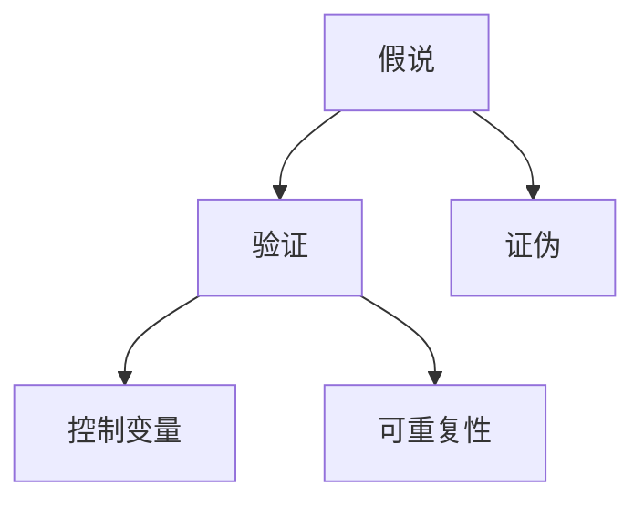

                 

# 科学方法论：从假说到验证

## 1. 背景介绍

科学方法论是指运用科学方法进行研究的过程和体系。在科技快速发展的今天，科学方法论显得尤为重要，尤其是在人工智能(AI)领域，正确的方法论可以指导研究方向，提高研究效率。本博客将围绕科学方法论，阐述从假说到验证的逻辑链条，并结合实际案例，探讨如何在AI领域中应用科学方法论。

## 2. 核心概念与联系

### 2.1 核心概念概述

在讨论科学方法论之前，首先明确几个关键概念：

- **假说(Hypothesis)**：基于现有理论和观测数据，提出的一种解释自然现象或解决实际问题的假设。
- **验证(Verification)**：通过实验或数据分析，验证假说的正确性，确认其能否解释或解决具体问题。
- **证伪(Falsification)**：假设能被证伪的才是科学假说，即存在验证其不成立的实验或数据。
- **控制变量(Control Variables)**：在实验中保持不变的变量，确保结果的可靠性和可重复性。
- **可重复性(Replicability)**：实验结果在不同环境和条件下重复出现，证明其客观性和普遍性。

以上概念构成了科学方法论的基本框架，下一节将详细探讨这些概念间的联系和应用。

### 2.2 核心概念的整体架构

通过以下Mermaid流程图，我们可以更直观地理解这些概念之间的关系：



在这个架构中，假说是验证的出发点，验证结果需要通过证伪和控制变量来确保其可靠性，而可重复性则保障了结果的普适性。

## 3. 核心算法原理 & 具体操作步骤
### 3.1 算法原理概述

在AI领域中，科学方法论同样适用。通过提出假设、设计实验、收集数据、分析结果等步骤，我们可以验证和优化AI算法。假说和验证是科学方法论的核心，也是AI模型设计的基石。

一个典型的AI假说模型设计步骤如下：

1. **问题定义**：明确需要解决的问题，如文本分类、目标检测等。
2. **假设模型**：提出可能的解决方案，如使用卷积神经网络(CNN)、循环神经网络(RNN)、Transformer等模型。
3. **数据准备**：收集训练数据和测试数据，并进行预处理，如数据清洗、归一化等。
4. **模型训练**：使用训练数据对模型进行训练，调整超参数，优化模型性能。
5. **验证评估**：使用测试数据评估模型效果，验证模型的泛化能力。
6. **迭代优化**：根据评估结果，调整模型结构或参数，重新训练和评估。

### 3.2 算法步骤详解

#### 3.2.1 问题定义

在问题定义阶段，需要清晰地描述问题的背景、目标和数据分布。例如，文本分类问题可以描述为：给定一段文本，判断其属于哪一类。

#### 3.2.2 假设模型

在假设模型阶段，需要选择合适的模型结构。例如，对于文本分类问题，可以选择使用卷积神经网络或Transformer模型。

#### 3.2.3 数据准备

在数据准备阶段，需要收集足够的训练数据和测试数据，并进行预处理。例如，对于文本分类问题，可以收集大规模的文本语料库，并进行文本清洗和分词。

#### 3.2.4 模型训练

在模型训练阶段，需要选择合适的优化器、损失函数和学习率，使用训练数据对模型进行训练。例如，对于文本分类问题，可以使用交叉熵损失函数和Adam优化器。

#### 3.2.5 验证评估

在验证评估阶段，需要使用测试数据对模型进行评估，计算各种指标（如准确率、召回率、F1分数等），以衡量模型性能。

#### 3.2.6 迭代优化

在迭代优化阶段，根据评估结果，调整模型结构或参数，重新训练和评估，直到达到满意的性能。

### 3.3 算法优缺点

科学方法论在AI领域的应用具有以下优点：

- **系统性**：通过严格的假说和验证步骤，确保了模型设计的系统性和科学性。
- **可重复性**：实验结果的可重复性，使得模型优化和改进更加可靠。
- **客观性**：通过控制变量和统计分析，提高了模型的客观性和普适性。

同时，科学方法论也存在一些局限：

- **数据依赖**：模型的效果高度依赖于数据质量和数量，数据偏差可能导致模型失效。
- **计算资源**：大规模模型的训练和验证需要大量的计算资源，成本较高。
- **模型复杂性**：复杂的模型结构和参数调整，增加了模型调试的复杂性。

### 3.4 算法应用领域

科学方法论在AI领域具有广泛的应用场景，包括但不限于以下几个方面：

- **自然语言处理(NLP)**：文本分类、情感分析、机器翻译等任务。
- **计算机视觉(CV)**：目标检测、图像识别、图像生成等任务。
- **语音识别(Speech Recognition)**：语音转文本、语音合成等任务。
- **机器人(Robotics)**：导航、操纵、交互等任务。
- **推荐系统(Recommendation Systems)**：商品推荐、内容推荐等任务。

这些领域都涉及从假说到验证的过程，通过科学方法论的应用，可以不断优化和提升AI模型性能。

## 4. 数学模型和公式 & 详细讲解 & 举例说明

### 4.1 数学模型构建

在AI领域中，科学方法论的数学模型构建通常包括以下几个步骤：

1. **问题建模**：将实际问题抽象为数学模型，如回归问题、分类问题、优化问题等。
2. **假设设定**：假设模型具有某种形式，如线性回归、逻辑回归、决策树等。
3. **目标函数定义**：定义模型性能的优化目标，如最小化损失函数、最大化准确率等。
4. **约束条件**：设定模型的约束条件，如正则化、稀疏性等。
5. **求解算法**：选择求解优化问题的算法，如梯度下降、牛顿法等。

### 4.2 公式推导过程

以线性回归模型为例，推导其最小二乘法求解过程：

假设有一个线性回归模型 $y = \theta_0 + \theta_1 x_1 + \theta_2 x_2 + \cdots + \theta_n x_n$，其中 $y$ 为输出变量，$x_1, x_2, \cdots, x_n$ 为输入变量，$\theta_0, \theta_1, \theta_2, \cdots, \theta_n$ 为模型参数。

目标是最小化预测误差 $e = y - \hat{y}$，其中 $\hat{y} = \theta_0 + \theta_1 x_1 + \theta_2 x_2 + \cdots + \theta_n x_n$ 为模型预测值。

最小化预测误差等价于最小化平方误差 $\sum_{i=1}^m (y_i - \hat{y}_i)^2$，其中 $m$ 为样本数。

对 $\theta_0, \theta_1, \theta_2, \cdots, \theta_n$ 求偏导数并令其等于0，得到求解方程组：

$$
\begin{align*}
\frac{\partial}{\partial \theta_0} \sum_{i=1}^m (y_i - \hat{y}_i)^2 &= 0 \\
\frac{\partial}{\partial \theta_1} \sum_{i=1}^m (y_i - \hat{y}_i)^2 &= 0 \\
\frac{\partial}{\partial \theta_2} \sum_{i=1}^m (y_i - \hat{y}_i)^2 &= 0 \\
\cdots \\
\frac{\partial}{\partial \theta_n} \sum_{i=1}^m (y_i - \hat{y}_i)^2 &= 0
\end{align*}
$$

解得：

$$
\begin{align*}
\theta_0 &= \frac{1}{m} \sum_{i=1}^m y_i \\
\theta_1 &= \frac{1}{m} \sum_{i=1}^m (x_{1,i} - \bar{x}_{1}) (y_i - \bar{y}) / \sum_{i=1}^m (x_{1,i} - \bar{x}_{1})^2 \\
\theta_2 &= \frac{1}{m} \sum_{i=1}^m (x_{2,i} - \bar{x}_{2}) (y_i - \bar{y}) / \sum_{i=1}^m (x_{2,i} - \bar{x}_{2})^2 \\
\cdots \\
\theta_n &= \frac{1}{m} \sum_{i=1}^m (x_{n,i} - \bar{x}_{n}) (y_i - \bar{y}) / \sum_{i=1}^m (x_{n,i} - \bar{x}_{n})^2
\end{align*}
$$

其中 $\bar{x}_i$ 和 $\bar{y}$ 分别为输入变量 $x_i$ 和输出变量 $y$ 的均值。

### 4.3 案例分析与讲解

以图像识别为例，假设有一个二分类问题，输入为图像像素值，输出为分类标签（0或1）。

构建假设模型 $y = \theta_0 + \theta_1 x_1 + \theta_2 x_2 + \cdots + \theta_n x_n$，其中 $x_1, x_2, \cdots, x_n$ 为图像像素值，$\theta_0, \theta_1, \theta_2, \cdots, \theta_n$ 为模型参数。

使用平方误差损失函数 $\mathcal{L}(\theta) = \frac{1}{2m} \sum_{i=1}^m (y_i - \hat{y}_i)^2$，其中 $m$ 为样本数。

求解方程组：

$$
\begin{align*}
\frac{\partial}{\partial \theta_0} \mathcal{L}(\theta) &= 0 \\
\frac{\partial}{\partial \theta_1} \mathcal{L}(\theta) &= 0 \\
\frac{\partial}{\partial \theta_2} \mathcal{L}(\theta) &= 0 \\
\cdots \\
\frac{\partial}{\partial \theta_n} \mathcal{L}(\theta) &= 0
\end{align*}
$$

解得：

$$
\begin{align*}
\theta_0 &= \frac{1}{m} \sum_{i=1}^m y_i \\
\theta_1 &= \frac{1}{m} \sum_{i=1}^m (x_{1,i} - \bar{x}_{1}) (y_i - \bar{y}) / \sum_{i=1}^m (x_{1,i} - \bar{x}_{1})^2 \\
\theta_2 &= \frac{1}{m} \sum_{i=1}^m (x_{2,i} - \bar{x}_{2}) (y_i - \bar{y}) / \sum_{i=1}^m (x_{2,i} - \bar{x}_{2})^2 \\
\cdots \\
\theta_n &= \frac{1}{m} \sum_{i=1}^m (x_{n,i} - \bar{x}_{n}) (y_i - \bar{y}) / \sum_{i=1}^m (x_{n,i} - \bar{x}_{n})^2
\end{align*}
$$

## 5. 项目实践：代码实例和详细解释说明

### 5.1 开发环境搭建

在Python环境中搭建项目开发环境，可以采用以下步骤：

1. 安装Python 3.8及以上版本。
2. 安装Jupyter Notebook，用于编写和运行代码。
3. 安装必要的科学计算库，如NumPy、Pandas、Scikit-learn、Matplotlib等。
4. 安装TensorFlow或PyTorch，用于深度学习模型的开发和训练。

### 5.2 源代码详细实现

以图像分类问题为例，使用TensorFlow实现一个简单的神经网络模型：

```python
import tensorflow as tf
from tensorflow import keras

# 加载数据集
(x_train, y_train), (x_test, y_test) = keras.datasets.cifar10.load_data()

# 数据预处理
x_train = x_train / 255.0
x_test = x_test / 255.0

# 构建模型
model = keras.Sequential([
    keras.layers.Conv2D(32, (3, 3), activation='relu', input_shape=(32, 32, 3)),
    keras.layers.MaxPooling2D((2, 2)),
    keras.layers.Conv2D(64, (3, 3), activation='relu'),
    keras.layers.MaxPooling2D((2, 2)),
    keras.layers.Flatten(),
    keras.layers.Dense(64, activation='relu'),
    keras.layers.Dense(10)
])

# 编译模型
model.compile(optimizer='adam', loss=tf.keras.losses.SparseCategoricalCrossentropy(from_logits=True), metrics=['accuracy'])

# 训练模型
model.fit(x_train, y_train, epochs=10, validation_data=(x_test, y_test))
```

### 5.3 代码解读与分析

以上代码实现了基于卷积神经网络(CNN)的图像分类模型。首先，加载CIFAR-10数据集，并将像素值归一化到[0,1]之间。然后，构建一个包含两个卷积层、两个池化层和两个全连接层的模型。最后，使用Adam优化器和交叉熵损失函数编译模型，并在训练集上训练10个epoch。

## 6. 实际应用场景

### 6.1 智能医疗

在智能医疗领域，科学方法论的应用可以体现在以下几个方面：

- **疾病预测**：基于患者的生理数据和历史病例，构建机器学习模型进行疾病预测。
- **治疗方案推荐**：根据患者的病情和治疗历史，使用深度学习模型推荐最佳治疗方案。
- **药物研发**：利用大数据分析，构建药物分子结构与药效的关系模型，加速新药研发。

### 6.2 自动驾驶

在自动驾驶领域，科学方法论的应用可以体现在以下几个方面：

- **环境感知**：使用计算机视觉和深度学习技术，构建环境感知模型，识别和分类道路、行人、车辆等物体。
- **路径规划**：使用图论和优化算法，构建路径规划模型，寻找最优驾驶路径。
- **行为决策**：使用强化学习模型，构建行为决策系统，优化驾驶行为和策略。

### 6.3 金融风控

在金融风控领域，科学方法论的应用可以体现在以下几个方面：

- **信用评估**：基于用户的信用记录和行为数据，构建信用评估模型，预测用户的信用风险。
- **欺诈检测**：利用异常检测算法，构建欺诈检测模型，识别和防范金融欺诈行为。
- **风险控制**：使用机器学习模型，构建风险控制策略，优化贷款审批流程。

## 7. 工具和资源推荐

### 7.1 学习资源推荐

1. **《深度学习》课程**：斯坦福大学的深度学习课程，系统讲解深度学习理论和实践，涵盖从神经网络到卷积神经网络、循环神经网络等内容。
2. **《Python数据科学手册》**：涵盖Python在数据科学、机器学习、深度学习等方面的应用，包括SciPy、Pandas、NumPy、Matplotlib等库的使用。
3. **《机器学习实战》**：涵盖机器学习基础、深度学习、自然语言处理等领域的实战案例，帮助读者快速上手应用。
4. **arXiv预印本**：提供最新的人工智能研究成果和论文，涵盖从理论到应用的多方面内容。

### 7.2 开发工具推荐

1. **PyTorch**：开源深度学习框架，具有动态计算图和灵活的模型构建能力。
2. **TensorFlow**：Google开发的深度学习框架，具有强大的计算能力和丰富的社区支持。
3. **Keras**：高层API，提供简单易用的接口，适合快速搭建深度学习模型。
4. **Jupyter Notebook**：交互式编程环境，支持多种语言和库，方便代码编写和调试。

### 7.3 相关论文推荐

1. **ImageNet Classification with Deep Convolutional Neural Networks**：提出基于卷积神经网络的图像分类模型，在ImageNet数据集上取得了优异表现。
2. **Deep Residual Learning for Image Recognition**：提出残差网络，解决了深度神经网络中的梯度消失问题，提高了模型的训练效率和性能。
3. **Attention is All You Need**：提出Transformer模型，显著提高了机器翻译和语言模型的性能。
4. **Scalable Mixture-of-Experts Models for Deep Learning**：提出混合专家模型，提高了深度学习模型的训练和推理效率。
5. **Generative Adversarial Nets**：提出生成对抗网络，生成逼真的图像、文本等内容，拓展了深度学习的应用范围。

## 8. 总结：未来发展趋势与挑战

### 8.1 研究成果总结

科学方法论在AI领域的应用已经取得了丰硕的成果，主要体现在以下几个方面：

1. **模型性能提升**：通过科学方法论的应用，AI模型的准确率、召回率等性能指标显著提升。
2. **应用场景拓展**：科学方法论的应用拓展了AI模型的应用场景，涵盖了医疗、金融、自动驾驶等多个领域。
3. **算法优化**：科学方法论推动了算法优化和改进，如卷积神经网络、残差网络、Transformer等。
4. **数据驱动**：科学方法论强调数据的重要性，推动了大数据分析和处理技术的发展。

### 8.2 未来发展趋势

未来，科学方法论在AI领域的应用将继续拓展，主要趋势包括：

1. **自动化学习**：通过自动化机器学习( AutoML)等技术，降低模型开发门槛，提高模型开发效率。
2. **多模态融合**：将不同模态的数据（如文本、图像、语音等）进行融合，提升AI模型的综合能力。
3. **知识图谱**：利用知识图谱技术，构建领域知识库，增强AI模型的推理和决策能力。
4. **因果学习**：利用因果推断方法，提高AI模型的可解释性和可靠性。
5. **深度强化学习**：通过深度强化学习，优化AI模型的行为和决策策略。

### 8.3 面临的挑战

科学方法论在AI领域的应用仍面临以下挑战：

1. **数据质量**：数据质量的不确定性可能导致模型失效，需要更加严格的数据清洗和预处理。
2. **计算资源**：大规模模型的训练和验证需要大量的计算资源，成本较高。
3. **模型复杂性**：复杂的模型结构和参数调整，增加了模型调试的复杂性。
4. **可解释性**：AI模型的可解释性不足，难以理解其内部工作机制和决策逻辑。
5. **伦理道德**：AI模型的应用可能涉及伦理和道德问题，需要制定相应的规范和准则。

### 8.4 研究展望

未来，科学方法论在AI领域的研究展望包括：

1. **普适性模型**：构建能够适应各种领域和场景的普适性AI模型。
2. **可解释AI**：增强AI模型的可解释性和透明性，提升用户信任。
3. **公平性AI**：确保AI模型在公平性和公正性方面的表现，避免偏见和歧视。
4. **可控性AI**：增强AI模型的可控性和安全性，防止恶意用途和滥用。
5. **跨领域应用**：将AI模型应用到更多领域，推动各行业的数字化转型升级。

总之，科学方法论在AI领域的应用前景广阔，未来需要不断探索和创新，推动AI技术的持续进步和应用拓展。

## 9. 附录：常见问题与解答

**Q1: 科学方法论在AI领域有哪些具体应用？**

A: 科学方法论在AI领域的应用广泛，包括但不限于以下几个方面：

1. **自然语言处理(NLP)**：文本分类、情感分析、机器翻译等任务。
2. **计算机视觉(CV)**：目标检测、图像识别、图像生成等任务。
3. **语音识别(Speech Recognition)**：语音转文本、语音合成等任务。
4. **机器人(Robotics)**：导航、操纵、交互等任务。
5. **推荐系统(Recommendation Systems)**：商品推荐、内容推荐等任务。

**Q2: 如何选择合适的AI模型？**

A: 选择合适的AI模型需要考虑以下几个因素：

1. **任务类型**：不同任务适合的模型结构不同，如图像分类适合卷积神经网络，自然语言处理适合循环神经网络和Transformer。
2. **数据规模**：数据规模较大的任务适合使用大规模深度学习模型，数据规模较小的任务适合使用轻量级模型。
3. **计算资源**：计算资源充足的情况下，可以使用复杂的深度学习模型，否则需要选择计算效率高的模型。
4. **性能需求**：根据实际应用场景，选择具有较高准确率、召回率等性能指标的模型。

**Q3: 如何优化AI模型的训练过程？**

A: 优化AI模型训练过程可以从以下几个方面入手：

1. **数据增强**：通过数据增强技术，扩充训练集，提升模型泛化能力。
2. **超参数调优**：通过网格搜索、随机搜索等方法，调整超参数，优化模型性能。
3. **正则化技术**：使用L2正则、Dropout等技术，防止模型过拟合。
4. **模型压缩**：通过模型压缩技术，减小模型规模，提高计算效率。
5. **知识蒸馏**：利用知识蒸馏技术，将大模型的知识传递给小模型，提高小模型性能。

**Q4: 如何评估AI模型的性能？**

A: 评估AI模型性能通常使用以下指标：

1. **准确率(Accuracy)**：模型预测正确的样本数与总样本数之比。
2. **召回率(Recall)**：模型正确预测的正样本数与实际正样本数之比。
3. **精确率(Precision)**：模型正确预测的正样本数与模型预测为正样本的总数之比。
4. **F1分数(F1 Score)**：综合考虑精确率和召回率，衡量模型综合性能。

**Q5: 如何应对AI模型的偏差和公平性问题？**

A: 应对AI模型的偏差和公平性问题可以从以下几个方面入手：

1. **数据清洗**：对数据进行预处理，去除偏见和歧视性的数据。
2. **公平性评估**：使用公平性评估指标，评估模型的公平性表现。
3. **公平性调整**：通过调整模型参数或增加公平性约束，改善模型的公平性表现。
4. **多样性增强**：增加数据多样性，提升模型对不同群体的适应能力。

---

作者：禅与计算机程序设计艺术 / Zen and the Art of Computer Programming

