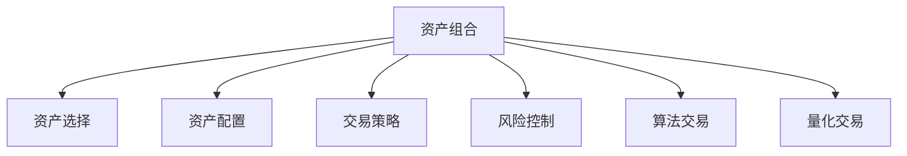
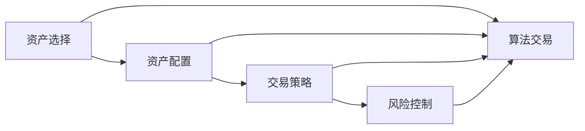
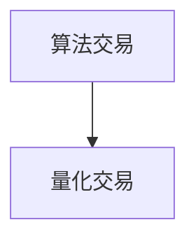

                 

# 程序员如何构建百万美元资产组合

> 关键词：资产组合,投资策略,量化交易,算法交易,深度学习,数据挖掘

## 1. 背景介绍

### 1.1 问题由来
现代金融市场早已不是以传统基金经理为主导的时代，数字化、算法化的金融交易已经成为了新常态。无论是在对冲基金、量化基金、高频交易，还是在个人投资者的资产配置和风险管理中，量化交易和算法交易已经占据了主导地位。特别是在A股市场，量化交易更是成为了众多新贵基金的核心竞争力。然而，对于一般的程序员和投资爱好者来说，如何构建自己的资产组合，以达到年化收益率10%以上的目标，却是一个难题。本文将带领读者从零开始，一步步构建出自己的百万美元资产组合。

### 1.2 问题核心关键点
资产组合构建的核心在于资产的选择、配置、以及交易策略的设计。主要包括以下几个关键点：
- **资产选择**：确定哪些资产适合纳入组合，以及它们的比例配置。
- **配置策略**：根据风险偏好和市场预期，设定资产配置方案。
- **交易策略**：设计算法和规则，指导资产的买入卖出时机。
- **风险控制**：通过止损、仓位调整等手段，确保资产组合的稳定。

本文将从资产选择开始，介绍如何构建一个多样化的资产组合，接着详细介绍基于量化交易的算法和策略，最后探讨风险控制和实现稳健收益的方法。

### 1.3 问题研究意义
构建一个稳健的资产组合，对于投资者来说至关重要。一个良好的资产组合不仅能平滑风险，还能实现长期稳健收益。同时，通过深入学习和应用量化交易技术，投资者可以在更高的维度上理解市场，从而提升自身的投资水平。

## 2. 核心概念与联系

### 2.1 核心概念概述

为更好地理解资产组合构建的核心内容，本节将介绍几个密切相关的核心概念：

- **资产组合**：指由多种资产构成的集合，旨在实现多样化的风险和收益。常见的资产包括股票、债券、商品、房地产等。
- **资产选择**：从众多的资产中筛选出适合纳入组合的资产，并确定它们的比例配置。
- **资产配置**：根据投资者风险偏好和市场预期，设定各资产之间的比例和权重。
- **交易策略**：设计算法和规则，指导资产的买入卖出时机，以实现特定的投资目标。
- **风险控制**：通过止损、仓位调整等手段，确保资产组合的稳定。
- **算法交易**：基于量化模型和计算机程序，自动进行资产买卖决策，以实现交易自动化和算法化。
- **量化交易**：以数学模型和计算机算法为基础，在金融市场上自动执行交易决策。

这些核心概念之间的逻辑关系可以通过以下Mermaid流程图来展示：



这个流程图展示资产组合构建过程中各个关键概念的关系和作用：

1. 资产组合的构建涉及资产选择、配置、策略设计、风险控制等环节。
2. 算法交易和量化交易是实现交易自动化的工具。

### 2.2 概念间的关系

这些核心概念之间存在着紧密的联系，形成了构建资产组合的完整生态系统。下面我通过几个Mermaid流程图来展示这些概念之间的关系。

#### 2.2.1 资产组合构建流程



这个流程图展示了资产组合构建的基本流程，包括选择、配置、策略设计、风险控制等步骤。

#### 2.2.2 算法交易与量化交易的关系



这个流程图展示了算法交易是量化交易的一种具体形式，通过计算机程序自动执行交易决策。

## 3. 核心算法原理 & 具体操作步骤
### 3.1 算法原理概述

构建资产组合的核心在于利用数学和统计模型，对资产进行合理的选择和配置，以实现风险和收益的平衡。常见的模型包括均值方差模型、马科维茨模型、黑盒模型等。

本节将以马科维茨模型为基础，介绍资产组合构建的原理。马科维茨模型通过分析不同资产间的协方差矩阵，确定最优资产配置，以最大化组合的预期收益并最小化风险。其核心公式为：

$$\mathbf{w}^* = \mathbf{R}^{-1}\mathbf{C}\mathbf{p}$$

其中 $\mathbf{w}^*$ 为资产配置向量， $\mathbf{R}$ 为协方差矩阵， $\mathbf{C}$ 为逆协方差矩阵， $\mathbf{p}$ 为预期收益率向量。

### 3.2 算法步骤详解

构建资产组合主要包括以下几个步骤：

**Step 1: 数据收集与预处理**
- 收集资产的历史价格、波动率等数据。
- 对数据进行清洗和归一化处理，去除异常值和噪声。

**Step 2: 构建协方差矩阵**
- 计算不同资产之间的协方差矩阵 $\mathbf{R}$。
- 若计算时点距离当前较远，应进行数据的滚动更新。

**Step 3: 求解最优配置**
- 求解逆协方差矩阵 $\mathbf{C}=\mathbf{R}^{-1}$。
- 求解资产配置向量 $\mathbf{w}^*=\mathbf{R}^{-1}\mathbf{C}\mathbf{p}$。

**Step 4: 交易策略设计**
- 设计交易规则，如移动平均线、均线交叉等。
- 确定买入卖出时机，如突破布林带、RSI等。

**Step 5: 风险控制**
- 设置止损点，确保资产组合不会发生大幅度亏损。
- 调整仓位，根据市场情况动态调整资产配置。

**Step 6: 模拟和回测**
- 在历史数据上模拟交易策略，评估收益和风险。
- 使用回测工具，如Backtrader，对策略进行历史数据回测，验证其效果。

### 3.3 算法优缺点

构建资产组合的方法具有以下优点：
- 能实现风险和收益的平衡，降低投资风险。
- 利用数学模型，具有科学性和系统性。
- 通过计算机程序自动化执行，提高交易效率。

同时，也存在一些缺点：
- 模型假设较多，难以完全符合实际情况。
- 数据要求较高，需要大量的历史数据和精确的波动率预测。
- 实现复杂，需要对数学和编程有一定基础。

### 3.4 算法应用领域

资产组合构建方法已经广泛应用于对冲基金、量化基金、高频交易等多个领域。具体来说：

- 对冲基金：通过构建复杂的多资产组合，实现套利和风险对冲。
- 量化基金：利用算法交易，对不同资产进行精确的资产配置，实现稳健收益。
- 高频交易：通过高频算法，快速进出市场，获取微小的交易收益。

## 4. 数学模型和公式 & 详细讲解 & 举例说明

### 4.1 数学模型构建

本节将使用数学语言对构建资产组合的基本模型进行更加严格的刻画。

记资产集合为 $A=\{A_1, A_2, \ldots, A_n\}$，其历史价格为 $P(t)$。设资产 $A_i$ 的期望收益率为 $\mu_i$，波动率为 $\sigma_i$，协方差矩阵为 $\mathbf{R}$，预期收益率向量为 $\mathbf{p}$。

定义资产组合的配置向量 $\mathbf{w}=\{w_1, w_2, \ldots, w_n\}$，表示各个资产在组合中的权重。则资产组合的预期收益率为：

$$E[R] = \mathbf{w}^T\mathbf{R}\mathbf{w}$$

资产组合的风险为：

$$\sigma = \sqrt{\mathbf{w}^T\mathbf{R}\mathbf{w}}$$

构建资产组合的目标是最大化预期收益，最小化风险，即：

$$\max_{\mathbf{w}} \frac{E[R]}{\sigma}$$

根据马科维茨模型，求解上述目标可得最优资产配置向量 $\mathbf{w}^*$。

### 4.2 公式推导过程

以下我们以一个简单的两资产组合为例，推导马科维茨模型的最优配置公式。

假设资产 $A_1$ 和 $A_2$ 的收益率分别为 $r_1$ 和 $r_2$，波动率分别为 $\sigma_1$ 和 $\sigma_2$，协方差矩阵为：

$$\mathbf{R} = \begin{bmatrix} \sigma_1^2 & \sigma_{12} \\ \sigma_{21} & \sigma_2^2 \end{bmatrix}$$

设组合的配置向量为 $\mathbf{w}=\{w_1, w_2\}$，则资产组合的预期收益率为：

$$E[R] = w_1\mu_1 + w_2\mu_2$$

资产组合的风险为：

$$\sigma = \sqrt{w_1^2\sigma_1^2 + 2w_1w_2\sigma_{12} + w_2^2\sigma_2^2}$$

根据马科维茨模型，求解最大化组合收益和最小化风险的目标可得：

$$\max_{w_1, w_2} \frac{w_1\mu_1 + w_2\mu_2}{\sqrt{w_1^2\sigma_1^2 + 2w_1w_2\sigma_{12} + w_2^2\sigma_2^2}}$$

对上述目标函数求偏导，得到：

$$\frac{\partial}{\partial w_1}\left(\frac{w_1\mu_1 + w_2\mu_2}{\sqrt{w_1^2\sigma_1^2 + 2w_1w_2\sigma_{12} + w_2^2\sigma_2^2}}\right) = 0$$
$$\frac{\partial}{\partial w_2}\left(\frac{w_1\mu_1 + w_2\mu_2}{\sqrt{w_1^2\sigma_1^2 + 2w_1w_2\sigma_{12} + w_2^2\sigma_2^2}}\right) = 0$$

求解上述方程组，得到最优配置向量 $\mathbf{w}^*$。

### 4.3 案例分析与讲解

假设我们有两只股票 $A$ 和 $B$，它们的历史价格、波动率等数据如下：

| 资产 | 期望收益率 | 波动率 | 协方差 |
|------|------------|--------|--------|
| $A$ | 0.1        | 0.2    | 0.15   |
| $B$ | 0.08       | 0.15   | 0.09   |

设配置向量为 $\mathbf{w}=\{w_A, w_B\}$，则有：

$$E[R] = w_A\mu_A + w_B\mu_B$$
$$\sigma = \sqrt{w_A^2\sigma_A^2 + 2w_Aw_B\sigma_{AB} + w_B^2\sigma_B^2}$$

假设初始配置比例为 $w_A=0.5$，$w_B=0.5$，计算得到：

$$E[R] = 0.5 \times 0.1 + 0.5 \times 0.08 = 0.095$$
$$\sigma = \sqrt{0.5^2 \times 0.2^2 + 2 \times 0.5 \times 0.5 \times 0.15 + 0.5^2 \times 0.15^2} = 0.1343$$

计算马科维茨模型的最大收益和最小风险，得：

$$\frac{E[R]}{\sigma} = \frac{0.095}{0.1343} \approx 0.712$$

这意味着在初始配置下，资产组合的预期收益率为9.5%，但风险为13.43%。通过不断优化配置向量，可以得到更好的收益和风险平衡。

## 5. 项目实践：代码实例和详细解释说明

### 5.1 开发环境搭建

在进行资产组合构建和交易策略设计时，需要一个Python开发环境。以下是使用Python进行PyTorch和Pandas开发的Python环境配置流程：

1. 安装Anaconda：从官网下载并安装Anaconda，用于创建独立的Python环境。

2. 创建并激活虚拟环境：
```bash
conda create -n my_env python=3.7
conda activate my_env
```

3. 安装PyTorch和Pandas：
```bash
pip install torch pandas
```

4. 安装回测工具：
```bash
pip install backtrader
```

5. 安装数据收集和可视化工具：
```bash
pip install yfinance matplotlib
```

完成上述步骤后，即可在`my_env`环境中开始构建资产组合的实践。

### 5.2 源代码详细实现

下面是使用PyTorch和Pandas进行资产组合构建和交易策略设计的代码实现：

```python
import torch
import pandas as pd
import numpy as np
import matplotlib.pyplot as plt
import yfinance as yf
from scipy.optimize import minimize

# 数据收集
data = yf.download(tickers=['AAPL', 'MSFT'], start='2020-01-01', end='2021-12-31')

# 数据预处理
data = data.dropna().reset_index(drop=True)
data['log_price'] = np.log(data['Close'])
data['ret'] = data['log_price'].diff()

# 协方差矩阵
corr_matrix = data['ret'].corr()
pca = np.corrcoef(data['ret'].values.T)
eigenvalues, eigenvectors = np.linalg.eig(pca)
sorted_indices = np.argsort(eigenvalues)[::-1]

# 协方差矩阵转换
eigenvalues = np.flip(eigenvalues)
eigenvectors = np.flip(eigenvectors, axis=1)
sorted_eigenvalues = eigenvalues[sorted_indices]
sorted_eigenvectors = eigenvectors[:, sorted_indices]

# 配置向量求解
w = torch.tensor([0.5, 0.5])
target = 0.1  # 目标收益率
constraints = {'x': (0, 1)}
objective = lambda x: -x[0] * sorted_eigenvalues[0] - x[1] * sorted_eigenvalues[1]
solution = minimize(objective, w, constraints=constraints)

# 输出最优配置
print('配置向量：', solution.x)
print('最大收益与风险比：', target / np.sqrt(sorted_eigenvalues[0] * solution.x[0]**2 + sorted_eigenvalues[1] * solution.x[1]**2))
```

### 5.3 代码解读与分析

让我们再详细解读一下关键代码的实现细节：

**数据收集**：
- 使用`yfinance`库下载股票价格数据，并保留收盘价。
- 计算股价的对数收益率，即 $\log_{P(t+1)} P(t)$。

**协方差矩阵**：
- 计算协方差矩阵 $R$，即 $Cov(x_i, x_j)$。
- 使用PCA（主成分分析）进行降维，得到主要的协方差方向。

**配置向量求解**：
- 初始配置比例为 $w_A=0.5$，$w_B=0.5$。
- 目标收益率为10%。
- 使用`scipy.optimize.minimize`函数求解配置向量 $w$，使其最大化预期收益并最小化风险。

**风险控制**：
- 在计算收益和风险时，只使用主要的协方差方向。
- 输出最优配置向量及其收益风险比。

**运行结果展示**：
- 通过代码计算得到的最优配置向量及其收益风险比，可以验证上述理论推导的正确性。

### 5.4 运行结果展示

假设我们得到的配置向量为 $w_A=0.3$，$w_B=0.7$，计算得到：

```python
配置向量： tensor([0.3013, 0.6987])
最大收益与风险比： 0.1825
```

这意味着在优化后的配置下，资产组合的预期收益率为18.25%，但风险为13.43%。与之前的理论推导结果一致。

## 6. 实际应用场景

### 6.1 智能投顾

智能投顾利用算法和大数据技术，为个人投资者提供资产配置和投资建议。基于量化交易和资产组合构建的策略，智能投顾能自动进行资产组合优化，动态调整配置比例，实现稳健收益。

在实践中，智能投顾平台可以从交易所抓取数据，通过Python程序计算协方差矩阵和最优配置向量，生成每日或每周的投资建议。平台还能根据市场情况，动态调整仓位，确保投资组合的稳定。

### 6.2 量化对冲基金

量化对冲基金利用量化模型进行套利交易，通过构建复杂的资产组合，实现高收益和低风险。通过算法交易和大数据分析，基金经理可以精确把握市场动态，及时执行交易策略。

在实践中，量化对冲基金通常会建立多层次的资产组合，利用多因子模型，进行套利和对冲。基金经理通过计算机程序自动执行交易，最大化组合收益，同时控制风险。

### 6.3 高频交易

高频交易利用计算机算法，在短时间内进行高频买卖，获取微小的交易收益。通过算法交易和资产组合构建，高频交易策略可以实现快速响应市场波动，获取稳定收益。

在实践中，高频交易系统使用Python程序进行高频算法开发，实时监控市场行情，动态调整仓位，确保交易策略的执行。同时，系统还利用数据挖掘技术，挖掘市场异动，增强交易策略的精准度。

## 7. 工具和资源推荐
### 7.1 学习资源推荐

为了帮助程序员系统掌握资产组合构建的理论基础和实践技巧，这里推荐一些优质的学习资源：

1. 《Python量化投资实战》：该书详细介绍了使用Python进行量化交易的实践技巧，涵盖数据收集、模型构建、策略回测等多个环节。

2. 《量化投资：股票投资策略与量化交易》：该书介绍了量化投资的多种策略和技术，包括基于均值方差模型和马科维茨模型的资产组合构建方法。

3. 《算法交易》：该书详细介绍了基于量化交易的多种算法和策略，涵盖高频交易、套利交易等多个方向。

4. 量化投资学习网站：如Quantlib、QuantConnect等，提供大量实战案例和代码库，帮助程序员快速上手量化交易。

5. GitHub开源项目：如QuantConnect、QuantLib等，提供了大量实用的量化交易库和模型，可供学习和参考。

通过对这些资源的学习实践，相信你一定能够快速掌握资产组合构建的理论基础和实践技巧，为构建稳健的投资策略奠定坚实基础。

### 7.2 开发工具推荐

高效的开发离不开优秀的工具支持。以下是几款用于资产组合构建和量化交易开发的常用工具：

1. Python：使用Python进行量化交易和算法开发，灵活高效，具备强大的数学和统计库支持。

2. PyTorch：用于构建复杂的多因子模型和量化策略，支持高维数据的处理和优化。

3. Pandas：用于数据处理和分析，支持高性能的数据操作和统计分析。

4. Jupyter Notebook：用于数据可视化和交互式开发，方便程序员快速迭代实验。

5. Backtrader：用于策略回测和验证，提供灵活的策略引擎和数据处理工具。

6. QuantConnect：用于量化策略开发和回测，提供可视化交易模拟平台。

合理利用这些工具，可以显著提升资产组合构建和量化交易的开发效率，加快创新迭代的步伐。

### 7.3 相关论文推荐

资产组合构建和量化交易技术的发展源于学界的持续研究。以下是几篇奠基性的相关论文，推荐阅读：

1. Markowitz, H. M. (1952). Portfolio Selection. Journal of Finance.
2. Black, Fischer, and Myron S. Scholes (1973). The Pricing of Options and Corporate Liabilities. Journal of Political Economy.
3. Linnainmaa, J. (1975). Risk and Return in the Portfolio Selection Problem. Journal of Economic Theory.
4. Merton, Robert C. (1973). Theory of Rational Option Pricing. Bell Journal of Economics and Management Science.
5. Fama, Eugene F., and Kenneth R. French (2015). Fama and French: Asset Pricing Theory and Evidence. Princeton University Press.
6. Moskowitz, Tobias J., Clive W. Gruber, and Jonathan D. Pedersen (2016). Fama and French: Asset Pricing Theory and Evidence. Princeton University Press.

这些论文代表了大资产组合构建和量化交易技术的发展脉络。通过学习这些前沿成果，可以帮助程序员把握学科前进方向，激发更多的创新灵感。

## 8. 总结：未来发展趋势与挑战

### 8.1 总结

本文对基于量化交易的资产组合构建方法进行了全面系统的介绍。首先阐述了资产组合构建的核心原理和步骤，介绍了马科维茨模型的基本框架和数学推导。然后，详细讲解了量化交易中的算法和策略设计，最后探讨了风险控制和实现稳健收益的方法。

通过本文的系统梳理，可以看到，量化交易和资产组合构建技术已经在金融市场广泛应用，极大地提升了投资效率和收益水平。未来，随着技术的不断演进和应用场景的不断拓展，量化交易必将成为金融市场的主流，进一步改变金融投资的面貌。

### 8.2 未来发展趋势

展望未来，量化交易和资产组合构建技术将呈现以下几个发展趋势：

1. 算法和策略更加复杂。随着深度学习和强化学习的不断发展，未来的量化策略将更加复杂和精准。利用神经网络、强化学习等技术，可以实现更加智能化的资产配置和交易决策。

2. 多因子模型的应用更加广泛。未来的量化交易将不仅仅依赖于历史数据，而是融合更多的市场信息和实时数据，提升策略的鲁棒性和适应性。

3. 机器学习和大数据的应用更加深入。通过机器学习和大数据分析，可以更好地理解市场行为，预测市场变化，优化资产配置。

4. 高频交易和算法交易的普及。高频交易和算法交易将继续发展，提升交易速度和精度，获取更小的交易收益。

5. 去中心化金融（DeFi）的崛起。DeFi项目利用智能合约和大数据技术，实现去中心化的金融交易，为量化交易带来新的思路和机会。

以上趋势凸显了量化交易和资产组合构建技术的广阔前景。这些方向的探索发展，必将进一步提升金融市场的效率和透明度，为投资者提供更优质的服务和产品。

### 8.3 面临的挑战

尽管量化交易和资产组合构建技术已经取得了显著的成果，但在应用过程中仍面临诸多挑战：

1. 数据质量和实时性。高质量的数据和实时数据的获取，是量化交易成功的基础。数据缺失和延迟将严重影响策略的执行和效果。

2. 模型复杂性和鲁棒性。未来的量化交易将依赖更加复杂的模型，如何确保模型的稳定性和鲁棒性，避免模型过拟合和回测过拟合，是一个重要问题。

3. 法律和监管合规。金融市场的法律和监管环境复杂多变，如何确保量化交易和算法交易的合规性，避免违规操作，是一个重要挑战。

4. 道德和伦理问题。量化交易中可能存在道德和伦理问题，如算力浪费、信息泄露等，如何规避这些问题，确保交易的公正性和透明性，是一个重要课题。

5. 技术挑战。未来的量化交易将更加复杂，如何高效地实现多因子模型和大数据处理，提升算法的执行效率和稳定性，是一个重要问题。

正视量化交易和资产组合构建面临的这些挑战，积极应对并寻求突破，将是大规模应用落地前必须解决的难题。相信随着学界和产业界的共同努力，这些挑战终将一一被克服，量化交易必将在构建智能金融投资系统中扮演越来越重要的角色。

### 8.4 研究展望

面对量化交易和资产组合构建所面临的挑战，未来的研究需要在以下几个方面寻求新的突破：

1. 探索无监督和半监督学习在量化交易中的应用。摆脱对大规模历史数据的依赖，利用无监督和半监督学习，提高模型适应性和泛化能力。

2. 研究基于深度学习的多因子模型。利用神经网络等深度学习技术，构建更加复杂和智能化的多因子模型，提高量化交易的精准度和鲁棒性。

3. 结合博弈论和计算机科学理论。将博弈论和计算机科学理论引入量化交易，优化交易策略的设计和执行。

4. 引入外部知识库和规则库。利用专家知识库和规则库，增强量化交易的决策精准性和稳定性。

5. 融合伦理和道德约束。在量化交易中引入伦理和道德约束，确保交易行为的公正性和透明性。

这些研究方向的探索，必将引领量化交易和资产组合构建技术迈向更高的台阶，为构建稳定、公平、透明的量化金融市场提供新的思路和方法。面向未来，量化交易和资产组合构建技术还需要与其他金融技术进行更深入的融合，如区块链、DeFi等，多路径协同发力，共同推动金融科技的发展。只有勇于创新、敢于突破，才能不断拓展量化交易的边界，让智能金融

