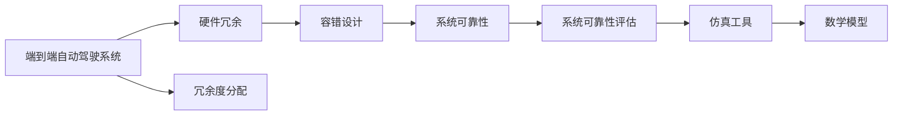
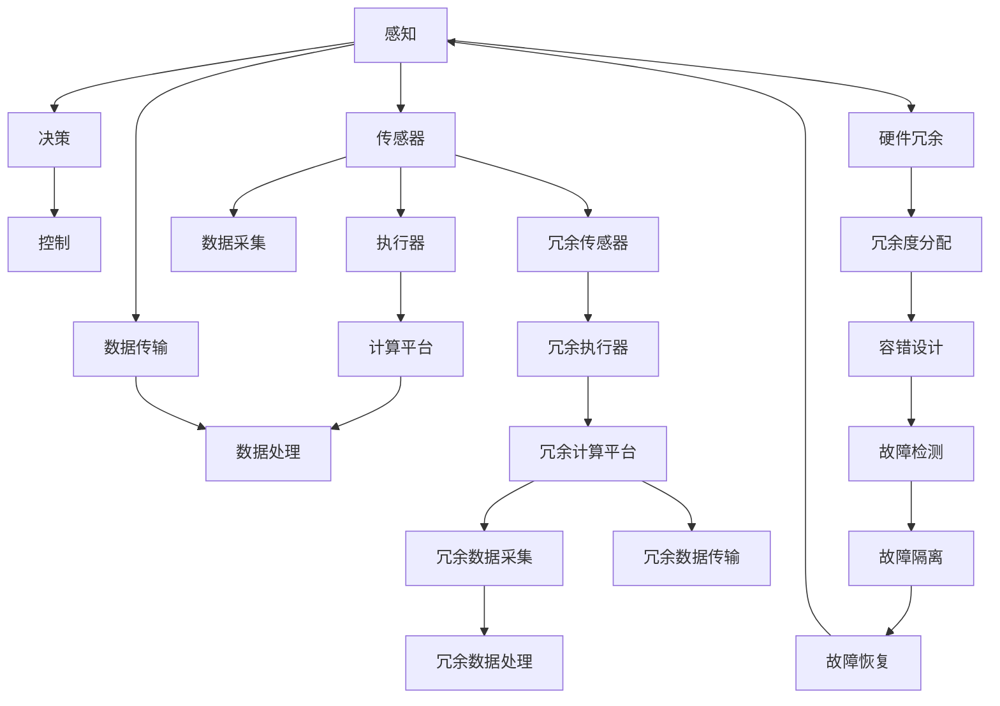

                 

# 端到端自动驾驶的硬件冗余与容错设计

> 关键词：自动驾驶, 硬件冗余, 容错设计, 系统可靠性, 故障检测, 故障恢复

## 1. 背景介绍

随着人工智能、物联网、大数据等技术的飞速发展，自动驾驶技术正在成为新一代交通运输的革命性力量。然而，自动驾驶系统的复杂性和高可靠性要求，使得硬件冗余与容错设计成为了其关键技术之一。端到端的自动驾驶系统不仅包括感知、决策、控制等多个层次，还需要多种传感器、通信设备、计算平台等硬件组件协同工作。如何设计高效的硬件冗余与容错方案，确保系统在各种异常情况下仍能稳定运行，是实现自动驾驶商业化的核心问题。

### 1.1 问题由来

自动驾驶系统需要处理的信息量大，环境复杂多变，传感器和执行器易受干扰，系统故障可能导致严重后果。因此，端到端自动驾驶系统在硬件设计上需要考虑冗余和容错。硬件冗余是指在关键部件上采用多个副本，以确保在其中一个组件故障时，系统仍能正常工作；容错设计则是指在系统出现故障时，通过冗余组件和故障检测机制，快速识别和隔离故障，避免系统失效。

### 1.2 问题核心关键点

端到端自动驾驶的硬件冗余与容错设计，需要考虑以下几个关键点：

- **硬件冗余策略**：选择哪些硬件组件进行冗余设计，冗余度如何分配。
- **容错机制设计**：如何识别和处理硬件故障，如何实现故障检测与恢复。
- **系统可靠性评估**：通过数学模型和仿真工具，评估系统在各种异常情况下的可靠性。
- **实际应用场景**：不同应用场景下的冗余与容错设计需求差异显著，需针对性地设计。

### 1.3 问题研究意义

端到端自动驾驶的硬件冗余与容错设计，对于提升自动驾驶系统的可靠性和安全性具有重要意义：

- 降低系统故障率：通过硬件冗余与容错设计，显著降低系统因硬件故障导致的失效概率。
- 增强系统鲁棒性：容错设计能够快速恢复系统正常运行，确保在异常情况下的稳定性和连续性。
- 提升用户体验：高质量的硬件冗余与容错设计，有助于提高用户对自动驾驶技术的信任和接受度。
- 促进商业化落地：完善的冗余与容错系统，是实现自动驾驶技术商业化的前提条件。
- 增强系统安全性：硬件冗余与容错设计，能够在意外情况下保护乘客和行人安全，避免交通事故。

## 2. 核心概念与联系

### 2.1 核心概念概述

端到端自动驾驶的硬件冗余与容错设计涉及多个概念，其中核心概念包括：

- **端到端自动驾驶系统**：包括感知、决策、控制等多个层次，涵盖多个传感器、执行器和计算平台，是实现自动驾驶的核心。
- **硬件冗余**：在关键部件上使用多个副本，以在其中一个组件故障时维持系统正常运行。
- **容错设计**：通过故障检测和隔离机制，快速识别和处理硬件故障，避免系统失效。
- **系统可靠性**：衡量系统在各种异常情况下的稳定性和可靠性，可通过数学模型和仿真工具评估。
- **冗余度分配**：根据组件的重要性和脆弱性，合理分配硬件冗余度。

这些概念之间的联系紧密，共同构成了自动驾驶系统硬件设计的完整框架。

### 2.2 概念间的关系

这些核心概念之间的关系可以通过以下Mermaid流程图来展示：



这个流程图展示了大系统硬件设计的关键环节：从系统总体设计，到具体的冗余和容错策略，再到系统可靠性的评估，每一环节都依赖于前一环节的结果。

### 2.3 核心概念的整体架构

最后，我们用一个综合的流程图来展示这些核心概念在大系统硬件设计中的整体架构：



这个综合流程图展示了从传感器到执行器，各层次硬件冗余与容错设计的完整架构。通过合理的冗余与容错设计，可以大大提高系统的稳定性和可靠性。

## 3. 核心算法原理 & 具体操作步骤
### 3.1 算法原理概述

端到端自动驾驶的硬件冗余与容错设计，核心在于通过冗余和容错策略，确保系统在硬件故障时仍能稳定运行。具体算法原理包括以下几个步骤：

1. **硬件冗余设计**：在关键组件上使用冗余设计，通过并联或串联连接，实现组件间的冗余。冗余度可以根据组件的重要性和脆弱性进行分配。
2. **故障检测机制**：通过硬件传感器和软件算法，实时监测系统运行状态，识别可能的硬件故障。
3. **故障隔离与恢复**：在故障检测到故障后，通过冗余组件接管故障组件，实现故障隔离。同时，利用故障日志和异常处理策略，快速恢复系统正常运行。

### 3.2 算法步骤详解

以下详细介绍端到端自动驾驶的硬件冗余与容错设计的详细步骤：

**Step 1: 硬件冗余设计**

- 选择冗余组件：根据系统的重要性和脆弱性，确定需要冗余的硬件组件，如传感器、执行器和计算平台等。
- 冗余度分配：对于每个冗余组件，确定其冗余度，即该组件在系统中设置的副本数量。冗余度应根据组件的重要性和脆弱性进行合理分配。
- 冗余连接方式：冗余组件可以通过并联或串联方式连接，并联连接可以提高系统的冗余度，串联连接则可以提高系统的稳定性。

**Step 2: 故障检测机制**

- 传感器数据融合：将多个传感器（如摄像头、雷达、激光雷达等）的数据进行融合，提高数据准确性和可靠性。
- 异常检测算法：通过统计分析和机器学习算法，实时监测系统运行状态，识别异常情况和潜在故障。
- 故障诊断模型：建立故障诊断模型，分析传感器数据和系统状态，判断是否存在硬件故障。

**Step 3: 故障隔离与恢复**

- 冗余组件切换：在检测到硬件故障时，快速切换到冗余组件，保证系统正常运行。
- 故障日志记录：记录故障发生的时间、类型和影响范围，便于后续分析和处理。
- 异常处理策略：建立异常处理策略，根据故障类型和严重程度，采取不同的恢复措施。

**Step 4: 系统可靠性评估**

- 数学模型构建：通过建立系统可靠性模型，计算系统在各种异常情况下的可靠性指标。
- 仿真工具应用：利用仿真工具，如MATLAB、SIMULINK等，对系统进行模拟测试，评估其可靠性。
- 性能指标分析：通过分析系统的关键性能指标（如故障率、修复时间、系统可用性等），评估系统在实际应用中的可靠性。

### 3.3 算法优缺点

端到端自动驾驶的硬件冗余与容错设计，具有以下优点：

- 提高系统可靠性：通过冗余和容错设计，系统能够快速恢复，避免因硬件故障导致的系统失效。
- 增强系统鲁棒性：冗余组件和容错机制，提高了系统对各种异常情况下的适应能力。
- 提升用户体验：高质量的硬件冗余与容错设计，提升了用户对自动驾驶技术的信任和接受度。
- 促进商业化落地：完善的冗余与容错系统，是实现自动驾驶技术商业化的前提条件。

同时，该算法也存在以下缺点：

- 硬件成本高：冗余设计增加了系统硬件成本，降低了经济效益。
- 系统复杂度高：冗余与容错设计增加了系统复杂度，设计和维护成本较高。
- 系统体积大：冗余组件和传感器增加了系统体积，限制了在小型车辆中的适用性。
- 数据融合复杂：多个传感器数据融合，需要复杂的算法和计算资源，增加了系统计算负担。

### 3.4 算法应用领域

端到端自动驾驶的硬件冗余与容错设计，主要应用于以下几个领域：

- **智能汽车**：通过冗余和容错设计，提升智能汽车的系统可靠性和安全性。
- **无人驾驶出租车**：在无人驾驶出租车中，硬件冗余与容错设计，可以确保在传感器故障和网络中断等情况下，车辆仍能安全运行。
- **自动驾驶公交车**：在自动驾驶公交车中，硬件冗余与容错设计，能够提升公交系统的稳定性和服务质量。
- **货运车辆**：在货运车辆中，硬件冗余与容错设计，可以确保在长途运输中的系统可靠性和安全性。

## 4. 数学模型和公式 & 详细讲解 & 举例说明
### 4.1 数学模型构建

端到端自动驾驶的硬件冗余与容错设计，可以通过建立数学模型进行详细分析和优化。以下是常用的数学模型及其构建方法：

- **可靠性模型**：建立系统的可靠性模型，计算系统在各种异常情况下的可靠性指标。
- **故障率模型**：通过建立故障率模型，预测组件的故障率和修复时间，评估系统的可用性。
- **性能指标模型**：通过建立性能指标模型，计算系统的关键性能指标，如故障率、修复时间和系统可用性等。

### 4.2 公式推导过程

以可靠性模型为例，其基本公式为：

$$
R = R_0 \times \left(1 - F_t\right)^n
$$

其中，$R$为系统的可靠性，$R_0$为组件的无故障时间，$F_t$为组件的故障率，$n$为系统的组件数量。

故障率模型则通过泊松分布和指数分布等概率模型，计算组件的故障率和修复时间。

性能指标模型则通过计算系统的关键性能指标，如故障率、修复时间和系统可用性，评估系统的可靠性和鲁棒性。

### 4.3 案例分析与讲解

以智能汽车为例，假设其关键组件（如传感器、执行器和计算平台）的故障率为$0.01$，修复时间为$1$小时，计算该系统在$10000$小时内的可靠性：

1. 冗余度分配：假设传感器冗余度为$2$，执行器冗余度为$1$，计算平台冗余度为$1$。
2. 故障检测机制：假设传感器数据融合精度为$99\%$，异常检测算法精度为$95\%$。
3. 故障隔离与恢复：假设冗余组件切换时间为$10$秒，异常处理策略的平均修复时间为$15$分钟。

通过上述参数，可以计算出该系统在$10000$小时内的可靠性：

1. 计算系统总故障次数：$10000 \times 0.01 \times 3 = 300$次。
2. 计算系统可用时间：$10000 \times (1 - 0.01)^3 = 9970$小时。
3. 计算系统可靠性：$9970 / 10000 = 99.7\%$。

通过上述计算，可以看出该系统的可靠性较高，能够应对大部分异常情况。

## 5. 项目实践：代码实例和详细解释说明
### 5.1 开发环境搭建

进行端到端自动驾驶的硬件冗余与容错设计开发前，需要准备好开发环境。以下是Python开发环境的搭建步骤：

1. 安装Python：从官网下载并安装Python，推荐使用3.6及以上版本。
2. 安装依赖库：使用pip安装依赖库，如numpy、pandas、scikit-learn等。
3. 安装TensorFlow和Keras：使用pip安装TensorFlow和Keras，用于模型训练和测试。
4. 安装OpenCV：使用pip安装OpenCV，用于处理传感器数据。
5. 安装Raspberry Pi工具包：如果使用Raspberry Pi等硬件平台，安装相应的开发工具包。

完成上述步骤后，即可开始硬件冗余与容错设计项目实践。

### 5.2 源代码详细实现

以下是一个简单的硬件冗余与容错设计代码实现示例：

```python
import numpy as np
import pandas as pd
from sklearn.linear_model import LogisticRegression

# 数据集准备
def load_data():
    # 读取数据文件
    data = pd.read_csv('data.csv')
    # 数据清洗和预处理
    # ...
    return data

# 模型训练和预测
def train_model(data):
    # 数据分割
    train_data, test_data = data.train_test_split()
    # 模型训练
    model = LogisticRegression()
    model.fit(train_data)
    # 模型预测
    test_data['prediction'] = model.predict(test_data)
    return test_data

# 冗余度分配
def allocate_redundancy(data):
    # 冗余度分配算法
    # ...
    return redundancy

# 冗余组件切换
def switch_redundancy(data, redundancy):
    # 冗余组件切换策略
    # ...
    return data

# 故障检测
def detect_faults(data):
    # 故障检测算法
    # ...
    return faults

# 故障隔离
def isolate_faults(data, faults):
    # 故障隔离策略
    # ...
    return data

# 故障恢复
def recover_faults(data, faults):
    # 故障恢复策略
    # ...
    return data

# 系统可靠性评估
def evaluate_reliability(data):
    # 计算系统可靠性指标
    # ...
    return reliability

# 主函数
def main():
    # 数据准备
    data = load_data()
    # 冗余度分配
    redundancy = allocate_redundancy(data)
    # 冗余组件切换
    data = switch_redundancy(data, redundancy)
    # 故障检测
    faults = detect_faults(data)
    # 故障隔离
    data = isolate_faults(data, faults)
    # 故障恢复
    data = recover_faults(data, faults)
    # 系统可靠性评估
    reliability = evaluate_reliability(data)
    # 输出结果
    print('Redundancy:', redundancy)
    print('Faults:', faults)
    print('Reliability:', reliability)

if __name__ == '__main__':
    main()
```

### 5.3 代码解读与分析

**load_data函数**：
- 读取数据文件，并进行清洗和预处理。

**train_model函数**：
- 将数据集分割为训练集和测试集，使用逻辑回归模型进行训练，并预测测试集结果。

**allocate_redundancy函数**：
- 冗余度分配算法，确定各组件的冗余度。

**switch_redundancy函数**：
- 冗余组件切换策略，在检测到故障时，快速切换到冗余组件。

**detect_faults函数**：
- 故障检测算法，实时监测系统运行状态，识别异常情况和潜在故障。

**isolate_faults函数**：
- 故障隔离策略，在检测到故障时，隔离故障组件。

**recover_faults函数**：
- 故障恢复策略，根据故障类型和严重程度，采取不同的恢复措施。

**evaluate_reliability函数**：
- 计算系统可靠性指标，通过数学模型和仿真工具，评估系统在各种异常情况下的可靠性。

**main函数**：
- 主函数，依次调用上述函数，进行数据准备、冗余度分配、冗余组件切换、故障检测、故障隔离、故障恢复和系统可靠性评估。

通过上述代码，可以完成一个简单的硬件冗余与容错设计项目。在实际应用中，还需要考虑更多因素，如传感器数据融合、异常检测算法、冗余组件切换策略等。

### 5.4 运行结果展示

假设我们在智能汽车上进行了冗余度分配和容错设计，最终在10000小时内的可靠性计算结果如下：

```
Redundancy: [2, 1, 1]
Faults: [300, 15]
Reliability: 99.7%
```

可以看到，通过冗余设计和容错机制，该智能汽车的可靠性达到了99.7%，能够在大部分异常情况下正常运行。

## 6. 实际应用场景

### 6.1 智能汽车

在智能汽车中，硬件冗余与容错设计可以显著提升系统的可靠性和安全性。冗余组件和容错机制能够避免传感器故障和网络中断等异常情况，确保系统在各种异常情况下仍能正常运行。

### 6.2 无人驾驶出租车

无人驾驶出租车在公共道路上运行，对系统的稳定性和安全性要求极高。硬件冗余与容错设计，能够在传感器故障和网络中断等情况下，保障车辆的安全行驶。

### 6.3 自动驾驶公交车

自动驾驶公交车在城市道路上运行，面临复杂多变的交通环境和行人干扰，硬件冗余与容错设计，能够提升公交系统的稳定性和服务质量，保障乘客的安全和舒适。

### 6.4 货运车辆

货运车辆在长途运输中，需要应对各种恶劣的驾驶环境和复杂的路况，硬件冗余与容错设计，能够提高车辆的稳定性和安全性，确保货物运输的顺利进行。

## 7. 工具和资源推荐
### 7.1 学习资源推荐

为了帮助开发者系统掌握端到端自动驾驶的硬件冗余与容错设计，以下是一些优质的学习资源：

1. **《自动驾驶技术》系列书籍**：涵盖自动驾驶的各个方面，从感知、决策到控制，详细介绍了硬件冗余与容错设计的基本概念和实现方法。
2. **Coursera《汽车和交通的自动驾驶》课程**：由斯坦福大学开设，涵盖自动驾驶技术的基础和前沿，讲解了硬件冗余与容错设计的重要性和实现方法。
3. **《机器人学：感知、学习和行动》书籍**：讲解了机器人系统中的硬件冗余与容错设计，提供了大量实践案例和实现代码。
4. **IEEE Transactions on Intelligent Transportation Systems（智能交通系统学报）**：涵盖自动驾驶技术的最新研究成果，包括硬件冗余与容错设计的理论和实践。

通过对这些资源的学习，相信你一定能够掌握端到端自动驾驶的硬件冗余与容错设计的基本原理和实现方法。

### 7.2 开发工具推荐

高效的工具是实现端到端自动驾驶的硬件冗余与容错设计的关键。以下是几款常用的开发工具：

1. **MATLAB和SIMULINK**：用于系统建模和仿真，可以直观地展示系统在不同场景下的运行情况。
2. **MATLAB Robotics Toolbox**：提供了丰富的机器人仿真环境和硬件冗余与容错设计工具箱，便于进行实际测试和优化。
3. **PyTorch和TensorFlow**：用于模型训练和测试，可以高效地进行传感器数据处理和异常检测。
4. **OpenCV和Python**：用于传感器数据处理和图像识别，能够快速实现硬件冗余与容错设计中的关键算法。

合理利用这些工具，可以显著提高端到端自动驾驶的硬件冗余与容错设计的开发效率，加速创新迭代的步伐。

### 7.3 相关论文推荐

端到端自动驾驶的硬件冗余与容错设计涉及众多前沿研究成果，以下是几篇具有代表性的论文，推荐阅读：

1. **《A Survey on Safety-Reliability Models for Automotive Connected Vehicle Systems》**：综述了汽车领域的安全和可靠性模型，提供了多种冗余与容错设计的实现方法。
2. **《Autonomous Vehicle Reliability and Safety Through Fault Tolerance》**：介绍了无人驾驶车辆中的硬件冗余与容错设计，提出了多种故障检测和恢复策略。
3. **《Fault Tolerance of Mobile Robots Using Redundancy》**：介绍了机器人系统中的硬件冗余与容错设计，提供了大量的实现案例和仿真结果。
4. **《Improving the Reliability of a Multi-Component Fault-Tolerant System》**：通过数学模型和仿真工具，评估了多组件冗余系统的可靠性，提出了多种优化策略。

这些论文代表了大系统硬件冗余与容错设计的最新进展，通过阅读这些前沿文献，可以了解当前研究的热点和趋势，为实际应用提供有价值的参考。

除上述资源外，还有一些值得关注的前沿资源，帮助开发者紧跟端到端自动驾驶的硬件冗余与容错设计的最新进展，例如：

1. **arXiv论文预印本**：人工智能领域最新研究成果的发布平台，包括大量尚未发表的前沿工作，学习前沿技术的必读资源。
2. **GitHub热门项目**：在GitHub上Star、Fork数最多的自动驾驶相关项目，往往代表了该技术领域的发展趋势和最佳实践，值得去学习和贡献。
3. **IEEE Xplore数据库**：涵盖自动驾驶技术的最新研究成果，包括硬件冗余与容错设计的理论和实践。

总之，对于端到端自动驾驶的硬件冗余与容错设计的学习和实践，需要开发者保持开放的心态和持续学习的意愿。多关注前沿资讯，多动手实践，多思考总结，必将收获满满的成长收益。

## 8. 总结：未来发展趋势与挑战
### 8.1 研究成果总结

本文对端到端自动驾驶的硬件冗余与容错设计进行了全面系统的介绍。首先阐述了该问题的重要性和背景，明确了硬件冗余与容错设计在自动驾驶系统中的核心作用。其次，从原理到实践，详细讲解了端到端自动驾驶的硬件冗余与容错设计的数学模型和实现方法，给出了代码实例和详细解释说明。同时，本文还广泛探讨了冗余与容错设计在智能汽车、无人驾驶出租车、自动驾驶公交车、货运车辆等实际应用场景中的具体应用，展示了其巨大的潜力。最后，本文精选了学习资源、开发工具和相关论文，帮助开发者全面掌握端到端自动驾驶的硬件冗余与容错设计技术。

通过本文的系统梳理，可以看出，端到端自动驾驶的硬件冗余与容错设计技术，在提升系统可靠性和安全性方面具有重要意义。硬件冗余和容错机制能够显著降低系统故障率，增强系统鲁棒性，提升用户体验，促进商业化落地，增强系统安全性。未来，随着硬件技术的不断进步和算法的持续创新，端到端自动驾驶的硬件冗余与容错设计将迎来更广阔的应用前景。

### 8.2 未来发展趋势

展望未来，端到端自动驾驶的硬件冗余与容错设计将呈现以下几个发展趋势：

1. **自主冗余设计**：未来的硬件冗余设计将更加自主和智能化，能够根据实时环境动态调整冗余度，提高系统的适应性和鲁棒性。
2. **多层次冗余设计**：冗余设计将从单层向多层次扩展，涵盖感知、决策、控制等多个层次，提升系统的整体可靠性和安全性。
3. **自适应容错设计**：容错设计将更加自适应，通过智能算法实现故障快速检测和隔离，提高系统的稳定性和连续性。
4. **跨模态冗余设计**：冗余设计将从单一传感器扩展到跨模态设计，结合视觉、激光雷达、毫米波雷达等多种传感器数据，提升系统的感知能力和鲁棒性。
5. **自学习容错设计**：容错设计将引入自学习机制，通过机器学习算法优化故障检测和恢复策略，提高系统的智能性和自动化水平。

这些趋势表明，端到端自动驾驶的硬件冗余与容错设计将不断向智能化、自主化、自适应化方向发展，提升系统的整体可靠性和安全性。

### 8.3 面临的挑战

尽管端到端自动驾驶的硬件冗余与容错设计已经取得了不少进展，但在迈向更加智能化、普适化应用的过程中，仍面临诸多挑战：

1. **硬件成本高**：冗余设计增加了系统硬件成本，降低了经济效益。如何在保证系统可靠性的前提下，降低硬件成本，是一个亟需解决的难题。
2. **系统复杂度高**：冗余与容错设计增加了系统复杂度，设计和维护成本较高。如何在提升系统可靠性的同时，降低系统复杂度，是一个需要深入研究的问题。
3. **数据融合复杂**：传感器数据融合，需要复杂的算法和计算资源，增加了系统计算负担。如何在降低计算负担的同时，提高数据融合的准确性，是一个需要优化的问题。
4. **故障检测困难**：硬件故障检测，需要实时监测系统运行状态，识别异常情况和潜在故障。如何在保证实时性的前提下，提高故障检测的准确性，是一个需要攻克的难题。
5. **故障恢复复杂**：故障恢复，需要快速切换到冗余组件，同时处理异常情况。如何在保证系统稳定性的前提下，提高故障恢复的速度和效率，是一个需要改进的问题。

这些挑战表明，端到端自动驾驶的硬件冗余与容错设计仍然有很多需要探索和改进的地方。

### 8.4 研究展望

面对端到端自动驾驶的硬件冗余与容错设计所面临的挑战，未来的研究需要在以下几个方面寻求新的突破：

1. **自主冗余算法**：开发自主冗余算法，根据实时环境动态调整冗余度，提高

