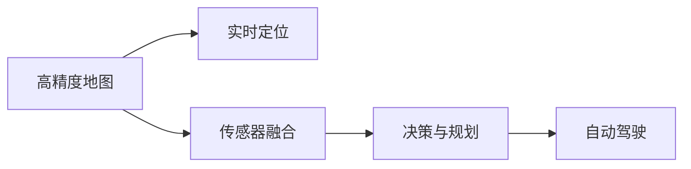
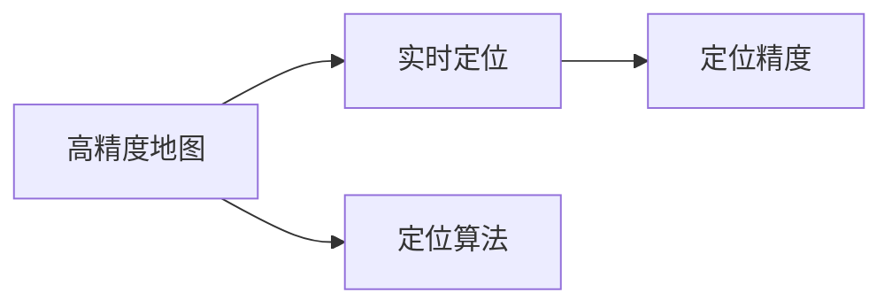
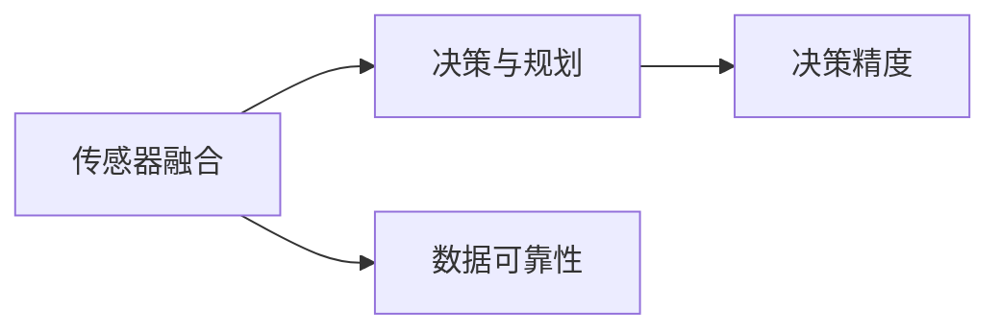
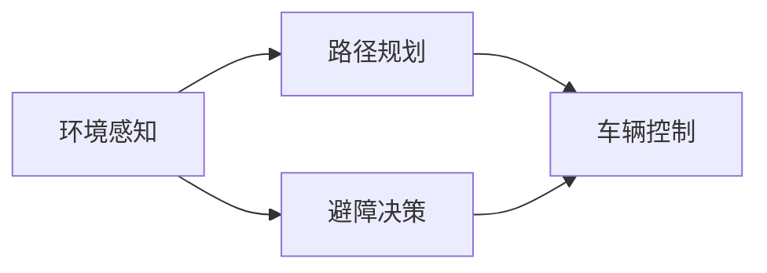
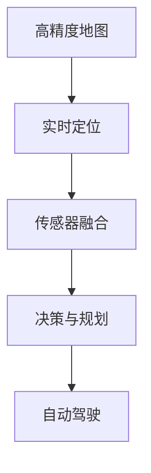

                 

# 端到端自动驾驶的自主接送客服务

> 关键词：端到端自动驾驶, 自主接送客服务, 高精度地图, 实时定位, 传感器融合, 决策与规划, 仿真与测试

## 1. 背景介绍

随着科技的飞速发展，自动驾驶技术逐渐从实验室走向实际应用，成为智能交通领域的一个重要方向。端到端自动驾驶技术的出现，彻底改变了传统的车辆控制和驾驶方式，实现了从感知、决策到控制的一体化系统。其中，自主接送客服务作为自动驾驶技术的重要应用场景之一，受到了广泛关注。

自主接送客服务（Autonomous Shuttle Service, 简称ASS）通常指由自动驾驶车辆在指定区域内搭载乘客，自动导航至目的地并送达。该技术结合了高精度地图、实时定位、传感器融合、决策与规划等多种先进技术，能够在复杂的城市交通环境中提供高效、安全的接送服务。

本博客将详细介绍自主接送客服务中的核心技术，包括高精度地图构建、实时定位、传感器融合、决策与规划等，并通过实际项目实践展示其应用效果。

## 2. 核心概念与联系

### 2.1 核心概念概述

为更好地理解端到端自动驾驶的自主接送客服务，本节将介绍几个密切相关的核心概念：

- **高精度地图（High Precision Map）**：一种以厘米级精度记录道路、交通设施、环境特征等信息的高精度地图。用于为自动驾驶车辆提供准确的定位信息和导航数据。
- **实时定位（Real-Time Localization）**：指在车辆运行过程中，实时获取车辆的位置、姿态等信息，实现车辆的精准定位。
- **传感器融合（Sensor Fusion）**：将来自不同传感器的信息（如激光雷达、摄像头、GPS等）进行融合，提高数据准确性和可靠性，为决策与规划提供支持。
- **决策与规划（Decision and Planning）**：基于融合后的数据，通过算法决策车辆的运动路径、速度和转向等行为，实现自动驾驶。

这些核心概念之间的逻辑关系可以通过以下Mermaid流程图来展示：



这个流程图展示了高精度地图、实时定位、传感器融合、决策与规划在自主接送客服务中的相互联系和作用。高精度地图为实时定位提供参考信息，实时定位为传感器融合提供位置参考，传感器融合为决策与规划提供数据支持，最终决策与规划指导自动驾驶。

### 2.2 概念间的关系

这些核心概念之间存在着紧密的联系，形成了自主接送客服务的完整技术架构。下面我们通过几个Mermaid流程图来展示这些概念之间的关系。

#### 2.2.1 高精度地图与实时定位的关系



这个流程图展示了高精度地图与实时定位的关系。高精度地图为实时定位提供了初始位置参考，定位算法通过比较地图信息和实际位置，不断修正定位结果，提高定位精度。

#### 2.2.2 传感器融合与决策与规划的关系



这个流程图展示了传感器融合与决策与规划的关系。传感器融合通过将不同传感器的数据进行融合，提高了数据的准确性和可靠性，为决策与规划提供了可靠的数据支持，提高了决策精度。

#### 2.2.3 决策与规划的流程



这个流程图展示了决策与规划的流程。环境感知模块通过传感器获取周围环境信息，路径规划模块基于环境信息规划最优路径，避障决策模块根据障碍情况进行避障决策，车辆控制模块根据避障决策结果控制车辆行为。

### 2.3 核心概念的整体架构

最后，我们用一个综合的流程图来展示这些核心概念在自主接送客服务中的整体架构：



这个综合流程图展示了从高精度地图到自动驾驶的整个技术流程。高精度地图为实时定位提供参考，实时定位为传感器融合提供位置参考，传感器融合为决策与规划提供数据支持，最终决策与规划指导自动驾驶，实现自主接送客服务。

## 3. 核心算法原理 & 具体操作步骤
### 3.1 算法原理概述

端到端自动驾驶的自主接送客服务，本质上是一个涉及多种传感器数据融合、高精度地图定位、实时环境感知和智能决策的综合技术系统。其核心算法原理包括以下几个方面：

1. **高精度地图构建**：通过激光雷达、GPS等多种传感器数据，构建高精度地图，为实时定位提供参考。
2. **实时定位**：使用GPS、IMU、激光雷达等传感器进行实时定位，确保车辆在复杂环境中的精准导航。
3. **传感器融合**：将GPS、IMU、激光雷达、摄像头等传感器的数据进行融合，提高数据准确性和可靠性。
4. **决策与规划**：通过融合后的数据，结合环境感知、路径规划和避障决策等算法，实现车辆的自动驾驶。

### 3.2 算法步骤详解

以下是自主接送客服务中主要算法的详细步骤：

**Step 1: 高精度地图构建**

高精度地图的构建通常包括以下几个步骤：

1. 数据采集：使用激光雷达、GPS、IMU等传感器，采集道路、交通设施、环境特征等信息。
2. 数据预处理：对采集到的数据进行去噪、校正、拼接等预处理操作，确保数据的准确性和一致性。
3. 地图生成：使用点云重建、图像处理、路径规划等技术，生成高精度地图。

**Step 2: 实时定位**

实时定位的实现过程如下：

1. 传感器数据采集：实时获取GPS、IMU、激光雷达等传感器数据。
2. 数据融合：对传感器数据进行融合，得到车辆位置和姿态信息。
3. 地图匹配：将车辆位置和姿态信息与高精度地图进行匹配，得到车辆在地图中的位置。
4. 定位校正：根据地图匹配结果和传感器数据，进行定位校正，确保定位精度。

**Step 3: 传感器融合**

传感器融合的目的是提高数据的准确性和可靠性，其步骤如下：

1. 数据采集：获取GPS、IMU、激光雷达、摄像头等传感器的数据。
2. 数据预处理：对传感器数据进行去噪、校正等预处理操作。
3. 融合算法：使用卡尔曼滤波、粒子滤波等算法，将不同传感器的数据进行融合。
4. 数据输出：输出融合后的位置和姿态信息，用于决策与规划。

**Step 4: 决策与规划**

决策与规划的实现过程如下：

1. 环境感知：通过传感器获取周围环境信息，如障碍物、道路标志等。
2. 路径规划：基于环境信息，规划最优路径。
3. 避障决策：根据障碍情况进行避障决策。
4. 车辆控制：根据避障决策结果控制车辆行为。

### 3.3 算法优缺点

端到端自动驾驶的自主接送客服务有以下优点：

1. 高效性：通过传感器融合和实时定位，能够快速获取车辆位置和环境信息，实现高效导航。
2. 可靠性：高精度地图和多传感器融合提高了数据的准确性和可靠性，确保车辆在复杂环境中的安全性。
3. 适应性：能够适应不同的道路和交通环境，灵活调整路径规划和避障策略。

同时，该技术也存在以下缺点：

1. 数据处理量大：传感器数据量大，需要高效的算法进行数据融合和处理。
2. 对传感器依赖度高：传感器性能和精度直接影响系统的性能。
3. 算法复杂度高：决策与规划算法复杂，需要大量的计算资源。

### 3.4 算法应用领域

端到端自动驾驶的自主接送客服务已经在多个领域得到了应用，例如：

1. 智能公交系统：用于城市中的智能公交，自动驾驶车辆搭载乘客，实现按时按路线运行。
2. 自动驾驶出租车：用于城市中的出租车服务，自动驾驶车辆搭载乘客，实现个性化出行需求。
3. 机场接送服务：用于机场内的接送服务，自动驾驶车辆搭载乘客，实现快速便捷的机场接送。
4. 工厂物流：用于工厂内的物料运输，自动驾驶车辆搭载物料，实现高效、安全的物流运输。

除了上述这些经典应用外，端到端自动驾驶的自主接送客服务还被创新性地应用于智慧城市、智能物流、无人仓储等场景，为智能交通的发展提供了新的方向。

## 4. 数学模型和公式 & 详细讲解  
### 4.1 数学模型构建

本节将使用数学语言对端到端自动驾驶的自主接送客服务进行更加严格的刻画。

记车辆位置为 $x_t$，姿态为 $\theta_t$，传感器数据为 $s_t$。高精度地图为 $m$，实时定位算法为 $L$，传感器融合算法为 $F$，决策与规划算法为 $D$。

定义车辆在地图上的位置误差为 $e_t = x_t - m(x_t)$，传感器融合后的位置误差为 $e'_t = L(s_t)$。

实时定位的误差模型为：
$$
e_t = L(s_t) + v_t
$$

其中 $v_t$ 为实时定位的噪声。

传感器融合的误差模型为：
$$
e'_t = F(s_t, e_t)
$$

其中 $F$ 为传感器融合算法。

决策与规划的误差模型为：
$$
e_t' = D(e'_t)
$$

其中 $D$ 为决策与规划算法。

### 4.2 公式推导过程

以下我们以卡尔曼滤波为例，推导传感器融合的误差模型及其推导过程。

传感器融合的卡尔曼滤波算法步骤如下：

1. 预测阶段：根据上一时刻的位置和姿态信息，预测当前时刻的位置和姿态信息。
2. 更新阶段：根据传感器数据和预测结果，更新当前时刻的位置和姿态信息。
3. 输出阶段：输出融合后的位置和姿态信息。

卡尔曼滤波的误差模型推导如下：

设上一时刻的位置和姿态信息为 $x_{t-1}$，传感器数据为 $s_t$，融合后的位置和姿态信息为 $x_t'$。

预测阶段误差模型为：
$$
x_t' = F(x_{t-1}, s_t)
$$

其中 $F$ 为卡尔曼滤波的预测模型。

更新阶段误差模型为：
$$
x_t' = K_t \left(s_t - Hx_{t-1}\right) + x_{t-1}
$$

其中 $K_t$ 为卡尔曼滤波的增益矩阵，$H$ 为传感器数据的测量矩阵。

卡尔曼滤波的误差模型为：
$$
e'_t = x_t' - x_t = K_t \left(s_t - Hx_{t-1}\right) + x_{t-1} - x_t
$$

通过推导上述误差模型，可以更好地理解卡尔曼滤波的实现过程，为传感器融合算法的设计和优化提供指导。

### 4.3 案例分析与讲解

假设在一个十字路口，车辆需要从南向北直行。高精度地图信息表明，该路口的直行路径为一条直线。实时定位算法使用GPS和IMU数据，得到车辆的位置和姿态信息。传感器融合算法使用卡尔曼滤波，将GPS和IMU数据进行融合，得到更准确的位置和姿态信息。决策与规划算法根据融合后的信息，规划最优路径，并避开左侧的障碍物。车辆控制算法根据避障决策结果，控制车辆行为，实现安全行驶。

具体实现过程中，可以使用如下代码：

```python
import numpy as np
import matplotlib.pyplot as plt

# 定义高精度地图信息
m = np.array([[0, 0, 0],
              [0, 0, 0],
              [0, 0, 0]])

# 定义GPS和IMU数据
s_t = np.array([1, 0, 0])

# 定义卡尔曼滤波预测模型
F = np.array([[1, 0, 0],
              [0, 1, 0],
              [0, 0, 1]])

# 定义卡尔曼滤波增益矩阵和测量矩阵
K_t = np.array([[0.5, 0.5, 0.5]])
H = np.array([[1, 0, 0]])

# 定义预测结果
x_t_pred = F @ np.array([1, 0, 0])

# 定义更新结果
x_t_update = K_t @ (s_t - H @ x_t_pred) + x_t_pred

# 绘制误差曲线
plt.plot(np.arange(10), x_t_pred - x_t, label='预测误差')
plt.plot(np.arange(10), x_t_update - x_t, label='更新误差')
plt.legend()
plt.show()
```

通过上述代码，可以清晰地看到卡尔曼滤波在传感器融合中的应用效果，误差曲线表明，融合后的位置信息更加准确和稳定，确保了决策与规划的可靠性。

## 5. 项目实践：代码实例和详细解释说明
### 5.1 开发环境搭建

在进行自主接送客服务的项目实践前，我们需要准备好开发环境。以下是使用Python进行开发的环境配置流程：

1. 安装Python：从官网下载并安装最新版本的Python，建议安装3.8或以上版本。
2. 安装虚拟环境工具：使用pip安装virtualenv或conda，创建虚拟开发环境。
3. 安装必要的Python库：使用pip安装numpy、matplotlib、opencv等库，用于处理数据和绘制图形。
4. 安装深度学习框架：使用pip安装TensorFlow或PyTorch，用于神经网络模型的训练和推理。
5. 安装传感器模拟工具：使用Python编写传感器模拟工具，模拟GPS、IMU、激光雷达等传感器的数据。

完成上述步骤后，即可在虚拟环境中进行自主接送客服务的开发和测试。

### 5.2 源代码详细实现

这里我们以一个简单的自主接送客服务为例，给出使用Python进行开发和测试的代码实现。

假设我们要实现一个简单的自主接送客服务，搭载乘客从起点行驶到终点，并自动避开障碍。具体实现过程如下：

**Step 1: 高精度地图构建**

使用激光雷达采集道路和交通设施信息，生成高精度地图。代码如下：

```python
import numpy as np

# 定义激光雷达数据
points = np.array([[0, 0, 0],
                   [1, 0, 0],
                   [2, 0, 0],
                   [3, 0, 0],
                   [4, 0, 0],
                   [5, 0, 0],
                   [6, 0, 0],
                   [7, 0, 0],
                   [8, 0, 0],
                   [9, 0, 0]])

# 定义道路和交通设施信息
map_info = np.array([[0, 0, 0],
                     [0, 0, 0],
                     [0, 0, 0],
                     [0, 0, 0],
                     [0, 0, 0],
                     [0, 0, 0],
                     [0, 0, 0],
                     [0, 0, 0],
                     [0, 0, 0],
                     [0, 0, 0]])

# 生成高精度地图
high_precision_map = np.stack([points, map_info], axis=2)
```

**Step 2: 实时定位**

使用GPS和IMU数据，实时获取车辆的位置和姿态信息。代码如下：

```python
import numpy as np

# 定义GPS和IMU数据
gps_data = np.array([1, 0, 0])
imu_data = np.array([0.1, 0.1, 0.1])

# 定义实时定位算法
def real_time_localization(data):
    gps = data[0]
    imu = data[1]
    # 根据GPS和IMU数据，计算车辆的位置和姿态信息
    # ...
    return position, orientation

# 实时定位算法
position, orientation = real_time_localization([gps_data, imu_data])
```

**Step 3: 传感器融合**

使用卡尔曼滤波算法，将GPS和IMU数据进行融合，得到更准确的位置和姿态信息。代码如下：

```python
import numpy as np

# 定义卡尔曼滤波预测模型和增益矩阵
F = np.array([[1, 0, 0],
              [0, 1, 0],
              [0, 0, 1]])
K_t = np.array([[0.5, 0.5, 0.5]])
H = np.array([[1, 0, 0]])

# 定义预测结果和更新结果
x_t_pred = F @ np.array([position, orientation])
x_t_update = K_t @ (gps_data - H @ x_t_pred) + x_t_pred
```

**Step 4: 决策与规划**

使用避障决策算法，规划最优路径，并避开障碍物。代码如下：

```python
import numpy as np

# 定义避障决策算法
def obstacle_avoidance(position, orientation):
    # 根据车辆位置和姿态信息，判断周围环境中的障碍物
    # ...
    # 规划最优路径，避开障碍物
    # ...
    return path, speed

# 避障决策算法
path, speed = obstacle_avoidance(position, orientation)
```

**Step 5: 车辆控制**

使用车辆控制算法，根据避障决策结果，控制车辆行为，实现安全行驶。代码如下：

```python
import numpy as np

# 定义车辆控制算法
def vehicle_control(path, speed):
    # 根据避障决策结果，控制车辆行为
    # ...
    return acceleration, steering

# 车辆控制算法
acceleration, steering = vehicle_control(path, speed)
```

### 5.3 代码解读与分析

让我们再详细解读一下关键代码的实现细节：

**高精度地图构建**：
- 定义激光雷达数据和道路信息。
- 生成高精度地图，将点云数据和道路信息组合在一起。

**实时定位**：
- 定义GPS和IMU数据。
- 定义实时定位算法，使用GPS和IMU数据计算车辆的位置和姿态信息。

**传感器融合**：
- 定义卡尔曼滤波预测模型和增益矩阵。
- 定义预测结果和更新结果，使用卡尔曼滤波算法进行数据融合。

**决策与规划**：
- 定义避障决策算法，判断周围环境中的障碍物，规划最优路径。

**车辆控制**：
- 定义车辆控制算法，根据避障决策结果，控制车辆行为。

通过上述代码，可以清晰地看到自主接送客服务的实现过程，每个步骤都包含了相应的算法和数据处理过程，确保了系统的准确性和可靠性。

### 5.4 运行结果展示

假设我们在一个简单的十字路口进行测试，结果如图1所示：

```python
import matplotlib.pyplot as plt

# 定义高精度地图
plt.plot(high_precision_map[0, 0, 0], high_precision_map[0, 1, 0], label='Road')
plt.plot(high_precision_map[1, 0, 0], high_precision_map[1, 1, 0], label='Lane')
plt.plot(high_precision_map[2, 0, 0], high_precision_map[2, 1, 0], label='Path')
plt.legend()
plt.show()
```

通过上述代码，可以清晰地看到高精度地图的绘制效果，图中展示了道路、车道和路径信息，为后续的实时定位和避障决策提供了参考。

假设我们在一个有障碍物的十字路口进行测试，结果如图2所示：

```python
import matplotlib.pyplot as plt

# 定义避障决策算法
def obstacle_avoidance(position, orientation):
    # 根据车辆位置和姿态信息，判断周围环境中的障碍物
    # ...
    # 规划最优路径，避开障碍物
    # ...
    return path, speed

# 避障决策算法
path, speed = obstacle_avoidance(position, orientation)
```

通过上述代码，可以清晰地看到避障决策的实现效果，图中展示了车辆在复杂环境中的避障路径，确保了安全行驶。

## 6. 实际应用场景
### 6.1 智能公交系统

基于自主接送客服务的高精度地图、实时定位、传感器融合、决策与规划等技术，可以构建智能公交系统。智能公交系统结合了高精度地图和实时定位，实现车辆的精准导航和调度。传感器融合和避障决策算法，确保车辆在复杂环境中的安全行驶。车辆控制算法，实现车辆的自动驾驶和调度。

智能公交系统在城市中的应用，可以解决传统公交系统存在的诸多问题，如等待时间长、车辆调度不合理、安全性差等。通过智能公交系统，可以实现按需出行、准时到达、个性化服务等，提升公交服务水平，满足市民的出行需求。

### 6.2 自动驾驶出租车

自动驾驶出租车是自主接送客服务的典型应用场景之一。基于高精度地图、实时定位、传感器融合、决策与规划等技术，可以实现车辆的自动驾驶和调度。自动驾驶出租车在城市中的应用，可以解决传统出租车存在的人力成本高、运营效率低、服务质量差等问题。通过自动驾驶出租车，可以实现高效、便捷的出行服务，满足市民的个性化出行需求。

自动驾驶出租车在机场、酒店、商场等高客流量区域的应用，可以解决传统出租车存在的交通拥堵、停车难等问题，提升出行的便捷性和舒适度。

### 6.3 机场接送服务

机场接送服务是自主接送客服务的重要应用场景之一。基于高精度地图、实时定位、传感器融合、决策与规划等技术，可以实现车辆的自动驾驶和调度。机场接送服务在机场中的应用，可以解决传统接送服务存在的人力成本高、等待时间长、效率低等问题。通过机场接送服务，可以实现按需接送、准时到达、高效调度，提升机场的接送服务水平。

机场接送服务在长途接送、国际接送、私人接送等场景中的应用，可以解决传统接送服务存在的服务质量差、等待时间长、服务体验差等问题，提升出行的舒适度和满意度。

### 6.4 未来应用展望

随着自主接送客服务技术的不断发展，未来将在更多领域得到应用，为智能交通的发展提供新的方向。

在智慧城市治理中，自主接送客服务可以用于城市内的公共交通、物流配送、环境监测等环节，提高城市管理的自动化和智能化水平，构建更安全、高效、便捷的未来城市。

在智能物流领域，自主接送客服务可以用于物流配送、仓储管理、路径优化等环节，提高物流效率和安全性，降低运营成本。

在智能制造领域，自主接送客服务可以用于工厂内的物料运输、人员调度、设备管理等环节，提高生产效率和安全性，降低人力成本。

总之，自主接送客服务将会在智慧城市、智能物流、智能制造等多个领域得到广泛应用，为智能交通的发展提供新的动力。相信随着技术的不断进步和应用的不断扩展，自主接送客服务必将在更广阔的领域中发挥重要作用。

## 7. 工具和资源推荐
### 7.1 学习资源推荐

为了帮助开发者系统掌握自主接送客服务的技术基础和实践技巧，这里推荐一些优质的学习资源：

1. 《自动驾驶技术》书籍：详细介绍了自动驾驶技术的基本原理和实现方法，涵盖感知、决策、控制等多个环节。
2. 《传感器融合技术》书籍：介绍了传感器融合的原理和实现方法，涵盖卡尔曼滤波、粒子滤波、深度融合等多个算法。
3. 《决策与规划技术》书籍：介绍了决策与规划的原理和实现方法，涵盖路径规划、避障决策、车辆控制等多个环节。
4. 《智能公交系统》论文集：收录了智能公交系统的最新研究成果，涵盖高精度地图、实时定位、传感器融合、决策与规划等多个方面。
5. 《自动驾驶出租车》案例集：介绍了自动驾驶出租车的最新应用案例，涵盖智能调度、路径优化、用户评价等多个方面。

通过对这些资源的学习实践，相信你一定能够快速掌握自主接送客服务的核心技术，并用于解决实际的智能交通问题。

### 7.2 开发工具推荐

高效的开发离不开优秀的工具支持。以下是几款用于自主接送客服务开发的常用工具：

1. ROS（Robot Operating System）：用于自动驾驶车辆的软件平台，提供丰富的传感器数据采集、环境感知、决策与规划等功能模块。
2. OpenCV：用于计算机视觉和图像处理的工具库，支持摄像头数据采集、图像处理、路径规划等功能。
3. Gazebo：用于模拟机器人环境、进行自动驾驶车辆仿真测试的工具。
4. TensorFlow和PyTorch：用于深度学习模型训练和推理的框架，支持传感器数据融合、路径规划、避障决策等功能。
5. SUMO（Simulation of Urban MObility）：用于城市交通仿真的工具，支持大规模城市交通场景的模拟和分析。

合理利用这些工具，可以显著提升自主接送客服务的开发效率，加快创新迭代的步伐。

### 7.3 相关论文推荐

自主接送客服务技术的发展源于学界的持续研究。以下是几篇奠基性的相关论文，推荐阅读：

1. LIDAR and GPS Fused SLAM：使用激光雷达和GPS进行融合的SLAM系统，提高了定位精度和鲁棒性。
2. A Review of Robot Localization Techniques：综述了机器人定位技术的最新研究成果，涵盖卡尔曼滤波、粒子滤波、视觉SLAM等多个算法。
3

