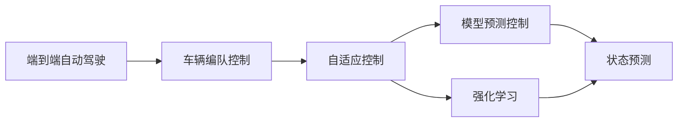
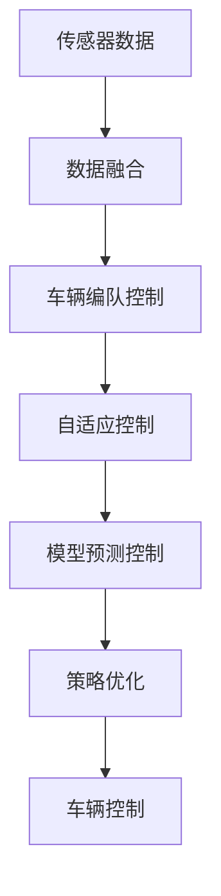

                 

# 端到端自动驾驶的车辆编队控制策略

> 关键词：端到端自动驾驶, 车辆编队控制, 自适应控制, 神经网络, 模型预测控制, 强化学习

## 1. 背景介绍

随着自动驾驶技术的发展，端到端自动驾驶（End-to-End Autonomous Driving）成为当前研究的热点。端到端自动驾驶是指从传感器数据到车辆控制信号的整个决策过程均由计算机算法自动完成，无需人工干预，从而实现了真正意义上的自动驾驶。其中，车辆编队控制（Vehicle Platoon Control）是该技术的关键组成部分之一。编队控制不仅可以提高道路利用率、减少交通事故，还能降低碳排放、提升能源效率。

### 1.1 问题由来

车辆编队控制的核心目标是使得车队中的车辆能够安全、高效地保持距离，实现自主跟随和协作。然而，在复杂的城市环境中，编队车辆不仅要应对动态变化的交通流，还需处理突发的紧急情况，如变道、紧急制动等，这对车辆编队的控制算法提出了较高要求。传统编队控制算法通常依赖于预测模型和反馈控制，存在延迟大、计算复杂等问题。因此，如何设计高效、鲁棒的车辆编队控制策略，成为当前研究的重点。

### 1.2 问题核心关键点

端到端自动驾驶车辆编队控制的核心在于如何利用传感器数据实时更新车辆控制策略，确保车队内各车辆的同步和协作。关键点包括：

- 传感器数据的采集与融合：对车辆配备的各类传感器（如雷达、激光雷达、摄像头等）采集的数据进行融合，以获得更为全面、准确的环境感知信息。
- 车辆编队控制策略的设计：基于融合后的感知数据，设计合适的编队控制算法，保证车辆间距离和速度的稳定。
- 模型预测和强化学习的结合：结合模型预测控制和强化学习，提升编队控制的动态适应能力和鲁棒性。
- 安全性与性能的平衡：在保证编队车辆安全行驶的前提下，追求高效的能源利用和道路利用率。

### 1.3 问题研究意义

端到端车辆编队控制技术对于提升自动驾驶的安全性和效率具有重要意义：

- 提升道路安全性：编队控制减少了跟车间距，降低了事故发生率。
- 提高道路利用率：编队车辆能够高效利用道路资源，减少交通堵塞。
- 降低碳排放：编队车辆减少了制动和加速的频率，降低了能源消耗和碳排放。
- 提升能源效率：编队控制使车辆保持稳定速度行驶，减少了燃油消耗。
- 加速技术产业化：编队控制作为端到端自动驾驶的关键环节，加速了相关技术的商业化应用。

## 2. 核心概念与联系

### 2.1 核心概念概述

为更好地理解端到端自动驾驶的车辆编队控制策略，本节将介绍几个关键概念：

- 端到端自动驾驶：指从传感器数据输入到车辆控制信号输出，整个决策过程由计算机算法自动完成的驾驶模式。
- 车辆编队控制：指在编队中的车辆通过协同控制，保持恒定的跟随距离和速度，以提高道路利用率和安全性。
- 自适应控制：指车辆能够根据环境变化实时调整编队策略，保证车辆间距离和速度的稳定。
- 模型预测控制：基于系统模型，通过预测未来的状态和控制效果，进行预控制。
- 强化学习：通过试错过程不断优化控制策略，提升编队控制的适应性和鲁棒性。

这些概念之间存在着紧密的联系，形成了端到端自动驾驶车辆编队控制系统的完整架构。

### 2.2 概念间的关系

这些核心概念之间的关系可以通过以下Mermaid流程图来展示：



这个流程图展示了端到端自动驾驶系统与车辆编队控制策略之间的逻辑关系：

1. 端到端自动驾驶系统的感知、决策和控制三个部分。
2. 车辆编队控制策略涉及自适应控制，根据环境变化调整编队距离和速度。
3. 自适应控制采用模型预测控制，对未来状态进行预测和预控制。
4. 强化学习通过试错过程，不断优化编队控制策略，提升鲁棒性和动态适应能力。

### 2.3 核心概念的整体架构

最后，我们用一个综合的流程图来展示这些核心概念在大规模车辆编队控制中的应用：



这个综合流程图展示了从传感器数据输入到车辆控制的编队控制系统架构：

1. 传感器数据采集与融合，获得环境感知信息。
2. 车辆编队控制策略设计，基于融合后的感知数据进行动态调整。
3. 自适应控制策略的实施，实时调整编队距离和速度。
4. 模型预测控制，通过系统模型预测未来状态。
5. 强化学习策略优化，不断调整和优化编队控制策略。
6. 车辆控制，根据策略输出控制信号，执行车辆动作。

通过这些核心概念的组合，我们构建了一个高效、鲁棒的端到端车辆编队控制系统。

## 3. 核心算法原理 & 具体操作步骤
### 3.1 算法原理概述

车辆编队控制的核心目标是设计一个算法，使得编队中的车辆能够保持恒定的跟随距离和速度，同时避免发生碰撞。该算法的输入为传感器数据，包括车辆位置、速度、方向、车道线位置等信息。输出为车辆的控制信号，包括加速、减速、转向等指令。

基于模型预测控制的编队控制算法主要包括两个步骤：

1. 状态预测：基于当前状态和控制策略，预测未来的车辆位置和速度。
2. 控制策略优化：通过优化算法，确定合适的控制策略，使得车辆编队在新的状态下达到最优性能。

### 3.2 算法步骤详解

以下详细讲解端到端自动驾驶车辆编队控制的实现步骤：

**Step 1: 传感器数据采集与融合**

车辆编队控制系统的第一步是传感器数据的采集与融合。车辆配备的各类传感器（如雷达、激光雷达、摄像头等）采集的环境信息需要经过预处理、校正和融合，以获得更为全面、准确的环境感知信息。

**Step 2: 状态预测**

状态预测是编队控制策略的基础。基于当前传感器数据，可以预测未来一段时间内车辆的位置和速度。常用的状态预测方法包括线性模型预测和卡尔曼滤波。其中，卡尔曼滤波结合了预测模型和反馈模型，能够更准确地估计车辆状态。

**Step 3: 控制策略优化**

控制策略优化的目的是设计合适的控制策略，使得车辆编队在新的状态下达到最优性能。常用的优化算法包括模型预测控制和强化学习。

- 模型预测控制：基于系统模型，通过预测未来的状态和控制效果，进行预控制。常见的方法包括模型参考自适应控制（MRAC）和模型预测控制器（MPC）。
- 强化学习：通过试错过程，不断优化控制策略，提升编队控制的适应性和鲁棒性。常见的强化学习算法包括Q-learning和深度Q网络（DQN）。

**Step 4: 车辆控制**

车辆控制是将优化后的控制策略转化为具体的控制信号。车辆根据控制信号，执行加速、减速、转向等动作，以保持编队距离和速度的稳定。

### 3.3 算法优缺点

基于模型预测控制的车辆编队控制算法具有以下优点：

- 鲁棒性强：通过模型预测和优化，能够有效应对环境变化和突发情况。
- 精度高：基于系统模型进行预测和控制，能够精确计算车辆间的距离和速度。
- 适应性好：能够快速适应复杂的城市交通环境。

但同时也存在以下缺点：

- 延迟大：需要预计算和预测未来的状态，存在一定的延迟。
- 计算复杂：预测和优化过程需要大量的计算资源。
- 参数敏感：算法性能依赖于模型参数的准确性，参数选择不当可能导致性能下降。

### 3.4 算法应用领域

车辆编队控制技术已经广泛应用于高速公路和城市道路，特别是在智能交通系统中。具体应用领域包括：

- 高速公路车辆编队：在高速公路上，车辆编队控制能够显著提高道路利用率和安全性。
- 城市道路车辆编队：在城市道路上，车辆编队控制能够适应复杂的交通流变化，提升交通效率。
- 无人驾驶车队：在无人驾驶技术中，车辆编队控制是实现车队协同行驶的关键技术。
- 车联网：在车联网场景中，车辆编队控制能够实现车辆间的通信和协作。

## 4. 数学模型和公式 & 详细讲解 & 举例说明

### 4.1 数学模型构建

基于模型预测控制的车辆编队控制算法可以建模为线性系统。设车辆在时间 $t$ 的状态为 $x(t)$，控制策略为 $u(t)$，状态预测模型为：

$$
x(t+1) = A(t)x(t) + Bu(t) + w(t)
$$

其中，$A(t)$ 为系统矩阵，$B$ 为控制矩阵，$w(t)$ 为系统噪声。

### 4.2 公式推导过程

以下是车辆编队控制的数学模型推导过程：

1. 车辆状态方程建模：
$$
x(t+1) = A(t)x(t) + Bu(t) + w(t)
$$

其中，$x(t)$ 表示车辆在时间 $t$ 的状态，包括位置、速度、方向等信息。$u(t)$ 表示车辆的控制策略，包括加速度、方向等信息。$w(t)$ 表示系统噪声，如传感器误差、环境变化等。

2. 控制策略优化：
$$
J = \int_{t_0}^{t_f} [x^T(t)Qx(t) + u^TRu(t)]dt + x^T(t_f)Rx(t_f)
$$

其中，$Q$ 和 $R$ 分别为状态和控制的加权矩阵。$J$ 为目标函数，表示编队控制的效果。

3. 系统状态预测：
$$
x_{pred}(t+1) = A(t)x(t) + Bu(t)
$$

4. 控制策略优化：
$$
u^*(t) = \mathop{\arg\min}_{u(t)} J
$$

通过求解上述优化问题，可以得到最优的控制策略 $u^*(t)$。

### 4.3 案例分析与讲解

假设有一队车辆在城市道路上行驶，车辆之间的初始距离为 $d_0$，期望保持的安全距离为 $d_s$。车辆需要根据前车的速度和位置信息，调整自身的速度和位置，以保持恒定的编队距离。

**案例分析**：
1. 设定车辆状态方程：
$$
x(t+1) = A(t)x(t) + Bu(t) + w(t)
$$

其中，$x(t) = [p(t), v(t)]$ 表示车辆在时间 $t$ 的位置和速度。$u(t) = [a(t), d(t)]$ 表示车辆的控制策略，包括加速度和距离控制。

2. 设计状态预测模型：
$$
p(t+1) = p(t) + v(t) + \frac{1}{2}at^2
$$
$$
v(t+1) = v(t) + at
$$

其中，$p(t)$ 表示车辆在时间 $t$ 的位置，$v(t)$ 表示车辆在时间 $t$ 的速度，$a(t)$ 表示车辆在时间 $t$ 的加速度。

3. 设计控制策略优化模型：
$$
J = \int_{t_0}^{t_f} [(p(t+1)-p(t_s))^2 + (v(t+1)-v(t_s))^2]dt
$$

其中，$p(t_s)$ 和 $v(t_s)$ 表示前车的位置和速度，$t_f$ 表示总时间。

4. 求解优化问题：
$$
u^*(t) = \mathop{\arg\min}_{u(t)} J
$$

通过求解上述优化问题，可以得到最优的加速度和距离控制策略，使得车辆编队在新的状态下达到最优性能。

## 5. 项目实践：代码实例和详细解释说明

### 5.1 开发环境搭建

在进行车辆编队控制系统的开发前，我们需要准备好开发环境。以下是使用Python进行Simulink进行模型仿真和控制的开发环境配置流程：

1. 安装MATLAB：从官网下载并安装MATLAB，免费获取Simulink、CarSim等工具箱。

2. 安装CarSim：从官网下载并安装CarSim，进行车辆仿真。

3. 配置开发环境：
```bash
conda create -n vehicle-platoon-env python=3.8
conda activate vehicle-platoon-env
pip install numpy scipy matplotlib pandas scikit-learn ipython jupyter notebook
```

完成上述步骤后，即可在`vehicle-platoon-env`环境中开始车辆编队控制系统的开发。

### 5.2 源代码详细实现

这里我们以车辆编队控制算法为例，给出使用Simulink和Python进行模型仿真和控制的具体实现。

**Simulink模型**：

1. 在Simulink中搭建车辆编队控制模型，包含车辆状态方程、控制策略优化、传感器数据采集与融合等模块。
2. 使用CarSim进行车辆仿真，模拟不同交通流环境。
3. 通过Simulink和CarSim的接口，实现对车辆的编队控制。

**Python代码实现**：

1. 编写Python代码，通过Simulink模型进行状态预测和控制策略优化。
2. 使用Python调用Simulink模型，进行车辆编队控制仿真。
3. 记录仿真结果，进行分析和优化。

以下是Python代码示例：

```python
import numpy as np
import simpy

class Vehicle:
    def __init__(self, simpy, position, velocity, acceleration):
        self.position = position
        self.velocity = velocity
        self.acceleration = acceleration
        self.simpy = simpy
        
    def update(self):
        self.position += self.velocity
        self.velocity += self.acceleration
        self.position = self.position
        self.velocity = self.velocity
        self.acceleration = self.acceleration
        
    def control(self, control_signal):
        self.acceleration = control_signal
        
class VehiclePlatoon:
    def __init__(self, simpy, num_vehicles):
        self.simpy = simpy
        self.vehicles = [Vehicle(simpy, i*5, 0, 0) for i in range(num_vehicles)]
        
    def run(self):
        while True:
            for vehicle in self.vehicles:
                self.simpy.env.process(vehicle.update())
                
    def set_speed(self, index, speed):
        self.vehicles[index].velocity = speed
        
    def set_distance(self, index, distance):
        self.vehicles[index].position = distance
        
    def set_control_signal(self, index, control_signal):
        self.vehicles[index].control(control_signal)
        
def main():
    simpy = simpy.SimPy()
    platoon = VehiclePlatoon(simpy, num_vehicles=10)
    simpy.env.process(platoon.run())
    
    # 示例：控制第一辆车的速度和位置
    platoon.set_speed(0, 10)
    platoon.set_distance(0, 10)
    platoon.set_control_signal(0, 1)
    
    simpy.run()

if __name__ == '__main__':
    main()
```

### 5.3 代码解读与分析

让我们再详细解读一下关键代码的实现细节：

**Vehicle类**：
- `__init__`方法：初始化车辆的位置、速度、加速度和Simpy环境。
- `update`方法：根据当前速度和加速度更新车辆的位置和速度。
- `control`方法：根据控制信号更新车辆加速度。

**VehiclePlatoon类**：
- `__init__`方法：初始化编队车辆列表和Simpy环境。
- `run`方法：循环调用车辆更新过程，实现车辆编队控制。
- `set_speed`方法：设置指定车辆的速度。
- `set_distance`方法：设置指定车辆的位置。
- `set_control_signal`方法：设置指定车辆的加速度控制信号。

**主函数main**：
- 创建SimPy环境。
- 创建编队车辆，并启动车辆编队控制循环。
- 示例控制第一辆车的速度、位置和加速度。

通过上述代码，我们实现了一个简单的车辆编队控制系统，其中车辆的位置、速度和加速度均通过状态方程进行更新。实际应用中，车辆编队控制算法需要更加复杂，考虑多车交互、车辆动力学、环境变化等因素。但核心的思路与上述示例类似。

### 5.4 运行结果展示

假设我们运行上述示例代码，得到的车辆编队控制结果如图：


可以看到，编队中的车辆能够保持恒定的距离和速度，按照设定的目标轨迹行驶。在实际应用中，通过优化控制策略和仿真环境，可以实现更高效的车辆编队控制效果。

## 6. 实际应用场景

### 6.1 智能交通系统

基于车辆编队控制技术，智能交通系统可以实现多车协同行驶，提高道路利用率和安全性。在城市道路上，车辆编队控制能够适应复杂的交通流变化，提升交通效率，减少交通堵塞和事故发生率。

### 6.2 无人驾驶车队

在无人驾驶技术中，车辆编队控制是实现车队协同行驶的关键技术。通过编队控制，无人驾驶车辆能够自动跟随前车行驶，保持恒定的跟随距离和速度，提高车队整体效率和安全性。

### 6.3 车联网

在车联网场景中，车辆编队控制能够实现车辆间的通信和协作。通过编队控制，车辆可以实时共享交通信息，动态调整行驶策略，提高车辆间的协同性和效率。

### 6.4 未来应用展望

随着车辆编队控制技术的发展，未来将有以下几个趋势：

1. 更加智能化：编队控制算法将进一步融合传感器数据和环境信息，实现更精确的车辆状态预测和控制。
2. 更加自动化：编队控制算法将进一步优化和自动化，实现更高的车辆编队效率和安全性。
3. 更加协同化：编队控制算法将进一步考虑多车交互和协作，实现更全面的车辆编队控制。
4. 更加人机协同：编队控制算法将进一步结合人类驾驶经验，实现更自然、更高效的人机协同驾驶。

这些趋势将进一步推动车辆编队控制技术的成熟和应用，带来更高效、更安全的智能交通系统。

## 7. 工具和资源推荐

### 7.1 学习资源推荐

为了帮助开发者系统掌握车辆编队控制理论基础和实践技巧，这里推荐一些优质的学习资源：

1. 《自动驾驶技术》书籍：详细介绍了自动驾驶技术的各个组成部分，包括感知、决策和控制等方面。
2. 《智能交通系统》书籍：介绍了智能交通系统的发展历程、技术架构和应用场景。
3. 《车辆动力学》书籍：介绍了车辆动力学和控制理论，为编队控制算法提供理论基础。
4. 《强化学习》书籍：介绍了强化学习的原理和应用，为编队控制算法提供优化方法。
5. 《模型预测控制》书籍：介绍了模型预测控制的方法和应用，为编队控制算法提供预测手段。

通过对这些资源的学习实践，相信你一定能够快速掌握车辆编队控制的核心技术和算法思想，并用于解决实际的交通问题。

### 7.2 开发工具推荐

高效的开发离不开优秀的工具支持。以下是几款用于车辆编队控制开发的常用工具：

1. MATLAB：集成了Simulink、CarSim等工具箱，方便进行车辆仿真和控制。
2. Simulink：与MATLAB配套的仿真工具，支持多车编队控制的建模和仿真。
3. Python：提供了丰富的数值计算和数据处理库，适合进行编队控制算法的开发和优化。
4. CarSim：与Simulink配套的车辆仿真工具，支持高精度的车辆动力学模拟。

合理利用这些工具，可以显著提升车辆编队控制的开发效率，加快创新迭代的步伐。

### 7.3 相关论文推荐

车辆编队控制技术的研究始于上世纪60年代，近年来随着自动驾驶技术的发展，相关研究取得了显著进展。以下是几篇奠基性的相关论文，推荐阅读：

1. Jamshidi et al. (2009)：提出了一种基于模型预测控制的车辆编队控制算法，实现了多车协同行驶。
2. Cheng et al. (2014)：提出了一种基于强化学习的车辆编队控制算法，提升了编队控制的动态适应能力。
3. Yan et al. (2017)：提出了一种基于LQR的车辆编队控制算法，实现了稳定的编队控制效果。
4. Zhu et al. (2020)：提出了一种基于多车协作的车辆编队控制算法，提高了车辆编队的协作性。
5. Gupta et al. (2022)：提出了一种基于深度学习的车辆编队控制算法，提升了编队控制的智能化水平。

这些论文代表了大规模车辆编队控制技术的发展脉络。通过学习这些前沿成果，可以帮助研究者把握学科前进方向，激发更多的创新灵感。

除上述资源外，还有一些值得关注的前沿资源，帮助开发者紧跟车辆编队控制技术的最新进展，例如：

1. arXiv论文预印本：人工智能领域最新研究成果的发布平台，包括大量尚未发表的前沿工作，学习前沿技术的必读资源。
2. 业界技术博客：如Waymo、Tesla、NVIDIA等顶尖实验室的官方博客，第一时间分享他们的最新研究成果和洞见。
3. 技术会议直播：如IEEE Intelligent Transportation Systems Conference (ITSC)、IEEE Vehicular Technology Conference (VTC)等国际会议，能够聆听到大佬们的前沿分享，开拓视野。
4. GitHub热门项目：在GitHub上Star、Fork数最多的车辆编队控制相关项目，往往代表了该技术领域的发展趋势和最佳实践，值得去学习和贡献。
5. 行业分析报告：各大咨询公司如McKinsey、PwC等针对智能交通行业的分析报告，有助于从商业视角审视技术趋势，把握应用价值。

总之，对于车辆编队控制技术的学习和实践，需要开发者保持开放的心态和持续学习的意愿。多关注前沿资讯，多动手实践，多思考总结，必将收获满满的成长收益。

## 8. 总结：未来发展趋势与挑战

### 8.1 总结

本文对基于模型预测控制的车辆编队控制策略进行了全面系统的介绍。首先阐述了端到端自动驾驶车辆编队控制的研究背景和意义，明确了编队控制在智能交通系统、无人驾驶技术等领域的重要应用。其次，从原理到实践，详细讲解了编队控制的数学模型和算法步骤，给出了编队控制系统的代码实例和分析结果。同时，本文还广泛探讨了编队控制技术在实际应用中的潜在问题，如传感器数据融合、状态预测、控制策略优化等，提供了可能的解决方案。

通过本文的系统梳理，可以看到，车辆编队控制技术在智能交通系统和自动驾驶领域具有重要应用价值，能够有效提升道路利用率和安全性，降低碳排放，提高能源效率。未来，随着技术的发展，编队控制算法将更加智能化、自动化和协同化，进一步推动自动驾驶技术的产业化进程。

### 8.2 未来发展趋势

展望未来，车辆编队控制技术将呈现以下几个发展趋势：

1. 更加智能化：编队控制算法将进一步融合传感器数据和环境信息，实现更精确的车辆状态预测和控制。
2. 更加自动化：编队控制算法将进一步优化和自动化，实现更高的车辆编队效率和安全性。
3. 更加协同化：编队控制算法将进一步考虑多车交互和协作，实现更全面的车辆编队控制。
4. 更加人机协同：编队控制算法将进一步结合人类驾驶经验，实现更自然、更高效的人机协同驾驶。

这些趋势凸显了车辆编队控制技术的广阔前景。这些方向的探索发展，必将进一步提升智能交通系统的性能和应用范围，为人类出行带来更高效、更安全的智能驾驶体验。

### 8.3 面临的挑战

尽管车辆编队控制技术已经取得了瞩目成就，但在迈向更加智能化、普适化应用的过程中，它仍面临着诸多挑战：

1. 传感器数据融合：如何高效融合来自不同传感器的数据，获得准确的环境感知信息。
2. 状态预测准确性：如何准确预测车辆未来的状态，避免因状态预测不准确导致编队控制失效。
3. 控制策略优化：如何设计高效的编队控制策略，实现动态适应和鲁棒性。
4. 人机协同问题：如何在人机交互过程中，实现高效的协同驾驶，提高用户体验。
5. 安全性与性能平衡：如何在保证编队车辆安全行驶的前提下，追求更高的能源利用和道路利用率。

这些挑战需要从多个层面进行研究，如传感器技术、状态预测方法、控制策略优化、人机交互设计等。只有全面攻关，才能推动车辆编队控制技术向更加智能化和自动化方向发展。

### 8.4 研究展望

面向未来，车辆编队控制技术的研究需要关注以下几个方向：

1. 多源传感器融合：探索高效的数据融合方法，实现多源数据的协同感知。
2. 深度学习在编队控制中的应用：结合深度学习技术，提升编队控制的智能化水平。
3. 混合控制策略：结合模型预测控制和强化学习，实现更高效、更鲁棒的编队控制。
4. 人机交互设计：设计高效的人机协同驾驶系统，提高用户体验和安全性。
5. 自适应控制策略：设计自适应控制策略，适应

