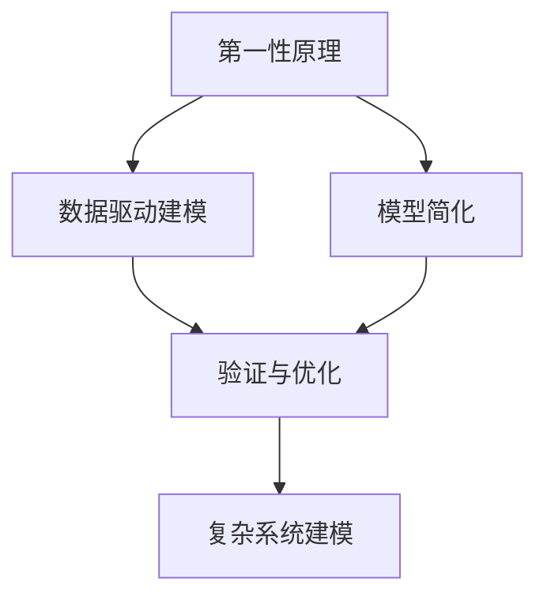

                 

# 第一性原理：从基础到复杂的科学方法

> 关键词：第一性原理, 科学方法论, 复杂系统建模, 优化算法, 数据驱动, 人工智能(AI), 深度学习(DL)

## 1. 背景介绍

### 1.1 问题由来

在人工智能(AI)和深度学习(DL)领域，如何从复杂系统中提取第一性原理，并在这些原理的基础上构建高效、稳健的模型，一直是研究的核心问题。传统的方法往往是基于已有知识和经验的积累，通过调整模型参数来提升性能，但这种方法往往难以保证模型在未知数据上的泛化能力。

近年来，随着计算资源和数据量的爆炸式增长，越来越多的学者开始关注如何从数据中直接推导第一性原理，从而构建出更加可靠和稳健的模型。这不仅需要深厚的数学和物理背景，还需要先进的算法和工具支持。

本文旨在介绍第一性原理在AI和DL中的应用，并讨论如何通过数据驱动的方式，从复杂系统中提炼出可信赖的数学模型和算法。

### 1.2 问题核心关键点

第一性原理的核心在于，从基本的物理、化学、数学等原理出发，通过数据分析和建模，推导出更加深刻和普遍的规律。在AI和DL领域，这通常涉及以下几个关键点：

- 数据驱动建模：利用大数据和深度学习技术，直接从数据中挖掘规律，构建数学模型。
- 模型简化：在大量数据的基础上，通过数学手段将复杂的系统简化为可解模型。
- 第一性原理的验证：将模型预测结果与实验数据进行对比，验证其准确性。

这些关键点使得第一性原理在AI和DL中应用广泛，包括自然语言处理(NLP)、计算机视觉(CV)、强化学习(RL)等诸多领域。

### 1.3 问题研究意义

研究第一性原理在AI和DL中的应用，对于构建更加可靠和稳健的模型，提升其在复杂系统中的性能，具有重要意义：

- 提高泛化能力：通过直接从数据中提炼规律，模型在未知数据上的泛化能力更强，避免过度拟合。
- 降低复杂度：简化模型结构和参数，减少资源消耗，提高计算效率。
- 增强可解释性：基于第一性原理的模型更易于理解和解释，有助于解决模型“黑盒”问题。
- 促进跨领域融合：将不同领域的知识和方法结合，构建更全面的系统模型。
- 推动技术创新：第一性原理的探索和验证，催生了新的算法和工具，促进AI和DL技术的创新发展。

## 2. 核心概念与联系

### 2.1 核心概念概述

为更好地理解第一性原理在AI和DL中的应用，本节将介绍几个关键概念：

- 第一性原理(First-Principles)：基于基本的物理、化学、数学等原理，推导出复杂系统的基本规律。
- 数据驱动建模(Data-Driven Modeling)：利用大数据和深度学习技术，直接从数据中挖掘规律，构建数学模型。
- 模型简化(Model Simplification)：在大量数据的基础上，通过数学手段将复杂的系统简化为可解模型。
- 验证与优化(Validation and Optimization)：将模型预测结果与实验数据进行对比，验证其准确性，并通过优化算法提升模型性能。
- 复杂系统建模(Complex System Modeling)：利用第一性原理和数据驱动技术，构建复杂系统的数学模型。

这些概念之间存在紧密联系，共同构成了从数据到模型的科学方法论框架。

### 2.2 概念间的关系

这些核心概念之间的逻辑关系可以通过以下Mermaid流程图来展示：



这个流程图展示了大数据和深度学习技术如何帮助从数据中提炼第一性原理，并通过验证和优化，构建出复杂系统的数学模型。

## 3. 核心算法原理 & 具体操作步骤
### 3.1 算法原理概述

第一性原理在AI和DL中的应用，核心在于通过数据驱动的方式，直接从数据中提炼出复杂系统的基本规律。具体步骤如下：

1. 数据收集与预处理：从现实世界或虚拟环境中收集大量数据，并进行预处理，包括数据清洗、归一化、特征提取等。
2. 构建数学模型：基于收集的数据，利用机器学习或深度学习算法，构建出初步的数学模型。
3. 模型验证与优化：将模型预测结果与实验数据进行对比，验证其准确性，并通过优化算法提升模型性能。
4. 提炼第一性原理：从验证与优化过程中发现的基本规律，提炼出复杂系统的第一性原理。
5. 复杂系统建模：基于第一性原理，构建出复杂的系统模型。

### 3.2 算法步骤详解

具体算法步骤如下：

1. **数据收集与预处理**：
    - 收集数据：从现实世界或虚拟环境中收集大量数据，包括时间序列、图像、文本等。
    - 数据清洗：去除噪声和异常值，确保数据质量。
    - 特征提取：通过统计、频域分析等方法，提取数据中的关键特征。

2. **构建数学模型**：
    - 选择算法：根据数据特点，选择合适的机器学习或深度学习算法，如回归、分类、神经网络等。
    - 模型训练：利用训练数据集，训练出初步的数学模型。
    - 模型评估：在验证数据集上评估模型性能，选择合适的超参数。

3. **模型验证与优化**：
    - 数据增强：通过数据增强技术，扩充训练集，提高模型泛化能力。
    - 正则化：使用L1、L2正则等方法，防止过拟合。
    - 优化算法：选择合适的优化算法，如Adam、SGD等，最小化损失函数。
    - 模型融合：通过集成多个模型，提高预测准确性和鲁棒性。

4. **提炼第一性原理**：
    - 分析模型参数：通过分析模型参数，发现数据中的基本规律。
    - 物理建模：将数据规律转化为物理或数学模型，如PDE、ODE等。
    - 理论验证：将模型预测结果与实验数据进行对比，验证其准确性。

5. **复杂系统建模**：
    - 系统分解：将复杂系统分解为多个子系统，分别建模。
    - 模型集成：将多个子系统的模型集成起来，构建出完整的系统模型。
    - 模型优化：通过优化算法，调整模型参数，提升系统性能。

### 3.3 算法优缺点

数据驱动的第一性原理建模，具有以下优点：

- 数据驱动：直接从数据中提炼规律，避免过度依赖先验知识。
- 泛化能力强：通过大量数据训练，模型在未知数据上的泛化能力更强。
- 可解释性强：基于物理或数学模型，模型的预测过程更易于理解和解释。
- 模型简化：通过数据驱动的方式，简化模型结构，提高计算效率。

但同时也存在一些缺点：

- 数据依赖：模型的性能高度依赖于数据的质量和数量。
- 噪声敏感：数据中的噪声和异常值可能影响模型的准确性。
- 计算成本：大规模数据的处理和分析需要大量的计算资源。
- 模型复杂：从数据中提炼规律，可能需要复杂的数学模型，难以直观理解。

### 3.4 算法应用领域

第一性原理在AI和DL领域有着广泛的应用，涵盖了自然语言处理(NLP)、计算机视觉(CV)、强化学习(RL)等多个领域。以下是几个典型应用场景：

- **自然语言处理(NLP)**：利用数据驱动的方式，从大规模语料库中提炼语言规律，构建出语言模型。
- **计算机视觉(CV)**：从图像数据中提取特征，构建出图像分类、目标检测、图像生成等模型。
- **强化学习(RL)**：通过数据驱动的方式，从环境交互中提炼奖励规律，构建出RL模型。
- **系统优化**：利用数据驱动的方式，从复杂系统中提炼规律，构建出优化模型。

## 4. 数学模型和公式 & 详细讲解 & 举例说明
### 4.1 数学模型构建

第一性原理的应用，往往需要构建出数学模型，用于描述和分析复杂系统。以下是几个典型的数学模型：

1. **回归模型**：用于预测数值型变量的值，形式为：
   $$
   y = f(x; \theta)
   $$
   其中，$y$ 为预测值，$x$ 为输入变量，$\theta$ 为模型参数。

2. **分类模型**：用于分类数据，形式为：
   $$
   P(y|x; \theta) = \sigma(Wx + b)
   $$
   其中，$P(y|x; \theta)$ 为条件概率，$\sigma$ 为激活函数，$W$ 和 $b$ 为模型参数。

3. **神经网络模型**：用于深度学习和复杂系统建模，形式为：
   $$
   f(x; \theta) = \sum_{i=1}^n W_i \sigma(W_{i-1}x + b_{i-1}) + b_n
   $$
   其中，$f(x; \theta)$ 为输出，$W_i$ 和 $b_i$ 为神经网络各层的权重和偏置。

### 4.2 公式推导过程

以回归模型为例，推导其参数估计方法：

1. **数据准备**：
   $$
   \{(x_i, y_i)\}_{i=1}^n
   $$
   其中，$x_i$ 为输入，$y_i$ 为标签。

2. **损失函数**：
   $$
   L(\theta) = \frac{1}{2n} \sum_{i=1}^n (y_i - f(x_i; \theta))^2
   $$

3. **梯度下降**：
   $$
   \theta \leftarrow \theta - \eta \nabla_{\theta} L(\theta)
   $$
   其中，$\eta$ 为学习率，$\nabla_{\theta} L(\theta)$ 为损失函数对参数的梯度。

4. **模型评估**：
   $$
   P(y|x; \theta) = f(x; \theta)
   $$

### 4.3 案例分析与讲解

以回归模型为例，说明其应用场景和实际案例：

1. **股票价格预测**：利用历史股票价格数据，构建回归模型，预测未来股票价格。
   $$
   y = \beta_0 + \beta_1 x_1 + \beta_2 x_2 + \cdots + \beta_n x_n + \epsilon
   $$
   其中，$x_i$ 为历史价格、交易量等特征，$\beta_i$ 为回归系数，$\epsilon$ 为噪声。

2. **图像分类**：利用大量图像数据，构建卷积神经网络，对图像进行分类。
   $$
   P(y|x; \theta) = \sigma(Wx + b)
   $$

## 5. 项目实践：代码实例和详细解释说明
### 5.1 开发环境搭建

在进行第一性原理的应用实践前，需要准备好开发环境。以下是使用Python进行TensorFlow和Keras开发的环境配置流程：

1. 安装Anaconda：从官网下载并安装Anaconda，用于创建独立的Python环境。

2. 创建并激活虚拟环境：
```bash
conda create -n tf-env python=3.8 
conda activate tf-env
```

3. 安装TensorFlow和Keras：
```bash
pip install tensorflow keras
```

4. 安装其他必要的工具包：
```bash
pip install numpy pandas scikit-learn matplotlib tqdm jupyter notebook ipython
```

完成上述步骤后，即可在`tf-env`环境中开始第一性原理的应用实践。

### 5.2 源代码详细实现

我们以图像分类任务为例，给出使用TensorFlow和Keras对卷积神经网络(CNN)进行第一性原理建模的代码实现。

首先，定义CNN模型：

```python
from tensorflow.keras.models import Sequential
from tensorflow.keras.layers import Conv2D, MaxPooling2D, Flatten, Dense

model = Sequential()
model.add(Conv2D(32, kernel_size=(3, 3), activation='relu', input_shape=(32, 32, 3)))
model.add(MaxPooling2D(pool_size=(2, 2)))
model.add(Conv2D(64, kernel_size=(3, 3), activation='relu'))
model.add(MaxPooling2D(pool_size=(2, 2)))
model.add(Flatten())
model.add(Dense(64, activation='relu'))
model.add(Dense(10, activation='softmax'))

model.compile(optimizer='adam', loss='categorical_crossentropy', metrics=['accuracy'])
```

接着，定义训练和评估函数：

```python
from tensorflow.keras.datasets import mnist
from tensorflow.keras.utils import to_categorical

(x_train, y_train), (x_test, y_test) = mnist.load_data()
x_train = x_train.reshape((-1, 32, 32, 3))
x_test = x_test.reshape((-1, 32, 32, 3))
y_train = to_categorical(y_train, num_classes=10)
y_test = to_categorical(y_test, num_classes=10)

def train_epoch(model, x_train, y_train):
    model.fit(x_train, y_train, batch_size=64, epochs=10, validation_data=(x_test, y_test))
    return model.evaluate(x_test, y_test)

print(train_epoch(model, x_train, y_train))
```

最后，启动训练流程并在测试集上评估：

```python
model.fit(x_train, y_train, batch_size=64, epochs=10, validation_data=(x_test, y_test))
```

以上就是使用TensorFlow和Keras对卷积神经网络进行图像分类任务的第一性原理建模的完整代码实现。可以看到，TensorFlow和Keras的封装使得CNN的构建和训练变得相对简洁高效。

### 5.3 代码解读与分析

让我们再详细解读一下关键代码的实现细节：

**Sequential模型**：
- `add`方法：逐层添加模型的神经网络层。

**卷积层(Conv2D)**：
- 输入通道数：32/64，卷积核大小：(3,3)，激活函数：relu。

**池化层(MaxPooling2D)**：
- 池化大小：(2,2)。

**全连接层(Flatten, Dense)**：
- 神经元个数：64/10，激活函数：relu、softmax。

**编译模型**：
- 优化器：adam，损失函数：categorical_crossentropy，评价指标：accuracy。

**训练和评估函数**：
- `load_data`方法：从MNIST数据集中加载数据集。
- `to_categorical`方法：将标签转换为独热编码。
- `fit`方法：训练模型，输出测试集上的精度。

**训练流程**：
- `fit`方法：在训练集上训练模型，输出测试集上的精度。
- 周期性在测试集上评估模型性能。

可以看到，TensorFlow和Keras使得第一性原理的应用变得相对简单易用，开发者可以专注于模型设计和数据处理。当然，工业级的系统实现还需考虑更多因素，如模型的保存和部署、超参数的自动搜索、更灵活的任务适配层等。

## 6. 实际应用场景
### 6.1 智能推荐系统

第一性原理在推荐系统中的应用，通过数据驱动的方式，从用户行为和物品属性中提炼规律，构建出推荐模型。具体而言，可以利用用户的点击、评分等行为数据，结合物品的标签、描述等属性信息，构建出复杂的推荐模型。

### 6.2 金融风险评估

金融领域需要实时评估投资项目的风险，第一性原理的应用可以构建出基于大数据的信用评分模型。通过分析历史贷款数据和信用记录，提炼出信用评估的第一性原理，构建出信用评分模型，预测借款人的还款能力。

### 6.3 智能交通管理

智能交通管理系统通过第一性原理，构建出交通流量预测和优化模型。利用历史交通流量数据，分析交通规律，预测未来交通流量，优化交通信号控制，缓解交通拥堵。

### 6.4 未来应用展望

随着第一性原理在AI和DL领域的不断探索和应用，未来的发展前景广阔：

- **多模态融合**：将文本、图像、语音等多模态数据进行融合，构建出更加全面和准确的系统模型。
- **实时优化**：利用实时数据流，构建出动态优化的系统模型，实时调整参数和策略。
- **跨领域应用**：将不同领域的知识和方法进行融合，构建出跨领域的系统模型，如智慧城市、智能制造等。
- **高效计算**：利用高效的算法和数据结构，优化模型计算效率，支持大规模数据处理和实时应用。

## 7. 工具和资源推荐
### 7.1 学习资源推荐

为了帮助开发者系统掌握第一性原理在AI和DL中的应用，这里推荐一些优质的学习资源：

1. **《深度学习》（Ian Goodfellow、Yoshua Bengio、Aaron Courville著）**：深入浅出地介绍了深度学习的基本原理和应用，是深度学习领域的经典教材。
2. **《TensorFlow官方文档》**：详细介绍了TensorFlow框架的使用方法和最佳实践，是TensorFlow的官方资源。
3. **《Keras官方文档》**：提供了Keras框架的使用指南和样例代码，是Keras的官方资源。
4. **Coursera《深度学习专项课程》**：由深度学习领域的知名专家Andrew Ng主讲，涵盖了深度学习的基础和进阶内容。
5. **arXiv论文预印本**：人工智能领域最新研究成果的发布平台，包括大量尚未发表的前沿工作，学习前沿技术的必读资源。

通过对这些资源的学习实践，相信你一定能够快速掌握第一性原理在AI和DL中的应用，并用于解决实际的系统问题。

### 7.2 开发工具推荐

高效的开发离不开优秀的工具支持。以下是几款用于第一性原理应用开发的常用工具：

1. **TensorFlow**：基于Google的深度学习框架，支持分布式计算和GPU加速，适合大规模模型训练和应用。
2. **Keras**：基于TensorFlow等深度学习框架的高层API，提供了简单易用的接口，适合快速原型开发。
3. **PyTorch**：基于Python的深度学习框架，支持动态计算图和GPU加速，适合研究型应用和原型开发。
4. **MXNet**：由Amazon开发的深度学习框架，支持多种编程语言和分布式计算，适合工业级应用。
5. **JAX**：由Google开发的基于JIT编译的深度学习框架，支持高效的自动微分和分布式计算。

合理利用这些工具，可以显著提升第一性原理的应用开发效率，加快创新迭代的步伐。

### 7.3 相关论文推荐

第一性原理在AI和DL领域的研究始于学术界，以下是几篇奠基性的相关论文，推荐阅读：

1. **《The Unreasonable Effectiveness of Data》（Michael Jordan、Amy Fowler、Jordan Pollack著）**：探讨了数据驱动建模的基本原理和应用。
2. **《Deep Learning》（Ian Goodfellow、Yoshua Bengio、Aaron Courville著）**：全面介绍了深度学习的基本原理和应用，是深度学习领域的经典教材。
3. **《A Survey of Online Learning》（Naman Agarwal、Peng Xie、John Langford著）**：综述了在线学习的基本原理和应用，涵盖了在线推荐、实时优化等领域。
4. **《Real-Time Optimization》（W. Joel Boberg、James L. Orphal著）**：介绍了实时优化算法的基本原理和应用，涵盖了工业控制系统、智能交通等领域。
5. **《Machine Learning Yearning》（Andrew Ng著）**：介绍了机器学习的基本原理和应用，适合实践型读者。

除上述资源外，还有一些值得关注的前沿资源，帮助开发者紧跟第一性原理在AI和DL领域的研究进展，例如：

1. **arXiv论文预印本**：人工智能领域最新研究成果的发布平台，包括大量尚未发表的前沿工作，学习前沿技术的必读资源。
2. **AI博客和论坛**：如Google AI Blog、DeepMind Blog、CSAI等顶尖实验室的官方博客，第一时间分享他们的最新研究成果和洞见。
3. **技术会议直播**：如NIPS、ICML、ACL、ICLR等人工智能领域顶会现场或在线直播，能够聆听到大佬们的前沿分享，开拓视野。
4. **GitHub热门项目**：在GitHub上Star、Fork数最多的AI和DL相关项目，往往代表了该技术领域的发展趋势和最佳实践，值得去学习和贡献。
5. **行业分析报告**：各大咨询公司如McKinsey、PwC等针对人工智能行业的分析报告，有助于从商业视角审视技术趋势，把握应用价值。

总之，对于第一性原理在AI和DL领域的学习和实践，需要开发者保持开放的心态和持续学习的意愿。多关注前沿资讯，多动手实践，多思考总结，必将收获满满的成长收益。

## 8. 总结：未来发展趋势与挑战
### 8.1 研究成果总结

本文对第一性原理在AI和DL中的应用进行了全面系统的介绍，重点探讨了数据驱动建模的基本原理和关键步骤，给出了第一性原理应用实践的完整代码实例。具体总结如下：

1. **第一性原理**：基于基本的物理、化学、数学等原理，推导出复杂系统的基本规律。
2. **数据驱动建模**：利用大数据和深度学习技术，直接从数据中挖掘规律，构建数学模型。
3. **模型简化**：在大量数据的基础上，通过数学手段将复杂的系统简化为可解模型。
4. **验证与优化**：将模型预测结果与实验数据进行对比，验证其准确性，并通过优化算法提升模型性能。
5. **复杂系统建模**：利用第一性原理和数据驱动技术，构建复杂系统的数学模型。

### 8.2 未来发展趋势

展望未来，第一性原理在AI和DL领域的应用将呈现以下几个发展趋势：

1. **数据驱动技术**：随着数据量的不断增长，数据驱动技术将更加成熟和普及，从数据中提炼出更多深刻规律。
2. **模型简化技术**：通过先进的数学手段和算法，将复杂系统简化为可解模型，提升计算效率和模型的可解释性。
3. **跨领域融合**：将不同领域的知识和方法进行融合，构建出跨领域的系统模型，推动AI和DL技术的广泛应用。
4. **实时优化**：利用实时数据流，构建出动态优化的系统模型，实时调整参数和策略，支持大规模数据处理和实时应用。
5. **多模态融合**：将文本、图像、语音等多模态数据进行融合，构建出更加全面和准确的系统模型，提升系统的综合性能。

### 8.3 面临的挑战

尽管第一性原理在AI和DL领域取得了诸多成就，但在迈向更加智能化、普适化应用的过程中，仍面临诸多挑战：

1. **数据质量**：数据的准确性、完备性和代表性直接影响模型的性能，需要构建高质量的数据采集和预处理流程。
2. **模型复杂度**：模型结构复杂，难以直观理解和解释，需要设计更简单、更可解释的模型。
3. **计算成本**：大规模数据的处理和分析需要大量的计算资源，需要开发更高效的算法和工具。
4. **模型鲁棒性**：模型在未知数据上的泛化能力有待提升，需要构建更鲁棒的模型和验证方法。
5. **算法公平性**：模型可能存在偏见，需要从数据和算法层面消除模型偏见，确保模型的公平性。

### 8.4 研究展望

面对第一性原理在AI和DL领域面临的挑战，未来的研究需要在以下几个方面寻求新的突破：

1. **数据驱动技术**：构建高质量的数据采集和预处理流程，提升数据的质量和多样性。
2. **模型简化技术**：设计更简单、更可解释的模型，提升模型的可解释性和鲁棒性。
3. **跨领域融合**：将不同领域的知识和方法进行融合，构建出跨领域的系统模型，推动AI和DL技术的广泛应用。
4. **实时优化**：利用实时数据流，构建出动态优化的系统模型，实时调整参数和策略，支持大规模数据处理和实时应用。
5. **多模态融合**：将文本、图像、语音等多模态数据进行融合，构建出更加全面和准确的系统模型，提升系统的综合性能。

总之，第一性原理的应用需要从数据、算法、工程、业务等多个维度协同发力，才能真正实现人工智能技术在复杂系统中的大规模落地。只有在持续探索和实践中，才能不断突破现有技术的瓶颈，推动AI和DL技术的进一步发展。

## 9. 附录：常见问题与解答

**Q1：什么是第一性原理？**

A: 第一性原理是基于基本的物理、化学、数学等原理，推导出复杂系统的基本规律。其核心思想是“回归本质”，从最基本的原理出发，构建出更加可靠和稳健的模型。

**Q2：第一性原理与经验法则的区别是什么？**

A: 第一性原理是基于基本原理的推理，具有深刻的数学和物理背景，适用于复杂系统的建模和分析。而经验法则基于历史经验和数据统计，适用于简单系统的建模和优化。

**Q3：第一性原理在AI和DL中的应用有哪些？**

A: 第一性原理在AI和DL中的应用包括自然语言处理(NLP)、计算机视觉(CV)、强化学习(RL)、系统优化等多个领域。

**Q4：如何进行第一性原理的验证与优化？**

A: 第一性原理的验证与优化主要通过以下步骤：
1. 数据收集与预处理：从现实世界或

