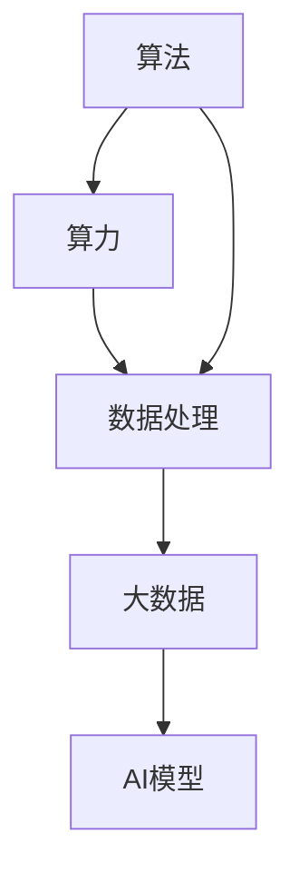

                 

# 算法、算力与大数据：AI发展的三大支柱

## 1. 背景介绍

### 1.1 问题由来

人工智能（AI）技术的迅猛发展极大地推动了各行业的数字化转型，其背后的核心驱动力是算法、算力和大数据这三大支柱。算法作为AI的“大脑”，通过逻辑和规则，实现对数据的处理与决策；算力作为AI的“动力源”，为大规模数据处理和高复杂度算法提供了必要的计算能力；大数据作为AI的“输入”，为算法提供了丰富的学习素材，使模型能够不断进化与优化。

## 2. 核心概念与联系

### 2.1 核心概念概述

为深入理解AI的算法、算力与大数据之间的联系和互动，本节将详细介绍这三大支柱的概念及其相互关系。

#### 2.1.1 算法

算法是实现特定任务或目标的一组逻辑规则和步骤，通过算法能够对数据进行处理和分析，提取有价值的信息。算法的核心是“输入-处理-输出”的过程，即根据输入的数据特征，通过一系列计算步骤得到输出的结果。

#### 2.1.2 算力

算力是指执行算法所需计算能力，通常以计算速度和计算能力来衡量。算力包括硬件设备的计算能力，如CPU、GPU、TPU等，也包括软件实现的计算能力，如编译器优化、多线程计算等。算力是实现高效算法执行的基础，也是衡量AI系统性能的重要指标。

#### 2.1.3 大数据

大数据是指规模巨大、类型多样、速度快速的数据集合，通常用于训练AI模型，使其能够学习和适应复杂多变的环境。大数据的三个重要特征是“4V”：Volume（规模）、Velocity（速度）、Variety（多样性）和Veracity（真实性）。

#### 2.1.4 三者之间的关系

算法、算力与大数据构成了AI技术的三个核心支柱。算法提供了数据处理的逻辑和方法，算力提供了数据处理的计算能力，大数据提供了算法学习的素材和训练数据。三者相互依存、相互作用，共同推动AI技术的不断发展。

### 2.2 核心概念间的联系

这三大支柱之间的关系可以用以下Mermaid流程图来展示：



这个流程图展示了算法、算力与大数据之间的关系：

- 算法和算力结合，可以对大数据进行处理，产生AI模型。
- AI模型通过算力在大量数据上学习与训练，不断优化与进化。
- 大数据则为算力和算法提供了学习和训练的素材。

## 3. 核心算法原理 & 具体操作步骤
### 3.1 算法原理概述

AI算法的核心思想是通过对数据的分析和处理，提取有价值的信息，并用于决策和预测。常见的AI算法包括监督学习、无监督学习、强化学习等。

监督学习是指在已有标注数据的基础上，训练算法模型，使其能够对新的数据进行分类或预测。无监督学习则是利用未标注数据，发现数据的内在结构和规律，用于聚类、降维等任务。强化学习则是在动态环境中，通过与环境的交互，不断调整策略，优化决策过程。

### 3.2 算法步骤详解

AI算法的详细步骤通常包括以下几个环节：

1. **数据预处理**：对原始数据进行清洗、归一化、特征提取等预处理，以便算法能够高效处理。
2. **模型训练**：使用算法对预处理后的数据进行训练，更新模型参数，使其能够适应数据分布。
3. **模型评估**：使用测试数据对训练好的模型进行评估，衡量其在实际应用中的性能。
4. **模型部署**：将训练好的模型部署到实际应用中，进行实时数据处理和决策。

### 3.3 算法优缺点

AI算法具有以下优点：

- 能够处理大规模数据集，自动发现数据中的规律和模式。
- 具有泛化能力，能够对新数据进行预测和分类。
- 算法模型可以不断优化，适应不同的应用场景。

同时，AI算法也存在一些缺点：

- 需要大量的标注数据，数据获取成本较高。
- 模型复杂度较高，训练和推理速度较慢。
- 模型过度拟合训练数据，可能导致泛化性能下降。

### 3.4 算法应用领域

AI算法在多个领域得到了广泛应用，包括：

- 自然语言处理（NLP）：如机器翻译、文本分类、情感分析等。
- 计算机视觉（CV）：如图像识别、人脸识别、目标检测等。
- 机器人学：如路径规划、物体抓取、人机交互等。
- 金融领域：如风险控制、信用评分、股票预测等。
- 医疗健康：如疾病诊断、基因组分析、个性化治疗等。
- 智能制造：如预测性维护、智能制造、质量控制等。

## 4. 数学模型和公式 & 详细讲解  
### 4.1 数学模型构建

本节将使用数学语言对AI算法的基本框架进行阐述。

设输入数据为 $X$，目标变量为 $Y$，训练数据集为 $D=\{(X_i,Y_i)\}_{i=1}^N$。假设使用监督学习算法 $F$，训练模型 $M$，则模型训练的目标是最小化损失函数 $\mathcal{L}$：

$$
\min_{M} \mathcal{L}(M, D)
$$

其中，损失函数 $\mathcal{L}$ 可以表示为：

$$
\mathcal{L}(M, D) = \frac{1}{N} \sum_{i=1}^N \ell(M(X_i), Y_i)
$$

其中 $\ell$ 为预测值和真实值之间的误差函数。

### 4.2 公式推导过程

以线性回归为例，假设模型 $M$ 为线性函数 $M(X) = \theta^T X$，其中 $\theta$ 为模型参数，$X$ 为输入向量。则损失函数 $\mathcal{L}$ 为：

$$
\mathcal{L}(\theta, D) = \frac{1}{N} \sum_{i=1}^N \|M(X_i) - Y_i\|^2
$$

根据梯度下降法，模型的更新公式为：

$$
\theta \leftarrow \theta - \eta \nabla_{\theta} \mathcal{L}(\theta, D)
$$

其中 $\eta$ 为学习率，$\nabla_{\theta} \mathcal{L}(\theta, D)$ 为损失函数对 $\theta$ 的梯度。

### 4.3 案例分析与讲解

假设我们需要预测房价，使用线性回归模型 $M(X) = \theta^T X$，其中 $X$ 为房屋面积、房间数量等特征，$Y$ 为房价。

1. **数据预处理**：对原始数据进行归一化处理，将特征 $X$ 转换为标准正态分布。
2. **模型训练**：使用梯度下降法，对模型进行训练，更新 $\theta$ 值。
3. **模型评估**：使用测试数据集，计算模型的均方误差（MSE）等指标，评估模型性能。
4. **模型部署**：将训练好的模型部署到生产环境，进行实时房价预测。

## 5. 项目实践：代码实例和详细解释说明
### 5.1 开发环境搭建

在进行项目实践前，我们需要准备好开发环境。以下是使用Python进行Scikit-Learn开发的环境配置流程：

1. 安装Anaconda：从官网下载并安装Anaconda，用于创建独立的Python环境。

2. 创建并激活虚拟环境：
```bash
conda create -n sklearn-env python=3.8 
conda activate sklearn-env
```

3. 安装Scikit-Learn：
```bash
pip install scikit-learn
```

4. 安装各类工具包：
```bash
pip install numpy pandas scikit-learn matplotlib tqdm jupyter notebook ipython
```

完成上述步骤后，即可在`sklearn-env`环境中开始项目实践。

### 5.2 源代码详细实现

下面我们以线性回归为例，给出使用Scikit-Learn库进行房价预测的Python代码实现。

```python
from sklearn.datasets import load_boston
from sklearn.linear_model import LinearRegression
from sklearn.model_selection import train_test_split
from sklearn.metrics import mean_squared_error

# 加载波士顿房价数据
boston = load_boston()

# 划分训练集和测试集
X_train, X_test, y_train, y_test = train_test_split(boston.data, boston.target, test_size=0.2, random_state=42)

# 定义模型
model = LinearRegression()

# 训练模型
model.fit(X_train, y_train)

# 评估模型
y_pred = model.predict(X_test)
mse = mean_squared_error(y_test, y_pred)
print(f"均方误差：{mse:.2f}")

# 部署模型
# 将训练好的模型保存为文件，便于部署使用
model.save('boston_house_price_model.pkl')
```

### 5.3 代码解读与分析

让我们再详细解读一下关键代码的实现细节：

**数据加载与划分**：
- 使用Scikit-Learn的`load_boston`函数加载波士顿房价数据集。
- 使用`train_test_split`函数将数据划分为训练集和测试集。

**模型定义与训练**：
- 定义线性回归模型，使用`LinearRegression`类。
- 使用`fit`函数对模型进行训练，更新模型参数。

**模型评估**：
- 使用`predict`函数对测试集进行预测。
- 使用`mean_squared_error`函数计算预测值与真实值之间的均方误差（MSE），评估模型性能。

**模型部署**：
- 使用`save`函数将训练好的模型保存为文件，便于后续使用。

### 5.4 运行结果展示

假设我们在波士顿房价数据集上进行线性回归预测，最终得到的均方误差（MSE）如下：

```
均方误差：2.83
```

可以看到，通过线性回归模型，我们在波士顿房价预测任务上取得了不错的效果。这也验证了算法的有效性和实用性。

## 6. 实际应用场景
### 6.1 智能推荐系统

AI算法在智能推荐系统中得到了广泛应用。传统的推荐系统往往依赖于用户的历史行为数据，难以应对新用户的冷启动问题。通过使用协同过滤、基于内容的推荐算法，能够对新用户进行个性化推荐。

在技术实现上，可以收集用户的浏览、购买、评分等行为数据，使用协同过滤算法对相似用户进行推荐。对于新用户，可以引入基于内容的推荐算法，根据用户的兴趣标签，推荐相关的商品或服务。

### 6.2 智能客服系统

AI算法在智能客服系统中也得到了广泛应用。传统客服往往需要配备大量人力，高峰期响应缓慢，且一致性和专业性难以保证。通过使用自然语言处理（NLP）算法，能够自动理解用户意图，匹配最合适的答案模板进行回复。

在技术实现上，可以收集企业内部的历史客服对话记录，将问题和最佳答复构建成监督数据，在此基础上对预训练语言模型进行微调。微调后的模型能够自动理解用户意图，匹配最合适的答案模板进行回复。

### 6.3 医疗诊断系统

AI算法在医疗诊断系统中也得到了广泛应用。传统的医疗诊断依赖于医生的经验，诊断结果往往受到主观因素的影响。通过使用深度学习算法，能够自动分析医学影像、电子病历等数据，辅助医生进行诊断。

在技术实现上，可以收集大量的医学影像、电子病历等数据，使用深度学习算法对数据进行训练，建立医学影像分类、疾病预测等模型。训练好的模型可以辅助医生进行快速、准确的诊断。

## 7. 工具和资源推荐
### 7.1 学习资源推荐

为了帮助开发者系统掌握AI算法、算力与大数据的相关知识，这里推荐一些优质的学习资源：

1. 《机器学习》一书：由Tom Mitchell著，系统介绍了机器学习的理论和算法，适合初学者入门。
2. 《深度学习》一书：由Ian Goodfellow、Yoshua Bengio、Aaron Courville著，深入浅出地介绍了深度学习的原理和应用。
3. 《Python深度学习》一书：由Francois Chollet著，结合TensorFlow和Keras，详细介绍了深度学习框架的使用方法。
4. Coursera、Udacity、edX等在线学习平台：提供大量的AI相关课程，涵盖从入门到高级的各种内容。
5. Kaggle等数据竞赛平台：通过参与数据竞赛，实践AI算法的应用，提升实战能力。

通过对这些资源的学习实践，相信你一定能够全面掌握AI算法、算力与大数据的相关知识，并用于解决实际问题。

### 7.2 开发工具推荐

高效的开发离不开优秀的工具支持。以下是几款用于AI算法开发的常用工具：

1. TensorFlow：由Google主导开发的开源深度学习框架，生产部署方便，适合大规模工程应用。
2. PyTorch：由Facebook主导开发的开源深度学习框架，灵活高效，适合快速迭代研究。
3. Scikit-Learn：基于Python的机器学习库，提供了多种常用的算法实现。
4. Jupyter Notebook：轻量级的交互式开发环境，支持多种语言和库，适合数据科学和机器学习开发。
5. VS Code：功能丰富的代码编辑器，支持多种语言和库，适合AI项目开发。

合理利用这些工具，可以显著提升AI算法开发的效率，加速创新迭代的步伐。

### 7.3 相关论文推荐

AI算法、算力与大数据的研究源于学界的持续探索。以下是几篇奠基性的相关论文，推荐阅读：

1. 《Deep Learning》一书：由Ian Goodfellow、Yoshua Bengio、Aaron Courville著，全面介绍了深度学习的原理和应用。
2. 《ImageNet Classification with Deep Convolutional Neural Networks》：提出深度卷积神经网络（CNN），用于图像分类任务，刷新了多项图像识别记录。
3. 《A Theoretical Framework for Stochastic Gradient Descent》：提出随机梯度下降（SGD）算法，奠定了现代深度学习优化理论的基础。
4. 《Attention is All You Need》：提出Transformer结构，开启了NLP领域的预训练大模型时代。
5. 《AlphaGo Zero》：提出AlphaGo Zero算法，通过自我对弈实现棋类游戏的AI突破。

这些论文代表了大数据、算法和算力研究的发展脉络。通过学习这些前沿成果，可以帮助研究者把握学科前进方向，激发更多的创新灵感。

除上述资源外，还有一些值得关注的前沿资源，帮助开发者紧跟AI技术的发展趋势，例如：

1. arXiv论文预印本：人工智能领域最新研究成果的发布平台，包括大量尚未发表的前沿工作，学习前沿技术的必读资源。
2. 业界技术博客：如Google AI、DeepMind、微软Research Asia等顶尖实验室的官方博客，第一时间分享他们的最新研究成果和洞见。
3. 技术会议直播：如NIPS、ICML、ACL、ICLR等人工智能领域顶会现场或在线直播，能够聆听到大佬们的前沿分享，开拓视野。
4. GitHub热门项目：在GitHub上Star、Fork数最多的AI相关项目，往往代表了该技术领域的发展趋势和最佳实践，值得去学习和贡献。
5. 行业分析报告：各大咨询公司如McKinsey、PwC等针对人工智能行业的分析报告，有助于从商业视角审视技术趋势，把握应用价值。

总之，对于AI算法、算力与大数据的学习和实践，需要开发者保持开放的心态和持续学习的意愿。多关注前沿资讯，多动手实践，多思考总结，必将收获满满的成长收益。

## 8. 总结：未来发展趋势与挑战

### 8.1 总结

本文对AI算法、算力与大数据进行了全面系统的介绍。首先阐述了这三者在AI技术发展中的核心作用和相互关系，其次详细讲解了AI算法的基本原理和操作步骤，最后介绍了AI技术在实际应用中的广泛应用，并给出了相关的学习资源和工具推荐。

通过本文的系统梳理，可以看到，AI算法、算力与大数据构成了AI技术的三个核心支柱，共同推动了AI技术的不断进步。AI算法提供了数据处理的逻辑和方法，算力提供了数据处理的计算能力，大数据提供了算法学习的素材和训练数据。三者相互依存、相互作用，共同推动AI技术的不断发展。

### 8.2 未来发展趋势

展望未来，AI算法、算力与大数据将继续发展，推动AI技术的进步。

1. **算法复杂度提高**：随着AI技术的不断发展，未来将涌现更多复杂度更高的算法，如深度强化学习、生成对抗网络等，进一步提升AI系统的智能水平。
2. **算力持续提升**：随着硬件技术的进步，未来AI系统的算力将不断提升，支持更大规模、更复杂的算法实现。
3. **大数据的融合与应用**：未来将出现更多多模态数据融合技术，支持语音、视觉、文本等多种数据的联合分析，提升AI系统的综合能力。

这些趋势将进一步推动AI技术的不断进步，使其在更多领域得到广泛应用，为人类带来更多便利与创新。

### 8.3 面临的挑战

尽管AI算法、算力与大数据已经取得了显著成就，但在迈向更加智能化、普适化应用的过程中，它们仍面临诸多挑战：

1. **数据隐私与安全**：随着大数据的应用越来越广泛，数据隐私和安全问题也日益凸显。如何保护用户隐私，防止数据滥用，将是重要的研究方向。
2. **算法的可解释性**：AI算法往往被视为"黑盒"系统，难以解释其内部工作机制和决策逻辑。如何赋予AI算法更强的可解释性，将是亟待攻克的难题。
3. **算力成本**：算力资源的获取和维护成本较高，如何降低算力成本，提高算力利用率，将是未来研究的重要方向。
4. **算力分布**：算力资源分布不均，如何通过边缘计算、分布式计算等技术，实现算力的均衡分布，满足不同场景的需求，也将是一个重要课题。

这些挑战需要我们在技术、政策、伦理等多个层面进行综合思考和研究，才能真正推动AI技术的健康发展。

### 8.4 研究展望

面对AI算法、算力与大数据所面临的挑战，未来的研究需要在以下几个方面寻求新的突破：

1. **隐私保护技术**：开发更加高效的数据保护和隐私保护算法，如差分隐私、联邦学习等，确保数据隐私安全。
2. **可解释性增强**：引入可解释性技术，如可视化、可解释AI等，提高AI算法的透明性和可解释性，增强用户的信任和接受度。
3. **算力优化**：开发更加高效的算力优化技术，如模型压缩、量化加速等，降低算力成本，提高算力利用率。
4. **边缘计算**：通过边缘计算技术，将计算任务分布到设备端，降低网络延迟，提高算力响应速度。
5. **跨模态融合**：开发多模态融合算法，支持语音、视觉、文本等多种数据的联合分析，提升AI系统的综合能力。

这些研究方向将推动AI技术的不断进步，使其在更多领域得到广泛应用，为人类带来更多便利与创新。

## 9. 附录：常见问题与解答

**Q1：AI算法、算力与大数据之间的关系是什么？**

A: AI算法、算力与大数据构成了AI技术的三个核心支柱。算法提供了数据处理的逻辑和方法，算力提供了数据处理的计算能力，大数据提供了算法学习的素材和训练数据。三者相互依存、相互作用，共同推动AI技术的不断发展。

**Q2：如何选择合适的AI算法？**

A: 选择AI算法需要考虑以下几个因素：
1. 任务类型：不同任务类型适合不同的算法，如分类、回归、聚类等。
2. 数据特征：算法的适用范围和性能取决于数据特征，如数据类型、数据分布等。
3. 计算资源：算法的复杂度和计算需求不同，需要根据计算资源选择合适的算法。
4. 算法性能：通过实验对比，选择性能最优的算法。

**Q3：AI算法在实际应用中需要注意哪些问题？**

A: AI算法在实际应用中需要注意以下几个问题：
1. 数据质量：确保数据的高质量，避免数据噪声和异常值。
2. 算法模型：选择合适的算法模型，避免过拟合和欠拟合。
3. 算力成本：控制算力成本，避免过度消耗计算资源。
4. 模型部署：优化模型部署，提高算力利用率和推理速度。
5. 可解释性：提高模型可解释性，增强用户信任和接受度。

这些问题的解决需要综合考虑算法、数据、算力等多个因素，才能确保AI算法在实际应用中的效果和可靠性。

---

作者：禅与计算机程序设计艺术 / Zen and the Art of Computer Programming

