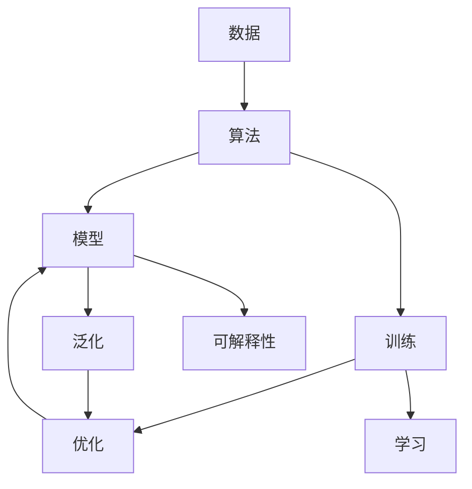

                 

# 算法：AI发展的核心驱动力

> 关键词：算法、AI、人工智能、机器学习、深度学习、强化学习、神经网络、优化算法、模型优化、数据挖掘、自然语言处理

## 1. 背景介绍

### 1.1 问题由来
随着科技的不断进步，人工智能（AI）逐渐从科幻变为现实，渗透到了各行各业。在众多AI技术中，算法是最核心的驱动力之一。算法不仅决定了AI系统的功能，还直接影响其性能和应用效果。因此，深入理解算法的原理与实现，是掌握AI技术的基石。

### 1.2 问题核心关键点
算法在AI中扮演了至关重要的角色，具体表现在以下几个方面：

- 核心竞争力：一个优秀的算法是AI系统的核心竞争力，能够显著提升系统的精度、效率和鲁棒性。
- 多样化应用：算法的应用领域广泛，从自然语言处理、计算机视觉到机器人控制、游戏AI等，几乎涵盖了所有AI领域。
- 发展趋势：随着AI技术的不断进步，算法也在不断发展，从传统的监督学习到深度学习、强化学习、无监督学习等，不断涌现出新的算法和模型。

### 1.3 问题研究意义
理解算法在AI发展中的作用，有助于开发者和研究者掌握AI技术的精髓，推动AI技术在更多领域的应用。

1. 推动AI技术进步：算法是AI技术进步的重要推动力，不断优化的算法能够带来性能提升和应用突破。
2. 降低技术门槛：理解算法的原理和实现，可以大大降低AI技术的入门门槛，让更多人能够参与其中。
3. 促进产业应用：算法的优化和应用，能够加速AI技术在各个产业的落地和应用，推动产业转型升级。
4. 产生经济效益：优秀的算法能够带来更高的商业价值，推动AI相关企业的市场竞争力。

## 2. 核心概念与联系

### 2.1 核心概念概述

要深入理解算法的核心驱动力，需要掌握以下几个关键概念：

- 算法（Algorithm）：一种按照特定规则解决问题的方法，是AI技术的核心。
- 数据（Data）：算法的输入和输出，对算法的效果有着重要影响。
- 模型（Model）：算法的中间结果，用于对数据进行抽象和表示。
- 学习（Learning）：通过训练数据不断优化算法和模型，提升其预测能力和泛化能力。
- 优化（Optimization）：在模型训练过程中，通过最小化损失函数来调整模型参数，提升模型精度。
- 泛化（Generalization）：模型在未知数据上的表现能力，是评估算法性能的重要指标。
- 可解释性（Interpretability）：算法的决策过程是否透明、可理解，对于某些应用领域尤为重要。

### 2.2 概念间的关系

通过以下Mermaid流程图，我们可以更加直观地理解这些核心概念之间的关系：



这个流程图展示了数据、算法、模型、学习、优化、泛化、可解释性之间的关系：

1. 数据是算法的输入，经过算法处理后形成模型。
2. 学习过程通过训练数据不断优化模型，提升其预测能力。
3. 优化过程通过调整模型参数，进一步提升模型精度。
4. 泛化能力衡量模型在未知数据上的表现，是评估算法效果的重要指标。
5. 可解释性关注算法的决策过程是否透明，对于应用场景的可靠性至关重要。

这些概念共同构成了AI算法的生态系统，支撑着AI技术的各个方面。

## 3. 核心算法原理 & 具体操作步骤
### 3.1 算法原理概述

AI算法包括监督学习、无监督学习、半监督学习、强化学习等多种类型，每种算法都有其独特的原理和实现方式。

以监督学习为例，其基本原理是通过训练数据学习输入与输出之间的映射关系，从而实现对新数据的预测和分类。监督学习的核心步骤包括：

1. 数据预处理：对原始数据进行清洗、归一化、特征选择等处理，提升数据质量。
2. 模型选择：根据任务类型选择合适的模型，如线性回归、决策树、支持向量机等。
3. 模型训练：通过训练数据不断优化模型参数，使得模型输出逼近真实标签。
4. 模型评估：在测试数据上评估模型性能，包括准确率、召回率、F1值等指标。

### 3.2 算法步骤详解

下面以深度学习中的卷积神经网络（Convolutional Neural Network, CNN）为例，详细讲解其算法步骤。

#### 3.2.1 数据预处理

数据预处理是深度学习中重要的一环，包括：

- 数据清洗：去除噪音数据、重复数据等。
- 数据归一化：将数据缩放到[0,1]或[-1,1]范围内，避免梯度爆炸或消失。
- 数据增强：通过旋转、翻转、裁剪等方式扩充数据集，提升模型泛化能力。

#### 3.2.2 模型定义

卷积神经网络由多个卷积层、池化层和全连接层组成，其基本结构如下：

```python
import tensorflow as tf

model = tf.keras.Sequential([
    tf.keras.layers.Conv2D(32, (3, 3), activation='relu', input_shape=(32, 32, 3)),
    tf.keras.layers.MaxPooling2D((2, 2)),
    tf.keras.layers.Conv2D(64, (3, 3), activation='relu'),
    tf.keras.layers.MaxPooling2D((2, 2)),
    tf.keras.layers.Flatten(),
    tf.keras.layers.Dense(64, activation='relu'),
    tf.keras.layers.Dense(10)
])
```

#### 3.2.3 模型训练

模型训练通过反向传播算法，不断优化模型参数。以MNIST手写数字识别为例，训练过程如下：

```python
model.compile(optimizer=tf.keras.optimizers.Adam(),
              loss=tf.keras.losses.SparseCategoricalCrossentropy(from_logits=True),
              metrics=['accuracy'])

model.fit(x_train, y_train, epochs=10, validation_data=(x_test, y_test))
```

#### 3.2.4 模型评估

模型评估通过在测试集上评估模型性能，包括：

- 准确率：预测正确的样本数占总样本数的比例。
- 召回率：真正例占所有正例的比例。
- F1值：综合准确率和召回率，是综合指标。

### 3.3 算法优缺点

深度学习算法虽然效果显著，但也存在以下缺点：

- 需要大量标注数据：深度学习算法对标注数据的需求量很大，标注成本较高。
- 计算资源消耗大：深度学习模型通常参数量较大，计算资源消耗较大。
- 过拟合风险：深度学习模型容易过拟合，需要采取正则化等手段。
- 可解释性差：深度学习模型往往是一个"黑盒"，缺乏可解释性。

### 3.4 算法应用领域

深度学习算法广泛应用于计算机视觉、自然语言处理、语音识别等领域，以下是几个典型应用：

- 计算机视觉：图像分类、目标检测、图像分割等。
- 自然语言处理：机器翻译、情感分析、文本生成等。
- 语音识别：语音识别、语音合成、语音情感分析等。

## 4. 数学模型和公式 & 详细讲解  
### 4.1 数学模型构建

在深度学习中，常用的数学模型包括损失函数、优化器、激活函数等。

以线性回归为例，其数学模型如下：

$$
y = wx + b
$$

其中，$y$是预测值，$x$是输入特征，$w$是权重，$b$是偏置。常用的损失函数有均方误差（MSE）和交叉熵（Cross Entropy）。

#### 4.1.1 均方误差（MSE）

均方误差定义为：

$$
L(y, \hat{y}) = \frac{1}{2N} \sum_{i=1}^{N} (y_i - \hat{y}_i)^2
$$

其中，$y_i$是真实标签，$\hat{y}_i$是模型预测值。

#### 4.1.2 交叉熵（Cross Entropy）

交叉熵定义为：

$$
L(y, \hat{y}) = -\frac{1}{N} \sum_{i=1}^{N} y_i \log(\hat{y}_i)
$$

其中，$y_i$是真实标签，$\hat{y}_i$是模型预测值。

### 4.2 公式推导过程

以深度学习中的梯度下降算法为例，推导其基本过程。

梯度下降算法的目标是不断调整模型参数，使得损失函数最小化。以梯度下降算法为例，其基本步骤如下：

1. 计算损失函数对参数的梯度：

$$
\frac{\partial L}{\partial w} = \frac{1}{N} \sum_{i=1}^{N} -2(x_i - y_i)
$$

2. 更新模型参数：

$$
w \leftarrow w - \eta \frac{\partial L}{\partial w}
$$

其中，$\eta$是学习率。

### 4.3 案例分析与讲解

以卷积神经网络为例，讲解其在图像识别中的应用。

卷积神经网络通过卷积层和池化层提取图像的局部特征，然后通过全连接层进行分类。以MNIST手写数字识别为例，其算法步骤如下：

1. 数据预处理：对MNIST数据集进行清洗、归一化和增强。
2. 模型定义：构建一个包含两个卷积层、两个池化层和两个全连接层的卷积神经网络。
3. 模型训练：通过反向传播算法优化模型参数，使得模型在训练集上达到最优。
4. 模型评估：在测试集上评估模型性能，输出准确率和召回率等指标。

## 5. 项目实践：代码实例和详细解释说明
### 5.1 开发环境搭建

在深度学习项目中，通常使用Python和TensorFlow等工具。以下是在Linux系统下搭建开发环境的步骤：

1. 安装Python：使用conda或apt-get安装Python 3.x。
2. 安装TensorFlow：使用pip安装TensorFlow 2.x版本。
3. 安装Keras：使用pip安装Keras，作为TensorFlow的高层API。
4. 安装NumPy、Pandas等库：使用pip安装常用的Python库。

### 5.2 源代码详细实现

以MNIST手写数字识别为例，展示使用TensorFlow构建卷积神经网络的代码：

```python
import tensorflow as tf

# 加载MNIST数据集
mnist = tf.keras.datasets.mnist
(x_train, y_train), (x_test, y_test) = mnist.load_data()

# 数据预处理
x_train = x_train.reshape((60000, 28, 28, 1))
x_test = x_test.reshape((10000, 28, 28, 1))
x_train = x_train / 255.0
x_test = x_test / 255.0

# 构建卷积神经网络
model = tf.keras.Sequential([
    tf.keras.layers.Conv2D(32, (3, 3), activation='relu', input_shape=(28, 28, 1)),
    tf.keras.layers.MaxPooling2D((2, 2)),
    tf.keras.layers.Conv2D(64, (3, 3), activation='relu'),
    tf.keras.layers.MaxPooling2D((2, 2)),
    tf.keras.layers.Flatten(),
    tf.keras.layers.Dense(64, activation='relu'),
    tf.keras.layers.Dense(10)
])

# 编译模型
model.compile(optimizer=tf.keras.optimizers.Adam(),
              loss=tf.keras.losses.SparseCategoricalCrossentropy(from_logits=True),
              metrics=['accuracy'])

# 训练模型
model.fit(x_train, y_train, epochs=10, validation_data=(x_test, y_test))

# 评估模型
model.evaluate(x_test, y_test)
```

### 5.3 代码解读与分析

代码中的关键步骤包括：

1. 加载MNIST数据集：使用TensorFlow内置的MNIST数据集。
2. 数据预处理：将数据转换为TensorFlow支持的格式，并进行归一化处理。
3. 构建卷积神经网络：使用Keras定义卷积神经网络的结构。
4. 编译模型：设置优化器和损失函数，指定评估指标。
5. 训练模型：使用训练集数据进行模型训练，并指定验证集数据。
6. 评估模型：使用测试集数据评估模型性能，并输出评估指标。

## 6. 实际应用场景
### 6.1 自然语言处理

自然语言处理是深度学习的重要应用领域之一，包括语言模型、机器翻译、情感分析等任务。深度学习算法能够处理大规模文本数据，提升自然语言处理的效果。

例如，使用Transformer架构的BERT模型，通过在大规模语料上进行预训练，能够在问答、文本分类、命名实体识别等任务上取得优异效果。

### 6.2 计算机视觉

计算机视觉领域包括图像分类、目标检测、图像分割等任务。深度学习算法通过卷积神经网络等模型，能够有效提取图像的局部特征，提升视觉处理能力。

例如，使用卷积神经网络架构的ResNet模型，能够在图像分类任务上取得优异效果。

### 6.3 语音识别

语音识别领域包括语音识别、语音合成、语音情感分析等任务。深度学习算法通过循环神经网络等模型，能够有效处理时序数据，提升语音处理能力。

例如，使用循环神经网络架构的LSTM模型，能够在语音识别任务上取得优异效果。

## 7. 工具和资源推荐
### 7.1 学习资源推荐

要深入学习深度学习算法，可以参考以下资源：

- 《深度学习》（Ian Goodfellow）：深度学习领域的经典教材，详细讲解了深度学习的原理和应用。
- 《Python深度学习》（Francois Chollet）：Keras的作者所著，讲解了如何使用Keras构建深度学习模型。
- Coursera深度学习课程：由斯坦福大学教授Andrew Ng主讲，讲解了深度学习的基本原理和实现。
- DeepLearning.ai深度学习专业课程：由Andrew Ng主讲，包括深度学习基础、深度学习应用等课程。

### 7.2 开发工具推荐

深度学习开发通常使用Python、TensorFlow、Keras等工具。以下是一些推荐的开发工具：

- Jupyter Notebook：Python的交互式开发环境，支持代码执行和结果展示。
- PyCharm：Python的IDE工具，支持代码编辑、调试和版本控制。
- GitHub：代码托管平台，支持协作开发和代码版本控制。

### 7.3 相关论文推荐

深度学习算法的研究非常活跃，以下是一些经典的深度学习论文：

- AlexNet：卷积神经网络在图像分类任务上的突破性工作。
- GoogleNet：提出Inception模块，提升卷积神经网络的效率和精度。
- ResNet：提出残差网络，解决深度神经网络训练中的梯度消失问题。
- Transformer：提出自注意力机制，提升自然语言处理的精度和效果。

## 8. 总结：未来发展趋势与挑战
### 8.1 总结

本文详细介绍了深度学习算法在AI发展中的核心驱动力，通过数据预处理、模型构建、训练优化等步骤，展示了深度学习算法的应用过程。深度学习算法已经在计算机视觉、自然语言处理、语音识别等多个领域取得了显著成果，推动了AI技术的发展。

### 8.2 未来发展趋势

未来，深度学习算法将在更多领域得到应用，推动AI技术的进一步发展：

- 自监督学习：通过无标签数据进行预训练，提升深度学习模型的泛化能力。
- 强化学习：通过与环境的交互，提升深度学习模型的决策能力。
- 跨模态学习：将不同模态的数据融合，提升深度学习模型的表现能力。
- 联邦学习：在分布式环境下，提升深度学习模型的隐私保护和安全性能。

### 8.3 面临的挑战

深度学习算法虽然取得了显著成果，但也面临一些挑战：

- 数据隐私：深度学习算法对数据的需求量大，存在隐私泄露的风险。
- 模型复杂度：深度学习模型通常结构复杂，难以解释和理解。
- 计算资源消耗：深度学习模型对计算资源的需求大，训练和推理成本较高。
- 鲁棒性：深度学习模型对数据的变化敏感，需要更强的鲁棒性。

### 8.4 研究展望

未来的研究将围绕深度学习算法的优化和应用展开，以下是一些研究方向：

- 优化算法：研究新的优化算法，提升深度学习模型的训练效率和精度。
- 模型压缩：研究模型压缩技术，减小深度学习模型的计算资源消耗。
- 可解释性：研究可解释性算法，提升深度学习模型的透明性和可信度。
- 隐私保护：研究隐私保护技术，保障深度学习模型的数据隐私和安全。

## 9. 附录：常见问题与解答

**Q1：深度学习算法对计算资源的需求量大，如何优化计算资源的使用？**

A: 深度学习算法的优化可以通过以下方法：

- 模型压缩：使用模型压缩技术，减小深度学习模型的参数量和计算资源消耗。
- 量化加速：将浮点数模型转换为定点模型，减小存储空间和计算资源消耗。
- 并行计算：使用并行计算技术，提高深度学习模型的训练和推理速度。

**Q2：深度学习算法的可解释性差，如何提升算法的可解释性？**

A: 深度学习算法的可解释性可以通过以下方法提升：

- 模型可视化：使用可视化技术，展示深度学习模型的内部结构和工作原理。
- 特征分析：研究深度学习模型的特征表示，分析其内部结构和特性。
- 规则学习：研究规则学习技术，提升深度学习模型的透明性和可信度。

**Q3：深度学习算法对标注数据的需求量大，如何降低对标注数据的需求？**

A: 深度学习算法可以通过以下方法降低对标注数据的需求：

- 数据增强：通过数据增强技术，扩充训练数据集，提升深度学习模型的泛化能力。
- 自监督学习：通过自监督学习技术，使用无标签数据进行预训练，减少对标注数据的需求。
- 迁移学习：通过迁移学习技术，将已有模型的知识迁移到新任务上，减少对标注数据的需求。

**Q4：深度学习算法如何避免过拟合？**

A: 深度学习算法可以通过以下方法避免过拟合：

- 正则化：使用L2正则化、Dropout等技术，减少深度学习模型的过拟合风险。
- 数据增强：通过数据增强技术，扩充训练数据集，提升深度学习模型的泛化能力。
- 模型压缩：使用模型压缩技术，减小深度学习模型的参数量和计算资源消耗。

**Q5：深度学习算法的应用前景有哪些？**

A: 深度学习算法在计算机视觉、自然语言处理、语音识别等多个领域具有广泛的应用前景：

- 计算机视觉：图像分类、目标检测、图像分割等任务。
- 自然语言处理：语言模型、机器翻译、情感分析等任务。
- 语音识别：语音识别、语音合成、语音情感分析等任务。

---

作者：禅与计算机程序设计艺术 / Zen and the Art of Computer Programming

