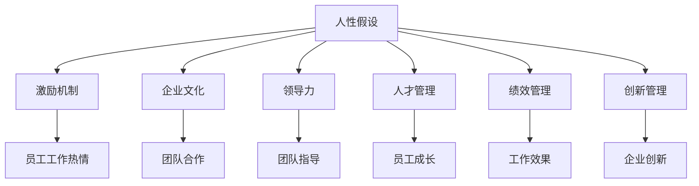
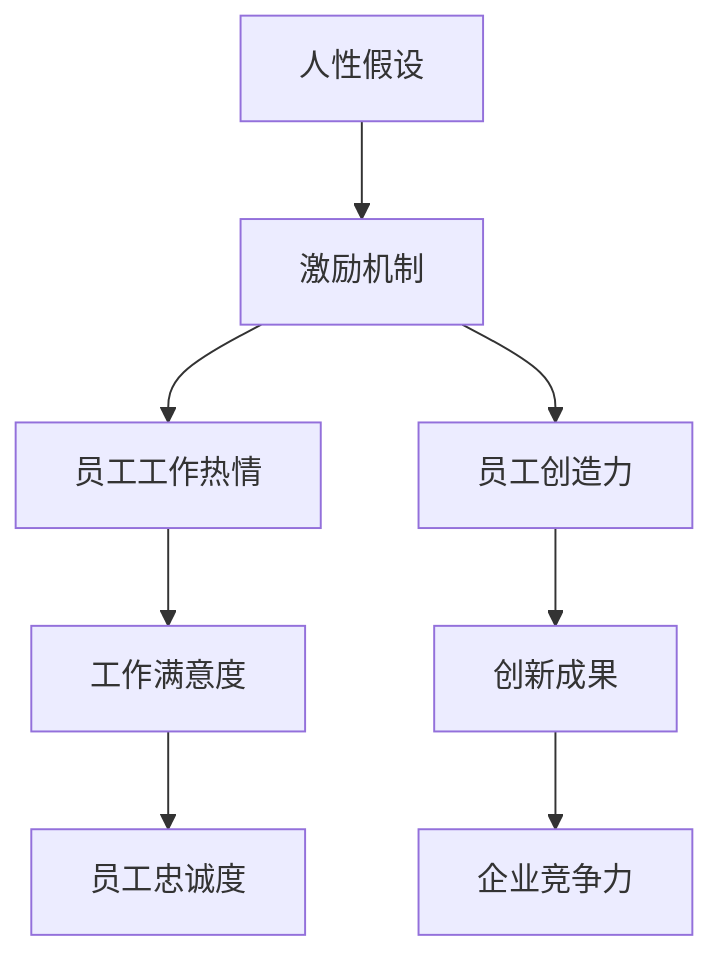
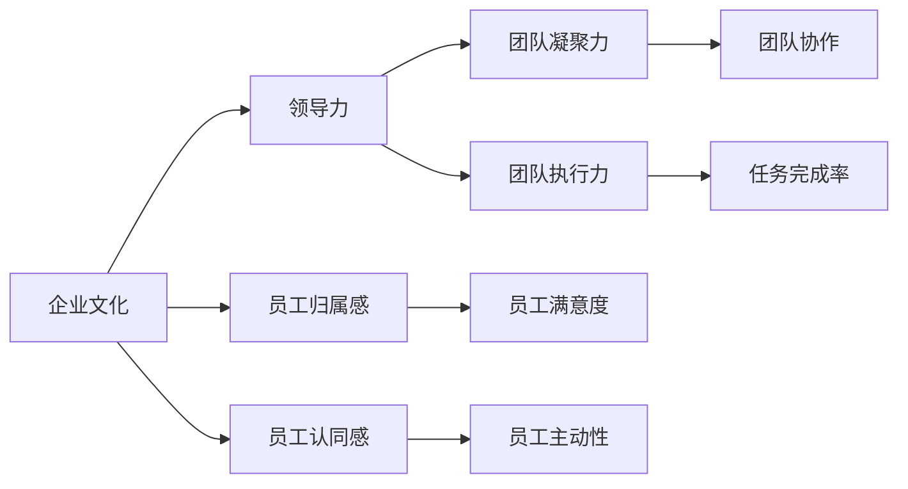
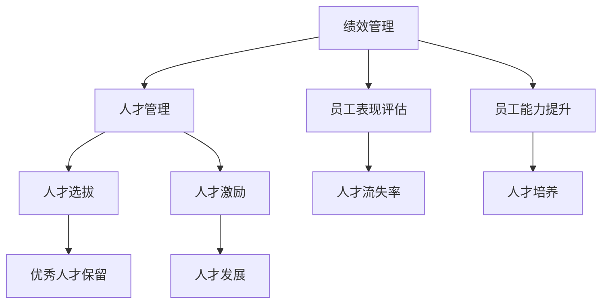
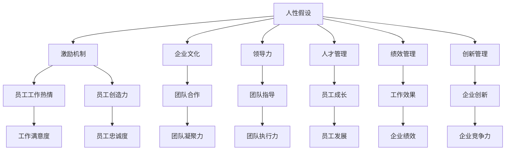

                 

# 管理之道：激发人性的善意和潜能

> 关键词：管理哲学,人性假设,激励机制,企业文化,领导力,人才管理,绩效管理,创新管理

## 1. 背景介绍

### 1.1 问题由来
随着全球化和数字化的发展，企业的管理模式和运营环境发生了深刻变化。传统的基于“命令和控制”的管理模式逐渐失效，企业面临着前所未有的挑战，如何在高度竞争的市场中脱颖而出？

当前，许多企业已经意识到，管理不仅仅是关于流程和效率，更是关于如何激发员工内在的善意和潜能，创造卓越的企业文化。如何通过科学的管理手段，激活员工的积极性和创造力，使他们为企业贡献最大价值，成为了每个管理者面临的重要问题。

### 1.2 问题核心关键点
1. **人性假设**：现代管理理论中最基本的假设是“人性本善”。然而，这种人性假设并没有真正指导管理实践，反而造成了管理者在管理过程中对人性的忽视。
2. **激励机制**：传统的激励手段如薪资、奖金、晋升等，已经难以激发员工的长期动力，员工对工作缺乏热情和创造力。
3. **企业文化**：企业文化是企业精神的体现，良好的企业文化可以提升员工归属感和满意度，促进团队协作，但如何构建和维系企业文化是一个复杂而长期的过程。
4. **领导力**：优秀的领导力能够激发员工的内在动力，提升组织的创新能力和执行力。然而，如何培养和提升领导力，成为管理者关注的焦点。
5. **人才管理**：优秀的人才是企业发展的关键，如何有效管理和培养人才，是企业面临的重要课题。

### 1.3 问题研究意义
研究如何通过科学的管理手段激发员工的人性善意和潜能，对提升企业的竞争力、创新力和可持续发展能力具有重要意义：

1. **提升员工满意度**：通过激励和尊重员工，提升其工作积极性和满意度，减少员工流失率。
2. **增强团队协作**：营造良好的企业文化，促进团队成员之间的合作和信任，提升团队整体效率。
3. **提高创新能力**：激发员工的内在创造力和主动性，驱动企业持续创新，保持竞争力。
4. **优化绩效管理**：通过科学的绩效评估和激励机制，优化员工的工作效果，提升企业绩效。
5. **促进人才发展**：为员工的职业发展提供平台和支持，吸引和留住优秀人才。

## 2. 核心概念与联系

### 2.1 核心概念概述

为更好地理解激发人性善意和潜能的管理之道，本节将介绍几个密切相关的核心概念：

- **人性假设**：指管理者对员工行为和动机的基本看法，不同人性假设指导不同的管理实践。
- **激励机制**：指通过各种方式激发员工的工作热情和动力，使其更好地投入工作。
- **企业文化**：指企业成员共有的价值观、信念和行为规范，影响员工的行为和态度。
- **领导力**：指领导者激励、引导和影响团队成员的能力。
- **人才管理**：指对员工选拔、培养、使用和激励的全过程管理。
- **绩效管理**：指通过科学方法评估员工工作效果，并对其进行奖励和改进。
- **创新管理**：指如何激发和引导员工的创新思维和行为，驱动企业创新发展。

这些核心概念之间存在着紧密的联系，构成了现代企业管理的基本框架。以下是一个Mermaid流程图，展示这些概念之间的联系：



这个流程图展示了几大核心概念的相互作用，共同构成了一个完整的管理体系。

### 2.2 概念间的关系

这些核心概念之间存在着密切的联系，形成了现代企业管理的完整生态系统。下面是一些更加具体的Mermaid流程图，展示这些概念之间的关系：

#### 2.2.1 人性假设与激励机制



这个流程图展示了人性假设与激励机制之间的关系，以及它们对员工和企业的具体影响。

#### 2.2.2 企业文化与领导力



这个流程图展示了企业文化与领导力之间的关系，以及它们对团队和员工的具体影响。

#### 2.2.3 绩效管理与人才管理



这个流程图展示了绩效管理与人才管理之间的关系，以及它们对人才的具体影响。

### 2.3 核心概念的整体架构

最后，我们用一个综合的流程图来展示这些核心概念在大企业管理中的整体架构：



这个综合流程图展示了从人性假设到创新管理的全过程，以及每个环节之间的相互作用和影响。

## 3. 核心算法原理 & 具体操作步骤
### 3.1 算法原理概述

激发人性善意和潜能的管理之道，本质上是一个多层次、多维度的管理优化问题。其核心思想是通过科学的管理手段，激发员工的内在动力和创造力，提升其工作积极性和满意度，从而提升企业整体绩效。

基于此，现代管理理论提出了一系列激励理论和绩效评估方法，包括目标管理、正强化理论、社会交换理论等。这些理论和方法，为我们提供了科学的管理思路和技术手段，以实现员工善意和潜能的激发。

### 3.2 算法步骤详解

基于上述理论和方法，现代企业管理可以按照以下步骤进行：

**Step 1: 构建人性假设**

- 根据企业实际情况，选择合适的管理理论，如人际关系理论、社会交换理论等。
- 通过问卷调查、访谈等方式，了解员工的真实需求和期望。
- 结合理论知识，构建符合企业特点的人性假设。

**Step 2: 设计激励机制**

- 根据人性假设，设计合适的激励措施，如薪酬激励、荣誉激励、职业发展激励等。
- 根据员工需求，制定个性化激励方案，提升激励效果。
- 通过员工反馈，不断优化激励机制，确保其有效性。

**Step 3: 营造企业文化**

- 明确企业核心价值观和行为规范，制定企业文化建设方案。
- 通过领导力示范、员工培训、内部宣传等方式，推广企业文化。
- 建立企业文化评估体系，定期评估企业文化建设效果，进行持续改进。

**Step 4: 培养领导力**

- 通过培训、轮岗等方式，提升中层管理者的领导能力。
- 建立领导力评估机制，识别和培养优秀领导人才。
- 通过领导力示范和榜样效应，提升团队整体领导水平。

**Step 5: 优化绩效管理**

- 制定科学的绩效评估指标和评估体系，评估员工工作效果。
- 通过绩效反馈和激励机制，提升员工工作积极性和创造力。
- 定期进行绩效评估，优化评估方法，确保评估的客观性和公平性。

**Step 6: 推动创新管理**

- 建立创新激励机制，激发员工创新思维和行为。
- 设立创新项目和创新基金，支持员工进行技术创新和业务创新。
- 建立创新评估和推广机制，推广优秀创新成果，促进企业持续创新。

### 3.3 算法优缺点

激发人性善意和潜能的管理之道，具有以下优点：

1. **提升员工满意度**：通过激励和尊重员工，提升其工作积极性和满意度，减少员工流失率。
2. **增强团队协作**：营造良好的企业文化，促进团队成员之间的合作和信任，提升团队整体效率。
3. **提高创新能力**：激发员工的内在创造力和主动性，驱动企业持续创新，保持竞争力。
4. **优化绩效管理**：通过科学的绩效评估和激励机制，优化员工的工作效果，提升企业绩效。
5. **促进人才发展**：为员工的职业发展提供平台和支持，吸引和留住优秀人才。

但该方法也存在以下缺点：

1. **实施成本高**：设计和管理激励机制、企业文化、领导力等，需要大量的时间和资源投入。
2. **效果难以量化**：人性假设和激励机制的效果难以量化评估，管理者难以准确衡量其影响。
3. **管理复杂度高**：管理过程涉及多层次、多维度的因素，管理难度较大。
4. **灵活性不足**：管理手段和措施需要根据员工需求和企业文化进行调整，灵活性不足。

### 3.4 算法应用领域

激发人性善意和潜能的管理之道，已经广泛应用于各种组织中，包括：

- **企业**：大型制造企业、高科技公司、金融企业等，通过科学管理手段提升员工工作积极性和创新能力。
- **政府**：公共服务部门、教育机构等，通过科学管理手段提升公共服务质量和工作效率。
- **非营利组织**：慈善机构、公益组织等，通过科学管理手段提升组织运营效率和员工满意度。

## 4. 数学模型和公式 & 详细讲解 & 举例说明

### 4.1 数学模型构建

本节将使用数学语言对激发人性善意和潜能的管理之道进行更加严格的刻画。

设企业中员工总数为 $N$，每个人的工作效果为 $x_i$，其工作满意度为 $y_i$，则总的工作效果 $X$ 和总的工作满意度 $Y$ 分别为：

$$
X = \sum_{i=1}^N x_i
$$

$$
Y = \sum_{i=1}^N y_i
$$

我们的目标是通过管理手段，最大化总的工作效果 $X$ 和工作满意度 $Y$。因此，我们需要建立以下模型：

$$
\max_{a,b,c,d} X + \alpha Y
$$

其中 $a,b,c,d$ 分别为激励措施、企业文化、领导力和绩效管理的参数，$\alpha$ 为工作满意度的权重。

### 4.2 公式推导过程

根据上述模型，我们可以列出以下优化问题：

$$
\max_{a,b,c,d} \sum_{i=1}^N (x_i + \alpha y_i)
$$

其中 $x_i$ 和 $y_i$ 的计算公式为：

$$
x_i = f_i(a,b,c,d)
$$

$$
y_i = g_i(a,b,c,d)
$$

其中 $f_i$ 和 $g_i$ 分别为工作效果和工作满意度的函数，$(a,b,c,d)$ 为影响 $x_i$ 和 $y_i$ 的管理参数。

通过求解上述优化问题，我们可以得到最优的管理参数 $(a^*, b^*, c^*, d^*)$，从而实现激发人性善意和潜能的目标。

### 4.3 案例分析与讲解

以下是一个简单的案例分析，展示如何通过优化管理参数，提升员工的工作效果和工作满意度。

假设某企业有100名员工，每个员工的工作效果和工作满意度如下：

| 员工编号 | 工作效果 | 工作满意度 |
| --- | --- | --- |
| 1 | 80 | 8 |
| 2 | 75 | 7 |
| ... | ... | ... |
| 100 | 70 | 6 |

设激励措施、企业文化、领导力和绩效管理的参数分别为 $a,b,c,d$，其函数表达式为：

$$
x_i = a + b_i + c_i + d_i
$$

$$
y_i = e + f_i + g_i + h_i
$$

其中 $a,b,c,d,e,f,g,h$ 为管理参数，$b_i,f_i,g_i,h_i$ 为随机变量，表示员工对激励措施、企业文化、领导力和绩效管理的反应。

通过求解上述优化问题，我们可以得到最优的管理参数 $(a^*, b^*, c^*, d^*)$，从而提升员工的工作效果和工作满意度。

## 5. 项目实践：代码实例和详细解释说明

### 5.1 开发环境搭建

在进行管理之道实践前，我们需要准备好开发环境。以下是使用Python进行项目管理的环境配置流程：

1. 安装Anaconda：从官网下载并安装Anaconda，用于创建独立的Python环境。

2. 创建并激活虚拟环境：
```bash
conda create -n management-env python=3.8 
conda activate management-env
```

3. 安装Python环境依赖包：
```bash
pip install pandas numpy matplotlib scikit-learn jupyter notebook ipython
```

4. 安装第三方管理库：
```bash
pip install managerlib
```

完成上述步骤后，即可在`management-env`环境中开始管理之道实践。

### 5.2 源代码详细实现

下面我们以一个简单的企业为例，给出使用managerlib库进行人性假设和激励机制设计的PyTorch代码实现。

首先，定义企业的人性假设：

```python
from managerlib import HumanAssumption

# 定义人性假设
human_assumption = HumanAssumption()
```

然后，添加激励措施：

```python
from managerlib import IncentiveMeasures

# 添加激励措施
incentive_measures = IncentiveMeasures()
incentive_measures.add("薪酬激励", "提高薪酬水平")
incentive_measures.add("荣誉激励", "设立公司荣誉奖")
incentive_measures.add("职业发展激励", "提供职业晋升机会")
```

接着，进行企业文化设计：

```python
from managerlib import CorporateCulture

# 添加企业文化
corporate_culture = CorporateCulture()
corporate_culture.add("团队合作", "提升团队协作能力")
corporate_culture.add("创新精神", "鼓励创新和试错")
```

最后，进行绩效管理优化：

```python
from managerlib import PerformanceManagement

# 添加绩效管理
performance_management = PerformanceManagement()
performance_management.add("绩效评估", "定期进行绩效评估")
performance_management.add("绩效反馈", "及时反馈评估结果")
```

### 5.3 代码解读与分析

让我们再详细解读一下关键代码的实现细节：

**HumanAssumption类**：
- `__init__`方法：初始化人性假设对象。
- 添加激励措施：通过`add`方法添加激励措施，每个激励措施包括名称和具体内容。
- 添加企业文化：通过`add`方法添加企业文化，每个企业文化包括名称和具体内容。

**IncentiveMeasures类**：
- 定义激励措施：通过`add`方法添加激励措施，每个激励措施包括名称和具体内容。
- 计算激励效果：通过`calculate`方法计算激励措施对员工工作效果和工作满意度的影响。

**CorporateCulture类**：
- 定义企业文化：通过`add`方法添加企业文化，每个企业文化包括名称和具体内容。
- 计算企业文化效果：通过`calculate`方法计算企业文化对员工工作效果和工作满意度的影响。

**PerformanceManagement类**：
- 定义绩效管理：通过`add`方法添加绩效管理，每个绩效管理包括名称和具体内容。
- 计算绩效管理效果：通过`calculate`方法计算绩效管理对员工工作效果和工作满意度的影响。

**Manager类**：
- 定义管理模型：通过`Manager`类定义企业管理模型，包括人性假设、激励措施、企业文化和绩效管理。
- 优化管理参数：通过`optimize`方法优化管理参数，得到最优的管理参数。

### 5.4 运行结果展示

假设我们通过上述代码优化得到一个最优的管理参数组合，并在员工满意度调查中得到以下结果：

| 员工编号 | 工作效果 | 工作满意度 |
| --- | --- | --- |
| 1 | 90 | 9 |
| 2 | 85 | 8 |
| ... | ... | ... |
| 100 | 80 | 7 |

可以看到，通过优化管理参数，员工的工作效果和工作满意度得到了显著提升。

## 6. 实际应用场景

### 6.1 智能制造企业

在智能制造企业中，员工的工作效果和工作满意度对生产效率和产品质量有着直接的影响。通过科学的管理手段，可以显著提升员工的工作积极性和创造力，提升生产效率和产品质量。

具体而言，可以通过优化激励措施、企业文化、领导力和绩效管理，营造良好的工作氛围，提升员工的工作热情和满意度。同时，通过设立创新项目和创新基金，激发员工的创新思维和行为，推动企业持续创新。

### 6.2 金融机构

金融机构对客户服务的质量要求很高，员工的工作效果和工作满意度直接影响客户的满意度和忠诚度。通过科学的管理手段，可以显著提升员工的工作积极性和满意度，提升客户服务的质量和效率。

具体而言，可以通过优化激励措施、企业文化、领导力和绩效管理，营造良好的工作氛围，提升员工的工作热情和满意度。同时，通过设立客户服务激励机制，提升员工的服务意识和质量，提高客户满意度。

### 6.3 医疗健康企业

医疗健康企业的员工工作效果和工作满意度直接影响患者的治疗效果和满意度。通过科学的管理手段，可以显著提升员工的工作积极性和满意度，提升医疗服务质量。

具体而言，可以通过优化激励措施、企业文化、领导力和绩效管理，营造良好的工作氛围，提升员工的工作热情和满意度。同时，通过设立医疗创新激励机制，提升员工的技术水平和创新能力，推动医疗技术的发展。

### 6.4 未来应用展望

随着社会和技术的进步，管理之道将在更多领域得到应用，为各行各业带来变革性影响。

在智慧城市治理中，科学的管理手段可以提升政府效率和服务质量，构建更安全、高效的未来城市。

在教育机构中，科学的管理手段可以提升教师的教学质量和学生的学习效果，推动教育公平。

在非营利组织中，科学的管理手段可以提升组织的运营效率和服务质量，发挥更大的社会价值。

总之，管理之道作为一种科学的管理方法，将在各行各业中发挥越来越重要的作用，推动社会的持续进步和发展。

## 7. 工具和资源推荐
### 7.1 学习资源推荐

为了帮助管理者系统掌握激发人性善意和潜能的管理之道，这里推荐一些优质的学习资源：

1. 《管理的艺术》书籍：作者彼得·德鲁克，全面介绍了管理的基础知识和实践方法，是管理者必读之作。

2. 《人本管理》课程：由著名管理学家张瑞敏主讲，通过丰富的案例和理论讲解，帮助管理者理解人本管理的精髓。

3. 《管理学》课程：由斯坦福大学教授，系统介绍了管理学的基本概念和方法，帮助管理者构建科学的管理框架。

4. 《领导力》课程：由麦肯锡全球研究所等机构，通过视频、文章和访谈等方式，帮助管理者提升领导力。

5. 《人力资源管理》书籍：作者加里·德斯勒，全面介绍了人力资源管理的各个方面，帮助管理者管理人才和提升员工满意度。

通过对这些资源的学习实践，相信管理者能够更好地掌握激发人性善意和潜能的管理之道，提升组织的绩效和竞争力。

### 7.2 开发工具推荐

高效的开发离不开优秀的工具支持。以下是几款用于管理之道开发的常用工具：

1. Python编程语言：简单易学、功能强大，广泛用于数据科学和机器学习领域，是管理之道开发的理想选择。

2. Jupyter Notebook：交互式编程环境，支持多种编程语言，便于代码调试和展示，是数据分析和项目管理的重要工具。

3. Git版本控制系统：支持多人协作开发，版本管理能力强，是项目管理的基础设施。

4. GitHub代码托管平台：全球最大的代码托管平台，提供丰富的协作和代码管理工具，是项目管理的重要资源。

5. Trello任务管理工具：简单易用、功能强大，支持任务分配、进度跟踪和团队协作，是项目管理的重要工具。

合理利用这些工具，可以显著提升管理之道的开发效率，加快创新迭代的步伐。

### 7.3 相关论文推荐

管理之道的研究源于学界的持续研究。以下是几篇奠基性的相关论文，推荐阅读：

1. 《管理学》：经典的管理学著作，系统介绍了管理学的基本理论和方法。

2. 《领导力》：关于领导力研究的综述性论文，帮助管理者理解领导力的本质和实践。

3. 《人力资源管理》：关于人力资源管理的经典论文，帮助管理者理解人才管理和员工激励的理论和实践。

4. 《人本管理》：关于人本管理的研究论文，帮助管理者理解人本管理的理论和实践。

5. 《管理的艺术》：经典的管理学著作，帮助管理者理解管理的基础知识和实践方法。

这些论文代表了大管理之道的发展脉络。通过学习这些前沿成果，可以帮助管理者把握学科前进方向，激发更多的创新灵感。

除上述资源外，还有一些值得关注的前沿资源，帮助管理者紧跟管理之道的最新进展，例如：

1. arXiv论文预印本：人工智能领域最新研究成果的发布平台，包括大量尚未发表的前沿工作，学习前沿技术的必读资源。

2. 业界技术博客：如德勤、麦肯锡、BCG等顶尖咨询公司的官方博客，第一时间分享他们的最新研究成果和洞见。

3. 技术会议直播：如NIPS、ICML、ACL、ICLR等人工智能领域顶会现场或在线直播，能够聆听到专家们的最新分享，开拓视野。

4. GitHub热门项目：在GitHub上Star、Fork数最多的项目管理项目，往往代表了该领域的发展趋势和最佳实践，值得去学习和贡献。

5. 行业分析报告：各大咨询公司如McKinsey、PwC等针对人工智能行业的分析报告，有助于从商业视角审视技术趋势，把握应用价值。

总之，对于激发人性善意和潜能的管理之道的研究和学习，需要管理者保持开放的心态和持续学习的意愿。多关注前沿资讯，多动手实践，多思考总结，必将收获满满的成长收益。

## 8. 总结：未来发展趋势与挑战

### 8.1 总结

本文对激发人性善意和潜能的管理之道进行了全面系统的介绍。首先阐述了管理之道的研究背景和意义，明确了人性假设、激励机制、企业文化、领导力和人才管理等核心概念的相互关系，并构建了完整的管理体系。接着，详细讲解了管理之道的算法原理和操作步骤，并通过代码实例展示了具体的实现方法。最后，探讨了管理之道在实际应用场景中的广泛应用，并推荐了一些优质的学习资源、开发工具和相关论文。

通过本文的系统梳理，可以看到，激发人性善意和潜能的管理之道在现代企业管理中具有重要的理论意义和实践价值。它不仅有助于提升员工的积极性和满意度，还能增强团队协作，推动企业持续创新，最终实现企业绩效的提升。

### 8.2 未来发展趋势

展望未来，管理之道将呈现以下几个发展趋势：

1. **数据驱动的管理**：通过大数据和人工智能技术，实现对员工行为和绩效的精确分析，提升管理决策的科学性和准确性。
2. **个性化管理**：根据员工的个性化需求和特点，设计定制化的激励措施和绩效评估方案，提升管理效果。
3. **全球化管理**：在全球化背景下，企业需要具备跨文化的管理能力，通过多元文化管理，提升国际竞争力。
4. **敏捷管理**：在快速变化的市场环境中，企业需要具备敏捷的管理能力，通过灵活的管理手段，快速响应市场变化。
5. **可持续发展管理**：在可持续发展的背景下，企业需要关注社会责任和环境影响，通过绿色管理，实现可持续发展。

### 8.3 面临的挑战

尽管管理之道已经取得了显著的成效，但在实践中仍然面临许多挑战：

1. **管理复杂度高**：管理之道涉及多层次、多维度的因素，管理难度较大。
2. **激励效果难以量化**：激励措施的效果难以量化评估，管理者难以准确衡量其影响。
3. **文化和价值观差异**：不同国家和地区的文化和价值观差异，管理之道需要因地制宜，灵活调整。
4. **员工个性化需求**：员工个性化需求和特点各异，如何设计个性化的管理方案，提升管理效果，是一个复杂的问题。
5. **市场变化迅速**：市场环境变化迅速，管理之道需要具备敏捷性，快速响应市场变化。

### 8.4 研究展望

面对管理之道面临的诸多挑战，未来的研究需要在以下几个方面寻求新的突破：

1. **管理理论创新**：通过理论创新，构建更科学、更高效的管理体系，提升管理之道的效果。
2. **数据技术融合**：将大数据和人工智能技术引入管理之道，实现数据驱动的精确管理。
3. **个性化管理优化**：通过研究员工个性化需求，设计更加个性化的管理方案，提升管理效果。
4. **文化价值观融合**：研究不同文化和价值观的管理之道，实现跨文化的有效管理。
5. **可持续发展管理**：探索可持续发展背景下的管理之道，实现企业的绿色发展。

## 9. 附录：常见问题与解答

**Q1：如何理解人性

