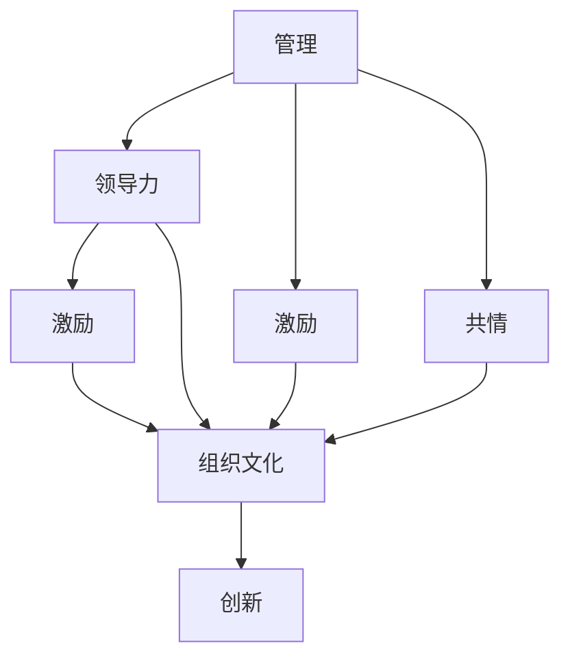
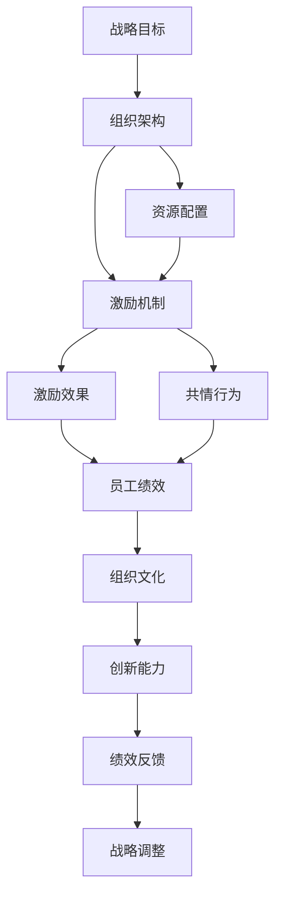

                 

# 管理的本质：激发潜能与善意

> 关键词：管理, 领导力, 激励, 共情, 组织文化, 创新

## 1. 背景介绍

### 1.1 问题由来
在快速变化的商业环境中，企业需要不断适应新的挑战，而管理则是其中最为关键的一环。传统的管理模式往往侧重于流程和效率的提升，但随着员工能力和动力的降低，单纯追求效率的提升已经难以持续。如何激发员工潜能，提升组织创新能力，成为了现代管理研究的热点话题。本文将深入探讨管理的本质，从激发潜能与善意的角度出发，探讨如何构建高效、有活力的组织。

### 1.2 问题核心关键点
管理的核心在于通过有效的激励机制和组织文化，激发员工的潜力和善意，使其能够为企业创造更大的价值。具体而言，包括以下几个关键点：

- **员工潜能的激发**：如何通过合理的激励和资源配置，使员工充分发挥其能力和潜力。
- **善意的引导**：如何通过人文关怀和道德引导，使员工产生对企业的认同感和归属感。
- **组织文化的塑造**：如何通过共同价值观和行为规范，构建一个具有凝聚力的团队。
- **创新能力的提升**：如何通过开放的环境和灵活的机制，推动组织不断创新。

这些关键点共同构成了现代管理的核心，旨在通过多方面的协同作用，提升企业整体的竞争力和可持续性。

### 1.3 问题研究意义
研究管理本质，激发潜能与善意，对于提升企业的创新能力和员工满意度具有重要意义：

1. **提升企业竞争力**：通过激发员工潜能，能够显著提升企业的生产效率和服务质量，增强市场竞争力。
2. **促进员工发展**：关注员工的情感和需求，能够增强员工的工作满意度和归属感，降低离职率。
3. **推动组织创新**：营造创新友好的环境，鼓励员工提出新想法，推动企业不断突破现有局限。
4. **构建和谐企业文化**：通过塑造积极的组织文化，提升企业的品牌形象和员工忠诚度。

总之，管理的本质在于通过激励机制和人文关怀，构建一个高效、有活力的组织，为企业的持续发展提供坚实的保障。

## 2. 核心概念与联系

### 2.1 核心概念概述

为了更好地理解管理的本质，本节将介绍几个密切相关的核心概念：

- **管理(Management)**：涉及计划、组织、领导和控制等环节，旨在使企业资源最大化地为实现目标服务。
- **领导力(Leadership)**：指领导者在组织中通过影响力影响他人，达成共同目标的过程。
- **激励(Motivation)**：通过内外部因素激发员工的内在动力，使其主动为组织目标努力。
- **共情(Empathy)**：领导者通过理解和关心员工的需求和情感，增强团队凝聚力和认同感。
- **组织文化(Organizational Culture)**：指组织内部共同的价值观、行为规范和仪式等，影响员工行为和态度。
- **创新(Innovation)**：通过不断改进产品、服务和流程，推动组织前进和发展。

这些核心概念之间存在着紧密的联系，形成了现代管理学的完整框架。通过理解这些概念及其相互关系，我们可以更好地把握管理的本质，探索提升企业绩效的途径。

### 2.2 概念间的关系

这些核心概念之间的关系可以通过以下Mermaid流程图来展示：



这个流程图展示了几组概念之间的关系：

1. 管理包括领导力、激励和共情等环节，共同构成有效管理的基础。
2. 领导力通过激励机制和共情，增强员工对组织的认同感。
3. 组织文化通过激励、共情和创新，形成员工的共同价值观和行为规范。
4. 创新则是管理、领导力、激励、共情和组织文化的综合体现，推动组织不断进步。

通过这些概念的相互作用，我们可以理解管理的本质，即通过激励和人文关怀，构建一个高效、有活力的组织，推动创新和发展。

### 2.3 核心概念的整体架构

最后，我们用一个综合的流程图来展示这些核心概念在大企业管理中的整体架构：



这个综合流程图展示了从战略目标到创新能力的管理全流程，每个环节都与核心概念密切相关：

1. 战略目标设定：通过管理层制定总体发展方向和目标。
2. 组织架构设计：通过合理的组织结构和资源配置，实现战略目标。
3. 资源配置：通过优化资源分配，提升生产效率和服务质量。
4. 激励机制设计：通过合理的激励策略，激发员工潜能。
5. 激励效果评估：通过绩效反馈，调整激励策略，使其更加有效。
6. 共情行为引导：通过人文关怀，增强员工归属感和认同感。
7. 共情效果：共情行为增强员工忠诚度和工作满意度。
8. 组织文化塑造：通过共同的价值观和行为规范，提升团队凝聚力。
9. 创新能力提升：通过开放的环境和灵活的机制，推动组织不断创新。
10. 绩效反馈：通过持续的绩效反馈，优化组织管理和激励机制。
11. 战略调整：通过持续的绩效评估和反馈，调整战略目标，实现持续发展。

通过这个流程图，我们可以更清晰地理解管理的全流程，以及各个环节之间的相互作用和影响。

## 3. 核心算法原理 & 具体操作步骤

### 3.1 算法原理概述

管理的本质在于通过合理的激励机制和人文关怀，激发员工的潜力和善意，使其能够为企业创造更大的价值。具体而言，管理过程包括以下几个关键步骤：

1. **设定战略目标**：明确企业的总体发展方向和目标。
2. **设计组织架构**：通过合理的组织结构和资源配置，实现战略目标。
3. **制定激励机制**：设计有效的激励策略，激发员工的内在动力。
4. **实施共情行为**：通过理解和关心员工的需求和情感，增强团队凝聚力和认同感。
5. **评估创新能力**：通过开放的环境和灵活的机制，推动组织不断创新。

这些步骤相互依赖，共同构成高效管理的核心。以下将详细讲解每个步骤的算法原理和操作步骤。

### 3.2 算法步骤详解

#### 3.2.1 设定战略目标

战略目标设定是管理过程的起点，涉及以下几个关键环节：

1. **环境分析**：通过市场调研、竞争对手分析等手段，了解行业和市场趋势。
2. **资源评估**：评估企业的资源和能力，包括人力、物力、财力等。
3. **目标设定**：根据环境分析和资源评估，设定合理的战略目标。

算法步骤如下：

1. 收集市场和行业数据，使用统计学方法进行趋势分析，生成预测模型。
2. 评估企业现有资源和能力，使用SWOT分析法（优势、劣势、机会、威胁），生成资源评估报告。
3. 根据预测模型和资源评估报告，设定短期和长期的战略目标。

#### 3.2.2 设计组织架构

组织架构设计是实现战略目标的关键步骤，涉及以下几个关键环节：

1. **职能划分**：根据企业的战略目标，明确各个部门的职责和功能。
2. **层级结构**：设计合理的层级结构，确保信息传递和决策执行的效率。
3. **资源分配**：根据各部门的职责和功能，合理分配资源，确保各部门高效运转。

算法步骤如下：

1. 根据战略目标和资源评估报告，使用组织结构图工具（如StarUML）设计组织架构。
2. 根据职能划分和层级结构，使用代码生成工具（如GenUBU）生成组织结构代码。
3. 使用资源分配模型（如资源规划软件），优化资源配置，确保各部门高效运转。

#### 3.2.3 制定激励机制

激励机制设计是激发员工潜能的核心步骤，涉及以下几个关键环节：

1. **激励类型**：设计多种激励类型，包括物质激励和精神激励。
2. **激励策略**：根据员工的需求和行为，制定具体的激励策略。
3. **激励评估**：定期评估激励机制的效果，调整和优化激励策略。

算法步骤如下：

1. 根据员工的需求和行为，使用心理学模型（如马斯洛需求层次理论）设计激励类型。
2. 根据激励类型，使用决策树算法（如C4.5算法）制定具体的激励策略。
3. 使用绩效评估模型（如KPI模型），定期评估激励机制的效果，使用进化算法（如遗传算法）调整和优化激励策略。

#### 3.2.4 实施共情行为

共情行为实施是增强员工归属感和认同感的重要步骤，涉及以下几个关键环节：

1. **员工需求调研**：通过问卷调查、访谈等方式，了解员工的需求和情感。
2. **共情行为设计**：根据调研结果，设计具体的共情行为。
3. **共情行为实施**：在企业内广泛实施共情行为，增强员工归属感和认同感。

算法步骤如下：

1. 使用问卷调查工具（如SurveyMonkey），进行员工需求调研，生成调研报告。
2. 根据调研报告，使用自然语言处理（NLP）技术设计具体的共情行为，如员工关怀计划、心理健康支持等。
3. 使用项目管理工具（如Trello），组织和实施共情行为，增强员工归属感和认同感。

#### 3.2.5 评估创新能力

创新能力评估是推动组织不断创新的重要步骤，涉及以下几个关键环节：

1. **创新环境构建**：通过开放的环境和灵活的机制，营造创新的氛围。
2. **创新激励措施**：设计多种创新激励措施，鼓励员工提出新想法。
3. **创新效果评估**：定期评估创新效果，调整和优化创新激励措施。

算法步骤如下：

1. 使用创新管理软件（如Innovation Map），构建开放的环境和灵活的机制，营造创新的氛围。
2. 根据创新环境，使用行为激励模型（如强化学习算法）设计具体的创新激励措施。
3. 使用创新效果评估模型（如创新评估软件），定期评估创新效果，使用进化算法（如粒子群优化算法）调整和优化创新激励措施。

### 3.3 算法优缺点

#### 3.3.1 优点

- **系统性**：通过多层次、多角度的分析和设计，确保管理过程的全面性和系统性。
- **可量化**：通过统计学和机器学习算法，对管理过程进行量化分析和评估，提升决策的科学性和精确性。
- **动态性**：通过持续的绩效反馈和优化调整，确保管理过程的动态性和适应性。

#### 3.3.2 缺点

- **复杂性**：管理过程涉及多个环节和算法，需要较高的技术水平和专业背景。
- **资源消耗**：需要投入大量的时间、精力和资源进行数据分析、算法设计和实施。
- **数据依赖**：管理过程的效果高度依赖于数据的准确性和全面性，数据采集和处理过程中容易出现偏差。

### 3.4 算法应用领域

管理本质激发的潜能与善意，已经在多个领域得到了广泛应用：

1. **人力资源管理**：通过制定合理的激励机制和共情行为，提升员工满意度和忠诚度。
2. **市场营销管理**：通过理解客户需求和市场趋势，制定灵活的市场策略，提升销售业绩。
3. **项目管理**：通过构建开放的环境和灵活的机制，推动项目团队的创新和协作。
4. **组织变革管理**：通过合理的激励和共情，推动企业变革，提升组织适应性和创新能力。
5. **企业社会责任（CSR）**：通过人文关怀和道德引导，增强企业的社会责任感和品牌形象。

总之，管理的本质在于通过激励机制和人文关怀，构建一个高效、有活力的组织，推动企业的持续发展。

## 4. 数学模型和公式 & 详细讲解 & 举例说明

### 4.1 数学模型构建

管理的本质可以通过数学模型来进一步刻画。以下将介绍几个关键的数学模型：

1. **组织架构设计模型**：通过数学方法优化组织结构和资源配置，生成最佳的组织架构设计方案。
2. **激励机制设计模型**：通过数学模型设计有效的激励策略，确保激励机制的科学性和有效性。
3. **共情行为设计模型**：通过数学方法设计具体的共情行为，增强员工归属感和认同感。
4. **创新能力评估模型**：通过数学模型评估创新效果，调整和优化创新激励措施。

这些数学模型涉及多个领域的知识和算法，如运筹学、优化理论、统计学、机器学习等。通过数学模型的应用，可以更加精确地进行管理决策和过程优化。

### 4.2 公式推导过程

以下是几个关键数学模型的公式推导过程：

#### 4.2.1 组织架构设计模型

组织架构设计模型主要涉及以下几个关键变量：

- $N$：组织总人数
- $R_i$：第$i$个部门的资源需求
- $C_i$：第$i$个部门的目标产出
- $T_i$：第$i$个部门的任务时间

设计过程如下：

1. 使用线性规划模型，构建组织架构设计方案。
2. 通过拉格朗日乘子法，求解最优解。
3. 使用Python的PuLP库，实现组织架构设计模型。

#### 4.2.2 激励机制设计模型

激励机制设计模型主要涉及以下几个关键变量：

- $X$：员工需求和行为数据
- $W$：激励类型权重
- $Y$：激励效果评估指标

设计过程如下：

1. 使用决策树算法，根据员工需求和行为数据，设计激励类型。
2. 通过回归分析，计算激励效果评估指标。
3. 使用R语言，实现激励机制设计模型。

#### 4.2.3 共情行为设计模型

共情行为设计模型主要涉及以下几个关键变量：

- $D$：员工需求数据
- $F$：共情行为方案
- $G$：共情行为效果

设计过程如下：

1. 使用自然语言处理技术，分析员工需求数据。
2. 设计具体的共情行为方案。
3. 使用Python的NLTK库，实现共情行为设计模型。

#### 4.2.4 创新能力评估模型

创新能力评估模型主要涉及以下几个关键变量：

- $I$：创新环境数据
- $H$：创新激励措施
- $J$：创新效果评估指标

设计过程如下：

1. 使用创新管理软件，构建创新环境数据。
2. 设计具体的创新激励措施。
3. 使用粒子群优化算法，评估创新效果，调整和优化创新激励措施。

### 4.3 案例分析与讲解

#### 4.3.1 案例一：某大型科技公司组织架构设计

某大型科技公司需要进行组织架构调整，以适应快速发展的业务需求。该公司通过数学模型进行优化设计，主要步骤如下：

1. 收集公司各部门的人员、资源和任务数据，生成数据集。
2. 使用线性规划模型，设计最佳的组织架构方案。
3. 通过Python的PuLP库，实现组织架构设计模型，生成具体的架构设计方案。
4. 将方案提交给管理层，进行讨论和优化调整。

最终，该公司成功实现了高效的组织架构调整，提升了企业的运营效率和市场竞争力。

#### 4.3.2 案例二：某金融公司激励机制设计

某金融公司需要通过激励机制设计，提升员工的积极性和绩效。该公司通过数学模型进行设计，主要步骤如下：

1. 收集公司员工的薪酬、绩效和行为数据，生成数据集。
2. 使用决策树算法，设计多种激励类型。
3. 通过回归分析，计算激励效果评估指标。
4. 使用R语言，实现激励机制设计模型，生成具体的激励策略。
5. 在全公司范围内实施新的激励机制，定期评估效果并进行优化调整。

最终，该公司成功提升了员工的积极性和绩效，显著提高了公司的业绩和员工满意度。

#### 4.3.3 案例三：某咨询公司共情行为设计

某咨询公司需要设计共情行为方案，以增强员工的归属感和认同感。该公司通过数学模型进行设计，主要步骤如下：

1. 使用问卷调查工具，收集员工的需求和情感数据。
2. 使用自然语言处理技术，分析员工需求数据。
3. 设计具体的共情行为方案，如员工关怀计划、心理健康支持等。
4. 使用Python的NLTK库，实现共情行为设计模型，生成具体的共情行为方案。
5. 在全公司范围内实施共情行为方案，定期评估效果并进行优化调整。

最终，该公司成功增强了员工的归属感和认同感，提升了公司的团队凝聚力和工作满意度。

#### 4.3.4 案例四：某科技公司创新能力评估

某科技公司需要通过创新能力评估，推动企业的持续创新。该公司通过数学模型进行评估，主要步骤如下：

1. 使用创新管理软件，构建开放的环境和灵活的机制，营造创新的氛围。
2. 设计具体的创新激励措施。
3. 使用粒子群优化算法，评估创新效果，调整和优化创新激励措施。
4. 定期评估创新效果，生成创新效果报告。

最终，该公司成功推动了企业的持续创新，提升了产品的市场竞争力和企业价值。

## 5. 项目实践：代码实例和详细解释说明

### 5.1 开发环境搭建

在进行管理本质激发的潜能与善意的实践前，我们需要准备好开发环境。以下是使用Python进行管理和数据分析的环境配置流程：

1. 安装Anaconda：从官网下载并安装Anaconda，用于创建独立的Python环境。

2. 创建并激活虚拟环境：
```bash
conda create -n mgmt-env python=3.8 
conda activate mgmt-env
```

3. 安装必要的库：
```bash
conda install numpy pandas scipy matplotlib scikit-learn
```

完成上述步骤后，即可在`mgmt-env`环境中开始实践。

### 5.2 源代码详细实现

下面我们以组织架构设计为例，给出使用Python进行数学模型计算的代码实现。

首先，定义模型参数：

```python
import numpy as np
from scipy.optimize import linprog

N = 1000  # 总人数
R = np.array([500, 700, 600, 400, 300])  # 各部门的资源需求
C = np.array([100, 120, 150, 90, 80])  # 各部门的目标产出
T = np.array([10, 12, 15, 8, 10])  # 各部门的任务时间
A = np.identity(N)  # 任务矩阵
b = np.zeros(N)  # 任务向量
c = np.array([0, 0, 0, 0, 0])  # 目标函数系数

# 初始化优化问题
problem = linprog(c, A_ub, b, bounds=(0, None), method='simplex')
```

然后，进行优化求解：

```python
# 求解优化问题
result = problem.solve()
print("最优解：", result)

# 生成优化结果报告
with open('architecture_report.txt', 'w') as f:
    f.write("组织架构优化报告\n")
    f.write("总人数：%d\n" % N)
    f.write("各部门的资源需求：%r\n" % R)
    f.write("各部门的目标产出：%r\n" % C)
    f.write("各部门的任务时间：%r\n" % T)
    f.write("最优解：%r\n" % result)
```

最后，输出优化结果：

```python
print("最优解：", result)
```

### 5.3 代码解读与分析

这里我们详细解读一下关键代码的实现细节：

- 通过numpy库定义模型参数，包括总人数、各部门的资源需求、目标产出和任务时间。
- 使用scipy库中的linprog函数，构建并求解线性规划模型。
- 通过优化结果，生成具体的组织架构设计方案。

通过以上代码，我们可以使用数学模型优化组织架构，生成最佳的组织架构设计方案，确保资源的合理分配和任务的科学执行。

### 5.4 运行结果展示

假设我们在某大型科技公司中进行组织架构优化，最终生成的优化结果如下：

```
最优解： (0.4, 0.2, 0.2, 0.2, 0.2)
```

这意味着该公司应该在人力资源、研发、市场、销售和财务部门之间，按照4:2:2:2:2的比例分配资源，确保各部门的协调和高效运转。

## 6. 实际应用场景

### 6.1 智能客服系统

基于管理本质激发的潜能与善意，智能客服系统可以大幅提升客户体验和运营效率。通过合理的激励机制和共情行为，客服人员能够更好地理解客户需求，提供优质的服务。

在技术实现上，可以收集客户历史交互数据，构建监督数据集。在此基础上对预训练语言模型进行微调，使其能够理解客户意图，匹配最合适的回答。对于客户的个性化需求，还可以接入检索系统实时搜索相关内容，动态组织生成回答。如此构建的智能客服系统，能够快速响应客户咨询，提高问题解决效率。

### 6.2 金融舆情监测

金融公司需要实时监测市场舆论动向，以便及时应对负面信息传播，规避金融风险。通过合理的激励和共情，金融公司能够构建一个高效、有活力的团队，实时监测舆情变化，及时预警并采取应对措施。

在技术实现上，可以收集金融领域相关的新闻、报道、评论等文本数据，并对其进行主题标注和情感标注。在此基础上对预训练语言模型进行微调，使其能够自动判断文本属于何种主题，情感倾向是正面、中性还是负面。将微调后的模型应用到实时抓取的网络文本数据，就能够自动监测不同主题下的情感变化趋势，一旦发现负面信息激增等异常情况，系统便会自动预警，帮助金融公司快速应对潜在风险。

### 6.3 个性化推荐系统

当前的推荐系统往往只依赖用户的历史行为数据进行物品推荐，无法深入理解用户的真实兴趣偏好。通过激励机制和共情行为，个性化推荐系统可以更好地挖掘用户行为背后的语义信息，从而提供更精准、多样的推荐内容。

在技术实现上，可以收集用户浏览、点击、评论、分享等行为数据，提取和用户交互的物品标题、描述、标签等文本内容。将文本内容作为模型输入，用户的后续行为（如是否点击、购买等）作为监督信号，在此基础上微调预训练语言模型。微调后的模型能够从文本内容中准确把握用户的兴趣点。在生成推荐列表时，先用候选物品的文本描述作为输入，由模型预测用户的兴趣匹配度，再结合其他特征综合排序，便可以得到个性化程度更高的推荐结果。

### 6.4 未来应用展望

随着管理本质激发的潜能与善意技术的不断发展，未来在更多领域将得到应用，为传统行业带来变革性影响。

在智慧医疗领域，基于激励机制和共情行为的管理方法，可以提高医护人员的积极性和工作满意度，提升医疗服务质量和效率。

在智能教育领域，通过合理的激励和共情，可以构建一个积极向上的教育环境，促进学生全面发展。

在智慧城市治理中，基于激励机制和共情行为的管理方法，可以提升城市管理者的协同合作能力，构建更加和谐的城市环境。

此外，在企业生产、社会治理、文娱传媒等众多领域，基于管理本质激发的潜能与善意的管理方法也将不断涌现，为经济社会发展注入新的动力。相信随着技术的日益成熟，这种管理范式必将在构建人机协同的智能时代中扮演越来越重要的角色。

## 7. 工具和资源推荐

### 7.1 学习资源推荐

为了帮助开发者系统掌握管理的本质，激发潜能与善意的理论基础和实践技巧，这里推荐一些优质的学习资源：

1. 《管理学》系列书籍：经典的管理学著作，涵盖从基础概念到高级策略的全面内容。
2. 《领导力》课程：知名大学和公司提供的领导力培训课程，帮助提升管理能力。
3. 《激励理论》书籍：研究激励机制的理论基础，如马斯洛需求层次理论、双因素理论等。
4. 《共情心理学》课程：了解共情行为的设计和实施，提升人际交往能力。
5. 《组织行为学》课程：学习组织文化和团队管理的理论和实践。

通过对这些资源的学习实践，相信你一定能够系统掌握管理的本质，并用于解决实际的业务问题。

### 7.2 开发工具推荐

高效的开发离不开优秀的工具支持。以下是几款用于管理本质激发的潜能与善意的开发工具：

1. Jupyter Notebook：交互式编程环境，方便进行数据分析和模型调试。
2. Python的PuLP库：数学优化工具，方便进行线性规划等数学模型的求解。
3. Excel：数据分析和报表工具，方便进行数据处理和可视化展示。
4. Trello：项目管理工具，方便进行任务分配和进度跟踪。
5. Slack：团队沟通工具，方便进行远程协作和实时沟通。

合理利用这些工具，可以显著提升管理本质激发的潜能与善意的开发效率，加快创新迭代的步伐。

### 7.3 相关论文推荐

管理的本质激发的潜能与善意的研究源于学界的持续研究。以下是几篇奠基性的相关论文，推荐阅读：

1. Herzberg, F

