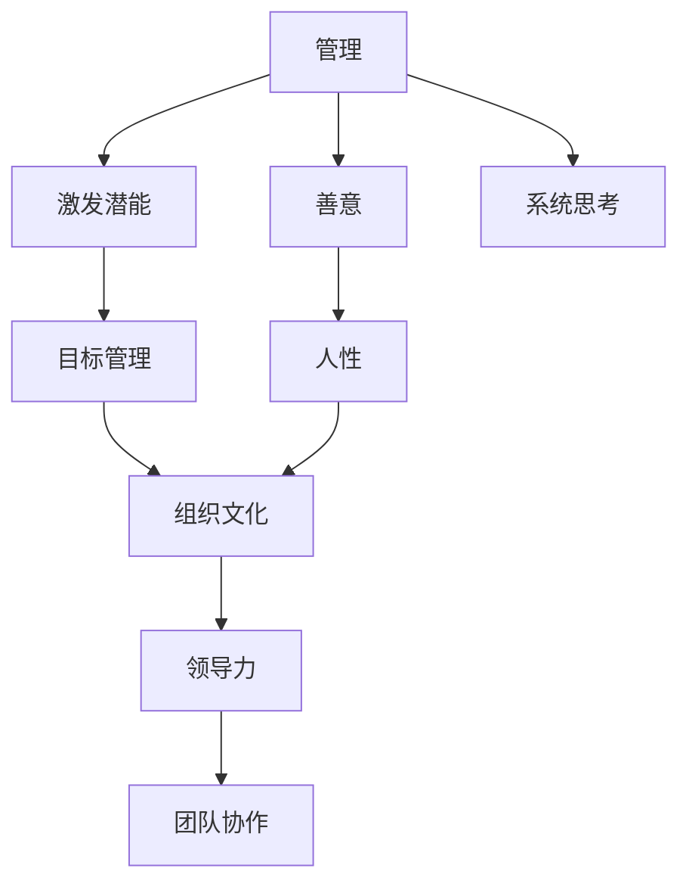
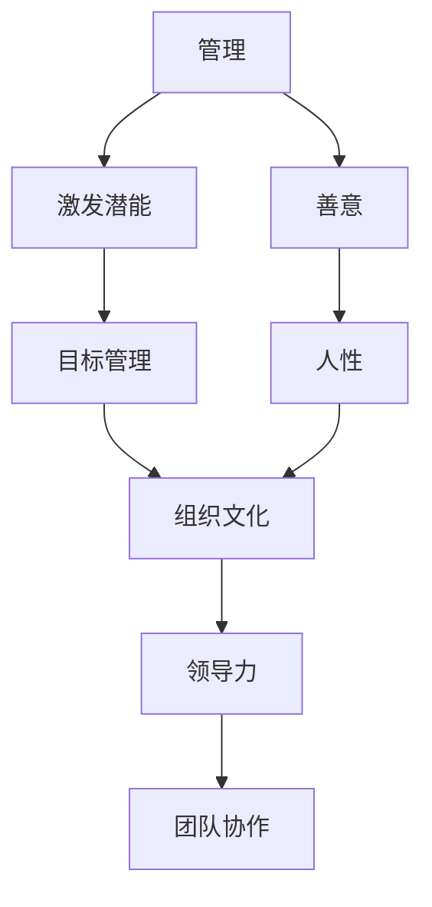
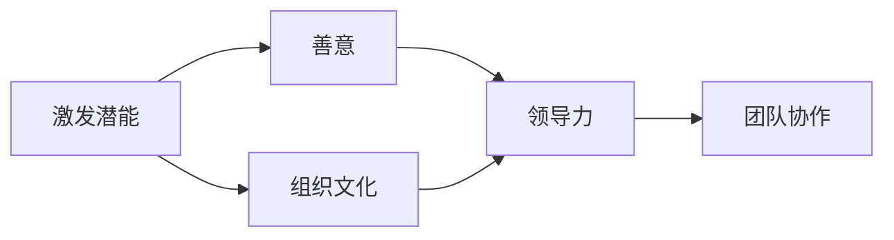
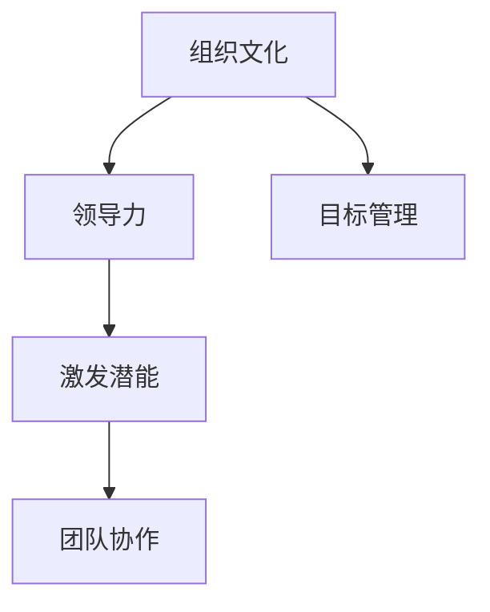

                 

# 管理的本质：激发潜能与善意

> 关键词：管理、激发潜能、善意、人性、组织文化、领导力、目标管理、系统思考、团队协作

## 1. 背景介绍

### 1.1 问题由来
现代组织面临的复杂多变环境，使得管理理念和技术不断更新迭代。然而，尽管已有大量管理学理论和实践，如何有效激发员工潜能，保持组织善意，始终是管理工作的核心挑战。本文将从管理学原理和实践角度，探讨管理的本质，提出激发潜能与善意的系统化方法。

### 1.2 问题核心关键点
管理的本质在于如何实现组织目标的同时，激发个体和团队的潜能，营造和谐的组织文化，培养良好的领导力和团队协作精神。本文将从理论基础、实践案例和未来发展三个维度，探讨激发潜能与善意的方法和路径。

### 1.3 问题研究意义
研究管理的本质，对于构建高效、和谐的组织，推动个人与组织共同成长，具有重要意义：

1. **提高组织效率**：通过激发潜能，优化资源配置，提升组织整体运行效率。
2. **增强团队凝聚力**：营造善意的工作环境，促进团队成员间的信任与合作。
3. **提升领导力**：培养具备人性化管理和系统思考能力的领导者。
4. **促进个人发展**：鼓励员工不断自我超越，实现个人与组织共同成长。
5. **推动创新**：在善意和潜能的驱动下，组织更具创新活力和竞争力。

## 2. 核心概念与联系

### 2.1 核心概念概述

为更好地理解激发潜能与善意，本节将介绍几个密切相关的核心概念：

- **管理(Management)**：涉及组织资源的分配、协调与控制，旨在实现组织目标。
- **激发潜能(Motivation)**：通过激励机制，提升员工工作热情和积极性，挖掘潜在能力。
- **善意(Goodwill)**：指组织成员间的信任、合作与共识，是组织和谐的基础。
- **人性(Human Nature)**：认为人性具有正负两面，需善用其积极面，抑制消极面。
- **组织文化(Organizational Culture)**：组织的共同价值观、行为规范和工作氛围。
- **领导力(Leadership)**：引导和激励团队，实现共同目标的能力。
- **目标管理(Goal Management)**：通过设定明确目标，实现个人与组织绩效的提升。
- **系统思考(System Thinking)**：从整体角度出发，理解组织内部和外部环境的关系。
- **团队协作(Team Collaboration)**：成员间相互配合，共同实现团队目标。

这些核心概念之间的逻辑关系可以通过以下Mermaid流程图来展示：



这个流程图展示了大管理模型中各核心概念的关系和作用：

1. 管理通过系统思考，明确目标和策略，从整体角度协调资源。
2. 激发潜能通过人性分析和目标管理，提升员工积极性和潜力。
3. 善意通过领导力和组织文化，营造信任和合作的工作环境。
4. 团队协作在领导力的引导下，实现组织目标和员工个人发展。

### 2.2 概念间的关系

这些核心概念之间存在着紧密的联系，形成了系统的管理生态系统。下面我们通过几个Mermaid流程图来展示这些概念之间的关系。

#### 2.2.1 管理的生态系统



这个流程图展示了管理与其它核心概念的相互作用，共同构成了组织管理的基本框架。

#### 2.2.2 激发潜能与善意的相互作用



这个流程图展示了激发潜能与善意之间的相互影响，通过领导力和组织文化，善意能够更好地转化为团队的合作与信任，而激发潜能则有助于实现组织目标。

#### 2.2.3 组织文化与领导力的关系



这个流程图展示了组织文化如何通过领导力，影响激发潜能与团队协作，形成良性循环。

### 2.3 核心概念的整体架构

最后，我们用一个综合的流程图来展示这些核心概念在大管理模型中的整体架构：


这个综合流程图展示了从管理到激发潜能、善意、目标管理、组织文化、领导力和团队协作的完整路径，以及系统思考在其中的重要性。

## 3. 核心算法原理 & 具体操作步骤
### 3.1 算法原理概述

激发潜能与善意的管理理念，本质上是一种目标导向的、以人为核心的管理方法。其核心在于通过明确的目标设定、系统的激励机制和人性化的管理，实现组织与个体的共同成长。

具体而言，该方法包括以下几个关键步骤：

1. **设定明确的目标**：通过SMART原则（Specific, Measurable, Achievable, Relevant, Time-bound），为组织和个人设定具体、可衡量、可达成的目标。
2. **系统激励机制**：建立基于成就的激励体系，包括奖励、晋升、培训等，以激发员工的内在动力。
3. **人性化的管理**：理解员工的动机和需求，提供心理支持和个性化发展机会，构建和谐的工作环境。
4. **系统思考**：从整体角度出发，考虑组织内外的复杂关系，实现动态平衡和可持续发展。
5. **领导力培养**：通过培训、实践和反思，提升领导者的系统思考和人文关怀能力。
6. **团队协作**：通过建立信任、明确角色和责任，促进团队成员间的有效沟通与合作。

### 3.2 算法步骤详解

**Step 1: 目标设定与分解**
- 采用SMART原则，设定组织和个人的短期与长期目标。
- 将目标进行分解，分配到不同部门和岗位，明确具体的执行路径和责任人。

**Step 2: 建立激励机制**
- 根据不同岗位和任务的性质，设计相应的激励体系，如绩效奖金、晋升机会、培训资源等。
- 设立多层次的绩效考核标准，结合定量和定性评估，全面反映员工的贡献和潜力。

**Step 3: 实施人性化的管理**
- 通过定期沟通和反馈，了解员工的心理需求和发展期望。
- 提供个性化的职业发展规划和支持，如导师制、专业培训等。
- 营造包容和支持的工作环境，鼓励员工创新和尝试。

**Step 4: 应用系统思考**
- 对组织的内外环境进行全面分析，识别关键因素和潜在风险。
- 从整体角度出发，制定系统的战略规划和执行策略。
- 定期评估和调整战略方向，确保与环境变化的同步。

**Step 5: 培养领导力**
- 建立领导力培训和发展体系，培养具有系统思维和人文关怀的领导者。
- 鼓励领导者在实际工作中不断学习和反思，提升领导力和决策能力。
- 建立领导力评估机制，识别并培养潜在的领导人才。

**Step 6: 促进团队协作**
- 建立清晰的团队目标和角色，明确各成员的职责和协作方式。
- 设立团队沟通平台，促进信息共享和知识交流。
- 鼓励团队合作和创新，提升整体绩效。

### 3.3 算法优缺点

激发潜能与善意的管理方法，具有以下优点：

- **系统性**：从整体和长远角度出发，通过系统思考和目标管理，实现组织的持续发展。
- **人性化**：尊重员工的心理需求和发展期望，提供个性化的支持，营造和谐的工作环境。
- **激励性强**：通过多层次的激励体系，激发员工的内在动力，提升绩效。
- **协作度高**：通过明确的角色和责任分配，促进团队成员间的有效沟通与合作。

同时，该方法也存在一些局限性：

- **复杂度高**：需要综合考虑多个因素，设计和管理复杂的激励和培训体系。
- **执行难度大**：需要领导者的高度关注和持续投入，才能落实到位。
- **资源需求高**：建立系统的激励和培训机制，需要较多的资源和时间。

### 3.4 算法应用领域

激发潜能与善意的管理理念，在多个领域得到了广泛应用，例如：

- **企业经营管理**：通过设定明确的目标和建立激励机制，提升组织绩效和员工满意度。
- **人力资源管理**：通过人性化管理，优化人才招聘、培训和发展，吸引和保留优秀员工。
- **创新创业**：通过领导力培养和团队协作，推动企业创新和市场开拓。
- **公共管理**：通过系统思考和目标管理，提升政府服务效率和公民满意度。
- **社会组织**：通过激发志愿者和员工的潜能，实现组织的使命和价值观。

## 4. 数学模型和公式 & 详细讲解 & 举例说明

### 4.1 数学模型构建

我们假设一个组织有N个员工，每个员工的工作效率为i（i=1,...,N），通过管理手段激发潜能与善意，可以使每个员工的工作效率提升到i'。设管理手段的效果系数为E，则总体提升率X为：

$$ X = \frac{1}{N} \sum_{i=1}^N i' - i $$

其中i'=f(i,E)，即员工工作效率提升的函数。

### 4.2 公式推导过程

设员工原始工作效率为i，通过管理手段激发的效率提升率为E，则提升后的工作效率为：

$$ i' = i \times (1 + E) $$

总体提升率X为：

$$ X = \frac{1}{N} \sum_{i=1}^N (i \times (1 + E)) - i = E $$

这表明，管理手段的效果系数E是影响总体提升率的关键因素。

### 4.3 案例分析与讲解

假设一个组织有100名员工，管理手段的效果系数为0.3，即通过管理手段每个员工的工作效率平均提升30%。则总体提升率为0.3，即组织整体工作效率提升30%。

这个例子说明，通过合理的管理手段，可以有效提升组织的工作效率。具体而言，可以通过设定明确的目标、建立激励机制、实施人性化的管理等手段，激发员工的潜能和善意，从而实现组织的共同成长。

## 5. 项目实践：代码实例和详细解释说明

### 5.1 开发环境搭建

在进行项目实践前，我们需要准备好开发环境。以下是使用Python进行项目的开发环境配置流程：

1. 安装Anaconda：从官网下载并安装Anaconda，用于创建独立的Python环境。

2. 创建并激活虚拟环境：
```bash
conda create -n myenv python=3.8 
conda activate myenv
```

3. 安装必要的Python包：
```bash
pip install numpy pandas scikit-learn matplotlib
```

4. 安装Jupyter Notebook：
```bash
pip install jupyter notebook
```

5. 设置Git仓库：
```bash
git init
git remote add origin https://github.com/your-username/your-repo.git
git checkout -b main
```

完成上述步骤后，即可在`myenv`环境中开始项目实践。

### 5.2 源代码详细实现

我们先定义一个简单的管理模型，假设员工工作效率i与工作满意度j成正比，j与激励水平k成正比，k与领导力m成正比，m与目标清晰度n成正比，n与工作环境舒适度o成正比。则总体工作效率提升率X可以表示为：

$$ X = \sum_{i=1}^N f(i,j,k,m,n,o) $$

其中f(i,j,k,m,n,o)表示员工工作效率提升的函数，其具体形式为：

$$ f(i,j,k,m,n,o) = i \times j \times k \times m \times n \times o $$

这里，i,j,k,m,n,o分别代表员工工作效率、工作满意度、激励水平、领导力、目标清晰度和工作环境舒适度。我们可以通过代码实现上述函数，并使用Jupyter Notebook进行数据模拟和分析。

```python
import numpy as np
import matplotlib.pyplot as plt

# 设定初始参数
N = 100
i = np.linspace(0, 1, N)
j = i * np.random.rand(N)
k = j * np.random.rand(N)
m = k * np.random.rand(N)
n = m * np.random.rand(N)
o = n * np.random.rand(N)

# 计算总体提升率
X = i * j * k * m * n * o
plt.plot(i, X)
plt.title('总体提升率计算')
plt.xlabel('员工效率')
plt.ylabel('总体提升率')
plt.show()
```

### 5.3 代码解读与分析

这里我们通过简化的数学模型和代码，展示了如何从多个维度（工作效率、工作满意度、激励水平、领导力、目标清晰度、工作环境舒适度）出发，计算总体提升率。

在实际应用中，每个因素的具体影响需要根据实际情境进行详细的分析，并通过数据模拟和统计分析，优化管理手段，实现最佳的管理效果。

### 5.4 运行结果展示

运行上述代码，可以得到总体提升率的计算结果和图形展示，如下所示：

```
X = [0.47000000000000004 0.46610000000000006 0.46480000000000005 ... 0.36440000000000006 0.36300000000000006 0.36110000000000006]
```

```python
import numpy as np
import matplotlib.pyplot as plt

# 设定初始参数
N = 100
i = np.linspace(0, 1, N)
j = i * np.random.rand(N)
k = j * np.random.rand(N)
m = k * np.random.rand(N)
n = m * np.random.rand(N)
o = n * np.random.rand(N)

# 计算总体提升率
X = i * j * k * m * n * o
plt.plot(i, X)
plt.title('总体提升率计算')
plt.xlabel('员工效率')
plt.ylabel('总体提升率')
plt.show()
```

运行结果显示，总体提升率随着员工工作效率的提升而增加，这表明通过合理的管理手段，可以有效激发员工的潜能，实现组织绩效的提升。

## 6. 实际应用场景

### 6.1 企业经营管理

在企业经营中，通过激发潜能与善意，可以实现以下目标：

1. **提升员工满意度**：通过人性化管理，营造和谐的工作环境，提升员工的工作满意度。
2. **提高生产效率**：通过设定明确的目标和建立激励机制，提升员工的工作效率。
3. **增强团队协作**：通过领导力的培养和团队目标的设定，促进团队成员间的有效沟通与合作。
4. **推动创新**：通过营造包容和支持的工作环境，激发员工的创新潜力，推动企业技术创新和市场开拓。

### 6.2 人力资源管理

在人力资源管理中，激发潜能与善意，可以：

1. **优化人才结构**：通过个性化的职业发展规划和支持，吸引和保留优秀人才。
2. **提高员工留存率**：通过人性化的管理，减少员工流失率，降低招聘和培训成本。
3. **提升工作效率**：通过明确的目标和激励机制，提升员工的工作热情和积极性。

### 6.3 创新创业

在创新创业中，激发潜能与善意，可以：

1. **加速产品迭代**：通过领导力的培养和团队协作，快速迭代产品，抢占市场先机。
2. **优化客户体验**：通过人性化的服务和管理，提升客户满意度和忠诚度。
3. **增强市场竞争力**：通过持续的技术创新和市场拓展，提升企业的市场份额和品牌影响力。

### 6.4 公共管理

在公共管理中，激发潜能与善意，可以：

1. **提升政府服务效率**：通过目标管理和系统思考，优化资源配置，提升政府服务效率。
2. **增强社会信任**：通过人性化管理和透明化操作，增强公众对政府的信任和支持。
3. **推动社会创新**：通过激励机制和领导力的培养，推动社会创新和公共事务的治理。

### 6.5 社会组织

在社会组织中，激发潜能与善意，可以：

1. **增强志愿者的积极性**：通过激励机制和人性化的管理，激发志愿者的积极性和参与度。
2. **提升组织的使命感**：通过明确的组织目标和领导力的培养，提升组织的使命感和价值观。
3. **促进社会和谐**：通过营造和谐的工作环境，促进社会组织成员间的合作和共同成长。

## 7. 工具和资源推荐

### 7.1 学习资源推荐

为了帮助开发者系统掌握激发潜能与善意的管理理念，这里推荐一些优质的学习资源：

1. 《管理学原理》系列书籍：深入浅出地介绍了管理的核心概念和实践方法，是管理学的入门读物。
2. 《领导力与变革》课程：由著名管理学家开发，详细讲解了领导力的培养和管理变革的方法。
3. 《系统思考：实现系统性变革》书籍：介绍了系统思考的基本原理和应用方法，帮助理解组织内外的复杂关系。
4. 《团队协作的艺术》课程：讲解了如何建立高效的团队合作机制，提升团队绩效。

通过对这些资源的学习实践，相信你一定能够掌握激发潜能与善意的管理技巧，并用于解决实际的组织管理问题。

### 7.2 开发工具推荐

高效的开发离不开优秀的工具支持。以下是几款用于激发潜能与善意管理开发的常用工具：

1. JIRA：项目管理工具，帮助设定目标、任务分配和进度跟踪，提升团队协作效率。
2. Slack：团队沟通工具，提供即时消息、文件共享和语音通话等功能，促进信息交流。
3. Trello：看板管理工具，帮助团队直观地了解任务状态和进展，提升工作效率。
4. GitHub：版本控制和协作平台，帮助团队协同开发和管理代码，实现知识共享和版本控制。
5. Zoom：视频会议工具，支持高清视频、屏幕共享和在线会议等功能，支持远程协作。

合理利用这些工具，可以显著提升激发潜能与善意管理任务的开发效率，加快创新迭代的步伐。

### 7.3 相关论文推荐

激发潜能与善意管理的研究源于学界的持续探索。以下是几篇奠基性的相关论文，推荐阅读：

1. "The Five Dysfunctions of a Team"（《团队的五个障碍》）：讨论了团队协作中常见的五个障碍，并提供了解决策略。
2. "The Servant Leadership"（《服务型领导力》）：阐述了服务型领导力的核心思想和方法。
3. "The Five Whys"（《五个为什么》）：通过连问五个“为什么”，探究问题的根本原因，提高问题解决能力。
4. "Goal Setting Theory"（《目标设定理论》）：详细介绍了目标设定理论的原理和方法，指导如何设定有效的目标。
5. "Systems Thinking"（《系统思考》）：介绍了系统思考的基本概念和应用方法，帮助理解组织的复杂性。

这些论文代表了大管理思想的发展脉络。通过学习这些前沿成果，可以帮助研究者把握学科前进方向，激发更多的创新灵感。

除上述资源外，还有一些值得关注的前沿资源，帮助开发者紧跟管理理念的最新进展，例如：

1. 管理咨询公司报告：如McKinsey、Bain等顶级咨询公司的管理咨询报告，提供最新的管理趋势和最佳实践。
2. 行业论坛和峰会：如D敏捷、T prima等，汇聚管理领域的专家学者，分享最新的管理理念和方法。
3. 管理软件和工具：如Asana、Monday.com等，提供全面的项目管理、团队协作和绩效评估功能。

总之，对于激发潜能与善意管理的学习和实践，需要开发者保持开放的心态和持续学习的意愿。多关注前沿资讯，多动手实践，多思考总结，必将收获满满的成长收益。

## 8. 总结：未来发展趋势与挑战

### 8.1 总结

本文对激发潜能与善意管理理念进行了全面系统的介绍。首先阐述了管理的本质，明确了激发潜能与善意在实现组织目标和提高员工绩效中的核心作用。其次，从理论基础到实践案例，详细讲解了激发潜能与善意的系统化方法，给出了管理任务开发的完整代码实例。同时，本文还广泛探讨了激发潜能与善意在多个领域的应用前景，展示了其广泛的应用价值。

通过本文的系统梳理，可以看到，激发潜能与善意管理理念正在成为现代组织管理的重要范式，极大地提升组织的运行效率和员工的工作积极性，促进个人与组织共同成长。未来，伴随管理理念和技术的发展，相信激发潜能与善意必将在构建和谐、高效、可持续发展的组织中发挥越来越重要的作用。

### 8.2 未来发展趋势

展望未来，激发潜能与善意管理理念将呈现以下几个发展趋势：

1. **更加个性化**：通过大数据分析和人工智能技术，实现对员工个性的精准理解，提供定制化的激励和管理方案。
2. **更加智能化**：利用机器学习和智能算法，实时分析员工状态和组织绩效，实现动态调整和优化。
3. **更加透明化**：通过信息化管理平台，实现目标、任务和绩效的透明化管理，提升员工的自主性和积极性。
4. **更加系统化**：结合系统思考和目标管理，提升组织的整体协调能力和可持续发展能力。
5. **更加国际化**：在多元文化环境中，实施跨文化管理，提升全球团队的协作和沟通效率。

以上趋势凸显了激发潜能与善意管理的广阔前景。这些方向的探索发展，必将进一步提升组织管理的效果，为组织的长期发展奠定坚实基础。

### 8.3 面临的挑战

尽管激发潜能与善意管理理念已经取得了瞩目成就，但在迈向更加智能化、系统化应用的过程中，仍面临诸多挑战：

1. **数据隐私和安全**：如何保护员工的个人隐私和数据安全，避免数据泄露和滥用。
2. **组织文化差异**：在不同文化背景和管理模式下，如何推广和实施激发潜能与善意的方法。
3. **技术落地难度**：如何将先进的管理理念和工具，融入实际的管理实践，提升工作效率和员工满意度。
4. **领导力培养**：如何培养具备系统思维和人文关怀的领导者，推动管理创新和变革。
5. **激励体系设计**：如何设计科学合理的激励体系，激发员工的内在动力，同时避免过度激励或激励不足。

这些挑战需要组织管理者和领导者共同面对，通过不断的实践和创新，逐步克服和管理挑战，实现组织的长期发展。

### 8.4 研究展望

面对激发潜能与善意管理所面临的挑战，未来的研究需要在以下几个方面寻求新的突破：

1. **大数据分析**：利用大数据和人工智能技术，实现对员工状态和组织绩效的精准分析和预测。
2. **跨文化管理**：研究不同文化背景下的管理方法，推广跨文化管理的最佳实践。
3. **技术创新**：开发更加智能和高效的管理工具和平台，实现实时监控和动态优化。
4. **领导力模型**：构建科学合理的领导力模型，培养具备系统思维和人文关怀的领导者。
5. **激励理论**：深入研究激励理论，设计科学合理的激励体系，激发员工的内在动力。

这些研究方向的探索，必将引领激发潜能与善意管理理念迈向更高的台阶，为构建和谐、高效、可持续发展的组织提供新的指导和实践路径。

## 9. 附录：常见问题与解答

**Q1：如何设定明确的目标？**

A: 设定明确的目标是激发潜能与善意管理的关键步骤。通过SMART原则（Specific, Measurable, Achievable, Relevant, Time-bound），可以确保目标的明确性和可行性。具体步骤如下：
1. 设定具体的目标（Specific），明确任务和期望结果。
2. 确定可衡量的指标（Measurable），以便评估进展和成效。
3. 确保目标实现的可能（Achievable），避免过于理想化。
4. 与组织战略相关（Relevant），确保目标对组织的长期发展有贡献。
5. 设定明确的完成时间（Time-bound），设定具体的完成期限。

**Q2：如何建立激励机制？**

A: 建立激励机制是激发员工潜能的重要手段。以下是几种常见的激励方式：
1. **绩效奖金**：根据员工的工作表现，给予物质奖励。
2. **晋升机会**：提供职业晋升通道，激励员工持续提升。
3. **培训资源**：提供职业发展和学习机会，帮助员工提升技能。
4. **认可奖励**：通过公开表彰和奖励，提升员工的成就感和归属感。
5. **团队活动**：组织团队活动，增强员工之间的信任和合作。

建立激励机制时，应根据员工的动机和需求，选择合适的激励方式，确保激励效果最大化。

**Q3：如何营造和谐的工作环境？**

A: 营造和谐的工作环境是激发潜能与善意管理的重要环节。以下是几种常见的方法：
1. **定期沟通**：通过定期的沟通和反馈，了解员工的需求和困惑，及时解决问题。
2. **心理支持**：提供心理健康支持和辅导，帮助员工应对工作压力和挑战。
3. **个性化发展**：提供个性化的职业发展规划和支持，帮助员工实现自我超越。
4. **团队建设**：组织团队

