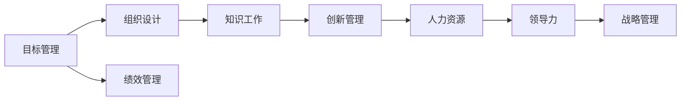

                 

# 管理的艺术：德鲁克的洞见

## 1. 背景介绍

### 1.1 问题由来
彼得·德鲁克（Peter Drucker）被誉为现代管理学之父，其著作《管理的艺术》（The Practice of Management）影响了无数管理者和学者。在数字化、全球化、智能化的今天，德鲁克的管理洞见依然具有深远的指导意义。本文将通过分析德鲁克的核心思想，探讨其在现代管理中的实践应用，帮助管理者洞察管理艺术的精髓。

### 1.2 问题核心关键点
德鲁克的管理思想体系庞大，涵盖战略、组织、激励、绩效、创新等多个方面。本文重点讨论以下核心概念：
1. **目标管理**：通过设定明确的组织目标，激发员工潜力，提升组织绩效。
2. **组织设计**：基于组织使命和目标，设计合理的组织架构，确保资源有效配置。
3. **知识工作**：在知识经济时代，如何管理和激励知识工作者。
4. **创新管理**：如何通过创新驱动组织持续发展。
5. **人力资源**：现代组织中人力资源的重要性及管理策略。

### 1.3 问题研究意义
德鲁克的管理思想不仅适用于工业时代的组织，更是数字化时代企业管理的指南。通过深入理解德鲁克的洞见，管理者可以构建更加灵活、高效、创新导向的组织结构，提升团队协作和绩效，从而在竞争激烈的市场中占据优势。

## 2. 核心概念与联系

### 2.1 核心概念概述

德鲁克的管理思想体系庞大，涵盖多个核心概念，包括目标管理、组织设计、知识工作、创新管理、人力资源等。本文将重点介绍这些核心概念，并通过合法的流程节点展示它们之间的联系。



### 2.2 概念间的关系

通过以上流程节点，我们可以清晰地理解德鲁克核心思想间的联系：

1. **目标管理**：德鲁克强调目标管理的重要性，认为目标不仅是组织的方向，也是绩效的起点。
2. **组织设计**：合理的组织设计是实现目标管理的关键，应基于组织使命和目标设计合理的架构。
3. **知识工作**：在知识经济时代，知识工作者成为组织的重要资源，需通过适当的管理和激励机制提升其贡献。
4. **创新管理**：创新是组织持续发展的动力，应建立创新驱动的机制和环境。
5. **人力资源**：人力资源是组织的重要资产，应通过科学的管理策略提升其效能和潜力。
6. **绩效管理**：绩效管理是目标管理的重要组成部分，确保目标的实现和组织的优化。
7. **领导力**：领导力贯穿于组织管理的各个方面，是目标实现的保障。
8. **战略管理**：战略管理是组织的顶层设计，指导目标管理、组织设计等各环节。

这些概念共同构成了德鲁克的管理思想体系，为现代企业的管理提供了全面的指导。

## 3. 核心算法原理 & 具体操作步骤
### 3.1 算法原理概述

德鲁克的管理思想强调系统的管理理念，核心在于目标管理和绩效驱动。具体而言，目标管理通过设定明确的目标和绩效指标，激发员工潜力，提升组织效率。算法原理包括：

1. **SMART原则**：目标应具有具体（Specific）、可测量（Measurable）、可达成（Achievable）、相关（Relevant）和时限（Time-bound）。
2. **目标分解**：将总体目标分解为具体的任务和子目标，确保每个层级都能明确责任和贡献。
3. **绩效评估**：定期评估目标的完成情况，提供反馈和激励，确保目标的实现。

### 3.2 算法步骤详解

目标管理的具体步骤包括：

1. **设定目标**：通过与员工和团队的讨论，设定具有挑战性和可达性的目标。
2. **目标分解**：将总体目标分解为具体的任务和子目标，明确每个层级和个体的责任。
3. **资源分配**：根据目标的重要性和紧急性，合理分配资源和时间。
4. **绩效评估**：定期评估目标的完成情况，提供反馈和激励，确保目标的实现。
5. **持续改进**：通过绩效评估和反馈，不断优化目标设定和管理流程。

### 3.3 算法优缺点

德鲁克的目标管理方法具有以下优点：

1. **明确性**：通过设定明确的目标，引导组织成员集中精力，提升工作效率。
2. **导向性**：目标管理强调绩效驱动，能够激发员工潜力，提升组织整体绩效。
3. **系统性**：目标管理是一个系统过程，涉及目标设定、分解、评估和改进，确保管理的连续性和有效性。

同时，目标管理也存在以下缺点：

1. **复杂性**：目标管理涉及多个层级的目标设定和资源分配，管理复杂度较高。
2. **灵活性不足**：一旦目标设定，改变和调整较为困难，可能需要较长周期。
3. **主观性**：目标设定和绩效评估可能受到主观因素的影响，难以全面衡量。

### 3.4 算法应用领域

目标管理在多个领域得到广泛应用，包括企业、非营利组织、政府机构等。具体应用场景包括：

1. **企业战略**：通过目标管理设定企业长期战略目标，确保战略的有效执行。
2. **项目管理**：项目团队通过目标管理确保项目按时、按质、按预算完成。
3. **人力资源管理**：通过设定明确的绩效指标，提升员工绩效和职业发展。
4. **运营管理**：通过目标管理优化资源配置，提高运营效率和成本控制。

## 4. 数学模型和公式 & 详细讲解

### 4.1 数学模型构建

目标管理的数学模型基于系统优化理论，通过设定目标函数和约束条件，最大化组织绩效。具体数学模型如下：

$$
\text{目标函数} = \sum_{i=1}^n x_i \cdot w_i
$$

其中 $x_i$ 为目标 $i$ 的完成度，$w_i$ 为目标 $i$ 的权重，$n$ 为目标总数。

### 4.2 公式推导过程

推导过程如下：

1. **目标设定**：将组织目标分解为具体任务，设定每个任务的完成度和权重。
2. **资源分配**：根据目标的重要性，分配资源和时间，确保关键目标得到优先支持。
3. **绩效评估**：通过评估任务完成情况，提供反馈和激励，确保目标实现。
4. **持续改进**：通过绩效评估和反馈，优化目标设定和管理流程，提升组织效率。

### 4.3 案例分析与讲解

假设一家制造企业设定了年度销售目标，通过目标管理方法实现如下：

1. **目标设定**：设定总销售额为1000万美元，分解为季度目标，每季度250万美元。
2. **资源分配**：根据市场预测和生产能力，分配营销和生产资源，确保季度目标达成。
3. **绩效评估**：每月评估销售完成情况，提供反馈和激励，确保季度目标实现。
4. **持续改进**：根据每月评估结果，优化销售策略和资源配置，提升整体绩效。

通过以上案例，可以看到目标管理在企业中的应用，通过设定明确的目标和绩效评估，确保企业运营的效率和效果。

## 5. 项目实践：代码实例和详细解释说明
### 5.1 开发环境搭建

目标管理系统的开发环境搭建包括：

1. 安装Python：从官网下载并安装Python，安装版本为3.7以上。
2. 安装Flask：通过pip安装Flask框架，用于构建Web应用。
3. 安装SQLite：安装SQLite数据库，用于存储目标和管理数据。

### 5.2 源代码详细实现

目标管理系统的代码实现如下：

```python
from flask import Flask, request, jsonify
import sqlite3

app = Flask(__name__)

@app.route('/set-target', methods=['POST'])
def set_target():
    conn = sqlite3.connect('target.db')
    cursor = conn.cursor()
    target = request.json['target']
    weight = request.json['weight']
    cursor.execute("INSERT INTO targets (target, weight) VALUES (?, ?)", (target, weight))
    conn.commit()
    conn.close()
    return jsonify({'message': '目标设定成功'})

@app.route('/get-targets', methods=['GET'])
def get_targets():
    conn = sqlite3.connect('target.db')
    cursor = conn.cursor()
    cursor.execute("SELECT * FROM targets")
    targets = cursor.fetchall()
    conn.close()
    return jsonify(targets)

@app.route('/update-target', methods=['PUT'])
def update_target():
    conn = sqlite3.connect('target.db')
    cursor = conn.cursor()
    target_id = request.json['target_id']
    new_target = request.json['new_target']
    new_weight = request.json['new_weight']
    cursor.execute("UPDATE targets SET target=?, weight=? WHERE id=?", (new_target, new_weight, target_id))
    conn.commit()
    conn.close()
    return jsonify({'message': '目标更新成功'})

if __name__ == '__main__':
    app.run(debug=True)
```

### 5.3 代码解读与分析

代码实现包括：

1. 使用Flask框架构建Web应用。
2. 使用SQLite数据库存储目标数据。
3. 通过POST请求设定目标和权重，通过GET请求获取所有目标，通过PUT请求更新目标和权重。

### 5.4 运行结果展示

运行结果如下：

- 设定目标：
```
POST /set-target
Content-Type: application/json

{
    "target": "1000万美元",
    "weight": 1
}
```

```
GET /get-targets
Content-Type: application/json

[
    (1000万美元, 1)
]
```

- 更新目标：
```
PUT /update-target
Content-Type: application/json

{
    "target_id": 1,
    "new_target": "1100万美元",
    "new_weight": 1.2
}
```

```
GET /get-targets
Content-Type: application/json

[
    (1100万美元, 1.2)
]
```

## 6. 实际应用场景
### 6.1 智能客服系统

智能客服系统通过目标管理提升客服效率和客户满意度。设定明确的客户服务目标，如响应时间、问题解决率等，通过实时监控和绩效评估，确保目标实现。

### 6.2 金融舆情监测

金融舆情监测系统通过目标管理实时监控舆情变化，设定明确的监控目标和预警阈值，通过持续评估和反馈，确保舆情风险的及时应对。

### 6.3 个性化推荐系统

个性化推荐系统通过目标管理设定用户推荐目标，如推荐精准度、用户满意度等，通过实时监控和绩效评估，优化推荐算法和资源配置。

### 6.4 未来应用展望

随着目标管理在各领域的广泛应用，未来将在以下方面取得更多突破：

1. **智能化**：通过智能算法和数据分析，优化目标设定和资源分配，提升管理效率。
2. **协同化**：在跨部门、跨组织间建立协同目标管理机制，实现更大范围的协同优化。
3. **动态化**：通过实时监控和反馈，动态调整目标和资源，确保目标适应环境变化。
4. **可视化**：通过数据可视化技术，直观展示目标管理和绩效评估结果，提升管理决策的科学性。

## 7. 工具和资源推荐
### 7.1 学习资源推荐

1. 《管理的实践》（The Practice of Management）：德鲁克的经典著作，深入讲解目标管理和组织设计等核心思想。
2. Coursera德鲁克课程：Coursera平台提供的德鲁克课程，涵盖多个管理主题，通过视频和作业提升学习效果。
3. HBR德鲁克系列文章：哈佛商业评论（Harvard Business Review）上德鲁克的系列文章，涵盖多个管理主题，提供实际案例和实践建议。

### 7.2 开发工具推荐

1. Python：Python是目标管理开发的主流语言，简洁易用，生态丰富。
2. Flask：轻量级的Web框架，易于开发和管理。
3. SQLite：轻量级的关系型数据库，适合存储和管理目标数据。
4. Jupyter Notebook：Python开发常用的交互式开发环境，支持代码执行和数据可视化。

### 7.3 相关论文推荐

1. "The Effective Executive"：德鲁克的另一部经典著作，重点讲解管理者和领导力的培养。
2. "The Age of Discontinuity"：德鲁克对企业变革的深入思考，探讨未来企业的适应策略。
3. "The Knowledge-Worker Society"：德鲁克关于知识工作者管理的深入研究，提供科学的管理策略。

## 8. 总结：未来发展趋势与挑战
### 8.1 研究成果总结

德鲁克的管理思想在现代企业管理中仍然具有重要价值。目标管理、组织设计、知识工作、创新管理、人力资源等核心概念，为现代企业管理提供了全面的指导。

### 8.2 未来发展趋势

未来德鲁克管理思想的发展趋势包括：

1. **智能化**：通过智能算法和大数据分析，优化目标管理和绩效评估，提升管理效率。
2. **协同化**：在跨部门、跨组织间建立协同目标管理机制，实现更大范围的协同优化。
3. **动态化**：通过实时监控和反馈，动态调整目标和资源，确保目标适应环境变化。
4. **可视化**：通过数据可视化技术，直观展示目标管理和绩效评估结果，提升管理决策的科学性。

### 8.3 面临的挑战

德鲁克管理思想在应用过程中仍面临以下挑战：

1. **复杂性**：目标管理涉及多个层级的目标设定和资源分配，管理复杂度较高。
2. **主观性**：目标设定和绩效评估可能受到主观因素的影响，难以全面衡量。
3. **灵活性不足**：一旦目标设定，改变和调整较为困难，可能需要较长周期。

### 8.4 研究展望

未来德鲁克管理思想的研究方向包括：

1. **智能化算法**：通过机器学习和人工智能技术，优化目标管理和绩效评估。
2. **协同管理机制**：探索跨部门、跨组织的协同目标管理策略，提升整体绩效。
3. **动态优化模型**：构建动态目标管理模型，适应环境变化和市场变化。
4. **数据可视化技术**：结合数据可视化技术，提升管理决策的科学性和可视化效果。

总之，德鲁克的管理思想在现代企业管理中仍然具有重要的指导意义，通过不断优化和创新，德鲁克的管理思想将进一步推动企业管理的发展。

## 9. 附录：常见问题与解答

**Q1：目标管理是否适用于所有类型的组织？**

A: 目标管理适用于大多数类型的组织，包括企业、非营利组织、政府机构等。但需要注意的是，目标管理的实施需要结合组织的具体情况，如组织文化和组织结构等。

**Q2：如何设定合理的目标权重？**

A: 目标权重的设定应综合考虑目标的重要性和紧急性。一般而言，重要且紧急的目标应赋予较高的权重，而次要目标则权重较低。

**Q3：如何确保目标管理的持续改进？**

A: 目标管理的持续改进应通过定期绩效评估和反馈来实现。评估结果应与目标设定进行对比，找出偏差原因，及时调整目标和资源配置。

**Q4：目标管理是否适合快速变化的市场环境？**

A: 目标管理在快速变化的市场环境中同样适用。但需要灵活调整目标设定和资源分配策略，以应对市场变化和环境不确定性。

**Q5：如何平衡短期目标和长期目标？**

A: 平衡短期目标和长期目标的关键在于制定合理的绩效评估指标和资源分配策略。短期目标应与长期目标相结合，确保组织的长期发展。

通过以上问答，可以看到德鲁克管理思想在实际应用中的广泛适用性和灵活性，通过不断优化和创新，德鲁克的管理思想将在未来管理实践中发挥更大的作用。

---

作者：禅与计算机程序设计艺术 / Zen and the Art of Computer Programming

