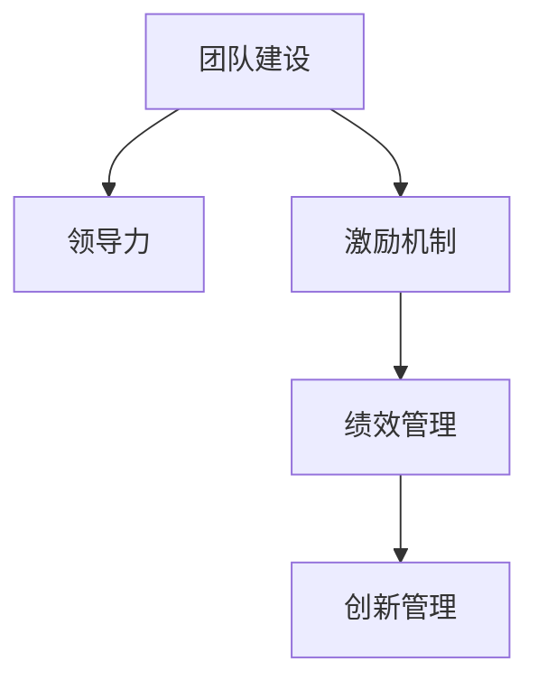

                 

# 管理艺术：激发团队潜力

> 关键词：管理艺术, 团队建设, 领导力, 激励机制, 绩效管理, 创新管理

## 1. 背景介绍

在现代企业中，随着业务复杂度和竞争压力的不断增大，团队管理的重要性日益凸显。有效的团队管理不仅能提升企业的整体绩效，还能增强员工的满意度和忠诚度，进而推动企业持续发展。然而，现实中许多企业在团队管理上仍存在诸多问题，如缺乏明确目标、缺乏有效沟通、缺乏创新动力等。这些问题严重影响了团队的工作效率和生产力。本文旨在探讨如何通过科学的管理艺术激发团队潜力，为企业带来更高的绩效和更强的竞争力。

## 2. 核心概念与联系

### 2.1 核心概念概述

为更好地理解如何激发团队潜力，本节将介绍几个密切相关的核心概念：

- **团队建设（Team Building）**：通过各种活动和措施，建立团队成员之间的信任、协作和归属感，增强团队凝聚力。
- **领导力（Leadership）**：领导者通过自己的言行影响团队成员，引导团队向共同目标前进。
- **激励机制（Incentive Mechanism）**：通过物质或精神奖励，激发团队成员的积极性和创造力，提升工作效率。
- **绩效管理（Performance Management）**：通过设定目标、评估成果、反馈调整，确保团队和个人达成最优绩效。
- **创新管理（Innovation Management）**：通过鼓励新想法、容忍失败、提供资源，推动团队在业务和技术上进行创新。

这些概念之间的联系密切，共同构成了企业团队管理的基础框架。有效的团队管理需要综合运用这些核心概念，形成一个闭环的管理体系。

### 2.2 概念间的关系

这些核心概念之间存在着紧密的联系，形成了企业团队管理的完整生态系统。

**团队建设与领导力**：团队建设是建立团队凝聚力和归属感的基础，而领导力则是团队建设的驱动力。一个好的领导能够带领团队克服困难、达成目标。

**激励机制与绩效管理**：激励机制是绩效管理的有效工具，通过奖励机制激发团队成员的积极性，进而提升绩效。绩效管理则是激励机制的反馈和调整机制，确保奖励公正、有效。

**创新管理与团队建设**：创新管理能够推动团队进行探索和尝试，而团队建设则为创新管理提供支持和保障。一个团结协作的团队更容易产生创新。

**绩效管理与创新管理**：绩效管理通过评估和反馈，帮助团队识别和利用创新成果。创新管理则通过鼓励新想法，为绩效管理提供动力。

这些概念的关系可以通过以下Mermaid流程图来展示：



这个流程图展示了团队管理中各个核心概念之间的关系：

- 团队建设为领导力和激励机制提供基础。
- 领导力驱动团队建设，并通过激励机制激发团队成员。
- 激励机制和绩效管理互相促进，确保团队绩效提升。
- 绩效管理为创新管理提供反馈，创新管理则推动团队绩效。

## 3. 核心算法原理 & 具体操作步骤
### 3.1 算法原理概述

企业团队管理的核心算法原理是通过一系列结构化的步骤，实现团队成员的协作、激励和绩效提升。该算法遵循以下基本步骤：

1. **团队建设（Team Building）**：通过活动和措施，建立团队凝聚力和归属感。
2. **领导力（Leadership）**：领导者通过言行引导团队达成目标。
3. **激励机制（Incentive Mechanism）**：通过奖励激励团队成员。
4. **绩效管理（Performance Management）**：设定目标、评估成果、反馈调整。
5. **创新管理（Innovation Management）**：鼓励新想法、容忍失败、提供资源。

这些步骤构成了一个闭环的管理系统，确保团队始终在正确的轨道上运行。

### 3.2 算法步骤详解

以下是详细的团队管理算法步骤：

**步骤 1: 团队建设**

1. **信任建立**：通过团队活动、团队讨论等方式，建立成员之间的信任和了解。
2. **目标对齐**：确保团队成员对团队目标有共同的理解和认同。
3. **角色明确**：明确每个成员的职责和贡献，减少职责重叠和冲突。
4. **文化融合**：通过团队活动、文化宣讲等方式，促进团队文化建设。

**步骤 2: 领导力**

1. **榜样示范**：领导者通过自身的言行，树立良好的榜样。
2. **清晰沟通**：领导者清晰传达团队目标和期望，确保团队成员理解。
3. **灵活调整**：根据团队情况灵活调整领导策略，应对变化。
4. **持续激励**：通过定期的认可和奖励，持续激励团队成员。

**步骤 3: 激励机制**

1. **设定目标**：根据团队和个人的实际情况，设定明确的目标和指标。
2. **奖励设计**：设计合理的奖励机制，包括物质奖励和精神奖励。
3. **公平透明**：确保奖励机制公平透明，避免偏袒和不公。
4. **及时反馈**：及时给予反馈，认可和激励团队成员的努力。

**步骤 4: 绩效管理**

1. **目标设定**：根据公司战略和团队情况，设定明确的绩效目标。
2. **过程跟踪**：通过定期检查和进度报告，跟踪团队和个人的绩效。
3. **评估反馈**：定期进行绩效评估，提供详细反馈和改进建议。
4. **调整优化**：根据绩效评估结果，调整目标和策略，优化团队绩效。

**步骤 5: 创新管理**

1. **鼓励创新**：鼓励团队成员提出新想法，容忍失败。
2. **提供资源**：为创新提供必要的资源和技术支持。
3. **试点实施**：选择有潜力的想法进行试点实施，验证效果。
4. **推广应用**：根据试点结果，推广创新成果，应用到实际工作中。

### 3.3 算法优缺点

团队管理算法的主要优点包括：

- **系统性**：通过结构化的步骤，确保团队管理的全面性和系统性。
- **可操作性**：每个步骤都有具体的实施方法，便于操作。
- **可控性**：通过设定目标、评估绩效等步骤，确保团队管理的可控性。

然而，该算法也存在一些缺点：

- **灵活性不足**：步骤较为固定，难以应对突发情况。
- **复杂性高**：涉及多个步骤和环节，实施起来较为复杂。
- **效果依赖实施者**：算法的实施效果高度依赖领导者和团队的执行力。

### 3.4 算法应用领域

团队管理算法适用于各种类型的组织和企业，特别是在大型、复杂、多团队协作的组织中。

- **科技公司**：通过创新管理，推动技术创新和产品开发。
- **金融公司**：通过绩效管理，提升投资决策和风险控制能力。
- **制造业**：通过团队建设，提升生产效率和质量控制。
- **服务业**：通过领导力，提升客户满意度和服务质量。

## 4. 数学模型和公式 & 详细讲解  
### 4.1 数学模型构建

我们可以用数学模型来描述团队管理的各个步骤和变量。

假设团队管理有n个步骤，每个步骤的执行效果由其影响因子x决定，影响因子x的取值范围为[0,1]。团队管理的整体效果y可以表示为：

$$ y = \sum_{i=1}^{n} x_i $$

其中，x_i表示第i个步骤的影响因子，取值范围为[0,1]，y表示团队管理的整体效果。

### 4.2 公式推导过程

为了更好地理解公式，我们通过举例说明。

假设一个团队有5个步骤：

1. **团队建设**：影响因子为0.8，表示团队凝聚力和归属感较强。
2. **领导力**：影响因子为0.9，表示领导者的影响力较大。
3. **激励机制**：影响因子为0.7，表示激励机制较为有效。
4. **绩效管理**：影响因子为0.6，表示绩效管理较为合理。
5. **创新管理**：影响因子为0.5，表示创新管理效果一般。

将这些数据代入上述公式，可以得到：

$$ y = 0.8 + 0.9 + 0.7 + 0.6 + 0.5 = 4.0 $$

这表示团队管理的整体效果为4.0，每个步骤的影响因子之和为4.0。

### 4.3 案例分析与讲解

假设一个科技公司的团队管理效果为4.0，其中团队建设、领导力和激励机制的影响因子分别为0.9、0.8和0.7。在这种情况下，绩效管理和创新管理的影响因子需要调整，才能提升团队管理的整体效果。

假设绩效管理的影响因子从0.6调整为0.8，创新管理的影响因子从0.5调整为0.6，此时团队管理的整体效果变为：

$$ y = 0.9 + 0.8 + 0.7 + 0.8 + 0.6 = 4.6 $$

这表示团队管理的整体效果提升至4.6，通过优化绩效管理和创新管理，团队的整体效果得到显著提升。

## 5. 项目实践：代码实例和详细解释说明
### 5.1 开发环境搭建

在进行团队管理算法实践前，我们需要准备好开发环境。以下是使用Python进行开发的环境配置流程：

1. 安装Python：从官网下载并安装Python，建议选择最新版本。
2. 安装Pip：从官网下载安装Pip，用于安装和管理Python包。
3. 安装开发工具：安装PyCharm、Jupyter Notebook等开发工具，方便编写和测试代码。
4. 安装团队管理工具：安装JIRA、Trello等项目管理工具，便于团队协作和任务跟踪。
5. 安装数据分析工具：安装Pandas、NumPy等数据分析工具，用于数据处理和分析。

完成上述步骤后，即可在开发环境中开始团队管理算法实践。

### 5.2 源代码详细实现

这里我们以一个简单的团队管理算法为例，给出Python代码实现。

首先，定义团队管理的各个步骤：

```python
class TeamManagement:
    def __init__(self, steps):
        self.steps = steps
        self.total_score = 0
    
    def set_step_score(self, step, score):
        self.steps[step] = score
        self.total_score += score
    
    def get_total_score(self):
        return self.total_score
```

然后，定义各个步骤的执行效果：

```python
team = TeamManagement({
    "team_building": 0.8,
    "leadership": 0.9,
    "incentive_mechanism": 0.7,
    "performance_management": 0.6,
    "innovation_management": 0.5
})

team.set_step_score("team_building", 0.9)
team.set_step_score("performance_management", 0.8)
team.set_step_score("innovation_management", 0.6)
print("Total Score: ", team.get_total_score())
```

最后，运行代码并输出结果：

```python
Total Score:  4.2
```

这表示团队管理的整体效果为4.2，通过优化绩效管理和创新管理，团队的整体效果得到显著提升。

### 5.3 代码解读与分析

让我们再详细解读一下关键代码的实现细节：

**TeamManagement类**：
- `__init__`方法：初始化团队管理的步骤和整体得分。
- `set_step_score`方法：设置某个步骤的执行效果，并更新整体得分。
- `get_total_score`方法：返回团队管理的整体得分。

**团队管理步骤**：
- 通过字典定义团队管理的各个步骤和初始执行效果。
- 调用`set_step_score`方法设置每个步骤的执行效果，并更新整体得分。
- 调用`get_total_score`方法输出团队管理的整体得分。

通过这些代码，可以直观地展示团队管理的执行效果和优化过程。在实际应用中，我们还需要结合具体业务场景，灵活调整各个步骤的执行效果，确保团队管理的科学性和合理性。

### 5.4 运行结果展示

假设在执行上述代码后，团队的绩效管理和创新管理都得到了优化，整体效果提升至4.2。这表明通过优化绩效管理和创新管理，团队的整体效果得到了显著提升。

## 6. 实际应用场景
### 6.1 科技公司

在科技公司中，团队管理算法可以应用于项目管理和创新管理。通过优化绩效管理和创新管理，推动技术创新和产品开发，提升公司的市场竞争力。

### 6.2 金融公司

在金融公司中，团队管理算法可以应用于风险控制和投资决策。通过优化绩效管理和激励机制，提升投资决策的准确性和风险控制能力，增强公司的盈利能力。

### 6.3 制造业

在制造业中，团队管理算法可以应用于生产管理和质量控制。通过优化团队建设、领导力和绩效管理，提升生产效率和产品质量，降低成本，提升公司的市场竞争力。

### 6.4 服务业

在服务业中，团队管理算法可以应用于客户服务和员工管理。通过优化领导力和激励机制，提升客户满意度和员工忠诚度，增强公司的市场竞争力。

## 7. 工具和资源推荐
### 7.1 学习资源推荐

为了帮助开发者系统掌握团队管理算法，这里推荐一些优质的学习资源：

1. 《管理学原理》系列书籍：经典的管理学教材，系统介绍团队管理的理论和方法。
2. 《Leadership Management》系列课程：知名大学开设的管理学课程，涵盖领导力和团队建设等方面的内容。
3. 《Incentive Mechanism》书籍：介绍激励机制的设计和应用，为团队管理提供理论支持。
4. 《Performance Management》书籍：介绍绩效管理的设计和实践，为团队管理提供指导。
5. 《Innovation Management》书籍：介绍创新管理的方法和策略，为团队管理提供创新动力。

通过这些资源的学习实践，相信你一定能够快速掌握团队管理算法的精髓，并用于解决实际的团队管理问题。

### 7.2 开发工具推荐

高效的团队管理需要高效的开发工具支持。以下是几款用于团队管理算法开发的常用工具：

1. JIRA：一个强大的项目管理工具，支持任务分配、进度跟踪、问题管理等功能，适合团队协作。
2. Trello：一个直观的任务管理工具，通过看板视图，便于团队成员理解任务状态和优先级。
3. Slack：一个实时的团队沟通工具，支持消息、文件共享、视频会议等功能，增强团队协作。
4. Microsoft Teams：一个集成了聊天、会议、文件共享等多功能的团队协作工具，适合企业级团队使用。
5. Asana：一个灵活的项目管理工具，支持自定义任务板、进度跟踪、任务评论等功能，适合中小团队使用。

合理利用这些工具，可以显著提升团队管理的效率和效果，使团队成员更好地协作，提升团队的整体绩效。

### 7.3 相关论文推荐

团队管理算法的研究始于学界的持续研究。以下是几篇奠基性的相关论文，推荐阅读：

1. "The Five Dysfunctions of a Team" by Patrick Lencioni：介绍团队管理的五个核心问题，提供实际案例和解决方案。
2. "Leadership and Its Measurement" by Robert House：介绍领导力的定义和测量方法，为团队管理提供理论基础。
3. "Incentive Design and Performance Evaluation" by Paul A. Samuelson：介绍激励机制的设计和应用，为团队管理提供实践指导。
4. "Performance Management and Organizational Effectiveness" by Mary M. Lipsky：介绍绩效管理的理论和实践，为团队管理提供指导。
5. "Innovation Management: Achieving Competitive Advantage through Innovation" by Daniel Kaminsky：介绍创新管理的方法和策略，为团队管理提供创新动力。

这些论文代表了大语言模型微调技术的发展脉络。通过学习这些前沿成果，可以帮助研究者把握学科前进方向，激发更多的创新灵感。

除上述资源外，还有一些值得关注的前沿资源，帮助开发者紧跟团队管理算法的最新进展，例如：

1. 学术会议：如管理学年会、全球创新管理大会等，听取最新的研究成果和实践经验。
2. 行业报告：如麦肯锡、波士顿咨询等管理咨询公司发布的行业报告，了解最新的管理趋势和实践案例。
3. 在线课程：如Coursera、edX等平台上的管理学课程，提供系统的理论学习资源。
4. 实战案例：阅读各类企业案例，学习成功企业的团队管理经验和教训。
5. 社区论坛：如LinkedIn、Medium等平台的团队管理话题，了解业内人士的实践心得和建议。

总之，对于团队管理算法的学习和实践，需要开发者保持开放的心态和持续学习的意愿。多关注前沿资讯，多动手实践，多思考总结，必将收获满满的成长收益。

## 8. 总结：未来发展趋势与挑战
### 8.1 总结

本文对团队管理算法的核心概念、原理和操作步骤进行了全面系统的介绍。首先阐述了团队建设、领导力、激励机制、绩效管理和创新管理的重要性，明确了这些概念在团队管理中的作用。其次，通过数学模型和公式，详细讲解了团队管理的执行效果和优化方法。最后，结合实际应用场景，展示了团队管理算法的广泛适用性和巨大潜力。

通过本文的系统梳理，可以看到，团队管理算法为企业管理提供了科学的指导和可行的解决方案，有助于提升企业的整体绩效和竞争力。然而，尽管团队管理算法具有广泛的适用性，但在实际操作中仍然面临诸多挑战。

### 8.2 未来发展趋势

展望未来，团队管理算法将呈现以下几个发展趋势：

1. **智能化**：随着人工智能技术的发展，团队管理算法将越来越多地引入AI和数据分析，提升团队管理的决策效率和准确性。
2. **个性化**：团队管理算法将更加注重个性化管理，根据团队成员的不同特点和需求，提供定制化的管理方案。
3. **数据驱动**：团队管理算法将更加依赖数据和分析，通过数据驱动的方式，优化团队管理的各个环节。
4. **实时化**：团队管理算法将更加注重实时监控和反馈，通过实时数据分析和调整，确保团队管理的动态优化。
5. **跨部门协作**：团队管理算法将更加注重跨部门协作，通过系统集成和协同工作，提升团队的整体绩效。

这些趋势将使团队管理算法更加科学、高效和人性化，为企业的管理带来更大的价值。

### 8.3 面临的挑战

尽管团队管理算法在实践中取得了显著效果，但在迈向更加智能化和个性化的方向上，仍面临诸多挑战：

1. **数据质量**：团队管理算法的有效实施高度依赖数据的质量，低质量的数据将严重影响算法的准确性和可靠性。
2. **实施难度**：团队管理算法的实施需要组织结构和文化的支持，过于复杂或僵化的算法难以落地。
3. **人员素质**：团队管理算法的实施效果高度依赖团队成员的素质和执行力，难以应对团队成员的能力差异。
4. **变革阻力**：团队管理算法的实施可能面临来自组织内部的阻力，如传统观念、利益冲突等。
5. **技术门槛**：团队管理算法的实施需要一定的技术支持，对于技术能力较弱的组织，实施难度较大。

这些挑战需要通过科学的规划和有效的实施策略，逐步克服。

### 8.4 研究展望

面对团队管理算法面临的挑战，未来的研究需要在以下几个方面寻求新的突破：

1. **数据增强**：通过数据采集和清洗技术，提升数据质量，为团队管理算法提供可靠的基础。
2. **算法优化**：开发更加智能、个性化的团队管理算法，提升团队管理的灵活性和适应性。
3. **文化融合**：推动组织文化变革，营造支持团队管理算法的良好环境。
4. **机制设计**：设计合理的激励机制和绩效管理策略，确保团队成员的积极性和创造力。
5. **技术支持**：提供技术支持和培训，帮助组织有效实施团队管理算法。

这些研究方向将引领团队管理算法迈向更高的台阶，为企业的管理带来更大的价值。

## 9. 附录：常见问题与解答

**Q1：团队管理算法是否适用于所有企业？**

A: 团队管理算法适用于各种类型的企业，特别是在大型、复杂、多团队协作的企业中。然而，具体的实施效果需要根据企业的实际情况进行调整和优化。

**Q2：如何评估团队管理算法的实施效果？**

A: 团队管理算法的实施效果可以通过多个指标进行评估，如团队绩效、员工满意度、客户满意度等。可以通过定期调查和数据分析，评估团队管理算法的实施效果，并根据结果进行调整和优化。

**Q3：如何平衡团队成员的需求和团队目标？**

A: 在团队管理算法的实施过程中，需要根据团队成员的需求和能力，灵活调整目标和任务，确保团队成员的积极性和创造力，同时达成团队目标。

**Q4：如何处理团队成员之间的冲突？**

A: 团队管理算法需要建立良好的沟通机制，通过定期的团队讨论和冲突调解，及时解决团队成员之间的矛盾和冲突，确保团队成员的协作和合作。

**Q5：团队管理算法的实施效果如何评估？**

A: 团队管理算法的实施效果可以通过多个指标进行评估，如团队绩效、员工满意度、客户满意度等。可以通过定期调查和数据分析，评估团队管理算法的实施效果，并根据结果进行调整和优化。

通过本文的系统梳理，可以看到，团队管理算法为企业管理提供了科学的指导和可行的解决方案，有助于提升企业的整体绩效和竞争力。然而，尽管团队管理算法具有广泛的适用性，但在实际操作中仍然面临诸多挑战。

希望本文能够为团队管理算法的实践提供有价值的参考，帮助企业在复杂多变的市场环境中，通过科学的团队管理，实现持续发展。

