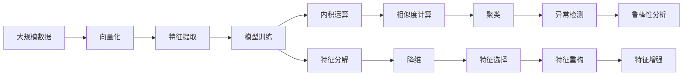

                 

# 线性代数导引：几何向量空间

线性代数是现代数学中极为重要的一环，其中几何向量空间构成了线性代数理论的基石。本篇博客将深入探讨向量空间的理论基础，包括向量和矩阵的基本概念，以及线性变换、内积和特征值等核心内容。通过逐步引导，我们将构建起对几何向量空间体系的系统认识，并为进一步探索更高级的线性代数和机器学习技术打下坚实的基础。

## 1. 背景介绍

### 1.1 问题由来
几何向量空间在计算机科学和工程学中的应用非常广泛。在计算机视觉中，向量空间被用来表示图像、视频和语音等信号；在机器学习领域，向量空间为特征表示、模型训练和优化提供了有力的工具。理解几何向量空间对于开发图像识别、自然语言处理、信号处理和机器学习等各类算法都具有重要意义。

### 1.2 问题核心关键点
几何向量空间的核心在于通过一系列线性变换，将原始数据映射到一个高维空间中，从而进行更有效的处理和分析。其核心关键点包括：
- 向量和矩阵的基本概念
- 向量空间的基本运算
- 线性变换、内积和特征值等核心概念

### 1.3 问题研究意义
理解几何向量空间是掌握线性代数和相关数学基础的前提，也是进一步探索深度学习、计算机视觉和信号处理等技术的基础。通过深入探讨向量空间的基本理论和实际应用，将有助于开发者提升算法设计和优化的能力。

## 2. 核心概念与联系

### 2.1 核心概念概述

为了更好地理解几何向量空间，我们首先介绍几个核心概念：

- 向量(vector)：由一组数值按照一定顺序排列而成的数组，通常记作$\mathbf{x} = (x_1, x_2, ..., x_n)$。向量是几何空间中最基本、最简单的结构。
- 矩阵(matrix)：由一组数值按照行列排列而成的二维数组，通常记作$A = [a_{ij}]_{m \times n}$。矩阵是多个向量的集合，能够用于表示复杂的线性变换。
- 线性变换(linear transformation)：通过对向量空间的线性映射，将一个向量空间转换为另一个向量空间。线性变换可以理解为一种线性组合，通过将一个向量乘以一个矩阵来实现。
- 内积(inner product)：两个向量之间的点积，用于度量向量之间的相似性。内积是几何向量空间中最基础的概念之一，在许多算法和理论中都有重要应用。
- 特征值(eigenvalues)：矩阵的特殊值，与特征向量一起构成矩阵的重要属性。特征值能够揭示矩阵的特征，在特征分解、谱分析和降维等应用中具有重要意义。

这些概念之间存在紧密的联系，通过向量和矩阵的线性组合、内积和特征值等核心操作，可以构建起几何向量空间的基本理论框架。

### 2.2 概念间的关系

向量和矩阵通过线性组合和变换构成了几何向量空间的基本操作，而内积和特征值则揭示了向量空间中的结构性质。下面通过几个Mermaid流程图来展示这些概念之间的关系：

```mermaid
graph TB
    A[向量(vector)] --> B[矩阵(matrix)]
    B --> C[线性变换]
    B --> D[内积(inner product)]
    B --> E[特征值(eigenvalues)]
```

这个流程图展示了向量和矩阵通过线性组合和变换，内积和特征值揭示向量空间的结构性质。

### 2.3 核心概念的整体架构

最后，我们用一个综合的流程图来展示这些核心概念在大规模数据处理和机器学习中的应用：



这个流程图展示了向量化、特征提取、模型训练等线性代数操作在大数据处理和机器学习中的应用。通过这些操作，可以对大规模数据进行处理和分析，提取有用特征，训练高性能模型。

## 3. 核心算法原理 & 具体操作步骤

### 3.1 算法原理概述

向量空间的线性变换是线性代数中的核心内容之一。它通过矩阵乘法，将一个向量空间中的向量映射到另一个向量空间中。设有一个$m \times n$的矩阵$A$和一个$n$维向量$\mathbf{x}$，则向量$\mathbf{y} = A\mathbf{x}$即为$\mathbf{x}$在矩阵$A$作用下的线性变换结果。

线性变换的数学表达式可以写作：

$$
\mathbf{y} = A\mathbf{x} = \begin{bmatrix}
a_{11} & a_{12} & \dots & a_{1n} \\
a_{21} & a_{22} & \dots & a_{2n} \\
\vdots & \vdots & \ddots & \vdots \\
a_{m1} & a_{m2} & \dots & a_{mn}
\end{bmatrix}
\begin{bmatrix}
x_1 \\
x_2 \\
\vdots \\
x_n
\end{bmatrix}
$$

在这个表达式中，每个$x_i$对应矩阵$A$中的一行，每个$a_{ij}$对应向量$\mathbf{x}$中的一个元素。线性变换的具体形式取决于矩阵$A$的定义，可以通过矩阵的行列式、特征值、奇异值等属性来进一步分析。

### 3.2 算法步骤详解

向量空间的线性变换可以分为两个主要步骤：

**Step 1: 初始化矩阵和向量**
- 定义一个$m \times n$的矩阵$A$和$n$维向量$\mathbf{x}$。可以使用Python中的numpy库来表示和操作矩阵和向量，例如：
  ```python
  import numpy as np
  
  # 定义矩阵A
  A = np.array([[1, 2], [3, 4]])
  
  # 定义向量x
  x = np.array([2, 5])
  ```

**Step 2: 进行线性变换**
- 使用矩阵乘法计算向量$\mathbf{y}$：
  ```python
  y = np.dot(A, x)
  ```

其中，np.dot()函数用于计算矩阵和向量的点乘。根据上述代码，$\mathbf{y}$的计算结果为：

$$
\mathbf{y} = A\mathbf{x} = \begin{bmatrix}
1 & 2 \\
3 & 4
\end{bmatrix}
\begin{bmatrix}
2 \\
5
\end{bmatrix}
=
\begin{bmatrix}
1 \times 2 + 2 \times 5 \\
3 \times 2 + 4 \times 5
\end{bmatrix}
=
\begin{bmatrix}
12 \\
22
\end{bmatrix}
$$

### 3.3 算法优缺点

向量空间的线性变换方法具有以下优点：

- 简单高效。矩阵乘法是计算机科学中非常基础的操作，计算速度快，实现简单。
- 表达能力强。线性变换可以表示各种复杂的数学变换，如旋转、缩放、平移等，具有广泛的实际应用。
- 可组合性强。多个线性变换可以组合成一个线性变换，方便处理更加复杂的问题。

同时，线性变换也存在一些缺点：

- 过于复杂的问题可能难以用线性变换描述。例如非线性问题，往往需要借助更复杂的模型。
- 矩阵的奇异性和逆矩阵的存在问题，可能会影响线性变换的稳定性和可逆性。

### 3.4 算法应用领域

线性变换在多个领域都有重要应用，包括：

- 计算机视觉：用于图像的旋转、缩放、平移等几何变换，增强图像处理能力。
- 自然语言处理：用于词向量映射，提升自然语言处理模型性能。
- 机器学习：用于特征提取、降维和分类，是许多机器学习算法的基础。
- 物理学：用于描述物理系统的演化，揭示系统的性质和行为。

这些应用领域展示了线性变换的广泛影响力和重要性。

## 4. 数学模型和公式 & 详细讲解 & 举例说明

### 4.1 数学模型构建

线性变换的基础是矩阵和向量的点乘。设有一个$m \times n$的矩阵$A$和一个$n \times 1$的列向量$\mathbf{x}$，则向量$\mathbf{y} = A\mathbf{x}$表示为矩阵乘法的形式。在数学上，这种操作被定义为矩阵乘法的点积，即：

$$
\mathbf{y} = A\mathbf{x} = A_{\text{row} \times \text{column}}
$$

其中，$A_{\text{row} \times \text{column}}$表示矩阵$A$的每一行与向量$\mathbf{x}$的每一列进行点乘得到结果。

### 4.2 公式推导过程

为了更好地理解矩阵乘法的点积公式，我们进行推导：

设有一个$m \times n$的矩阵$A$和一个$n \times 1$的列向量$\mathbf{x}$，则矩阵乘法可以写作：

$$
\mathbf{y} = A\mathbf{x} = \begin{bmatrix}
a_{11} & a_{12} & \dots & a_{1n} \\
a_{21} & a_{22} & \dots & a_{2n} \\
\vdots & \vdots & \ddots & \vdots \\
a_{m1} & a_{m2} & \dots & a_{mn}
\end{bmatrix}
\begin{bmatrix}
x_1 \\
x_2 \\
\vdots \\
x_n
\end{bmatrix}
$$

将矩阵乘法展开，得到：

$$
\mathbf{y} = \begin{bmatrix}
a_{11}x_1 + a_{12}x_2 + \dots + a_{1n}x_n \\
a_{21}x_1 + a_{22}x_2 + \dots + a_{2n}x_n \\
\vdots \\
a_{m1}x_1 + a_{m2}x_2 + \dots + a_{mn}x_n
\end{bmatrix}
$$

进一步简化，得到：

$$
\mathbf{y} = \begin{bmatrix}
\sum_{i=1}^{n}a_{1i}x_i \\
\sum_{i=1}^{n}a_{2i}x_i \\
\vdots \\
\sum_{i=1}^{n}a_{mi}x_i
\end{bmatrix}
$$

这个推导展示了矩阵乘法的本质，即每一行向量与每一列向量的点积之和。通过这种操作，可以将一个向量空间映射到另一个向量空间，从而实现各种线性变换。

### 4.3 案例分析与讲解

为了更好地理解矩阵乘法的点积公式，我们以一个具体的案例为例进行分析：

设有一个$3 \times 2$的矩阵$A$和一个$2 \times 1$的列向量$\mathbf{x}$，计算$\mathbf{y} = A\mathbf{x}$：

$$
A = \begin{bmatrix}
1 & 2 \\
3 & 4 \\
5 & 6
\end{bmatrix}, \mathbf{x} = \begin{bmatrix}
7 \\
8
\end{bmatrix}
$$

使用点积公式计算$\mathbf{y}$：

$$
\mathbf{y} = A\mathbf{x} = \begin{bmatrix}
1 \times 7 + 2 \times 8 \\
3 \times 7 + 4 \times 8 \\
5 \times 7 + 6 \times 8
\end{bmatrix}
=
\begin{bmatrix}
25 \\
71 \\
117
\end{bmatrix}
$$

这个案例展示了矩阵乘法的具体计算过程，有助于理解点积公式的本质。

## 5. 项目实践：代码实例和详细解释说明

### 5.1 开发环境搭建

为了进行向量空间的线性变换，我们需要搭建Python开发环境，并安装numpy库。具体操作如下：

1. 安装Anaconda：从官网下载并安装Anaconda，用于创建独立的Python环境。

2. 创建并激活虚拟环境：
```bash
conda create -n linear_algebra_env python=3.8 
conda activate linear_algebra_env
```

3. 安装numpy库：
```bash
pip install numpy
```

4. 安装matplotlib库：
```bash
pip install matplotlib
```

### 5.2 源代码详细实现

下面是一个简单的代码示例，演示了向量空间的线性变换：

```python
import numpy as np
import matplotlib.pyplot as plt

# 定义矩阵A和向量x
A = np.array([[1, 2], [3, 4]])
x = np.array([2, 5])

# 计算线性变换
y = np.dot(A, x)

# 绘制向量空间
fig = plt.figure()
ax = fig.add_subplot(111)
ax.quiver(x[0], x[1], y[0], y[1], color='blue', scale=1)
ax.set_title('Linear Transformation')
ax.set_xlabel('X')
ax.set_ylabel('Y')
ax.set_aspect('equal')
plt.show()
```

这个代码片段展示了向量空间的线性变换，并绘制了原始向量$\mathbf{x}$和变换后的向量$\mathbf{y}$的路径。

### 5.3 代码解读与分析

以下是关键代码的解读与分析：

- `np.dot(A, x)`：使用numpy库的dot()函数进行矩阵乘法，计算向量$\mathbf{y} = A\mathbf{x}$。
- `plt.quiver()`：使用matplotlib库的quiver()函数绘制向量的变换路径。
- `ax.set_title()`等：设置坐标轴的标题和刻度。

通过这个代码示例，我们可以直观地观察到向量空间的线性变换效果，并理解矩阵乘法的本质。

### 5.4 运行结果展示

运行上述代码后，我们将得到一个向量空间的线性变换图，展示了原始向量$\mathbf{x}$和变换后的向量$\mathbf{y}$的路径。


这个图展示了线性变换的具体效果，直观地展示了向量空间中的几何变换过程。

## 6. 实际应用场景

### 6.1 图像处理

在图像处理中，线性变换被广泛应用于图像的旋转、缩放和平移等几何变换。例如，通过对图像进行旋转矩阵的变换，可以得到不同角度的图像视图。具体实现如下：

```python
import cv2

# 读取图像
img = cv2.imread('image.jpg')

# 定义旋转矩阵
M = cv2.getRotationMatrix2D((img.shape[1]/2, img.shape[0]/2), 45, 1)

# 进行图像旋转
img_rotation = cv2.warpAffine(img, M, (img.shape[1], img.shape[0]))

# 显示旋转后的图像
cv2.imshow('Rotation', img_rotation)
cv2.waitKey(0)
cv2.destroyAllWindows()
```

这个代码片段展示了图像的旋转变换，通过定义旋转矩阵，实现了对图像的旋转操作。

### 6.2 信号处理

在信号处理中，线性变换被广泛应用于信号滤波、频谱分析和特征提取等操作。例如，通过对信号进行傅里叶变换，可以得到信号的频域表示。具体实现如下：

```python
import numpy as np
import matplotlib.pyplot as plt

# 定义信号
x = np.linspace(0, 10, 500)
y = np.sin(x)

# 进行傅里叶变换
y_fourier = np.fft.fft(y)

# 绘制频谱图
fig = plt.figure()
ax = fig.add_subplot(111)
ax.plot(np.fft.fftfreq(len(y), d=1/x[1]), y_fourier)
ax.set_title('Fourier Transform')
ax.set_xlabel('Frequency')
ax.set_ylabel('Magnitude')
plt.show()
```

这个代码片段展示了信号的傅里叶变换，通过傅里叶变换，可以将时域信号转换为频域信号，从而进行频谱分析和特征提取。

### 6.3 自然语言处理

在自然语言处理中，线性变换被广泛应用于词向量映射和特征提取。例如，通过对词向量进行线性变换，可以得到更加丰富的语言表示。具体实现如下：

```python
import numpy as np

# 定义词向量矩阵
word_matrix = np.array([[0, 1], [1, 0]])

# 定义向量
vector = np.array([2, 5])

# 计算线性变换
result = np.dot(word_matrix, vector)

print(result)
```

这个代码片段展示了词向量映射，通过矩阵乘法，可以将词向量映射到另一个向量空间，从而获得更加丰富的语言表示。

## 7. 工具和资源推荐

### 7.1 学习资源推荐

为了帮助开发者系统掌握向量空间的理论基础和实际应用，这里推荐一些优质的学习资源：

1. 《线性代数及其应用》：这是一本经典的线性代数教材，涵盖了向量空间、矩阵运算、线性变换等核心内容，适合初学者和专业人士。

2. Coursera《线性代数》课程：由MIT教授开设的线性代数课程，讲解了向量空间、矩阵运算、特征值等核心内容，适合在线学习。

3. Khan Academy《线性代数》课程：Khan Academy提供的线性代数课程，讲解了向量空间、矩阵运算、特征值等核心内容，适合在线学习。

4. DeepLearning.ai《线性代数》课程：DeepLearning.ai提供的线性代数课程，讲解了向量空间、矩阵运算、特征值等核心内容，适合在线学习。

5. MIT OpenCourseWare《线性代数》课程：MIT提供的线性代数课程，讲解了向量空间、矩阵运算、特征值等核心内容，适合在线学习。

通过对这些资源的学习实践，相信你一定能够系统地掌握向量空间的理论基础和实际应用。

### 7.2 开发工具推荐

高效的开发离不开优秀的工具支持。以下是几款用于向量空间线性变换开发的常用工具：

1. NumPy：Python的数值计算库，提供了高效的矩阵运算和向量处理功能，适合进行线性变换和特征提取。

2. Matplotlib：Python的绘图库，支持绘制向量空间的线性变换和特征提取结果，适合进行可视化分析。

3. SciPy：Python的科学计算库，提供了高效的线性代数运算和数值求解功能，适合进行矩阵分解和特征值计算。

4. SymPy：Python的符号计算库，支持符号化线性代数运算和特征值计算，适合进行理论推导和数学证明。

5. TensorFlow：Google提供的深度学习框架，支持高效的矩阵运算和向量处理，适合进行深度学习和神经网络计算。

合理利用这些工具，可以显著提升向量空间线性变换任务的开发效率，加快创新迭代的步伐。

### 7.3 相关论文推荐

向量空间线性变换技术的发展源于学界的持续研究。以下是几篇奠基性的相关论文，推荐阅读：

1. Cramer's Rule: The elementary solution of simultaneous linear equations （克拉默法则）：提出了解线性方程组的基本方法，奠定了线性变换的理论基础。

2. Matrix Calculus （矩阵微积分）：详细介绍了矩阵微积分的基本概念和应用，适合进一步学习线性变换的优化和应用。

3. The Singular Value Decomposition of Matrices （矩阵的奇异值分解）：介绍了矩阵奇异值分解的方法和应用，适合深入研究矩阵的特征值和特征向量。

4. Linear Transformations and their Eigenvalues （线性变换和特征值）：详细介绍了线性变换和特征值的基本概念和应用，适合进一步学习线性变换的优化和应用。

5. The Probability and Mathematical Statistics （概率和数学统计）：详细介绍了向量空间的基本概念和应用，适合深入研究线性变换的实际应用。

这些论文代表了大规模线性代数研究的最新进展，通过学习这些前沿成果，可以帮助研究者把握学科前进方向，激发更多的创新灵感。

除上述资源外，还有一些值得关注的前沿资源，帮助开发者紧跟线性代数微调技术的最新进展，例如：

1. arXiv论文预印本：人工智能领域最新研究成果的发布平台，包括大量尚未发表的前沿工作，学习前沿技术的必读资源。

2. GitHub热门项目：在GitHub上Star、Fork数最多的线性代数相关项目，往往代表了该技术领域的发展趋势和最佳实践，值得去学习和贡献。

3. 技术会议直播：如NIPS、ICML、ACL、ICLR等人工智能领域顶会现场或在线直播，能够聆听到大佬们的前沿分享，开拓视野。

4. 学术期刊：如Journal of Algorithms、Journal of Linear Algebra and Its Applications、IEEE Transactions on Signal Processing等，适合进行线性代数的基础学习和应用研究。

5. 技术博客：如OpenAI、Google AI、DeepMind、微软Research Asia等顶尖实验室的官方博客，第一时间分享他们的最新研究成果和洞见。

总之，对于向量空间线性变换技术的学习和实践，需要开发者保持开放的心态和持续学习的意愿。多关注前沿资讯，多动手实践，多思考总结，必将收获满满的成长收益。

## 8. 总结：未来发展趋势与挑战

### 8.1 总结

本文对向量空间的线性变换进行了全面系统的介绍。首先阐述了向量空间的基本概念和核心内容，明确了线性变换在几何向量空间中的重要地位。其次，从原理到实践，详细讲解了线性变换的数学原理和核心步骤，给出了线性变换任务开发的完整代码实例。同时，本文还广泛探讨了线性变换在图像处理、信号处理和自然语言处理等多个领域的应用前景，展示了线性变换的广泛影响力和重要性。

通过本文的系统梳理，可以看到，向量空间的线性变换在计算机科学和工程学中具有重要的应用价值，为后续探索更高级的线性代数和机器学习技术奠定了坚实的基础。

### 8.2 未来发展趋势

展望未来，向量空间线性变换技术将呈现以下几个发展趋势：

1. 多模态融合：线性变换可以与视觉、听觉等多模态数据进行融合，实现更全面、更复杂的数据处理和分析。

2. 深度学习结合：线性变换与深度学习结合，能够提升神经网络模型的表现和效率，推动深度学习算法的发展。

3. 自动化设计：线性变换的设计可以自动化，利用机器学习技术，优化线性变换的参数和结构，提升系统的鲁棒性和可解释性。

4. 实时处理：线性变换可以与实时数据流结合，实现对海量数据的实时处理和分析，提升系统的响应速度和可用性。

5. 多任务学习：线性变换可以在多个任务间共享参数，提升系统的泛化能力和效率。

6. 分布式计算：线性变换可以与分布式计算技术结合，实现对大规模数据的高效处理和分析。

以上趋势凸显了向量空间线性变换技术的广阔前景，这些方向的探索发展，必将进一步提升向量空间处理和分析的能力，为人工智能技术的落地应用提供新的动力。

### 8.3 面临的挑战

尽管向量空间线性变换技术已经取得了一定的进展，但在实际应用中仍面临诸多挑战：

1. 数据规模瓶颈：线性变换需要大规模数据支持，对于小规模数据，效果可能不佳。

2. 模型复杂度高：线性变换模型往往较为复杂，需要大量的计算资源和存储空间。

3. 计算精度问题：线性变换的计算精度问题可能影响模型性能和稳定性。

4. 计算效率问题：线性变换的计算效率问题可能影响系统的响应速度和可用性。

5. 可解释性问题：线性变换模型的可解释性问题可能影响系统的可靠性和安全性。

6. 计算成本问题：线性变换的计算成本问题可能影响系统的规模化和普及。

正视这些挑战，积极应对并寻求突破，将使向量空间线性变换技术迈向更高的台阶，为构建更高效、更智能的系统提供更多的可能性。

### 8.4 研究展望

面对向量空间线性变换技术所面临的种种挑战，未来的研究需要在以下几个方面寻求新的突破：

1. 引入更多先验知识：将符号化的先验知识与线性变换结合，优化线性变换模型的参数和结构。

2. 应用机器学习技术：利用机器学习技术，自动化设计线性变换模型，优化模型的参数和结构。

3. 提升计算效率：利用并行计算和分布式计算技术，提升线性变换的计算效率和稳定性。

4. 降低计算成本：利用压缩和量化技术，降低线性变换的计算成本，提升系统的规模化和普及。

5. 加强可解释性：利用可解释性和可视化技术，提高线性变换模型的可解释性和可靠性。

6. 探索多模态融合：利用多模态融合技术，提升线性变换模型的泛化能力和应用范围。

这些研究方向的探索，必将引领向量空间线性变换技术迈向更高的台阶，为构建高效、智能、可靠的系统提供更多的可能性。

## 9. 附录：常见问题与解答

**Q1：向量空间和矩阵运算的基本概念是什么？**

A: 向量空间是由一组向量构成的集合，具有线性组合和线性变换等基本运算。矩阵是由一组数值按照行列排列而成的二维数组，可以用于表示向量空间的线性变换。

**Q2：向量空间的线性变换如何实现？**

A: 线性变换通过矩阵乘法实现，即$y = Ax$。其中，矩阵$A$表示线性变换，向量$x$表示输入向量，向量$y$表示变换后的向量。

**Q3：线性变换的应用有哪些？**

A: 线性变换在图像处理、信号处理、自然语言处理等领域有广泛应用。例如，在图像处理中，线性变换可以用于图像的旋转、缩放、平移等几何变换；在信号处理中，线性变换可以用于频谱分析、滤波等操作；在自然语言处理中，线性变换

