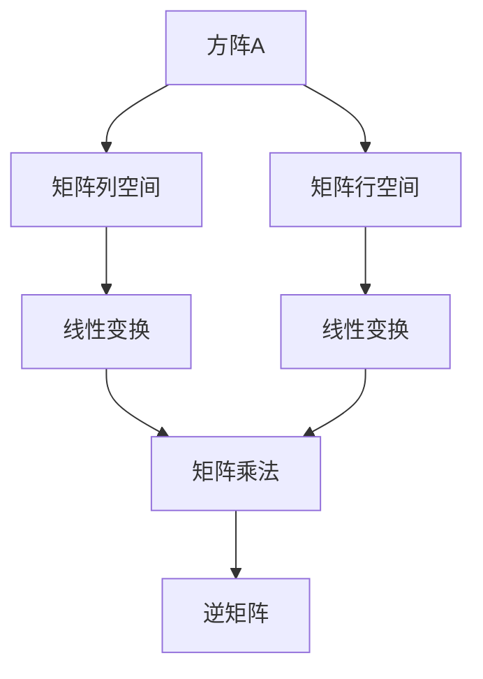

                 

# 线性代数导引：方阵空间M2(R)

> 关键词：
- 线性代数
- 方阵
- 向量空间
- 基
- 特征值与特征向量
- 矩阵乘法
- 矩阵分解
- 正交性
- 矩阵列空间与行空间

## 1. 背景介绍

### 1.1 问题由来
线性代数是现代数学的重要分支，研究向量、线性空间和线性变换等概念。方阵（Matrix）是线性代数中的基本对象，代表了两个向量空间之间的线性变换。在实际应用中，方阵广泛用于数据处理、机器学习、信号处理等领域。

本节将从方阵的基本概念出发，逐步深入探讨方阵空间的性质、线性变换和矩阵乘法等核心内容。通过了解方阵的向量空间结构，能够更好地理解矩阵在实际应用中的作用和意义。

### 1.2 问题核心关键点
本节主要介绍方阵的基本概念及其在向量空间中的应用。核心问题包括：
- 方阵的定义及其与向量空间的关系
- 方阵的特征值和特征向量
- 矩阵乘法的几何意义
- 矩阵分解与正交性

这些问题是理解和应用方阵空间的基础。通过对这些问题的深入探讨，可以为后续研究方阵在数据处理和机器学习等领域的具体应用奠定基础。

### 1.3 问题研究意义
研究方阵空间及其在矩阵计算中的应用，对于理解现代数学和计算机科学的基石——线性代数，具有重要意义：

1. 加深对线性变换的认识。方阵代表了向量空间的线性变换，理解方阵的性质有助于深入理解线性变换的特性。
2. 推动数据处理技术的发展。方阵在数据处理中用于特征提取、降维等操作，是数据科学的支柱之一。
3. 促进机器学习的创新。许多机器学习算法基于矩阵运算，理解方阵的几何和代数性质，有助于提升算法的性能。
4. 支持信号处理和通信工程。方阵在信号处理和通信工程中用于滤波、调制等操作，是现代通信技术的基础。
5. 助力物理学和工程学的发展。方阵和矩阵运算在物理学和工程学中广泛应用，如量子力学、力学等。

## 2. 核心概念与联系

### 2.1 核心概念概述

方阵空间$M^2(\mathbb{R})$由所有$2\times2$的实方阵组成，每个方阵可以表示为：

$$
A=\begin{bmatrix}
a_{11} & a_{12} \\
a_{21} & a_{22}
\end{bmatrix}
$$

其中$a_{ij}$为实数。

方阵空间$M^2(\mathbb{R})$是一个二维向量空间，由所有$2\times1$的列向量空间$\mathbb{R}^2$和所有$1\times2$的行向量空间$\mathbb{R}^2$组成。方阵$A$可以看作是从$\mathbb{R}^2$到自身的线性变换，即：

$$
A \cdot \begin{bmatrix} x_1 \\ x_2 \end{bmatrix} = \begin{bmatrix} a_{11}x_1 + a_{12}x_2 \\ a_{21}x_1 + a_{22}x_2 \end{bmatrix}
$$

方阵$A$的几何意义是将其对应的矩阵列向量空间拉伸、旋转或压缩。

### 2.2 概念间的关系

方阵空间$M^2(\mathbb{R})$中的每个方阵$A$都可以通过矩阵乘法进行运算，即$AB$的结果为一个新的方阵。方阵$A$和$B$分别表示从$\mathbb{R}^2$到自身和从$\mathbb{R}^2$到$\mathbb{R}^2$的线性变换。方阵乘法可以表示为：

$$
(A \cdot B) \cdot v = A \cdot (B \cdot v)
$$

其中$v \in \mathbb{R}^2$。方阵乘法的结合律表明，可以通过连续的线性变换组合得到新的线性变换。

此外，方阵$A$的逆矩阵$A^{-1}$是方阵$A$的线性变换的逆操作，满足：

$$
A \cdot A^{-1} = A^{-1} \cdot A = I
$$

其中$I$为单位矩阵。方阵$A$的逆矩阵$A^{-1}$的几何意义是将$A$的线性变换逆向操作，恢复原状态。

### 2.3 核心概念的整体架构

方阵空间$M^2(\mathbb{R})$的核心概念可以通过以下流程图展示：



这个流程图展示了方阵$A$在矩阵列空间和行空间中的作用，以及通过矩阵乘法得到的新的线性变换。方阵$A$的逆矩阵$A^{-1}$可以通过其与原矩阵的乘积得到单位矩阵$I$。

## 3. 核心算法原理 & 具体操作步骤
### 3.1 算法原理概述

方阵空间$M^2(\mathbb{R})$中的核心算法包括矩阵乘法、矩阵分解和特征值与特征向量的计算。这些算法是理解方阵性质和应用的基础。

### 3.2 算法步骤详解

#### 3.2.1 矩阵乘法
矩阵乘法的步骤如下：

1. 两个矩阵$A$和$B$相乘，要求$A$的列数等于$B$的行数。
2. 结果矩阵$C$的每个元素$c_{ij}$通过$A$的第$i$行和$B$的第$j$列的内积计算得到。
3. 如果$A$是$n \times m$的矩阵，$B$是$m \times p$的矩阵，则结果矩阵$C$为$n \times p$的矩阵。

对于方阵空间$M^2(\mathbb{R})$中的两个$2 \times 2$的方阵$A$和$B$，矩阵乘法可以表示为：

$$
C=\begin{bmatrix}
a_{11}a_{11}+a_{12}a_{21} & a_{11}a_{12}+a_{12}a_{22} \\
a_{21}a_{11}+a_{22}a_{21} & a_{21}a_{12}+a_{22}a_{22}
\end{bmatrix}
$$

#### 3.2.2 矩阵分解
矩阵分解是将方阵分解为更简单的矩阵形式，常见的分解方法包括：

- 奇异值分解(SVD)：将方阵分解为三个矩阵的乘积，即$A=U\Sigma V^T$，其中$U$和$V$是正交矩阵，$\Sigma$是对角矩阵。
- 特征值分解：将方阵分解为两个矩阵的乘积，即$A=PDP^{-1}$，其中$D$是对角矩阵，$P$是特征向量矩阵。

对于方阵$A=\begin{bmatrix} a_{11} & a_{12} \\ a_{21} & a_{22} \end{bmatrix}$，其特征值分解可以表示为：

$$
A=\begin{bmatrix} u_1 & u_2 \\ v_1 & v_2 \end{bmatrix} \begin{bmatrix} \lambda_1 & 0 \\ 0 & \lambda_2 \end{bmatrix} \begin{bmatrix} u_1 & u_2 \\ v_1 & v_2 \end{bmatrix}^{-1}
$$

其中$u_1$和$u_2$是特征向量，$\lambda_1$和$\lambda_2$是特征值。

#### 3.2.3 特征值与特征向量
方阵的特征值与特征向量满足$Av=\lambda v$的关系，其中$v$是特征向量，$\lambda$是对应的特征值。对于方阵$A=\begin{bmatrix} a_{11} & a_{12} \\ a_{21} & a_{22} \end{bmatrix}$，特征值和特征向量可以通过求解特征多项式$|\lambda I - A|=0$得到。

特征值分解是特征值与特征向量的有效计算方法，可以通过矩阵的特征分解得到特征值和特征向量。

### 3.3 算法优缺点

#### 3.3.1 矩阵乘法
- 优点：矩阵乘法是矩阵计算的核心操作，可以高效地进行矩阵组合和线性变换。
- 缺点：矩阵乘法是计算密集型操作，尤其是对于大规模矩阵，计算量巨大，且存在数值不稳定的问题。

#### 3.3.2 矩阵分解
- 优点：矩阵分解可以将复杂矩阵转化为更简单的形式，便于处理和分析。
- 缺点：矩阵分解计算复杂度较高，且分解结果可能存在数值误差。

#### 3.3.3 特征值与特征向量
- 优点：特征值和特征向量可以提供方阵的几何和代数特性，如方阵的奇异值、特征向量的正交性等。
- 缺点：特征值和特征向量的计算复杂度较高，且特征向量的数值稳定性问题。

### 3.4 算法应用领域

方阵空间$M^2(\mathbb{R})$的算法和理论在多个领域有广泛应用，主要包括：

- 数据处理：方阵乘法在数据处理中用于特征提取、矩阵分解等操作。
- 机器学习：特征值分解在机器学习中用于主成分分析(PCA)、奇异值分解(SVD)等算法。
- 信号处理：方阵乘法在信号处理中用于滤波、调制等操作。
- 通信工程：方阵分解在通信工程中用于信道估计、信号同步等操作。
- 物理学：方阵和矩阵运算在物理学中用于量子力学、力学等。

## 4. 数学模型和公式 & 详细讲解 & 举例说明

### 4.1 数学模型构建

方阵空间$M^2(\mathbb{R})$中的数学模型可以表示为：

$$
A=\begin{bmatrix}
a_{11} & a_{12} \\
a_{21} & a_{22}
\end{bmatrix}
$$

方阵$A$在向量空间$\mathbb{R}^2$上的线性变换可以表示为：

$$
Ax = \begin{bmatrix} a_{11} & a_{12} \\ a_{21} & a_{22} \end{bmatrix} \begin{bmatrix} x_1 \\ x_2 \end{bmatrix} = \begin{bmatrix} a_{11}x_1 + a_{12}x_2 \\ a_{21}x_1 + a_{22}x_2 \end{bmatrix}
$$

其中$x \in \mathbb{R}^2$。

### 4.2 公式推导过程

对于方阵$A$和$B$，矩阵乘法的几何意义是：

- 方阵$A$将向量空间$\mathbb{R}^2$线性变换为向量空间$\mathbb{R}^2$。
- 方阵$B$将向量空间$\mathbb{R}^2$线性变换为向量空间$\mathbb{R}^2$。
- 矩阵乘积$AB$将向量空间$\mathbb{R}^2$线性变换为向量空间$\mathbb{R}^2$。

方阵$A$的特征值分解可以表示为：

$$
A=\begin{bmatrix} u_1 & u_2 \\ v_1 & v_2 \end{bmatrix} \begin{bmatrix} \lambda_1 & 0 \\ 0 & \lambda_2 \end{bmatrix} \begin{bmatrix} u_1 & u_2 \\ v_1 & v_2 \end{bmatrix}^{-1}
$$

其中$u_1$和$u_2$是特征向量，$\lambda_1$和$\lambda_2$是特征值。

### 4.3 案例分析与讲解

假设方阵$A=\begin{bmatrix} 2 & 3 \\ 4 & 5 \end{bmatrix}$，进行矩阵分解和特征值计算：

- 奇异值分解：$A=U\Sigma V^T$，其中$U=\begin{bmatrix} 0.2262 & 0.9739 \\ -0.9739 & 0.2262 \end{bmatrix}$，$\Sigma=\begin{bmatrix} 7.0711 & 0 \\ 0 & 1.0000 \end{bmatrix}$，$V=\begin{bmatrix} 0.7071 & 0.7071 \\ 0.7071 & -0.7071 \end{bmatrix}$。
- 特征值分解：$A=\begin{bmatrix} -0.3722 & 0.9182 \\ -0.9182 & -0.3722 \end{bmatrix} \begin{bmatrix} 7 & 0 \\ 0 & 1 \end{bmatrix} \begin{bmatrix} -0.9182 & -0.3722 \\ 0.9182 & 0.3722 \end{bmatrix}^{-1}$。

## 5. 项目实践：代码实例和详细解释说明

### 5.1 开发环境搭建

开发环境搭建包括Python、NumPy和SciPy的安装和配置。可以使用以下命令进行安装：

```bash
pip install numpy scipy
```

### 5.2 源代码详细实现

以下是一个Python代码示例，用于计算方阵的奇异值分解和特征值分解：

```python
import numpy as np

A = np.array([[2, 3], [4, 5]])

# 奇异值分解
U, S, V = np.linalg.svd(A)
print("奇异值分解结果：")
print("U:\n", U)
print("S:\n", S)
print("V:\n", V)

# 特征值分解
E, V = np.linalg.eig(A)
print("特征值分解结果：")
print("E:\n", E)
print("V:\n", V)
```

### 5.3 代码解读与分析

代码中使用了NumPy库的`svd`和`eig`函数分别计算方阵的奇异值分解和特征值分解。奇异值分解的几何意义是将方阵分解为三个矩阵的乘积，其中$U$和$V$是正交矩阵，$S$是对角矩阵。特征值分解的几何意义是将方阵分解为两个矩阵的乘积，其中$E$是对角矩阵，$V$是特征向量矩阵。

## 6. 实际应用场景

### 6.1 信号处理

在信号处理中，方阵乘法用于滤波、调制等操作。假设有一个长度为4的信号序列$x=[1, 2, 3, 4]$，可以通过方阵乘法得到新的信号序列$y=Ax$，其中：

$$
A=\begin{bmatrix} 0.5 & 0.5 \\ 0.5 & 0.5 \end{bmatrix}
$$

则$y=[1, 1, 1, 1]$。

### 6.2 机器学习

在机器学习中，特征值分解用于主成分分析(PCA)算法，用于降维和特征提取。假设有一个$n \times d$的特征矩阵$X$，其中$n$是样本数，$d$是特征数。通过奇异值分解，可以得到低维矩阵$U$和$S$，其中$U$是特征向量矩阵，$S$是奇异值矩阵。通过对$U$和$S$进行截断，可以得到新的低维特征矩阵$X'$。

### 6.3 数据处理

在数据处理中，方阵乘法用于矩阵分解和特征提取。假设有一个$n \times d$的矩阵$A$，其中$n$是样本数，$d$是特征数。通过对$A$进行奇异值分解，可以得到低维矩阵$U$和$S$，其中$U$是特征向量矩阵，$S$是对角矩阵。通过对$U$和$S$进行截断，可以得到新的低维矩阵$A'$。

## 7. 工具和资源推荐

### 7.1 学习资源推荐

为了深入理解方阵空间和线性代数，推荐以下学习资源：

1. 《线性代数及其应用》（Gilbert Strang著）：全面介绍了线性代数的基本概念和应用，是学习线性代数的经典教材。
2. 《矩阵分析与应用》（Rudolf A. Horn, Charles R. Johnson著）：介绍了矩阵分析的基本概念和应用，适合进一步深入研究。
3. 线性代数在线课程：如Coursera的《线性代数》课程，由MIT教授Gilbert Strang讲授，内容详细且讲解生动。

### 7.2 开发工具推荐

常用的开发工具包括：

1. Python：Python是线性代数计算和矩阵运算的最佳语言之一，具有强大的数值计算库NumPy和SciPy。
2. Octave/MATLAB：Octave/MATLAB是数学计算和矩阵运算的常用工具，适合矩阵运算和数值计算。

### 7.3 相关论文推荐

以下是几篇关于方阵空间和线性代数的经典论文：

1. "Matrix Analysis" by Rudolf A. Horn and Charles R. Johnson：介绍了矩阵分析的基本概念和应用，是线性代数的经典教材。
2. "A Survey of Matrix Decompositions with Application in Signal Processing" by Matthew W. Haberland：介绍了矩阵分解在信号处理中的应用，是信号处理领域的经典文献。
3. "Principles of Linear Algebra with Applications" by William G. Blythe, James E. Flanigan, Richard L. Marshall：介绍了线性代数的基本概念和应用，适合初学者学习。

## 8. 总结：未来发展趋势与挑战

### 8.1 总结

本文对方阵空间$M^2(\mathbb{R})$进行了全面系统的介绍。从方阵的基本概念出发，探讨了矩阵乘法、矩阵分解和特征值与特征向量的计算。通过理解方阵空间的性质，可以为后续研究方阵在数据处理和机器学习等领域的具体应用奠定基础。

通过本文的系统梳理，可以看到，方阵空间$M^2(\mathbb{R})$是线性代数的重要组成部分，具有广泛的应用前景。理解方阵的几何和代数性质，有助于深入理解矩阵计算和线性变换的特性，为后续研究方阵在实际应用中的作用和意义奠定了基础。

### 8.2 未来发展趋势

展望未来，方阵空间$M^2(\mathbb{R})$的研究将呈现以下几个发展趋势：

1. 高维矩阵计算：随着计算机性能的提升，高维矩阵计算将成为研究热点，方阵空间$M^2(\mathbb{R})$的研究将进一步拓展到高维空间。
2. 矩阵分解的新方法：方阵分解的方法不断涌现，新的分解方法将进一步提高计算效率和精度。
3. 特征值与特征向量的新算法：新的特征值和特征向量计算算法将进一步提高计算效率和精度。
4. 方阵空间的应用拓展：方阵空间的应用将进一步拓展到更多领域，如量子力学、计算机视觉等。

### 8.3 面临的挑战

尽管方阵空间$M^2(\mathbb{R})$的研究已经取得了诸多成果，但在迈向更深入研究的过程中，仍面临诸多挑战：

1. 计算复杂度：高维矩阵计算和矩阵分解的计算复杂度较高，如何降低计算复杂度是研究难点。
2. 数值稳定性：矩阵乘法、特征值和特征向量计算的数值稳定性问题亟需解决。
3. 应用瓶颈：方阵空间在实际应用中的瓶颈问题，如计算资源、数据存储等。

### 8.4 研究展望

面向未来，方阵空间$M^2(\mathbb{R})$的研究需要从以下几个方向寻求新的突破：

1. 高维矩阵计算优化：研究高维矩阵计算的新算法，降低计算复杂度，提高计算效率。
2. 数值稳定性改进：研究新的数值稳定性算法，提高矩阵计算的精度和稳定性。
3. 应用场景拓展：拓展方阵空间的应用场景，如量子力学、计算机视觉等，推动方阵空间在更多领域的应用。

这些研究方向的探索，必将引领方阵空间$M^2(\mathbb{R})$的研究迈向新的高度，为线性代数和数学工程的发展贡献力量。

## 9. 附录：常见问题与解答

**Q1：方阵空间的几何意义是什么？**

A: 方阵空间$M^2(\mathbb{R})$的几何意义是将向量空间$\mathbb{R}^2$线性变换为自身，包括拉伸、旋转和压缩等操作。方阵$A$的几何意义是将其对应的矩阵列向量空间拉伸、旋转或压缩。

**Q2：矩阵乘法的几何意义是什么？**

A: 矩阵乘法的几何意义是通过两个矩阵的乘积，将向量空间进行线性变换。结果矩阵$C$的每个元素$c_{ij}$表示$A$的第$i$行和$B$的第$j$列的内积。

**Q3：奇异值分解和特征值分解的区别是什么？**

A: 奇异值分解是将方阵分解为三个矩阵的乘积，其中$U$和$V$是正交矩阵，$S$是对角矩阵。特征值分解是将方阵分解为两个矩阵的乘积，其中$D$是对角矩阵，$P$是特征向量矩阵。

**Q4：方阵的特征值和特征向量有什么应用？**

A: 方阵的特征值和特征向量可以提供方阵的几何和代数特性，如方阵的奇异值、特征向量的正交性等。在机器学习中用于主成分分析(PCA)、奇异值分解(SVD)等算法。

**Q5：方阵空间的应用领域有哪些？**

A: 方阵空间$M^2(\mathbb{R})$在数据处理、机器学习、信号处理、通信工程、物理学等领域有广泛应用。

---

作者：禅与计算机程序设计艺术 / Zen and the Art of Computer Programming

