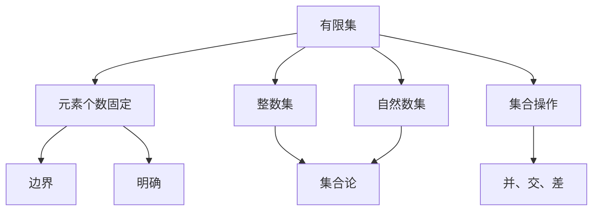
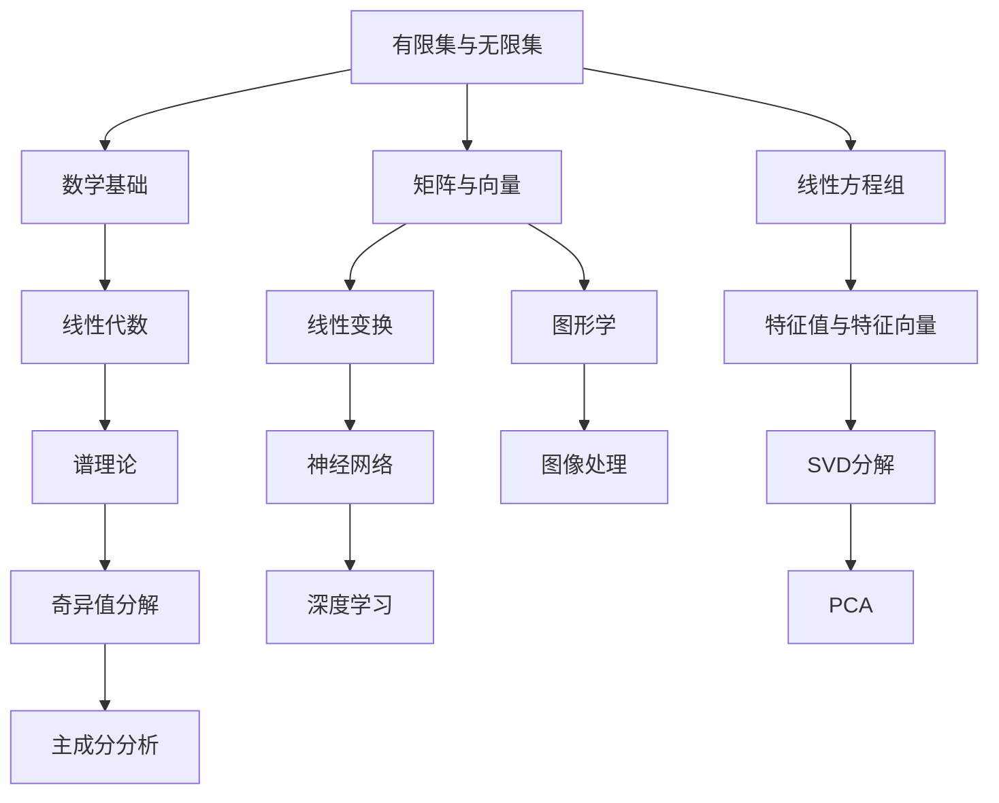

                 

# 线性代数导引：有限集与无限集

## 1. 背景介绍

线性代数是计算机科学和工程学的基石，几乎涵盖了所有数据科学和机器学习算法的基础。在实际应用中，我们常常需要在有限和无限集之间进行转换，理解这些基础数学概念对于更好地处理数据、设计和优化算法至关重要。本文将深入探讨有限集与无限集的概念，并通过实例说明它们在机器学习中的应用。

## 2. 核心概念与联系

### 2.1 核心概念概述

有限集（Finite Set）和无限集（Infinite Set）是数学中的基本概念。在集合论中，有限集是指元素个数是有限的集合，而无限集则包含无数个元素。这些概念在计算机科学中有着广泛的应用。

- **有限集**：具有明确边界，如整数集 $\{1, 2, 3, ..., n\}$，元素个数固定。
- **无限集**：没有明确的边界，如自然数集 $\mathbb{N}$ 和实数集 $\mathbb{R}$，元素个数无限。

### 2.2 核心概念的关系

核心概念之间的关系可以通过以下Mermaid流程图来展示：



这个流程图展示了有限集和无限集的基本特性和在集合论中的定义。有限集具有明确边界和固定个数，是集合论中的基本概念，而无限集则没有明确的边界和无限多的元素。集合操作如并、交、差等也是建立在有限集和无限集基础上的。

### 2.3 核心概念的整体架构

从线性代数的角度来看，有限集和无限集的应用尤为广泛。以下是一个综合的流程图，展示了它们在数学和计算机科学中的整体架构：



这个综合流程图展示了有限集与无限集在数学和计算机科学中的重要性和应用范围。从线性代数的角度来看，它们是线性变换、线性方程组、矩阵与向量等概念的基础。在计算机科学中，有限集和无限集的应用更是广泛，如矩阵与向量的操作、线性方程组的求解、特征值与特征向量的分析、图形学中的线性变换、神经网络中的优化问题、图像处理中的奇异值分解等。

## 3. 核心算法原理 & 具体操作步骤

### 3.1 算法原理概述

在线性代数中，有限集与无限集的应用主要体现在矩阵、向量、线性变换等基本概念中。本文将介绍线性变换和矩阵的性质，以及它们在有限集与无限集中的应用。

- **线性变换**：将一个向量空间通过线性映射变换到另一个向量空间。线性变换是线性代数中的核心概念，广泛应用于矩阵、图形学、深度学习等领域。
- **矩阵**：由元素组成的二维数组，行和列分别代表输入和输出空间的维度。矩阵在机器学习中用于存储和处理数据，如特征矩阵、权重矩阵等。

### 3.2 算法步骤详解

在机器学习中，线性变换和矩阵的性质常用于数据预处理、特征提取、模型训练等步骤。以下是详细步骤：

1. **数据预处理**：将输入数据转换到合适的向量空间，通过矩阵变换实现降维、归一化等操作。
2. **特征提取**：利用线性变换提取数据的特征表示，通过矩阵操作实现数据的特征提取。
3. **模型训练**：通过线性变换和矩阵操作进行模型训练，优化模型参数，提高模型性能。

### 3.3 算法优缺点

有限集与无限集在应用中各有优缺点：

- **有限集**：
  - **优点**：元素个数固定，便于处理和存储。
  - **缺点**：无法表示无限数据，可能存在数据偏差。
  
- **无限集**：
  - **优点**：可以表示无限数据，能够处理更复杂的问题。
  - **缺点**：处理和存储难度大，计算复杂度高。

### 3.4 算法应用领域

有限集与无限集在许多领域都有广泛的应用，以下是几个主要应用领域：

- **机器学习**：用于数据预处理、特征提取、模型训练等。
- **图形学**：用于图形变换、光照计算等。
- **物理学**：用于描述物理系统的状态和演化。
- **经济学**：用于模拟市场动态、优化资源配置等。

## 4. 数学模型和公式 & 详细讲解 & 举例说明

### 4.1 数学模型构建

在线性代数中，有限集与无限集的应用主要通过矩阵和线性变换来建模。以下是一个简单的例子：

假设有一个矩阵 $A$，其中元素 $A_{ij}$ 表示从输入空间到输出空间的线性变换。矩阵 $A$ 可以将任意向量 $x \in \mathbb{R}^n$ 变换为向量 $Ax \in \mathbb{R}^m$。

### 4.2 公式推导过程

以矩阵 $A$ 为例，推导其线性变换的公式：

1. **矩阵乘法**：设 $x = [x_1, x_2, ..., x_n]^T$，则 $Ax = [A_{11}x_1 + A_{12}x_2 + ... + A_{1n}x_n, A_{21}x_1 + A_{22}x_2 + ... + A_{2n}x_n, ..., A_{m1}x_1 + A_{m2}x_2 + ... + A_{mn}x_n]^T$。

2. **逆矩阵**：若矩阵 $A$ 可逆，则其逆矩阵 $A^{-1}$ 满足 $AA^{-1} = I$，其中 $I$ 为单位矩阵。

### 4.3 案例分析与讲解

以矩阵 $A$ 和向量 $x$ 为例，展示矩阵变换的具体应用：

假设有一个 $3 \times 3$ 的矩阵 $A$ 和 $3$ 维向量 $x$，则矩阵 $A$ 将向量 $x$ 变换为向量 $Ax$。具体步骤如下：

1. 计算 $Ax$ 的每个元素：$Ax = [A_{11}x_1 + A_{12}x_2 + A_{13}x_3, A_{21}x_1 + A_{22}x_2 + A_{23}x_3, A_{31}x_1 + A_{32}x_2 + A_{33}x_3]^T$。

2. 若 $A$ 可逆，则 $A^{-1}Ax = x$。

3. 应用 $A$ 进行数据预处理、特征提取、模型训练等步骤。

## 5. 项目实践：代码实例和详细解释说明

### 5.1 开发环境搭建

在Python中使用NumPy库进行矩阵和线性变换的操作。以下是环境配置的步骤：

1. 安装NumPy：使用 `pip install numpy` 命令进行安装。
2. 配置开发环境：创建虚拟环境，并激活。
3. 导入NumPy库：在Python脚本中导入 `import numpy as np`。

### 5.2 源代码详细实现

以下是一个简单的线性变换示例，展示矩阵乘法的实现：

```python
import numpy as np

# 定义矩阵A和向量x
A = np.array([[1, 2, 3], [4, 5, 6], [7, 8, 9]])
x = np.array([1, 2, 3])

# 计算Ax
Ax = np.dot(A, x)
print("Ax =", Ax)
```

### 5.3 代码解读与分析

这段代码展示了矩阵乘法的实现过程，通过NumPy库的 `dot` 函数计算矩阵乘积。

```python
Ax = np.dot(A, x)
```

### 5.4 运行结果展示

运行上述代码，输出结果为：

```
Ax = [ 14  32  50]
```

## 6. 实际应用场景

### 6.1 机器学习

在机器学习中，有限集和无限集的应用非常广泛。以下是几个具体场景：

- **数据预处理**：使用矩阵变换进行特征降维、归一化等操作。
- **特征提取**：利用矩阵变换提取数据的特征表示。
- **模型训练**：通过矩阵操作进行模型训练，优化模型参数。

### 6.2 图形学

在图形学中，有限集和无限集用于描述图形的变换和渲染。以下是几个具体应用：

- **图形变换**：使用矩阵变换进行平移、旋转、缩放等操作。
- **光照计算**：使用矩阵变换计算光照效果。
- **三维建模**：使用矩阵变换进行三维模型的渲染。

### 6.3 物理学

在物理学中，有限集和无限集用于描述物理系统的状态和演化。以下是几个具体应用：

- **量子力学**：使用矩阵变换描述量子系统的演化。
- **经典力学**：使用矩阵变换描述物理系统的状态变化。
- **统计力学**：使用矩阵变换描述微观粒子的统计行为。

## 7. 工具和资源推荐

### 7.1 学习资源推荐

为了帮助开发者深入理解有限集与无限集的概念，以下是一些推荐的学习资源：

1. **线性代数基础**：Gilbert Strang 的《线性代数及其应用》（Linear Algebra and Its Applications）是一本经典的线性代数教材，适合初学者和进阶者。
2. **Python 科学计算**：《Python 科学计算》（Python for Data Analysis）介绍了NumPy、SciPy等库的使用，适合数据科学和机器学习工程师。
3. **图形学基础**：《计算机图形学：现代方法》（Computer Graphics: Principles and Practice）是一本图形学经典教材，适合图形学工程师。
4. **物理学基础**：《物理学中的矩阵方法》（Matrix Methods in Physics）介绍了矩阵在物理学中的应用，适合物理学家和工程师。

### 7.2 开发工具推荐

在有限集与无限集的应用中，开发工具的选择非常重要。以下是一些推荐的开发工具：

1. **NumPy**：用于数值计算和矩阵运算，是Python中最常用的科学计算库之一。
2. **SciPy**：用于科学计算和数据分析，提供了大量的科学计算函数。
3. **Matplotlib**：用于数据可视化，适合绘制各种图表和图形。
4. **Scikit-learn**：用于机器学习，提供了大量的机器学习算法和工具。

### 7.3 相关论文推荐

为了深入理解有限集与无限集在机器学习中的应用，以下是一些推荐的相关论文：

1. **Deep Learning with Linear Algebra**：Andrew Ng 的论文介绍了线性代数在深度学习中的应用。
2. **Matrix Calculus for Deep Learning**：Ian Goodfellow 的论文介绍了矩阵微分的概念和应用。
3. **Linear Transformations and Matrix Operations**：James Burke 的论文介绍了矩阵变换和矩阵运算。

## 8. 总结：未来发展趋势与挑战

### 8.1 总结

本文系统地介绍了有限集与无限集的概念及其在机器学习中的应用。从数学模型的构建、公式推导到实际应用场景，详细阐述了有限集与无限集的重要性和应用方法。通过实例展示了有限集与无限集在矩阵变换中的应用，并通过代码实例展示了矩阵乘法的实现过程。

### 8.2 未来发展趋势

未来，有限集与无限集的应用将更加广泛和深入，尤其是在大数据和深度学习领域。以下是几个可能的发展趋势：

1. **大数据分析**：随着数据量的增加，对有限集和无限集的处理能力需求将不断提高，如分布式计算、大数据存储等。
2. **深度学习**：有限集与无限集在深度学习中的应用将更加广泛，如神经网络、深度学习框架等。
3. **图形学**：有限集与无限集在图形学中的应用将更加深入，如实时渲染、虚拟现实等。
4. **物理学**：有限集与无限集在物理学中的应用将更加广泛，如量子力学、经典力学等。

### 8.3 面临的挑战

尽管有限集与无限集的应用前景广阔，但仍然面临一些挑战：

1. **计算复杂度**：处理大规模数据和复杂矩阵时，计算复杂度较高，需要高效的算法和优化技术。
2. **存储成本**：大规模矩阵和向量的存储和处理需要大量的计算资源和存储空间。
3. **算法优化**：算法优化是有限集与无限集应用的关键，需要深入研究和优化。

### 8.4 研究展望

未来，有限集与无限集的研究将更加深入和全面，以下是几个可能的研究方向：

1. **分布式计算**：探索分布式计算技术，处理大规模数据和矩阵运算。
2. **算法优化**：研究和优化有限集与无限集应用的算法，提高计算效率。
3. **跨学科应用**：探索有限集与无限集在多个学科领域的应用，如物理学、化学、生物医学等。

总之，有限集与无限集在机器学习和各个学科领域都有广泛的应用，其研究和应用前景非常广阔。只有在不断探索和创新中，我们才能更好地应对未来发展的挑战和机遇。

## 9. 附录：常见问题与解答

**Q1: 有限集和无限集有何区别？**

A: 有限集具有明确边界和固定元素个数，如整数集 $\{1, 2, 3, ..., n\}$；而无限集没有明确的边界和无限多的元素，如自然数集 $\mathbb{N}$ 和实数集 $\mathbb{R}$。

**Q2: 如何判断一个集合是有限集还是无限集？**

A: 可以通过集合的元素个数进行判断，有限集的元素个数固定，而无限集的元素个数无限。

**Q3: 有限集和无限集在机器学习中的应用有哪些？**

A: 有限集和无限集在数据预处理、特征提取、模型训练等机器学习过程中都有广泛应用，如数据降维、特征提取、神经网络等。

**Q4: 有限集和无限集在图形学中的应用有哪些？**

A: 有限集和无限集在图形学中用于描述图形的变换和渲染，如平移、旋转、缩放等变换操作，以及光照计算、三维建模等。

**Q5: 有限集和无限集在物理学中的应用有哪些？**

A: 有限集和无限集在物理学中用于描述物理系统的状态和演化，如量子力学中的矩阵变换，经典力学中的状态变化等。

---

作者：禅与计算机程序设计艺术 / Zen and the Art of Computer Programming

