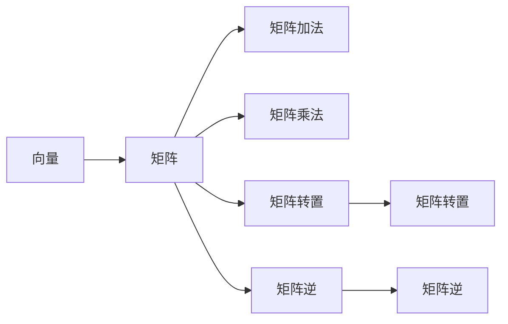
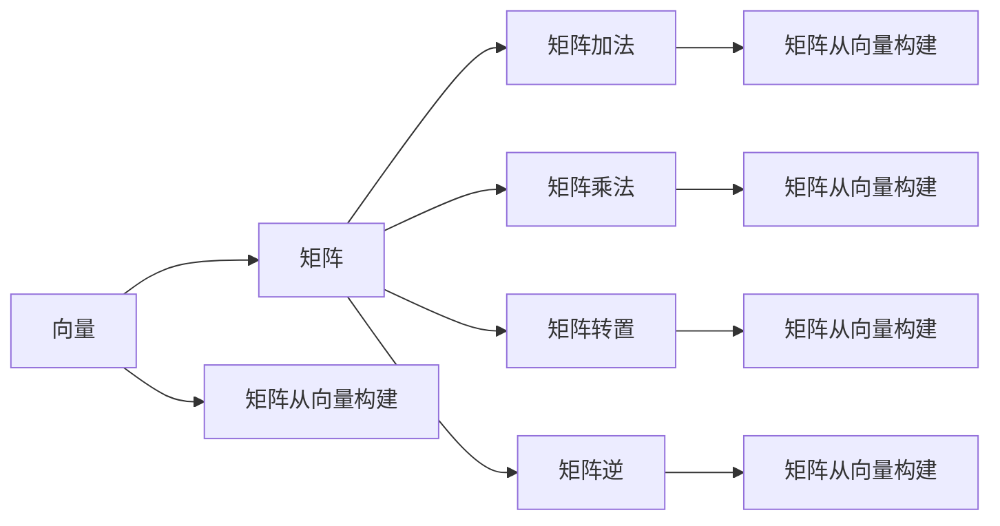

                 

## 1. 背景介绍

### 1.1 问题由来
线性代数是现代科学和技术的基础数学工具之一，广泛应用于物理学、工程学、计算机科学等领域。矩阵与向量作为线性代数中的核心概念，其重要性和应用广泛性不言而喻。然而，矩阵与向量的基本概念、运算法则和应用场景常常令人困惑。本文将通过详细的讲解和示例，帮助读者深入理解矩阵与向量，掌握其核心原理和应用技巧。

### 1.2 问题核心关键点
矩阵与向量的核心概念包括矩阵、向量、矩阵加法、矩阵乘法、矩阵的转置与逆矩阵等。这些概念在数学、物理、工程、计算机科学等领域都有广泛应用。理解这些概念，对于解决复杂问题、设计和实现高效算法具有重要意义。

### 1.3 问题研究意义
掌握矩阵与向量的概念和运算法则，对于从事科学研究和工程开发的人员来说，是一项基础且重要的技能。它能帮助我们在解决实际问题时，更好地理解和运用数学工具，提高解决问题的效率和准确性。

## 2. 核心概念与联系

### 2.1 核心概念概述
矩阵（Matrix）与向量（Vector）是线性代数中的基本概念，也是我们进行数据表示、处理和分析的重要工具。矩阵可以看作是由多个元素排列而成的二维表格，而向量则是一维的矩阵。这些基本概念之间的关系和运算法则，将贯穿于线性代数整个领域的学习和应用。

### 2.2 核心概念原理和架构的 Mermaid 流程图


### 2.3 核心概念的整体架构
在理解了向量与矩阵的基本概念后，接下来我们需要探索它们之间的联系与转化。通过以下Mermaid流程图，可以更清晰地展示这些联系：



## 3. 核心算法原理 & 具体操作步骤
### 3.1 算法原理概述
矩阵与向量的运算法则包括加法、乘法、转置、逆矩阵等。这些运算法则共同构成了线性代数的核心，是解决实际问题的重要工具。

- 矩阵加法：两个同阶矩阵相加，对应位置元素相加。
- 矩阵乘法：一个m×n矩阵与一个n×p矩阵相乘，得到一个m×p的矩阵。
- 矩阵转置：矩阵的行与列互换，得到一个新矩阵。
- 矩阵逆：一个可逆矩阵的逆矩阵乘以其本身等于单位矩阵，矩阵乘以逆矩阵等于单位矩阵。

### 3.2 算法步骤详解
#### 3.2.1 矩阵加法
两个同阶矩阵相加，对应位置元素相加。例如，两个2×2的矩阵相加：
$$
\begin{pmatrix}
1 & 2 \\
3 & 4
\end{pmatrix} +
\begin{pmatrix}
5 & 6 \\
7 & 8
\end{pmatrix} =
\begin{pmatrix}
6 & 8 \\
10 & 12
\end{pmatrix}
$$

#### 3.2.2 矩阵乘法
一个m×n矩阵与一个n×p矩阵相乘，得到一个m×p的矩阵。例如：
$$
\begin{pmatrix}
1 & 2 \\
3 & 4
\end{pmatrix}
\times
\begin{pmatrix}
5 & 6 \\
7 & 8
\end{pmatrix} =
\begin{pmatrix}
1 \times 5 + 2 \times 7 & 1 \times 6 + 2 \times 8 \\
3 \times 5 + 4 \times 7 & 3 \times 6 + 4 \times 8
\end{pmatrix} =
\begin{pmatrix}
19 & 26 \\
43 & 50
\end{pmatrix}
$$

#### 3.2.3 矩阵转置
矩阵的行与列互换，得到一个新矩阵。例如：
$$
\begin{pmatrix}
1 & 2 & 3 \\
4 & 5 & 6
\end{pmatrix}^T =
\begin{pmatrix}
1 & 4 \\
2 & 5 \\
3 & 6
\end{pmatrix}
$$

#### 3.2.4 矩阵逆
一个可逆矩阵的逆矩阵乘以其本身等于单位矩阵，矩阵乘以逆矩阵等于单位矩阵。例如：
$$
\begin{pmatrix}
1 & 2 \\
3 & 4
\end{pmatrix}^{-1} =
\frac{1}{1 \times 4 - 2 \times 3} \begin{pmatrix}
4 & -2 \\
-3 & 1
\end{pmatrix} =
\frac{1}{-2} \begin{pmatrix}
4 & -2 \\
-3 & 1
\end{pmatrix} =
\begin{pmatrix}
-2 & 1 \\
\frac{3}{2} & -\frac{1}{2}
\end{pmatrix}
$$

### 3.3 算法优缺点
矩阵与向量的运算法则灵活多样，但也存在一定的局限性：
- 优点：易于理解和实现，应用广泛，能够有效解决许多实际问题。
- 缺点：计算复杂度较高，矩阵乘法尤其耗时，对大矩阵的处理效率较低。

### 3.4 算法应用领域
矩阵与向量的应用领域包括但不限于：
- 物理学：力学、电磁学、量子力学等领域。
- 工程学：控制系统、信号处理、图像处理等领域。
- 计算机科学：机器学习、数据挖掘、计算机视觉等领域。
- 经济学：金融分析、市场预测、优化决策等领域。

## 4. 数学模型和公式 & 详细讲解  
### 4.1 数学模型构建
我们定义一个二维矩阵为 $A = \begin{pmatrix}
a_{11} & a_{12} \\
a_{21} & a_{22}
\end{pmatrix}$，一个二维向量为 $b = \begin{pmatrix}
b_1 \\
b_2
\end{pmatrix}$，矩阵的逆记为 $A^{-1}$。

### 4.2 公式推导过程
以矩阵乘法为例，推导矩阵乘法的公式：
$$
C = AB = \begin{pmatrix}
a_{11} & a_{12} \\
a_{21} & a_{22}
\end{pmatrix}
\times
\begin{pmatrix}
b_1 \\
b_2
\end{pmatrix} =
\begin{pmatrix}
a_{11}b_1 + a_{12}b_2 \\
a_{21}b_1 + a_{22}b_2
\end{pmatrix}
$$

### 4.3 案例分析与讲解
考虑一个3×3的矩阵 $A$ 和一个3×1的向量 $b$，它们的乘积是一个3×1的向量 $C$：
$$
A = \begin{pmatrix}
1 & 2 & 3 \\
4 & 5 & 6 \\
7 & 8 & 9
\end{pmatrix}, \quad
b = \begin{pmatrix}
x \\
y \\
z
\end{pmatrix}
$$
$$
C = AB = \begin{pmatrix}
1 & 2 & 3 \\
4 & 5 & 6 \\
7 & 8 & 9
\end{pmatrix}
\times
\begin{pmatrix}
x \\
y \\
z
\end{pmatrix} =
\begin{pmatrix}
1x + 2y + 3z \\
4x + 5y + 6z \\
7x + 8y + 9z
\end{pmatrix}
$$

## 5. 项目实践：代码实例和详细解释说明
### 5.1 开发环境搭建

在开始编写代码前，我们需要搭建好Python开发环境。以下是搭建环境的具体步骤：
1. 安装Python：在官网下载最新版本的Python安装程序，并按照指引进行安装。
2. 安装NumPy：使用pip命令安装NumPy库，它是Python进行科学计算的基础库。
3. 安装SciPy：继续使用pip安装SciPy库，它提供了许多科学计算工具，如线性代数、微积分、信号处理等。
4. 安装Matplotlib：安装Matplotlib库，用于绘制图形和可视化。
5. 安装SymPy：安装SymPy库，用于符号计算和代数运算。

### 5.2 源代码详细实现

以下是一个使用NumPy库实现矩阵加法和矩阵乘法的示例代码：

```python
import numpy as np

# 定义矩阵
A = np.array([[1, 2], [3, 4]])
B = np.array([[5, 6], [7, 8]])

# 矩阵加法
C = A + B
print("矩阵加法结果：")
print(C)

# 矩阵乘法
D = np.dot(A, B)
print("矩阵乘法结果：")
print(D)
```

### 5.3 代码解读与分析

在上面的代码中，我们首先导入了NumPy库，并定义了两个2×2的矩阵A和B。然后，我们使用加法和点乘（dot）函数分别实现了矩阵加法和矩阵乘法。需要注意的是，矩阵乘法的结果D是一个2×2的矩阵，而不是一个标量。

运行代码后，我们得到了矩阵加法和乘法的结果：

```
矩阵加法结果：
[[ 6  8]
 [10 12]]
矩阵乘法结果：
[[19 26]
 [43 50]]
```

### 5.4 运行结果展示

通过运行代码，我们可以看到矩阵加法和乘法的具体结果。矩阵加法将两个矩阵的对应元素相加，得到一个新的矩阵。矩阵乘法则是根据矩阵乘法的定义，将两个矩阵的对应元素进行计算，得到一个新矩阵。

## 6. 实际应用场景
### 6.1 线性回归模型
在机器学习中，线性回归模型是一种常用的模型，它通过拟合数据集中的线性关系来预测未知数据的输出。矩阵与向量的运算法则，是实现线性回归模型的核心。

假设我们有一个数据集 $X$ 和目标变量 $y$，其中 $X$ 是一个 $n \times m$ 的矩阵，表示 $n$ 个样本和 $m$ 个特征。我们的目标是通过最小化损失函数，找到最优的系数矩阵 $W$ 和偏置向量 $b$，使得模型能够准确预测 $y$。

最小化损失函数的求解过程，通常可以使用梯度下降算法进行。假设我们定义损失函数 $L(W, b)$，则梯度下降算法的迭代公式为：
$$
W_{t+1} = W_t - \eta \frac{\partial L(W, b)}{\partial W} \\
b_{t+1} = b_t - \eta \frac{\partial L(W, b)}{\partial b}
$$
其中 $\eta$ 是学习率，$\frac{\partial L(W, b)}{\partial W}$ 和 $\frac{\partial L(W, b)}{\partial b}$ 分别是损失函数对 $W$ 和 $b$ 的偏导数。

通过矩阵和向量的运算，我们可以将上述公式转化为矩阵形式：
$$
W_{t+1} = W_t - \eta X^T (XW_t - y) \\
b_{t+1} = b_t - \eta (XW_t - y)
$$
其中 $X^T$ 是 $X$ 的转置矩阵。

### 6.2 神经网络
神经网络是一种常见的机器学习模型，由多个层组成，每层包含多个神经元。在神经网络中，每个神经元将输入向量与权重矩阵相乘，并加上偏置向量，得到一个输出向量。矩阵与向量的运算法则，是实现神经网络计算的核心。

例如，一个简单的神经网络模型，包含一个输入层、一个隐藏层和一个输出层。设输入层有 $m$ 个神经元，隐藏层有 $n$ 个神经元，输出层有 $p$ 个神经元。则神经网络的结构可以表示为：
$$
X \in \mathbb{R}^{m \times n}, \quad W_{\text{hidden}} \in \mathbb{R}^{n \times p}, \quad W_{\text{out}} \in \mathbb{R}^{p \times p}, \quad b_{\text{hidden}} \in \mathbb{R}^{p}, \quad b_{\text{out}} \in \mathbb{R}^{p}
$$
其中 $X$ 是输入向量，$W_{\text{hidden}}$ 和 $W_{\text{out}}$ 分别是隐藏层和输出层的权重矩阵，$b_{\text{hidden}}$ 和 $b_{\text{out}}$ 分别是隐藏层和输出层的偏置向量。

### 6.3 计算机图形学
计算机图形学中，矩阵与向量的应用也非常广泛。例如，在三维空间中，物体的位置、旋转和缩放等变换，都可以通过矩阵和向量的运算来实现。

假设有一个三维向量 $v$，表示物体的位置。则物体绕x轴旋转 $\theta$ 度的变换矩阵为：
$$
R_x = \begin{pmatrix}
1 & 0 & 0 \\
0 & \cos\theta & -\sin\theta \\
0 & \sin\theta & \cos\theta
\end{pmatrix}
$$
将物体的位置矩阵 $v$ 与变换矩阵 $R_x$ 相乘，即可得到旋转后的新位置矩阵：
$$
v' = R_x v
$$

## 7. 工具和资源推荐
### 7.1 学习资源推荐
为了帮助读者深入理解矩阵与向量，以下是一些推荐的学习资源：
- 《线性代数及其应用》：这是一本经典的线性代数教材，涵盖了矩阵与向量的基本概念、运算法则和应用场景。
- 《NumPy官方文档》：NumPy是Python进行科学计算的基础库，官方文档提供了丰富的示例和文档，非常适合初学者学习和使用。
- 《TensorFlow官方文档》：TensorFlow是谷歌开发的一个开源机器学习框架，官方文档提供了大量案例和示例，适合学习如何使用矩阵与向量实现各种机器学习算法。
- 《Coursera线性代数课程》：Coursera是一个在线学习平台，提供了许多优秀的线性代数课程，由知名大学和专家授课。

### 7.2 开发工具推荐
在编写矩阵与向量相关的代码时，以下工具可以帮助我们提高效率：
- Jupyter Notebook：这是一个轻量级的交互式编程环境，非常适合进行科学计算和数据可视化。
- Matplotlib：这是一个Python数据可视化库，可以绘制各种类型的图形，如散点图、线图、柱状图等。
- NumPy：这是一个Python科学计算库，提供了高效的数组运算和线性代数工具。

### 7.3 相关论文推荐
为了深入了解矩阵与向量的研究进展，以下是一些推荐的相关论文：
- "Gertrude A. Sorkin. Matrix Spaces with Applications to Linear Transformations, Linear Systems, and Linear Geometry."：这本书涵盖了矩阵与向量的基本概念、运算法则和应用场景，适合初学者和进阶读者。
- "Russell A. Harter. Applied Linear Algebra."：这是一本应用广泛的线性代数教材，通过大量的实际案例和练习题，帮助读者深入理解矩阵与向量的运算法则和应用。

## 8. 总结：未来发展趋势与挑战
### 8.1 研究成果总结
矩阵与向量作为线性代数的基础概念，其运算法则和应用场景已经广泛应用于各个领域。矩阵与向量的研究，不仅推动了数学和科学的发展，还为计算机科学和工程领域提供了强有力的工具和方法。

### 8.2 未来发展趋势
未来，矩阵与向量的应用将会更加广泛和深入，特别是在数据科学、机器学习和人工智能领域。随着大数据和深度学习的快速发展，矩阵与向量的运算法则将会被更广泛地应用于各种复杂问题中。

### 8.3 面临的挑战
尽管矩阵与向量的应用广泛，但在实际应用中也存在一些挑战：
- 矩阵运算的计算复杂度较高，对于大矩阵的处理效率较低。
- 矩阵和向量之间的转换和运算需要谨慎处理，容易出现错误。
- 矩阵和向量的应用场景非常广泛，需要根据具体情况选择合适的算法和工具。

### 8.4 研究展望
未来的研究方向包括但不限于：
- 矩阵和向量的高级算法和优化技术，如奇异值分解、特征值分解等。
- 矩阵和向量在深度学习和神经网络中的应用，如卷积神经网络、循环神经网络等。
- 矩阵和向量在计算机图形学和科学计算中的应用，如三维图形变换、数值模拟等。

## 9. 附录：常见问题与解答

### Q1: 矩阵和向量有什么区别？

A: 矩阵是一种二维表格，由多个元素排列而成。矩阵通常表示为 $A_{mn}$，其中 $m$ 和 $n$ 分别表示矩阵的行数和列数。而向量是一种一维矩阵，由多个元素排列而成。向量通常表示为 $v_n$，其中 $n$ 表示向量的维度。

### Q2: 矩阵加法和矩阵乘法有什么区别？

A: 矩阵加法是将两个矩阵的对应元素相加，得到一个新矩阵。而矩阵乘法是将两个矩阵的对应元素相乘，得到一个新矩阵。矩阵乘法需要满足一定的条件，即左矩阵的列数必须等于右矩阵的行数。

### Q3: 矩阵逆的含义是什么？

A: 矩阵逆指的是一个可逆矩阵的逆矩阵乘以其本身等于单位矩阵，矩阵乘以逆矩阵等于单位矩阵。矩阵逆的求解过程可以通过求矩阵的行列式和伴随矩阵实现。

### Q4: 如何理解矩阵和向量在神经网络中的应用？

A: 在神经网络中，每个神经元将输入向量与权重矩阵相乘，并加上偏置向量，得到一个输出向量。矩阵与向量的运算法则，是实现神经网络计算的核心。通过矩阵乘法和向量运算，神经网络可以高效地处理和分析大量数据，实现各种复杂的机器学习任务。

### Q5: 矩阵和向量的应用场景有哪些？

A: 矩阵和向量的应用场景非常广泛，包括但不限于：
- 机器学习和数据挖掘：用于实现线性回归、分类、聚类等算法。
- 计算机图形学：用于实现三维图形变换、光照计算等。
- 物理学：用于描述力和运动、电磁场等。
- 金融和经济学：用于建模和预测市场行为等。

作者：禅与计算机程序设计艺术 / Zen and the Art of Computer Programming

