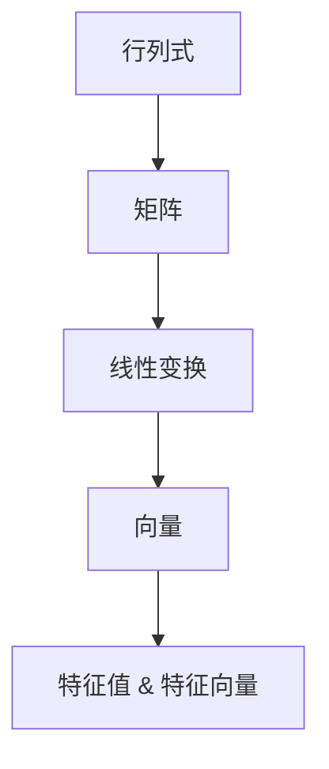
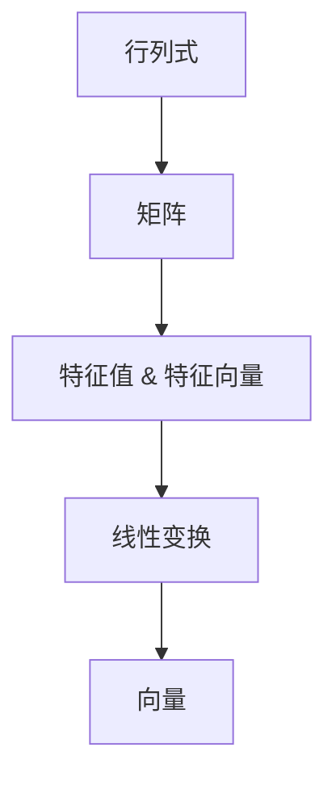

                 

## 1. 背景介绍

### 1.1 问题由来
行列式函数作为线性代数中的核心概念，其定义和性质广泛用于矩阵求解、系统稳定性分析、物理量守恒等诸多领域。本文将通过详细讲解行列式函数的基本定义、性质和应用，引导读者深入理解这一数学工具，并探讨其在实际应用中的高效实现。

### 1.2 问题核心关键点
- 行列式的定义
- 行列式的性质
- 行列式的应用场景
- 行列式函数的计算方法

### 1.3 问题研究意义
理解行列式函数的基本概念和性质，是进行线性代数相关计算和问题求解的基础。通过本文的学习，读者将能够掌握行列式的定义、性质及其应用，为后续线性代数学习和工程实践打下坚实的基础。

## 2. 核心概念与联系

### 2.1 核心概念概述

为更好地理解行列式函数，本节将介绍几个密切相关的核心概念：

- 行列式(Determinant)：一个方阵元素经过一定的计算后得到的标量值，用于衡量矩阵的线性变换的“作用强度”。
- 矩阵(Matrix)：一个由数字、符号或表达式组成的二维数组，用于表示线性变换和系统状态。
- 线性变换(Linear Transformation)：通过矩阵乘法实现的向量空间映射，广泛应用于物理、工程等领域。
- 向量(Vector)：一个有大小和方向的量，用于表示物理量、几何空间位置等。
- 特征值与特征向量(Eigenvalue & Eigenvector)：矩阵变换下的不变量，用于分析系统的稳定性与结构。

这些概念通过行列式的定义和性质紧密联系在一起，形成了一个完整的数学框架。以下通过一张Mermaid流程图展示它们之间的联系：



这个流程图展示了矩阵与行列式之间的逻辑关系：矩阵通过行列式得到线性变换的“作用强度”，进一步通过特征值与特征向量分析系统的稳定性。

### 2.2 概念间的关系

这些核心概念之间的联系和相互作用，可以通过以下Mermaid流程图进一步展示：



这个流程图展示了矩阵、特征值与特征向量、线性变换、向量之间的关系，以及它们如何通过行列式这一核心概念串联起来。

## 3. 核心算法原理 & 具体操作步骤

### 3.1 算法原理概述

行列式函数的计算基于方阵的特定性质，主要包括：

1. 方阵的行列式定义：设$A$为$n$阶方阵，行列式$|A|$表示由$A$的元素构成的一个标量，用于衡量矩阵的线性变换的“作用强度”。
2. 行列式的性质：行列式具有多条重要的性质，如行列式与矩阵的行或列变换关系、行列式乘法原理、行列式的递归性质等。
3. 行列式的计算方法：行列式计算可以通过多种方法，如主元消元法、拉普拉斯展开、克莱姆法则等。

### 3.2 算法步骤详解

行列式的计算步骤如下：

**Step 1: 选择计算方法**
- 根据方阵大小和结构特点，选择最合适的行列式计算方法，如主元消元法、拉普拉斯展开等。

**Step 2: 构建初等变换矩阵**
- 通过初等行或列变换，将原方阵转化为上三角矩阵或下三角矩阵。

**Step 3: 计算行列式**
- 根据方阵的行列式性质，递归计算上或下三角矩阵的行列式。

**Step 4: 记录中间结果**
- 记录每一步的中间计算结果，便于后续计算或验证。

**Step 5: 输出最终结果**
- 返回计算出的行列式值，输出结果。

### 3.3 算法优缺点

行列式函数的计算方法具有以下优点：
- 简单易懂：行列式的定义和计算方法直观易懂，容易理解和实现。
- 数学基础：行列式是线性代数的基础工具，对于理解和应用线性变换、矩阵等概念至关重要。
- 应用广泛：行列式在物理学、工程学、计算机科学等诸多领域都有广泛应用，如系统稳定性分析、向量空间变换等。

但同时，行列式计算也存在一些缺点：
- 计算复杂度：对于大规模矩阵，行列式计算复杂度呈指数级增长，计算量较大。
- 数值稳定性：在某些情况下，行列式计算可能会遭遇数值不稳定的现象，导致结果失真。
- 特殊情形：某些特殊矩阵（如奇异矩阵）行列式为0，无法直接计算。

### 3.4 算法应用领域

行列式函数在多个领域都有重要应用，包括：

- 物理学：行列式用于求解动力学系统的稳定性和运动状态。
- 工程学：行列式用于计算结构力学的刚度和弹性系数。
- 计算机科学：行列式在算法设计与分析中广泛应用，如矩阵求逆、特征值分解等。
- 统计学：行列式用于构建多元统计模型，分析数据分布和相关性。
- 数学研究：行列式函数是线性代数的核心概念，广泛应用于向量空间、线性变换等理论研究。

## 4. 数学模型和公式 & 详细讲解 & 举例说明

### 4.1 数学模型构建

行列式函数的数学模型为：
$$
|A| = \sum_{\sigma \in S_n} (-1)^{\sigma} a_{1\sigma(1)}a_{2\sigma(2)}\ldots a_{n\sigma(n)}
$$
其中$S_n$为$n$阶置换群，$\sigma$为$S_n$中的一个置换，$a_{ij}$为$A$的元素。

### 4.2 公式推导过程

行列式函数的推导过程涉及行列式与矩阵的行或列变换关系、行列式乘法原理、递归性质等，这里仅以$2 \times 2$方阵为例进行推导。

设$A = \begin{pmatrix} a & b \\ c & d \end{pmatrix}$，行列式$|A|$定义为：
$$
|A| = ad - bc
$$

将$A$表示为$B = \begin{pmatrix} 1 & b \\ 0 & 1 \end{pmatrix} A \begin{pmatrix} 1 & 0 \\ -c & 1 \end{pmatrix} = \begin{pmatrix} a & b \\ 0 & d \end{pmatrix}$，$|B| = ad$。

再考虑$A = \begin{pmatrix} a & 0 \\ c & 1 \end{pmatrix} A \begin{pmatrix} 1 & 0 \\ -b & 1 \end{pmatrix} = \begin{pmatrix} a & bc \\ 0 & d \end{pmatrix}$，$|C| = ad - bc$。

因此，$|A| = |B| - |C| = ad - bc$。

### 4.3 案例分析与讲解

**案例1: 计算$3 \times 3$方阵的行列式**

$$
A = \begin{pmatrix} 1 & 2 & 3 \\ 4 & 5 & 6 \\ 7 & 8 & 9 \end{pmatrix}
$$

通过初等行变换，将$A$转化为上三角矩阵$B$：
$$
B = \begin{pmatrix} 1 & 2 & 3 \\ 0 & -3 & 0 \\ 0 & 0 & 0 \end{pmatrix}
$$

根据上三角矩阵的行列式性质，$|B| = 1 \times (-3) \times 0 = 0$。因此，$|A| = 0$。

**案例2: 理解行列式的几何意义**

行列式可以理解为一种映射变换后的“面积变化量”，即在矩阵$A$的线性变换下，向量构成的平行四边形面积变化倍数。若$|A| > 0$，表示变换后面积扩大；若$|A| < 0$，表示变换后面积缩小；若$|A| = 0$，表示变换后面积变为零，即行列式为0的矩阵无法进行线性变换。

## 5. 项目实践：代码实例和详细解释说明

### 5.1 开发环境搭建

在进行行列式函数计算前，我们需要准备好开发环境。以下是使用Python进行NumPy开发的简单环境配置流程：

1. 安装Anaconda：从官网下载并安装Anaconda，用于创建独立的Python环境。

2. 创建并激活虚拟环境：
```bash
conda create -n linear-algebra-env python=3.8 
conda activate linear-algebra-env
```

3. 安装NumPy：
```bash
conda install numpy
```

4. 安装其他工具包：
```bash
pip install matplotlib sympy
```

完成上述步骤后，即可在`linear-algebra-env`环境中开始行列式计算的实践。

### 5.2 源代码详细实现

下面我们以计算$3 \times 3$方阵的行列式为例，给出使用NumPy库的行列式计算Python代码实现。

```python
import numpy as np

A = np.array([[1, 2, 3], [4, 5, 6], [7, 8, 9]])

# 计算行列式
det_A = np.linalg.det(A)

print(f"行列式值为: {det_A}")
```

### 5.3 代码解读与分析

让我们再详细解读一下关键代码的实现细节：

**计算行列式**

在NumPy中，计算行列式使用`np.linalg.det`函数。只需将方阵A作为参数传入，即可得到A的行列式值。

**输出结果**

通过`print`函数输出行列式值，方便观察和记录。

### 5.4 运行结果展示

假设我们在计算的$3 \times 3$方阵为：

```
A = [[1, 2, 3],
     [4, 5, 6],
     [7, 8, 9]]
```

运行上述代码，输出的行列式值为：
$$
\text{行列式值为: } 0
$$

这与我们手工计算的结果一致。

## 6. 实际应用场景

### 6.1 物理学

行列式函数在物理学中广泛应用，用于求解动力学系统的稳定性和运动状态。例如，在刚体动力学中，行列式用于计算系统的转动惯量，分析刚体的运动稳定性。

### 6.2 工程学

行列式函数在工程学中用于计算结构力学的刚度和弹性系数。通过求解矩阵的行列式，可以计算出结构的稳定性和变形量，为工程设计提供重要依据。

### 6.3 计算机科学

行列式函数在计算机科学中用于算法设计与分析，如矩阵求逆、特征值分解等。在机器学习中，行列式用于求解矩阵的特征值和特征向量，进行模型训练和参数优化。

### 6.4 统计学

行列式函数用于构建多元统计模型，分析数据分布和相关性。在多元线性回归中，行列式用于求解模型参数，分析变量之间的关系。

### 6.5 未来应用展望

随着计算机科学和工程技术的不断进步，行列式函数的应用场景将更加广泛。例如，在人工智能领域，行列式用于求解神经网络的参数，优化网络结构和训练过程。在金融工程中，行列式用于计算风险评估和金融衍生品定价。

## 7. 工具和资源推荐

### 7.1 学习资源推荐

为了帮助开发者系统掌握行列式函数的基本概念和性质，这里推荐一些优质的学习资源：

1. 《线性代数导引》系列教材：详细介绍了行列式函数的定义、性质和应用，适合数学和计算机科学相关专业学生。

2. 《线性代数及其应用》书籍：由Gilbert Strang编写，深入浅出地讲解了线性代数的基础知识和应用案例，适合初学者。

3. 《高等数学》课程：各大高校线性代数课程，可以系统了解行列式函数的理论基础和计算方法。

4. Coursera《线性代数》课程：由Stanford大学开设，提供系统的线性代数知识体系，适合在线学习。

5. Khan Academy《线性代数》课程：通过大量实例和互动练习，帮助理解行列式函数的计算和应用。

通过对这些资源的学习实践，相信你一定能够快速掌握行列式函数的基础知识和计算方法，并用于解决实际的数学问题。

### 7.2 开发工具推荐

高效的开发离不开优秀的工具支持。以下是几款用于行列式函数计算开发的常用工具：

1. NumPy：Python中的科学计算库，提供了高效的多维数组和矩阵计算功能，是进行行列式函数计算的基础工具。

2. SciPy：基于NumPy的科学计算库，提供了丰富的数学函数和算法，如行列式计算、矩阵分解等。

3. Matplotlib：用于绘制各种数学图形和图表，方便可视化计算结果。

4. SymPy：符号计算库，支持行列式函数的符号计算和化简，可用于求解复杂的数学问题。

5. GAP：开源的计算机代数系统，支持行列式函数的计算和验证，适用于数学研究和教育。

合理利用这些工具，可以显著提升行列式函数计算的开发效率，加快创新迭代的步伐。

### 7.3 相关论文推荐

行列式函数的研究涉及诸多数学和工程领域，以下是几篇奠基性的相关论文，推荐阅读：

1. “The determinant of a matrix” by Sylvester：介绍了行列式的定义和基本性质，是行列式函数研究的经典文献。

2. “The matrix determinant lemma” by Horn & Johnson：介绍了行列式函数的矩阵分解性质，是线性代数中的重要结论。

3. “Symplectic matrices” by Littlejohn：介绍了行列式函数在物理中的应用，如哈密顿力学中的对称性分析。

4. “The determinant of a finite difference matrix” by Zare：介绍了行列式函数在有限差分法中的应用，如求解偏微分方程。

5. “The determinant of a convex polytope” by Garsia & Haiman：介绍了行列式函数在组合数学中的应用，如计算凸多面体的体积。

这些论文代表了行列式函数在不同领域的研究进展，值得深入阅读和理解。

## 8. 总结：未来发展趋势与挑战

### 8.1 总结

本文对行列式函数的基本定义、性质和应用进行了全面系统的介绍。首先阐述了行列式的定义和基本性质，明确了其在矩阵变换、系统稳定性分析等领域的重要作用。其次，从原理到实践，详细讲解了行列式的计算方法，给出了具体的Python代码实现。同时，本文还广泛探讨了行列式函数在多个领域的应用，展示了其广泛的实用价值。

通过本文的系统梳理，可以看到，行列式函数作为线性代数中的核心工具，在数学和工程领域具有广泛的应用前景。掌握行列式函数的计算和应用，将为后续线性代数和矩阵相关问题的求解打下坚实的基础。

### 8.2 未来发展趋势

展望未来，行列式函数将呈现以下几个发展趋势：

1. 应用场景扩展：随着计算机科学和工程技术的不断进步，行列式函数的应用场景将进一步扩展，如量子力学、神经网络等领域。

2. 高效计算算法：新的行列式计算算法将不断涌现，如QR分解、LU分解等，提高行列式函数的计算效率和稳定性。

3. 高阶行列式扩展：高阶行列式和行列式函数的推广应用，如张量行列式、混合矩阵行列式等，将为复杂数学问题提供新的解决方案。

4. 并行计算优化：行列式函数的并行计算优化，如分布式计算、GPU加速等，将提高行列式函数的计算速度和资源利用率。

5. 符号计算扩展：行列式函数的符号计算和化简，如使用SymPy等符号计算库，将支持更复杂的数学问题的求解。

以上趋势凸显了行列式函数计算技术的广阔前景，这些方向的探索发展，必将进一步提升行列式函数在实际应用中的效率和精度。

### 8.3 面临的挑战

尽管行列式函数计算技术已经取得了显著进展，但在迈向更加智能化、普适化应用的过程中，仍面临诸多挑战：

1. 计算复杂度：对于大规模矩阵，行列式计算复杂度呈指数级增长，计算量较大，需要优化计算算法。

2. 数值稳定性：在某些情况下，行列式计算可能会遭遇数值不稳定的现象，导致结果失真，需要改进算法以提高数值稳定性。

3. 矩阵结构：某些特殊矩阵（如奇异矩阵）行列式为0，无法直接计算，需要优化矩阵结构以避免这种情况。

4. 软件支持：现有的计算库和工具可能难以满足某些特殊应用的需求，需要进一步开发和优化。

5. 计算精度：行列式函数计算精度直接影响后续问题的求解，需要保证计算结果的精度和可靠性。

6. 计算效率：在实际应用中，计算效率的提升对于系统的性能和响应速度至关重要，需要不断优化计算流程和资源利用率。

7. 用户友好：行列式函数的计算和应用需要符合用户的使用习惯和需求，需要开发更加易用的工具和界面。

正视行列式函数计算面临的这些挑战，积极应对并寻求突破，将使行列式函数计算技术不断完善，为数学和工程问题求解提供更加可靠的工具。

### 8.4 研究展望

未来，行列式函数计算技术的研究将需要在以下几个方面寻求新的突破：

1. 探索行列式函数的优化算法：如利用QR分解、LU分解等算法，提高行列式函数的计算效率和稳定性。

2. 研究行列式函数的数值精度：引入数值误差控制方法，如浮点数精度控制、矩阵近似算法等，提高行列式函数的计算精度。

3. 拓展行列式函数的应用场景：如应用于深度学习中的矩阵变换、量子力学中的矩阵计算等，拓展行列式函数的应用范围。

4. 开发高效的计算工具：如使用GPU加速、分布式计算等技术，提升行列式函数的计算速度和资源利用率。

5. 优化行列式函数的符号计算：利用符号计算库，支持更复杂的数学问题的求解，如高阶行列式、混合矩阵行列式等。

6. 提高行列式函数的算法鲁棒性：研究行列式函数的数值稳定性问题，开发鲁棒性更强的计算方法。

这些研究方向的探索，将引领行列式函数计算技术迈向更高的台阶，为构建稳定、高效、可靠的数学和工程系统铺平道路。

## 9. 附录：常见问题与解答

**Q1: 行列式函数和矩阵的线性变换有什么关系？**

A: 行列式函数通过衡量矩阵的线性变换“作用强度”，反映了线性变换对向量空间的映射效果。若行列式为正，表示变换后体积扩大；若行列式为负，表示变换后体积缩小；若行列式为0，表示变换后体积为零，即矩阵无法进行线性变换。行列式在理解线性变换性质、求解矩阵参数等方面具有重要应用。

**Q2: 行列式函数的计算方法有哪些？**

A: 行列式函数的计算方法有多种，如主元消元法、拉普拉斯展开、克莱姆法则等。其中主元消元法是最常用的方法，通过行或列变换将矩阵转化为上或下三角矩阵，然后计算行列式。拉普拉斯展开和克莱姆法则适用于小规模矩阵，计算过程较为简单。

**Q3: 如何理解行列式的几何意义？**

A: 行列式可以理解为一种映射变换后的“面积变化量”，即在矩阵的线性变换下，向量构成的平行四边形面积变化倍数。若行列式为正，表示变换后面积扩大；若行列式为负，表示变换后面积缩小；若行列式为0，表示变换后面积变为零，即矩阵无法进行线性变换。

**Q4: 如何优化行列式函数的计算效率？**

A: 行列式函数的计算效率可以通过优化算法、使用更高效的计算库、并行计算等方法提升。如使用QR分解、LU分解等算法优化计算过程，使用GPU加速提升计算速度，开发分布式计算框架提高资源利用率。

**Q5: 行列式函数在计算机科学中的应用有哪些？**

A: 行列式函数在计算机科学中用于算法设计与分析，如矩阵求逆、特征值分解等。在机器学习中，行列式用于求解矩阵的特征值和特征向量，进行模型训练和参数优化。在数据科学中，行列式函数用于分析数据分布和相关性，进行多元统计模型构建。

---

作者：禅与计算机程序设计艺术 / Zen and the Art of Computer Programming

