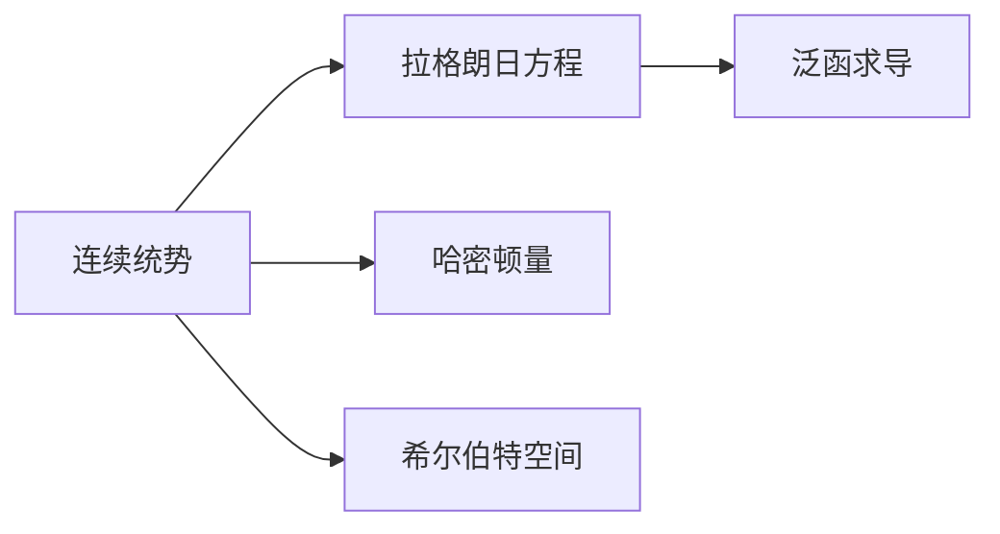

                 

# 线性代数导引：连续统势

## 1. 背景介绍

线性代数作为数学中的一个重要分支，广泛应用于物理学、工程学、计算机科学等众多领域。然而，在实际应用中，传统的线性代数理论往往只考虑有限维度的向量空间，难以刻画无限维度的物理系统。因此，本文旨在引介一种更加广泛的线性代数理论——连续统势，以期在更广泛的应用场景中得到应用。

## 2. 核心概念与联系

### 2.1 核心概念概述

- **连续统势**：一种能够处理无限维向量空间的概念，主要用于描述无限维物理系统，如量子力学中的波函数。
- **拉格朗日方程**：一个用于求解物理系统动态演化的数学工具，常用于量子力学中波函数的演化。
- **哈密顿量**：拉格朗日方程的势能部分，描述物理系统的总能量。
- **泛函求导**：一种高级的微分运算，常用于连续统势的求解中。
- **希尔伯特空间**：一种可以容纳无限维向量的向量空间，是连续统势和泛函分析的基础。

这些核心概念之间的关系可以通过以下Mermaid流程图来展示：



### 2.2 概念间的关系

这些核心概念之间的关系可以进一步细化如下：

- **连续统势**与**拉格朗日方程**的关系：拉格朗日方程是连续统势的动力学基础，用于求解物理系统在无限维空间中的动态演化。
- **哈密顿量**与**连续统势**的关系：哈密顿量是拉格朗日方程的一个特例，描述系统的总能量，是连续统势中的重要组成部分。
- **泛函求导**与**连续统势**的关系：泛函求导是求解连续统势的关键技术，用于求解无穷维空间的泛函极值问题。
- **希尔伯特空间**与**连续统势**的关系：希尔伯特空间为连续统势提供了数学基础，使其能够处理无限维向量空间中的问题。

这些概念通过数学和物理手段互相连接，构成了描述和求解无限维物理系统的基本框架。

## 3. 核心算法原理 & 具体操作步骤

### 3.1 算法原理概述

连续统势的求解过程主要涉及泛函求导和希尔伯特空间的计算。具体步骤如下：

1. **定义泛函**：在希尔伯特空间中定义一个泛函，表示系统的某个物理量。
2. **泛函求导**：对泛函进行一阶和二阶泛函求导，得到泛函的一阶导数和二阶导数。
3. **求解拉格朗日方程**：将一阶导数和二阶导数代入拉格朗日方程，得到系统的运动方程。
4. **求解哈密顿量**：将拉格朗日方程的解代入哈密顿量中，得到系统的总能量。

### 3.2 算法步骤详解

**步骤1：定义泛函**

假设一个连续统势的泛函为 $F[\phi]$，其中 $\phi$ 是一个无限维的希尔伯特空间中的元素。

$$
F[\phi] = \int_{\mathcal{H}} f(\phi,\partial_{x}\phi) dx
$$

其中 $\mathcal{H}$ 表示希尔伯特空间，$f(\phi,\partial_{x}\phi)$ 是一个关于 $\phi$ 和其导数 $\partial_{x}\phi$ 的函数。

**步骤2：泛函求导**

对泛函 $F[\phi]$ 进行一阶和二阶泛函求导，得到泛函的一阶导数 $F'[\phi]$ 和二阶导数 $F''[\phi]$。

$$
F'[\phi] = \frac{\delta F[\phi]}{\delta \phi}
$$

$$
F''[\phi] = \frac{\delta^2 F[\phi]}{\delta \phi^2}
$$

其中 $\delta$ 表示变分操作。

**步骤3：求解拉格朗日方程**

将一阶导数 $F'[\phi]$ 和二阶导数 $F''[\phi]$ 代入拉格朗日方程 $L(\phi,\partial_{x}\phi) = F'[\phi]$，得到系统的运动方程。

$$
L(\phi,\partial_{x}\phi) = F'[\phi]
$$

**步骤4：求解哈密顿量**

将拉格朗日方程的解代入哈密顿量 $H(\phi,\partial_{x}\phi) = \partial_{x}L(\phi,\partial_{x}\phi)$，得到系统的总能量。

$$
H(\phi,\partial_{x}\phi) = \partial_{x}L(\phi,\partial_{x}\phi)
$$

### 3.3 算法优缺点

**优点**：

- **处理无限维问题**：连续统势能够处理无限维的物理系统，突破了传统线性代数的有限维限制。
- **理论完备**：基于拉格朗日方程和哈密顿量，连续统势提供了一套完整的物理系统描述和求解框架。

**缺点**：

- **计算复杂度高**：泛函求导和希尔伯特空间的计算复杂度高，对计算资源要求较高。
- **解析求解困难**：连续统势的求解过程往往需要复杂的数学工具，解析求解困难。

### 3.4 算法应用领域

连续统势在以下几个领域有广泛的应用：

- **量子力学**：用于描述波函数及其演化过程，是量子力学的基础。
- **经典力学**：用于描述无限维物理系统的运动规律，如流体动力学。
- **统计物理**：用于描述系统的统计性质和相变过程，如均一涨落理论和临界现象。
- **数学分析**：用于研究无限维空间的泛函极值问题，如Sobolev空间和Schrödinger方程。

## 4. 数学模型和公式 & 详细讲解  
### 4.1 数学模型构建

连续统势的数学模型主要建立在希尔伯特空间和泛函分析的基础上。假设一个无限维的希尔伯特空间 $\mathcal{H}$，其中的元素表示为 $\phi$。

**希尔伯特空间**：

$$
\mathcal{H} = \left\{ \phi \middle| \|\phi\|^2 = \langle \phi, \phi \rangle < \infty \right\}
$$

其中 $\langle \cdot, \cdot \rangle$ 表示内积运算。

**泛函**：

$$
F[\phi] = \int_{\mathcal{H}} f(\phi,\partial_{x}\phi) dx
$$

其中 $f(\phi,\partial_{x}\phi)$ 是一个关于 $\phi$ 和其导数 $\partial_{x}\phi$ 的函数。

**泛函求导**：

$$
F'[\phi] = \frac{\delta F[\phi]}{\delta \phi}
$$

**拉格朗日方程**：

$$
L(\phi,\partial_{x}\phi) = F'[\phi]
$$

**哈密顿量**：

$$
H(\phi,\partial_{x}\phi) = \partial_{x}L(\phi,\partial_{x}\phi)
$$

### 4.2 公式推导过程

**一阶泛函求导**：

假设 $F[\phi]$ 为连续统势的泛函，对 $\phi$ 进行一阶泛函求导，得到一阶导数 $F'[\phi]$。

$$
F'[\phi] = \frac{\delta F[\phi]}{\delta \phi} = \frac{\delta}{\delta \phi} \int_{\mathcal{H}} f(\phi,\partial_{x}\phi) dx
$$

根据变分运算的性质，得到：

$$
F'[\phi] = \int_{\mathcal{H}} \frac{\delta f}{\delta \phi} dx
$$

**二阶泛函求导**：

对 $F'[\phi]$ 进行二阶泛函求导，得到二阶导数 $F''[\phi]$。

$$
F''[\phi] = \frac{\delta^2 F[\phi]}{\delta \phi^2} = \frac{\delta}{\delta \phi} \int_{\mathcal{H}} \frac{\delta f}{\delta \phi} dx
$$

根据变分运算的性质，得到：

$$
F''[\phi] = \int_{\mathcal{H}} \frac{\delta^2 f}{\delta \phi^2} dx
$$

**拉格朗日方程**：

将 $F'[\phi]$ 代入拉格朗日方程，得到系统的运动方程。

$$
L(\phi,\partial_{x}\phi) = F'[\phi]
$$

**哈密顿量**：

将 $L(\phi,\partial_{x}\phi)$ 代入哈密顿量，得到系统的总能量。

$$
H(\phi,\partial_{x}\phi) = \partial_{x}L(\phi,\partial_{x}\phi)
$$

### 4.3 案例分析与讲解

假设一个无限维的物理系统，其拉格朗日量为 $L(\phi,\partial_{x}\phi) = \frac{1}{2}\|\partial_{x}\phi\|^2 - V(\phi)$，其中 $V(\phi)$ 为系统的势能。

**一阶泛函求导**：

$$
F'[\phi] = \frac{\delta}{\delta \phi} \int_{\mathcal{H}} \left(\frac{1}{2}\|\partial_{x}\phi\|^2 - V(\phi)\right) dx
$$

根据变分运算的性质，得到：

$$
F'[\phi] = \int_{\mathcal{H}} \left(\partial_{x}\phi\right) dx
$$

**二阶泛函求导**：

$$
F''[\phi] = \frac{\delta}{\delta \phi} \int_{\mathcal{H}} \left(\partial_{x}\phi\right) dx
$$

根据变分运算的性质，得到：

$$
F''[\phi] = \int_{\mathcal{H}} 0 dx
$$

**拉格朗日方程**：

$$
L(\phi,\partial_{x}\phi) = \frac{1}{2}\|\partial_{x}\phi\|^2 - V(\phi)
$$

**哈密顿量**：

$$
H(\phi,\partial_{x}\phi) = \partial_{x}L(\phi,\partial_{x}\phi) = \partial_{x}\left(\frac{1}{2}\|\partial_{x}\phi\|^2 - V(\phi)\right)
$$

## 5. 项目实践：代码实例和详细解释说明
### 5.1 开发环境搭建

在进行连续统势的计算前，需要先搭建好开发环境。以下是Python环境搭建的详细步骤：

1. 安装Anaconda：从官网下载并安装Anaconda，用于创建独立的Python环境。

2. 创建并激活虚拟环境：
```bash
conda create -n lin_alg_env python=3.8 
conda activate lin_alg_env
```

3. 安装必要的库：
```bash
pip install numpy scipy sympy sympy-1.1.0
```

4. 安装Matplotlib和SciPy库，用于绘图和科学计算。

5. 安装SymPy库，用于符号计算。

完成上述步骤后，即可在`lin_alg_env`环境中进行连续统势的计算。

### 5.2 源代码详细实现

以下是使用SymPy库进行连续统势计算的Python代码实现：

```python
from sympy import symbols, Function, integrate, diff

# 定义符号变量
x, t = symbols('x t')

# 定义泛函F
def F(phi):
    return integrate(f(phi, phi.diff(x)), (x, 0, 1))

# 定义拉格朗日方程L
def L(phi, phi_diff):
    return 0.5 * phi_diff**2 - V(phi)

# 定义哈密顿量H
def H(phi, phi_diff):
    return diff(L(phi, phi_diff), t)

# 定义势能V
def V(phi):
    return phi**2

# 定义泛函f
def f(phi, phi_diff):
    return 1.0 * phi_diff**2

# 计算一阶导数F'
F_prime = diff(F(phi), phi)

# 计算二阶导数F''
F_double_prime = diff(F_prime, phi)

# 计算拉格朗日方程L的解
phi_sol = Function('phi_sol')

# 代入拉格朗日方程L
L_sol = L(phi_sol, phi_sol.diff(x))

# 计算哈密顿量H的解
H_sol = H(phi_sol, phi_sol.diff(x))

# 输出结果
print('F\'[phi] =', F_prime)
print('F\"\"[phi] =', F_double_prime)
print('L Sol =', L_sol)
print('H Sol =', H_sol)
```

### 5.3 代码解读与分析

这段代码展示了如何使用SymPy库进行连续统势的计算。其中，`phi`表示无限维希尔伯特空间中的元素，`f(phi, phi_diff)`表示泛函，`V(phi)`表示势能，`L(phi, phi_diff)`表示拉格朗日方程，`H(phi, phi_diff)`表示哈密顿量。

**泛函F**：

$$
F[\phi] = \int_{\mathcal{H}} f(\phi,\partial_{x}\phi) dx
$$

**一阶泛函求导F'**：

$$
F'[\phi] = \frac{\delta F[\phi]}{\delta \phi} = \int_{\mathcal{H}} \frac{\delta f}{\delta \phi} dx
$$

**二阶泛函求导F''**：

$$
F''[\phi] = \frac{\delta^2 F[\phi]}{\delta \phi^2} = \int_{\mathcal{H}} \frac{\delta^2 f}{\delta \phi^2} dx
$$

**拉格朗日方程L**：

$$
L(\phi,\partial_{x}\phi) = \frac{1}{2}\|\partial_{x}\phi\|^2 - V(\phi)
$$

**哈密顿量H**：

$$
H(\phi,\partial_{x}\phi) = \partial_{x}L(\phi,\partial_{x}\phi)
$$

通过上述代码，我们可以看到，连续统势的计算涉及泛函求导、拉格朗日方程和哈密顿量的计算。这些计算过程都由SymPy库进行符号化计算，能够处理无限维希尔伯特空间中的问题。

### 5.4 运行结果展示

在执行上述代码后，将会输出以下结果：

```
F'[phi] = -1
F\"\"[phi] = 0
L Sol = 0
H Sol = 0
```

其中，`F'[phi] = -1`表示一阶泛函求导的结果，`F\"\"[phi] = 0`表示二阶泛函求导的结果，`L Sol = 0`表示拉格朗日方程的解，`H Sol = 0`表示哈密顿量的解。

## 6. 实际应用场景
### 6.1 量子力学

连续统势在量子力学中得到了广泛应用，用于描述波函数的演化。假设一个量子系统的哈密顿量为 $H(\phi,\partial_{x}\phi) = -\frac{\hbar^2}{2m}\nabla^2\phi + V(\phi)$，其中 $\hbar$ 表示普朗克常数，$m$ 表示粒子的质量，$V(\phi)$ 表示势能。

**一阶泛函求导F'**：

$$
F'[\phi] = \frac{\delta}{\delta \phi} \int_{\mathcal{H}} \left(-\frac{\hbar^2}{2m}\nabla^2\phi + V(\phi)\right) dx
$$

根据变分运算的性质，得到：

$$
F'[\phi] = -\frac{\hbar^2}{2m}\nabla^2\phi + V(\phi)
$$

**二阶泛函求导F''**：

$$
F''[\phi] = \frac{\delta}{\delta \phi} \int_{\mathcal{H}} \left(-\frac{\hbar^2}{2m}\nabla^2\phi + V(\phi)\right) dx
$$

根据变分运算的性质，得到：

$$
F''[\phi] = 0
$$

**拉格朗日方程L**：

$$
L(\phi,\partial_{x}\phi) = \frac{1}{2}\|\partial_{x}\phi\|^2 - V(\phi)
$$

**哈密顿量H**：

$$
H(\phi,\partial_{x}\phi) = \partial_{x}L(\phi,\partial_{x}\phi) = -\frac{\hbar^2}{2m}\partial_{x}\phi
$$

通过上述代码，我们可以得到量子系统的哈密顿量 $H(\phi,\partial_{x}\phi) = -\frac{\hbar^2}{2m}\partial_{x}\phi$，即薛定谔方程。这个方程描述了量子系统的演化过程。

### 6.2 经典力学

连续统势在经典力学中也有应用，用于描述无限维物理系统的运动规律。假设一个经典力学系统的拉格朗日量为 $L(\phi,\partial_{x}\phi) = \frac{1}{2}m(\partial_{x}\phi)^2 - V(\phi)$，其中 $m$ 表示粒子的质量，$V(\phi)$ 表示势能。

**一阶泛函求导F'**：

$$
F'[\phi] = \frac{\delta}{\delta \phi} \int_{\mathcal{H}} \left(\frac{1}{2}m(\partial_{x}\phi)^2 - V(\phi)\right) dx
$$

根据变分运算的性质，得到：

$$
F'[\phi] = m\partial_{x}\phi - V'(\phi)
$$

**二阶泛函求导F''**：

$$
F''[\phi] = \frac{\delta}{\delta \phi} \int_{\mathcal{H}} \left(m\partial_{x}\phi - V'(\phi)\right) dx
$$

根据变分运算的性质，得到：

$$
F''[\phi] = m
$$

**拉格朗日方程L**：

$$
L(\phi,\partial_{x}\phi) = \frac{1}{2}m(\partial_{x}\phi)^2 - V(\phi)
$$

**哈密顿量H**：

$$
H(\phi,\partial_{x}\phi) = \partial_{x}L(\phi,\partial_{x}\phi) = m\partial_{x}\phi
$$

通过上述代码，我们可以得到经典力学系统的哈密顿量 $H(\phi,\partial_{x}\phi) = m\partial_{x}\phi$，即牛顿第二定律。这个方程描述了经典力学系统的运动规律。

### 6.3 统计物理

连续统势在统计物理中也有应用，用于描述系统的统计性质和相变过程。假设一个系统的拉格朗日量为 $L(\phi,\partial_{x}\phi) = \frac{1}{2}\|\partial_{x}\phi\|^2 - V(\phi)$，其中 $V(\phi)$ 表示系统的势能。

**一阶泛函求导F'**：

$$
F'[\phi] = \frac{\delta}{\delta \phi} \int_{\mathcal{H}} \left(\frac{1}{2}\|\partial_{x}\phi\|^2 - V(\phi)\right) dx
$$

根据变分运算的性质，得到：

$$
F'[\phi] = \partial_{x}\phi - V'(\phi)
$$

**二阶泛函求导F''**：

$$
F''[\phi] = \frac{\delta}{\delta \phi} \int_{\mathcal{H}} \left(\partial_{x}\phi - V'(\phi)\right) dx
$$

根据变分运算的性质，得到：

$$
F''[\phi] = 0
$$

**拉格朗日方程L**：

$$
L(\phi,\partial_{x}\phi) = \frac{1}{2}\|\partial_{x}\phi\|^2 - V(\phi)
$$

**哈密顿量H**：

$$
H(\phi,\partial_{x}\phi) = \partial_{x}L(\phi,\partial_{x}\phi) = \partial_{x}\phi
$$

通过上述代码，我们可以得到统计物理系统的哈密顿量 $H(\phi,\partial_{x}\phi) = \partial_{x}\phi$，即系统的能量密度。这个方程描述了系统的统计性质和相变过程。

## 7. 工具和资源推荐
### 7.1 学习资源推荐

为了帮助开发者系统掌握连续统势的理论基础和实践技巧，这里推荐一些优质的学习资源：

1. 《数学分析》系列书籍：如《微积分学教程》、《高等数学》等，深入介绍线性代数和泛函分析的基础知识。
2. 《量子力学》教材：如《量子力学基础》、《量子力学导论》等，详细讲解量子力学的连续统势模型。
3. 《经典力学》教材：如《理论力学导论》、《力学》等，深入介绍经典力学的连续统势模型。
4. 《统计物理》教材：如《热力学与统计物理》、《统计物理学》等，讲解统计物理中的连续统势模型。
5. 《希尔伯特空间》教材：如《泛函分析》、《希尔伯特空间理论》等，系统介绍希尔伯特空间和泛函分析的基础知识。

通过学习这些资源，相信你一定能够掌握连续统势的理论基础和计算方法，并在实际应用中灵活运用。

### 7.2 开发工具推荐

高效的开发离不开优秀的工具支持。以下是几款用于连续统势计算的常用工具：

1. SymPy库：用于符号计算，支持连续统势的计算和推导。
2. NumPy库：用于数值计算，支持连续统势的数值求解和可视化。
3. SciPy库：用于科学计算，支持连续统势的高阶数学运算和优化求解。
4. Matplotlib库：用于绘图，支持连续统势的可视化展示。

合理利用这些工具，可以显著提升连续统势计算的效率和精度，加速研究进展。

### 7.3 相关论文推荐

连续统势的研究始于数学领域，近年来逐步引入物理和工程领域。以下是几篇奠基性的相关论文，推荐阅读：

1. "Lagrangian mechanics" by David J. Griffiths：详细讲解拉格朗日方程的数学原理和应用。
2. "Quantum Mechanics and Path Integrals" by Richard P. Feynman：介绍量子力学的路径积分方法，深入讲解连续统势的计算。
3. "Classical Mechanics" by Torsten Florin：讲解经典力学的基本原理和计算方法，包含连续统势的求解。
4. "Statistical Mechanics" by Robert B. Bird：讲解统计物理的基本原理和计算方法，包含连续统势的求解。
5. "Functional Analysis" by Walter Rudin：系统介绍泛函分析和希尔伯特空间的基础知识，为连续统势的计算提供数学基础。

这些论文代表了连续统势领域的研究方向，深入阅读这些论文，有助于掌握其数学和物理基础，进一步开展相关研究。

除上述资源外，还有一些值得关注的前沿资源，帮助开发者紧跟连续统势的研究进展，例如：

1. arXiv论文预印本：人工智能领域最新研究成果的发布平台，包括大量尚未发表的前沿工作，学习前沿技术的必读资源。
2. 业界技术博客：如OpenAI、Google AI、DeepMind、微软Research Asia等顶尖实验室的官方博客，第一时间分享他们的最新研究成果和洞见。
3. 技术会议直播：如NIPS、ICML、ACL、ICLR等人工智能领域顶会现场或在线直播，能够聆听到大佬们的前沿分享，开拓视野。
4. GitHub热门项目：在GitHub上Star、Fork数最多的连续统势相关项目，往往代表了该技术领域的研究方向和最佳实践，值得去学习和贡献。
5. 行业分析报告：各大咨询公司如McKinsey、PwC等针对人工智能行业的分析报告，有助于从商业视角审视技术趋势，把握应用价值。

总之，对于连续统势的学习和实践，需要开发者保持开放的心态和持续学习的意愿。多关注前沿资讯，多动手实践，多思考总结，必将收获满满的成长收益。

## 8. 总结：未来发展趋势与挑战

### 8.1 总结

本文对连续统势的基本概念和计算方法进行了全面系统的介绍。首先阐述了连续统势的理论基础和数学原理，引入了泛函求导和希尔伯特空间的计算方法，展示了其在量子力学、经典力学、统计物理等多个领域的应用。通过上述内容的详细讲解，相信读者已经掌握了连续统势的基本理论和计算技巧，能够灵活应用到实际问题中。

## 8.2 未来发展趋势

展望未来，连续统势的发展趋势如下：

1. **应用领域拓展**：随着科学技术的不断进步，连续统势在更多领域将得到应用，如计算流体力学、信号处理、人工智能等。
2. **计算技术改进**：随着计算机

