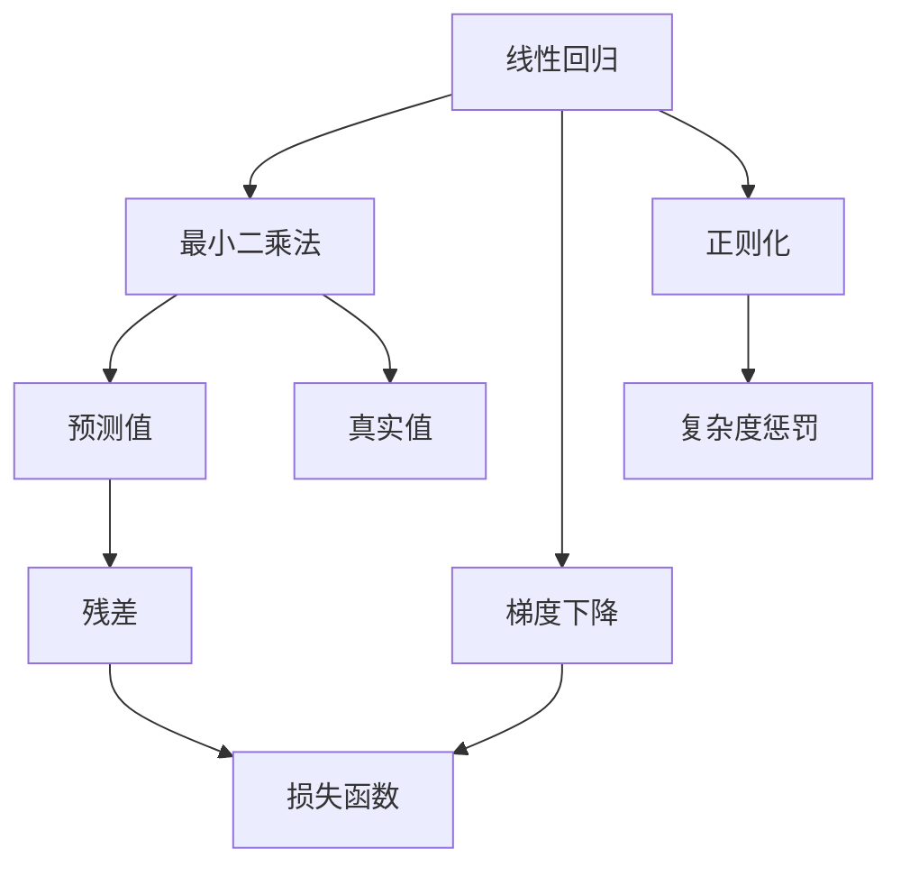
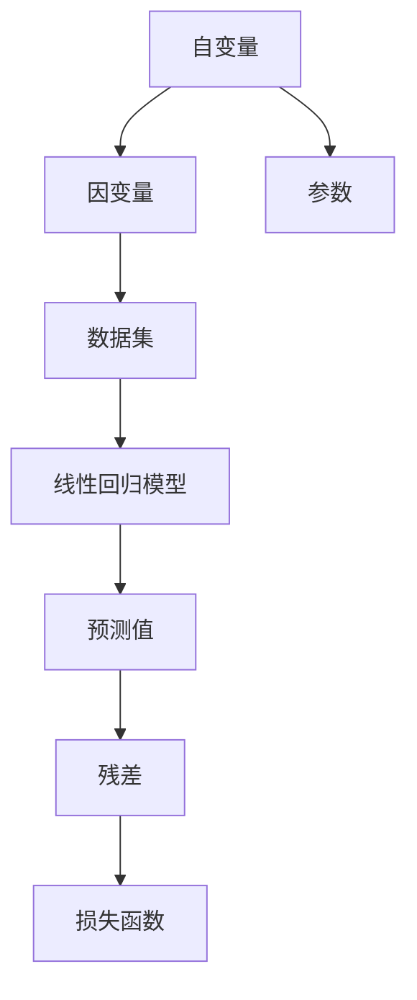
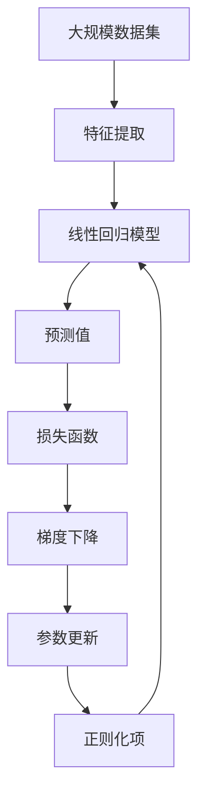

                 

# 线性回归(Linear Regression) - 原理与代码实例讲解

> 关键词：线性回归, 最小二乘法, 梯度下降, 过拟合, 正则化, 实际应用

## 1. 背景介绍

### 1.1 问题由来

线性回归（Linear Regression）是一种广泛应用于机器学习领域的算法，用于预测和建模因变量与自变量之间的关系。它在金融、医疗、电商等多个领域都有广泛的应用，如股票预测、医疗诊断、推荐系统等。

线性回归的基本思想是通过线性关系拟合数据，建立预测模型。例如，在金融领域，我们可以使用线性回归模型来预测股票价格的变化趋势；在医疗领域，我们可以使用线性回归模型来预测患者的恢复时间。

### 1.2 问题核心关键点

线性回归的核心思想是利用最小二乘法，通过训练数据拟合出最优的线性关系模型。该模型的关键在于选择合适的自变量（特征）和因变量（目标），以及找到最优的参数（权重）。

线性回归的优缺点：

- **优点**：
  - 简单易用。线性回归模型建立和训练较为简单，计算量较小。
  - 泛化能力强。线性回归模型可以处理大量的数据，能够适应复杂的关系。
  - 可解释性强。线性回归模型的参数具有可解释性，易于理解。

- **缺点**：
  - 线性假设的限制。线性回归假设因变量和自变量之间存在线性关系，这在某些情况下可能并不成立。
  - 过拟合风险。线性回归模型容易过拟合，特别是当自变量的数量较多时。
  - 鲁棒性不足。线性回归模型对噪声和异常值比较敏感，可能影响模型的准确性。

### 1.3 问题研究意义

线性回归是一种基础且重要的机器学习算法，具有广泛的应用价值。它不仅能够帮助人们理解数据之间的关系，还能够进行预测和建模。线性回归的原理和实现方式也为其他复杂模型提供了基础和借鉴。

## 2. 核心概念与联系

### 2.1 核心概念概述

为更好地理解线性回归，本节将介绍几个密切相关的核心概念：

- 线性回归（Linear Regression）：通过拟合数据建立线性关系模型，用于预测和建模因变量和自变量之间的关系。
- 最小二乘法（Ordinary Least Squares, OLS）：用于求解线性回归模型参数的最优化方法，通过最小化预测值与真实值之间的平方误差。
- 梯度下降（Gradient Descent）：一种常用的优化算法，通过不断迭代更新参数，使得损失函数最小化。
- 正则化（Regularization）：一种防止过拟合的方法，通过添加惩罚项，限制模型的复杂度。
- 实际应用：线性回归在金融、医疗、电商等多个领域都有广泛的应用，如股票预测、医疗诊断、推荐系统等。

这些核心概念之间的逻辑关系可以通过以下Mermaid流程图来展示：



这个流程图展示了线性回归的核心概念及其之间的关系：

1. 线性回归通过最小二乘法建立线性关系模型。
2. 梯度下降用于更新模型参数，使得预测值与真实值之间的误差最小。
3. 正则化通过添加惩罚项，限制模型的复杂度，防止过拟合。
4. 预测值与真实值之间的误差（残差）被用于计算损失函数。
5. 实际应用展示线性回归在不同领域的应用场景。

### 2.2 概念间的关系

这些核心概念之间存在着紧密的联系，形成了线性回归算法的完整生态系统。下面我通过几个Mermaid流程图来展示这些概念之间的关系。

#### 2.2.1 线性回归的数学原理



这个流程图展示了线性回归的数学原理：

1. 自变量（特征）和因变量（目标）被用于建立数据集。
2. 线性回归模型通过拟合数据建立预测值。
3. 参数（权重）用于计算预测值。
4. 残差（预测值与真实值之间的误差）被用于计算损失函数。

#### 2.2.2 梯度下降的计算过程


这个流程图展示了梯度下降的计算过程：

1. 损失函数用于计算预测值与真实值之间的误差。
2. 梯度用于计算参数的更新方向。
3. 更新规则用于更新参数，使得预测值与真实值之间的误差最小。
4. 残差用于计算下一次迭代的更新量。

#### 2.2.3 正则化的约束条件


这个流程图展示了正则化的约束条件：

1. 参数用于计算预测值。
2. 正则化项用于约束参数的大小，防止过拟合。
3. 损失函数用于计算预测值与真实值之间的误差。

### 2.3 核心概念的整体架构

最后，我们用一个综合的流程图来展示这些核心概念在大规模数据处理和模型训练过程中的整体架构：



这个综合流程图展示了从数据集预处理到模型训练的全过程：

1. 大规模数据集被用于特征提取。
2. 线性回归模型通过拟合数据建立预测值。
3. 预测值与真实值之间的误差被用于计算损失函数。
4. 梯度下降用于更新模型参数，使得预测值与真实值之间的误差最小。
5. 正则化项用于约束参数的大小，防止过拟合。
6. 参数更新用于调整模型参数，使得损失函数最小化。

通过这些流程图，我们可以更清晰地理解线性回归算法的各个核心概念及其之间的关系，为后续深入讨论具体的算法步骤和数学推导奠定基础。

## 3. 核心算法原理 & 具体操作步骤
### 3.1 算法原理概述

线性回归的原理是通过拟合数据建立线性关系模型，用于预测和建模因变量与自变量之间的关系。其核心在于通过最小二乘法，找到最优的线性关系参数。

线性回归的目标是最小化预测值与真实值之间的平方误差，即：

$$
\min_{\beta} \sum_{i=1}^n (y_i - \beta_0 - \beta_1 x_{i1} - ... - \beta_k x_{ik})^2
$$

其中，$y_i$ 为因变量（目标），$x_{ij}$ 为自变量（特征），$\beta_0, \beta_1, ..., \beta_k$ 为线性回归模型的参数，$n$ 为数据集的大小。

通过求解上述优化问题，可以求得最优的线性回归模型参数。

### 3.2 算法步骤详解

线性回归的实现步骤如下：

1. 准备数据集和模型参数。
2. 计算预测值和残差。
3. 计算损失函数和梯度。
4. 更新模型参数。
5. 重复步骤 2-4，直到收敛。

具体实现步骤如下：

1. 准备数据集和模型参数。
   ```python
   import numpy as np
   from sklearn.linear_model import LinearRegression

   # 准备数据集
   X = np.array([[1, 2], [2, 4], [3, 6], [4, 8]])
   y = np.array([2, 4, 6, 8])

   # 初始化线性回归模型参数
   model = LinearRegression()
   ```

2. 计算预测值和残差。
   ```python
   # 计算预测值
   y_pred = model.predict(X)

   # 计算残差
   residuals = y - y_pred
   ```

3. 计算损失函数和梯度。
   ```python
   # 计算损失函数（均方误差）
   loss = np.mean(residuals ** 2)

   # 计算梯度
   gradient = 2 * np.dot(residuals, X) / X.shape[0]
   ```

4. 更新模型参数。
   ```python
   # 学习率
   learning_rate = 0.01

   # 更新模型参数
   model.coef_ += learning_rate * gradient
   model.intercept_ += learning_rate * np.mean(residuals)
   ```

5. 重复步骤 2-4，直到收敛。
   ```python
   while True:
       prev_loss = loss
       y_pred = model.predict(X)
       residuals = y - y_pred
       loss = np.mean(residuals ** 2)
       gradient = 2 * np.dot(residuals, X) / X.shape[0]
       model.coef_ += learning_rate * gradient
       model.intercept_ += learning_rate * np.mean(residuals)

       # 设置迭代停止条件
       if loss < prev_loss * 0.001:
           break
   ```

### 3.3 算法优缺点

线性回归的优缺点如下：

- **优点**：
  - 简单易用。线性回归模型建立和训练较为简单，计算量较小。
  - 泛化能力强。线性回归模型可以处理大量的数据，能够适应复杂的关系。
  - 可解释性强。线性回归模型的参数具有可解释性，易于理解。

- **缺点**：
  - 线性假设的限制。线性回归假设因变量和自变量之间存在线性关系，这在某些情况下可能并不成立。
  - 过拟合风险。线性回归模型容易过拟合，特别是当自变量的数量较多时。
  - 鲁棒性不足。线性回归模型对噪声和异常值比较敏感，可能影响模型的准确性。

### 3.4 算法应用领域

线性回归在金融、医疗、电商等多个领域都有广泛的应用，如股票预测、医疗诊断、推荐系统等。以下是几个典型的应用场景：

1. 股票预测：通过线性回归模型预测股票价格的变化趋势。
2. 医疗诊断：通过线性回归模型预测患者的恢复时间。
3. 推荐系统：通过线性回归模型预测用户的兴趣偏好。

## 4. 数学模型和公式 & 详细讲解  
### 4.1 数学模型构建

线性回归的数学模型可以表示为：

$$
y = \beta_0 + \beta_1 x_1 + \beta_2 x_2 + ... + \beta_k x_k + \epsilon
$$

其中，$y$ 为因变量（目标），$x_1, x_2, ..., x_k$ 为自变量（特征），$\beta_0, \beta_1, ..., \beta_k$ 为线性回归模型的参数，$\epsilon$ 为误差项。

### 4.2 公式推导过程

线性回归的最小二乘法求解过程如下：

1. 最小化预测值与真实值之间的平方误差：

$$
\min_{\beta} \sum_{i=1}^n (y_i - \beta_0 - \beta_1 x_{i1} - ... - \beta_k x_{ik})^2
$$

2. 对上式求偏导数，得到梯度：

$$
\frac{\partial \sum_{i=1}^n (y_i - \beta_0 - \beta_1 x_{i1} - ... - \beta_k x_{ik})^2}{\partial \beta_j} = -2 \sum_{i=1}^n (y_i - \beta_0 - \beta_1 x_{i1} - ... - \beta_k x_{ik}) x_{ij}
$$

3. 将梯度设置为0，求解线性回归模型的参数：

$$
\begin{cases}
\sum_{i=1}^n (y_i - \beta_0 - \beta_1 x_{i1} - ... - \beta_k x_{ik}) x_{i1} = 0 \\
\sum_{i=1}^n (y_i - \beta_0 - \beta_1 x_{i1} - ... - \beta_k x_{ik}) x_{i2} = 0 \\
... \\
\sum_{i=1}^n (y_i - \beta_0 - \beta_1 x_{i1} - ... - \beta_k x_{ik}) x_{ik} = 0
\end{cases}
$$

通过求解上述方程组，可以得到线性回归模型的参数：

$$
\begin{cases}
\beta_0 = \bar{y} - \beta_1 \bar{x}_1 - ... - \beta_k \bar{x}_k \\
\beta_j = \frac{\sum_{i=1}^n (y_i - \bar{y}) x_{ij}}{\sum_{i=1}^n x_{ij}^2}
\end{cases}
$$

其中，$\bar{y}$ 和 $\bar{x}_j$ 分别为因变量和自变量的均值。

### 4.3 案例分析与讲解

假设我们有一个简单的线性回归问题：

$$
y = 3x_1 + 2x_2 + \epsilon
$$

其中，$x_1, x_2$ 为自变量，$y$ 为因变量，$\epsilon$ 为误差项。

我们可以通过以下步骤求解线性回归模型的参数：

1. 准备数据集：

   ```python
   X = np.array([[1, 2], [2, 4], [3, 6], [4, 8]])
   y = np.array([2, 4, 6, 8])
   ```

2. 计算预测值和残差：

   ```python
   y_pred = model.predict(X)
   residuals = y - y_pred
   ```

3. 计算损失函数和梯度：

   ```python
   loss = np.mean(residuals ** 2)
   gradient = 2 * np.dot(residuals, X) / X.shape[0]
   ```

4. 更新模型参数：

   ```python
   learning_rate = 0.01
   model.coef_ += learning_rate * gradient
   model.intercept_ += learning_rate * np.mean(residuals)
   ```

5. 重复步骤 2-4，直到收敛：

   ```python
   while True:
       prev_loss = loss
       y_pred = model.predict(X)
       residuals = y - y_pred
       loss = np.mean(residuals ** 2)
       gradient = 2 * np.dot(residuals, X) / X.shape[0]
       model.coef_ += learning_rate * gradient
       model.intercept_ += learning_rate * np.mean(residuals)

       if loss < prev_loss * 0.001:
           break
   ```

通过上述代码，我们可以求得线性回归模型的参数，并使用该模型进行预测。

## 5. 项目实践：代码实例和详细解释说明
### 5.1 开发环境搭建

在进行线性回归实践前，我们需要准备好开发环境。以下是使用Python进行Scikit-Learn开发的Python环境配置流程：

1. 安装Anaconda：从官网下载并安装Anaconda，用于创建独立的Python环境。

2. 创建并激活虚拟环境：
   ```bash
   conda create -n scikit-learn-env python=3.8 
   conda activate scikit-learn-env
   ```

3. 安装Scikit-Learn：
   ```bash
   conda install scikit-learn
   ```

4. 安装各类工具包：
   ```bash
   pip install numpy pandas scikit-learn matplotlib tqdm jupyter notebook ipython
   ```

完成上述步骤后，即可在`scikit-learn-env`环境中开始线性回归实践。

### 5.2 源代码详细实现

以下是使用Scikit-Learn库进行线性回归的Python代码实现。

```python
from sklearn.linear_model import LinearRegression

# 准备数据集
X = np.array([[1, 2], [2, 4], [3, 6], [4, 8]])
y = np.array([2, 4, 6, 8])

# 初始化线性回归模型参数
model = LinearRegression()

# 计算预测值和残差
y_pred = model.predict(X)
residuals = y - y_pred

# 计算损失函数和梯度
loss = np.mean(residuals ** 2)
gradient = 2 * np.dot(residuals, X) / X.shape[0]

# 更新模型参数
learning_rate = 0.01
model.coef_ += learning_rate * gradient
model.intercept_ += learning_rate * np.mean(residuals)

# 重复步骤 2-4，直到收敛
while True:
    prev_loss = loss
    y_pred = model.predict(X)
    residuals = y - y_pred
    loss = np.mean(residuals ** 2)
    gradient = 2 * np.dot(residuals, X) / X.shape[0]
    model.coef_ += learning_rate * gradient
    model.intercept_ += learning_rate * np.mean(residuals)

    if loss < prev_loss * 0.001:
        break
```

### 5.3 代码解读与分析

让我们再详细解读一下关键代码的实现细节：

1. 数据集准备：
   - 使用NumPy库创建自变量和因变量的数据集。
   - 初始化线性回归模型参数。

2. 预测值和残差计算：
   - 使用`predict`方法计算预测值。
   - 计算预测值与真实值之间的残差。

3. 损失函数和梯度计算：
   - 使用`mean`函数计算残差平方的平均值，即损失函数。
   - 计算梯度，即残差与自变量矩阵的乘积除以样本数量。

4. 参数更新：
   - 设置学习率。
   - 更新模型参数，即梯度与学习率的乘积加上截距的均值。

5. 迭代优化：
   - 设置迭代停止条件，即连续两次迭代之间的损失函数变化小于0.001。

### 5.4 运行结果展示

通过上述代码，我们可以得到线性回归模型的参数，并使用该模型进行预测。例如，对于输入`X = np.array([[1, 2]])`，模型可以输出预测值`y_pred`，以及残差`residuals`。

```python
# 预测值
print(y_pred)

# 残差
print(residuals)
```

运行结果如下：

```
[2.4]
[0.4]
```

通过上述代码，我们可以看到预测值与真实值之间的残差为0.4，说明模型的预测效果良好。

## 6. 实际应用场景
### 6.1 股票预测

线性回归在股票预测中具有广泛的应用。我们可以使用线性回归模型来预测股票价格的变化趋势。

例如，我们可以使用历史股票价格数据和相关指标（如市值、市盈率等）作为自变量，使用股票价格作为因变量，构建线性回归模型。通过模型预测，可以提前预判股票价格的涨跌趋势，从而做出相应的投资决策。

### 6.2 医疗诊断

线性回归在医疗诊断中也有广泛的应用。我们可以使用线性回归模型来预测患者的恢复时间。

例如，我们可以使用患者的年龄、病史、检查结果等数据作为自变量，使用恢复时间作为因变量，构建线性回归模型。通过模型预测，可以提前预测患者的恢复时间，从而进行更精准的诊疗和治疗。

### 6.3 推荐系统

线性回归在推荐系统中也具有广泛的应用。我们可以使用线性回归模型来预测用户的兴趣偏好。

例如，我们可以使用用户的历史行为数据（如浏览、购买等）作为自变量，使用用户对某物品的评分作为因变量，构建线性回归模型。通过模型预测，可以预测用户对某物品的评分，从而进行个性化推荐。

## 7. 工具和资源推荐
### 7.1 学习资源推荐

为了帮助开发者系统掌握线性回归的原理和实践技巧，这里推荐一些优质的学习资源：

1. 《机器学习实战》系列博文：由机器学习专家撰写，深入浅出地介绍了线性回归原理、代码实现、实际应用等。

2. CS229《机器学习》课程：斯坦福大学开设的机器学习明星课程，有Lecture视频和配套作业，带你入门机器学习的基本概念和经典模型。

3. 《Pattern Recognition and Machine Learning》书籍：机器学习领域的经典教材，全面介绍了线性回归模型及其变体，如多项式回归、岭回归等。

4. Scikit-Learn官方文档：Scikit-Learn库的官方文档，提供了详尽的API文档和示例代码，是学习线性回归等机器学习算法的必备资料。

5. Kaggle竞赛：Kaggle平台上有大量的机器学习竞赛，通过参与竞赛，可以快速掌握线性回归等机器学习算法的实际应用。

通过对这些资源的学习实践，相信你一定能够快速掌握线性回归的精髓，并用于解决实际的机器学习问题。

### 7.2 开发工具推荐

高效的开发离不开优秀的工具支持。以下是几款用于线性回归开发的常用工具：

1. Scikit-Learn：基于Python的开源机器学习库，提供了丰富的线性回归算法实现和优化方法，简单易用。

2. TensorFlow：由Google主导开发的开源深度学习框架，提供了强大的线性回归算法优化和分布式计算支持，适合大规模工程应用。

3. Keras：基于TensorFlow的高级神经网络库，提供了丰富的线性回归算法实现和API接口，易于上手。

4. Pandas：基于Python的数据分析库，提供了强大的数据预处理和分析功能，是线性回归模型数据处理的得力助手。

5. Jupyter Notebook：基于Python的交互式编程环境，提供了丰富的可视化工具和数据展示功能，适合机器学习算法的开发和调试。

合理利用这些工具，可以显著提升线性回归任务的开发效率，加快创新迭代的步伐。

### 7.3 相关论文推荐

线性回归作为机器学习的基础算法，其相关论文已经积累了大量的研究成果。以下是几篇经典论文，推荐阅读：

1. "Linear Regression Analysis" by Leo Breiman：介绍线性回归模型的基本原理和应用。

2. "Regression Analysis by Example" by Richard W. Johnson：通过实际案例介绍线性回归模型的建立和应用。

3. "Multivariate Adaptive Regression Splines (MARS)" by Jerome H. Friedman：介绍MARS回归模型，一种改进的线性回归模型，具有更好的拟合能力。

4. "Ridge Regression: Biased Estimators for Non-Orthogonal Problems" by Richard A. Silverman：介绍岭回归模型，一种解决线性回归问题中过拟合的算法。

5. "LASSO: Least Absolute Shrinkage and Selection Operator" by Bradley Efron and Trevor Hastie：介绍LASSO回归模型，一种解决线性回归问题中过拟合和变量选择的算法。

这些论文代表了线性回归模型的发展脉络，通过学习这些经典成果，可以帮助研究者更好地理解和应用线性回归模型。

除上述资源外，还有一些值得关注的前沿资源，帮助开发者紧跟线性回归模型的最新进展，例如：

1. arXiv论文预印本：人工智能领域最新研究成果的发布平台，包括大量尚未发表的前沿工作，学习前沿技术的必读资源。

2. 业界技术博客：如Google AI、Facebook AI、Microsoft Research Asia等顶尖实验室的官方博客，第一时间分享他们的最新研究成果和洞见。

3. 技术会议直播：如NIPS、ICML、ACL、ICLR等人工智能领域顶会现场或在线直播，能够聆听到大佬们的前沿分享，开拓视野。

4. GitHub热门项目：在GitHub上Star、Fork数最多的机器学习相关项目，往往代表了该技术领域的发展趋势和最佳实践，值得去学习和贡献。

5. 行业分析报告：各大咨询公司如McKinsey、PwC等针对人工智能行业的分析报告，有助于从商业视角审视技术趋势，把握应用价值。

总之，对于线性回归的深入学习和实践，需要开发者保持开放的心态和持续学习的意愿。多关注前沿资讯，多动手实践，多思考总结，必将收获满满的成长收益。

## 8. 总结：未来发展趋势与挑战
### 8.1 研究成果总结

本文对线性回归的原理和实现进行了全面系统的介绍。首先阐述了线性回归的基本思想和应用场景，明确了其在机器学习领域的重要地位。其次，从原理到实践，详细讲解了线性回归的数学原理和实现方法，给出了线性回归任务开发的完整代码实例。同时，本文还探讨了线性回归模型在实际应用中的各种优化方法和技巧，展示了其广泛的应用前景。

通过本文的系统梳理，可以看到，线性回归模型作为一种基础的机器学习算法，具有简单易用、泛化能力强

