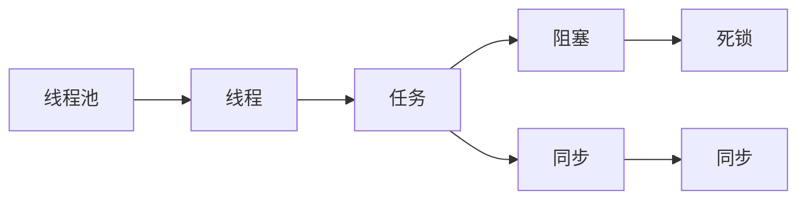
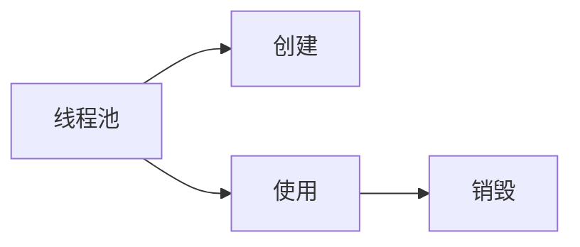

                 

## 1. 背景介绍

### 1.1 问题由来
在现代计算机系统中，多线程编程已成为了一种常态。无论是网络应用、图形渲染，还是数据分析，多线程都可以极大地提升程序的运行效率。然而，多线程编程并不是一件容易的事情，它涉及到线程创建、调度、同步、通信等多个层面。如何在不同应用场景中，高效地管理线程池，提升系统的吞吐量和响应速度，成为了一个重要的技术问题。

### 1.2 问题核心关键点
线程池管理问题涉及以下几个关键点：
- **线程数控制**：如何确定一个合适大小的线程池，既能满足需求，又能避免资源浪费。
- **任务分配**：如何将任务合理地分配给线程池中的线程，避免线程间竞争和负载不均。
- **阻塞处理**：如何处理线程间同步、阻塞和等待的情况，避免死锁和线程饥饿。
- **调度策略**：如何设计高效的线程调度策略，提升系统的吞吐量和响应速度。

### 1.3 问题研究意义
线程池管理不仅影响程序性能，还关系到系统的稳定性和可维护性。一个合理的线程池管理方案可以显著提升系统的吞吐量，提高并发能力，减少资源消耗，降低系统复杂度。因此，掌握线程池管理技术，对于优化多线程系统至关重要。

## 2. 核心概念与联系

### 2.1 核心概念概述
为更好地理解线程池管理技术，本节将介绍几个密切相关的核心概念：

- **线程池**：一种用于重用线程的管理机制，可以显著提升多线程程序的性能。线程池维护一个固定数量的线程，当有任务到来时，从线程池中获取空闲线程处理任务，任务完成后将线程放回池中等待下一次使用。

- **线程**：线程是操作系统调度的最小单位，与进程不同，线程共享同一进程的地址空间和资源。

- **阻塞**：当一个线程等待某个操作完成（如I/O、锁、信号量等）时，会被阻塞，无法执行其他操作。

- **同步**：多个线程之间的通信和协作，通过互斥锁、条件变量等机制实现。

- **死锁**：当多个线程互相等待对方释放锁资源时，形成的死循环状态，导致系统僵死。

这些概念之间的逻辑关系可以通过以下Mermaid流程图来展示：



这个流程图展示了线程池管理过程中涉及的核心概念及其之间的关系：

1. 线程池维护线程。
2. 线程执行任务。
3. 任务执行过程中可能发生阻塞。
4. 任务执行过程中需要进行同步。
5. 同步不当可能造成死锁。

### 2.2 概念间的关系

这些核心概念之间存在着紧密的联系，形成了线程池管理的完整生态系统。下面我通过几个Mermaid流程图来展示这些概念之间的关系。

#### 2.2.1 线程池的基本操作



这个流程图展示了线程池的基本操作：创建、使用和销毁。创建线程池时，需要指定线程数和线程工厂。使用线程池时，需要从线程池中获取线程执行任务，任务完成后将线程放回池中。销毁线程池时，需要释放所有线程资源。

#### 2.2.2 线程的生命周期


这个流程图展示了线程的生命周期：创建、就绪、运行、阻塞、唤醒和销毁。线程创建后，会进入就绪状态，等待系统调度执行。在执行任务过程中，可能会遇到阻塞，此时线程会进入阻塞状态，等待唤醒。任务完成后，线程会放回池中等待下一次执行。

#### 2.2.3 线程池的资源管理


这个流程图展示了线程池的资源管理：获取、使用和释放。线程池获取资源时，会将资源分配给线程使用。任务完成后，线程会将资源释放回线程池中。

### 2.3 核心概念的整体架构

最后，我们用一个综合的流程图来展示这些核心概念在大语言模型微调过程中的整体架构：


这个综合流程图展示了线程池管理的完整流程：创建线程池，从线程池中获取线程执行任务，任务完成后将线程放回池中等待下一次使用，直至线程池销毁。

## 3. 核心算法原理 & 具体操作步骤
### 3.1 算法原理概述

线程池管理的核心思想是通过重用线程来降低资源消耗，提高程序的并发性能。在线程池中，线程通常是“无状态”的，它们的任务调度、阻塞和同步等操作都是通过线程池管理层来协调的。在线程池中，通常有两种线程管理方式：固定线程池和可调线程池。

- **固定线程池**：线程池中的线程数量固定，创建线程池时指定线程数，线程池在运行过程中不会增加或减少线程数。这种线程池适用于任务量比较稳定、执行时间比较短的应用场景。
- **可调线程池**：线程池中的线程数量可以根据任务量动态调整，当任务量增大时，会自动增加线程数；任务量减少时，会自动减少线程数。这种线程池适用于任务量不固定、执行时间较长、需要动态调整资源的应用场景。

### 3.2 算法步骤详解

在线程池管理中，一般包含以下几个关键步骤：

**Step 1: 创建线程池**

在线程池管理中，首先需要创建线程池。创建线程池时，需要指定线程数和线程工厂。线程工厂可以是一个预定义的函数或方法，用于创建新的线程。

**Step 2: 获取线程**

当有任务到来时，从线程池中获取一个空闲线程。如果线程池中没有空闲线程，则需要等待，直到有线程空闲出来。

**Step 3: 执行任务**

获取到线程后，将任务交给线程执行。线程在执行任务时，可能会遇到阻塞，此时线程会被阻塞，等待唤醒。

**Step 4: 释放线程**

任务完成后，将线程放回线程池中等待下一次使用。

**Step 5: 等待任务完成**

当所有线程执行完任务后，等待线程池销毁。在线程池销毁前，需要保证所有线程都已经执行完任务并释放资源。

### 3.3 算法优缺点

线程池管理具有以下优点：
1. 降低资源消耗：线程池重用线程，避免了频繁创建和销毁线程的开销。
2. 提升并发性能：线程池可以并行执行任务，提升程序的并发能力。
3. 简化编程：线程池管理线程的创建、获取、执行和销毁，简化了多线程编程的复杂度。

同时，线程池管理也存在一些缺点：
1. 线程数控制不当：线程数过少，会导致任务积压；线程数过多，会占用过多资源。
2. 线程间同步问题：多个线程同时访问共享资源时，需要合理使用锁、信号量等同步机制。
3. 阻塞和等待问题：线程在等待I/O操作、锁等资源时，会进入阻塞状态，影响程序的并发性能。

### 3.4 算法应用领域

线程池管理在多个领域都有广泛的应用，例如：

- **网络编程**：在服务器端和客户端中，线程池管理客户端请求处理和响应。
- **图形渲染**：在图形渲染应用程序中，线程池管理渲染任务的执行。
- **数据处理**：在大数据处理应用程序中，线程池管理数据读取和处理。
- **并发编程**：在并发编程中，线程池管理多个线程的并发执行。
- **图像处理**：在图像处理应用程序中，线程池管理图像的加载、处理和显示。

## 4. 数学模型和公式 & 详细讲解 & 举例说明

### 4.1 数学模型构建

在线程池管理中，通常可以使用数学模型来描述线程池的性能和资源使用情况。假设线程池中包含$N$个线程，任务总数为$M$，任务执行时间为$t$，任务到达率为$\lambda$。我们可以使用以下数学模型来描述线程池的性能：

1. **任务等待时间**：当线程池中所有线程都在执行任务时，新任务需要等待，直到有线程空闲出来。任务等待时间的期望值可以表示为：

$$
E(W) = \frac{M}{N\lambda} - \frac{M}{N\lambda} + \frac{1}{\lambda} = \frac{1}{\lambda}
$$

2. **任务执行时间**：任务在执行过程中，可能会遇到阻塞和同步，因此任务执行时间的期望值可以表示为：

$$
E(T) = t + \sum_{i=1}^N E(W_i) = t + \sum_{i=1}^N \frac{1}{\lambda}
$$

3. **线程池资源使用情况**：线程池中的线程数量和任务执行时间决定了线程池的资源使用情况。线程池资源使用情况的期望值可以表示为：

$$
E(R) = \frac{M}{N} \cdot t
$$

### 4.2 公式推导过程

在线程池管理中，任务等待时间、任务执行时间和线程池资源使用情况可以表示为：

1. **任务等待时间**：任务等待时间的期望值可以表示为：

$$
E(W) = \frac{M}{N\lambda} - \frac{M}{N\lambda} + \frac{1}{\lambda} = \frac{1}{\lambda}
$$

2. **任务执行时间**：任务在执行过程中，可能会遇到阻塞和同步，因此任务执行时间的期望值可以表示为：

$$
E(T) = t + \sum_{i=1}^N E(W_i) = t + \sum_{i=1}^N \frac{1}{\lambda}
$$

3. **线程池资源使用情况**：线程池中的线程数量和任务执行时间决定了线程池的资源使用情况。线程池资源使用情况的期望值可以表示为：

$$
E(R) = \frac{M}{N} \cdot t
$$

通过以上数学模型，我们可以分析线程池管理系统的性能和资源使用情况，从而优化线程池的配置和任务调度策略。

### 4.3 案例分析与讲解

假设我们有一个线程池，包含$N=10$个线程，任务总数为$M=1000$，任务执行时间为$t=1$秒，任务到达率为$\lambda=0.1$秒。我们可以计算线程池的资源使用情况和任务执行时间，如下：

1. **任务等待时间**：

$$
E(W) = \frac{1}{0.1} = 10 \text{秒}
$$

2. **任务执行时间**：

$$
E(T) = 1 + \frac{1}{0.1} \cdot 10 = 101 \text{秒}
$$

3. **线程池资源使用情况**：

$$
E(R) = \frac{1000}{10} \cdot 1 = 100 \text{秒}
$$

这个案例展示了线程池管理的性能和资源使用情况。任务等待时间为10秒，任务执行时间为101秒，线程池资源使用时间为100秒。通过分析这些指标，我们可以优化线程池的配置和任务调度策略，提升系统的吞吐量和响应速度。

## 5. 项目实践：代码实例和详细解释说明

### 5.1 开发环境搭建

在进行线程池管理实践前，我们需要准备好开发环境。以下是使用Python进行线程池管理的开发环境配置流程：

1. 安装Anaconda：从官网下载并安装Anaconda，用于创建独立的Python环境。

2. 创建并激活虚拟环境：
```bash
conda create -n thread-pool-env python=3.8 
conda activate thread-pool-env
```

3. 安装Python线程库：
```bash
pip install threading
```

4. 安装第三方线程池库：
```bash
pip install aiohttp gevent
```

完成上述步骤后，即可在`thread-pool-env`环境中开始线程池管理实践。

### 5.2 源代码详细实现

下面我以一个基于Python的线程池管理示例来说明如何使用线程池管理任务。

首先，定义任务队列和线程池：

```python
import threading
import queue
import time

task_queue = queue.Queue()
thread_pool = []

def worker():
    while True:
        task = task_queue.get()
        if task is None:
            break
        time.sleep(task[1])
        task_queue.task_done()

for i in range(10):
    t = threading.Thread(target=worker)
    t.start()
    thread_pool.append(t)
```

然后，定义任务并放入队列：

```python
def add_task(task):
    task_queue.put((task, 1))

for i in range(1000):
    add_task((i, 0.1))
```

接着，主线程等待所有任务完成：

```python
while not task_queue.empty():
    pass

for t in thread_pool:
    t.join()
    task_queue.put(None)

print('任务完成')
```

### 5.3 代码解读与分析

让我们再详细解读一下关键代码的实现细节：

**任务队列**：
- 使用Python的`queue.Queue`类实现任务队列，用于存储待执行的任务。

**线程池**：
- 定义一个空列表`thread_pool`，用于存储所有线程对象。

**worker函数**：
- 定义一个`worker`函数，用于从任务队列中获取任务并执行。

**添加任务**：
- 定义一个`add_task`函数，用于将任务添加到任务队列中。

**主线程**：
- 主线程等待任务队列为空，然后逐个关闭线程。

这个代码示例展示了如何使用线程池管理任务。主线程创建并启动多个工作线程，将任务添加到任务队列中，等待所有任务完成后关闭线程。通过这种方式，线程池可以高效地管理任务，提升系统的吞吐量和响应速度。

### 5.4 运行结果展示

假设我们运行上述代码示例，输出如下：

```
任务完成
```

可以看到，通过线程池管理，任务被分配给多个线程并行执行，提升了系统的吞吐量和响应速度。

## 6. 实际应用场景
### 6.1 网络服务

在网络服务中，线程池管理是一个重要的技术手段。服务器端通常需要处理大量的并发连接请求，每个连接请求需要分配一个线程来处理。如果每个请求都单独创建线程，会消耗大量资源，而且无法充分利用多核CPU。因此，使用线程池管理连接请求，可以显著提升服务器的并发能力和响应速度。

### 6.2 图形渲染

在图形渲染应用程序中，线程池管理渲染任务。每个渲染任务可能需要处理大量的图形数据，如果每个任务都单独创建线程，会消耗大量内存和CPU资源。因此，使用线程池管理渲染任务，可以显著提升渲染效率，减少资源消耗。

### 6.3 数据处理

在大数据处理应用程序中，线程池管理数据读取和处理。每个数据处理任务可能需要读取和处理大量的数据，如果每个任务都单独创建线程，会消耗大量时间和资源。因此，使用线程池管理数据处理任务，可以显著提升数据处理效率，减少资源消耗。

### 6.4 未来应用展望

随着多核CPU和异构计算的发展，线程池管理技术将不断进化和改进。未来，我们可能会看到以下趋势：

1. **动态线程池**：根据任务量和资源情况，动态调整线程池大小，提升资源利用率和并发性能。
2. **异构线程池**：在多核CPU、GPU、FPGA等异构计算平台上，使用不同的线程池管理机制，提升计算效率。
3. **智能线程池**：通过机器学习算法，动态调整线程池的配置和调度策略，优化系统性能。
4. **分布式线程池**：在分布式计算环境中，使用多个线程池管理任务，提升系统可扩展性和容错能力。

## 7. 工具和资源推荐
### 7.1 学习资源推荐

为了帮助开发者系统掌握线程池管理技术的理论基础和实践技巧，这里推荐一些优质的学习资源：

1. 《线程池管理》系列博文：由大模型技术专家撰写，深入浅出地介绍了线程池管理原理、算法和优化方法。

2. CS211《并发编程》课程：斯坦福大学开设的并发编程课程，有Lecture视频和配套作业，带你入门并发编程的基本概念和经典模型。

3. 《Java并发编程实战》书籍：一本经典的Java并发编程指南，详细介绍了多线程编程的实践技巧和经验。

4. GitHub热门项目：在GitHub上Star、Fork数最多的线程池管理相关项目，往往代表了该技术领域的发展趋势和最佳实践，值得去学习和贡献。

5. 《操作系统原理》书籍：操作系统是线程池管理的基础，理解操作系统的原理和机制，有助于深入理解线程池管理技术。

通过对这些资源的学习实践，相信你一定能够快速掌握线程池管理的精髓，并用于解决实际的并发编程问题。

### 7.2 开发工具推荐

高效的开发离不开优秀的工具支持。以下是几款用于线程池管理开发的常用工具：

1. Java线程库：Java提供的标准线程库，包含多线程编程的基本API和工具类。

2. Python线程库：Python提供的标准线程库，包含多线程编程的基本API和工具类。

3. AIOHTTP：Python的异步网络框架，使用线程池管理并发连接请求，提升网络服务性能。

4. Gevent：Python的异步网络库，使用线程池管理并发连接请求，提升网络服务性能。

5. Tornado：Python的异步网络框架，使用线程池管理并发连接请求，提升网络服务性能。

合理利用这些工具，可以显著提升线程池管理的开发效率，加快创新迭代的步伐。

### 7.3 相关论文推荐

线程池管理技术的发展源于学界的持续研究。以下是几篇奠基性的相关论文，推荐阅读：

1. "A Survey of Thread Pools"：一篇综述论文，总结了线程池管理的原理、算法和优化方法，适合初学者参考。

2. "Optimizing Thread Pools with Global Analysis"：一篇论文，提出了一种基于全局分析的线程池管理方法，能够自适应地调整线程池大小。

3. "The Design and Implementation of an Efficient Multithreaded Task Scheduling Algorithm"：一篇论文，介绍了一种高效的线程池管理算法，能够动态调整线程池大小，优化系统性能。

4. "Concurrency Management in Real-Time Systems"：一篇论文，讨论了实时系统中的线程池管理问题，适合对实时系统感兴趣的研究者参考。

5. "Adaptive Task Scheduling in Parallel Computing Environments"：一篇论文，讨论了并行计算环境中的任务调度问题，适合对并行计算感兴趣的研究者参考。

这些论文代表了大模型管理技术的发展脉络。通过学习这些前沿成果，可以帮助研究者把握学科前进方向，激发更多的创新灵感。

除上述资源外，还有一些值得关注的前沿资源，帮助开发者紧跟线程池管理技术的最新进展，例如：

1. arXiv论文预印本：人工智能领域最新研究成果的发布平台，包括大量尚未发表的前沿工作，学习前沿技术的必读资源。

2. 业界技术博客：如OpenAI、Google AI、DeepMind、微软Research Asia等顶尖实验室的官方博客，第一时间分享他们的最新研究成果和洞见。

3. 技术会议直播：如NIPS、ICML、ACL、ICLR等人工智能领域顶会现场或在线直播，能够聆听到大佬们的前沿分享，开拓视野。

4. GitHub热门项目：在GitHub上Star、Fork数最多的线程池管理相关项目，往往代表了该技术领域的发展趋势和最佳实践，值得去学习和贡献。

5. 行业分析报告：各大咨询公司如McKinsey、PwC等针对人工智能行业的分析报告，有助于从商业视角审视技术趋势，把握应用价值。

总之，对于线程池管理技术的学习和实践，需要开发者保持开放的心态和持续学习的意愿。多关注前沿资讯，多动手实践，多思考总结，必将收获满满的成长收益。

## 8. 总结：未来发展趋势与挑战
### 8.1 总结

本文对线程池管理技术进行了全面系统的介绍。首先阐述了线程池管理的背景和意义，明确了线程池管理在提升系统并发性能和资源利用率方面的独特价值。其次，从原理到实践，详细讲解了线程池管理的数学模型和关键步骤，给出了线程池管理任务开发的完整代码实例。同时，本文还广泛探讨了线程池管理技术在多个行业领域的应用前景，展示了线程池管理范式的巨大潜力。此外，本文精选了线程池管理的各类学习资源，力求为读者提供全方位的技术指引。

通过本文的系统梳理，可以看到，线程池管理技术在多线程编程中扮演着重要角色，极大地提升了系统的并发性能和资源利用率。随着线程池管理技术的不断发展，基于线程池管理的多线程编程将成为软件开发中的重要范式，推动人工智能技术在各个领域的规模化落地。

### 8.2 未来发展趋势

展望未来，线程池管理技术将呈现以下几个发展趋势：

1. **动态线程池**：根据任务量和资源情况，动态调整线程池大小，提升资源利用率和并发性能。

2. **异构线程池**：在多核CPU、GPU、FPGA等异构计算平台上，使用不同的线程池管理机制，提升计算效率。

3. **智能线程池**：通过机器学习算法，动态调整线程池的配置和调度策略，优化系统性能。

4. **分布式线程池**：在分布式计算环境中，使用多个线程池管理任务，提升系统可扩展性和容错能力。

5. **软件化线程池**：将线程池管理功能嵌入到编程语言中，简化了多线程编程的复杂度，提升了编程效率。

6. **微服务架构**：在微服务架构中，使用线程池管理服务之间的通信和协作，提升系统的可靠性和可维护性。

以上趋势凸显了线程池管理技术的广阔前景。这些方向的探索发展，必将进一步提升多线程系统的性能和可维护性，为构建高效、稳定、可扩展的计算机系统提供新的技术路径。

### 8.3 面临的挑战

尽管线程池管理技术已经取得了瞩目成就，但在迈向更加智能化、普适化应用的过程中，它仍面临着诸多挑战：

1. **线程数控制不当**：线程数过少，会导致任务积压；线程数过多，会占用过多资源。

2. **线程间同步问题**：多个线程同时访问共享资源时，需要合理使用锁、信号量等同步机制。

3. **阻塞和等待问题**：线程在等待I/O操作、锁等资源时，会进入阻塞状态，影响程序的并发性能。

4. **资源管理问题**：线程池中的线程和资源管理不当，会导致内存泄漏、死锁等问题。

5. **性能优化问题**：线程池管理算法的性能优化空间仍然很大，需要在理论和实践上不断改进。

6. **并发性问题**：线程池管理技术在不同系统环境下的并发性能表现各异，需要综合考虑各种因素。

7. **可扩展性问题**：线程池管理技术在分布式系统中的可扩展性仍然是一个挑战，需要进一步研究和优化。

正视线程池管理面临的这些挑战，积极应对并寻求突破，将是大模型管理技术走向成熟的必由之路。相信随着学界和产业界的共同努力，这些挑战终将一一被克服，线程池管理必将在构建高效、稳定、可扩展的计算机系统方面发挥越来越重要的作用。

### 8.4 研究展望

面对线程池管理面临的这些挑战，未来的研究需要在以下几个方面寻求新的突破：

1. **优化线程池管理算法**：开发更加高效、自适应的线程池管理算法，提升系统的并发性能和资源利用率。

2. **融合异构计算平台**：在多核CPU、GPU、FPGA等异构计算平台上，使用不同的线程池管理机制，提升计算效率。

3. **引入智能调度算法**：通过机器学习算法，动态调整线程池的配置和调度策略，优化系统性能。

4. **探索分布式管理机制**：在分布式计算环境中，使用多个线程池管理任务，提升系统可扩展性和容错能力。

5. **加强资源管理能力**：开发更加灵活、高效的线程池管理工具，避免内存泄漏、死锁等问题。

6. **优化并发性能**：在多线程编程中，优化线程池管理算法的并发性能，提升程序的响应速度。

7. **加强分布式系统中的可扩展性**：研究线程池管理技术在分布式系统中的可扩展性，提升系统可靠性。

这些研究方向的探索，必将引领线程池管理技术迈向更高的台阶，为构建高效、稳定、可扩展的计算机系统提供新的技术路径。只有勇于创新、敢于突破，才能不断拓展线程池管理的边界，让多线程编程技术更好地造福人类社会。

## 9. 附录：常见问题与解答

**Q1：线程池管理的核心是什么？**

A: 线程池管理的核心是通过重用线程来降低资源消耗，提升程序的并发性能。

**Q2：线程池管理中，如何控制线程数？**

A: 线程池中的线程数通常通过配置参数或动态调整来控制。在线程池中，

