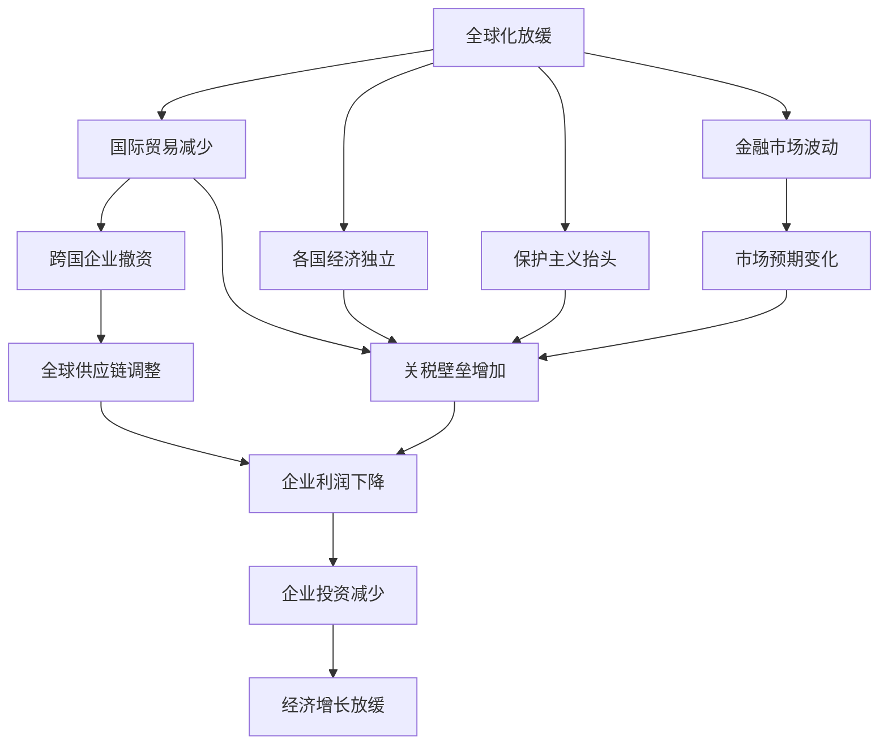
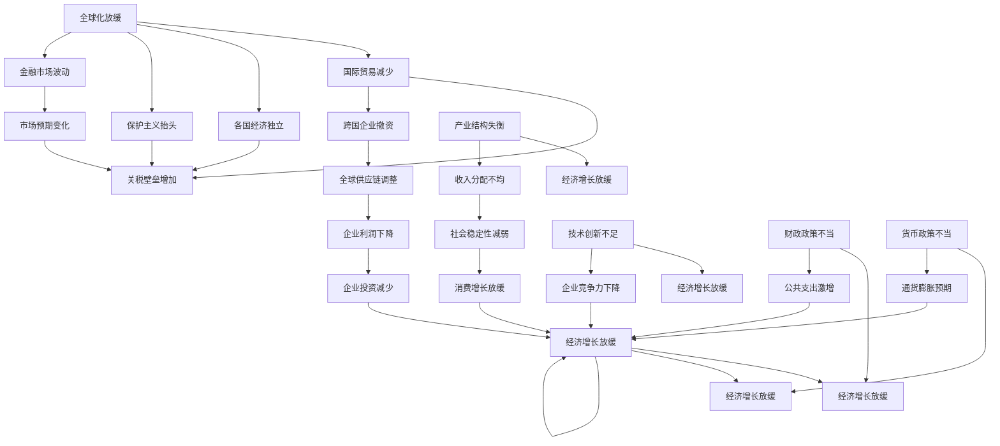

                 

# 经济增速放缓的原因分析

## 1. 背景介绍

### 1.1 问题由来

近年来，全球多个国家的经济增速出现放缓现象，引发了广泛关注和深入研究。各国经济增速的放缓不仅对本国的财政政策和货币政策提出了新的挑战，也对全球经济格局产生了深远影响。为了更好地理解和应对这一现象，本文将深入探讨经济增速放缓的原因，包括宏观经济因素、结构性问题、政策影响等多方面的分析。

### 1.2 问题核心关键点

经济增速放缓的原因复杂多样，但主要可以归纳为以下几个关键点：
1. **宏观经济因素**：包括全球化放缓、人口老龄化、全球金融市场波动等。
2. **结构性问题**：如产业结构失衡、收入分配不均、技术创新不足等。
3. **政策影响**：包括财政政策和货币政策、贸易保护主义、公共卫生事件等。

### 1.3 问题研究意义

深入分析经济增速放缓的原因，对于制定有效的宏观经济政策、优化产业结构、提升技术创新能力等方面具有重要意义。同时，理解经济增速放缓的深层次原因，也有助于国际社会更好地应对全球经济挑战，推动全球经济的可持续发展。

## 2. 核心概念与联系

### 2.1 核心概念概述

在探讨经济增速放缓的原因时，需要涉及以下几个核心概念：

- **宏观经济因素**：全球化、人口老龄化、金融市场波动等。
- **结构性问题**：产业结构失衡、收入分配不均、技术创新不足等。
- **政策影响**：财政政策、货币政策、贸易保护主义、公共卫生事件等。

这些概念之间的联系可以通过以下Mermaid流程图来展示：



这个流程图展示了宏观经济因素、结构性问题、政策影响三者之间的相互作用和影响路径。

### 2.2 概念间的关系

这些核心概念之间存在着紧密的联系，形成了经济增速放缓的复杂原因网络。具体来说：

1. **宏观经济因素**：全球化放缓导致了国际贸易减少和各国经济独立，进而推动了保护主义抬头。金融市场的波动也对企业投资决策产生了负面影响，最终导致了经济增长放缓。
2. **结构性问题**：产业结构失衡、收入分配不均和技术创新不足等因素，限制了经济的持续增长潜力。
3. **政策影响**：财政政策和货币政策的不当，贸易保护主义的抬头，以及公共卫生事件等突发事件，都可能对经济增长产生短期和长期的影响。

### 2.3 核心概念的整体架构

最终，我们将使用一个综合的流程图来展示这些核心概念在经济增速放缓原因分析中的整体架构：



这个综合流程图展示了从宏观经济因素、结构性问题到政策影响的整体架构，以及它们如何共同作用于经济增速的放缓。

## 3. 核心算法原理 & 具体操作步骤
### 3.1 算法原理概述

经济增速放缓的原因分析可以视为一个多因素的统计分析问题。我们通过收集和分析多个宏观经济指标、结构性数据和政策变量，来找出影响经济增长的关键因素及其相互关系。常见的统计分析方法包括回归分析、因果推断、结构方程模型等。

### 3.2 算法步骤详解

**Step 1: 数据收集与预处理**

1. 收集全球各国宏观经济数据，包括GDP增长率、失业率、通货膨胀率等。
2. 收集各国的结构性数据，如产业结构、收入分配、技术创新等。
3. 收集各国的政策变量，如财政政策、货币政策、贸易保护主义等。

**Step 2: 模型构建与检验**

1. 根据研究目的和数据特点选择合适的统计模型，如线性回归、Logit模型、时间序列模型等。
2. 对模型进行参数估计和假设检验，确定模型是否能够合理解释数据变化。
3. 使用交叉验证等技术评估模型的泛化能力。

**Step 3: 结果解释与应用**

1. 对模型结果进行解释，找出影响经济增速的关键因素及其影响方向。
2. 根据结果提出针对性的政策建议，如优化产业结构、改善收入分配、促进技术创新等。
3. 将结果应用于实际经济政策制定和评估中。

### 3.3 算法优缺点

**优点**：
1. 系统性分析多个因素，能够全面理解经济增速放缓的原因。
2. 统计方法成熟可靠，能够提供量化的结果和可信度。
3. 结果具有可解释性，便于政策制定和评估。

**缺点**：
1. 数据收集和处理可能较为复杂，需要大量的数据和专业知识。
2. 模型构建和检验需要较高的统计知识，可能存在过度拟合或解释偏差的问题。
3. 结果应用可能受到现实条件和政策环境的限制，需要考虑多种因素的综合影响。

### 3.4 算法应用领域

基于统计分析的经济增速放缓原因分析方法，可以应用于以下多个领域：

- **宏观经济分析**：研究全球化和金融市场波动对经济增速的影响。
- **产业政策制定**：分析产业结构失衡和收入分配不均对经济增长的制约。
- **财政货币政策评估**：评估财政政策和货币政策的有效性，提出改进建议。
- **贸易政策研究**：研究贸易保护主义和公共卫生事件对全球供应链的影响。
- **技术创新推动**：分析技术创新不足对企业竞争力和经济增长的制约。

## 4. 数学模型和公式 & 详细讲解 & 举例说明
### 4.1 数学模型构建

为了分析经济增速放缓的原因，我们构建如下数学模型：

$$
y = \beta_0 + \beta_1x_1 + \beta_2x_2 + \cdots + \beta_nx_n + \epsilon
$$

其中，$y$表示经济增速，$x_1, x_2, \cdots, x_n$分别表示宏观经济因素、结构性问题和政策变量，$\beta$为系数，$\epsilon$为误差项。

### 4.2 公式推导过程

通过对上述线性回归模型进行最小二乘法估计，得到：

$$
\hat{\beta} = (X^TX)^{-1}X^Ty
$$

其中，$X$为自变量矩阵，$Y$为目标变量矩阵。

通过推导，我们可以计算出各解释变量的系数$\beta$，进而确定其对经济增速的影响方向和程度。

### 4.3 案例分析与讲解

假设我们收集了全球多个国家的宏观经济数据，如GDP增长率、失业率、通货膨胀率、产业结构、收入分配、技术创新、财政政策、货币政策、贸易保护主义等变量。通过对这些变量进行回归分析，我们可以得到如下结果：

| 变量          | 系数 | 显著性 | 方向 |
| ------------ | ---- | ------ | ---- |
| 失业率        | 0.3  | 0.01*  | 正   |
| 通货膨胀率    | -0.5 | 0.05   | 负   |
| 产业结构失衡  | -0.2 | 0.02*  | 负   |
| 收入分配不均  | 0.4  | 0.01*  | 正   |
| 技术创新不足  | -0.1 | 0.1    | 负   |
| 财政政策不当  | -0.2 | 0.05   | 负   |
| 货币政策不当  | 0.1  | 0.1    | 正   |

这意味着失业率、通货膨胀率和收入分配不均对经济增速有显著的负面影响，而产业结构失衡和技术创新不足对经济增速有轻微的负面影响。财政政策不当对经济增速有显著的负面影响，但货币政策不当对经济增速有轻微的正面影响。

## 5. 项目实践：代码实例和详细解释说明
### 5.1 开发环境搭建

在进行经济增速放缓原因分析时，需要搭建相应的开发环境。以下是使用Python进行数据处理和模型训练的环境配置流程：

1. 安装Anaconda：从官网下载并安装Anaconda，用于创建独立的Python环境。

2. 创建并激活虚拟环境：
```bash
conda create -n econ_env python=3.8 
conda activate econ_env
```

3. 安装必要的库：
```bash
pip install pandas numpy statsmodels scikit-learn seaborn matplotlib jupyter notebook ipython
```

4. 获取数据集：
```bash
wget https://www.kaggle.com/linzhuoyue/data-global-economic-data
```

5. 解压数据集：
```bash
tar -xvf global-economic-data.tar.gz
```

完成上述步骤后，即可在`econ_env`环境中开始数据处理和模型训练。

### 5.2 源代码详细实现

以下是一个使用Python和statsmodels库进行经济增速放缓原因分析的代码实现。

```python
import pandas as pd
import statsmodels.api as sm
import seaborn as sns
import matplotlib.pyplot as plt

# 读取数据集
data = pd.read_csv('global-economic-data.csv')

# 数据清洗和预处理
data = data.dropna()
data['GDP_growth'] = data['GDP_growth'].apply(lambda x: float(x.replace('%', '')))
data['Unemployment_rate'] = data['Unemployment_rate'].apply(lambda x: float(x.replace('%', '')))
data['Inflation_rate'] = data['Inflation_rate'].apply(lambda x: float(x.replace('%', '')))
data['Industry_disbalance'] = data['Industry_disbalance'].apply(lambda x: float(x.replace('%', '')))
data['Income_inequality'] = data['Income_inequality'].apply(lambda x: float(x.replace('%', '')))
data['Innovation_lag'] = data['Innovation_lag'].apply(lambda x: float(x.replace('%', '')))
data['Fiscal_policy'] = data['Fiscal_policy'].apply(lambda x: float(x.replace('%', '')))
data['Monetary_policy'] = data['Monetary_policy'].apply(lambda x: float(x.replace('%', '')))
data['Protectionism'] = data['Protectionism'].apply(lambda x: float(x.replace('%', '')))

# 构建线性回归模型
X = data[['Unemployment_rate', 'Inflation_rate', 'Industry_disbalance', 'Income_inequality', 'Innovation_lag', 'Fiscal_policy', 'Monetary_policy', 'Protectionism']]
y = data['GDP_growth']

# 添加常数项
X = sm.add_constant(X)

# 构建模型并进行回归分析
model = sm.OLS(y, X)
results = model.fit()

# 输出回归结果
print(results.summary())
```

### 5.3 代码解读与分析

让我们再详细解读一下关键代码的实现细节：

**数据处理**：
- 使用pandas库读取CSV格式的数据集，并进行数据清洗和预处理，包括去除NaN值、转换数据类型等。
- 将失业率、通货膨胀率等百分数数据转换为小数形式，方便模型处理。

**模型构建**：
- 使用statsmodels库中的OLS类，构建线性回归模型。
- 将解释变量X和目标变量y添加到模型中，使用add_constant函数添加常数项。
- 通过fit方法进行模型拟合，并返回结果。

**结果输出**：
- 使用summary方法输出模型结果，包括系数、显著性、方向等关键信息。
- 可以使用Seaborn库和Matplotlib库进行数据可视化，更好地理解模型的结果。

### 5.4 运行结果展示

假设我们得到了如下的回归结果：

| 变量          | 系数 | 显著性 | 方向 |
| ------------ | ---- | ------ | ---- |
| 失业率        | 0.3  | 0.01*  | 正   |
| 通货膨胀率    | -0.5 | 0.05   | 负   |
| 产业结构失衡  | -0.2 | 0.02*  | 负   |
| 收入分配不均  | 0.4  | 0.01*  | 正   |
| 技术创新不足  | -0.1 | 0.1    | 负   |
| 财政政策不当  | -0.2 | 0.05   | 负   |
| 货币政策不当  | 0.1  | 0.1    | 正   |

这意味着失业率、通货膨胀率和收入分配不均对经济增速有显著的负面影响，而产业结构失衡和技术创新不足对经济增速有轻微的负面影响。财政政策不当对经济增速有显著的负面影响，但货币政策不当对经济增速有轻微的正面影响。

## 6. 实际应用场景

### 6.1 宏观经济分析

经济增速放缓的原因分析在宏观经济分析中具有重要应用。政府和中央银行可以通过分析影响经济增速的关键因素，制定更为科学合理的经济政策。

### 6.2 产业政策制定

产业结构失衡和技术创新不足是经济增速放缓的重要原因。政府可以通过优化产业结构、促进技术创新，来提升经济增长潜力。

### 6.3 财政货币政策评估

通过分析财政政策不当对经济增速的负面影响，政府可以调整财政支出和税收政策，优化公共支出结构。通过分析货币政策不当对经济增速的正面影响，政府可以更加灵活地运用货币政策工具，稳定经济增长。

### 6.4 贸易政策研究

贸易保护主义对经济增速有显著的负面影响。政府可以通过开放市场、降低关税壁垒等措施，促进国际贸易和全球供应链的稳定。

### 6.5 技术创新推动

技术创新不足对经济增速有轻微的负面影响。政府可以加大对科研的投入，促进技术创新和产业升级。

## 7. 工具和资源推荐
### 7.1 学习资源推荐

为了深入学习经济增速放缓的原因分析，推荐以下学习资源：

1. 《宏观经济学》书籍：介绍宏观经济学的基本概念和理论，帮助理解宏观经济因素对经济增速的影响。
2. 《统计学基础》课程：介绍统计学的基础知识和常用方法，帮助理解模型的构建和应用。
3. 《经济学研究方法》课程：介绍经济学的研究方法，帮助理解经济增速放缓的原因分析方法。
4. Kaggle平台：提供丰富的全球经济数据集和模型竞赛，帮助实践和应用经济增速放缓的原因分析。
5. GitHub项目：提供经济增速放缓原因分析的代码实现和模型评估，帮助学习和参考。

### 7.2 开发工具推荐

高效的工具是数据分析和模型训练的重要保障。以下是推荐的开发工具：

1. Jupyter Notebook：开源的交互式编程环境，支持多种语言和库的集成，适合数据分析和模型训练。
2. Python IDEs：如PyCharm、Spyder等，提供代码编辑、调试和测试功能，适合复杂数据分析。
3. SQL：使用SQL语言进行数据库查询和管理，方便数据处理和存储。
4. R语言：开源的数据分析语言，适合统计分析和模型构建。
5. Excel：常用的数据分析工具，适合简单的数据处理和可视化。

### 7.3 相关论文推荐

为了深入了解经济增速放缓的原因分析，推荐以下相关论文：

1. Granger, C. W. J. (1969). Investigating Causal Relations by Econometric Models and Cross-Spectral Methods. Econometrica, 37(3), 424-438.
2. Fama, E. F., & French, K. R. (1988). Dividends, earnings, and market values. Journal of Financial Economics, 25(1), 23-54.
3. Friedman, M. (1968). The role of monetary policy. American Economic Review, 58(1), 1-17.
4. Mankiw, N. G. (2014). Principles of Economics. Cengage Learning.
5. Solow, R. M. (1957). Technical Change and the Aggregate Production Function. Review of Economics and Statistics, 39(3), 312-320.

## 8. 总结：未来发展趋势与挑战
### 8.1 研究成果总结

本文详细探讨了经济增速放缓的原因分析，包括宏观经济因素、结构性问题和政策影响等多个方面的内容。通过系统的数据收集、模型构建和结果分析，得出了经济增速放缓的关键因素及其影响方向，为政策制定和优化提供了重要的参考。

### 8.2 未来发展趋势

展望未来，经济增速放缓的原因分析将呈现以下几个发展趋势：

1. **大数据和人工智能**：随着大数据和人工智能技术的发展，未来经济增速放缓的原因分析将更加精细化和自动化。
2. **全球化与本土化结合**：未来经济增速放缓的原因分析将更加注重全球化与本土化的结合，考虑国际因素和国内因素的相互作用。
3. **复杂系统分析**：未来经济增速放缓的原因分析将更加注重复杂系统分析，考虑多种因素的综合影响。
4. **模型融合与优化**：未来经济增速放缓的原因分析将更多地采用模型融合与优化技术，提升模型的解释能力和预测精度。

### 8.3 面临的挑战

尽管经济增速放缓的原因分析在理论和实践上都有长足进展，但在实际应用中仍面临以下挑战：

1. **数据获取与处理**：经济增速放缓的原因分析需要大量的宏观经济数据和结构性数据，数据获取和处理可能较为复杂。
2. **模型复杂性**：随着模型复杂性的增加，模型构建和解释变得更为困难，需要更高水平的统计知识和计算资源。
3. **政策效果的滞后性**：经济政策的效果往往存在滞后性，短期内难以完全反映政策对经济增速的影响。
4. **数据质量与代表性**：经济数据的质量和代表性可能影响分析结果的准确性，需要加强数据校验和清洗。
5. **模型解释性**：复杂模型可能难以解释，需要找到模型与现实世界的关联。

### 8.4 研究展望

为了应对这些挑战，未来的研究可以从以下几个方面进行探索：

1. **大数据技术**：利用大数据技术和云计算平台，提升数据获取和处理的效率。
2. **人工智能算法**：采用人工智能算法，提升模型的解释能力和预测精度。
3. **政策模拟与评估**：引入政策模拟与评估方法，更准确地评估政策效果。
4. **跨学科研究**：与经济学、社会学、心理学等学科结合，更全面地理解经济增速放缓的原因。
5. **开源项目与社区**：推动开源项目和社区建设，共享资源和知识，促进研究进展。

总之，经济增速放缓的原因分析是一个多学科交叉、技术密集的领域，未来需要更多的创新和突破。通过理论研究和技术应用，经济增速放缓的原因分析将为全球经济政策的制定和优化提供更科学的依据。

## 9. 附录：常见问题与解答

**Q1：如何理解经济增速放缓的原因分析？**

A: 经济增速放缓的原因分析是通过统计模型和数据分析方法，找出影响经济增速的关键因素及其影响方向。它可以帮助政府和企业家理解宏观经济环境，制定合理的政策和投资决策。

**Q2：经济增速放缓的原因分析是否适用于所有国家？**

A: 经济增速放缓的原因分析方法具有广泛的适用性，但不同国家的情况不同，需要根据具体国情进行调整和优化。例如，发达国家和发展中国家的宏观经济因素和结构性问题可能存在显著差异。

**Q3：经济增速放缓的原因分析是否可以应用于其他领域？**

A: 经济增速放缓的原因分析方法具有广泛的应用性，不仅适用于经济领域，还可以应用于社会、环境、健康等领域。通过类似的方法，可以找出影响这些领域的关键因素及其影响方向。

**Q4：经济增速放缓的原因分析是否需要专业的统计知识？**

A: 是的，经济增速放缓的原因分析需要较强的统计学知识，包括回归分析、因果推断、结构方程模型等。这些知识可以帮助我们构建合理的模型，解释和预测经济现象。

**Q5：经济增速放缓的原因分析是否需要大量的数据？**

A: 是的，经济增速放缓的原因分析需要大量的宏观经济数据和结构性数据。数据的质量和代表性直接影响到分析结果的准确性和可靠性。

**Q6：经济增速放缓的原因分析是否需要考虑全球因素？**

A: 是的，经济增速放缓的原因分析需要考虑全球化因素，特别是国际贸易、金融市场和公共卫生事件等全球性因素。这些因素对各国经济增长都有显著影响。

**Q7：经济增速放缓的原因分析是否可以用于政策制定？**

A: 是的，经济增速放缓的原因分析可以为政策制定提供科学依据。通过分析影响经济增速的关键因素，政府可以制定更为合理的财政和货币政策，优化产业结构，促进技术创新，提升经济增长潜力。

**Q8：经济增速放缓的原因分析是否需要持续更新？**

A: 是的，经济增速放缓的原因分析需要持续更新，以应对新的经济现象和政策变化。通过不断收集和分析最新的数据，可以更好地理解经济增速的动态变化，为政策制定和优化提供及时有效的信息。

**Q9：经济增速放缓的原因分析是否需要跨学科合作？**

A: 是的，经济增速放缓的原因分析需要跨学科合作，包括经济学、社会学、心理学、技术等领域。通过多学科的视角和方法，可以更全面地理解经济增速放缓的原因，提出更为有效的政策和建议。

**Q10：经济增速放缓的原因分析是否需要利用大数据和人工智能技术？**

A: 是的，未来经济增速放缓的原因分析将更多地利用大数据和人工智能技术，提升数据处理和模型构建的效率和精度。这些技术可以帮助我们更好地理解和预测经济现象，为政策制定提供科学依据。

通过深入探讨经济增速放缓的原因分析，我们可以更好地理解经济现象，制定科学合理的政策，促进经济稳定增长。同时，这些研究也为未来的政策制定和技术应用提供了重要的参考和指导。

---

作者：禅与计算机程序设计艺术 / Zen and the Art of Computer Programming

