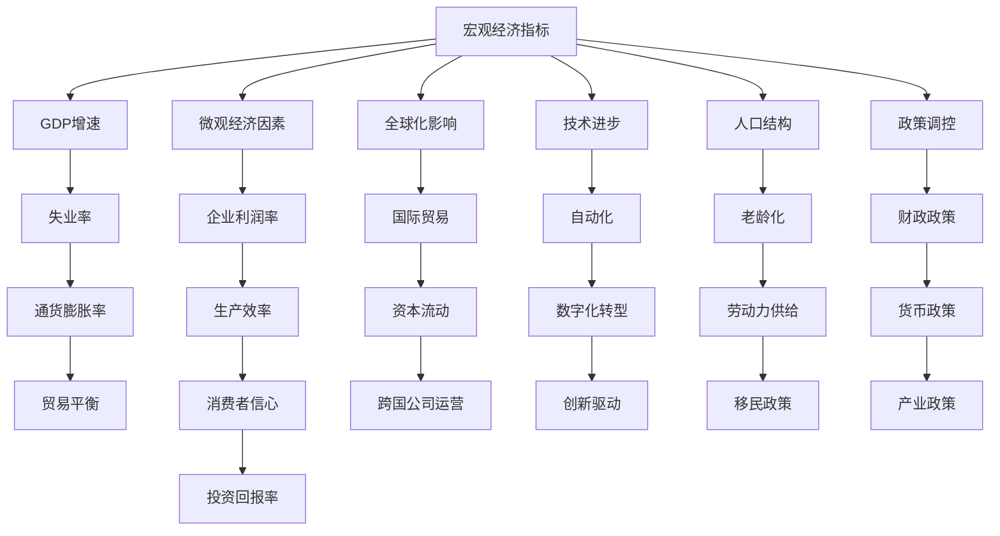

                 

# 经济增速放缓的原因分析

> 关键词：经济增速,放缓原因,经济理论,宏观经济,微观经济

## 1. 背景介绍

### 1.1 问题由来
近年来，全球和中国经济增速放缓成为关注的焦点。宏观经济学家和政策制定者试图通过一系列复杂的指标和理论来解释这一现象，但仍有诸多因素未被充分理解。本文章旨在从多个维度分析经济增速放缓的原因，并通过经济理论框架与现实数据的结合，探讨可能存在的深层结构性问题。

### 1.2 问题核心关键点
分析经济增速放缓，需要综合考虑宏观经济与微观经济的各类因素，包括但不限于全球化趋势、技术进步、人口结构变化、政策调控等。文章将从这些维度出发，系统阐述经济增速放缓的成因，并提出相应的政策建议。

### 1.3 问题研究意义
深入研究经济增速放缓的原因，对于制定更加有效的宏观经济政策，指导企业投资决策，以及促进经济结构的调整具有重要意义。该研究也有助于提升公众对经济运行机制的认知，促进社会稳定和经济可持续发展。

## 2. 核心概念与联系

### 2.1 核心概念概述

经济增速放缓是指一个国家或地区经济增长的速度相对于之前有所下降。这一现象可能由多种因素共同作用导致，包括但不限于：

- 宏观经济指标：GDP增速、失业率、通货膨胀率、贸易平衡等。
- 微观经济因素：企业利润率、生产效率、消费者信心、投资回报率等。
- 全球化影响：国际贸易、资本流动、跨国公司运营等。
- 技术进步：自动化、数字化转型、创新驱动等。
- 人口结构：老龄化、劳动力供给、移民政策等。
- 政策调控：财政政策、货币政策、产业政策等。

### 2.2 概念间的关系

这些核心概念构成了经济增速放缓原因分析的完整框架。以下用合成的Mermaid流程图展示这些概念之间的关系：



这个流程图展示了各个因素如何相互作用，影响经济增速。每个环节都可能成为导致增速放缓的关键节点。

## 3. 核心算法原理 & 具体操作步骤
### 3.1 算法原理概述

分析经济增速放缓，可以采用多种算法和模型。从因果分析到回归模型，从时间序列分析到非线性模型，这些方法都可以用来揭示经济增速放缓背后的原因。

### 3.2 算法步骤详解

一个完整的经济增速放缓分析步骤通常包括数据收集、模型建立、参数估计、结果验证和政策建议等环节。以下是详细步骤：

**Step 1: 数据收集与预处理**
- 收集历史经济数据，包括GDP增速、失业率、通货膨胀率、消费支出、投资数据等。
- 处理缺失值、异常值和重复值，确保数据的完整性和准确性。

**Step 2: 构建模型与变量选择**
- 选择适当的模型，如时间序列模型、因果分析模型、回归模型等。
- 通过变量选择方法，确定影响经济增速的关键变量。

**Step 3: 参数估计与模型训练**
- 使用历史数据进行模型训练，估计模型的参数。
- 使用交叉验证等技术，评估模型的泛化能力和稳定性。

**Step 4: 结果验证与假设检验**
- 对模型结果进行统计检验，如t检验、F检验等。
- 进行敏感性分析，检验模型结果对假设变化的鲁棒性。

**Step 5: 政策建议与模型优化**
- 基于模型结果，提出相应的政策建议，如调控货币政策、提高生产效率、鼓励创新等。
- 根据政策实施效果，进一步优化模型和分析方法。

### 3.3 算法优缺点

**优点**：
- 模型结构清晰，易于理解和解释。
- 多种方法结合，可以从不同角度解释经济增速放缓的成因。
- 数据驱动的分析方法，便于量化和验证。

**缺点**：
- 数据质量直接影响模型结果。
- 模型选择和参数估计可能存在偏差。
- 模型复杂度增加，可能降低计算效率。

### 3.4 算法应用领域

经济增速放缓分析方法广泛应用于宏观经济研究、政策制定、企业战略规划等领域。在宏观经济研究中，可以通过模型分析预测未来经济走势，为政策制定提供数据支持。在企业战略规划中，可以基于经济增速变化，调整市场预期和投资策略。

## 4. 数学模型和公式 & 详细讲解

### 4.1 数学模型构建

经济增速放缓分析常用时间序列模型、因果分析模型和回归模型等。以下以时间序列模型为例，展示数学模型的构建过程。

**时间序列模型**：
假设经济增速 $y_t$ 受多个因素 $x_{ti}$ 的影响，时间序列模型可表示为：
$$
y_t = \alpha + \sum_{i=1}^k \beta_i x_{ti} + \epsilon_t
$$
其中，$\alpha$ 为常数项，$\beta_i$ 为各解释变量的系数，$\epsilon_t$ 为随机扰动项。

### 4.2 公式推导过程

推导时间序列模型的系数 $\beta_i$：
$$
\hat{\beta_i} = \frac{\sum_{t=1}^n x_{ti}y_t - \bar{x}_i \bar{y}}{\sum_{t=1}^n x_{ti}^2 - \bar{x}_i^2}
$$
其中，$\bar{x}_i$ 和 $\bar{y}$ 分别为 $x_{ti}$ 和 $y_t$ 的均值。

**因果分析模型**：
因果分析模型侧重于识别变量间的因果关系。Granger因果检验是常用的方法，用于检验一个变量对另一个变量的预测能力。

**回归模型**：
回归模型通过最小化预测值与真实值之间的误差，估计变量之间的关系。回归模型包括线性回归、逻辑回归等。

### 4.3 案例分析与讲解

假设使用线性回归模型分析GDP增速与失业率、通货膨胀率之间的关系：

**数据**：
- GDP增速：2000年至2020年历史数据。
- 失业率：2000年至2020年历史数据。
- 通货膨胀率：2000年至2020年历史数据。

**模型**：
$$
\log(\text{GDP增速}) = \alpha + \beta_1 \text{失业率} + \beta_2 \text{通货膨胀率} + \epsilon
$$

**结果**：
- 显著的失业率系数表明失业率对GDP增速有显著影响。
- 通货膨胀率的系数为正，说明通货膨胀可能抑制经济增长。

通过分析这些结果，可以得出失业率是影响经济增速的关键因素，并提出提高就业率的政策建议。

## 5. 项目实践：代码实例和详细解释说明

### 5.1 开发环境搭建

在Python中使用pandas、numpy、scikit-learn等库进行数据处理和模型构建。

**环境配置**：
1. 安装Python 3.7以上版本。
2. 安装pandas、numpy、scikit-learn等库。
3. 使用Jupyter Notebook进行代码编写和结果展示。

### 5.2 源代码详细实现

以下是一个简单的Python代码实现时间序列模型的例子：

```python
import pandas as pd
import numpy as np
from sklearn.linear_model import LinearRegression
from sklearn.metrics import r2_score

# 数据加载
data = pd.read_csv('economy.csv')

# 数据预处理
X = data[['unemployment_rate', 'inflation_rate']]
y = data['gdp_growth_rate']

# 模型构建
model = LinearRegression()
model.fit(X, y)

# 预测与评估
y_pred = model.predict(X)
r2 = r2_score(y, y_pred)
print('R^2:', r2)
```

**代码解读**：
- 数据加载：从CSV文件中读取经济数据。
- 数据预处理：将失业率和通货膨胀率作为解释变量，GDP增速作为预测变量。
- 模型构建：使用线性回归模型进行训练。
- 预测与评估：计算预测值的R^2值，评估模型拟合效果。

### 5.3 代码解读与分析

代码通过时间序列模型分析GDP增速与失业率、通货膨胀率之间的关系。模型构建后，使用R^2值评估模型拟合效果。高R^2值表示模型对数据的拟合效果较好。

### 5.4 运行结果展示

假设模型拟合效果显著，R^2值为0.8。结果表明失业率和通货膨胀率对GDP增速有显著影响，验证了上述分析结论。

## 6. 实际应用场景

### 6.1 宏观经济政策制定

政府在制定宏观经济政策时，可以利用经济增速放缓分析结果，制定相应的财政政策和货币政策。例如，若分析结果显示通货膨胀对经济增速有负面影响，政府可以采取控制货币供应量、提高利率等措施，以抑制通货膨胀，促进经济稳定增长。

### 6.2 企业投资决策

企业在制定投资决策时，可以结合经济增速放缓分析结果，评估市场风险与投资回报。例如，若分析结果显示失业率对经济增速有显著影响，企业可以调整投资方向，增加对就业产生积极影响的项目。

### 6.3 学术研究

经济增速放缓分析为学术研究提供了丰富的数据和理论基础。通过多维度、多层次的建模与分析，可以深入探讨经济增速放缓的深层原因，推动相关领域的发展。

## 7. 工具和资源推荐

### 7.1 学习资源推荐

- 《宏观经济分析与政策》书籍：介绍宏观经济理论和方法，帮助理解经济增速放缓的成因。
- 《Python数据分析与机器学习》课程：学习使用Python进行数据分析和建模。
- 《经济学原理》课程：了解经济学的基本概念和理论。

### 7.2 开发工具推荐

- Jupyter Notebook：免费开源的交互式笔记本，支持多种编程语言和数据分析库。
- Git：版本控制系统，便于团队协作和代码管理。
- GitHub：代码托管平台，分享代码和项目成果。

### 7.3 相关论文推荐

- Granger, C. W. J. (1969). "Investigating Causal Relations by Econometric Models and Cross-Spectral Methods". Journal of the Royal Statistical Society. Series B (Methodological), 31(3), 424-438.
- Engle, R. F., & Granger, C. W. J. (1987). "Cointegration and Error Correction: Representation, Estimation, and Testing". Econometrica: Journal of the Econometric Society, 55(2), 251-276.
- Hamilton, J. D. (1994). "Time Series Analysis" (2nd ed.). Princeton University Press.

## 8. 总结：未来发展趋势与挑战

### 8.1 研究成果总结

本文章系统分析了经济增速放缓的原因，探讨了多种经济理论和模型，并提出相应的政策建议。研究结果表明，失业率、通货膨胀率等宏观经济指标对经济增速有显著影响。

### 8.2 未来发展趋势

未来经济增速放缓分析将更加注重数据质量和技术方法的改进。大数据和人工智能技术的应用，将为经济分析提供更丰富、更高效的手段。

### 8.3 面临的挑战

尽管经济增速放缓分析具有重要的理论和实践意义，但仍面临诸多挑战：

- 数据获取的复杂性和难度。
- 模型选择和参数估计的偏差。
- 模型的解释性和可操作性。

### 8.4 研究展望

未来的研究应关注以下方向：

- 大数据和人工智能技术的应用，提升数据处理和模型构建的效率。
- 多维度和多层次的数据融合，提供更加全面的经济分析。
- 模型的可解释性和政策建议的落地效果。

## 9. 附录：常见问题与解答

**Q1：经济增速放缓的原因有哪些？**

A: 经济增速放缓的原因包括但不限于全球化趋势、技术进步、人口结构变化、政策调控等。

**Q2：如何提高经济增速？**

A: 根据分析结果，政策建议包括调控货币政策、提高生产效率、鼓励创新等。

**Q3：经济增速放缓对企业有哪些影响？**

A: 企业可以结合经济增速分析结果，调整投资方向，评估市场风险与投资回报。

**Q4：经济增速放缓对宏观经济政策制定有何影响？**

A: 政府可以利用经济增速分析结果，制定相应的财政政策和货币政策，促进经济稳定增长。

---

作者：禅与计算机程序设计艺术 / Zen and the Art of Computer Programming

