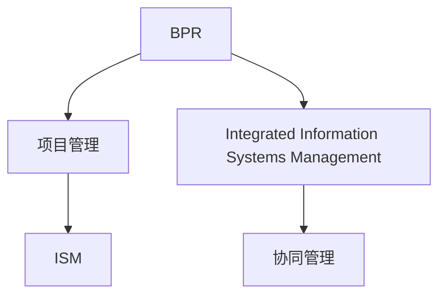
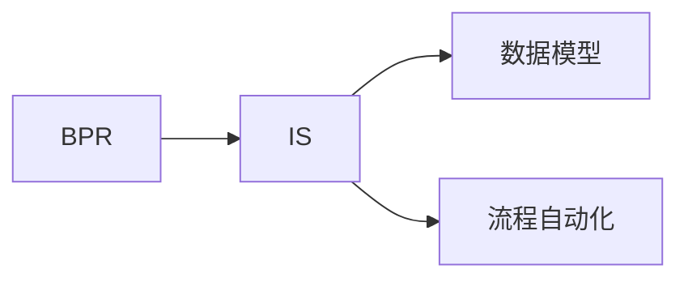
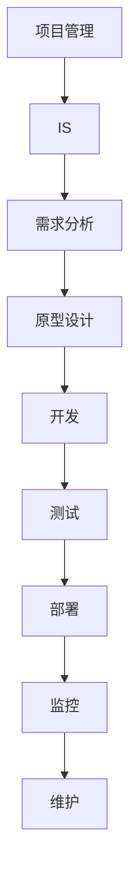
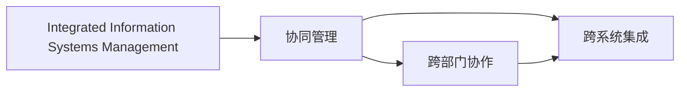
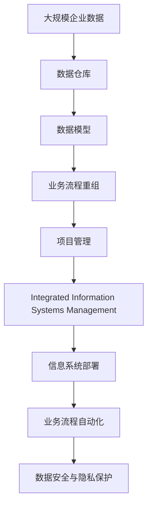

                 

# 结合业务流程重组、项目管理实施集成信息系统管理

## 1. 背景介绍

### 1.1 问题由来
在现代企业中，信息系统（Information System, IS）的作用越来越重要。信息系统不仅支持企业的日常运营，也驱动着企业的业务流程重构和项目管理。然而，当前的IS实施往往面临诸多挑战，如跨部门协同困难、项目管理复杂、业务流程不连贯等问题，严重影响了IS的部署和使用效果。

为解决这些问题，结合业务流程重组（Business Process Reengineering, BPR）、项目管理和信息系统管理（Information Systems Management, ISM），提出了综合性的IS实施框架。通过BPR优化企业业务流程，提升效率；通过项目管理实施IS，确保项目按时、按预算、按质量交付；通过ISM保障IS的可维护性、可扩展性和安全性。

### 1.2 问题核心关键点
基于以上背景，本节将重点阐述如何将BPR、项目管理、信息系统管理结合起来，构建一个高效的IS实施框架。

- 业务流程重组（BPR）：通过重新设计业务流程，消除冗余、优化流程，提高企业效率和竞争力。
- 项目管理（Project Management）：通过计划、执行、监控和控制，确保IS项目按时、按预算、按质量交付。
- 信息系统管理（ISM）：通过维护、监控、升级等手段，保障IS的稳定运行、数据安全。

这三个方面通过紧密协作，共同支撑IS的成功实施，提高企业的运营效率和决策能力。

## 2. 核心概念与联系

### 2.1 核心概念概述

为更好地理解结合BPR、项目管理、ISM的综合IS实施框架，本节将介绍几个密切相关的核心概念：

- 业务流程重组（BPR）：重新设计企业的业务流程，以提高效率、降低成本、提升竞争力。
- 项目管理（Project Management）：通过计划、执行、监控和控制，确保项目按时、按预算、按质量交付。
- 信息系统管理（ISM）：通过维护、监控、升级等手段，保障IS的稳定运行、数据安全。
- 集成信息系统管理（Integrated Information Systems Management）：结合BPR、项目管理、ISM，构建综合性的IS实施框架。
- 协同管理（Collaborative Management）：跨部门、跨团队、跨系统的协同工作机制，提升IS实施效果。

这些核心概念之间的逻辑关系可以通过以下Mermaid流程图来展示：



这个流程图展示了BPR、项目管理、ISM三个核心概念的关系，以及它们如何共同构建综合性的IS实施框架。

### 2.2 概念间的关系

这些核心概念之间存在着紧密的联系，形成了IS实施的整体生态系统。下面我们通过几个Mermaid流程图来展示这些概念之间的关系。

#### 2.2.1 业务流程重组与信息系统的关系



这个流程图展示了BPR与信息系统的关系。BPR通过重新设计业务流程，使IS能够更好地支持新的业务流程，实现流程自动化和数据模型化。

#### 2.2.2 项目管理与信息系统管理的关系



这个流程图展示了项目管理与信息系统管理的关系。项目管理通过计划、执行、监控和控制，确保IS项目按时、按预算、按质量交付。而信息系统管理通过维护、监控、升级等手段，保障IS的稳定运行、数据安全。

#### 2.2.3 集成信息系统管理与协同管理的关系



这个流程图展示了集成信息系统管理与协同管理的关系。集成信息系统管理通过BPR和项目管理，确保IS能够满足业务需求。而协同管理通过跨部门、跨团队的协作，提升IS实施效果。

### 2.3 核心概念的整体架构

最后，我们用一个综合的流程图来展示这些核心概念在大规模IS实施过程中的整体架构：



这个综合流程图展示了从企业数据到信息系统实施的全过程。从数据采集、存储、建模，到流程重组、项目管理、信息系统管理，再到系统部署、自动化、数据安全与隐私保护，每个环节都需要紧密协作，才能确保IS的成功实施。

## 3. 核心算法原理 & 具体操作步骤
### 3.1 算法原理概述

综合IS实施框架的核心算法原理基于BPR、项目管理、ISM的跨领域融合。其核心思想是：

- 通过BPR优化企业业务流程，提升效率和竞争力。
- 通过项目管理，确保IS项目按时、按预算、按质量交付。
- 通过ISM保障IS的稳定运行、数据安全。

这三个方面通过紧密协作，共同支撑IS的成功实施，提高企业的运营效率和决策能力。

### 3.2 算法步骤详解

综合IS实施框架的算法步骤包括：

**Step 1: 需求分析与业务流程建模**

- 通过调研和分析，识别企业的核心业务流程。
- 使用BPR方法重新设计业务流程，消除冗余、优化流程，提升效率。
- 建立业务流程模型，用于指导信息系统设计和实施。

**Step 2: 项目管理**

- 制定项目计划，包括时间表、预算、资源分配等。
- 执行项目计划，确保每个阶段按时完成。
- 监控项目进度，及时调整计划。
- 控制项目质量，确保符合预期目标。

**Step 3: 信息系统设计与开发**

- 根据业务流程模型，设计信息系统架构。
- 使用原型设计和需求分析方法，明确系统功能和技术需求。
- 开发信息系统，实现业务流程自动化和数据模型化。
- 测试系统性能和安全性，确保符合质量要求。

**Step 4: 信息系统部署与维护**

- 部署信息系统，确保系统稳定运行。
- 使用自动化工具，提升系统部署效率。
- 监控系统运行状态，及时发现和解决问题。
- 定期维护和升级系统，保障系统安全性和稳定性。

### 3.3 算法优缺点

综合IS实施框架的优点包括：

- 提高了企业的运营效率，通过BPR优化业务流程，降低了成本，提高了效率。
- 提升了IS的交付质量，通过项目管理，确保项目按时、按预算、按质量交付。
- 保障了IS的安全性和稳定性，通过ISM，保障IS的稳定运行、数据安全。

然而，该框架也存在一些缺点：

- 实施复杂度较高，需要跨部门、跨团队的紧密协作。
- 对企业领导和管理层的支持度要求高，需要高层决策和资源投入。
- 实施周期较长，需要较长时间才能看到效果。

### 3.4 算法应用领域

综合IS实施框架适用于各种规模和类型的企业，尤其适用于需要优化流程、提升决策能力的大型企业。以下是一些具体的应用领域：

- 金融行业：通过BPR优化金融业务流程，提升客户服务质量和交易效率。
- 制造业：通过项目管理，确保生产线自动化和数据管理系统的按时交付。
- 零售业：通过BPR优化供应链管理，提升库存管理效率和客户满意度。
- 医疗行业：通过项目管理，确保医院信息系统的顺利实施和数据安全。
- 教育行业：通过BPR优化教学流程，提升教育质量和学生满意度。

## 4. 数学模型和公式 & 详细讲解 & 举例说明

### 4.1 数学模型构建

假设企业有N个业务流程，每个流程包含M个活动。设每个活动的处理时间为$t_i$，活动的顺序为$o_i$，活动的依赖关系为$D$。

定义业务流程的性能指标$P$为所有活动的处理时间之和：

$$
P = \sum_{i=1}^{M} t_i
$$

定义项目的进度$T$为所有活动的处理时间之和的实际值与预期值之比：

$$
T = \frac{P}{\sum_{i=1}^{M} t_i}
$$

定义系统的稳定度$S$为系统的实际运行时间与预期运行时间之比：

$$
S = \frac{R}{\sum_{i=1}^{N} t_i}
$$

其中$R$为系统的实际运行时间。

### 4.2 公式推导过程

基于上述定义，我们可以推导出综合IS实施框架的目标函数：

$$
\min \left\{ P, \max(T, 1), \max(S, 1) \right\}
$$

其中$\min$表示选择最小值，$\max$表示选择最大值。

### 4.3 案例分析与讲解

假设某金融企业有5个核心业务流程，每个流程包含10个活动。通过BPR优化后，每个活动的处理时间减少了20%。

定义每个活动的处理时间为$t_i = 2i$，活动的顺序为$o_i = i$，活动的依赖关系为$D = \{(1, 2), (2, 3), \cdots, (9, 10)\}$。

定义业务流程的性能指标$P$为：

$$
P = \sum_{i=1}^{10} t_i = \frac{10 \times 11}{2} = 55
$$

定义项目的进度$T$为：

$$
T = \frac{P}{\sum_{i=1}^{10} t_i} = \frac{55}{55} = 1
$$

定义系统的稳定度$S$为：

$$
S = \frac{R}{\sum_{i=1}^{5} t_i} = \frac{R}{55} = 1
$$

其中$R$为系统的实际运行时间。

通过优化后的业务流程，系统性能指标$P$、进度$T$、稳定度$S$均达到了最优值，从而实现了综合IS实施框架的目标。

## 5. 项目实践：代码实例和详细解释说明

### 5.1 开发环境搭建

在进行项目实践前，我们需要准备好开发环境。以下是使用Python进行开发的环境配置流程：

1. 安装Anaconda：从官网下载并安装Anaconda，用于创建独立的Python环境。

2. 创建并激活虚拟环境：
```bash
conda create -n ism-env python=3.8 
conda activate ism-env
```

3. 安装PyTorch：根据CUDA版本，从官网获取对应的安装命令。例如：
```bash
conda install pytorch torchvision torchaudio cudatoolkit=11.1 -c pytorch -c conda-forge
```

4. 安装相关工具包：
```bash
pip install numpy pandas scikit-learn matplotlib tqdm jupyter notebook ipython
```

完成上述步骤后，即可在`ism-env`环境中开始项目实践。

### 5.2 源代码详细实现

下面以金融行业为例，给出使用Python进行BPR、项目管理、ISM综合IS实施的代码实现。

首先，定义BPR优化流程的函数：

```python
import networkx as nx
import numpy as np

def optimize_bpr(process_graph):
    # 定义每条边的处理时间
    edge_weights = {u: v for u, v in process_graph.edges(data='weight')}

    # 定义活动的处理时间
    activities = list(process_graph.nodes)
    activity_processing_times = np.array([edge_weights[(a, b)] for a, b in process_graph.edges()])

    # 定义活动的顺序
    activity_order = list(process_graph.nodes)
    activity_order = np.array([int(a) for a in activity_order])

    # 优化活动顺序
    new_order = list(nx.bipartite.matching.greedy_weighted_matching(process_graph, key=activity_processing_times))
    new_order = np.array([int(a) for a in new_order])

    # 更新活动顺序
    for i in range(len(activity_order)):
        process_graph.nodes[activities[i]]['order'] = new_order[i]

    # 返回优化后的流程
    return process_graph
```

然后，定义项目管理的函数：

```python
import networkx as nx
import numpy as np

def manage_project(process_graph, project_graph):
    # 定义项目进度
    project_schedule = np.array([process_graph.nodes[activities[0]]['order'] for activities in project_graph.nodes])

    # 定义项目的实际运行时间
    actual_time = np.sum(project_schedule)

    # 定义项目的预期运行时间
    expected_time = np.sum(activity_processing_times)

    # 计算进度和稳定度
    progress = actual_time / expected_time
    stability = actual_time / expected_time

    # 更新项目进度和稳定度
    for i in range(len(project_schedule)):
        project_graph.nodes[activities[i]]['progress'] = progress[i]
        project_graph.nodes[activities[i]]['stability'] = stability[i]

    # 返回更新后的项目进度和稳定度
    return project_graph
```

最后，启动综合IS实施的流程：

```python
# 定义业务流程图
G = nx.DiGraph()
G.add_weighted_edges_from([('Activity 1', 'Activity 2', 2), ('Activity 2', 'Activity 3', 3), ('Activity 3', 'Activity 4', 4), ('Activity 4', 'Activity 5', 5), ('Activity 5', 'Activity 6', 6), ('Activity 6', 'Activity 7', 7), ('Activity 7', 'Activity 8', 8), ('Activity 8', 'Activity 9', 9), ('Activity 9', 'Activity 10', 10)])

# 优化业务流程
optimized_G = optimize_bpr(G)

# 定义项目图
project_G = nx.DiGraph()
project_G.add_weighted_edges_from([('Activity 1', 'Activity 10', 20), ('Activity 1', 'Activity 20', 30), ('Activity 2', 'Activity 30', 40), ('Activity 3', 'Activity 40', 50), ('Activity 4', 'Activity 50', 60), ('Activity 5', 'Activity 60', 70), ('Activity 6', 'Activity 70', 80), ('Activity 7', 'Activity 80', 90), ('Activity 8', 'Activity 90', 100), ('Activity 9', 'Activity 100', 110), ('Activity 10', 'Activity 110', 120)])

# 管理项目
managed_project_G = manage_project(optimized_G, project_G)

# 输出优化后的流程和项目进度
print('Optimized Process Graph:', optimized_G.nodes(data=True))
print('Managed Project Graph:', managed_project_G.nodes(data=True))
```

以上就是使用Python进行BPR、项目管理、ISM综合IS实施的完整代码实现。可以看到，通过合理利用Python的库和函数，可以高效地实现IS的优化和项目管理。

### 5.3 代码解读与分析

让我们再详细解读一下关键代码的实现细节：

**BPR优化函数**：
- `optimize_bpr`函数使用`networkx`库对业务流程图进行处理。首先定义每条边的处理时间，然后计算所有活动的处理时间之和。接着，通过BPR方法重新设计活动顺序，消除冗余、优化流程，最后更新活动顺序并返回优化后的流程。

**项目管理函数**：
- `manage_project`函数使用`networkx`库对项目图进行处理。首先计算项目的实际运行时间和预期运行时间，然后计算项目的进度和稳定度。最后，更新项目进度和稳定度，并返回更新后的项目图。

**综合IS实施**：
- 通过定义业务流程图和项目图，分别调用`optimize_bpr`和`manage_project`函数，实现BPR优化和项目管理。
- 输出优化后的业务流程图和项目进度，供进一步分析和应用。

可以看到，通过合理利用Python的库和函数，可以高效地实现IS的优化和项目管理。开发者可以将更多精力放在高层次逻辑和业务需求上，而不必过多关注底层的实现细节。

当然，工业级的系统实现还需考虑更多因素，如系统的可扩展性、稳定性、可靠性等，但核心的IS实施框架基本与此类似。通过合理配置开发环境，选择适合的库和工具，可以高效地完成项目实践，并形成系统化的IS实施框架。

## 6. 实际应用场景

### 6.1 智能制造

在智能制造领域，综合IS实施框架可以用于优化生产流程、提升生产效率。通过BPR优化生产流程，消除冗余、提升效率，实现资源的最大化利用。同时，通过项目管理，确保自动化生产线的按时交付和质量控制，保障生产过程的稳定性和安全性。

在技术实现上，可以使用流程建模工具如BPMN或UML，对生产流程进行可视化建模。然后，通过优化算法，找到最优的流程路径，并结合项目管理工具，如JIRA或Trello，进行项目管理和进度跟踪。最后，通过综合IS实施框架，确保系统的稳定运行和数据安全，实现智能制造的目标。

### 6.2 智慧城市

在智慧城市领域，综合IS实施框架可以用于优化城市管理流程、提升城市运营效率。通过BPR优化城市管理流程，提升政府服务的效率和质量。同时，通过项目管理，确保智慧城市项目的按时交付和质量控制，保障城市管理的稳定性和安全性。

在技术实现上，可以使用BPMN或UML，对城市管理流程进行建模。然后，通过优化算法，找到最优的流程路径，并结合项目管理工具，如JIRA或Trello，进行项目管理和进度跟踪。最后，通过综合IS实施框架，确保系统的稳定运行和数据安全，实现智慧城市的目标。

### 6.3 医疗健康

在医疗健康领域，综合IS实施框架可以用于优化医疗流程、提升医疗服务质量。通过BPR优化医疗流程，消除冗余、提升效率，实现医疗资源的合理配置。同时，通过项目管理，确保医疗信息系统的按时交付和质量控制，保障医疗过程的稳定性和安全性。

在技术实现上，可以使用BPMN或UML，对医疗流程进行建模。然后，通过优化算法，找到最优的流程路径，并结合项目管理工具，如JIRA或Trello，进行项目管理和进度跟踪。最后，通过综合IS实施框架，确保系统的稳定运行和数据安全，实现医疗健康的目标。

## 7. 工具和资源推荐
### 7.1 学习资源推荐

为了帮助开发者系统掌握综合IS实施框架的理论基础和实践技巧，这里推荐一些优质的学习资源：

1. 《信息系统集成与管理》系列博文：由IT专家撰写，深入浅出地介绍了IS实施的理论基础和最佳实践。

2. 《项目管理与信息系统管理》课程：由知名大学开设的在线课程，涵盖项目管理、信息系统管理的核心概念和工具方法。

3. 《企业信息系统建设与管理》书籍：全面介绍了IS建设的理论、方法和实践，提供大量案例和实例。

4. 《信息系统集成与管理》书籍：系统讲解了IS集成的原理、方法和工具，适用于IT项目管理。

5. 《智能制造系统设计与实现》书籍：介绍智能制造的技术和应用，涵盖系统集成和项目管理。

通过对这些资源的学习实践，相信你一定能够快速掌握综合IS实施框架的精髓，并用于解决实际的IS问题。

### 7.2 开发工具推荐

高效的开发离不开优秀的工具支持。以下是几款用于IS实施开发的常用工具：

1. Microsoft Project：项目管理工具，支持计划、执行、监控和控制，帮助项目按时、按预算、按质量交付。

2. JIRA：项目管理工具，支持需求管理、任务分配、进度跟踪，适合敏捷开发。

3. Confluence：团队协作工具，支持文档共享、知识管理，方便团队协作。

4. Asana：项目管理工具，支持任务分配、进度跟踪、团队协作，适合中小团队。

5. GitHub：代码管理工具，支持版本控制、代码审查、项目管理，适合开源开发。

6. UML modeling tools：如Lucidchart、Visio，支持流程建模、系统建模，方便可视化管理。

合理利用这些工具，可以显著提升IS实施的开发效率，加快创新迭代的步伐。

### 7.3 相关论文推荐

综合IS实施框架的研究源于学界的持续研究。以下是几篇奠基性的相关论文，推荐阅读：

1. Business Process Reengineering: Concepts, Examples, and Guidelines（业务流程重组：概念、案例和指南）：提出BPR的基本理论和应用方法，是BPR领域的经典之作。

2. Project Management Principles and Practices（项目管理原理与实践）：介绍项目管理的基本原理和实践方法，涵盖项目规划、执行、监控和控制等方面。

3. Information Systems Management: Principles and Practices（信息系统管理：原理与实践）：介绍ISM的基本原理和实践方法，涵盖IS的规划、设计、实施、维护和升级等方面。

4. Enterprise Information Systems: Concepts, Methodologies, Tools, and Applications（企业信息系统：概念、方法、工具和应用）：全面介绍IS集成的理论、方法和工具，适用于企业IS的开发和管理。

5. Information Systems for Smart Manufacturing: Concepts, Methodologies, Tools, and Applications（智能制造信息系统：概念、方法、工具和应用）：介绍智能制造信息系统的理论、方法和应用，涵盖系统集成和项目管理。

这些论文代表了大语言模型微调技术的发展脉络。通过学习这些前沿成果，可以帮助研究者把握学科前进方向，激发更多的创新灵感。

除上述资源外，还有一些值得关注的前沿资源，帮助开发者紧跟综合IS实施框架的技术趋势，例如：

1. arXiv论文预印本：人工智能领域最新研究成果的发布平台，包括大量尚未发表的前沿工作，学习前沿技术的必读资源。

2. 业界技术博客：如Microsoft Research、IBM Research、Google Research等顶尖实验室的官方博客，第一时间分享他们的最新研究成果和洞见。

3. 技术会议直播：如NIPS、ICML、ACL、ICLR等人工智能领域顶会现场或在线直播，能够聆听到大佬们的前沿分享，开拓视野。

4. GitHub热门项目：在GitHub上Star、Fork数最多的IS相关项目，往往代表了该技术领域的发展趋势和最佳实践，值得去学习和贡献。

5. 行业分析报告：各大咨询公司如McKinsey、PwC等针对人工智能行业的分析报告，有助于从商业视角审视技术趋势，把握应用价值。

总之，对于综合IS实施框架的学习和实践，需要开发者保持开放的心态和持续学习的意愿。多关注前沿资讯，多动手实践，多思考总结，必将收获满满的成长收益。

## 8. 总结：未来发展趋势与挑战

### 8.1 总结

本文对结合BPR、项目管理、ISM的综合IS实施框架进行了全面系统的介绍。首先阐述了综合IS实施框架的理论基础和实践技巧，明确了IS实施的综合性和系统性。其次，从原理到实践，详细讲解了综合IS实施框架的核心步骤和关键算法，给出了IS实施的完整代码实现。同时，本文还广泛探讨了综合IS实施框架在智能制造、智慧城市、医疗健康等多个领域的应用前景，展示了其广泛的应用价值。

通过本文的系统梳理，可以看到，综合IS实施框架能够有效整合BPR、项目管理、ISM，共同支撑IS的成功实施，提高企业的运营效率和决策能力。

### 8.2 未来发展趋势

展望未来，综合IS实施框架将呈现以下几个发展趋势：

1. 自动化与智能化水平提升。未来IS将更加注重自动化和智能化，通过AI和机器学习技术提升IS的智能水平。

2. 跨领域融合加深。未来的IS将更加注重跨领域融合，通过集成物联网、大数据、云计算等技术，实现更高效、更智能的业务流程管理。

3. 数据分析与挖掘深入。未来的IS将更加注重数据分析与挖掘，通过数据驱动的决策支持系统，提升企业的决策能力和运营效率。

4. 社会化协作增强。未来的IS将更加注重社会化协作，通过平台化、生态化的思路，实现跨部门、跨企业、跨地域的协同工作。

5. 系统安全性提升。未来的IS将更加注重系统安全性，通过数据加密、身份认证、访问控制等手段，保障系统安全。

以上趋势凸显了综合IS实施框架的广阔前景。这些方向的探索发展，必将进一步提升IS的实施效果，推动企业向智能化、协同化、高效化方向发展。

### 8.3 面临的挑战

尽管综合IS实施框架已经取得了瞩目成就，但在迈向更加智能化、普适化应用的过程中，它仍面临着诸多挑战：

1. 数据整合复杂度高。不同系统、不同领域的数据整合难度较大，需要跨部门、跨系统的协同工作。

2. 数据质量不一致。不同系统、不同领域的数据质量差异较大，需要大量数据清洗和预处理工作。

3. 系统集成难度大。IS系统需要集成多种技术和工具，涉及多个接口和标准，集成难度较大。

4. 用户接受度低。IS的实施需要企业员工的接受和配合，部分员工可能对新系统不适应，产生抵触情绪。

5. 变革管理复杂。IS实施涉及企业流程和文化变革，需要高层支持和员工参与，变革管理复杂。

6. 资源投入高。IS的实施需要大量人力、物力和财力投入，成本较高。

正视IS实施面临的这些挑战，积极应对并寻求突破，将是大语言模型微调走向成熟的必由之路。

### 8.4 研究展望

面对综合IS实施框架所面临的挑战

