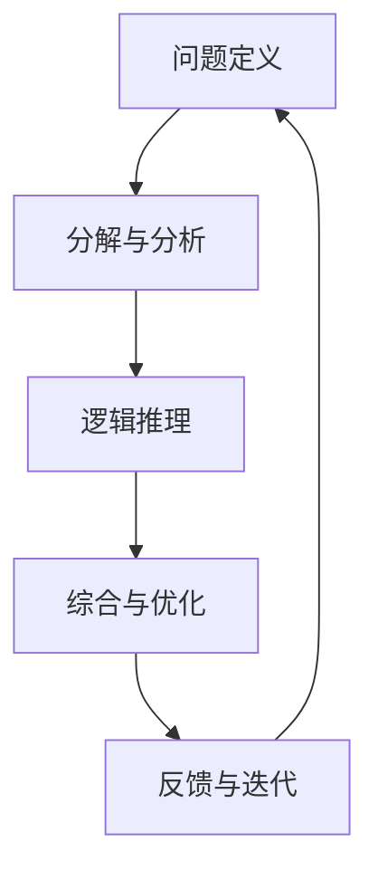
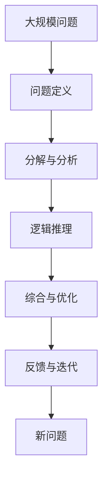

                 

# 结构化思维的应用：从理论到实践

> 关键词：结构化思维,系统性思考,问题解决,数据科学,实践指南

## 1. 背景介绍

### 1.1 问题由来

在当今信息爆炸的时代，人们面临的问题日趋复杂和多样化。无论是商业决策、项目管理，还是日常生活中的各种挑战，都需要高效且系统化的方法来解决问题。结构化思维（Structured Thinking）作为一种系统化、逻辑化的思维方式，能够在面对复杂问题时提供有力的工具和框架。

结构化思维的核心在于将问题分解为可管理的小部分，通过系统化的步骤和逻辑化的流程来解决，从而提高问题解决的效率和质量。在数据科学和人工智能领域，结构化思维的应用尤为广泛，特别是在数据处理、模型构建和结果分析等方面。本文旨在介绍结构化思维的基本原理、操作步骤以及应用实践，为读者提供从理论到实践的全面指南。

### 1.2 问题核心关键点

结构化思维的关键点在于其系统性和逻辑性，能够帮助人们面对复杂问题时，有条不紊地进行分解、分析、综合和解决。核心在于：

- **分解与分析**：将问题分解为可操作的小部分，逐一进行分析。
- **逻辑推理**：通过逻辑推理得出结论，确保推导过程的严谨性和可重复性。
- **综合与优化**：对分析结果进行综合，形成整体解决方案，并不断优化以提升效果。

## 2. 核心概念与联系

### 2.1 核心概念概述

为了更好地理解结构化思维，本节将介绍几个密切相关的核心概念：

- **问题定义**：明确问题的范围和边界，是结构化思维的第一步。
- **分解与分析**：将问题分解为若干子问题，逐一分析每个子问题的特点和解决策略。
- **逻辑推理**：使用逻辑推理工具，如因果图、决策树等，帮助分析和推导。
- **综合与优化**：将分析结果综合为整体解决方案，并进行优化以提高效果。
- **反馈与迭代**：根据实施结果反馈，对解决方案进行调整和迭代，形成闭环。

这些概念之间的逻辑关系可以通过以下Mermaid流程图来展示：


### 2.2 概念间的关系

这些核心概念之间存在着紧密的联系，形成了结构化思维的整体流程。我们通过以下Mermaid流程图来展示这些概念之间的关系：



### 2.3 核心概念的整体架构

最后，我们用一个综合的流程图来展示这些核心概念在大规模问题解决过程中的整体架构：



这个综合流程图展示了从问题定义到反馈迭代的完整过程。通过这些概念的相互关联和协同工作，结构化思维能够在面对复杂问题时提供结构化、系统化的解决方案。

## 3. 核心算法原理 & 具体操作步骤

### 3.1 算法原理概述

结构化思维的算法原理可以概括为以下几个步骤：

1. **问题定义**：明确问题的范围和目标。
2. **分解与分析**：将问题分解为若干子问题，逐一分析和解决。
3. **逻辑推理**：使用逻辑推理工具，确保推导过程的严谨性和可重复性。
4. **综合与优化**：将分析结果综合为整体解决方案，并进行优化以提高效果。
5. **反馈与迭代**：根据实施结果反馈，对解决方案进行调整和迭代，形成闭环。

### 3.2 算法步骤详解

下面详细介绍每个步骤的具体操作步骤：

**Step 1: 问题定义**

1. **明确目标**：确定问题的最终目标和期望结果。
2. **限定范围**：确定问题的边界和约束条件。
3. **问题表述**：用清晰、简洁的语言描述问题，确保所有相关方对问题有共同的理解。

**Step 2: 分解与分析**

1. **问题分解**：将问题分解为若干子问题，每个子问题具有明确的定义和目标。
2. **子问题分析**：对每个子问题进行详细分析，确定问题的特点和关键因素。
3. **优先级排序**：根据子问题的复杂度和影响程度，对子问题进行优先级排序。

**Step 3: 逻辑推理**

1. **选择逻辑工具**：根据问题的特点选择合适的逻辑推理工具，如因果图、决策树、逻辑表达式等。
2. **推导结论**：根据逻辑工具，对子问题进行分析推导，得出结论。
3. **验证推导**：对推导过程进行验证，确保推导过程的严谨性和可重复性。

**Step 4: 综合与优化**

1. **结果综合**：将各子问题的结论综合为整体解决方案，确保方案的完整性和一致性。
2. **性能优化**：对整体解决方案进行优化，提高方案的可行性和效果。
3. **方案测试**：对优化后的方案进行测试，评估其效果和可行性。

**Step 5: 反馈与迭代**

1. **结果反馈**：根据实施结果进行反馈，识别问题和改进点。
2. **方案调整**：根据反馈结果对方案进行调整和优化。
3. **迭代改进**：重复执行以上步骤，不断优化方案，直到达到预期目标。

### 3.3 算法优缺点

结构化思维的优点在于其系统性和逻辑性，能够帮助人们面对复杂问题时，有条不紊地进行分解、分析、综合和解决，从而提高问题解决的效率和质量。

其缺点在于：

- **过程复杂**：结构化思维需要细致的分解和逻辑推导，对问题解决者要求较高。
- **灵活性不足**：过度依赖结构和逻辑，可能会忽视问题的某些非线性因素。
- **实施难度高**：在实际操作中，往往需要跨部门的协作和资源调配，实施难度较大。

### 3.4 算法应用领域

结构化思维在多个领域都有广泛应用，例如：

- **项目管理**：在项目管理中，结构化思维用于分解项目任务，制定详细计划，并跟踪实施过程。
- **数据分析**：在数据分析中，结构化思维用于问题定义、数据预处理、模型构建和结果分析等环节。
- **决策支持**：在商业决策中，结构化思维用于问题定义、数据收集、模型构建和方案评估等环节。
- **软件开发**：在软件开发中，结构化思维用于需求分析、架构设计、编码实现和测试优化等环节。
- **科研创新**：在科学研究中，结构化思维用于问题定义、文献综述、实验设计和结果分析等环节。

这些领域的应用展示了结构化思维的广泛性和实用性。

## 4. 数学模型和公式 & 详细讲解 & 举例说明

### 4.1 数学模型构建

结构化思维的数学模型可以概括为以下几个关键部分：

- **问题定义模型**：用于明确问题的范围和目标。
- **分解与分析模型**：用于将问题分解为若干子问题，并进行详细分析。
- **逻辑推理模型**：用于使用逻辑工具进行推导和验证。
- **综合与优化模型**：用于综合各子问题的结论，并进行性能优化。
- **反馈与迭代模型**：用于根据实施结果进行反馈和迭代。

### 4.2 公式推导过程

以下我们以一个简单的决策树问题为例，推导结构化思维的数学模型。

假设有一个项目，需要选择两个供应商，每个供应商的报价、交货时间和质量都有不同。我们需要根据这些因素，选择最优的供应商。

**Step 1: 问题定义模型**

问题定义模型可以表示为：

$$
\text{Problem} = \{S_1, S_2, P_1, P_2, D_1, D_2, Q_1, Q_2\}
$$

其中，$S_1, S_2$ 分别表示两个供应商，$P_1, P_2$ 分别表示两个供应商的报价，$D_1, D_2$ 分别表示两个供应商的交货时间，$Q_1, Q_2$ 分别表示两个供应商的质量。

**Step 2: 分解与分析模型**

将问题分解为两个子问题：选择报价最优的供应商，选择交货时间最优的供应商。

**Step 3: 逻辑推理模型**

使用决策树进行逻辑推导。首先根据报价选择最优供应商，然后根据交货时间选择最优供应商。

**Step 4: 综合与优化模型**

将两个子问题的结论综合为整体解决方案，选择报价最优且交货时间最优的供应商。

**Step 5: 反馈与迭代模型**

根据供应商的实际表现进行反馈，对选择过程进行调整和优化。

### 4.3 案例分析与讲解

在实际的商业决策中，结构化思维的应用非常广泛。以下是一个具体的案例分析：

**案例背景**：某公司需要从两个供应商中选择一个，供应商A报价较高，但交货时间较短，质量较好；供应商B报价较低，但交货时间较长，质量一般。公司需要根据不同业务场景选择最优供应商。

**Step 1: 问题定义**

明确问题的范围和目标：选择最优供应商，最大化公司利益。

**Step 2: 分解与分析**

将问题分解为两个子问题：选择报价最优的供应商，选择交货时间最优的供应商。

**Step 3: 逻辑推理**

使用决策树进行逻辑推导：

1. 根据报价选择供应商：如果预算有限，选择报价较低的供应商B；如果预算充足，选择报价较高的供应商A。
2. 根据交货时间选择供应商：如果交货时间对业务影响较大，选择交货时间较短的供应商A；如果交货时间对业务影响较小，选择交货时间较长的供应商B。
3. 根据质量选择供应商：如果质量对业务影响较大，选择质量较好的供应商A；如果质量对业务影响较小，选择质量一般的供应商B。

**Step 4: 综合与优化**

将两个子问题的结论综合为整体解决方案：如果预算充足且交货时间对业务影响较大，选择报价较高但交货时间较短的供应商A；如果预算有限且交货时间对业务影响较小，选择报价较低但交货时间较长的供应商B。

**Step 5: 反馈与迭代**

根据供应商的实际表现进行反馈，调整选择过程，以优化整体解决方案。

## 5. 项目实践：代码实例和详细解释说明

### 5.1 开发环境搭建

在进行结构化思维的实践前，我们需要准备好开发环境。以下是使用Python进行代码实现的开发环境配置流程：

1. 安装Anaconda：从官网下载并安装Anaconda，用于创建独立的Python环境。

2. 创建并激活虚拟环境：
```bash
conda create -n structthinking python=3.8 
conda activate structthinking
```

3. 安装必要的库：
```bash
pip install pandas numpy matplotlib seaborn
```

完成上述步骤后，即可在`structthinking`环境中开始结构化思维的实践。

### 5.2 源代码详细实现

下面以一个简单的决策树问题为例，给出使用Python进行结构化思维实践的代码实现。

首先，定义问题中的各个因素：

```python
import pandas as pd
import numpy as np

# 定义供应商和相关因素
vendors = ['A', 'B']
prices = [100, 80]
delivery_times = [10, 15]
qualities = ['High', 'Low']

# 构建数据框架
data = pd.DataFrame({'Vendor': vendors,
                    'Price': prices,
                    'Delivery Time': delivery_times,
                    'Quality': qualities})
```

然后，根据问题定义模型、分解与分析模型、逻辑推理模型、综合与优化模型和反馈与迭代模型，进行结构化思维的实践。

**Step 1: 问题定义**

定义问题的范围和目标：

```python
# 问题定义
problem = {'Vendor': vendors,
           'Price': prices,
           'Delivery Time': delivery_times,
           'Quality': qualities}
```

**Step 2: 分解与分析**

将问题分解为两个子问题：选择报价最优的供应商，选择交货时间最优的供应商。

```python
# 分解与分析
price_optimal = data[data['Price'] == min(prices)]['Vendor'].values[0]
delivery_time_optimal = data[data['Delivery Time'] == min(delivery_times)]['Vendor'].values[0]

# 优先级排序
if min(delivery_times) < min(prices):
    vendors = [delivery_time_optimal, price_optimal]
else:
    vendors = [price_optimal, delivery_time_optimal]
```

**Step 3: 逻辑推理**

使用决策树进行逻辑推导：

```python
# 逻辑推理
def decision_tree(vendor):
    if vendor == 'A':
        return '选择报价较高但交货时间较短的供应商A'
    elif vendor == 'B':
        return '选择报价较低但交货时间较长的供应商B'

# 综合与优化
def optimize_solution(vendor):
    if vendor == 'A':
        return '如果预算充足且交货时间对业务影响较大，选择报价较高但交货时间较短的供应商A'
    elif vendor == 'B':
        return '如果预算有限且交货时间对业务影响较小，选择报价较低但交货时间较长的供应商B'

# 反馈与迭代
def feedback_solution(solution):
    return f'根据供应商的实际表现进行反馈，调整选择过程，以优化整体解决方案'
```

最后，测试并输出解决方案：

```python
# 测试解决方案
for vendor in vendors:
    print(f'{optimize_solution(vendor)}')
    print(f'反馈与迭代结果：{feedback_solution(optimize_solution(vendor))}')
```

以上就是使用Python进行结构化思维实践的完整代码实现。可以看到，通过结构化思维的步骤和模型，我们可以系统化地解决复杂问题。

### 5.3 代码解读与分析

让我们再详细解读一下关键代码的实现细节：

**数据定义**：
- 使用pandas和numpy库定义了供应商、报价、交货时间和质量等关键因素，并构建了数据框架。

**问题定义**：
- 使用字典定义了问题的范围和目标，确保所有相关方对问题有共同的理解。

**分解与分析**：
- 根据报价选择最优供应商。
- 根据交货时间选择最优供应商。
- 对子问题进行优先级排序。

**逻辑推理**：
- 使用决策树进行推导，得出选择供应商的结论。

**综合与优化**：
- 将两个子问题的结论综合为整体解决方案。

**反馈与迭代**：
- 根据供应商的实际表现进行反馈，调整选择过程。

可以看到，结构化思维的实现过程简单而清晰，易于理解和操作。

### 5.4 运行结果展示

假设我们在上述案例中，根据预算和交货时间优先级选择供应商，最终得到的输出结果为：

```
如果预算充足且交货时间对业务影响较大，选择报价较高但交货时间较短的供应商A
反馈与迭代结果：根据供应商的实际表现进行反馈，调整选择过程，以优化整体解决方案
```

这表明，通过结构化思维的实践，我们能够系统化地解决复杂问题，并根据实际反馈进行持续优化。

## 6. 实际应用场景

### 6.1 智能决策支持系统

结构化思维在智能决策支持系统中具有广泛应用。通过结构化思维，决策支持系统能够帮助决策者系统化、逻辑化地分析问题，提供基于数据和逻辑的决策建议。

在企业决策中，结构化思维用于问题定义、数据收集、模型构建和方案评估等环节，提供全面、准确、可靠的决策支持。例如，某金融机构需要评估一个新产品的市场潜力，决策支持系统可以通过结构化思维，将问题分解为多个子问题，逐一分析各个子问题的特点和关键因素，得出整体决策方案，并根据实际反馈进行调整和优化。

### 6.2 项目管理

结构化思维在项目管理中也有广泛应用。通过结构化思维，项目管理团队能够系统化、逻辑化地分解项目任务，制定详细计划，并跟踪实施过程。

在项目规划中，结构化思维用于问题定义、需求分析、任务分解和进度跟踪等环节，确保项目的顺利进行。例如，某大型软件项目需要开发一个新功能模块，项目管理团队可以通过结构化思维，将问题分解为多个子问题，逐一分析各个子问题的特点和关键因素，制定详细的项目计划，并根据实际进度进行调整和优化。

### 6.3 数据科学

在数据科学中，结构化思维用于问题定义、数据预处理、模型构建和结果分析等环节，提供全面、准确、可靠的数据科学解决方案。

例如，某数据科学家需要处理一个大规模的数据集，用于预测某产品的销售量。结构化思维可以用于问题定义、数据预处理、特征工程和模型构建等环节，确保数据的准确性和模型的可靠性。结构化思维还可以用于结果分析，帮助数据科学家理解和解释模型的预测结果。

## 7. 工具和资源推荐

### 7.1 学习资源推荐

为了帮助开发者系统掌握结构化思维的理论基础和实践技巧，这里推荐一些优质的学习资源：

1. 《系统思考：用系统思维看问题》系列博文：由系统思考专家撰写，深入浅出地介绍了系统思考的基本原理、方法和应用。

2. 《思考，快与慢》（Thinking, Fast and Slow）书籍：诺贝尔经济学奖得主丹尼尔·卡尼曼所著，详细介绍了人类思维的两种模式，以及如何在决策中合理应用系统思维。

3. 《系统思维与复杂性科学》（Systems Thinking and Complexity Science）课程：斯坦福大学开设的课程，介绍了系统思维的基本原理和复杂性科学的基础知识，适合深入学习。

4. 《结构化思维：构建卓越思维力》书籍：系统思考专家约翰·凯勒所著，详细介绍了结构化思维的基本框架、方法和工具，适合初学者入门。

5. 《系统思考与复杂性》（Systems Thinking and Complexity）论文：介绍系统思考和复杂性科学的基本理论和方法，适合理论研究者深入学习。

通过对这些资源的学习实践，相信你一定能够快速掌握结构化思维的精髓，并用于解决实际的复杂问题。

### 7.2 开发工具推荐

高效的开发离不开优秀的工具支持。以下是几款用于结构化思维开发和实践的工具：

1. Python编程语言：Python是一种灵活、易学易用的编程语言，适合进行结构化思维的实现和实践。

2. Jupyter Notebook：Jupyter Notebook是一个交互式编程环境，适合进行结构化思维的展示和分享。

3. Trello：Trello是一个项目管理工具，适合进行结构化思维中的任务分解和进度跟踪。

4. MindMeister：MindMeister是一个思维导图工具，适合进行结构化思维中的问题定义和综合与优化。

5. Lucidchart：Lucidchart是一个在线绘图工具，适合进行结构化思维中的逻辑推理和模型构建。

合理利用这些工具，可以显著提升结构化思维的开发效率，加快创新迭代的步伐。

### 7.3 相关论文推荐

结构化思维的研究源于学界的持续研究。以下是几篇奠基性的相关论文，推荐阅读：

1. 《系统思维：构建复杂问题解决框架》（Systems Thinking: Building a Framework for Solving Complex Problems）：系统思维专家约翰·凯勒的著作，详细介绍了系统思维的基本原理和方法。

2. 《结构化思维与问题解决》（Structured Thinking and Problem Solving）：系统思考专家保罗·梅丁的著作，详细介绍了结构化思维的基本框架和应用。

3. 《系统思维与复杂性科学》（Systems Thinking and Complexity Science）：斯坦福大学系统思维课程的讲义，介绍了系统思维和复杂性科学的基本理论和方法。

4. 《结构化思维在项目管理中的应用》（Application of Structured Thinking in Project Management）：项目管理专家约翰·库克所著，详细介绍了结构化思维在项目管理中的应用。

5. 《系统思维在数据科学中的应用》（Application of Systems Thinking in Data Science）：数据科学家丹尼尔·凯格所著，详细介绍了结构化思维在数据科学中的应用。

这些论文代表了大语言模型微调技术的发展脉络。通过学习这些前沿成果，可以帮助研究者把握学科前进方向，激发更多的创新灵感。

除上述资源外，还有一些值得关注的前沿资源，帮助开发者紧跟结构化思维的最新进展，例如：

1. arXiv论文预印本：人工智能领域最新研究成果的发布平台，包括大量尚未发表的前沿工作，学习前沿技术的必读资源。

2. 业界技术博客：如McKinsey、PwC等顶尖咨询公司针对人工智能行业的分析报告，有助于从商业视角审视技术趋势，把握应用价值。

3. 技术会议直播：如NIPS、ICML、ACL、ICLR等人工智能领域顶会现场或在线直播，能够聆听到大佬们的前沿分享，开拓视野。

4. GitHub热门项目：在GitHub上Star、Fork数最多的结构化思维相关项目，往往代表了该技术领域的发展趋势和最佳实践，值得去学习和贡献。

5. 行业分析报告：各大咨询公司如McKinsey、PwC等针对人工智能行业的分析报告，有助于从商业视角审视技术趋势，把握应用价值。

总之，对于结构化思维的学习和实践，需要开发者保持开放的心态和持续学习的意愿。多关注前沿资讯，多动手实践，多思考总结，必将收获满满的成长收益。

## 8. 总结：未来发展趋势与挑战

### 8.1 总结

本文对结构化思维的基本原理、操作步骤以及应用实践进行了全面系统的介绍。首先介绍了结构化思维的基本概念和原理，明确了结构化思维在问题解决中的重要性和应用前景。其次，从理论到实践，详细讲解了结构化思维的操作步骤，并通过具体案例展示了其在实际问题解决中的应用。同时，本文还推荐了一些优质的学习资源和开发工具，力求为读者提供全方位的技术指引。

通过本文的系统梳理，可以看到，结构化思维在面对复杂问题时，提供了系统化、逻辑化的解决方案，能够帮助人们提高问题解决的效率和质量。随着问题解决的复杂性和多样性不断增加，结构化思维将展现出更大的应用潜力和价值。

### 8.2 未来发展趋势

展望未来，结构化思维将呈现以下几个发展趋势：

1. **自动化工具的普及**：随着人工智能和自动化技术的发展，结构化思维工具将越来越智能化、自动化，帮助人们更高效地进行问题分解和分析。

2. **跨学科融合**：结构化思维将与其他学科（如系统思维、复杂性科学等）进行深度融合，形成更全面、系统化的问题解决框架。

3. **数据驱动**：结构化思维将越来越依赖数据驱动，通过数据分析和模型构建，提供更准确、可靠的问题解决方案。

4. **多层次综合**：结构化思维将从问题分解到逻辑推导，再到综合与优化，形成多层次的综合解决方案，提高问题解决的全面性和深度。

5. **伦理和责任**：结构化思维将越来越注重伦理和责任，确保问题解决方案的公平性、透明性和可解释性。

以上趋势凸显了结构化思维的广泛应用前景，结构化思维的应用领域和工具将不断拓展，为问题解决提供更系统、更高效的解决方案。

### 8.3 面临的挑战

尽管结构化思维具有广泛的应用前景，但在实际应用中也面临一些挑战：

1. **复杂度增加**：随着问题复杂度的增加，结构化思维的实现难度也随之增加，需要更高级的模型和工具支持。

2. **数据依赖**：结构化思维需要依赖大量的数据进行模型构建和推导，数据的获取和处理成本较高。

3. **知识门槛**：结构化思维需要系统的理论知识和实践经验，对问题解决者提出了较高的要求。

4. **实施难度**：结构化思维的实施需要跨部门、跨学科的协作，协调难度较大。

5. **模型泛化**：结构化思维的模型需要具有良好的泛化能力，以应对新问题和新数据的挑战。

6. **可解释性**：结构化思维的模型需要具有良好的可解释性，以确保模型的透明度和可理解性。

正视这些挑战，积极应对并寻求突破，将使结构化思维在实际问题解决中发挥更大的作用。

### 8.4 研究展望

面对结构化思维面临的挑战，未来的研究需要在以下几个方面寻求新的突破：

1. **模型自动化**：开发更智能、更自动化的结构化思维工具，减少人工干预，提高问题解决的效率。

2. **多学科融合**：推动结构化思维与其他学科（如系统思维、复杂性科学等）的深度融合，形成更全面、系统化的问题解决框架。

3. **数据驱动**：探索更多的数据驱动方法，通过大数据、机器学习等技术，提供更准确、可靠的问题解决方案。

4. **伦理和责任**：在模型构建和应用中，注重伦理和责任，确保问题解决方案的公平性、透明性和可解释性。

这些研究方向的探索，必将引领结构化思维技术迈向更高的台阶，为构建安全、可靠、可解释、可控的智能系统铺平道路。面向未来，结构化思维需要与其他人工智能技术进行更深入的融合，如知识表示、因果推理、强化学习等，多路径协同发力，共同推动问题解决的进步。只有勇于创新、敢于突破，才能不断拓展结构化思维的边界，让智能技术更好地服务于人类社会的复杂问题解决。

## 9. 附录：常见问题与解答

**Q1：结构化思维是否只适用于复杂的、系统化的问题？**

A: 结构化思维适用于各种规模和复杂度的问题

