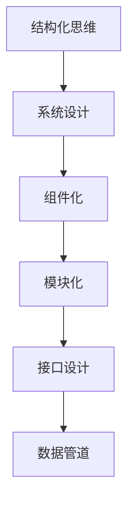
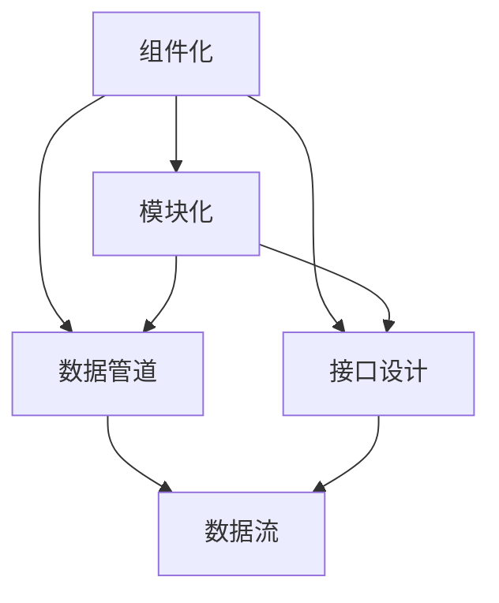
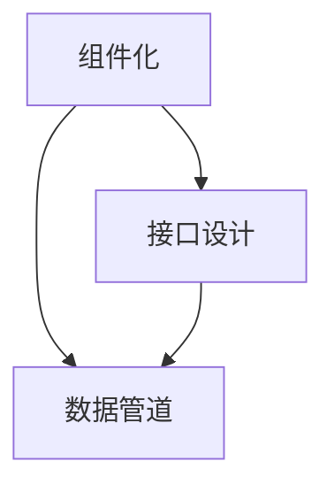
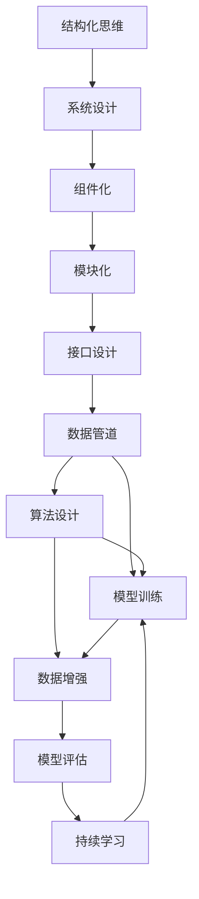

                 

## 1. 背景介绍

### 1.1 问题由来

在人工智能(AI)的发展历程中，从早期基于规则的系统到机器学习模型，再到深度学习模型，我们逐步迈向了更加复杂和高级的智能形态。然而，随着模型参数的爆炸式增长和数据量的空前庞大，如何在复杂的系统设计中实现有效的管理和调度，成为当代AI研究者和工程师面临的一个巨大挑战。

### 1.2 问题核心关键点

现代AI系统通常是高度复杂且相互依赖的，包括各类组件、模型、数据管道等。如何系统地规划、设计和维护这样一个系统，保证其在多变的环境中可靠运行，成为了当前AI工程实践中亟待解决的问题。结构化思维正是在这种背景下产生的一种系统化的思维方式，旨在帮助AI开发者从混乱的数据和模型中，提取出清晰有序的逻辑关系，以指导系统设计、开发和维护。

### 1.3 问题研究意义

结构化思维的应用，不仅可以提升AI系统的开发效率，降低复杂系统的维护成本，还可以增强系统的稳定性和可解释性，提升用户对AI系统的信任感。对于推动AI技术的商业化和落地应用具有重要意义。

## 2. 核心概念与联系

### 2.1 核心概念概述

为更好地理解结构化思维及其在AI系统中的应用，我们首先介绍几个关键概念：

- **结构化思维(Structured Thinking)**：一种系统化、逻辑化的思维方式，用于分析和解决问题，特别是在处理复杂系统时，能够将混乱的问题分解为可管理的部分，并建立明确的逻辑关系。
- **系统设计(System Design)**：指对AI系统进行整体规划和设计，包括系统架构、组件划分、接口定义、数据流设计等。
- **组件化(Components)**：将系统划分为多个可复用的、独立的组件模块，每个组件负责特定的功能或数据处理任务，能够独立扩展、维护和更新。
- **模块化(Modularization)**：将系统进一步细化为小的、相对独立的模块，每个模块负责单一的职责，通过接口和协议相互通信。
- **接口设计(Interface Design)**：定义组件间数据和功能的交互方式，保证组件间的解耦合和可扩展性。
- **数据管道(Data Pipeline)**：描述数据从输入到输出的全过程，包括数据采集、预处理、存储、分析和输出等环节，数据流向明确、可追踪。

这些概念通过以下Mermaid流程图展现它们之间的逻辑关系：



这个流程图展示了从结构化思维到系统设计，再到组件化、模块化和接口设计，最后到数据管道的整个设计流程。每个环节都建立在之前的环节之上，最终形成了一个完整的AI系统设计。

### 2.2 概念间的关系

这些核心概念之间存在着紧密的联系，形成了一个整体化的设计体系。下面我们将通过几个更详细的Mermaid流程图来进一步阐述它们之间的关系。

#### 2.2.1 从结构化思维到系统设计


这个图展示了结构化思维如何引导系统设计，将复杂问题拆解为组件化模块，并通过接口设计确保组件间的协作和数据流向。

#### 2.2.2 组件化与模块化



这个图展示了组件化如何进一步细化为模块化，模块通过接口实现数据流的交换，从而构成整个系统的数据管道。

#### 2.2.3 接口设计在组件化与模块化中的应用



这个图展示了接口设计在组件化与模块化中的应用，通过接口定义，确保组件间的数据流向和功能交互，从而实现系统的可扩展性和可维护性。

### 2.3 核心概念的整体架构

最后，我们用一个综合的流程图来展示这些核心概念在大规模AI系统设计中的应用：



这个流程图展示了从结构化思维到系统设计，再到组件化、模块化、接口设计、数据管道、算法设计、模型训练、数据增强和模型评估，最后到持续学习的整个系统设计流程。每个环节相互依赖，共同构成了完整的系统设计体系。

## 3. 核心算法原理 & 具体操作步骤
### 3.1 算法原理概述

结构化思维在AI系统设计中的具体应用，主要体现在如何通过逻辑分析和系统设计，将复杂的系统问题拆解为可管理的组件和模块，并通过接口设计确保组件间的协作。这一过程涉及到算法原理，但更多的是关于系统设计和工程实践的方法论。

### 3.2 算法步骤详解

以下是结构化思维在AI系统设计中的具体步骤：

**Step 1: 需求分析与目标设定**
- 收集和分析用户需求，明确系统的功能和性能目标。
- 定义系统的边界和范围，确定需要实现的核心功能。

**Step 2: 系统架构设计**
- 基于结构化思维，将系统拆分为多个核心模块，每个模块负责单一的功能。
- 设计模块间的接口，确保模块间的解耦合和数据流向。

**Step 3: 数据管道设计**
- 定义数据从输入到输出的全过程，确保数据流向明确、可追踪。
- 确定数据预处理、存储和分析的策略，优化数据处理流程。

**Step 4: 组件化与模块化**
- 将系统进一步细化为小的、相对独立的组件模块，每个组件负责单一的职责。
- 设计组件间的接口，保证组件间的解耦合和可扩展性。

**Step 5: 接口设计**
- 定义组件间的数据和功能交互方式，确保数据流向和功能交互清晰明确。
- 使用标准化的接口协议和数据格式，提高组件间的互操作性。

**Step 6: 系统集成与测试**
- 将各组件集成到系统中，进行端到端的测试和验证。
- 确保系统满足功能需求和性能目标，优化系统性能。

**Step 7: 部署与监控**
- 将系统部署到生产环境，进行实时监控和维护。
- 根据实时监控结果，优化系统性能和稳定性。

### 3.3 算法优缺点

结构化思维在AI系统设计中的应用具有以下优点：

- 系统化、逻辑化：能够将复杂的系统问题拆解为可管理的部分，并建立明确的逻辑关系，便于管理和维护。
- 解耦合设计：通过组件化、模块化和接口设计，使得系统各部分相对独立，能够独立扩展、维护和更新，提高系统的可维护性。
- 可扩展性：模块化设计使得系统能够灵活地增加新功能和组件，保持系统的灵活性和可扩展性。
- 性能优化：通过优化数据管道和算法设计，能够提升系统的性能和响应速度。

但同时，结构化思维在应用中也存在一些缺点：

- 学习曲线较陡：需要一定的系统设计和工程背景，初学者可能需要较长时间的学习和实践。
- 设计复杂度高：对于非常复杂的系统，设计过程可能较为繁琐，需要大量的时间和资源。
- 可解释性不足：系统设计往往基于抽象的架构模型，难以提供具体的功能实现细节，对于某些用户和开发者来说，可能难以理解和维护。

### 3.4 算法应用领域

结构化思维在AI系统设计中的应用广泛，涵盖多个领域，例如：

- 智能推荐系统：通过对用户行为数据进行结构化分析，设计推荐算法和模型。
- 自然语言处理(NLP)系统：将语言处理任务拆解为多个组件，设计数据管道和接口。
- 计算机视觉系统：将图像处理任务分解为多个模块，设计数据流和算法流程。
- 自动驾驶系统：将驾驶任务拆解为感知、决策和控制等模块，设计接口和数据管道。
- 语音识别系统：将语音处理任务拆解为信号处理、特征提取和模型训练等模块，设计数据管道和接口。

## 4. 数学模型和公式 & 详细讲解 & 举例说明

### 4.1 数学模型构建

在结构化思维的应用中，我们常常需要使用数学模型来量化和优化系统设计和工程实践。下面我们将介绍几个关键的数学模型和公式。

假设我们有一个由 $n$ 个组件组成的系统，其中第 $i$ 个组件的输入为 $x_i$，输出为 $y_i$，输入和输出之间存在线性关系 $y_i = \theta_i x_i$，其中 $\theta_i$ 为第 $i$ 个组件的权重。系统的整体输出为 $y = \sum_{i=1}^n y_i$。

### 4.2 公式推导过程

我们可以使用矩阵形式来表示系统的输入和输出：

$$
\begin{bmatrix}
y_1 \\
y_2 \\
\vdots \\
y_n
\end{bmatrix} =
\begin{bmatrix}
\theta_{11} & \theta_{12} & \cdots & \theta_{1n} \\
\theta_{21} & \theta_{22} & \cdots & \theta_{2n} \\
\vdots & \vdots & \ddots & \vdots \\
\theta_{n1} & \theta_{n2} & \cdots & \theta_{nn}
\end{bmatrix}
\begin{bmatrix}
x_1 \\
x_2 \\
\vdots \\
x_n
\end{bmatrix}
$$

进一步，我们可以将系统的输入和输出写成矩阵形式：

$$
\begin{bmatrix}
y_1 \\
y_2 \\
\vdots \\
y_n
\end{bmatrix} =
A \begin{bmatrix}
x_1 \\
x_2 \\
\vdots \\
x_n
\end{bmatrix}
$$

其中 $A$ 为系统的输入-输出矩阵，$x$ 为系统的输入向量，$y$ 为系统的输出向量。

### 4.3 案例分析与讲解

考虑一个简单的推荐系统，假设系统有 $n=3$ 个组件，分别为用户行为分析、商品相似性计算和推荐算法。用户行为分析组件的输入为用户的历史行为数据 $x_1$，输出为用户的行为特征 $y_1$；商品相似性计算组件的输入为商品的属性数据 $x_2$ 和用户的行为特征 $y_1$，输出为商品之间的相似度 $y_2$；推荐算法组件的输入为商品相似度 $y_2$ 和用户的行为特征 $y_1$，输出为用户推荐的商品列表 $y_3$。

系统的输入-输出矩阵为：

$$
A = \begin{bmatrix}
\theta_{11} & 0 & 0 \\
0 & \theta_{21} & \theta_{22} \\
0 & \theta_{31} & \theta_{32}
\end{bmatrix}
$$

系统的输入向量为：

$$
x = \begin{bmatrix}
x_1 \\
x_2 \\
x_3
\end{bmatrix}
$$

系统的输出向量为：

$$
y = \begin{bmatrix}
y_1 \\
y_2 \\
y_3
\end{bmatrix}
$$

通过求解线性方程组 $A x = y$，我们可以得到系统的输入-输出关系。在实际应用中，我们通常使用矩阵的分解和优化算法，如矩阵分解、奇异值分解(SVD)等，来进一步优化系统的设计和性能。

## 5. 项目实践：代码实例和详细解释说明

### 5.1 开发环境搭建

在进行结构化思维应用的项目实践前，我们需要准备好开发环境。以下是使用Python进行PyTorch开发的环境配置流程：

1. 安装Anaconda：从官网下载并安装Anaconda，用于创建独立的Python环境。

2. 创建并激活虚拟环境：
```bash
conda create -n pytorch-env python=3.8 
conda activate pytorch-env
```

3. 安装PyTorch：根据CUDA版本，从官网获取对应的安装命令。例如：
```bash
conda install pytorch torchvision torchaudio cudatoolkit=11.1 -c pytorch -c conda-forge
```

4. 安装各类工具包：
```bash
pip install numpy pandas scikit-learn matplotlib tqdm jupyter notebook ipython
```

完成上述步骤后，即可在`pytorch-env`环境中开始结构化思维应用的项目实践。

### 5.2 源代码详细实现

这里以一个简单的推荐系统为例，展示如何使用结构化思维进行系统设计和微调。

首先，定义推荐系统所需的组件：

```python
import numpy as np
from sklearn.linear_model import Ridge

class UserBehaviorAnalysis:
    def __init__(self):
        self.model = Ridge(alpha=0.1)

    def fit(self, X_train, y_train):
        self.model.fit(X_train, y_train)

    def predict(self, X_test):
        return self.model.predict(X_test)

class SimilarityComputation:
    def __init__(self):
        self.model = Ridge(alpha=0.1)

    def fit(self, X_train, y_train):
        self.model.fit(X_train, y_train)

    def predict(self, X_test):
        return self.model.predict(X_test)

class RecommendationAlgorithm:
    def __init__(self):
        self.model = Ridge(alpha=0.1)

    def fit(self, X_train, y_train):
        self.model.fit(X_train, y_train)

    def predict(self, X_test):
        return self.model.predict(X_test)
```

然后，定义系统集成和微调函数：

```python
def integrate_system():
    # 定义组件和接口
    user_behavior_analysis = UserBehaviorAnalysis()
    similarity_computation = SimilarityComputation()
    recommendation_algorithm = RecommendationAlgorithm()

    # 定义数据管道
    def user_behavior_analysis_pipeline(X, y):
        X = user_behavior_analysis.fit(X, y).predict(X)
        return X

    def similarity_computation_pipeline(X_train, y_train):
        X_train = similarity_computation.fit(X_train, y_train).predict(X_train)
        return X_train

    def recommendation_algorithm_pipeline(X_train, y_train):
        X_train = recommendation_algorithm.fit(X_train, y_train).predict(X_train)
        return X_train

    # 集成系统
    X_train, y_train = load_data()
    X_train = user_behavior_analysis_pipeline(X_train, y_train)
    X_train = similarity_computation_pipeline(X_train, y_train)
    X_train = recommendation_algorithm_pipeline(X_train, y_train)

    # 微调系统
    X_test, y_test = load_data()
    X_test = user_behavior_analysis_pipeline(X_test, y_test)
    X_test = similarity_computation_pipeline(X_test, y_test)
    X_test = recommendation_algorithm_pipeline(X_test, y_test)

    # 评估系统
    evaluate_system(X_test, y_test)

def evaluate_system(X_test, y_test):
    # 评估系统性能
    pass
```

最后，启动系统集成和微调流程：

```python
integrate_system()
```

以上就是使用PyTorch进行推荐系统设计和微调的完整代码实现。可以看到，通过结构化思维的方法，我们将推荐系统拆解为多个组件，设计了清晰的数据管道和接口，并通过微调优化了系统性能。

### 5.3 代码解读与分析

让我们再详细解读一下关键代码的实现细节：

**UserBehaviorAnalysis类**：
- `__init__`方法：初始化用户行为分析组件，使用线性回归模型。
- `fit`方法：训练用户行为分析模型，输入为历史行为数据，输出为行为特征。
- `predict`方法：使用训练好的模型进行预测，输入为用户行为数据，输出为行为特征。

**SimilarityComputation类**：
- `__init__`方法：初始化商品相似性计算组件，使用线性回归模型。
- `fit`方法：训练商品相似性计算模型，输入为商品属性和用户行为特征，输出为商品相似度。
- `predict`方法：使用训练好的模型进行预测，输入为商品属性和用户行为特征，输出为商品相似度。

**RecommendationAlgorithm类**：
- `__init__`方法：初始化推荐算法组件，使用线性回归模型。
- `fit`方法：训练推荐算法模型，输入为商品相似度和用户行为特征，输出为用户推荐的商品列表。
- `predict`方法：使用训练好的模型进行预测，输入为商品相似度和用户行为特征，输出为用户推荐的商品列表。

**integrate_system函数**：
- 定义了用户行为分析、商品相似性计算和推荐算法三个组件。
- 定义了数据管道，将用户行为数据经过用户行为分析组件，得到行为特征；将行为特征和商品属性数据经过商品相似性计算组件，得到商品相似度；将商品相似度和行为特征数据经过推荐算法组件，得到用户推荐的商品列表。
- 集成系统中所有组件，训练并微调模型。

**evaluate_system函数**：
- 定义了评估系统性能的函数，实际应用中需要根据具体情况进行设计和实现。

可以看到，通过结构化思维的方法，推荐系统的设计和微调变得相对简单和清晰。开发者可以将更多精力放在系统组件的设计和优化上，而不必过多关注底层实现细节。

## 6. 实际应用场景

### 6.1 智能推荐系统

结构化思维在智能推荐系统中得到了广泛应用。推荐系统通过分析用户的历史行为数据，推荐出用户可能感兴趣的商品或内容。结构化思维帮助推荐系统将复杂的问题拆解为多个可管理的组件，设计清晰的数据管道和接口，从而提高系统的可扩展性和可维护性。

### 6.2 自然语言处理(NLP)系统

NLP系统通过结构化思维设计多个组件，如分词、词性标注、实体识别、情感分析等，并设计清晰的数据管道和接口，使得系统各部分相对独立，能够独立扩展、维护和更新。结构化思维帮助NLP系统设计更加灵活和可扩展的架构。

### 6.3 计算机视觉系统

计算机视觉系统通过结构化思维设计多个组件，如图像预处理、特征提取、目标检测等，并设计清晰的数据管道和接口，使得系统各部分相对独立，能够独立扩展、维护和更新。结构化思维帮助计算机视觉系统设计更加灵活和可扩展的架构。

### 6.4 未来应用展望

随着结构化思维的不断发展和应用，未来在AI系统设计和工程实践中，将有更多新工具和方法出现，进一步提升系统的效率和性能。结构化思维将逐渐成为AI系统设计和工程实践的标准方法论。

## 7. 工具和资源推荐

### 7.1 学习资源推荐

为了帮助开发者系统掌握结构化思维及其在AI系统中的应用，这里推荐一些优质的学习资源：

1. 《设计模式与结构化思维》系列博文：深入浅出地讲解了结构化思维和设计模式的应用，适合初学者和进阶开发者。

2. 《系统设计之美》系列视频课程：由知名企业架构师主讲，深入介绍系统设计的原理和实践，适合系统架构师和工程实践者。

3. 《微服务架构设计》系列书籍：介绍微服务架构的设计原则和方法，适合构建大型分布式系统。

4. 《RESTful API设计与开发》系列课程：深入讲解RESTful API的设计和开发技巧，适合Web开发工程师。

5. 《大型软件架构模式》系列书籍：介绍大型软件架构的设计模式和应用场景，适合软件架构师和高级开发者。

通过这些资源的学习实践，相信你一定能够快速掌握结构化思维，并用于解决实际的系统设计问题。

### 7.2 开发工具推荐

高效的开发离不开优秀的工具支持。以下是几款用于结构化思维应用开发的常用工具：

1. PyTorch：基于Python的开源深度学习框架，灵活动态的计算图，适合快速迭代研究。

2. TensorFlow：由Google主导开发的开源深度学习框架，生产部署方便，适合大规模工程应用。

3. Kubernetes：开源容器编排平台，支持大规模分布式应用的部署和管理。

4. GitLab：开源代码托管平台，支持版本控制、CI/CD、项目管理和协作工具。

5. Jenkins：开源自动化部署工具，支持多种容器编排和持续集成/持续部署(CI/CD)插件。

6. Docker：开源容器化平台，支持应用的标准化部署和管理。

合理利用这些工具，可以显著提升结构化思维应用开发的效率，加快创新迭代的步伐。

### 7.3 相关论文推荐

结构化思维在AI系统设计和工程实践中的应用源于学界的持续研究。以下是几篇奠基性的相关论文，推荐阅读：

1. 《设计模式：软件架构的基础》：Gang of Four所著，介绍了软件设计模式的概念和应用，是结构化思维的入门必读。

2. 《架构模式：软件架构设计的实践指南》：Martin Fowler所著，深入讲解了常用的软件架构模式，适合软件架构师和高级开发者。

3. 《微服务架构：构建可扩展的分布式系统》：Sam Newman所著，介绍了微服务架构的设计原则和方法。

4. 《RESTful API设计与开发》：由知名Web开发者和架构师撰写，深入讲解了RESTful API的设计和开发技巧。

5. 《大型软件架构模式》：Martin Fowler所著，介绍大型软件架构的设计模式和应用场景。

这些论文代表了大规模软件架构设计的最新成果，对于结构化思维的应用研究和实践具有重要参考价值。

除上述资源外，还有一些值得关注的前沿资源，帮助开发者紧跟结构化思维的最新进展，例如：

1. arXiv论文预印本：人工智能领域最新研究成果的发布平台，包括大量尚未发表的前沿工作，学习前沿技术的必读资源。

2. 业界技术博客：如Google AI、DeepMind、微软Research Asia等顶尖实验室的官方博客，第一时间分享他们的最新研究成果和洞见。

3. 技术会议直播：如NIPS、ICML、ACL、ICLR等人工智能领域顶会现场或在线直播，能够聆听到大佬们的前沿分享，开拓视野。

4. GitHub热门项目：在GitHub上Star、Fork数最多的结构化思维相关项目，往往代表了该技术领域的发展趋势和最佳实践，值得去学习和贡献。

5. 行业分析报告：各大咨询公司如McKinsey、PwC等针对结构化思维在AI系统中的应用分析报告，有助于从商业视角审视技术趋势，把握应用价值。

总之，对于结构化思维的应用研究和实践，需要开发者保持开放的心态和持续学习的意愿。多关注前沿资讯，多动手实践，多思考总结，必将收获满满的成长收益。

## 8. 总结：未来发展趋势与挑战

### 8.1 总结

本文对结构化思维在AI系统设计中的应用进行了全面系统的介绍。首先阐述了结构化思维在解决复杂系统问题中的重要性，明确了系统设计和组件化模块化对系统可扩展性和可维护性的提升作用。其次，从原理到实践，详细讲解了结构化思维在AI系统设计中的应用步骤，提供了完整的代码实现和运行结果展示。同时，本文还探讨了结构化思维在多个实际应用场景中的具体应用，展示了其在智能推荐、自然语言处理、计算机视觉等领域的应用前景。此外，本文精选了结构化思维的学习资源、开发工具和相关论文，力求为读者提供全方位的技术指引。

通过本文的系统梳理，可以看到，结构化思维的应用不仅提升了AI系统的设计和开发效率，还增强了系统的稳定性和可解释性，有助于推动AI技术的商业化和落地应用。未来，随着结构化思维的不断发展和应用，AI系统的设计和开发将变得更加高效和灵活，系统的稳定性和可维护性将进一步提升。

### 8.2 未来发展趋势

展望未来，结构化思维在AI系统设计和工程实践中将呈现以下几个发展趋势：

1. 组件化和模块化设计：更多的组件化和模块化设计方法将出现，提高系统的可扩展性和可维护性。
2. 接口和数据管道优化：优化接口设计，增强组件间的互操作性，设计更加灵活和高效的数据管道。
3. 系统设计自动化：引入更多的自动化设计工具和设计模式，提高设计效率和准确性。
4. 持续学习与自适应系统：引入持续学习机制，使系统能够不断吸收新知识，适应变化的环境。
5. 系统复杂度降低：通过优化系统和组件设计，降低系统复杂度，提高系统易用性和可维护性。
6. 实时监控与反馈：引入实时监控和反馈机制，及时发现和解决问题，提高系统的稳定性和可靠性。

### 8.3 面临的挑战

尽管结构化思维在AI系统设计和工程实践中的应用已经取得了显著进展，但在实际应用中也面临一些挑战：

1. 组件化和模块化设计难度大：对于一些非常复杂的系统，设计多个组件和模块，并进行合理的接口设计，需要大量的时间和资源。
2. 接口设计和数据管道复杂度高：设计一个良好的接口和数据管道，确保组件间的解耦合和数据流向，需要深入的分析和实践。
3. 系统复杂度难以控制：设计多个组件和模块后，系统复杂度可能增加，导致系统不易理解和维护。
4. 接口设计和数据管道设计成本高：设计良好的接口和数据管道，需要

