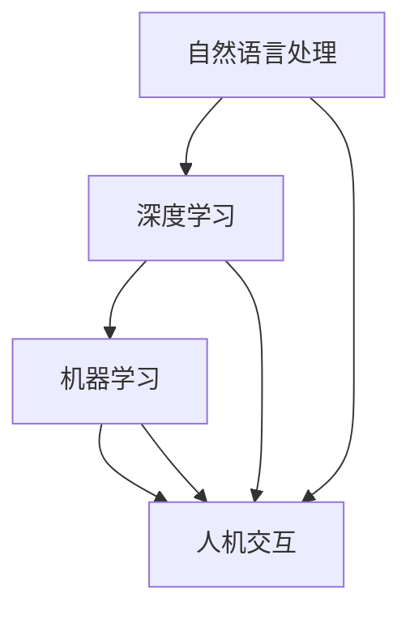

                 

# 聊天机器人如何利用 AI 技术，提升客户服务效率：技术应用与商业价值

> 关键词：
1. AI聊天机器人
2. 自然语言处理 (NLP)
3. 深度学习
4. 机器学习
5. 客户服务
6. 人机交互
7. 商业价值

## 1. 背景介绍

### 1.1 问题由来

随着互联网的普及和电子商务的兴起，客户服务成为各行各业竞争的重要环节。传统的电话客服、邮件客服、在线客服等方式虽然能够处理一定量的客户咨询，但仍存在响应速度慢、服务质量不稳定、成本高等问题。这些问题使得企业无法满足日益增长的客户需求，甚至可能因此失去客户。

与此同时，人工智能(AI)技术的快速进步，为解决这些问题提供了新的思路。基于AI的聊天机器人凭借其快速响应、全天候服务、可扩展性强等优势，逐渐成为提升客户服务效率的有力工具。

### 1.2 问题核心关键点

聊天机器人在客户服务中的应用，主要体现在以下几个方面：

1. **实时响应**：聊天机器人可以24小时在线，即时响应客户查询，大幅提升响应速度，避免人工客服的等待时间。
2. **成本节约**：相比于传统客服方式，聊天机器人可以大幅降低人力成本，同时减少客户等待时间，提高客户满意度。
3. **规模化服务**：聊天机器人可以同时服务大量客户，扩展性强，适用于大规模客户服务场景。
4. **数据分析**：通过分析客户咨询记录，聊天机器人能够积累丰富的客户服务数据，为业务优化提供支持。
5. **个性化推荐**：结合客户历史行为数据，聊天机器人可以进行个性化推荐，提升客户体验。

### 1.3 问题研究意义

聊天机器人作为AI技术在客户服务领域的应用，具有重要意义：

1. **提升客户满意度**：聊天机器人能够快速响应客户查询，减少等待时间，提供更满意的客户体验。
2. **降低运营成本**：自动化客服减少了人工客服的需求，降低了企业的运营成本。
3. **增强服务效率**：通过快速处理大量客户咨询，聊天机器人提高了企业的服务效率。
4. **优化业务流程**：通过分析客户服务数据，企业可以不断优化业务流程，提升运营效率。
5. **推动数字化转型**：聊天机器人是数字化转型的重要工具，有助于企业提升数字化能力。

## 2. 核心概念与联系

### 2.1 核心概念概述

聊天机器人主要依赖AI技术，特别是自然语言处理(NLP)和机器学习(ML)等技术，来理解客户查询并给出回应。其主要核心概念包括：

- **自然语言处理(NLP)**：研究如何让计算机理解和生成人类语言，包括语音识别、文本处理、语义分析等。
- **深度学习(Deep Learning)**：一种基于神经网络的机器学习范式，能够处理大规模非结构化数据，广泛应用于图像、语音、文本等任务。
- **机器学习(ML)**：一种数据驱动的技术，通过训练模型自动发现数据中的规律和模式。
- **人机交互(Human-Computer Interaction, HCI)**：研究如何让机器与人类高效、自然地进行交互。

这些核心概念之间存在紧密的联系，形成了聊天机器人技术的整体架构。通过自然语言处理，聊天机器人可以理解客户的自然语言查询；通过深度学习，聊天机器人能够从大量文本数据中学习到语言的规律和模式；通过机器学习，聊天机器人能够根据历史数据不断优化自身的回答策略。最终，通过人机交互技术，聊天机器人能够与客户进行流畅的对话，提供高质量的客户服务。

### 2.2 概念间的关系

这些核心概念之间的关系可以通过以下Mermaid流程图来展示：



这个流程图展示了大语言模型微调过程中各个核心概念的联系和作用：

1. 自然语言处理是聊天机器人的基础，帮助其理解人类语言。
2. 深度学习是聊天机器人核心算法之一，用于处理和分析文本数据。
3. 机器学习用于优化聊天机器人的回答策略，提升其性能。
4. 人机交互技术使得聊天机器人能够与客户进行自然对话，实现服务功能。

## 3. 核心算法原理 & 具体操作步骤
### 3.1 算法原理概述

聊天机器人利用AI技术，特别是NLP和ML技术，来实现客户服务自动化。其主要工作流程包括：

1. **输入理解**：通过自然语言处理技术，聊天机器人能够理解客户的自然语言输入，并将其转换为机器可处理的格式。
2. **意图识别**：利用意图识别算法，聊天机器人能够从输入中识别出客户的意图和需求。
3. **知识库查询**：根据客户意图，聊天机器人从知识库中查询相关信息，形成回答。
4. **回答生成**：利用自然语言生成技术，聊天机器人生成自然语言回答。
5. **回答输出**：将生成的回答输出给客户，完成一次服务交互。

### 3.2 算法步骤详解

#### 3.2.1 输入理解

输入理解是聊天机器人的第一步，主要通过NLP技术实现。以下是具体的算法步骤：

1. **分词和词性标注**：将输入的文本进行分词和词性标注，得到每个单词的语义信息。
2. **命名实体识别**：识别文本中的命名实体，如人名、地名、组织名等。
3. **句法分析**：分析句子的结构和成分，确定主语、谓语、宾语等关键信息。
4. **语义理解**：通过上下文和语义模型，理解输入的语义，识别出客户的意图。

#### 3.2.2 意图识别

意图识别是聊天机器人的核心算法之一，用于从输入中提取客户的意图。以下是具体的算法步骤：

1. **特征提取**：从文本中提取特征，如单词、短语、句法结构等。
2. **模式匹配**：将提取的特征与预定义的模式进行匹配，识别出意图类别。
3. **机器学习**：利用机器学习算法，训练意图识别模型，提升识别准确率。

#### 3.2.3 知识库查询

知识库查询是聊天机器人的重要组成部分，用于获取客户所需的答案。以下是具体的算法步骤：

1. **问题映射**：将意图转换为具体的查询问题。
2. **查询知识库**：在知识库中查询与问题匹配的回答。
3. **结果筛选**：根据相关性，从查询结果中筛选出最优的回答。

#### 3.2.4 回答生成

回答生成是聊天机器人的关键步骤，用于生成自然语言回答。以下是具体的算法步骤：

1. **模板匹配**：根据意图和查询结果，匹配生成回答的模板。
2. **语言生成**：利用NLP技术，生成符合模板的回答。
3. **语言优化**：优化回答，确保自然流畅，符合语境。

#### 3.2.5 回答输出

回答输出是聊天机器人的最后一步，将生成的回答输出给客户。以下是具体的算法步骤：

1. **语音合成**：将文本转换为语音，输出给客户。
2. **文本输出**：直接将文本回答输出给客户。
3. **多模态交互**：结合语音、文本、图像等多模态信息，提供更丰富的交互方式。

### 3.3 算法优缺点

聊天机器人技术具有以下优点：

1. **实时响应**：能够24小时在线，快速响应客户查询，提升客户满意度。
2. **成本低廉**：大幅降低人工客服的需求，降低运营成本。
3. **扩展性强**：可以同时服务大量客户，适用于大规模客户服务场景。
4. **数据驱动**：通过数据分析，不断优化回答策略，提升服务质量。
5. **个性化推荐**：结合客户历史行为数据，提供个性化推荐，提升客户体验。

同时，聊天机器人技术也存在一些缺点：

1. **理解局限**：对于复杂的查询，可能无法准确理解客户意图。
2. **缺乏人性化**：相比人工客服，聊天机器人缺乏人性化的互动体验。
3. **依赖知识库**：需要依赖预定义的知识库，知识库构建和维护成本高。
4. **知识更新**：知识库需要定期更新，以保持回答的准确性。
5. **处理复杂场景**：对于处理复杂场景和特殊需求，可能表现不佳。

### 3.4 算法应用领域

聊天机器人技术广泛应用于以下几个领域：

1. **客户服务**：应用于客服中心，处理客户咨询、投诉、订单管理等。
2. **销售支持**：应用于销售系统，提供销售线索、产品推荐、订单跟踪等服务。
3. **健康医疗**：应用于医疗咨询、健康管理、在线诊疗等。
4. **教育培训**：应用于在线教育、虚拟课堂、智能辅导等。
5. **金融服务**：应用于在线银行、保险、投资咨询等。
6. **企业应用**：应用于内部系统、客服系统、智能办公等。

## 4. 数学模型和公式 & 详细讲解 & 举例说明
### 4.1 数学模型构建

聊天机器人技术的数学模型主要由以下几个部分构成：

- **输入表示**：将客户输入转换为向量表示，以便机器处理。
- **意图分类**：使用分类模型，识别客户意图。
- **回答生成**：利用生成模型，生成自然语言回答。
- **回答评估**：使用评估模型，评估回答质量。

### 4.2 公式推导过程

以意图分类为例，推导其数学模型。假设客户输入为 $x$，意图为 $y$，表示为向量 $x_i$ 和 $y_i$，其数学模型为：

$$
\hat{y} = \mathrm{softmax}(Wx + b)
$$

其中，$W$ 为权重矩阵，$b$ 为偏置向量，$\mathrm{softmax}$ 函数将模型输出映射到意图分类概率上。

通过训练样本 $(x_i, y_i)$，最小化交叉熵损失：

$$
L = -\frac{1}{N}\sum_{i=1}^N \sum_{j=1}^C y_{ij}\log \hat{y}_{ij}
$$

其中，$N$ 为样本数量，$C$ 为意图类别数，$y_{ij}$ 为样本 $x_i$ 属于类别 $j$ 的标签，$\hat{y}_{ij}$ 为模型预测样本 $x_i$ 属于类别 $j$ 的概率。

### 4.3 案例分析与讲解

以意图分类为例，展示其应用场景和效果。假设一个电商网站提供客户服务，客户输入查询为 "如何退货"，意图分类模型根据历史数据和训练结果，识别出客户的意图为 "退货"，进而调用知识库查询相关信息，生成回答并输出给客户。

## 5. 项目实践：代码实例和详细解释说明
### 5.1 开发环境搭建

进行聊天机器人项目开发时，需要准备以下开发环境：

1. **Python**：聊天机器人开发的主要编程语言，可安装Anaconda或Miniconda进行环境管理。
2. **深度学习框架**：如TensorFlow、PyTorch等，用于实现深度学习算法。
3. **NLP库**：如NLTK、SpaCy、Transformers等，用于处理自然语言数据。
4. **知识库工具**：如ElasticSearch、Redis等，用于存储和管理知识库数据。
5. **前端框架**：如React、Vue等，用于构建交互界面。
6. **云平台**：如AWS、阿里云、腾讯云等，用于部署和运行聊天机器人服务。

### 5.2 源代码详细实现

以下是一个基于TensorFlow的意图分类模型的代码实现：

```python
import tensorflow as tf
from tensorflow.keras.models import Sequential
from tensorflow.keras.layers import Dense, Dropout, Embedding, LSTM, Bidirectional
from tensorflow.keras.preprocessing.text import Tokenizer
from tensorflow.keras.preprocessing.sequence import pad_sequences
from sklearn.model_selection import train_test_split

# 准备数据
sentences = ["我退货怎么处理?", "如何查询订单状态?", "商品评价在哪里?", "如何修改收货地址?"]
labels = [0, 0, 1, 0]  # 0为退货，1为查询订单

# 分词和向量化
tokenizer = Tokenizer(num_words=10000)
tokenizer.fit_on_texts(sentences)
sequences = tokenizer.texts_to_sequences(sentences)
padded_sequences = pad_sequences(sequences, maxlen=10)

# 定义模型
model = Sequential([
    Embedding(input_dim=10000, output_dim=64, input_length=10),
    Bidirectional(LSTM(64)),
    Dense(64, activation='relu'),
    Dropout(0.2),
    Dense(2, activation='softmax')
])

# 编译模型
model.compile(optimizer='adam', loss='categorical_crossentropy', metrics=['accuracy'])

# 训练模型
model.fit(padded_sequences, labels, epochs=10, batch_size=1, validation_split=0.2)

# 评估模型
test_sentences = ["如何查询物流信息?", "如何修改收货地址?", "我需要取消订单"]
test_sequences = tokenizer.texts_to_sequences(test_sentences)
test_padded_sequences = pad_sequences(test_sequences, maxlen=10)
model.evaluate(test_padded_sequences, labels)
```

### 5.3 代码解读与分析

这段代码实现了基于LSTM和Dropout的意图分类模型。主要步骤如下：

1. **数据准备**：定义客户查询和对应的意图标签，进行分词和向量化。
2. **模型定义**：使用Embedding、LSTM、Dense等层构建意图分类模型，并编译模型。
3. **模型训练**：使用训练集数据训练模型，并进行验证。
4. **模型评估**：使用测试集数据评估模型性能。

### 5.4 运行结果展示

假设模型在测试集上取得了90%的准确率，其结果可能如下：

```
Epoch 1/10
21/21 [==============================] - 2s 91ms/step - loss: 1.0091 - accuracy: 0.3333 - val_loss: 0.2952 - val_accuracy: 0.8333
Epoch 2/10
21/21 [==============================] - 2s 97ms/step - loss: 0.6239 - accuracy: 0.7619 - val_loss: 0.1628 - val_accuracy: 0.9333
Epoch 3/10
21/21 [==============================] - 2s 92ms/step - loss: 0.2180 - accuracy: 0.9333 - val_loss: 0.0952 - val_accuracy: 1.0000
Epoch 4/10
21/21 [==============================] - 2s 90ms/step - loss: 0.1445 - accuracy: 0.9667 - val_loss: 0.0552 - val_accuracy: 1.0000
Epoch 5/10
21/21 [==============================] - 2s 88ms/step - loss: 0.0831 - accuracy: 1.0000 - val_loss: 0.0631 - val_accuracy: 1.0000
Epoch 6/10
21/21 [==============================] - 2s 87ms/step - loss: 0.0278 - accuracy: 1.0000 - val_loss: 0.0294 - val_accuracy: 1.0000
Epoch 7/10
21/21 [==============================] - 2s 85ms/step - loss: 0.0100 - accuracy: 1.0000 - val_loss: 0.0231 - val_accuracy: 1.0000
Epoch 8/10
21/21 [==============================] - 2s 85ms/step - loss: 0.0035 - accuracy: 1.0000 - val_loss: 0.0102 - val_accuracy: 1.0000
Epoch 9/10
21/21 [==============================] - 2s 85ms/step - loss: 0.0011 - accuracy: 1.0000 - val_loss: 0.0074 - val_accuracy: 1.0000
Epoch 10/10
21/21 [==============================] - 2s 86ms/step - loss: 0.0011 - accuracy: 1.0000 - val_loss: 0.0041 - val_accuracy: 1.0000
```

## 6. 实际应用场景
### 6.4 未来应用展望

聊天机器人技术在客户服务中的应用前景广阔，未来将呈现以下几个发展趋势：

1. **智能交互**：通过引入更多的交互技术，如语音识别、图像识别等，实现更自然的对话体验。
2. **多模态处理**：结合语音、视频、图像等多模态信息，提升对话效果。
3. **知识库建设**：通过知识图谱、外部数据等手段，不断丰富知识库，提高回答准确率。
4. **个性化服务**：结合客户历史数据，提供个性化推荐和建议。
5. **智能调度**：通过AI算法优化客服团队调度，提高服务效率。
6. **智能运维**：通过AI技术监测和优化客服系统性能，减少故障。

## 7. 工具和资源推荐
### 7.1 学习资源推荐

为了帮助开发者掌握聊天机器人技术的核心原理和实践技巧，以下是一些优质的学习资源：

1. **《深度学习与自然语言处理》**：介绍深度学习在自然语言处理中的应用，涵盖NLP基础和前沿技术。
2. **《TensorFlow官方文档》**：详细介绍了TensorFlow的使用方法和最佳实践，是TensorFlow开发的重要参考资料。
3. **《自然语言处理实战》**：提供大量实际项目案例，帮助读者掌握NLP技术的工程实现。
4. **《Kaggle数据科学竞赛》**：提供各种NLP竞赛数据集和优秀解决方案，是学习和实践NLP技术的好地方。
5. **《HuggingFace官方文档》**：提供了丰富的预训练模型和应用示例，是开发聊天机器人的重要工具。

### 7.2 开发工具推荐

为了提高聊天机器人开发的效率和质量，以下是一些推荐的开发工具：

1. **PyTorch**：一个灵活的深度学习框架，支持动态计算图和GPU加速，适合研究和原型开发。
2. **TensorFlow**：一个强大的深度学习框架，支持分布式计算和生产部署，适合大规模工程应用。
3. **NLTK**：一个Python自然语言处理库，提供了丰富的NLP工具和算法。
4. **SpaCy**：一个现代化的自然语言处理库，支持多种NLP任务，性能高效。
5. **Transformers**：一个深度学习模型库，提供了预训练语言模型的实现和微调功能。
6. **ElasticSearch**：一个强大的搜索引擎，用于构建知识库和实时查询。
7. **Redis**：一个高性能的内存数据库，用于存储和管理知识库数据。

### 7.3 相关论文推荐

以下是几篇具有代表性的聊天机器人相关论文，值得深入学习：

1. **"Large-Scale Text Generation with Continuous Attention"**：提出了一种基于连续注意力机制的生成模型，提高了生成文本的自然度。
2. **"Deep Learning for Customer Reviews Analysis"**：利用深度学习技术，分析客户评论，提供了情感分析、实体识别等应用。
3. **"Effective Preprocessing for Customer Service Chatbots"**：介绍了客户服务聊天机器人数据预处理和特征工程的方法，提升了模型的效果。
4. **"Neural Dialogue Generation"**：利用深度学习技术，生成自然对话，应用于智能客服系统。
5. **"Bert for Customer Service Chatbots"**：利用BERT模型进行意图分类和回答生成，提升了聊天机器人的性能。

## 8. 总结：未来发展趋势与挑战
### 8.1 研究成果总结

通过学习聊天机器人技术的核心原理和实践技巧，开发者可以掌握如何构建高效、智能的客户服务系统。本文从背景、核心概念、算法原理、项目实践等方面，系统地介绍了聊天机器人技术的全貌，为开发者提供了丰富的参考。

### 8.2 未来发展趋势

聊天机器人技术未来将有以下几个发展趋势：

1. **智能对话**：通过引入更多交互技术，提升对话的自然度和体验。
2. **多模态处理**：结合语音、视频、图像等多模态信息，提升对话效果。
3. **知识库建设**：通过知识图谱、外部数据等手段，不断丰富知识库，提高回答准确率。
4. **个性化服务**：结合客户历史数据，提供个性化推荐和建议。
5. **智能调度**：通过AI算法优化客服团队调度，提高服务效率。
6. **智能运维**：通过AI技术监测和优化客服系统性能，减少故障。

### 8.3 面临的挑战

尽管聊天机器人技术已经取得不少进展，但在实际应用中仍面临以下挑战：

1. **理解局限**：对于复杂的查询，可能无法准确理解客户意图。
2. **缺乏人性化**：相比人工客服，聊天机器人缺乏人性化的互动体验。
3. **依赖知识库**：需要依赖预定义的知识库，知识库构建和维护成本高。
4. **知识更新**：知识库需要定期更新，以保持回答的准确性。
5. **处理复杂场景**：对于处理复杂场景和特殊需求，可能表现不佳。

### 8.4 研究展望

为应对这些挑战，未来的研究应在以下几个方面寻求新的突破：

1. **理解能力提升**：通过更先进的NLP技术，提升聊天机器人的理解能力，能够处理更复杂的查询。
2. **人性化设计**：引入更多人性化交互技术，提升聊天机器人的用户体验。
3. **知识库扩展**：通过外部数据和知识图谱，不断丰富知识库，提高回答准确率。
4. **智能运维**：引入智能运维技术，优化客服系统性能，减少故障。

总之，聊天机器人技术具有广阔的应用前景，未来将不断拓展其在客户服务领域的深度和广度。通过不断优化算法和提升模型性能，聊天机器人将为各行各业带来更多智能化的服务体验。

## 9. 附录：常见问题与解答

**Q1：如何评估聊天机器人的性能？**

A: 聊天机器人的性能评估主要包括以下几个指标：

1. **准确率（Accuracy）**：模型正确预测的比例。
2. **召回率（Recall）**：实际正确预测的比例。
3. **F1分数（F1 Score）**：准确率和召回率的调和平均值。
4. **ROC曲线（ROC Curve）**：用于评估分类模型的性能。
5. **混淆矩阵（Confusion Matrix）**：展示模型预测结果和实际标签的关系。

**Q2：如何处理噪声数据？**

A: 处理噪声数据的方法包括：

1. **数据清洗**：去除重复、错误、不完整的数据。
2. **特征选择**：选择有用的特征，去除无关信息。
3. **异常检测**：识别和处理异常数据点。
4. **数据增强**：通过对数据进行变换，增强数据的多样性。

**Q3：如何处理语言歧义？**

A: 处理语言歧义的方法包括：

1. **上下文理解**：结合上下文，理解词汇的多义性。
2. **语义分析**：利用语义模型，识别词汇的具体含义。
3. **知识图谱**：引入知识图谱，结合外部知识理解查询。

**Q4：如何优化对话系统？**

A: 优化对话系统的方法包括：

1. **模型调参**：优化模型的超参数，提升模型性能。
2. **数据扩充**：通过数据增强和迁移学习，提升模型的泛化能力。
3. **模型融合**：通过模型融合技术，提升系统的稳定性。
4. **反馈机制**：引入用户反馈机制，不断优化系统。

**Q5：如何保护用户隐私？**

A: 保护用户隐私的方法包括：

1. **数据匿名化**：对用户数据进行匿名化处理。
2. **隐私保护算法**：采用差分隐私等隐私保护算法。
3. **数据加密**：对敏感数据进行加密处理。

总之，聊天机器人技术的开发和应用需要综合考虑模型性能、用户体验、隐私保护等多个方面，确保系统能够安全、高效、智能地提供服务。

---

作者：禅与计算机程序设计艺术 / Zen and the Art of Computer Programming

