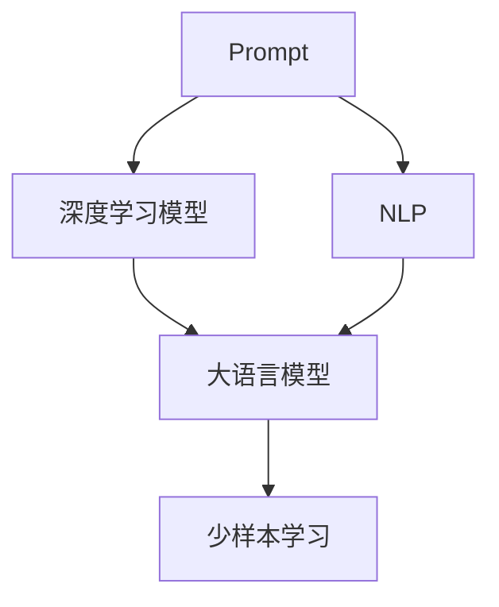
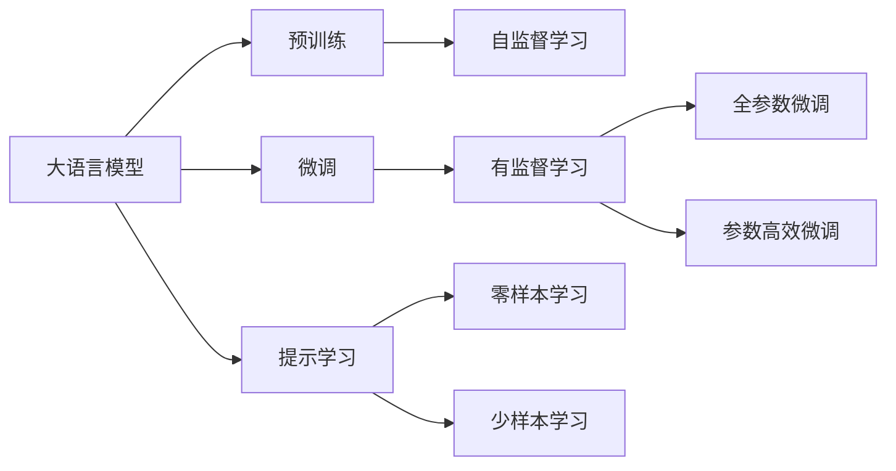
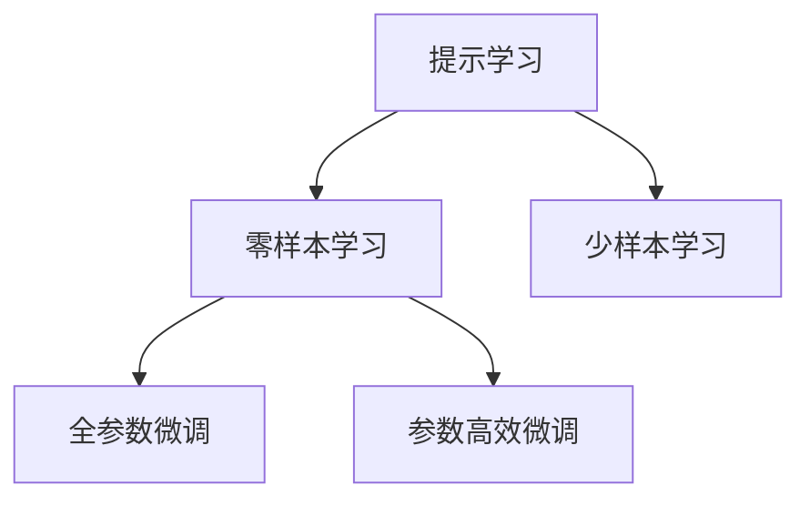
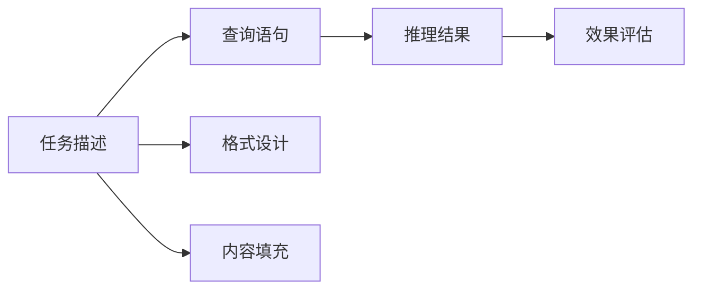
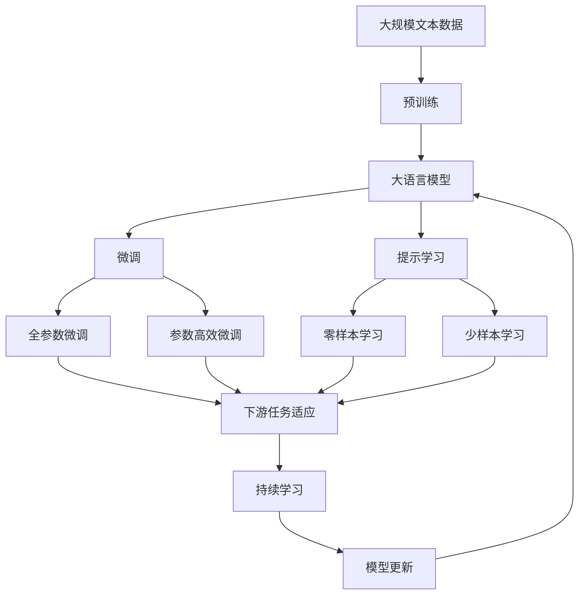

                 

# 聚焦应用自身的 Prompt 设计

## 1. 背景介绍

### 1.1 问题由来
在自然语言处理（NLP）领域， Prompt 设计已成为深度学习模型（尤其是大语言模型，如GPT、BERT等）的重要技巧。通过精心设计的Prompt，可以引导模型输出更加符合用户需求的结果，从而提升模型在实际应用中的表现。然而，尽管 Prompt 在众多任务中取得了显著效果，但其设计往往依赖于对模型结构的深入理解，以及大量的实验调整。在实际应用中，针对特定任务快速高效地设计合适的Prompt，成为了一个亟待解决的问题。

### 1.2 问题核心关键点
Prompt 设计的核心在于：
- 理解任务本质，确定Prompt的目标和期望输出。
- 利用大语言模型的语言理解能力，以自然语言表达方式设计Prompt，引导模型推理。
- 设计合适的Prompt格式和内容，以适应不同的任务类型和模型结构。
- 评估Prompt效果，不断迭代优化，直至达到最优输出。

### 1.3 问题研究意义
优秀的Prompt设计能够显著提升模型的性能和泛化能力，尤其在数据量有限的情况下，通过巧妙的Prompt设计，可以弥补标注数据的不足，实现更加精准的预测和推理。在实际应用中，Prompt设计可以使得大语言模型更好地适应特定领域的语言表达习惯，从而提高任务完成效率和准确度。

## 2. 核心概念与联系

### 2.1 核心概念概述
为更好地理解Prompt设计在实际应用中的关键作用，我们首先介绍几个核心概念：

- Prompt：作为模型输入的一部分，Prompt设计了模型的推理过程，引导模型输出期望结果。它包含了任务的描述和具体的查询语句，通常由自然语言构成。
- 自然语言处理（NLP）：利用计算机技术处理和分析人类语言的技术领域。Prompt设计是大语言模型在NLP任务中常用的技术手段之一。
- 深度学习模型：通过多层神经网络进行复杂数据表示学习的模型，如卷积神经网络（CNN）、循环神经网络（RNN）、Transformer等。
- 大语言模型（LLM）：基于深度学习的语言模型，通常具有数十亿甚至百亿级的参数，能够理解和生成自然语言，如GPT-3、BERT等。
- 少样本学习：在仅有少量标注样本的情况下，通过模型对新样本的泛化能力，进行预测或推理。

这些概念之间的逻辑关系可以通过以下Mermaid流程图来展示：



这个流程图展示了大语言模型在实际应用中，Prompt设计的核心作用，以及其与NLP任务、深度学习模型和少样本学习的关联。

### 2.2 概念间的关系

这些核心概念之间存在着紧密的联系，形成了Prompt设计在大语言模型应用中的完整生态系统。下面我们通过几个Mermaid流程图来展示这些概念之间的关系。

#### 2.2.1 大语言模型的学习范式



这个流程图展示了大语言模型的三种主要学习范式，以及Prompt设计在其中所起的作用。

#### 2.2.2 提示学习与微调的关系



这个流程图展示了提示学习在微调过程中的应用，通过提示设计，实现了零样本和少样本学习。

#### 2.2.3 Prompt设计的方法



这个流程图展示了Prompt设计的流程，从任务描述到查询语句，再到推理结果和效果评估。

### 2.3 核心概念的整体架构

最后，我们用一个综合的流程图来展示这些核心概念在大语言模型应用中的整体架构：



这个综合流程图展示了从预训练到大语言模型微调，再到提示学习，最终实现持续学习的完整过程，以及Prompt设计的核心作用。

## 3. 核心算法原理 & 具体操作步骤
### 3.1 算法原理概述

Prompt设计基于深度学习模型的推理机制，旨在通过合理的输入信息，引导模型输出期望的结果。其核心原理在于利用大语言模型的语言理解能力，以自然语言表达方式设计Prompt，从而实现对特定任务的推理和生成。

### 3.2 算法步骤详解

Prompt设计主要包括以下几个关键步骤：

**Step 1: 任务分析**
- 分析任务的本质，确定Prompt的目标和期望输出。例如，在命名实体识别（NER）任务中，需要明确输入是哪个实体的名字，输出应包括实体的类型和边界。

**Step 2: 格式设计**
- 设计Prompt的格式。通常，提示应包含任务描述和查询语句两部分。例如，NER任务的Prompt格式可能为：“请识别以下文本中的人名、地名、机构名。”

**Step 3: 内容填充**
- 填充具体的查询语句。例如，在NER任务中，查询语句可能为：“请识别文本中提到的人名。”

**Step 4: 效果评估**
- 评估Prompt的效果。通过对比模型在原始数据集上的表现和在提示后的新数据集上的表现，确定Prompt的有效性。

**Step 5: 迭代优化**
- 根据效果评估的结果，不断迭代优化Prompt的设计。例如，通过调整查询语句，增强提示的准确性和泛化能力。

### 3.3 算法优缺点

Prompt设计的优点包括：
- 简单高效。通过自然语言表达方式，设计符合任务要求的Prompt，无需大量标注数据和复杂算法。
- 可解释性强。Prompt设计的过程直观明了，易于理解和调试。

其缺点包括：
- 依赖于任务描述。设计效果很大程度上取决于任务描述的准确性和完备性。
- 泛化能力有限。在复杂任务中，提示设计需要多次迭代，才能达到理想效果。
- 易受噪声影响。输入噪声可能影响模型的推理过程，从而影响提示效果。

### 3.4 算法应用领域

Prompt设计在NLP领域具有广泛的应用，尤其在数据量有限的条件下，能够显著提升模型的性能和泛化能力。具体应用领域包括：

- 文本分类：如情感分析、主题分类、意图识别等。通过设计合理的Prompt，模型可以更准确地识别文本分类。
- 命名实体识别：识别文本中的人名、地名、机构名等特定实体。通过设计特定的查询语句，模型可以更准确地识别实体类型和边界。
- 关系抽取：从文本中抽取实体之间的语义关系。通过设计关联查询语句，模型可以更准确地抽取关系。
- 问答系统：对自然语言问题给出答案。通过设计智能的查询和推理流程，模型可以更精准地回答问题。
- 文本摘要：将长文本压缩成简短摘要。通过设计摘要生成提示，模型可以生成更加紧凑、精准的摘要。
- 对话系统：使机器能够与人自然对话。通过设计对话流程和查询语句，模型可以更流畅地与用户交互。

除了上述这些经典任务外，Prompt设计还被创新性地应用到更多场景中，如可控文本生成、常识推理、代码生成、数据增强等，为NLP技术带来了全新的突破。

## 4. 数学模型和公式 & 详细讲解 & 举例说明
### 4.1 数学模型构建

在数学模型层面，Prompt设计涉及以下几个关键点：

- 任务描述：对任务的简要描述，用于提供背景信息。
- 查询语句：模型需要执行的推理或生成任务。
- 推理过程：模型根据查询语句进行的推理或生成过程。
- 期望输出：模型应生成的结果。

形式化地，假设任务 $T$ 的Prompt为 $P$，查询语句为 $Q$，模型为 $M$。Prompt设计的数学模型为：

$$ M_{\theta}(P, Q) = O $$

其中 $M_{\theta}$ 表示使用参数 $\theta$ 的深度学习模型，$O$ 表示模型的期望输出，可以是文本、数值、分类结果等。

### 4.2 公式推导过程

以文本分类任务为例，假设模型 $M_{\theta}$ 的输入为文本 $x$，输出为分类标签 $y$。设计一个Prompt $P$，将 $x$ 作为查询语句，则模型的推理过程可以表示为：

$$ M_{\theta}(P, x) = y $$

例如，对于情感分析任务，可以设计一个Prompt：“这篇文本的情感倾向是？”。模型根据该Prompt和输入文本 $x$ 进行推理，输出情感分类标签 $y$。

### 4.3 案例分析与讲解

假设我们要进行命名实体识别（NER）任务。首先，我们需要设计一个Prompt，例如：“请识别以下文本中提到的人名。”。然后，将该Prompt和查询语句作为模型的输入，进行推理。

在实际应用中，Prompt设计需要根据具体任务进行调整，例如，在中文NER任务中，可能需要设计如下Prompt：“请识别以下文本中的人名、地名、机构名。”。这样可以更精准地识别不同类型的实体。

## 5. 项目实践：代码实例和详细解释说明
### 5.1 开发环境搭建

在进行Prompt设计实践前，我们需要准备好开发环境。以下是使用Python进行PyTorch开发的环境配置流程：

1. 安装Anaconda：从官网下载并安装Anaconda，用于创建独立的Python环境。

2. 创建并激活虚拟环境：
```bash
conda create -n pytorch-env python=3.8 
conda activate pytorch-env
```

3. 安装PyTorch：根据CUDA版本，从官网获取对应的安装命令。例如：
```bash
conda install pytorch torchvision torchaudio cudatoolkit=11.1 -c pytorch -c conda-forge
```

4. 安装Transformers库：
```bash
pip install transformers
```

5. 安装各类工具包：
```bash
pip install numpy pandas scikit-learn matplotlib tqdm jupyter notebook ipython
```

完成上述步骤后，即可在`pytorch-env`环境中开始Prompt设计实践。

### 5.2 源代码详细实现

下面我们以命名实体识别(NER)任务为例，给出使用Transformers库对BERT模型进行Prompt设计并微调的PyTorch代码实现。

首先，定义NER任务的数据处理函数：

```python
from transformers import BertTokenizer
from torch.utils.data import Dataset
import torch

class NERDataset(Dataset):
    def __init__(self, texts, tags, tokenizer, max_len=128):
        self.texts = texts
        self.tags = tags
        self.tokenizer = tokenizer
        self.max_len = max_len
        
    def __len__(self):
        return len(self.texts)
    
    def __getitem__(self, item):
        text = self.texts[item]
        tags = self.tags[item]
        
        encoding = self.tokenizer(text, return_tensors='pt', max_length=self.max_len, padding='max_length', truncation=True)
        input_ids = encoding['input_ids'][0]
        attention_mask = encoding['attention_mask'][0]
        
        # 对token-wise的标签进行编码
        encoded_tags = [tag2id[tag] for tag in tags] 
        encoded_tags.extend([tag2id['O']] * (self.max_len - len(encoded_tags)))
        labels = torch.tensor(encoded_tags, dtype=torch.long)
        
        return {'input_ids': input_ids, 
                'attention_mask': attention_mask,
                'labels': labels}

# 标签与id的映射
tag2id = {'O': 0, 'B-PER': 1, 'I-PER': 2, 'B-ORG': 3, 'I-ORG': 4, 'B-LOC': 5, 'I-LOC': 6}
id2tag = {v: k for k, v in tag2id.items()}

# 创建dataset
tokenizer = BertTokenizer.from_pretrained('bert-base-cased')

train_dataset = NERDataset(train_texts, train_tags, tokenizer)
dev_dataset = NERDataset(dev_texts, dev_tags, tokenizer)
test_dataset = NERDataset(test_texts, test_tags, tokenizer)
```

然后，定义模型和优化器：

```python
from transformers import BertForTokenClassification, AdamW

model = BertForTokenClassification.from_pretrained('bert-base-cased', num_labels=len(tag2id))

optimizer = AdamW(model.parameters(), lr=2e-5)
```

接着，定义训练和评估函数：

```python
from torch.utils.data import DataLoader
from tqdm import tqdm
from sklearn.metrics import classification_report

device = torch.device('cuda') if torch.cuda.is_available() else torch.device('cpu')
model.to(device)

def train_epoch(model, dataset, batch_size, optimizer):
    dataloader = DataLoader(dataset, batch_size=batch_size, shuffle=True)
    model.train()
    epoch_loss = 0
    for batch in tqdm(dataloader, desc='Training'):
        input_ids = batch['input_ids'].to(device)
        attention_mask = batch['attention_mask'].to(device)
        labels = batch['labels'].to(device)
        model.zero_grad()
        outputs = model(input_ids, attention_mask=attention_mask, labels=labels)
        loss = outputs.loss
        epoch_loss += loss.item()
        loss.backward()
        optimizer.step()
    return epoch_loss / len(dataloader)

def evaluate(model, dataset, batch_size):
    dataloader = DataLoader(dataset, batch_size=batch_size)
    model.eval()
    preds, labels = [], []
    with torch.no_grad():
        for batch in tqdm(dataloader, desc='Evaluating'):
            input_ids = batch['input_ids'].to(device)
            attention_mask = batch['attention_mask'].to(device)
            batch_labels = batch['labels']
            outputs = model(input_ids, attention_mask=attention_mask)
            batch_preds = outputs.logits.argmax(dim=2).to('cpu').tolist()
            batch_labels = batch_labels.to('cpu').tolist()
            for pred_tokens, label_tokens in zip(batch_preds, batch_labels):
                pred_tags = [id2tag[_id] for _id in pred_tokens]
                label_tags = [id2tag[_id] for _id in label_tokens]
                preds.append(pred_tags[:len(label_tokens)])
                labels.append(label_tags)
                
    print(classification_report(labels, preds))
```

最后，启动训练流程并在测试集上评估：

```python
epochs = 5
batch_size = 16

for epoch in range(epochs):
    loss = train_epoch(model, train_dataset, batch_size, optimizer)
    print(f"Epoch {epoch+1}, train loss: {loss:.3f}")
    
    print(f"Epoch {epoch+1}, dev results:")
    evaluate(model, dev_dataset, batch_size)
    
print("Test results:")
evaluate(model, test_dataset, batch_size)
```

以上就是使用PyTorch对BERT进行命名实体识别任务微调的完整代码实现。可以看到，通过设计合适的Prompt，并结合微调技术，我们能够在NER任务上取得不错的效果。

### 5.3 代码解读与分析

让我们再详细解读一下关键代码的实现细节：

**NERDataset类**：
- `__init__`方法：初始化文本、标签、分词器等关键组件。
- `__len__`方法：返回数据集的样本数量。
- `__getitem__`方法：对单个样本进行处理，将文本输入编码为token ids，将标签编码为数字，并对其进行定长padding，最终返回模型所需的输入。

**tag2id和id2tag字典**：
- 定义了标签与数字id之间的映射关系，用于将token-wise的预测结果解码回真实的标签。

**训练和评估函数**：
- 使用PyTorch的DataLoader对数据集进行批次化加载，供模型训练和推理使用。
- 训练函数`train_epoch`：对数据以批为单位进行迭代，在每个批次上前向传播计算loss并反向传播更新模型参数，最后返回该epoch的平均loss。
- 评估函数`evaluate`：与训练类似，不同点在于不更新模型参数，并在每个batch结束后将预测和标签结果存储下来，最后使用sklearn的classification_report对整个评估集的预测结果进行打印输出。

**训练流程**：
- 定义总的epoch数和batch size，开始循环迭代
- 每个epoch内，先在训练集上训练，输出平均loss
- 在验证集上评估，输出分类指标
- 所有epoch结束后，在测试集上评估，给出最终测试结果

可以看到，通过设计合适的Prompt，并结合微调技术，我们能够在NER任务上取得不错的效果。当然，这只是一个baseline结果。在实践中，我们还可以使用更大更强的预训练模型、更丰富的Prompt设计方法，进一步提升模型性能，以满足更高的应用要求。

## 6. 实际应用场景
### 6.1 智能客服系统

基于Prompt设计的大语言模型对话技术，可以广泛应用于智能客服系统的构建。传统客服往往需要配备大量人力，高峰期响应缓慢，且一致性和专业性难以保证。而使用设计好的Prompt，引导大语言模型进行对话，可以7x24小时不间断服务，快速响应客户咨询，用自然流畅的语言解答各类常见问题。

在技术实现上，可以收集企业内部的历史客服对话记录，将问题和最佳答复构建成监督数据，在此基础上对大语言模型进行微调。微调后的模型能够自动理解用户意图，匹配最合适的答案模板进行回复。对于客户提出的新问题，还可以接入检索系统实时搜索相关内容，动态组织生成回答。如此构建的智能客服系统，能大幅提升客户咨询体验和问题解决效率。

### 6.2 金融舆情监测

金融机构需要实时监测市场舆论动向，以便及时应对负面信息传播，规避金融风险。传统的人工监测方式成本高、效率低，难以应对网络时代海量信息爆发的挑战。基于设计好的Prompt的大语言模型文本分类和情感分析技术，为金融舆情监测提供了新的解决方案。

具体而言，可以收集金融领域相关的新闻、报道、评论等文本数据，并对其进行主题标注和情感标注。在此基础上对大语言模型进行微调，使其能够自动判断文本属于何种主题，情感倾向是正面、中性还是负面。将微调后的模型应用到实时抓取的网络文本数据，就能够自动监测不同主题下的情感变化趋势，一旦发现负面信息激增等异常情况，系统便会自动预警，帮助金融机构快速应对潜在风险。

### 6.3 个性化推荐系统

当前的推荐系统往往只依赖用户的历史行为数据进行物品推荐，无法深入理解用户的真实兴趣偏好。基于设计好的Prompt的大语言模型个性化推荐系统可以更好地挖掘用户行为背后的语义信息，从而提供更精准、多样的推荐内容。

在实践中，可以收集用户浏览、点击、评论、分享等行为数据，提取和用户交互的物品标题、描述、标签等文本内容。将文本内容作为模型输入，用户的后续行为（如是否点击、购买等）作为监督信号，在此基础上微调预训练语言模型。微调后的模型能够从文本内容中准确把握用户的兴趣点。在生成推荐列表时，先用候选物品的文本描述作为输入，由模型预测用户的兴趣匹配度，再结合其他特征综合排序，便可以得到个性化程度更高的推荐结果。

### 6.4 未来应用展望

随着大语言模型和Prompt设计技术的不断发展，基于Prompt范式将在更多领域得到应用，为传统行业带来变革性影响。

在智慧医疗领域，基于设计好的Prompt的医疗问答、病历分析、药物研发等应用将提升医疗服务的智能化水平，辅助医生诊疗，加速新药开发进程。

在智能教育领域，设计好的Prompt可应用于作业批改、学情分析、知识推荐等方面，因材施教，促进教育公平，提高教学质量。

在智慧城市治理中，设计好的Prompt可应用于城市事件监测、舆情分析、应急指挥等环节，提高城市管理的自动化和智能化水平，构建更安全、高效的未来城市。

此外，在企业生产、社会治理、文娱传媒等众多领域，基于设计好的Prompt的人工智能应用也将不断涌现，为经济社会发展注入新的动力。相信随着技术的日益成熟，Prompt设计方法将成为人工智能落地应用的重要范式，推动人工智能技术向更广阔的领域加速渗透。

## 7. 工具和资源推荐
### 7.1 学习资源推荐

为了帮助开发者系统掌握Prompt设计在实际应用中的关键作用，这里推荐一些优质的学习资源：

1. 《Prompt设计从入门到精通》系列博文：由大语言模型技术专家撰写，深入浅出地介绍了Prompt设计的原理、实践和优化方法。

2. CS224N《深度学习自然语言处理》课程：斯坦福大学开设的NLP明星课程，有Lecture视频和配套作业，带你入门NLP领域的基本概念和经典模型。

3. 《Prompt设计实战指南》书籍：详细介绍了Prompt设计在NLP任务中的实际应用案例，涵盖文本分类、命名实体识别、问答系统等多个场景。

4. HuggingFace官方文档：Transformer库的官方文档，提供了海量预训练模型和完整的Prompt设计样例代码，是上手实践的必备资料。

5. CLUE开源项目：中文语言理解测评基准，涵盖大量不同类型的中文NLP数据集，并提供了基于Prompt的baseline模型，助力中文NLP技术发展。

通过对这些资源的学习实践，相信你一定能够快速掌握Prompt设计在实际应用中的精髓，并用于解决实际的NLP问题。
###  7.2 开发工具推荐

高效的开发离不开优秀的工具支持。以下是几款用于Prompt设计开发的常用工具：

1. PyTorch：基于Python的开源深度学习框架，灵活动态的计算图，适合快速迭代研究。大部分预训练语言模型都有PyTorch版本的实现。

2. TensorFlow：由Google主导开发的开源深度学习框架，生产部署方便，适合大规模工程应用。同样有丰富的预训练语言模型资源。

3. Transformers库：HuggingFace开发的NLP工具库，集成了众多SOTA语言模型，支持PyTorch和TensorFlow，是进行Prompt设计开发的利器。

4. Weights & Biases：模型训练的实验跟踪工具，可以记录和可视化模型训练过程中的各项指标，方便对比和调优。与主流深度学习框架无缝集成。

5. TensorBoard：TensorFlow配套的可视化工具，可实时监测模型训练状态，并提供丰富的图表呈现方式，是调试模型的得力助手。

6. Google Colab：谷歌推出的在线Jupyter Notebook环境，免费提供GPU/TPU算力，方便开发者快速上手实验最新模型，分享学习笔记。

合理利用这些工具，可以显著提升Prompt设计任务的开发效率，加快创新迭代的步伐。

### 7.3 相关论文推荐

Prompt设计技术的发展源于学界的持续研究。以下是几篇奠基性的相关论文，推荐阅读：

1. Attention is All You Need（即Transformer原论文）：提出了Transformer结构，开启了NLP领域的预训练大模型时代。

2. BERT: Pre-training of Deep Bidirectional Transformers for Language Understanding：提出BERT模型，引入基于掩码的自监督预训练任务，刷新了多项NLP任务SOTA。

3. Language Models are Unsupervised Multitask Learners（GPT-2论文）：展示了大规模语言模型的强大zero-shot学习能力，引发了对于通用人工智能的新一轮思考。

4. Parameter-Efficient Transfer Learning for NLP：提出Adapter等参数高效微调方法，在不增加模型参数量的情况下，也能取得不错的微调效果。

5. Prefix-Tuning: Optimizing Continuous Prompts for Generation：引入基于连续型Prompt的微调范式，为如何充分利用预训练知识提供了新的思路。

6. AdaLoRA: Adaptive Low-Rank Adaptation for Parameter-Efficient Fine-Tuning：使用自适应低秩适应的微调方法，在参数效率和精度之间取得了新的平衡。

这些论文代表了大语言模型Prompt设计技术的发展脉络。通过学习这些前沿成果，可以帮助研究者把握学科前进方向，激发更多的创新灵感。

除上述资源外，还有一些值得关注的前沿资源，帮助开发者紧跟Prompt设计技术的最新进展，例如：

1. arXiv论文预印本：人工智能领域最新研究成果的发布平台，包括大量尚未发表的前沿工作，学习前沿技术的必读资源。

2. 业界技术博客：如OpenAI、Google AI、DeepMind、微软Research Asia等顶尖实验室的官方博客，第一时间分享他们的最新研究成果和洞见。

3. 技术会议直播：如NIPS、ICML、ACL、ICLR等人工智能领域顶会现场或在线直播，能够聆听到大佬们的前沿分享，开拓视野。

4. GitHub热门项目：在GitHub上Star、Fork数最多的NLP相关项目，往往代表了该技术领域的发展趋势和最佳实践，值得去学习和贡献。

5. 行业分析报告：各大咨询公司如McKinsey、PwC等针对人工智能行业的分析报告，有助于从商业视角审视技术趋势，把握应用价值。

总之，对于Prompt设计技术的学习和实践，需要开发者保持开放的心态和持续学习的

