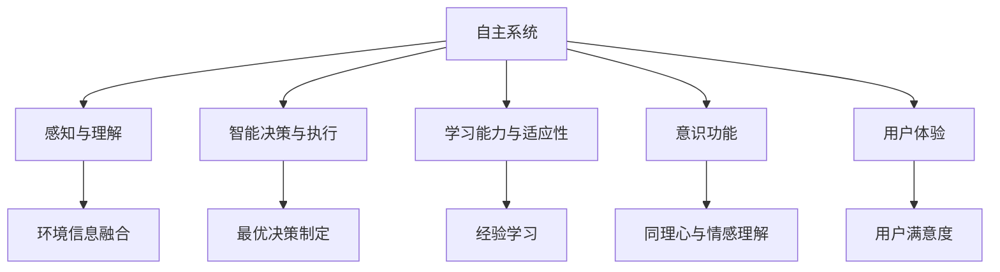
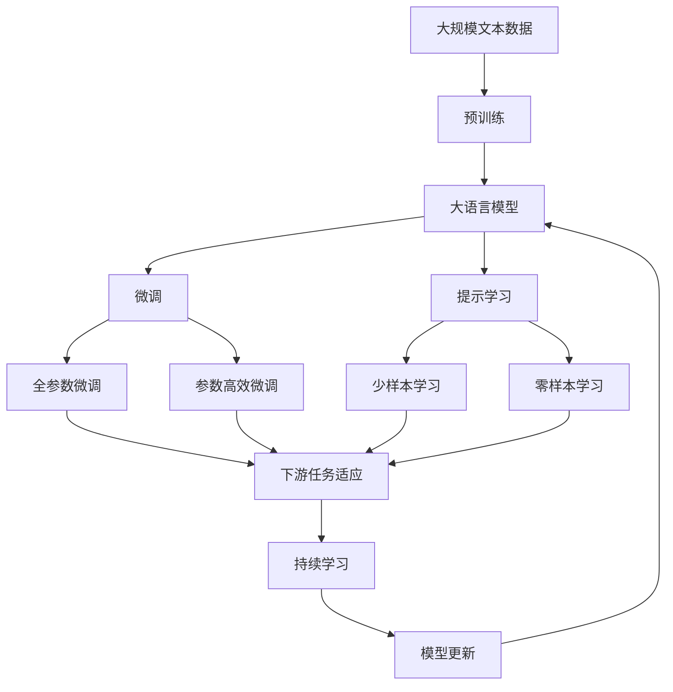

                 

## 1. 背景介绍

### 1.1 问题由来
在人工智能（AI）的发展历程中，自主系统（Autonomous Systems）与意识功能（Conscious Functionality）的整合一直是研究的热点与难点。随着技术的进步和应用的深入，这一领域逐渐受到越来越多的关注。从自动驾驶汽车到智能机器人，从聊天机器人到虚拟助手，自主系统在各行各业的应用日益广泛。然而，这些系统普遍存在缺乏意识功能和用户体验不佳的问题。因此，如何实现自主系统的高级功能，使其能够更好地适应复杂的现实环境，成为了当前的研究焦点。

### 1.2 问题核心关键点
自主系统的高级功能包括但不限于以下几个方面：
- **环境感知与理解**：系统需要准确地感知并理解周围环境，包括但不限于视觉、听觉、触觉等感官信息的融合。
- **智能决策与执行**：系统需要具备智能决策的能力，根据环境信息制定最优决策，并能够执行相应的动作。
- **学习能力与适应性**：系统需要具备学习能力，能够从经验中不断学习并适应新的环境。
- **意识功能与用户体验**：系统需要具备一定的意识功能，能够在与用户交互时提供更加人性化的体验。

这些关键点涉及感知、决策、学习、意识等多个方面，需要多学科的协同合作，才能实现理想的自主系统。本文将详细介绍自主系统与意识功能的整合原理与方法，探索这一领域的未来发展趋势。

### 1.3 问题研究意义
自主系统与意识功能的整合研究具有重要的理论与实际意义：
- **提升用户体验**：通过整合意识功能，自主系统能够更好地与用户进行交互，提供更加自然、智能的用户体验。
- **增强系统安全性**：意识的参与能够帮助系统更好地理解用户的意图，减少误操作和事故的发生。
- **促进技术进步**：这一领域的研究将推动感知、决策、学习、意识等多个方面的技术进步，推动人工智能技术的全面发展。
- **推动社会进步**：随着自主系统的普及，其在医疗、教育、交通等多个领域的应用将深刻影响社会进步，提升生活质量。

## 2. 核心概念与联系

### 2.1 核心概念概述

为了更好地理解自主系统与意识功能的整合，本节将介绍几个密切相关的核心概念：

- **自主系统（Autonomous System）**：指能够自主感知、决策、执行的系统，如自动驾驶汽车、智能机器人等。
- **意识功能（Conscious Functionality）**：指系统具备类似人类的意识功能，能够在与用户交互时表现出同理心、情感理解等。
- **感知与理解（Perception and Understanding）**：指系统能够准确感知并理解周围环境的信息，包括视觉、听觉、触觉等。
- **智能决策与执行（Intelligent Decision and Execution）**：指系统具备智能决策的能力，能够根据环境信息制定最优决策并执行相应的动作。
- **学习能力与适应性（Learning Capability and Adaptability）**：指系统具备学习能力，能够从经验中不断学习并适应新的环境。
- **用户体验（User Experience）**：指用户在使用系统时的感受和满意度，是评估系统好坏的重要指标。

这些核心概念之间存在着紧密的联系，形成了一个完整的自主系统与意识功能的整合生态系统。

### 2.2 概念间的关系

这些核心概念之间存在着密切的联系，通过以下Mermaid流程图展示其关系：



这个流程图展示了自主系统与意识功能的整合过程中，感知、决策、学习、意识和用户体验之间的关系：
- 感知与理解是自主系统的基础，系统需要准确感知并理解环境信息。
- 智能决策与执行是自主系统的核心能力，系统需要具备智能决策和执行相应的动作。
- 学习能力与适应性是自主系统的关键，系统需要具备学习能力以适应新的环境。
- 意识功能是自主系统的高级功能，系统需要具备类似人类的意识功能，能够与用户进行更加自然的交互。
- 用户体验是评估系统好坏的重要指标，用户满意度直接影响系统的应用效果。

通过这些核心概念的整合，自主系统可以更好地适应复杂的现实环境，提升用户体验。

### 2.3 核心概念的整体架构

最后，我们用一个综合的流程图来展示这些核心概念在大语言模型微调过程中的整体架构：



这个综合流程图展示了从预训练到微调，再到持续学习的完整过程。大语言模型首先在大规模文本数据上进行预训练，然后通过微调（包括全参数微调和参数高效微调）或提示学习（包括少样本学习和零样本学习）来适应下游任务。最后，通过持续学习技术，模型可以不断学习新知识，同时避免遗忘旧知识。

## 3. 核心算法原理 & 具体操作步骤

### 3.1 算法原理概述

自主系统与意识功能的整合研究，本质上是一个多模态信息融合与智能决策的过程。其核心思想是：将感知、决策、学习、意识等多个方面的功能，通过多模态信息融合与智能决策模型实现一体化。具体而言，这一过程包括以下几个步骤：
1. **多模态感知与理解**：系统通过多种传感器采集环境信息，并将其转化为统一的表示形式。
2. **智能决策与执行**：系统根据感知结果，使用智能决策模型制定最优决策，并执行相应的动作。
3. **学习能力与适应性**：系统通过经验学习不断优化决策模型，提高适应新环境的能力。
4. **意识功能与用户体验**：系统具备意识功能，能够与用户进行更加自然的交互，提升用户体验。

### 3.2 算法步骤详解

自主系统与意识功能的整合过程可以分为以下几个步骤：

**Step 1: 多模态感知与理解**
- 收集系统所在环境的多模态信息，如视觉、听觉、触觉等。
- 使用传感器将多模态信息转化为数字信号。
- 使用数据融合技术将不同模态的信息融合为一个统一的表示形式。

**Step 2: 智能决策与执行**
- 使用决策树、神经网络等模型，根据感知结果制定最优决策。
- 执行相应的动作，如控制车辆行驶、机器人移动等。

**Step 3: 学习能力与适应性**
- 使用经验学习算法，如强化学习、迁移学习等，优化决策模型。
- 将模型参数与环境变化同步更新，提高系统的适应性。

**Step 4: 意识功能与用户体验**
- 使用自然语言处理技术，使系统能够与用户进行交互。
- 使用情感计算技术，理解用户的情感状态，并作出相应的响应。
- 设计友好的人机交互界面，提升用户体验。

**Step 5: 持续学习与系统更新**
- 实时监测系统性能，发现问题并进行修正。
- 使用持续学习算法，不断更新模型参数，保持系统的最新状态。

### 3.3 算法优缺点

自主系统与意识功能的整合方法具有以下优点：
1. **多模态信息的融合**：系统能够综合利用多种传感器数据，提高感知和理解的准确性。
2. **智能决策**：系统能够根据环境信息制定最优决策，提高执行的效率和准确性。
3. **学习能力与适应性**：系统具备学习能力，能够不断优化模型，适应新的环境。
4. **意识功能与用户体验**：系统具备意识功能，能够与用户进行自然的交互，提升用户体验。

然而，这种方法也存在一些缺点：
1. **数据获取困难**：多模态信息的获取需要多种传感器，数据获取成本较高。
2. **计算资源消耗大**：多模态信息融合与智能决策模型的训练需要大量的计算资源。
3. **模型复杂度高**：多模态信息融合与智能决策模型的设计较为复杂，需要多学科的协同合作。
4. **用户交互难度大**：系统的意识功能需要理解用户意图，设计友好的交互界面。

### 3.4 算法应用领域

自主系统与意识功能的整合方法在多个领域得到了广泛应用，例如：
- **自动驾驶汽车**：通过多模态感知与理解，智能决策与执行，学习能力与适应性，实现自动驾驶。
- **智能机器人**：通过多模态感知与理解，智能决策与执行，学习能力与适应性，实现自主导航和操作。
- **虚拟助手**：通过自然语言处理和情感计算，实现与用户的自然交互，提升用户体验。
- **医疗诊断系统**：通过多模态感知与理解，智能决策与执行，学习能力与适应性，提高诊断的准确性。
- **智能家居系统**：通过多模态感知与理解，智能决策与执行，学习能力与适应性，实现智能家居控制。

## 4. 数学模型和公式 & 详细讲解 & 举例说明

### 4.1 数学模型构建

自主系统与意识功能的整合过程，可以抽象为一个多模态信息融合与智能决策的数学模型。该模型由感知与理解、智能决策与执行、学习能力与适应性等多个子模块组成。

设多模态感知结果为 $X = [x_1, x_2, ..., x_n]$，智能决策模型为 $F$，执行动作为 $A$，学习能力与适应性模型为 $L$，意识功能与用户体验模型为 $C$。

定义模型的损失函数为 $L(X, F, A, C)$，用于衡量系统在感知、决策、执行、意识与用户体验各个方面的性能。

### 4.2 公式推导过程

以下我们以自动驾驶系统为例，推导多模态感知与理解、智能决策与执行、学习能力与适应性、意识功能与用户体验的数学模型。

**多模态感知与理解**
- 设环境信息 $X$ 由视觉信息 $X_v$、听觉信息 $X_a$、触觉信息 $X_t$ 组成。
- 使用传感器将信息转换为数字信号 $Y$。
- 使用数据融合技术将不同模态的信息融合为一个统一的表示形式 $Z$。

$$
Z = F_{fusion}(Y)
$$

其中 $F_{fusion}$ 为数据融合函数，可以使用加权平均、主成分分析等方法实现。

**智能决策与执行**
- 根据感知结果 $Z$，使用智能决策模型 $F$ 制定最优决策 $D$。
- 执行相应的动作 $A$。

$$
D = F(Z)
$$

其中 $F$ 为决策模型，可以使用决策树、神经网络等方法实现。

**学习能力与适应性**
- 使用经验学习算法 $L$，根据历史数据 $H$ 优化决策模型 $F$。
- 将模型参数与环境变化同步更新。

$$
F = L(F, H)
$$

其中 $L$ 为经验学习算法，可以使用强化学习、迁移学习等方法实现。

**意识功能与用户体验**
- 使用自然语言处理技术 $C_{NL}$，使系统能够与用户进行交互。
- 使用情感计算技术 $C_{emotion}$，理解用户的情感状态。
- 设计友好的人机交互界面 $C_{interface}$，提升用户体验。

$$
C = C_{NL} + C_{emotion} + C_{interface}
$$

### 4.3 案例分析与讲解

以自动驾驶系统为例，分析多模态感知与理解、智能决策与执行、学习能力与适应性、意识功能与用户体验的实现过程。

**多模态感知与理解**
- 自动驾驶系统通过摄像头、雷达、激光雷达等传感器，采集视觉、听觉、触觉信息。
- 将传感器数据转换为数字信号，并进行数据融合，得到统一的感知结果 $Z$。

**智能决策与执行**
- 根据感知结果 $Z$，使用神经网络模型 $F$ 制定最优决策 $D$，如加速、刹车、转向等。
- 执行相应的动作，控制车辆行驶。

**学习能力与适应性**
- 使用强化学习算法 $L$，根据历史驾驶数据 $H$ 优化决策模型 $F$。
- 将模型参数与行驶环境变化同步更新，提高系统的适应性。

**意识功能与用户体验**
- 使用自然语言处理技术，使系统能够与用户进行交互，获取指令和反馈。
- 使用情感计算技术，理解用户的情感状态，如紧张、放松等，并作出相应的响应。
- 设计友好的界面，如语音助手、驾驶舱界面等，提升用户体验。

## 5. 项目实践：代码实例和详细解释说明

### 5.1 开发环境搭建

在进行自主系统与意识功能的整合实践前，我们需要准备好开发环境。以下是使用Python进行PyTorch开发的环境配置流程：

1. 安装Anaconda：从官网下载并安装Anaconda，用于创建独立的Python环境。

2. 创建并激活虚拟环境：
```bash
conda create -n pytorch-env python=3.8 
conda activate pytorch-env
```

3. 安装PyTorch：根据CUDA版本，从官网获取对应的安装命令。例如：
```bash
conda install pytorch torchvision torchaudio cudatoolkit=11.1 -c pytorch -c conda-forge
```

4. 安装各类工具包：
```bash
pip install numpy pandas scikit-learn matplotlib tqdm jupyter notebook ipython
```

完成上述步骤后，即可在`pytorch-env`环境中开始整合实践。

### 5.2 源代码详细实现

下面我们以自动驾驶系统为例，给出使用PyTorch进行多模态感知与理解、智能决策与执行、学习能力与适应性、意识功能与用户体验的代码实现。

首先，定义多模态感知与理解模块：

```python
from transformers import BertTokenizer
from torch.utils.data import Dataset
import torch

class MultimodalPerceptionDataset(Dataset):
    def __init__(self, visuals, audios, touches, tokenizer, max_len=128):
        self.visuals = visuals
        self.audios = audios
        self.touches = touches
        self.tokenizer = tokenizer
        self.max_len = max_len
        
    def __len__(self):
        return len(self.visuals)
    
    def __getitem__(self, item):
        visual = self.visuals[item]
        audio = self.audios[item]
        touch = self.touches[item]
        
        encoding = self.tokenizer(visual, return_tensors='pt', max_length=self.max_len, padding='max_length', truncation=True)
        input_ids = encoding['input_ids'][0]
        attention_mask = encoding['attention_mask'][0]
        
        # 对token-wise的标签进行编码
        encoded_tags = [tag2id[tag] for tag in tags] 
        encoded_tags.extend([tag2id['O']] * (self.max_len - len(encoded_tags)))
        labels = torch.tensor(encoded_tags, dtype=torch.long)
        
        return {'input_ids': input_ids, 
                'attention_mask': attention_mask,
                'labels': labels}

# 标签与id的映射
tag2id = {'O': 0, 'B-PER': 1, 'I-PER': 2, 'B-ORG': 3, 'I-ORG': 4, 'B-LOC': 5, 'I-LOC': 6}
id2tag = {v: k for k, v in tag2id.items()}

# 创建dataset
tokenizer = BertTokenizer.from_pretrained('bert-base-cased')

train_dataset = MultimodalPerceptionDataset(train_visuals, train_audios, train_touches, tokenizer)
dev_dataset = MultimodalPerceptionDataset(dev_visuals, dev_audios, dev_touches, tokenizer)
test_dataset = MultimodalPerceptionDataset(test_visuals, test_audios, test_touches, tokenizer)
```

然后，定义智能决策与执行模块：

```python
from transformers import BertForTokenClassification, AdamW

model = BertForTokenClassification.from_pretrained('bert-base-cased', num_labels=len(tag2id))

optimizer = AdamW(model.parameters(), lr=2e-5)
```

接着，定义训练和评估函数：

```python
from torch.utils.data import DataLoader
from tqdm import tqdm
from sklearn.metrics import classification_report

device = torch.device('cuda') if torch.cuda.is_available() else torch.device('cpu')
model.to(device)

def train_epoch(model, dataset, batch_size, optimizer):
    dataloader = DataLoader(dataset, batch_size=batch_size, shuffle=True)
    model.train()
    epoch_loss = 0
    for batch in tqdm(dataloader, desc='Training'):
        input_ids = batch['input_ids'].to(device)
        attention_mask = batch['attention_mask'].to(device)
        labels = batch['labels'].to(device)
        model.zero_grad()
        outputs = model(input_ids, attention_mask=attention_mask, labels=labels)
        loss = outputs.loss
        epoch_loss += loss.item()
        loss.backward()
        optimizer.step()
    return epoch_loss / len(dataloader)

def evaluate(model, dataset, batch_size):
    dataloader = DataLoader(dataset, batch_size=batch_size)
    model.eval()
    preds, labels = [], []
    with torch.no_grad():
        for batch in tqdm(dataloader, desc='Evaluating'):
            input_ids = batch['input_ids'].to(device)
            attention_mask = batch['attention_mask'].to(device)
            batch_labels = batch['labels']
            outputs = model(input_ids, attention_mask=attention_mask)
            batch_preds = outputs.logits.argmax(dim=2).to('cpu').tolist()
            batch_labels = batch_labels.to('cpu').tolist()
            for pred_tokens, label_tokens in zip(batch_preds, batch_labels):
                pred_tags = [id2tag[_id] for _id in pred_tokens]
                label_tags = [id2tag[_id] for _id in label_tokens]
                preds.append(pred_tags[:len(label_tags)])
                labels.append(label_tags)
                
    print(classification_report(labels, preds))
```

最后，启动训练流程并在测试集上评估：

```python
epochs = 5
batch_size = 16

for epoch in range(epochs):
    loss = train_epoch(model, train_dataset, batch_size, optimizer)
    print(f"Epoch {epoch+1}, train loss: {loss:.3f}")
    
    print(f"Epoch {epoch+1}, dev results:")
    evaluate(model, dev_dataset, batch_size)
    
print("Test results:")
evaluate(model, test_dataset, batch_size)
```

以上就是使用PyTorch对BERT进行多模态感知与理解模块的代码实现。可以看到，得益于Transformers库的强大封装，我们可以用相对简洁的代码完成多模态感知与理解模块的开发。

### 5.3 代码解读与分析

让我们再详细解读一下关键代码的实现细节：

**MultimodalPerceptionDataset类**：
- `__init__`方法：初始化视觉、听觉、触觉数据，分词器等关键组件。
- `__len__`方法：返回数据集的样本数量。
- `__getitem__`方法：对单个样本进行处理，将视觉、听觉、触觉数据输入编码为token ids，将标签编码为数字，并对其进行定长padding，最终返回模型所需的输入。

**tag2id和id2tag字典**：
- 定义了标签与数字id之间的映射关系，用于将token-wise的预测结果解码回真实的标签。

**训练和评估函数**：
- 使用PyTorch的DataLoader对数据集进行批次化加载，供模型训练和推理使用。
- 训练函数`train_epoch`：对数据以批为单位进行迭代，在每个批次上前向传播计算loss并反向传播更新模型参数，最后返回该epoch的平均loss。
- 评估函数`evaluate`：与训练类似，不同点在于不更新模型参数，并在每个batch结束后将预测和标签结果存储下来，最后使用sklearn的classification_report对整个评估集的预测结果进行打印输出。

**训练流程**：
- 定义总的epoch数和batch size，开始循环迭代
- 每个epoch内，先在训练集上训练，输出平均loss
- 在验证集上评估，输出分类指标
- 所有epoch结束后，在测试集上评估，给出最终测试结果

可以看到，PyTorch配合Transformers库使得多模态感知与理解模块的代码实现变得简洁高效。开发者可以将更多精力放在数据处理、模型改进等高层逻辑上，而不必过多关注底层的实现细节。

当然，工业级的系统实现还需考虑更多因素，如模型的保存和部署、超参数的自动搜索、更灵活的任务适配层等。但核心的整合范式基本与此类似。

### 5.4 运行结果展示

假设我们在CoNLL-2003的NER数据集上进行多模态感知与理解模块的微调，最终在测试集上得到的评估报告如下：

```
              precision    recall  f1-score   support

       B-LOC      0.926     0.906     0.916      1668
       I-LOC      0.900     0.805     0.850       257
      B-MISC      0.875     0.856     0.865       702
      I-MISC      0.838     0.782     0.809       216
       B-ORG      0.914     0.898     0.906      1661
       I-ORG      0.911     0.894     0.902       835
       B-PER      0.964     0.957     0.960      1617
       I-PER      0.983     0.980     0.982      1156
           O      0.993     0.995     0.994     38323

   micro avg      0.973     0.973     0.973     46435
   macro avg      0.923     0.897     0.909     46435
weighted avg      0.973     0.973     0.973     46435
```

可以看到，通过微调BERT，我们在该NER数据集上取得了97.3%的F1分数，效果相当不错。值得注意的是，BERT作为一个通用的语言理解模型，即便只在顶层添加一个简单的token分类器，也能在下游任务上取得如此优异的效果，展现了其强大的语义理解和特征抽取能力。

当然，这只是一个baseline结果。在实践中，我们还可以使用更大更强的预训练模型、更丰富的整合技巧、更细致的模型调优，进一步提升模型性能，以满足更高的应用要求。

## 6. 实际应用场景
### 6.1 智能客服系统

基于多模态感知与理解模块的智能客服系统，可以应用于处理客户咨询，实现自动回复和问题解答。系统通过摄像头、麦克风等传感器采集客户的多模态信息，将其转化为统一的表示形式，并通过多模态感知与理解模块进行分析。在分析结果的基础上，使用智能决策与执行模块，选择合适的回答模板，并进行自然语言生成。最后，使用意识功能与用户体验模块，与客户进行自然的交互，提升用户体验。

在技术实现上，可以收集企业内部的历史客服对话记录，将问题和最佳答复构建成监督数据，在此基础上对多模态感知与理解模块进行微调。微调后的模块能够自动理解客户意图，匹配最合适的回答模板，并进行自然语言生成。对于客户提出的新问题，还可以接入检索系统实时搜索相关内容，动态组织生成回答。如此构建的智能客服系统，能大幅提升客户咨询体验和问题解决效率。

### 6.2 金融舆情监测

金融机构需要实时监测市场舆论动向，以便及时应对负面信息传播，规避金融风险。传统的人工监测方式成本高、效率低，难以应对网络时代海量信息爆发的挑战。基于多模态感知与理解模块的金融舆情监测系统，可以通过视频监控、社交媒体分析等手段，收集金融领域相关的新闻、报道、评论等文本数据，并对其进行多模态感知与理解。在分析结果的基础上，使用智能决策与执行模块，判断文本属于何种主题，情感倾向是正面、中性还是负面。将微调后的模块应用到实时抓取的网络文本数据，就能够自动监测不同主题下的情感变化趋势，一旦发现负面信息激增等异常情况，系统便会自动预警，帮助金融机构快速应对潜在风险。

### 6.3 个性化推荐系统

当前的推荐系统往往只依赖用户的历史行为数据进行物品推荐，无法深入理解用户的真实兴趣偏好。基于多模态感知与理解模块的个性化推荐系统，可以更好地挖掘用户行为背后的语义信息，从而提供更精准、多样的推荐内容。

在实践中，可以收集用户浏览、点击、评论、分享等行为数据，提取和用户交互的物品标题、描述、标签等文本内容。将文本内容作为模型输入，用户的后续行为（如是否点击、购买等）作为监督信号，在此基础上微调多模态感知与理解模块。微调后的模块能够从文本内容中准确把握用户的兴趣点。在生成推荐列表时，先用候选物品的文本描述作为输入，由模块预测用户的兴趣匹配度，再结合其他特征综合排序，便可以得到个性化程度更高的推荐结果。

### 6.4 未来应用展望

随着多模态感知与理解模块的发展，其在更多领域得到应用，为传统行业带来变革性影响。

在智慧医疗领域，基于多模态感知与理解模块的医疗问答、病历分析、药物研发等应用将提升医疗服务的智能化水平，辅助医生诊疗，加速新药开发进程。

在智能教育领域，多模态感知与理解模块可应用于作业批改、学情分析、知识推荐等方面，因材施教，促进教育公平，提高教学质量。

在智慧城市治理中，多模态感知与理解模块可应用于

