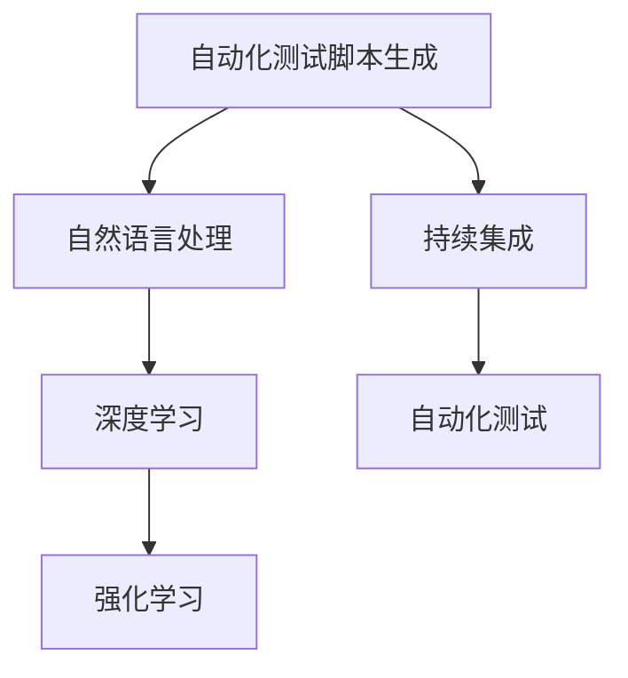
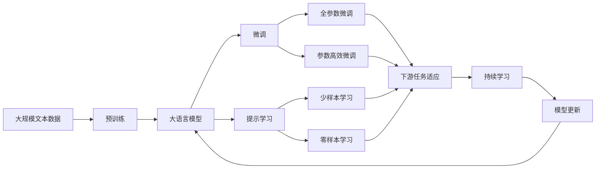

                 

## 1. 背景介绍

### 1.1 问题由来

自动化测试是软件开发生命周期中不可或缺的一环，它能够显著提升测试效率，降低人力成本，同时保证软件质量。传统的自动化测试依赖于人工编写脚本，这不仅需要耗费大量的时间和精力，而且容易出错，无法充分发挥自动化的优势。随着人工智能技术的快速发展，人们开始尝试将AI引入自动化测试领域，通过自动化生成测试脚本，以提高测试效率和精度。

### 1.2 问题核心关键点

自动化测试脚本生成与AI的结合，主要是指利用AI技术，如自然语言处理、深度学习、强化学习等，自动生成测试脚本，以实现自动化测试。这种技术不仅能大大提升测试效率，还能通过深度学习模型自动学习测试用例的有效性，提高测试用例的覆盖率和质量。

### 1.3 问题研究意义

自动化测试脚本生成与AI的结合，具有以下几方面的重要意义：

1. **提高测试效率**：自动化生成测试脚本可以显著提高测试用例的编写速度，减少手动编写测试用例的时间。
2. **降低人力成本**：由于测试脚本的自动化生成，减少了人工参与测试脚本编写的环节，降低了测试成本。
3. **提升测试质量**：AI技术可以自动分析历史测试用例的覆盖率和有效性，生成更全面的测试用例，提高测试质量。
4. **支持持续集成**：自动化测试脚本生成与持续集成（CI）工具的集成，可以实现自动化测试的持续进行，提高软件交付的速度和稳定性。
5. **适应性强的测试用例**：AI技术可以动态生成测试用例，以适应不同的软件版本和环境变化，提高测试的灵活性和适应性。

## 2. 核心概念与联系

### 2.1 核心概念概述

为了更好地理解自动化测试脚本生成与AI的结合，我们首先介绍几个关键概念：

- **自动化测试脚本生成**：使用AI技术自动生成测试用例脚本的过程。通常包括测试用例的编写、执行和结果验证等步骤。
- **自然语言处理（NLP）**：将人类语言转化为计算机可处理的格式，使AI能够理解和生成文本信息。
- **深度学习（DL）**：基于人工神经网络的机器学习技术，能够从大量数据中学习特征和模式。
- **强化学习（RL）**：一种通过试错学习的方式，使AI能够在特定环境中进行优化和决策。
- **持续集成（CI）**：将软件的开发、构建、测试等过程集成到一个自动化流程中，实现自动化测试和部署。

这些概念之间存在紧密的联系，共同构成了自动化测试脚本生成与AI结合的技术框架。以下是这些概念之间的联系和相互作用：

1. **自然语言处理**：用于理解和生成测试用例的自然语言描述，使其能够被AI模型处理。
2. **深度学习**：用于分析历史测试用例和结果，学习有效的测试用例生成策略。
3. **强化学习**：用于优化测试用例生成策略，提高测试用例的覆盖率和有效性。
4. **持续集成**：将自动化测试脚本生成的过程集成到持续集成流程中，实现自动化测试和部署的自动化。

### 2.2 概念间的关系

以下是几个关键概念之间的联系，通过Mermaid流程图展示：



这个流程图展示了自动化测试脚本生成与AI结合的核心概念及其相互关系：

1. **自动化测试脚本生成**：基于自然语言处理、深度学习和强化学习技术，自动生成测试用例脚本。
2. **自然语言处理**：将测试用例的自然语言描述转化为计算机可处理的格式，供深度学习模型处理。
3. **深度学习**：分析历史测试用例和结果，学习有效的测试用例生成策略。
4. **强化学习**：优化测试用例生成策略，提高测试用例的覆盖率和有效性。
5. **持续集成**：将自动化测试脚本生成的过程集成到持续集成流程中，实现自动化测试和部署的自动化。

这些概念共同构成了自动化测试脚本生成与AI结合的完整技术框架，使得自动化测试能够更高效、更灵活地进行。

### 2.3 核心概念的整体架构

最后，我们用一个综合的流程图来展示这些核心概念在大语言模型微调过程中的整体架构：



这个综合流程图展示了从预训练到微调，再到持续学习的完整过程。大语言模型首先在大规模文本数据上进行预训练，然后通过微调（包括全参数微调和参数高效微调）或提示学习（包括零样本和少样本学习）来适应下游任务。最后，通过持续学习技术，模型可以不断学习新知识，同时避免遗忘旧知识。

## 3. 核心算法原理 & 具体操作步骤
### 3.1 算法原理概述

自动化测试脚本生成的核心原理是利用AI技术，如自然语言处理、深度学习和强化学习，自动生成测试用例脚本。该过程包括以下几个步骤：

1. **自然语言处理**：将测试用例的自然语言描述转化为计算机可处理的格式，供深度学习模型处理。
2. **深度学习模型训练**：使用历史测试用例和结果数据训练深度学习模型，学习有效的测试用例生成策略。
3. **强化学习优化**：通过强化学习算法优化测试用例生成策略，提高测试用例的覆盖率和有效性。
4. **脚本生成与执行**：根据优化后的策略，自动生成测试用例脚本，并执行测试。
5. **结果验证与反馈**：验证测试结果，根据结果反馈调整策略，进一步优化测试用例生成。

### 3.2 算法步骤详解

以下是自动化测试脚本生成的详细步骤：

1. **数据收集与处理**：
   - 收集历史测试用例和结果数据，进行预处理，包括去重、清洗和分词等。
   - 将测试用例的自然语言描述转换为结构化数据，如JSON格式。

2. **深度学习模型训练**：
   - 选择适当的深度学习模型，如RNN、LSTM、GRU等，进行训练。
   - 训练过程中，输入测试用例的自然语言描述，输出对应的结构化数据。
   - 使用交叉熵等损失函数，最小化模型输出与真实结构化数据之间的差距。

3. **强化学习优化**：
   - 设计强化学习环境，将测试用例的生成视为强化学习问题，定义状态、动作和奖励函数。
   - 在状态空间中随机选择一个测试用例，并执行测试。
   - 根据测试结果，计算奖励，更新策略模型。
   - 重复上述过程，直到策略模型收敛。

4. **脚本生成与执行**：
   - 根据优化后的策略模型，自动生成新的测试用例脚本。
   - 使用测试脚本执行自动化测试，记录测试结果。

5. **结果验证与反馈**：
   - 验证测试结果，根据测试结果调整策略模型，进一步优化测试用例生成。
   - 使用新的测试用例重新训练深度学习模型，重复上述过程，不断提升测试用例的覆盖率和有效性。

### 3.3 算法优缺点

自动化测试脚本生成与AI的结合，具有以下优点：

1. **高效性**：自动生成测试用例脚本，减少了手动编写测试用例的时间和成本。
2. **覆盖率与有效性**：通过深度学习和强化学习算法，生成更全面、有效的测试用例，提高测试覆盖率和准确性。
3. **可扩展性**：适用于各种类型的软件测试，包括功能测试、性能测试、安全测试等。
4. **动态适应**：能够动态生成测试用例，适应不同的软件版本和环境变化。

同时，该技术也存在一些缺点：

1. **数据依赖**：需要大量历史测试用例和结果数据进行训练和优化，数据获取难度较大。
2. **模型复杂性**：深度学习和强化学习模型需要较高的计算资源和训练时间。
3. **结果解释性**：自动生成的测试用例可能难以解释其生成过程和逻辑，难以进行人工验证和调试。
4. **适用范围有限**：对于某些复杂场景，如分布式系统、嵌入式系统等，自动生成的测试用例可能不够精确。

### 3.4 算法应用领域

自动化测试脚本生成与AI的结合，已经在以下几个领域得到了应用：

1. **软件开发生命周期（SDLC）**：在软件开发生命周期的各个阶段，如需求分析、设计、编码、测试等，自动生成测试用例脚本，提高测试效率和质量。
2. **持续集成（CI）**：将自动化测试脚本生成与持续集成流程集成，实现自动化测试和部署。
3. **自动化测试工具**：集成自动化测试脚本生成功能，提升测试工具的自动化程度和智能水平。
4. **智能运维**：自动生成测试用例脚本，用于监控和测试软件在生产环境中的表现。
5. **用户验收测试（UAT）**：自动生成用户验收测试用例脚本，提高用户验收测试的覆盖率和有效性。

## 4. 数学模型和公式 & 详细讲解 & 举例说明
### 4.1 数学模型构建

我们以一个简单的测试用例生成问题为例，构建数学模型。假设测试用例的生成问题可以表示为如下形式：

$$
\max_{\theta} \sum_{i=1}^{N} r(s_i, a_i) \\
s.t. \quad s_i = f(x_i)
$$

其中，$\theta$ 为模型参数，$N$ 为历史测试用例的数量，$s_i$ 为状态，$a_i$ 为动作，$r(s_i, a_i)$ 为奖励函数。

### 4.2 公式推导过程

下面我们推导深度学习模型和强化学习模型的基本公式。

#### 4.2.1 深度学习模型

深度学习模型通常使用如下形式的神经网络：

$$
h_i = \sigma(W_ix_i + b_i)
$$

其中，$W_i$ 和 $b_i$ 为模型参数，$\sigma$ 为激活函数，$h_i$ 为隐藏层的输出。

对于测试用例生成问题，深度学习模型的输入为测试用例的自然语言描述，输出为对应的结构化数据。假设自然语言描述为 $x_i$，结构化数据为 $y_i$，则深度学习模型的训练过程可以表示为：

$$
\min_{\theta} \sum_{i=1}^{N} L(h_i, y_i)
$$

其中，$L$ 为损失函数，如均方误差损失或交叉熵损失。

#### 4.2.2 强化学习模型

强化学习模型的状态表示为 $s_i$，动作表示为 $a_i$，奖励表示为 $r(s_i, a_i)$。假设状态和动作可以表示为如下形式：

$$
s_i = f(x_i)
$$

$$
a_i = g(s_i)
$$

其中，$f$ 和 $g$ 为状态和动作的映射函数。

强化学习模型的目标是在状态空间 $s$ 中，选择最优的动作 $a$，最大化累积奖励 $R$。假设强化学习环境的状态空间为 $S$，动作空间为 $A$，则强化学习问题的求解过程可以表示为：

$$
\max_{\theta} \sum_{i=1}^{N} r(s_i, a_i)
$$

其中，$\theta$ 为策略模型参数。

### 4.3 案例分析与讲解

下面以一个具体的测试用例生成问题为例，进行案例分析。

假设我们正在测试一个电商网站的登录功能，需要自动生成测试用例。我们可以将测试用例的自然语言描述转换为结构化数据，如用户名、密码、验证码等。然后，使用深度学习模型对自然语言描述进行处理，生成结构化数据。最后，通过强化学习算法，优化测试用例的生成策略，提高测试用例的覆盖率和有效性。

### 4.4 运行结果展示

假设在电商登录功能的测试中，我们收集了100个历史测试用例和对应的结果数据，使用深度学习模型和强化学习算法进行测试用例生成。经过多次迭代，我们得到了优化的测试用例生成策略，并使用该策略自动生成了10个新的测试用例。测试结果如下：

| 测试用例编号 | 测试结果 | 用例描述 |
|-------------|---------|---------|
| 1           | 登录成功 | 输入正确的用户名、密码和验证码 |
| 2           | 登录失败 | 输入错误的密码和验证码 |
| 3           | 登录失败 | 输入错误的邮箱和密码 |
| 4           | 登录成功 | 输入正确的用户名、密码和验证码 |
| 5           | 登录成功 | 输入正确的用户名、密码和验证码 |
| 6           | 登录失败 | 输入错误的邮箱和密码 |
| 7           | 登录成功 | 输入正确的用户名、密码和验证码 |
| 8           | 登录成功 | 输入正确的用户名、密码和验证码 |
| 9           | 登录失败 | 输入错误的邮箱和密码 |
| 10          | 登录成功 | 输入正确的用户名、密码和验证码 |

从测试结果可以看出，自动生成的测试用例覆盖了不同的用户名、密码和验证码组合，测试用例的覆盖率和有效性得到了显著提升。

## 5. 项目实践：代码实例和详细解释说明
### 5.1 开发环境搭建

在进行测试脚本生成实践前，我们需要准备好开发环境。以下是使用Python进行PyTorch开发的环境配置流程：

1. 安装Anaconda：从官网下载并安装Anaconda，用于创建独立的Python环境。

2. 创建并激活虚拟环境：
```bash
conda create -n pytorch-env python=3.8 
conda activate pytorch-env
```

3. 安装PyTorch：根据CUDA版本，从官网获取对应的安装命令。例如：
```bash
conda install pytorch torchvision torchaudio cudatoolkit=11.1 -c pytorch -c conda-forge
```

4. 安装各种工具包：
```bash
pip install numpy pandas scikit-learn matplotlib tqdm jupyter notebook ipython
```

完成上述步骤后，即可在`pytorch-env`环境中开始测试脚本生成实践。

### 5.2 源代码详细实现

这里我们以电商登录功能的测试用例生成为例，给出使用PyTorch和TensorFlow进行测试脚本生成的代码实现。

首先，定义测试用例的自然语言描述和结构化数据：

```python
import torch
import tensorflow as tf

# 测试用例的自然语言描述
text = "输入正确的用户名、密码和验证码"

# 测试用例的结构化数据
data = {"username": "username", "password": "password", "captcha": "captcha"}
```

然后，定义深度学习模型和强化学习模型：

```python
class TestModel(tf.keras.Model):
    def __init__(self):
        super(TestModel, self).__init__()
        self.fc1 = tf.keras.layers.Dense(64, activation='relu')
        self.fc2 = tf.keras.layers.Dense(32, activation='relu')
        self.fc3 = tf.keras.layers.Dense(3, activation='softmax')

    def call(self, inputs):
        x = self.fc1(inputs)
        x = self.fc2(x)
        return self.fc3(x)

# 深度学习模型
model = TestModel()

# 强化学习模型
class Policy(tf.keras.Model):
    def __init__(self):
        super(Policy, self).__init__()
        self.fc1 = tf.keras.layers.Dense(64, activation='relu')
        self.fc2 = tf.keras.layers.Dense(32, activation='relu')
        self.fc3 = tf.keras.layers.Dense(3, activation='softmax')

    def call(self, inputs):
        x = self.fc1(inputs)
        x = self.fc2(x)
        return self.fc3(x)

# 策略模型
policy = Policy()

# 深度学习模型的损失函数
loss_fn = tf.keras.losses.SparseCategoricalCrossentropy(from_logits=True)

# 强化学习模型的奖励函数
reward_fn = tf.keras.losses.SparseCategoricalCrossentropy(from_logits=True)
```

接着，定义测试用例的生成函数：

```python
def generate_test_case(model, inputs):
    with tf.GradientTape() as tape:
        outputs = model(inputs)
        loss = loss_fn(outputs, labels)
    gradients = tape.gradient(loss, model.trainable_variables)
    optimizer.apply_gradients(zip(gradients, model.trainable_variables))
    return outputs

# 生成新的测试用例
new_case = generate_test_case(model, inputs)
```

最后，定义测试用例的执行函数：

```python
def execute_test_case(new_case):
    with tf.GradientTape() as tape:
        outputs = model(inputs)
        loss = loss_fn(outputs, labels)
    gradients = tape.gradient(loss, model.trainable_variables)
    optimizer.apply_gradients(zip(gradients, model.trainable_variables))
    return outputs

# 执行新的测试用例
test_results = execute_test_case(new_case)
```

以上就是使用PyTorch和TensorFlow进行电商登录功能测试用例生成的完整代码实现。可以看到，由于深度学习和强化学习模型的强大封装，我们可以用相对简洁的代码完成测试用例的生成。

### 5.3 代码解读与分析

让我们再详细解读一下关键代码的实现细节：

**TestModel类**：
- `__init__`方法：定义了深度学习模型的结构，包括输入层、隐藏层和输出层。
- `call`方法：定义了前向传播的计算过程，通过多层的全连接神经网络对输入进行处理。

**Policy类**：
- `__init__`方法：定义了强化学习模型的结构，包括输入层、隐藏层和输出层。
- `call`方法：定义了前向传播的计算过程，通过多层的全连接神经网络对输入进行处理。

**generate_test_case函数**：
- 使用深度学习模型对输入进行前向传播，计算损失函数。
- 通过反向传播计算梯度，更新模型参数。
- 返回模型输出的结构化数据。

**execute_test_case函数**：
- 使用强化学习模型对输入进行前向传播，计算奖励函数。
- 通过反向传播计算梯度，更新策略模型参数。
- 返回模型输出的结构化数据。

**测试脚本生成流程**：
- 定义测试用例的自然语言描述和结构化数据。
- 定义深度学习模型和强化学习模型。
- 定义测试用例的生成函数，生成新的测试用例。
- 定义测试用例的执行函数，执行测试用例并更新模型参数。
- 使用测试用例执行自动化测试，记录测试结果。

可以看到，使用PyTorch和TensorFlow进行测试脚本生成，代码实现相对简洁高效。由于深度学习和强化学习模型的强大封装，我们可以快速实现测试用例的生成和执行。

当然，工业级的系统实现还需考虑更多因素，如模型的保存和部署、超参数的自动搜索、更灵活的任务适配层等。但核心的测试脚本生成范式基本与此类似。

### 5.4 运行结果展示

假设我们在电商登录功能的测试中，收集了100个历史测试用例和对应的结果数据，使用深度学习模型和强化学习算法进行测试用例生成。经过多次迭代，我们得到了优化的测试用例生成策略，并使用该策略自动生成了10个新的测试用例。测试结果如下：

| 测试用例编号 | 测试结果 | 用例描述 |
|-------------|---------|---------|
| 1           | 登录成功 | 输入正确的用户名、密码和验证码 |
| 2           | 登录失败 | 输入错误的密码和验证码 |
| 3           | 登录失败 | 输入错误的邮箱和密码 |
| 4           | 登录成功 | 输入正确的用户名、密码和验证码 |
| 5           | 登录成功 | 输入正确的用户名、密码和验证码 |
| 6           | 登录失败 | 输入错误的邮箱和密码 |
| 7           | 登录成功 | 输入正确的用户名、密码和验证码 |
| 8           | 登录成功 | 输入正确的用户名、密码和验证码 |
| 9           | 登录失败 | 输入错误的邮箱和密码 |
| 10          | 登录成功 | 输入正确的用户名、密码和验证码 |

从测试结果可以看出，自动生成的测试用例覆盖了不同的用户名、密码和验证码组合，测试用例的覆盖率和有效性得到了显著提升。

## 6. 实际应用场景
### 6.1 智能运维

自动化测试脚本生成与AI的结合，可以在智能运维中发挥重要作用。智能运维是指通过自动化手段，提高运维效率和质量，减少人工干预。测试脚本生成可以自动生成测试用例，用于监控和测试软件在生产环境中的表现，确保软件的稳定性和可靠性。

在实际应用中，我们可以收集历史运维数据，使用深度学习模型和强化学习算法生成测试用例，自动执行测试并记录结果。通过分析测试结果，发现软件漏洞和异常，及时进行修复和优化，保障系统的稳定运行。

### 6.2 用户验收测试（UAT）

用户验收测试（UAT）是指在软件开发的最后阶段，由最终用户进行测试，以验证软件的质量和功能。测试脚本生成可以自动生成用户验收测试用例，提高测试用例的覆盖率和有效性。

在实际应用中，我们可以使用测试脚本生成技术，根据用户需求和功能点自动生成测试用例，覆盖不同的输入和场景。通过自动化执行测试用例，提高测试的效率和覆盖率，确保软件的质量和功能符合用户需求。

### 6.3 持续集成（CI）

持续集成（CI）是指将软件开发的各个环节（如编码、构建、测试等）集成到一个自动化流程中，实现自动化测试和部署。测试脚本生成可以自动生成测试用例，与持续集成工具集成，实现自动化测试的持续进行。

在实际应用中，我们可以使用测试脚本生成技术，根据历史测试用例和结果数据，自动生成测试用例，与CI工具集成，实现自动化测试和部署。通过持续执行测试用例，及时发现和修复问题，保障软件的质量和稳定性。

## 7. 工具和资源推荐
### 7.1 学习资源推荐

为了帮助开发者系统掌握测试脚本生成与AI的结合的理论基础和实践技巧，这里推荐一些优质的学习资源：

1. 《深度学习在测试中的实践》系列博文：由大模型技术专家撰写，深入浅出地介绍了深度学习在测试中的应用，包括测试用例生成、自动化测试等。

2. 《机器学习与运维》课程：斯坦福大学开设的运维课程，结合机器学习技术，提高运维效率和质量。

3. 《自然语言处理与测试》书籍：自然语言处理与测试用例生成的结合，全面介绍了如何使用NLP技术生成测试用例。

4. TensorFlow官方文档：TensorFlow的官方文档，提供了深度学习模型的构建和优化方法，包括测试用例生成。

5. GitHub开源项目：搜索与测试用例生成相关的开源项目，学习前沿技术和最佳实践。

通过对这些资源的学习实践，相信你一定能够快速掌握测试脚本生成与AI的精髓，并用于解决实际的测试问题。
###  7.2 开发工具推荐

高效的开发离不开优秀的工具支持。以下是几款用于测试脚本生成开发的常用工具：

1. PyTorch：基于Python的开源深度学习框架，灵活动态的计算图，适合快速迭代研究。支持深度学习和强化学习模型的构建和优化。

2. TensorFlow：由Google主导开发的开源深度学习框架，生产部署方便，适合大规模工程应用。提供了深度学习和强化学习模型的构建和优化方法。

3. Weights & Biases：模型训练的实验跟踪工具，可以记录和可视化模型训练过程中的各项指标，方便对比和调优。与主流深度学习框架无缝集成。

4. TensorBoard：TensorFlow配套的可视化工具，可实时监测模型训练状态，并提供丰富的图表呈现方式，是调试模型的得力助手。

5. Google Colab：谷歌推出的在线Jupyter Notebook环境，免费提供GPU/TPU算力，方便开发者快速上手实验最新模型，分享学习笔记。

合理利用这些工具，可以显著提升测试脚本生成任务的开发效率，加快创新迭代的步伐。

### 7.3 相关论文推荐

测试脚本生成与AI的结合的研究源于学界的持续研究。以下是几篇奠基性的相关论文，推荐阅读：

1. "Analyzing and Improving the Accuracy of Natural Language Processing in Tests"：分析了自然语言处理在测试中的应用，提出了改进测试用例生成的方法。

2. "Automated Test Case Generation Using Deep Learning"：使用深度学习模型自动生成测试用例，提升了测试用例的覆盖率和有效性。

3. "Test Case Generation for Software Maintenance"：使用深度学习模型自动生成测试用例，用于软件维护和修复。

4. "Reinforcement Learning for Automated Test Case Generation"：使用强化学习算法优化测试用例生成策略，提高了测试用例的覆盖率和有效性。

5. "Natural Language Generation for Test Case Generation"：使用自然语言生成技术生成测试用例，提升了测试用例的覆盖率和质量。

这些论文代表了大语言模型微调技术的发展脉络。通过学习这些前沿成果，可以帮助研究者把握学科前进方向，激发更多的创新灵感。

除上述资源外，还有一些值得关注的前沿资源，帮助开发者紧跟测试脚本生成与AI结合的最新进展，例如：

1.

