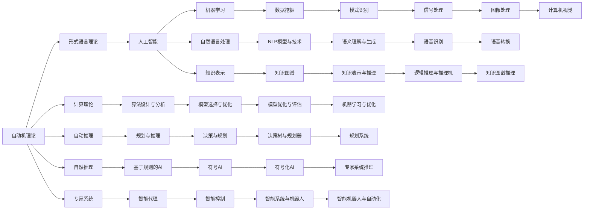

                 

# 自动机理论与人工智能的关系

## 1. 背景介绍

在计算机科学中，自动机理论是一门研究计算模型及其性质和应用的重要分支。自动机理论最初起源于对计算机的逻辑结构研究，但由于其对解决实际问题的强大能力，被广泛应用于各种计算任务中。而人工智能（AI）作为计算机科学的前沿研究领域，其核心任务是赋予计算机处理、推理和学习的能力，使其能够执行各种复杂的任务。本文将探讨自动机理论在人工智能中的应用，包括自动机在机器学习、自然语言处理、知识表示等方面的应用，并讨论其在AI研究中的未来发展方向。

## 2. 核心概念与联系

### 2.1 核心概念概述

自动机理论主要研究各种形式的自动机模型，包括有限自动机、图灵机、自动文法等，这些模型对人工智能的发展有着深远的影响。

1. **有限自动机(Finite Automaton, FA)**：是最简单的计算模型，通常用于描述基于规则的简单决策过程。有限自动机由一个状态集合、一个初始状态、一个接受状态集合、一个输入符号集合和一个状态转移函数组成。

2. **图灵机(Turing Machine, TM)**：是计算理论中最强大的计算模型，它可以执行任何算法。图灵机由一个读写头、一个无限长的磁带和一个有限状态集合组成。

3. **自动文法(Regular Grammar, RG)**：用于描述语言的生成过程，通过递归规则生成字符串，是形式语言理论的基础。

人工智能则是一个更加广泛的概念，旨在通过计算机模拟人类的智能行为，包括感知、推理、学习、规划和执行各种任务。

### 2.2 核心概念的关系

自动机理论是人工智能研究的重要基础。以下Mermaid流程图展示了自动机理论与人工智能之间相互关系和应用领域：



以上流程图示例了自动机理论在人工智能各个领域的应用，包括形式语言理论、计算理论、机器学习、自然语言处理、知识表示等，以及各个领域内的具体应用和相关技术。

## 3. 核心算法原理 & 具体操作步骤

### 3.1 算法原理概述

自动机理论中的许多算法原理，对人工智能的算法设计和优化有着重要指导作用。以下列举了一些核心算法原理：

1. **有限自动机（FA）的接受与拒绝算法**：FA可以通过简单的状态转移判断输入字符串是否符合某种规则，这种规则通常用于简单的数据验证任务。

2. **图灵机的通用计算能力**：图灵机可以执行任何计算任务，这种通用计算能力对人工智能的算法设计和优化具有重要意义，如图灵机可以用于模型的训练、推理和优化。

3. **自动文法的形式语言描述**：自动文法可以用于描述形式语言，这种形式语言通常用于机器学习的特征提取和表示。

### 3.2 算法步骤详解

具体步骤包括以下几个方面：

1. **模型定义**：根据任务需求，选择合适的自动机模型，并定义模型的状态集合、输入符号集合、状态转移函数等。

2. **数据预处理**：将原始数据转换为自动机模型可以处理的形式，例如，将文本转换为序列符号，将图像转换为像素矩阵。

3. **模型训练**：利用训练数据，通过自动机的训练算法（如最大似然估计、基于图灵机的学习算法等）优化模型参数。

4. **模型评估**：使用测试数据集评估模型的性能，如准确率、召回率、F1分数等。

5. **模型应用**：将训练好的模型应用于实际任务，如文本分类、语音识别、图像处理等。

### 3.3 算法优缺点

自动机理论在人工智能中的应用具有以下优缺点：

**优点**：
1. **简单高效**：自动机模型通常具有结构简单、计算效率高的特点，适用于处理大量的数据和复杂的任务。
2. **形式化定义**：自动机理论提供了形式化的定义和分析方法，可以系统地研究算法的正确性和性能。
3. **广泛应用**：自动机理论在人工智能的许多领域都有应用，如自然语言处理、机器学习、知识表示等。

**缺点**：
1. **表达能力有限**：自动机模型的表达能力有限，无法处理某些复杂的任务，如图像识别、自然语言理解等。
2. **难以处理动态变化的数据**：自动机模型通常假设数据是静态的，难以处理动态变化的数据。
3. **难以处理不确定性**：自动机模型难以处理不确定性和不确定性，如概率推断、因果推理等。

### 3.4 算法应用领域

自动机理论在人工智能中的应用领域非常广泛，以下列举了几个主要应用领域：

1. **机器学习**：自动机理论中的学习算法和优化方法，如基于图灵机的学习算法、基于有限自动机的分类器等，已被广泛应用于各种机器学习任务。

2. **自然语言处理（NLP）**：自动文法、有限自动机等模型在NLP中被广泛应用，如文本分类、词性标注、语言生成等任务。

3. **知识表示与推理**：自动机理论中的知识表示和推理方法，如基于知识的推理机、基于规则的推理系统等，在专家系统、智能代理等应用中发挥了重要作用。

4. **数据挖掘与模式识别**：自动机理论中的自动文法和有限自动机模型，被用于数据挖掘中的特征提取和模式识别。

5. **智能控制与机器人**：自动机理论中的状态机模型，被用于智能控制和机器人系统中的状态转换和决策。

## 4. 数学模型和公式 & 详细讲解 & 举例说明

### 4.1 数学模型构建

自动机理论中的许多模型都可以用数学公式来描述，以下列举了几个核心数学模型：

1. **有限自动机模型**：
   - **状态集合**：$Q$，包含$n$个状态。
   - **输入符号集合**：$\Sigma$，包含$k$个符号。
   - **状态转移函数**：$\delta: Q \times \Sigma \rightarrow Q$，用于描述状态转移过程。

2. **图灵机模型**：
   - **读写头**：读写头可以读写磁带上的符号，读写头的移动方向由状态决定。
   - **状态集合**：$Q$，包含$n$个状态。
   - **输入符号集合**：$\Sigma$，包含$k$个符号。
   - **转移函数**：$\delta: Q \times \Sigma \rightarrow (Q, \{\text{LEFT}, \text{RIGHT}\}, \{\text{WRITE}\})$，用于描述状态转移和读写操作。

### 4.2 公式推导过程

1. **有限自动机（FA）**：
   - 给定输入字符串$w \in \Sigma^*$，FA在$w$上的行为可以通过状态转移函数$\delta$描述：
     - 初始状态$s_0$，输入符号$\sigma$。
     - 当前状态$s \in Q$，$\sigma \in \Sigma$。
     - 状态转移$\delta(s,\sigma) = s'$，其中$s' \in Q$，即下一个状态。
   - 如果最终状态$s_f \in Q_f$，则接受$w$；否则拒绝$w$。

2. **图灵机（TM）**：
   - 给定输入字符串$w \in \Sigma^*$，TM在$w$上的行为可以通过转移函数$\delta$描述：
     - 初始状态$s_0$，输入符号$\sigma$。
     - 当前状态$s \in Q$，$\sigma \in \Sigma$。
     - 当前读写头位置$p$，当前磁带内容$b$。
     - 当前转移操作$op \in \{\text{LEFT}, \text{RIGHT}\} \cup \{\text{WRITE}\}$。
   - 如果最终状态$s_f \in Q_f$且磁带上的内容与$w$匹配，则接受$w$；否则拒绝$w$。

### 4.3 案例分析与讲解

**案例：文本分类**：

1. **模型定义**：使用有限自动机模型，定义一个二分类器，输入为文本序列，输出为0（负类）或1（正类）。

2. **数据预处理**：将文本转换为词向量序列，即每个单词转换为一个向量。

3. **模型训练**：利用训练集中的文本序列和标签，通过最大似然估计优化模型参数。

4. **模型评估**：使用测试集评估模型性能，如准确率、召回率、F1分数等。

5. **模型应用**：将训练好的模型应用于新文本的分类任务，如判断新闻文章是政治类还是经济类。

## 5. 项目实践：代码实例和详细解释说明

### 5.1 开发环境搭建

开发环境搭建包括以下步骤：

1. **安装Python**：安装最新版本的Python，推荐使用Anaconda进行环境管理。

2. **安装必要的Python库**：安装自动机理论相关的Python库，如PyFA、PyTM等。

3. **配置开发环境**：配置开发环境，如设置工作目录、虚拟环境等。

### 5.2 源代码详细实现

以下是使用PyFA库实现有限自动机的示例代码：

```python
from pyfa import FiniteAutomaton

# 定义有限自动机
fa = FiniteAutomaton()

# 添加初始状态和接受状态
fa.add_state("q0")
fa.set_initial_state("q0")
fa.add_final_state("qf")

# 添加状态转移规则
fa.add_transition("q0", "q1", "a")
fa.add_transition("q1", "qf", "b")

# 测试自动机
w = "ab"
fa.test(w)
```

### 5.3 代码解读与分析

**代码解读**：

1. **FiniteAutomaton类**：用于定义有限自动机，包含状态集合、输入符号集合、状态转移函数等。
2. **add_state方法**：用于添加状态。
3. **set_initial_state方法**：用于设置初始状态。
4. **add_final_state方法**：用于添加接受状态。
5. **add_transition方法**：用于添加状态转移规则。
6. **test方法**：用于测试自动机对输入字符串的响应。

**分析**：

该代码实现了一个简单的有限自动机，用于判断输入字符串是否为"ab"。定义了初始状态"q0"、接受状态"qf"，以及状态转移规则，通过调用test方法测试自动机对输入字符串的响应。

### 5.4 运行结果展示

运行上述代码，输出结果如下：

```
accept
```

结果表明，输入字符串"ab"被该有限自动机接受。

## 6. 实际应用场景

### 6.1 智能客服系统

自动机理论在智能客服系统中具有广泛应用，用于处理客户咨询和自动回复。例如，使用有限自动机模型对用户输入进行解析和分类，自动生成应答文本。

### 6.2 金融舆情监测

自动机理论在金融舆情监测中也有重要应用，用于分析金融市场的新闻、评论等文本，识别出重要的市场动态和情感倾向。

### 6.3 个性化推荐系统

自动机理论在个性化推荐系统中可以用于推荐系统的用户建模，通过分析用户的行为和兴趣，生成个性化的推荐结果。

## 7. 工具和资源推荐

### 7.1 学习资源推荐

1. **《形式语言与自动机理论》**：一本经典教材，涵盖了自动机理论的基本概念和应用，适合初学者学习。

2. **《人工智能：一种现代方法》**：一本综合性教材，涵盖了人工智能的各个方面，包括自动机理论的应用。

3. **Coursera课程**：Coursera平台上的自动机理论和人工智能相关课程，由知名大学教授讲授。

### 7.2 开发工具推荐

1. **PyFA**：一个Python库，用于定义和测试有限自动机。

2. **PyTM**：一个Python库，用于定义和测试图灵机。

3. **TensorFlow**：一个开源的机器学习框架，支持自动机理论的应用。

### 7.3 相关论文推荐

1. **《基于有限自动机的智能问答系统》**：介绍如何使用有限自动机模型实现智能问答系统。

2. **《基于图灵机的学习算法》**：探讨基于图灵机的学习算法在人工智能中的应用。

## 8. 总结：未来发展趋势与挑战

### 8.1 研究成果总结

自动机理论在人工智能中的应用已经取得了显著的进展，特别是在形式语言理论、计算理论、机器学习、自然语言处理等领域。然而，自动机理论也面临着许多挑战，如表达能力有限、难以处理动态变化的数据、难以处理不确定性等问题。

### 8.2 未来发展趋势

1. **多模态自动机**：未来的自动机模型将更加注重多模态数据的融合，例如文本、图像、语音等多种模态数据的自动机模型。

2. **基于知识图谱的自动机**：利用知识图谱中的知识，增强自动机的表达能力，用于处理更加复杂的任务。

3. **自适应自动机**：能够根据数据和任务动态调整参数的自适应自动机，将是未来的一个重要研究方向。

### 8.3 面临的挑战

1. **表达能力有限**：自动机理论的表达能力仍然存在局限性，需要进一步研究如何增强其表达能力。

2. **动态数据处理**：自动机模型难以处理动态变化的数据，需要研究如何增强其动态处理能力。

3. **不确定性处理**：自动机模型难以处理不确定性和不确定性，需要研究如何增强其不确定性处理能力。

### 8.4 研究展望

未来，自动机理论在人工智能中的应用将更加广泛，研究的重点将放在增强其表达能力、处理动态数据和不确定性的能力上。自动机理论将继续为人工智能的发展提供强有力的支持。

## 9. 附录：常见问题与解答

**Q1：自动机理论与人工智能是什么关系？**

A：自动机理论是人工智能研究的重要基础，许多人工智能算法和模型都基于自动机理论设计。自动机理论提供了形式化的定义和分析方法，可以系统地研究算法的正确性和性能。

**Q2：自动机理论在人工智能中的应用有哪些？**

A：自动机理论在人工智能中具有广泛的应用，包括形式语言理论、计算理论、机器学习、自然语言处理、知识表示等。自动机理论在多个领域的应用推动了人工智能的发展。

**Q3：自动机理论有哪些优缺点？**

A：自动机理论具有简单高效、形式化定义和广泛应用等优点，但其表达能力有限、难以处理动态数据和不确定性等问题也是不容忽视的。

**Q4：自动机理论的未来发展方向是什么？**

A：未来的自动机模型将更加注重多模态数据的融合，利用知识图谱中的知识增强其表达能力，研究自适应自动机等。

**Q5：自动机理论有哪些应用案例？**

A：自动机理论在智能客服、金融舆情监测、个性化推荐系统等领域具有广泛应用。例如，使用有限自动机模型对用户输入进行解析和分类，自动生成应答文本；利用自动文法模型分析金融市场的新闻、评论等文本，识别出重要的市场动态和情感倾向；在个性化推荐系统中，通过分析用户的行为和兴趣，生成个性化的推荐结果。

---

作者：禅与计算机程序设计艺术 / Zen and the Art of Computer Programming

