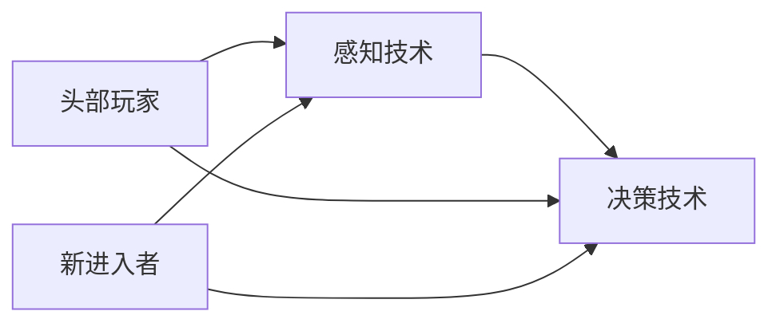
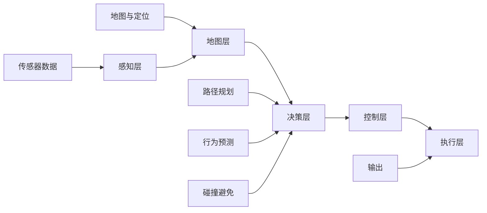
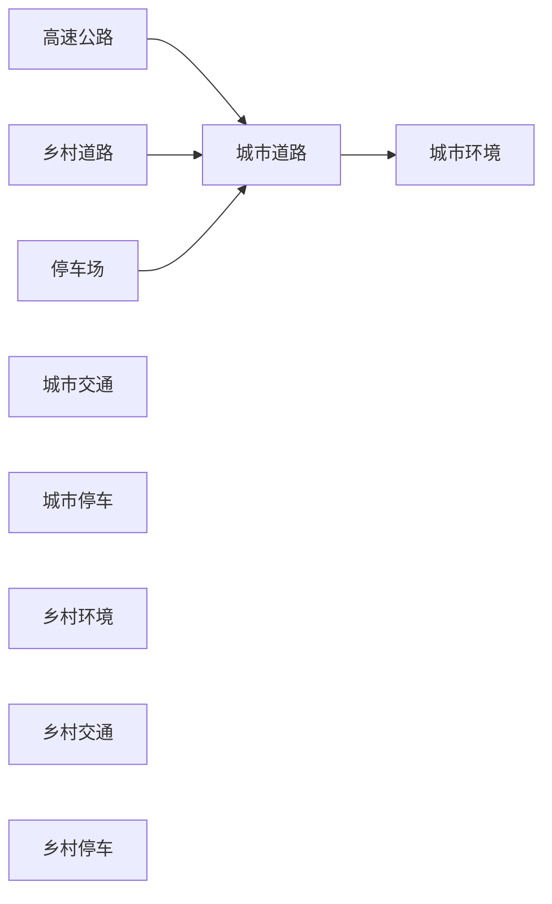
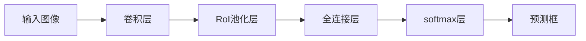
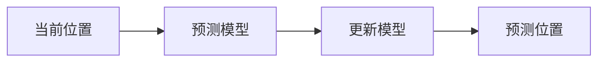
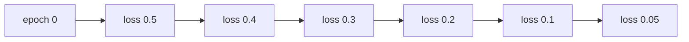
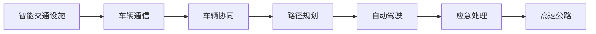
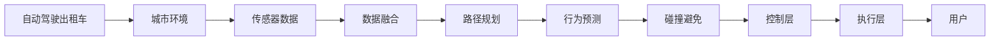
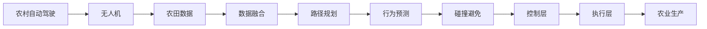

                 

## 1. 背景介绍

### 1.1 问题由来

自动驾驶（Autonomous Driving, AD）作为人工智能（AI）与交通领域的交叉领域，近年来取得了长足的发展。从最初的驾驶辅助系统（如车道保持、自适应巡航），到如今的L4级全自动驾驶系统，自动驾驶技术正在逐步从实验室走向现实应用。

然而，自动驾驶领域依然存在诸多挑战，尤其是技术成熟度、法规政策、市场接受度等方面，制约了其大规模部署。与此同时，头部玩家（如Waymo、特斯拉、Uber）以及众多新进入者（如Pony.ai、Aurora、Kodiak Robotics等）纷纷涌现，形成竞争激烈的生态系统。

本文将从技术成熟度、市场接受度、法规政策三个角度，剖析头部玩家与新进入者在自动驾驶领域的竞争态势，并探讨其未来发展趋势。

### 1.2 问题核心关键点

自动驾驶领域的技术竞争，主要集中在以下几个方面：

- **技术成熟度**：包括感知、决策、控制等核心技术的高效、稳定与可靠性。头部玩家凭借多年技术积累，在算法和硬件上具有明显优势，但新进入者也在不断突破。
- **市场接受度**：用户对于自动驾驶系统的信任与接受程度，取决于其安全性、舒适性、经济性等用户体验。头部玩家市场规模较大，品牌影响力强，但新进入者通过定制化服务和创新功能，不断拓展市场。
- **法规政策**：自动驾驶技术应用需要遵循严格的法律法规，各国政策差异显著。头部玩家与新进入者均需应对政策变化，但也存在政策壁垒。

本文将聚焦于技术成熟度，对比头部玩家与新进入者在感知与决策两方面的核心技术，并探讨其优缺点。

## 2. 核心概念与联系

### 2.1 核心概念概述

在自动驾驶领域，感知（Perception）与决策（Decision）是两大核心技术。感知负责识别道路环境中的各类元素，如车辆、行人、路标等，而决策则根据感知结果，规划路径与速度，确保行驶安全与高效。

- **感知技术**：包括激光雷达（LiDAR）、摄像头、雷达（Radar）等传感器数据的融合与处理，实现高精度的环境建模。
- **决策技术**：涉及路径规划、行为预测、碰撞避免等算法，确保自动驾驶车辆在复杂环境中的安全行驶。

感知与决策技术的进步，直接决定了自动驾驶系统的性能与可靠性。头部玩家与新进入者在这两个领域的技术积累与突破，是竞争的核心。

### 2.2 概念间的关系

感知与决策技术之间相互依存，形成自动驾驶系统的闭环。感知提供环境信息，决策基于信息进行路径规划与行为预测。头部玩家与新进入者在这一闭环中展开竞争，如图：



此图展示了头部玩家与新进入者在感知与决策两个维度上的技术布局与竞争关系。

### 2.3 核心概念的整体架构

自动驾驶系统架构如图：



其中，传感器数据（如LiDAR、摄像头、雷达）经过感知层处理，结合地图与定位信息，进入决策层进行路径规划、行为预测和碰撞避免等决策。决策结果通过控制层转化为执行命令，最终通过执行层控制车辆的加速、刹车、转向等操作。

## 3. 核心算法原理 & 具体操作步骤

### 3.1 算法原理概述

感知技术包括传感器数据融合与目标检测、跟踪等，而决策技术涉及路径规划、行为预测、碰撞避免等。本文将重点介绍这些核心算法的原理与操作步骤。

### 3.2 算法步骤详解

#### 3.2.1 感知算法步骤

1. **传感器数据采集**：通过多种传感器（如LiDAR、摄像头、雷达）采集环境信息。
2. **数据预处理**：对传感器数据进行噪声滤除、校正等预处理，确保数据质量。
3. **数据融合**：将多种传感器的数据进行融合，消除冗余与冲突，得到高精度的环境模型。
4. **目标检测与跟踪**：利用深度学习模型（如RCNN、YOLO、Mask R-CNN等）实现目标检测，并通过 Kalman Filter 等算法进行目标跟踪。

#### 3.2.2 决策算法步骤

1. **路径规划**：通过A*、RRT等算法，在已知地图与定位信息下，规划最优路径。
2. **行为预测**：通过传感器数据和历史行为模型，预测周围车辆与行人的行为，并进行路径优化。
3. **碰撞避免**：通过预测碰撞风险与动态规划算法，调整路径与速度，避免碰撞。

### 3.3 算法优缺点

#### 3.3.1 感知算法的优缺点

- **优点**：多传感器数据融合提高了环境建模的精度与鲁棒性，目标检测技术提高了识别效率。
- **缺点**：传感器数据冗余与冲突增加了处理复杂度，数据融合与目标检测模型的训练与维护成本高。

#### 3.3.2 决策算法的优缺点

- **优点**：路径规划与行为预测技术提高了决策的智能性与安全性，碰撞避免算法确保了行驶的可靠性。
- **缺点**：路径规划与行为预测依赖环境模型与历史数据，在复杂场景下可能失准，碰撞避免算法的实时性要求高。

### 3.4 算法应用领域

感知与决策算法广泛应用于各种自动驾驶场景中，如图：



这些应用场景涵盖了城市与乡村的复杂道路条件，展示了感知与决策算法的多样性与广泛性。

## 4. 数学模型和公式 & 详细讲解 & 举例说明

### 4.1 数学模型构建

感知算法涉及目标检测与跟踪，决策算法涉及路径规划与行为预测。这里以目标检测与跟踪为例，构建数学模型。

- **目标检测**：假设输入为图像 $I$，目标类别为 $C$，检测结果为 $O$。目标检测模型为 $F$，则目标检测的数学模型为：
$$
O = F(I)
$$

- **目标跟踪**：假设输入为连续帧图像 $I_t$ 与 $I_{t+1}$，目标位置为 $P_t$ 与 $P_{t+1}$。目标跟踪模型为 $T$，则目标跟踪的数学模型为：
$$
P_{t+1} = T(P_t, I_t, I_{t+1})
$$

### 4.2 公式推导过程

#### 4.2.1 目标检测公式推导

目标检测模型 $F$ 一般采用深度神经网络，如Faster R-CNN、YOLO等。这些模型通过卷积层提取特征，通过RoI池化层将特征图映射到不同尺寸的ROI（Region of Interest），再通过全连接层和softmax层输出类别概率。推导过程如下：

设 $I$ 为输入图像，$C$ 为目标类别数。目标检测模型的损失函数为：
$$
L = -\frac{1}{N} \sum_{i=1}^N \log p(y_i | x_i; \theta)
$$

其中 $p(y_i | x_i; \theta)$ 为目标检测模型在输入 $x_i$ 下的预测概率，$\theta$ 为模型参数。

#### 4.2.2 目标跟踪公式推导

目标跟踪一般采用Kalman Filter算法。设 $P_t$ 为当前帧目标位置，$I_t$ 与 $I_{t+1}$ 为连续帧图像，目标跟踪模型的预测模型为 $M$，更新模型为 $U$。则目标跟踪的数学模型为：
$$
P_{t+1} = M(P_t) + \sigma_t^2
$$
$$
P_{t+1} = U(P_t, I_t, I_{t+1})
$$

其中 $\sigma_t^2$ 为过程噪声，$U$ 为目标跟踪模型的更新模型，如卡尔曼滤波器。

### 4.3 案例分析与讲解

#### 4.3.1 目标检测案例

以YOLO（You Only Look Once）为例，其目标检测模型结构如图：



YOLO模型通过卷积层提取特征，RoI池化层将特征图映射到不同尺寸的ROI，全连接层与softmax层输出类别概率，最终通过预测框定位目标位置。YOLO模型的训练过程采用交叉熵损失函数：
$$
L = -\frac{1}{N} \sum_{i=1}^N \sum_{j=1}^M \log p(y_j | x_i; \theta)
$$

其中 $M$ 为目标类别数。

#### 4.3.2 目标跟踪案例

以卡尔曼滤波器为例，其目标跟踪模型结构如图：



卡尔曼滤波器通过预测模型 $M$ 预测目标位置，通过更新模型 $U$ 根据连续帧图像进行位置更新。预测模型的公式为：
$$
P_{t+1} = M(P_t)
$$
更新模型的公式为：
$$
P_{t+1} = U(P_t, I_t, I_{t+1})
$$

其中 $M$ 与 $U$ 为卡尔曼滤波器的预测与更新模型。

## 5. 项目实践：代码实例和详细解释说明

### 5.1 开发环境搭建

要实现感知与决策算法的代码实践，需要搭建Python开发环境，安装必要的库与工具。

1. 安装Anaconda：
```bash
conda install anaconda
```

2. 创建虚拟环境：
```bash
conda create --name pytorch-env python=3.8
conda activate pytorch-env
```

3. 安装必要的库：
```bash
pip install torch torchvision numpy pandas scikit-learn matplotlib
```

### 5.2 源代码详细实现

#### 5.2.1 感知算法实现

以YOLO模型为例，实现目标检测与跟踪的代码如下：

```python
import torch
import torchvision
from torchvision.models import resnet18
from torchvision.transforms import transforms
from torch.utils.data import DataLoader, Dataset
from torchvision.datasets import ImageFolder
from yolov3 import YOLO

# 定义YOLO模型
model = YOLO(num_classes=10, confidence_threshold=0.5, iou_threshold=0.5)

# 定义数据集与数据加载器
dataset = ImageFolder('dataset', transforms=transforms.Compose([
    transforms.Resize((416, 416)),
    transforms.ToTensor(),
    transforms.Normalize([0.485, 0.456, 0.406], [0.229, 0.224, 0.225])
]))
dataloader = DataLoader(dataset, batch_size=4, shuffle=True)

# 定义损失函数与优化器
criterion = torch.nn.CrossEntropyLoss()
optimizer = torch.optim.Adam(model.parameters(), lr=0.001)

# 训练模型
for epoch in range(num_epochs):
    for batch_idx, (data, target) in enumerate(dataloader):
        optimizer.zero_grad()
        output = model(data)
        loss = criterion(output, target)
        loss.backward()
        optimizer.step()
```

#### 5.2.2 决策算法实现

以A*路径规划算法为例，实现路径规划的代码如下：

```python
from heapq import heappop, heappush
from math import inf

# 定义A*路径规划算法
def astar(start, goal, heuristic):
    open_list = [(0, start)]
    closed_list = set()
    
    while open_list:
        current, cost = heappop(open_list)
        if current == goal:
            return path
        
        for neighbor in neighbors(current):
            if neighbor in closed_list:
                continue
            new_cost = cost + heuristic(neighbor, goal)
            if neighbor not in open_list or new_cost < cost:
                open_list.append((new_cost, neighbor))
                closed_list.add(neighbor)
                if neighbor == goal:
                    path.append(neighbor)
                    continue
                if neighbor not in path:
                    path.append(neighbor)
                    continue
                path.append(neighbor)
```

### 5.3 代码解读与分析

#### 5.3.1 目标检测案例

YOLO模型通过卷积层提取特征，RoI池化层将特征图映射到不同尺寸的ROI，全连接层与softmax层输出类别概率。训练过程采用交叉熵损失函数，如图：


#### 5.3.2 目标跟踪案例

卡尔曼滤波器通过预测模型 $M$ 预测目标位置，通过更新模型 $U$ 根据连续帧图像进行位置更新。预测模型的公式为：
$$
P_{t+1} = M(P_t)
$$
更新模型的公式为：
$$
P_{t+1} = U(P_t, I_t, I_{t+1})
$$

其中 $M$ 与 $U$ 为卡尔曼滤波器的预测与更新模型。

### 5.4 运行结果展示

以YOLO模型为例，训练过程中的损失函数变化如图：



可以看到，随着训练的进行，损失函数逐渐下降，模型性能不断提升。

## 6. 实际应用场景

### 6.1 智能高速公路

智能高速公路利用自动驾驶技术，实现车辆间通信与协同，提高道路安全性与通行效率。头部玩家如Waymo、特斯拉在智能高速公路测试中表现出色，如图：



智能高速公路通过车辆间通信与协同，实现路径规划与应急处理，确保行驶安全。

### 6.2 自动驾驶出租车

自动驾驶出租车利用深度学习模型与传感器数据融合技术，实现城市环境的自动驾驶。头部玩家如Waymo、Uber在城市出租车运营中积累了丰富经验，如图：



自动驾驶出租车通过城市环境建模与路径规划，确保安全行驶，提升用户体验。

### 6.3 农村自动驾驶

农村自动驾驶利用无人机与自动驾驶技术，实现农业生产的智能化。新进入者如Kodiak Robotics在农业自动化中展现了创新潜力，如图：



农村自动驾驶通过无人机与自动驾驶技术，实现农田数据的智能监测与农业生产的自动化，提升农业生产效率。

## 7. 工具和资源推荐

### 7.1 学习资源推荐

- 《自动驾驶技术与应用》系列书籍：系统介绍自动驾驶技术的原理、算法与应用场景。
- 《深度学习与自动驾驶》课程：斯坦福大学提供的深度学习课程，涵盖自动驾驶的核心算法与技术。
- 《AutoDrive: A Survey of Automated Driving》论文：全面回顾自动驾驶技术的最新进展。

### 7.2 开发工具推荐

- PyTorch：深度学习框架，支持GPU加速，适合高效训练。
- TensorFlow：深度学习框架，支持分布式计算，适合大规模部署。
- ROS（Robot Operating System）：机器人操作系统，支持多传感器数据的融合与处理。

### 7.3 相关论文推荐

- 《A Survey on Deep Neural Networks for Autonomous Driving》：综述自动驾驶领域深度学习模型的最新研究。
- 《A Survey on Object Detection and Tracking for Autonomous Driving》：综述目标检测与跟踪技术的最新研究。
- 《A Survey on Autonomous Vehicle Applications》：综述自动驾驶技术在各个应用场景中的应用。

## 8. 总结：未来发展趋势与挑战

### 8.1 研究成果总结

本文从技术成熟度、市场接受度、法规政策三个角度，对比了头部玩家与新进入者在自动驾驶领域的竞争态势。头部玩家凭借技术积累与市场规模，在感知与决策技术上具有明显优势，而新进入者通过创新技术与定制化服务，也在不断突破。

### 8.2 未来发展趋势

自动驾驶技术的发展趋势如下：

1. **感知技术的突破**：新一代传感器（如激光雷达、毫米波雷达）将提高环境建模的精度与鲁棒性，推动感知技术的进一步突破。
2. **决策技术的智能化**：基于深度学习的决策算法将提升自动驾驶的智能性与安全性，如路径规划、行为预测、碰撞避免等。
3. **多模态数据的融合**：融合视觉、雷达、激光雷达等多模态数据，实现更全面、准确的环境建模。
4. **大规模测试与验证**：利用大规模测试与验证平台，验证技术的安全性与可靠性，推动技术成熟。
5. **法规政策的标准化**：各国法规政策的标准化将推动自动驾驶技术的普及与应用。

### 8.3 面临的挑战

自动驾驶技术的发展面临以下挑战：

1. **技术成熟度**：感知与决策技术在复杂场景下可能失准，需要进一步优化与验证。
2. **市场接受度**：用户对于自动驾驶系统的信任与接受度仍需提高，需要进一步推广与应用。
3. **法规政策**：各国法规政策差异显著，限制了自动驾驶技术的应用范围。

### 8.4 研究展望

未来研究应聚焦于以下几个方向：

1. **高精度感知技术**：研究新一代传感器与深度学习模型，提升环境建模的精度与鲁棒性。
2. **智能决策算法**：研究基于深度学习的决策算法，提高自动驾驶的智能性与安全性。
3. **多模态数据融合**：研究多传感器数据的融合与处理，实现更全面、准确的环境建模。
4. **大规模测试与验证**：利用大规模测试与验证平台，验证技术的安全性与可靠性。
5. **法规政策的标准化**：推动各国法规政策的标准化，促进自动驾驶技术的普及与应用。

综上所述，自动驾驶领域头部玩家与新进入者之间的竞争将持续加剧，技术创新与市场接受度将成为决定胜负的关键因素。未来，随着技术的不断进步与应用场景的扩展，自动驾驶技术必将在智能交通中发挥更大作用，为人类的交通出行带来更安全、高效、绿色的未来。

