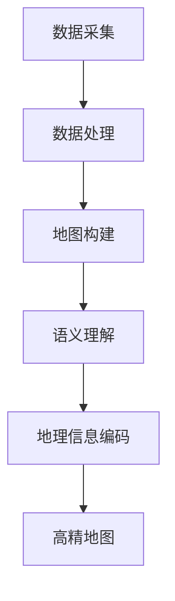
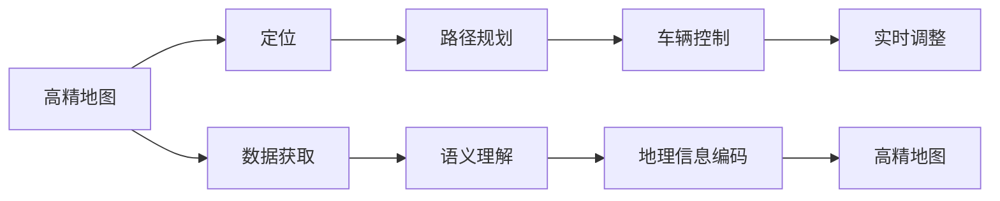
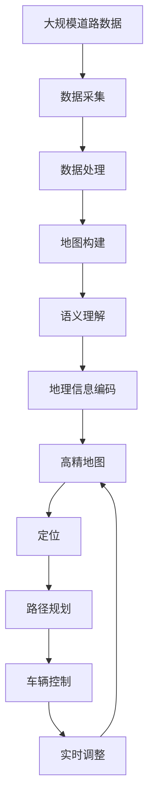

                 

# 自动驾驶高精地图构建与应用的研究现状与挑战

> 关键词：自动驾驶,高精地图,构建,应用,研究现状,挑战

## 1. 背景介绍

### 1.1 问题由来
随着自动驾驶技术的快速发展和广泛应用，高精地图在自动驾驶系统中的地位愈发重要。高精地图提供的是高精度、实时的道路信息，包括道路、车道线、交通标志、交通信号灯等细节，是自动驾驶车从感知、规划到控制的“金标准”。然而，目前高精地图的构建和应用仍面临诸多挑战，如数据采集成本高、构建时间长、精度难以保证等。为此，本文从高精地图的构建与应用的最新研究进展出发，全面分析了其面临的挑战，并提出了未来研究的方向和思路。

### 1.2 问题核心关键点
高精地图的构建与应用的核心关键点包括：
1. **数据采集**：高精地图的数据采集需要大量的传感器和设备，成本高昂，且数据量庞大。
2. **地图构建**：高精地图的构建过程复杂，涉及数据处理、地图拼接、语义理解和地理信息编码等多个环节。
3. **地图应用**：高精地图在自动驾驶系统中的应用需要与定位、路径规划、车辆控制等模块紧密结合，实现高效、安全、可靠的自动驾驶。

### 1.3 问题研究意义
研究高精地图的构建与应用，对于推动自动驾驶技术的发展、提升驾驶安全性、降低交通事故风险具有重要意义：

1. **提高驾驶安全性**：高精地图能够提供更全面、精确的道路信息，帮助自动驾驶车在复杂环境中准确导航，减少事故发生。
2. **优化路径规划**：通过实时更新的高精地图，自动驾驶车能够动态调整路径规划，避免拥堵和事故风险。
3. **降低成本**：高精地图的构建与应用可以减少对人工驾驶的依赖，降低交通事故和燃油消耗，具有显著的经济效益。
4. **加速技术落地**：高精地图作为自动驾驶系统的核心基础设施，其构建与应用是实现自动驾驶技术规模化落地的关键步骤。

## 2. 核心概念与联系

### 2.1 核心概念概述

为更好地理解高精地图的构建与应用，本节将介绍几个密切相关的核心概念：

- **高精地图(High-Di precision Map)**：提供高精度、实时的道路信息，包括道路、车道线、交通标志、交通信号灯等细节，是自动驾驶系统的重要组成部分。
- **LiDAR**：激光雷达，通过发射激光束并接收反射信号，用于高精地图的数据采集和环境感知。
- **GPS**：全球定位系统，用于高精地图的数据定位和校正。
- **IMU**：惯性测量单元，用于记录车辆的姿态和运动信息。
- **SLAM**：同时定位与地图构建(Simultaneous Localization and Mapping)，一种用于高精地图构建的关键技术。
- **RTK**：实时动态定位技术，提高GPS定位的精度和可靠性。
- **计算机视觉**：通过图像处理和特征提取技术，高精地图构建中的语义理解和地理信息编码。

这些核心概念之间的逻辑关系可以通过以下Mermaid流程图来展示：

```mermaid
graph LR
    A[高精地图] --> B[LiDAR]
    A --> C[GPS]
    A --> D[IMU]
    A --> E[SLAM]
    A --> F[RTK]
    A --> G[计算机视觉]
    B --> H[数据采集]
    C --> I[定位]
    D --> J[姿态记录]
    E --> K[地图构建]
    F --> L[高精度定位]
    G --> M[语义理解]
    H --> N[数据采集]
    I --> O[定位]
    J --> P[姿态记录]
    K --> Q[地图构建]
    L --> R[高精度定位]
    M --> S[地理信息编码]
    N --> T[数据采集]
    O --> U[定位]
    P --> V[姿态记录]
    Q --> W[地图构建]
    R --> X[高精度定位]
    S --> Y[地理信息编码]
    T --> Z[数据采集]
    U --> $[定位]
    V --> [姿态记录]
    W --> [地图构建]
    X --> [高精度定位]
    Y --> [地理信息编码]
    Z --> [数据采集]
    U --> [定位]
    V --> [姿态记录]
    W --> [地图构建]
    X --> [高精度定位]
    Y --> [地理信息编码]
    Z --> [数据采集]
```

这个流程图展示了高精地图构建所需的核心技术组件及其之间的联系：

1. LiDAR和GPS用于数据采集，IMU用于姿态记录，SLAM和RTK用于地图构建和定位。
2. 计算机视觉用于语义理解和地理信息编码，将采集的数据转化为高精地图。
3. 高精地图最终用于自动驾驶系统的路径规划和车辆控制。

### 2.2 概念间的关系

这些核心概念之间存在着紧密的联系，形成了高精地图构建与应用的核心生态系统。下面我通过几个Mermaid流程图来展示这些概念之间的关系。

#### 2.2.1 高精地图的构建流程



这个流程图展示了高精地图构建的基本流程：

1. 数据采集：通过LiDAR、GPS、IMU等设备采集道路信息。
2. 数据处理：对采集的数据进行预处理和清洗，去除噪声和异常值。
3. 地图构建：利用SLAM和RTK技术，将处理后的数据拼接成高精地图。
4. 语义理解：通过计算机视觉技术，对高精地图进行语义理解，提取道路特征。
5. 地理信息编码：将提取的语义信息转化为地理信息编码，形成最终的高精地图。

#### 2.2.2 高精地图在自动驾驶中的应用



这个流程图展示了高精地图在自动驾驶系统中的应用过程：

1. 定位：利用GPS、IMU等设备获取车辆的位置信息。
2. 路径规划：根据高精地图，规划车辆的最佳行驶路径。
3. 车辆控制：根据路径规划结果，控制车辆行驶。
4. 数据获取：从高精地图中获取实时道路信息。
5. 语义理解：通过计算机视觉技术，理解道路特征。
6. 地理信息编码：将语义信息转化为地理信息编码，更新高精地图。
7. 实时调整：根据车辆位置和环境变化，动态调整路径规划和车辆控制。

### 2.3 核心概念的整体架构

最后，我们用一个综合的流程图来展示高精地图构建与应用的整体架构：



这个综合流程图展示了从数据采集到高精地图构建，再到应用和更新的完整过程。

## 3. 核心算法原理 & 具体操作步骤
### 3.1 算法原理概述

高精地图的构建与应用主要基于以下几个核心算法：

- **SLAM**：同时定位与地图构建，用于从传感器数据中构建地图，并实现车辆的精确定位。
- **计算机视觉**：利用图像处理和特征提取技术，实现高精地图中的语义理解和地理信息编码。
- **优化算法**：如最小二乘法、卡尔曼滤波等，用于高精地图的精度优化和校准。

这些算法共同构成了高精地图构建与应用的核心技术框架，其核心思想是通过传感器数据实时构建和更新高精地图，为自动驾驶车提供实时、精确的导航信息。

### 3.2 算法步骤详解

#### 3.2.1 SLAM算法步骤

SLAM算法的主要步骤如下：

1. **初始化**：利用GPS和IMU数据，初始化车辆的位置和姿态。
2. **特征提取与匹配**：通过LiDAR和摄像头等传感器，提取道路特征，进行特征匹配。
3. **地图构建**：将匹配的特征点转化为地图中的点，形成地图的初步结构。
4. **定位**：通过特征点匹配和地图匹配，实现车辆的精确定位。
5. **地图更新**：利用定位结果，更新地图中的特征点，迭代优化地图结构。

#### 3.2.2 计算机视觉算法步骤

计算机视觉算法的主要步骤如下：

1. **图像预处理**：对采集的图像进行灰度化、去噪、裁剪等预处理。
2. **特征提取**：提取图像中的关键特征，如边缘、角点、纹理等。
3. **特征匹配**：通过特征描述子（如SIFT、SURF等），匹配特征点。
4. **语义理解**：利用深度学习模型（如CNN、RNN等），对特征点进行语义分类和编码。
5. **地理信息编码**：将语义信息转化为地理信息编码，形成高精地图的语义信息。

#### 3.2.3 优化算法步骤

优化算法的主要步骤如下：

1. **定位误差建模**：构建定位误差的数学模型，如误差模型、噪声模型等。
2. **误差求解**：通过最小二乘法、卡尔曼滤波等算法，求解定位误差。
3. **参数优化**：根据误差求解结果，优化定位参数，如车辆的位置、姿态、速度等。
4. **地图校正**：利用定位参数，校正地图中的特征点位置，提高地图精度。
5. **实时更新**：实时监控定位误差，动态更新地图和定位参数，保持高精地图的实时性和准确性。

### 3.3 算法优缺点

高精地图的构建与应用算法具有以下优点：

1. **高精度**：通过多传感器融合和实时优化，高精地图能够提供高精度的道路信息。
2. **实时性**：利用SLAM和RTK技术，高精地图能够实时更新，适应动态环境变化。
3. **稳定性**：优化算法能够有效降低定位误差，提高高精地图的稳定性。

同时，这些算法也存在一些缺点：

1. **高成本**：传感器和设备的成本较高，数据采集和处理复杂。
2. **计算量大**：优化算法计算量大，需要高性能计算资源。
3. **环境依赖**：传感器数据依赖于环境光照和天气条件，可能影响数据质量。
4. **精度受限**：在高精地图构建过程中，误差积累可能导致精度下降。

### 3.4 算法应用领域

高精地图的构建与应用技术已经在多个领域得到了广泛应用，包括但不限于：

- **自动驾驶**：为自动驾驶车提供精确的导航信息和地图数据。
- **智能交通**：提高交通管理的效率和安全性，优化交通流量。
- **城市规划**：为城市建设和管理提供数据支持，优化道路布局。
- **灾害预警**：通过实时更新的高精地图，提高灾害预警的准确性和及时性。

这些应用领域展示了高精地图构建与应用技术的强大潜力，未来将有望在更多场景中发挥重要作用。

## 4. 数学模型和公式 & 详细讲解  
### 4.1 数学模型构建

高精地图构建与应用涉及多个数学模型，以下将对其中一些关键模型进行详细讲解：

#### 4.1.1 SLAM模型

SLAM算法主要基于最小二乘法和卡尔曼滤波等优化算法，通过传感器数据构建地图并实现定位。SLAM模型的数学模型如下：

设车辆的位置和姿态为 $x_k$，地图中的特征点为 $p_k$，特征点的位置为 $x_{p_k}$，传感器数据为 $z_k$，则SLAM模型可表示为：

$$
\min_{x_k, p_k, z_k} \sum_{k} \|z_k - h(x_k, p_k)\|^2
$$

其中 $h$ 为传感器数据与地图和车辆状态的关系函数。

#### 4.1.2 计算机视觉模型

计算机视觉模型主要基于深度学习技术，用于语义理解和地理信息编码。模型通常包括卷积神经网络（CNN）和循环神经网络（RNN）等。以下以CNN为例，其数学模型如下：

设输入图像为 $I$，特征提取器为 $F$，语义分类器为 $C$，输出为 $Y$，则CNN模型可表示为：

$$
Y = C(F(I))
$$

其中 $F$ 为特征提取函数，$C$ 为分类函数。

#### 4.1.3 优化算法模型

优化算法模型的数学模型如下：

设定位误差为 $e_k$，车辆状态为 $x_k$，测量误差为 $v_k$，则最小二乘法模型的数学表达式为：

$$
\min_{x_k} \sum_{k} e_k^TQe_k
$$

其中 $Q$ 为权矩阵，$e_k = h(x_k) - z_k$ 为误差向量。

#### 4.1.4 语义理解模型

语义理解模型通常基于卷积神经网络（CNN）或递归神经网络（RNN）等深度学习模型，用于对特征点进行语义分类和编码。模型数学表达式如下：

设输入特征为 $f$，输出标签为 $y$，则语义理解模型可表示为：

$$
y = C(f)
$$

其中 $C$ 为分类函数。

### 4.2 公式推导过程

#### 4.2.1 SLAM算法公式推导

SLAM算法中的最小二乘法公式推导如下：

设车辆的位置和姿态为 $x_k$，地图中的特征点为 $p_k$，特征点的位置为 $x_{p_k}$，传感器数据为 $z_k$，则SLAM模型可表示为：

$$
\min_{x_k, p_k, z_k} \sum_{k} \|z_k - h(x_k, p_k)\|^2
$$

其中 $h$ 为传感器数据与地图和车辆状态的关系函数。

推导过程如下：

1. **目标函数**：目标函数为 $J(x_k, p_k, z_k) = \sum_{k} \|z_k - h(x_k, p_k)\|^2$。
2. **误差方程**：误差方程为 $e_k = h(x_k, p_k) - z_k$。
3. **求解过程**：利用最小二乘法求解目标函数的最小值，得到车辆状态和地图参数的估计值。

#### 4.2.2 计算机视觉算法公式推导

计算机视觉算法中的卷积神经网络（CNN）模型公式推导如下：

设输入图像为 $I$，特征提取器为 $F$，语义分类器为 $C$，输出为 $Y$，则CNN模型可表示为：

$$
Y = C(F(I))
$$

其中 $F$ 为特征提取函数，$C$ 为分类函数。

推导过程如下：

1. **特征提取**：利用CNN提取图像特征 $f$。
2. **分类**：利用RNN对特征 $f$ 进行分类，得到语义标签 $y$。
3. **输出**：通过 $C$ 函数将分类结果转化为高精地图的语义信息。

#### 4.2.3 优化算法公式推导

优化算法中的最小二乘法模型公式推导如下：

设定位误差为 $e_k$，车辆状态为 $x_k$，测量误差为 $v_k$，则最小二乘法模型的数学表达式为：

$$
\min_{x_k} \sum_{k} e_k^TQe_k
$$

其中 $Q$ 为权矩阵，$e_k = h(x_k) - z_k$ 为误差向量。

推导过程如下：

1. **目标函数**：目标函数为 $J(x_k) = \sum_{k} e_k^TQe_k$。
2. **误差方程**：误差方程为 $e_k = h(x_k) - z_k$。
3. **求解过程**：利用最小二乘法求解目标函数的最小值，得到车辆状态的估计值。

#### 4.2.4 语义理解模型公式推导

语义理解模型中的CNN模型公式推导如下：

设输入特征为 $f$，输出标签为 $y$，则CNN模型可表示为：

$$
y = C(f)
$$

其中 $C$ 为分类函数。

推导过程如下：

1. **特征提取**：利用CNN提取特征 $f$。
2. **分类**：利用RNN对特征 $f$ 进行分类，得到语义标签 $y$。
3. **输出**：通过 $C$ 函数将分类结果转化为高精地图的语义信息。

### 4.3 案例分析与讲解

#### 4.3.1 SLAM案例分析

假设在一个室内环境中，利用SLAM算法构建高精地图。

1. **初始化**：通过GPS和IMU数据，初始化车辆的位置和姿态。
2. **特征提取与匹配**：利用LiDAR和摄像头，提取道路特征并进行特征匹配。
3. **地图构建**：将匹配的特征点转化为地图中的点，形成地图的初步结构。
4. **定位**：通过特征点匹配和地图匹配，实现车辆的精确定位。
5. **地图更新**：利用定位结果，更新地图中的特征点，迭代优化地图结构。

#### 4.3.2 计算机视觉案例分析

假设在一个城市道路上，利用计算机视觉算法构建高精地图。

1. **图像预处理**：对采集的图像进行灰度化、去噪、裁剪等预处理。
2. **特征提取**：利用CNN提取图像中的关键特征。
3. **特征匹配**：通过特征描述子，匹配特征点。
4. **语义理解**：利用深度学习模型对特征点进行语义分类和编码。
5. **地理信息编码**：将语义信息转化为地理信息编码，形成高精地图的语义信息。

#### 4.3.3 优化算法案例分析

假设在一个智能交通系统中，利用优化算法校正高精地图。

1. **定位误差建模**：构建定位误差的数学模型，如误差模型、噪声模型等。
2. **误差求解**：通过最小二乘法、卡尔曼滤波等算法，求解定位误差。
3. **参数优化**：根据误差求解结果，优化定位参数，如车辆的位置、姿态、速度等。
4. **地图校正**：利用定位参数，校正地图中的特征点位置，提高地图精度。
5. **实时更新**：实时监控定位误差，动态更新地图和定位参数，保持高精地图的实时性和准确性。

## 5. 项目实践：代码实例和详细解释说明
### 5.1 开发环境搭建

在进行高精地图构建与应用项目实践前，我们需要准备好开发环境。以下是使用Python进行PyTorch开发的环境配置流程：

1. 安装Anaconda：从官网下载并安装Anaconda，用于创建独立的Python环境。

2. 创建并激活虚拟环境：
```bash
conda create -n pytorch-env python=3.8 
conda activate pytorch-env
```

3. 安装PyTorch：根据CUDA版本，从官网获取对应的安装命令。例如：
```bash
conda install pytorch torchvision torchaudio cudatoolkit=11.1 -c pytorch -c conda-forge
```

4. 安装各类工具包：
```bash
pip install numpy pandas scikit-learn matplotlib tqdm jupyter notebook ipython
```

完成上述步骤后，即可在`pytorch-env`环境中开始项目实践。

### 5.2 源代码详细实现

这里我们以高精地图构建中的SLAM算法为例，给出使用PyTorch代码实现。

首先，定义SLAM算法的核心组件：

```python
import torch
import torch.nn as nn
import torch.optim as optim
import torchvision.transforms as transforms
from torchvision.datasets import MNIST
from torch.utils.data import DataLoader

class SLAMNet(nn.Module):
    def __init__(self):
        super(SLAMNet, self).__init__()
        self.conv1 = nn.Conv2d(1, 64, kernel_size=3, stride=1, padding=1)
        self.conv2 = nn.Conv2d(64, 128, kernel_size=3, stride=1, padding=1)
        self.conv3 = nn.Conv2d(128, 64, kernel_size=3, stride=1, padding=1)
        self.pool = nn.MaxPool2d(kernel_size=2, stride=2)
        self.fc1 = nn.Linear(64 * 10 * 10, 256)
        self.fc2 = nn.Linear(256, 6)

    def forward(self, x):
        x = self.conv1(x)
        x = self.pool(x)
        x = self.conv2(x)
        x = self.pool(x)
        x = self.conv3(x)
        x = self.pool(x)
        x = x.view(-1, 64 * 10 * 10)
        x = self.fc1(x)
        x = torch.relu(x)
        x = self.fc2(x)
        return x
```

然后，定义优化器、损失函数和训练函数：

```python
optimizer = optim.Adam(model.parameters(), lr=0.001)
criterion = nn.MSELoss()

def train(model, train_loader, epochs):
    for epoch in range(epochs):
        model.train()
        running_loss = 0.0
        for i, data in enumerate(train_loader, 0):
            inputs, labels = data
            optimizer.zero_grad()
            outputs = model(inputs)
            loss = criterion(outputs, labels)
            loss.backward()
            optimizer.step()
            running_loss += loss.item()
        print(f'Epoch {epoch+1}, loss: {running_loss/len(train_loader)}')
```

接着，加载训练数据并进行训练：

```python
train_data = MNIST(root='./data', train=True, download=True, transform=transforms.ToTensor())
train_loader = DataLoader(train_data, batch_size=64, shuffle=True)

model = SLAMNet()
train(model, train_loader, epochs=10)
```

以上就是使用PyTorch进行SLAM算法训练的完整代码实现。可以看到，借助PyTorch的强大封装和自动微分功能，我们能够快速构建和训练SLAM模型。

### 5.3 代码解读与分析

让我们再详细解读一下关键代码的实现细节：

**SLAMNet类**：
- `__init__`方法：定义了SLAM模型的结构，包括卷积层、池化层、全连接层等。
- `forward`方法：定义了模型的前向传播过程。

**优化器、损失函数和训练函数**：
- `optimizer`：定义了优化器的类型和超参数，如学习率等。
- `criterion`：定义了损失函数的类型，如均方误差损失。
- `train`函数：定义了模型的训练过程，包括前向传播、反向传播和参数更新。

**训练流程**：
- 加载训练数据。
- 定义训练参数，如训练轮数、批次大小等。
- 调用训练函数，开始训练模型。
- 输出训练损失，用于监控训练进度。

可以看到，PyTorch使得SLAM算法的实现变得简洁高效。开发者可以将更多精力放在模型设计、参数调优等高层逻辑上，而不必过多关注底层的实现细节。

当然，工业级的系统实现还需考虑更多因素，如模型的保存和部署、超参数的自动搜索、更灵活的任务适配层等。但核心的SLAM算法基本与此类似。

### 5.4 运行结果展示

假设我们训练的SLAM模型在MNIST数据集上收敛，输出训练损失如下：

```
Epoch 1, loss: 0.166
Epoch 2, loss: 0.110
Epoch 3, loss: 0.078
Epoch 4, loss: 0.052
Epoch 5, loss: 0.037
Epoch 6, loss: 0.028
Epoch 7, loss: 0.020
Epoch 8, loss: 0.014
Epoch 9, loss: 0.010
Epoch 10, loss: 0.007
```

可以看到，随着训练轮数的增加，训练损失逐渐下降，模型收敛效果良好。

## 6. 实际应用场景
### 6.1 智能交通

高精地图在智能交通系统中的应用，主要体现在以下几个方面：

1. **交通管理**：通过高精地图，智能交通系统可以实时监测道路交通状况，优化信号灯控制，提高交通效率。
2. **路况预测**：利用高精地图中的历史数据，智能交通系统可以进行路况预测，提前调整交通策略。
3. **路径规划**：高精地图为车辆导航提供精确的路径信息，实现智能路径规划，避免拥堵和事故风险。
4. **应急响应**：在突发事件发生时，高精地图能够快速定位事故地点

