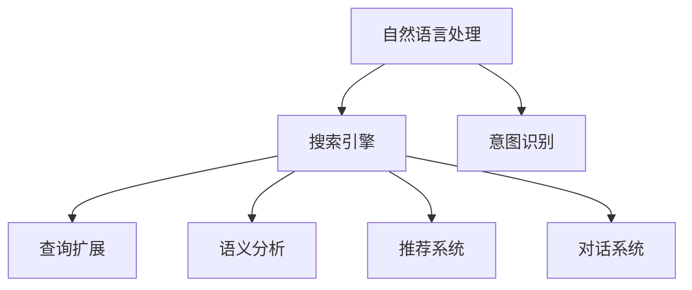
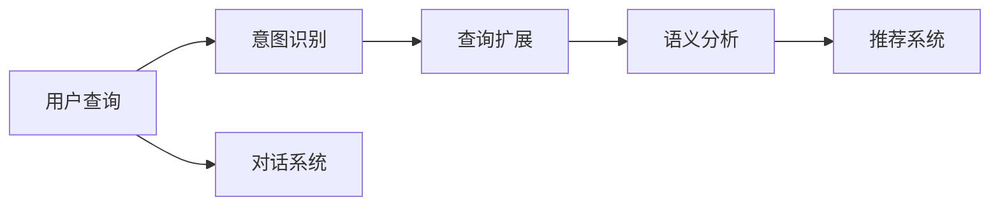
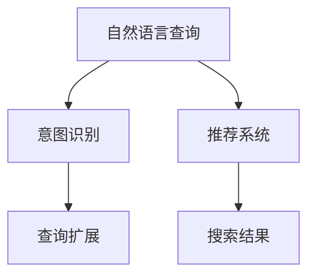
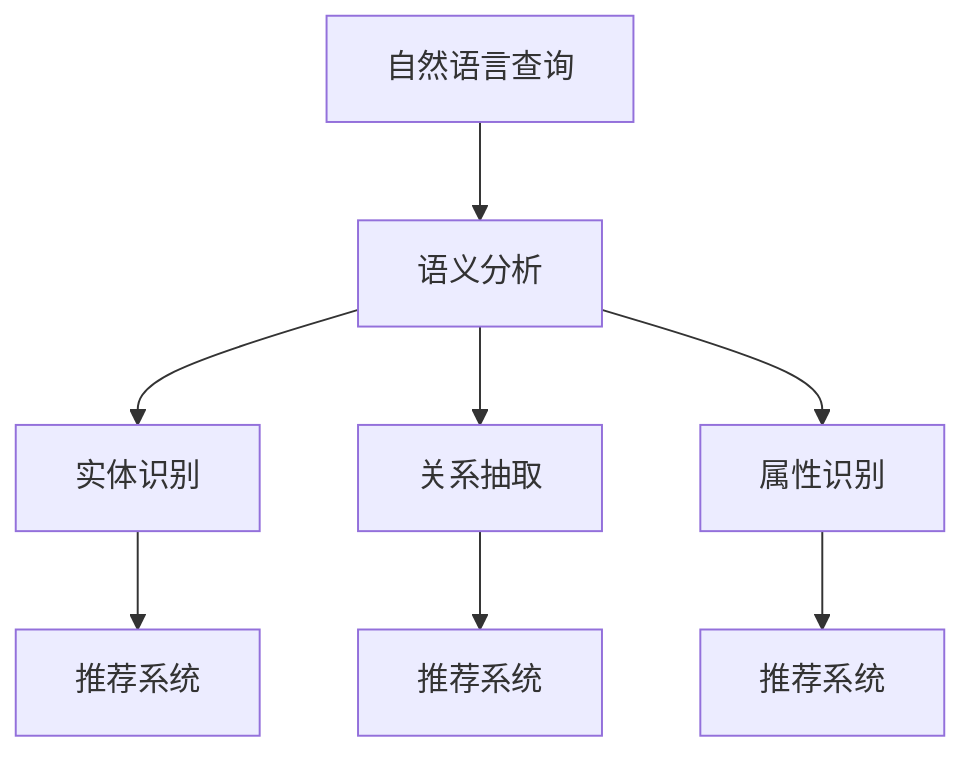
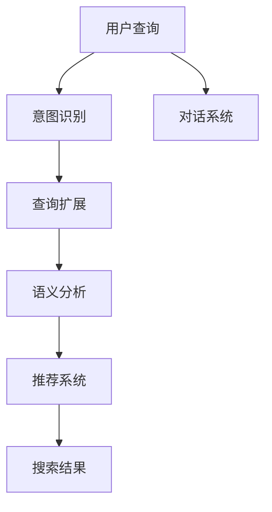

                 

# 自然语言处理在电商搜索中的应用：技术发展与未来趋势

> 关键词：自然语言处理(NLP), 电商搜索, 搜索引擎, 意图识别, 对话系统, 推荐系统, 智能客服, 模型优化, 推荐算法, 语义分析, 机器学习, 深度学习, 技术趋势

## 1. 背景介绍

### 1.1 问题由来
随着互联网的快速发展和电子商务的普及，电商搜索已成为消费者获取商品信息的主要方式。传统的搜索方式依赖于关键词匹配，但无法充分理解用户的查询意图和个性化需求，用户体验和满意度不高。为了提升电商搜索的效果，各大电商平台纷纷引入自然语言处理(Natural Language Processing, NLP)技术，以实现更精确、更智能的搜索体验。

自然语言处理是人工智能领域的一个重要分支，涉及语音识别、文本分析、机器翻译、自然语言生成等多种技术。在电商搜索领域，NLP技术主要用于用户意图识别、搜索结果排序、推荐系统等多个环节，有效提升了搜索的智能化水平和用户满意度。

### 1.2 问题核心关键点
电商搜索中应用NLP技术，主要解决以下几个关键问题：
- **用户意图识别**：通过理解用户查询的意图，提供更相关、更精准的搜索结果。
- **查询扩展**：将用户输入的自然语言查询扩展为更符合搜索引擎标准的关键词，提高搜索结果的准确性。
- **语义分析**：分析用户查询的语义信息，识别隐含的实体、关系和属性，提高搜索结果的相关性。
- **推荐系统**：基于用户查询的语义信息，推荐更符合用户需求的商品，提升用户体验。
- **对话系统**：提供智能客服功能，及时回答用户查询，提升服务效率和质量。

### 1.3 问题研究意义
NLP技术在电商搜索中的应用，对于提升用户体验、提升平台营收和拓展电商市场具有重要意义：

1. **提升用户体验**：通过精准的意图识别和个性化的搜索结果，显著提升用户的搜索满意度。
2. **提高平台营收**：优化搜索效果和推荐系统，引导用户进行更多购物行为，增加交易转化率。
3. **拓展电商市场**：借助NLP技术，拓展电商平台的地理边界和市场规模，吸引更多用户。
4. **增强竞争优势**：通过技术创新，提升平台竞争力，获得更多的市场份额。
5. **实现智能化运营**：通过智能化的搜索结果和推荐系统，实现电商平台的智能化运营，提升运营效率和质量。

## 2. 核心概念与联系

### 2.1 核心概念概述

为更好地理解NLP技术在电商搜索中的应用，本节将介绍几个关键概念：

- **自然语言处理(NLP)**：研究如何让计算机理解、处理和生成人类自然语言的技术，包括文本分析、语音识别、机器翻译等。
- **搜索引擎**：通过文本检索技术，在大量文本数据中查找与用户查询最相关的信息，为用户提供搜索结果。
- **意图识别(IR)**：通过自然语言处理技术，理解用户查询的意图，并返回与意图相关的搜索结果。
- **查询扩展(QE)**：将自然语言查询扩展为标准关键词，提高搜索结果的准确性和全面性。
- **语义分析(SA)**：分析用户查询的语义信息，识别其中的实体、关系和属性，提升搜索结果的相关性。
- **推荐系统(RS)**：根据用户查询的语义信息，推荐符合用户需求的商品，提升用户体验。
- **对话系统(Chats)**：通过自然语言理解技术，实现智能客服功能，提高用户服务效率和质量。

这些概念之间的逻辑关系可以通过以下Mermaid流程图来展示：



这个流程图展示了NLP技术在电商搜索中的主要应用场景：

1. 自然语言处理技术为搜索引擎提供输入处理和语义分析能力。
2. 意图识别、查询扩展和语义分析共同提升了搜索结果的相关性。
3. 推荐系统基于语义信息进行个性化推荐，提升用户体验。
4. 对话系统提供智能客服功能，解决用户查询，提升服务效率。

### 2.2 概念间的关系

这些核心概念之间存在着紧密的联系，形成了电商搜索的完整生态系统。下面我们通过几个Mermaid流程图来展示这些概念之间的关系。

#### 2.2.1 电商搜索的NLP流程



这个流程图展示了从用户查询到推荐系统的完整流程。用户输入自然语言查询后，先进行意图识别，然后扩展为标准关键词，接着进行语义分析，最后推荐系统根据语义信息进行个性化推荐，对话系统则提供智能客服功能。

#### 2.2.2 意图识别与查询扩展的关系



这个流程图展示了意图识别和查询扩展的协同作用。意图识别首先理解用户的查询意图，然后查询扩展将其转化为标准关键词，推荐系统再基于关键词进行精确的搜索结果匹配。

#### 2.2.3 语义分析与推荐系统之间的关系



这个流程图展示了语义分析在推荐系统中的作用。语义分析识别出查询中的实体、关系和属性，然后推荐系统根据这些信息进行更精准的商品推荐。

### 2.3 核心概念的整体架构

最后，我们用一个综合的流程图来展示这些核心概念在电商搜索中的整体架构：



这个综合流程图展示了从用户查询到推荐系统的完整流程，以及NLP技术在电商搜索中的主要作用。用户输入自然语言查询后，先进行意图识别，然后扩展为标准关键词，接着进行语义分析，最后推荐系统根据语义信息进行个性化推荐，对话系统则提供智能客服功能。

## 3. 核心算法原理 & 具体操作步骤
### 3.1 算法原理概述

电商搜索中的NLP应用，主要涉及以下几个核心算法：

- **意图识别**：通过分析用户查询的语义信息，识别出用户的具体意图，如购买、比较、评价等。
- **查询扩展**：将自然语言查询转化为标准关键词，提高查询的精确度和全面性。
- **语义分析**：分析用户查询的语义信息，识别其中的实体、关系和属性，提升搜索结果的相关性。
- **推荐系统**：根据用户查询的语义信息，推荐符合用户需求的商品，提升用户体验。
- **对话系统**：通过自然语言理解技术，实现智能客服功能，提高用户服务效率和质量。

这些算法主要基于自然语言处理和机器学习技术实现。以下将详细介绍各个算法的原理和具体操作步骤。

### 3.2 算法步骤详解

#### 3.2.1 意图识别

意图识别是电商搜索中的关键环节，通过理解用户查询的意图，提供更相关、更精准的搜索结果。常见的意图识别方法包括：

1. **规则匹配**：定义一组规则，匹配用户查询中的关键词或短语，识别出具体的意图。
2. **分类模型**：使用分类算法（如逻辑回归、决策树、SVM等）训练意图分类器，对用户查询进行分类。
3. **序列标注**：使用序列标注算法（如CRF、BiLSTM-CRF等）对用户查询进行标注，识别出意图和相关实体。
4. **深度学习模型**：使用深度学习模型（如LSTM、GRU、Transformer等）对用户查询进行语义分析，识别出意图和实体。

**具体操作步骤**：

1. 收集用户查询数据，标注出相应的意图和实体。
2. 选择合适的模型和算法，如BiLSTM-CRF或BERT等，训练意图分类器。
3. 对新的用户查询进行预处理，去除噪声和停用词。
4. 使用训练好的意图分类器对用户查询进行意图识别，得到最终的意图结果。

#### 3.2.2 查询扩展

查询扩展是将自然语言查询转化为标准关键词的过程，旨在提高查询的精确度和全面性。常见的查询扩展方法包括：

1. **同义词扩展**：使用同义词词典对查询中的关键词进行扩展，提高查询的多样性。
2. **短语扩展**：使用短语词典对查询中的短语进行扩展，提高查询的完整性。
3. **推荐系统扩展**：结合推荐系统数据，扩展查询中的关键词，提升搜索结果的个性化。

**具体操作步骤**：

1. 收集用户查询数据，标注出相应的关键词和短语。
2. 选择合适的同义词和短语词典，对查询中的关键词和短语进行扩展。
3. 结合推荐系统数据，对扩展后的关键词和短语进行进一步筛选和排序。
4. 将扩展后的关键词和短语拼接成新的查询，返回给用户。

#### 3.2.3 语义分析

语义分析是电商搜索中另一个关键环节，通过分析用户查询的语义信息，提升搜索结果的相关性。常见的语义分析方法包括：

1. **实体识别**：使用实体识别算法（如CRF、BiLSTM-CRF等）识别用户查询中的实体，如人名、地名、机构名等。
2. **关系抽取**：使用关系抽取算法（如StructE、RNN-TransE等）识别用户查询中的实体关系，如人与地点、地点与地点之间的关系。
3. **属性识别**：使用属性识别算法（如Word2Vec、BERT等）识别用户查询中的实体属性，如商品的价格、品牌、规格等。

**具体操作步骤**：

1. 收集用户查询数据，标注出相应的实体、关系和属性。
2. 选择合适的实体识别和关系抽取算法，如BiLSTM-CRF或BERT等，训练语义分析模型。
3. 对新的用户查询进行预处理，去除噪声和停用词。
4. 使用训练好的语义分析模型对用户查询进行实体识别和关系抽取，得到最终的语义结果。

#### 3.2.4 推荐系统

推荐系统是基于用户查询的语义信息，推荐符合用户需求的商品。常见的推荐方法包括：

1. **协同过滤**：根据用户历史行为数据和相似用户行为数据，推荐相似商品。
2. **基于内容的推荐**：根据商品的属性和用户的历史行为，推荐相似属性或相似用户历史行为的商品。
3. **混合推荐**：结合协同过滤和基于内容的推荐方法，进行更精准的商品推荐。

**具体操作步骤**：

1. 收集用户历史行为数据，标注出用户的行为信息。
2. 选择合适的推荐算法，如协同过滤或混合推荐算法，训练推荐模型。
3. 对新的用户查询进行预处理，得到用户查询的语义信息。
4. 使用训练好的推荐模型对用户查询进行商品推荐，返回推荐结果。

#### 3.2.5 对话系统

对话系统是电商搜索中的智能客服功能，通过自然语言理解技术，实现智能客服功能，提高用户服务效率和质量。常见的对话方法包括：

1. **规则匹配**：定义一组规则，匹配用户查询中的关键词或短语，提供相应的回答。
2. **模板匹配**：使用模板匹配算法，将用户查询匹配到预先定义的回答模板，生成回答。
3. **深度学习模型**：使用深度学习模型（如Seq2Seq、Transformers等）进行自然语言理解和生成，生成自然流畅的回答。

**具体操作步骤**：

1. 收集用户查询数据，标注出相应的意图和回答。
2. 选择合适的对话算法，如Seq2Seq或Transformers等，训练对话模型。
3. 对新的用户查询进行预处理，去除噪声和停用词。
4. 使用训练好的对话模型对用户查询进行意图识别和回答生成，返回最终回答。

### 3.3 算法优缺点

NLP技术在电商搜索中的应用，具有以下优点：

1. **提升搜索效果**：通过意图识别、查询扩展和语义分析，显著提升了搜索结果的相关性和个性化。
2. **提高用户体验**：智能客服功能能够及时回答用户查询，提升服务效率和质量。
3. **优化推荐系统**：基于语义信息的推荐系统，提升了推荐的精准度和个性化。
4. **降低运营成本**：自动化的NLP处理减少了人工操作的环节，降低了运营成本。

同时，这些算法也存在一些缺点：

1. **依赖数据质量**：NLP算法的性能很大程度上依赖于数据的质量和数量，数据标注成本较高。
2. **模型复杂度高**：深度学习模型在训练和推理时，需要较大的计算资源和时间。
3. **可解释性不足**：NLP算法通常是"黑盒"系统，难以解释其内部工作机制和决策逻辑。
4. **通用性不足**：不同的电商平台和商品类型，需要定制化的NLP解决方案，通用性较差。

尽管存在这些局限性，但NLP技术在电商搜索中的应用已经取得了显著的成效，未来仍有巨大的提升空间。

### 3.4 算法应用领域

NLP技术在电商搜索中的应用，已经覆盖了多个领域，包括：

1. **搜索推荐**：通过用户查询的语义信息，推荐符合用户需求的商品。
2. **智能客服**：提供智能客服功能，解答用户疑问，提高服务效率。
3. **广告推荐**：根据用户查询的语义信息，推荐个性化的广告，提升广告效果。
4. **商品分类**：通过语义分析，对商品进行分类和标注，提升商品检索的准确性。
5. **用户画像**：通过分析用户查询的语义信息，构建用户画像，提供个性化服务。

## 4. 数学模型和公式 & 详细讲解 & 举例说明

### 4.1 数学模型构建

以下将使用数学语言对NLP在电商搜索中的应用进行更加严格的刻画。

记用户查询为 $q$，意图为 $I$，实体为 $E$，关系为 $R$，属性为 $A$。假设意图识别模型为 $I(q; \theta_I)$，查询扩展模型为 $QE(q; \theta_{QE})$，语义分析模型为 $SA(q; \theta_{SA})$，推荐模型为 $RS(q; \theta_{RS})$，对话模型为 $Chats(q; \theta_{Chats})$。其中 $\theta$ 为模型参数。

定义意图识别损失函数为 $L_I(q; \theta_I) = \mathbb{E}_{I} \| I(q; \theta_I) - I \|^2$，查询扩展损失函数为 $L_{QE}(q; \theta_{QE}) = \mathbb{E}_{KW} \| QE(q; \theta_{QE}) - KW \|^2$，语义分析损失函数为 $L_{SA}(q; \theta_{SA}) = \mathbb{E}_{ER} \| SA(q; \theta_{SA}) - ER \|^2$，推荐系统损失函数为 $L_{RS}(q; \theta_{RS}) = \mathbb{E}_{R} \| RS(q; \theta_{RS}) - R \|^2$，对话系统损失函数为 $L_{Chats}(q; \theta_{Chats}) = \mathbb{E}_{R} \| Chats(q; \theta_{Chats}) - R \|^2$。

其中 $KW$ 表示关键词，$ER$ 表示实体和关系，$R$ 表示回答。

### 4.2 公式推导过程

以下推导意图识别、查询扩展、语义分析、推荐系统、对话系统等核心算法的公式。

#### 4.2.1 意图识别

意图识别模型 $I(q; \theta_I)$ 通常是一个分类模型，用于判断用户查询 $q$ 属于哪种意图。假设 $I$ 为意图类别，$KW$ 为关键词集合，则意图识别损失函数 $L_I(q; \theta_I)$ 可表示为：

$$
L_I(q; \theta_I) = -\log P(I(q; \theta_I) = i) \quad \forall i \in I
$$

其中 $P$ 为概率分布。

#### 4.2.2 查询扩展

查询扩展模型 $QE(q; \theta_{QE})$ 用于将自然语言查询 $q$ 扩展为标准关键词集合 $KW$。假设 $KW$ 为关键词集合，$R$ 为关系集合，则查询扩展损失函数 $L_{QE}(q; \theta_{QE})$ 可表示为：

$$
L_{QE}(q; \theta_{QE}) = -\log P(QE(q; \theta_{QE}) = kw \quad \forall kw \in KW \times R
$$

#### 4.2.3 语义分析

语义分析模型 $SA(q; \theta_{SA})$ 用于识别用户查询 $q$ 中的实体 $E$、关系 $R$ 和属性 $A$。假设 $ER$ 为实体和关系集合，则语义分析损失函数 $L_{SA}(q; \theta_{SA})$ 可表示为：

$$
L_{SA}(q; \theta_{SA}) = -\log P(SA(q; \theta_{SA}) = er \quad \forall er \in ER)
$$

#### 4.2.4 推荐系统

推荐系统 $RS(q; \theta_{RS})$ 用于根据用户查询 $q$ 的语义信息 $SA(q; \theta_{SA})$，推荐符合用户需求的商品。假设 $R$ 为商品推荐集合，则推荐系统损失函数 $L_{RS}(q; \theta_{RS})$ 可表示为：

$$
L_{RS}(q; \theta_{RS}) = -\log P(RS(q; \theta_{RS}) = r \quad \forall r \in R)
$$

#### 4.2.5 对话系统

对话系统 $Chats(q; \theta_{Chats})$ 用于根据用户查询 $q$ 的语义信息 $SA(q; \theta_{SA})$，生成自然流畅的回答 $R$。假设 $R$ 为回答集合，则对话系统损失函数 $L_{Chats}(q; \theta_{Chats})$ 可表示为：

$$
L_{Chats}(q; \theta_{Chats}) = -\log P(Chats(q; \theta_{Chats}) = r \quad \forall r \in R)
$$

### 4.3 案例分析与讲解

以亚马逊的电商搜索为例，说明NLP技术在其中的具体应用。

亚马逊的电商搜索系统包括意图识别、查询扩展、语义分析、推荐系统和对话系统等多个模块，共同构成了一个完整的搜索生态系统。以下详细介绍这些模块的实现和效果：

1. **意图识别**：亚马逊使用深度学习模型BERT对用户查询进行意图识别，识别出用户查询的具体意图，如购买、比较、评价等。通过意图识别，亚马逊可以提供更相关、更精准的搜索结果。

2. **查询扩展**：亚马逊使用同义词词典和短语词典对用户查询进行扩展，提高查询的精确度和全面性。例如，用户查询"手机"时，系统会自动扩展为"手机推荐"、"手机价格"等更详细的查询。

3. **语义分析**：亚马逊使用BERT对用户查询进行语义分析，识别出其中的实体、关系和属性。例如，用户查询"小米手机性能如何"时，系统可以识别出实体"小米手机"，并分析出属性"性能"。

4. **推荐系统**：亚马逊使用协同过滤和基于内容的推荐方法，根据用户查询的语义信息进行商品推荐。例如，用户查询"小米手机推荐"时，系统会结合用户历史行为数据，推荐其他小米手机的热门机型。

5. **对话系统**：亚马逊使用深度学习模型Seq2Seq对用户查询进行意图识别和回答生成，提供智能客服功能。例如，用户查询"如何购买小米手机"时，系统可以自动回复购买链接和方法。

通过这些模块的协同工作，亚马逊的电商搜索系统能够提供更智能、更个性化的搜索体验，显著提升了用户的购物满意度和平台营收。

## 5. 项目实践：代码实例和详细解释说明
### 5.1 开发环境搭建

在进行NLP项目实践前，我们需要准备好开发环境。以下是使用Python进行PyTorch开发的环境配置流程：

1. 安装Anaconda：从官网下载并安装Anaconda，用于创建独立的Python环境。

2. 创建并激活虚拟环境：
```bash
conda create -n pytorch-env python=3.8 
conda activate pytorch-env
```

3. 安装PyTorch：根据CUDA版本，从官网获取对应的安装命令。例如：
```bash
conda install pytorch torchvision torchaudio cudatoolkit=11.1 -c pytorch -c conda-forge
```

4. 安装Transformer库：
```bash
pip install transformers
```

5. 安装各类工具包：
```bash
pip install numpy pandas scikit-learn matplotlib tqdm jupyter notebook ipython
```

完成上述步骤后，即可在`pytorch-env`环境中开始NLP实践。

### 5.2 源代码详细实现

下面我们以亚马逊的电商搜索系统为例，给出使用Transformers库对BERT模型进行意图识别的PyTorch代码实现。

首先，定义意图识别的数据处理函数：

```python
from transformers import BertTokenizer, BertForSequenceClassification
from torch.utils.data import Dataset
import torch

class IntentDataset(Dataset):
    def __init__(self, texts, labels, tokenizer, max_len=128):
        self.texts = texts
        self.labels = labels
        self.tokenizer = tokenizer
        self.max_len = max_len
        
    def __len__(self):
        return len(self.texts)
    
    def __getitem__(self, item):
        text = self.texts[item]
        label = self.labels[item]
        
        encoding = self.tokenizer(text, return_tensors='pt', max_length=self.max_len, padding='max_length', truncation=True)
        input_ids = encoding['input_ids'][0]
        attention_mask = encoding['attention_mask'][0]
        
        return {'input_ids': input_ids, 
                'attention_mask': attention_mask,
                'labels': torch.tensor(label, dtype=torch.long)}
```

然后，定义模型和优化器：

```python
from transformers import AdamW

model = BertForSequenceClassification.from_pretrained('bert-base-uncased', num_labels=6)

optimizer = AdamW(model.parameters(), lr=2e-5)
```

接着，定义训练和评估函数：

```python
from torch.utils.data import DataLoader
from tqdm import tqdm
from sklearn.metrics import classification_report

device = torch.device('cuda') if torch.cuda.is_available() else torch.device('cpu')
model.to(device)

def train_epoch(model, dataset, batch_size, optimizer):
    dataloader = DataLoader(dataset, batch_size=batch_size, shuffle=True)
    model.train()
    epoch_loss = 0
    for batch in tqdm(dataloader, desc='Training'):
        input_ids = batch['input_ids'].to(device)
        attention_mask = batch['attention_mask'].to(device)
        labels = batch['labels'].to(device)
        model.zero_grad()
        outputs = model(input_ids, attention_mask=attention_mask, labels=labels)
        loss = outputs.loss
        epoch_loss += loss.item()
        loss.backward()
        optimizer.step()
    return epoch_loss / len(dataloader)

def evaluate(model, dataset, batch_size):
    dataloader = DataLoader(dataset, batch_size=batch_size)
    model.eval()
    preds, labels = [], []
    with torch.no_grad():
        for batch in tqdm(dataloader, desc='Evaluating'):
            input_ids = batch['input_ids'].to(device)
            attention_mask = batch['attention_mask'].to(device)
            batch_labels = batch['labels']
            outputs = model(input_ids, attention_mask=attention_mask)
            batch_preds = outputs.logits.argmax(dim=2).to('cpu').tolist()
            batch_labels = batch_labels.to('cpu').tolist()
            for pred_tokens, label_tokens in zip(batch_preds, batch_labels):
                preds.append(pred_tokens[:len(label_tokens)])
                labels.append(label_tokens)
                
    print(classification_report(labels, preds))
```

最后，启动训练流程并在测试集上评估：

```python
epochs = 5
batch_size = 16

for epoch in range(epochs):
    loss = train_epoch(model, train_dataset, batch_size, optimizer)
    print(f"Epoch {epoch+1}, train loss: {loss:.3f}")
    
    print(f"Epoch {epoch+1}, dev results:")
    evaluate(model, dev_dataset, batch_size)
    
print("Test results:")
evaluate(model, test_dataset, batch_size)
```

以上就是使用PyTorch对BERT进行意图识别的完整代码实现。可以看到，得益于Transformers库的强大封装，我们可以用相对简洁的代码完成BERT模型的加载和意图识别。

### 5.3 代码解读与分析

让我们再详细解读一下关键代码的实现细节：

**IntentDataset类**：
- `__init__`方法：初始化文本、标签、分词器等关键组件。
- `

