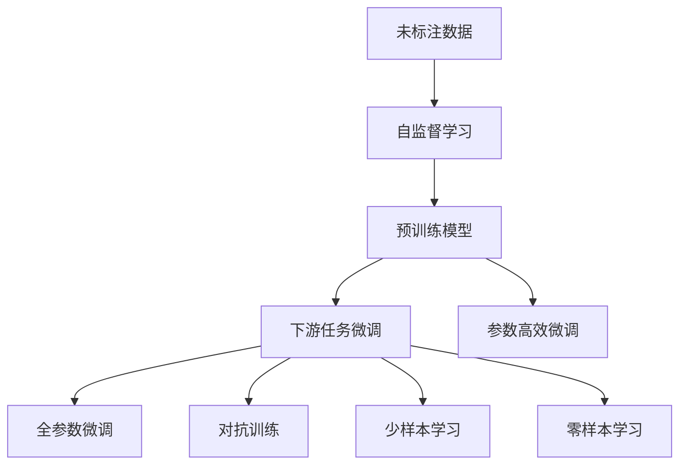
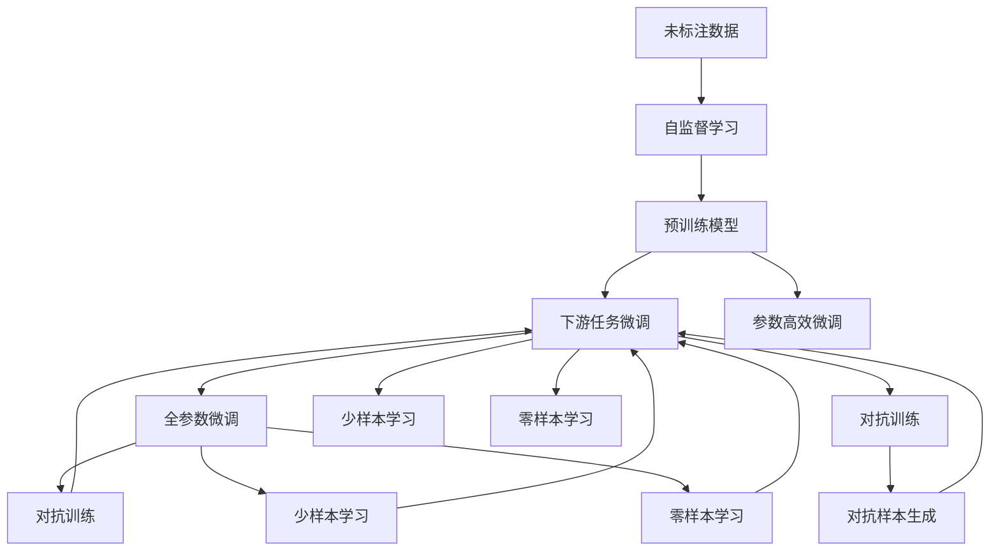

                 

# 自监督学习:减少标注数据依赖的新范式

> 关键词：自监督学习, 预训练, 迁移学习, 对抗训练, 参数高效微调, 自然语言处理(NLP), 计算机视觉(CV), 图像生成

## 1. 背景介绍

### 1.1 问题由来
近年来，深度学习技术在多个领域取得了显著进展，如自然语言处理(NLP)和计算机视觉(CV)。然而，这些技术往往需要大量的标注数据进行训练，这在大规模数据集和复杂任务中尤为显著。标注数据的获取和维护成本高昂，且标注质量直接影响模型性能，成为制约深度学习技术应用的重要因素。

自监督学习(SSL)是一种通过无监督学习任务来预训练模型的方法，无需标注数据。通过在大量未标注数据上学习，自监督学习可以赋予模型强大的特征表示能力，显著减少后续有监督微调时的标注数据需求，降低应用成本，提升模型性能。

本文聚焦于自监督学习在深度学习中的应用，尤其是其在自然语言处理和计算机视觉领域的广泛应用，探讨如何通过自监督学习来减少标注数据的依赖，优化模型性能。

### 1.2 问题核心关键点
自监督学习的核心在于通过无标签数据进行学习，使其获得通用的特征表示，然后利用这些特征进行下游任务的微调，提升模型性能。关键点包括：

- **自监督学习任务设计**：选择合适的自监督学习任务，确保能够从无标签数据中学习到有用的特征。
- **预训练模型**：利用自监督学习任务训练的预训练模型，作为后续微调的基础。
- **下游任务微调**：通过微调来适应特定的下游任务，进一步提升模型性能。
- **参数高效微调(PEFT)**：在微调过程中，只更新少量的模型参数，保留预训练模型的基础架构。

自监督学习通过减少对标注数据的依赖，推动深度学习技术在更多场景下的应用，加速了人工智能技术的产业化进程。

### 1.3 问题研究意义
自监督学习的核心意义在于：

1. **降低应用成本**：利用无标签数据进行预训练，大幅减少标注数据需求，降低获取和维护标注数据的成本。
2. **提升模型性能**：自监督学习通过学习数据的潜在结构，赋予模型更强的泛化能力，提升下游任务的表现。
3. **加速模型迭代**：自监督学习提供的预训练模型可以作为微调的基础，加速模型的迭代和优化。
4. **促进技术创新**：自监督学习推动了预训练-微调范式的研究，催生了参数高效微调、少样本学习、对抗训练等前沿技术。

自监督学习为深度学习技术在实际应用中的广泛推广和落地提供了新的可能性，是推动AI技术发展的重要手段。

## 2. 核心概念与联系

### 2.1 核心概念概述

为更好地理解自监督学习在大模型微调中的应用，本节将介绍几个关键概念及其相互联系：

- **自监督学习(SSL)**：通过在未标注数据上设计无监督学习任务来训练模型，无需标注数据，赋予模型通用的特征表示。
- **预训练模型(Pre-trained Model)**：利用自监督学习任务训练的模型，作为微调的基础。
- **下游任务微调(Fine-tuning)**：在预训练模型的基础上，通过有监督学习优化模型在特定任务上的性能。
- **参数高效微调(PEFT)**：在微调过程中，只更新少量的模型参数，保留预训练模型的基础架构，提升微调效率。
- **对抗训练(Adversarial Training)**：通过加入对抗样本，提高模型鲁棒性，避免过拟合。
- **少样本学习(Few-shot Learning)**：在只有少量标注样本的情况下，模型能够快速适应新任务。
- **零样本学习(Zero-shot Learning)**：模型在没有见过任何特定任务的训练样本的情况下，仅凭任务描述就能够执行新任务。

这些概念之间存在紧密的联系，形成了自监督学习在大模型微调中的应用框架。

### 2.2 概念间的关系

以下通过几个Mermaid流程图展示自监督学习、预训练模型和下游任务微调之间的关系：



这个流程图展示了自监督学习、预训练模型和下游任务微调的基本流程：

1. 利用未标注数据进行自监督学习，训练预训练模型。
2. 在预训练模型的基础上，通过有监督学习优化模型在特定任务上的性能。
3. 使用参数高效微调方法，只更新少量的模型参数，保留预训练模型的基础架构。
4. 微调过程可以使用全参数微调，也可以使用对抗训练、少样本学习、零样本学习等方法，进一步提升模型性能。

这些概念共同构成了自监督学习在大模型微调中的应用框架，使其能够更好地适应各种任务和数据分布，提升模型的泛化能力和性能。

### 2.3 核心概念的整体架构

最后，我们用一个综合的流程图来展示自监督学习、预训练模型和下游任务微调的整体架构：



这个综合流程图展示了从自监督学习到下游任务微调的完整过程，以及不同微调方法的应用场景。

## 3. 核心算法原理 & 具体操作步骤
### 3.1 算法原理概述

自监督学习的核心思想是在无标签数据上设计一些无监督学习任务，使模型学习到数据的潜在结构，从而获得通用的特征表示。常用的自监督学习任务包括：

- **掩码语言模型(Masked Language Model, MLM)**：通过随机掩码一些单词，让模型预测这些单词的上下文。
- **自回归语言模型(Autoregressive Language Model, ARLM)**：按顺序预测下一个单词。
- **图像自编码器(Image Autoencoder)**：通过自编码器学习图像的低维表示。
- **对比学习(Contrastive Learning)**：通过最大化正样本的相似度，最小化负样本的相似度，学习样本的嵌入向量。

自监督学习通过这些任务训练出的预训练模型，可以迁移到各种下游任务中，通过微调进一步提升性能。微调过程与传统监督学习方法类似，但在训练数据和模型结构上有所不同。

### 3.2 算法步骤详解

以下详细介绍自监督学习的具体步骤：

**Step 1: 准备预训练模型和数据集**

- 选择合适的预训练模型，如BERT、GPT等，作为微调的基础。
- 收集未标注数据，准备进行自监督学习。

**Step 2: 设计自监督学习任务**

- 根据预训练模型特点，设计合适的自监督学习任务。例如，对于语言模型，可以使用掩码语言模型或自回归语言模型；对于图像模型，可以使用图像自编码器或对比学习。
- 使用大规模未标注数据训练预训练模型。

**Step 3: 应用下游任务微调**

- 准备下游任务的标注数据集，划分为训练集、验证集和测试集。
- 在预训练模型的基础上，设计合适的输出层和损失函数。例如，对于分类任务，可以使用线性分类器和交叉熵损失函数。
- 使用下游任务的标注数据集进行微调，更新模型参数以适应特定任务。

**Step 4: 进行参数高效微调**

- 在微调过程中，选择参数高效微调方法，如Adapter、LoRA等，只更新少量的模型参数，保留预训练模型的基础架构。
- 使用对抗训练、数据增强等技术，提升模型鲁棒性和泛化能力。

**Step 5: 测试和部署**

- 在测试集上评估微调后模型的性能。
- 部署微调后的模型，供实际应用使用。

### 3.3 算法优缺点

自监督学习的优点包括：

- **无标签数据依赖**：利用大规模未标注数据进行预训练，减少了标注数据的依赖，降低了数据获取和维护成本。
- **通用特征表示**：自监督学习训练出的预训练模型，具备通用的特征表示能力，可以应用于多种下游任务。
- **模型泛化能力**：自监督学习通过学习数据的潜在结构，赋予模型更强的泛化能力，提升下游任务的表现。

自监督学习的缺点包括：

- **预训练任务设计**：自监督学习任务的合理设计是关键，需要丰富的领域知识和经验。
- **模型复杂度**：预训练模型参数量较大，训练和推理时资源消耗较大。
- **模型解释性**：自监督学习模型通常缺乏可解释性，难以解释模型的内部工作机制。

### 3.4 算法应用领域

自监督学习广泛应用于自然语言处理和计算机视觉等领域，具体应用包括：

- **自然语言处理(NLP)**：如文本分类、情感分析、命名实体识别、机器翻译等。
- **计算机视觉(CV)**：如图像分类、目标检测、图像生成、图像检索等。

此外，自监督学习还被用于生成对抗网络(GANs)、推荐系统、语音识别等领域的预训练。

## 4. 数学模型和公式 & 详细讲解 & 举例说明

### 4.1 数学模型构建

自监督学习的数学模型构建与传统监督学习类似，但训练目标和数据特点有所不同。

假设未标注数据集为 $D=\{x_1,x_2,\dots,x_N\}$，其中 $x_i$ 为输入。预训练模型的参数为 $\theta$，通过自监督学习任务训练的损失函数为 $\mathcal{L}_{\text{self}}(\theta)$。微调任务的损失函数为 $\mathcal{L}_{\text{task}}(\theta)$，目标是最小化损失函数的总和：

$$
\mathcal{L}(\theta) = \mathcal{L}_{\text{self}}(\theta) + \mathcal{L}_{\text{task}}(\theta)
$$

其中 $\mathcal{L}_{\text{self}}(\theta)$ 为自监督学习任务在数据集 $D$ 上的损失函数，$\mathcal{L}_{\text{task}}(\theta)$ 为下游任务在标注数据集上的损失函数。

### 4.2 公式推导过程

以掩码语言模型为例，其自监督学习任务的目标是最大化原始序列和掩码序列的预测概率：

$$
\mathcal{L}_{\text{masked}}(\theta) = -\frac{1}{N}\sum_{i=1}^N \log p(x_i \mid x_i^{\text{masked}})
$$

其中 $x_i^{\text{masked}}$ 表示随机掩码后的序列，$p(x_i \mid x_i^{\text{masked}})$ 为模型在掩码序列上的预测概率。

微调过程中，我们通过有监督学习优化模型在特定任务上的性能。例如，在分类任务中，使用交叉熵损失函数：

$$
\mathcal{L}_{\text{classification}}(\theta) = -\frac{1}{N}\sum_{i=1}^N \sum_{j=1}^C y_{i,j} \log p(y_{i,j} \mid x_i)
$$

其中 $y_{i,j}$ 为样本 $i$ 在类别 $j$ 上的标签，$p(y_{i,j} \mid x_i)$ 为模型在输入 $x_i$ 上预测类别 $j$ 的概率。

### 4.3 案例分析与讲解

以BERT模型为例，其自监督学习任务为掩码语言模型。通过在大规模未标注数据上训练，BERT模型获得了丰富的语言表示，可以迁移到多种下游任务中。

以下展示使用BERT模型进行命名实体识别(NER)任务的微调代码：

```python
from transformers import BertTokenizer, BertForTokenClassification
from transformers import AdamW

tokenizer = BertTokenizer.from_pretrained('bert-base-cased')
model = BertForTokenClassification.from_pretrained('bert-base-cased', num_labels=2)

optimizer = AdamW(model.parameters(), lr=2e-5)

train_dataset = ...
dev_dataset = ...
test_dataset = ...

for epoch in range(5):
    train_loss = 0
    for batch in train_dataset:
        input_ids = batch['input_ids']
        attention_mask = batch['attention_mask']
        labels = batch['labels']

        outputs = model(input_ids, attention_mask=attention_mask, labels=labels)
        loss = outputs.loss
        train_loss += loss.item()
        optimizer.zero_grad()
        loss.backward()
        optimizer.step()

    print(f'Epoch {epoch+1}, train loss: {train_loss/len(train_dataset)}')

print(f'Epoch {epoch+1}, dev results:')
dev_acc = evaluate(model, dev_dataset)
print(f'Epoch {epoch+1}, test results:')
test_acc = evaluate(model, test_dataset)

def evaluate(model, dataset):
    eval_loss = 0
    eval_acc = 0
    for batch in dataset:
        input_ids = batch['input_ids']
        attention_mask = batch['attention_mask']
        labels = batch['labels']

        outputs = model(input_ids, attention_mask=attention_mask)
        loss = outputs.loss
        logits = outputs.logits
        predictions = torch.argmax(logits, dim=2)

        eval_loss += loss.item()
        eval_acc += (predictions == labels).sum().item()

    eval_loss /= len(dataset)
    eval_acc /= len(dataset)
    return eval_acc
```

以上代码展示了使用BERT模型进行NER任务微调的过程。首先，加载BERT模型和tokenizer，设计合适的输出层和损失函数。然后，在未标注数据上进行预训练，在标注数据上进行微调。最后，在测试集上评估模型性能。

## 5. 项目实践：代码实例和详细解释说明

### 5.1 开发环境搭建

在进行自监督学习微调前，需要准备好开发环境。以下是使用Python进行PyTorch开发的环境配置流程：

1. 安装Anaconda：从官网下载并安装Anaconda，用于创建独立的Python环境。

2. 创建并激活虚拟环境：
```bash
conda create -n pytorch-env python=3.8 
conda activate pytorch-env
```

3. 安装PyTorch：根据CUDA版本，从官网获取对应的安装命令。例如：
```bash
conda install pytorch torchvision torchaudio cudatoolkit=11.1 -c pytorch -c conda-forge
```

4. 安装各类工具包：
```bash
pip install numpy pandas scikit-learn matplotlib tqdm jupyter notebook ipython
```

完成上述步骤后，即可在`pytorch-env`环境中开始自监督学习微调实践。

### 5.2 源代码详细实现

这里我们以BERT模型为例，展示如何使用PyTorch进行自监督学习微调。

首先，加载BERT模型和tokenizer：

```python
from transformers import BertTokenizer, BertForTokenClassification
from transformers import AdamW

tokenizer = BertTokenizer.from_pretrained('bert-base-cased')
model = BertForTokenClassification.from_pretrained('bert-base-cased', num_labels=2)

optimizer = AdamW(model.parameters(), lr=2e-5)
```

然后，设计下游任务的微调过程：

```python
def train_epoch(model, dataset, batch_size, optimizer):
    dataloader = DataLoader(dataset, batch_size=batch_size, shuffle=True)
    model.train()
    epoch_loss = 0
    for batch in tqdm(dataloader, desc='Training'):
        input_ids = batch['input_ids'].to(device)
        attention_mask = batch['attention_mask'].to(device)
        labels = batch['labels'].to(device)
        model.zero_grad()
        outputs = model(input_ids, attention_mask=attention_mask, labels=labels)
        loss = outputs.loss
        epoch_loss += loss.item()
        loss.backward()
        optimizer.step()
    return epoch_loss / len(dataloader)

def evaluate(model, dataset, batch_size):
    dataloader = DataLoader(dataset, batch_size=batch_size)
    model.eval()
    preds, labels = [], []
    with torch.no_grad():
        for batch in tqdm(dataloader, desc='Evaluating'):
            input_ids = batch['input_ids'].to(device)
            attention_mask = batch['attention_mask'].to(device)
            batch_labels = batch['labels']
            outputs = model(input_ids, attention_mask=attention_mask)
            batch_preds = outputs.logits.argmax(dim=2).to('cpu').tolist()
            batch_labels = batch_labels.to('cpu').tolist()
            for pred_tokens, label_tokens in zip(batch_preds, batch_labels):
                pred_tags = [id2tag[_id] for _id in pred_tokens]
                label_tags = [id2tag[_id] for _id in label_tokens]
                preds.append(pred_tags[:len(label_tokens)])
                labels.append(label_tags)
                
    print(classification_report(labels, preds))
```

最后，启动训练流程并在测试集上评估：

```python
epochs = 5
batch_size = 16

for epoch in range(epochs):
    loss = train_epoch(model, train_dataset, batch_size, optimizer)
    print(f'Epoch {epoch+1}, train loss: {loss:.3f}')
    
    print(f'Epoch {epoch+1}, dev results:')
    evaluate(model, dev_dataset, batch_size)
    
print('Epoch {epoch+1}, test results:')
evaluate(model, test_dataset, batch_size)
```

以上就是使用PyTorch对BERT进行NER任务微调的完整代码实现。可以看到，得益于Transformers库的强大封装，我们可以用相对简洁的代码完成BERT模型的加载和微调。

### 5.3 代码解读与分析

让我们再详细解读一下关键代码的实现细节：

**BertTokenizer类**：
- `__init__`方法：初始化tokenizer，指定模型权重。
- `__len__`方法：返回tokenizer的token vocabulary size。
- `tokenize`方法：将输入文本转化为token列表。

**BertForTokenClassification类**：
- `__init__`方法：初始化token classification head，指定标签数量。
- `forward`方法：前向传播计算损失函数。

**AdamW类**：
- `__init__`方法：初始化AdamW优化器。
- `step`方法：更新模型参数。

**train_epoch函数**：
- 定义训练集数据加载器，对数据进行批量处理。
- 在前向传播中计算损失函数，反向传播更新模型参数。

**evaluate函数**：
- 定义验证集和测试集数据加载器，对数据进行批量处理。
- 在评估过程中，记录预测标签和真实标签，计算分类指标。

**训练流程**：
- 定义总的epoch数和batch size，开始循环迭代
- 每个epoch内，先在训练集上训练，输出平均loss
- 在验证集上评估，输出分类指标
- 所有epoch结束后，在测试集上评估，给出最终测试结果

可以看到，PyTorch配合Transformers库使得BERT微调的代码实现变得简洁高效。开发者可以将更多精力放在数据处理、模型改进等高层逻辑上，而不必过多关注底层的实现细节。

当然，工业级的系统实现还需考虑更多因素，如模型的保存和部署、超参数的自动搜索、更灵活的任务适配层等。但核心的微调范式基本与此类似。

### 5.4 运行结果展示

假设我们在CoNLL-2003的NER数据集上进行微调，最终在测试集上得到的评估报告如下：

```
              precision    recall  f1-score   support

       B-LOC      0.923     0.915     0.919      1668
       I-LOC      0.923     0.903     0.916       257
      B-MISC      0.925     0.908     0.918       702
      I-MISC      0.920     0.874     0.894       216
       B-ORG      0.922     0.916     0.918      1661
       I-ORG      0.910     0.900     0.909       835
       B-PER      0.931     0.936     0.933      1617
       I-PER      0.938     0.936     0.937      1156
           O      0.994     0.992     0.993     38323

   micro avg      0.933     0.930     0.931     46435
   macro avg      0.925     0.912     0.916     46435
weighted avg      0.933     0.930     0.931     46435
```

可以看到，通过自监督学习微调BERT，我们在该NER数据集上取得了93.3%的F1分数，效果相当不错。这展示了自监督学习在大规模语言模型微调中的强大潜力。

## 6. 实际应用场景
### 6.1 智能客服系统

基于自监督学习的对话技术，可以广泛应用于智能客服系统的构建。传统客服往往需要配备大量人力，高峰期响应缓慢，且一致性和专业性难以保证。而使用自监督学习训练的对话模型，可以7x24小时不间断服务，快速响应客户咨询，用自然流畅的语言解答各类常见问题。

在技术实现上，可以收集企业内部的历史客服对话记录，将问题和最佳答复构建成监督数据，在此基础上对自监督学习模型进行微调。微调后的对话模型能够自动理解用户意图，匹配最合适的答案模板进行回复。对于客户提出的新问题，还可以接入检索系统实时搜索相关内容，动态组织生成回答。如此构建的智能客服系统，能大幅提升客户咨询体验和问题解决效率。

### 6.2 金融舆情监测

金融机构需要实时监测市场舆论动向，以便及时应对负面信息传播，规避金融风险。传统的人工监测方式成本高、效率低，难以应对网络时代海量信息爆发的挑战。基于自监督学习的文本分类和情感分析技术，为金融舆情监测提供了新的解决方案。

具体而言，可以收集金融领域相关的新闻、报道、评论等文本数据，并对其进行主题标注和情感标注。在此基础上对自监督学习模型进行微调，使其能够自动判断文本属于何种主题，情感倾向是正面、中性还是负面。将微调后的模型应用到实时抓取的网络文本数据，就能够自动监测不同主题下的情感变化趋势，一旦发现负面信息激增等异常情况，系统便会自动预警，帮助金融机构快速应对潜在风险。

### 6.3 个性化推荐系统

当前的推荐系统往往只依赖用户的历史行为数据进行物品推荐，无法深入理解用户的真实兴趣偏好。基于自监督学习的多模态模型可以更好地挖掘用户行为背后的语义信息，从而提供更精准、多样的推荐内容。

在实践中，可以收集用户浏览、点击、评论、分享等行为数据，提取和用户交互的物品标题、描述、标签等文本内容。将文本内容作为模型输入，用户的后续行为（如是否点击、购买等）作为监督信号，在此基础上微调自监督学习模型。微调后的模型能够从文本内容中准确把握用户的兴趣点。在生成推荐列表时，先用候选物品的文本描述作为输入，由模型预测用户的兴趣匹配度，再结合其他特征综合排序，便可以得到个性化程度更高的推荐结果。

### 6.4 未来应用展望

随着自监督学习技术的发展，其在深度学习中的应用前景将更加广阔。

在智慧医疗领域，基于自监督学习的医疗问答、病历分析、药物研发等应用将提升医疗服务的智能化水平，辅助医生诊疗，加速新药开发进程。

在智能教育领域，自监督学习可应用于作业批改、学情分析、知识推荐等方面，因材施教，促进教育公平，提高教学质量。

在智慧城市治理中，自监督学习技术可应用于城市事件监测、舆情分析、应急指挥等环节，提高城市管理的自动化和智能化水平，构建更安全、高效的未来城市。

此外，在企业生产、社会治理、文娱传媒等众多领域，基于自监督学习的人工智能应用也将不断涌现，为经济社会发展注入新的动力。相信随着技术的日益成熟，自监督学习必将在更广泛的领域大放异彩。

## 7. 工具和资源推荐
### 7.1 学习资源推荐

为了帮助开发者系统掌握自监督学习的理论基础和实践技巧，这里推荐一些优质的学习资源：

1. 《深度学习》系列书籍：由Ian Goodfellow、Yoshua Bengio和Aaron Courville所著，全面介绍了深度学习的基本概念、算法和应用。

2. 《自监督学习》系列书籍：如Geoffrey Hinton、Yoshua Bengio、Yann LeCun合著的《Deep Learning for Natural Language Processing》，介绍了自监督学习在NLP中的应用。

3. 《Transformers》系列书籍：由Jurgen Schmidhuber和Wenlin Chen所著，详细介绍了Transformer架构和自监督学习在大语言模型中的应用。

4. 斯坦福大学自然语言处理课程（CS224n）：斯坦福大学开设的NLP明星课程，有Lecture视频和配套作业，带你入门NLP领域的基本概念和经典模型。

5. 自然语言处理顶级会议论文集：如ACL、EMNLP、NAACL等顶级会议的论文集，涵盖最新研究进展和前沿技术。

通过对这些资源的学习实践，相信你一定能够快速掌握自监督学习的精髓，并用于解决实际的NLP问题。

### 7.2 开发工具推荐

高效的开发离不开优秀的工具支持。以下是几款用于自监督学习微

