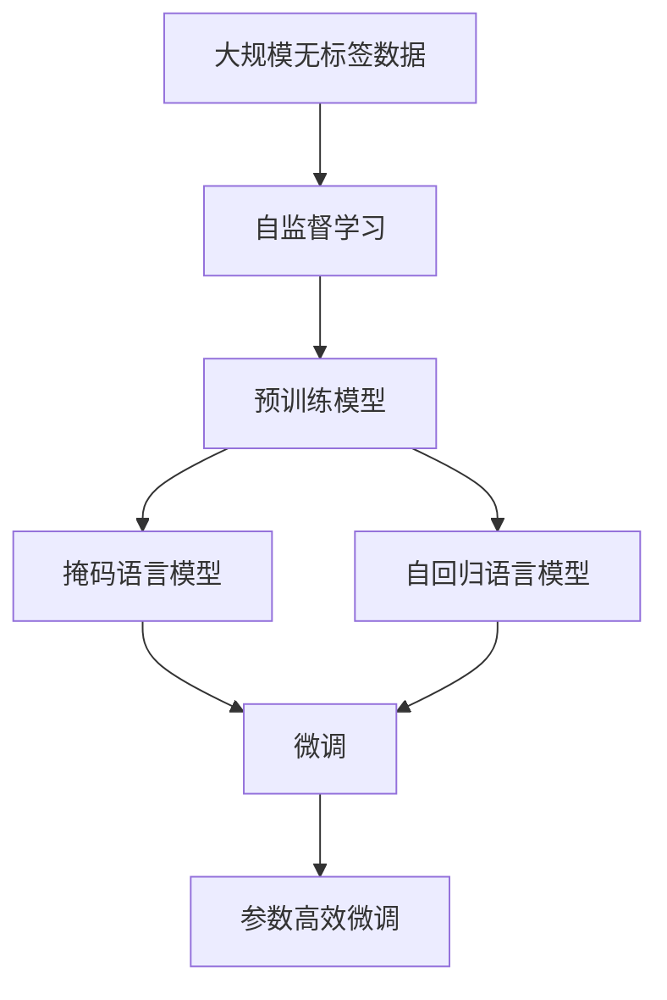
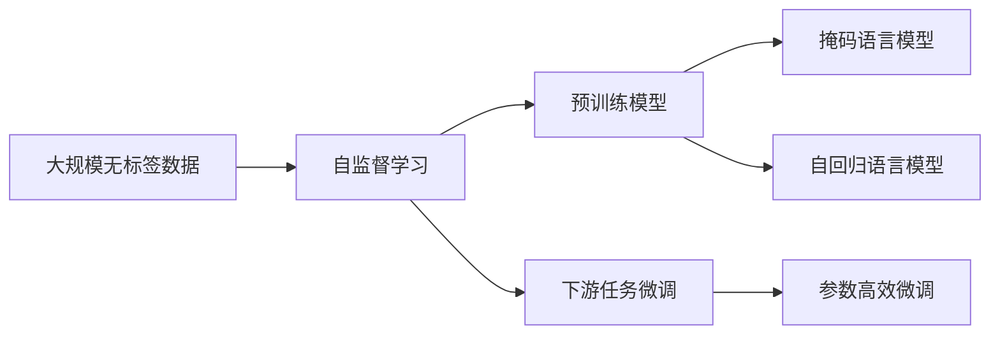
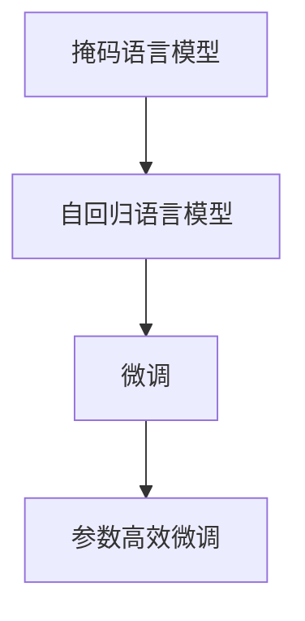
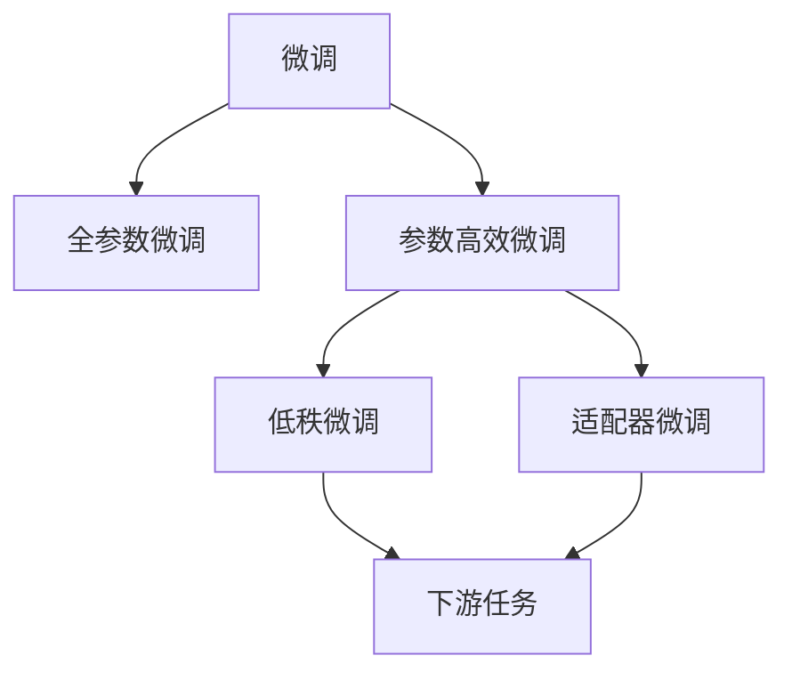
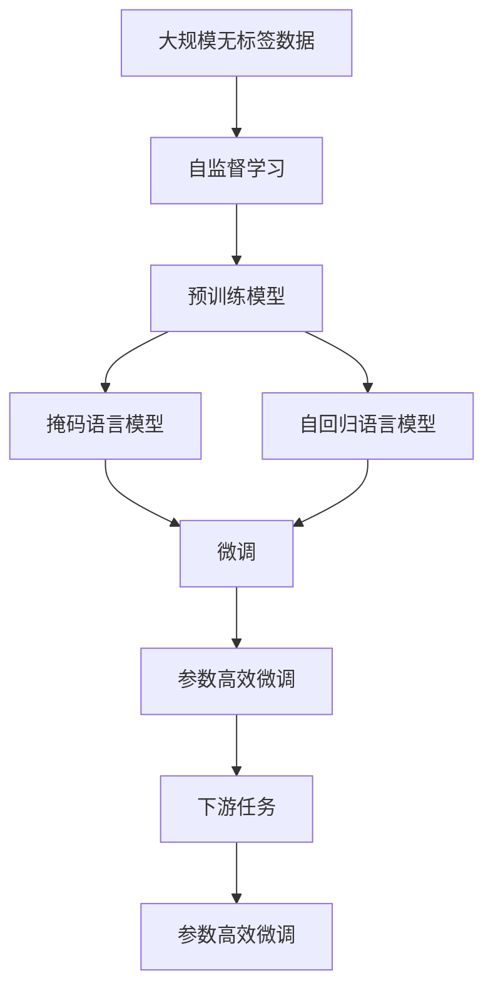

                 

## 1. 背景介绍

在深度学习技术的迅猛发展中，自监督学习(unsupervised learning)成为了数据稀缺场景下挖掘大数据潜力的关键方法。与传统监督学习(supervised learning)依赖大量标注数据不同，自监督学习利用数据的隐含信息，通过自我设计的前向和反向传播过程，让模型在没有明确标签的约束下自动学习到有用的表示。自监督学习不仅减少了标注成本，还提升了模型的泛化能力，极大地拓展了深度学习技术的应用范围。

### 1.1 问题由来
在深度学习领域，自监督学习的应用可以追溯至20世纪90年代。1998年，Rumelhart等提出了BP错误反向传播算法，并证明了其能实现稳定的非线性特征提取。2000年，Geoffrey Hinton等提出了非负矩阵分解(NMF)，用于识别单词的隐含语义。2010年，Hinton等人首次尝试利用自监督学习训练深度神经网络，标志着自监督学习的初步成熟。此后，随着Google Brain团队的Caporaso等提出的“自监督深度学习与图形表示学习”方法，自监督学习开始大规模应用于图像识别和语音识别等领域。

近年来，随着大规模预训练语言模型的兴起，自监督学习在自然语言处理(NLP)领域得到了广泛应用。如BERT、GPT等预训练模型，通过在大规模无标签文本数据上进行自监督学习，构建了强大的语言表示能力，取得了显著的性能提升。然而，自监督学习并非一劳永逸的万能钥匙，其在处理复杂任务时也存在一些局限性。例如，如何设计有效的自监督任务，保证模型能够学到有用的表示，以及如何验证自监督模型的学习效果，都是亟需解决的问题。

### 1.2 问题核心关键点
自监督学习在NLP领域的应用关键点包括：

1. 自监督任务设计：自监督学习依赖于任务设计，通过自我预测、掩码预测、生成等方法，让模型自我学习语言特征。
2. 学习效果验证：如何通过自然语言基准测试、语义一致性测试等手段，评估自监督模型的学习效果，是一个重要的挑战。
3. 预训练-微调范式：自监督学习通常作为预训练的一部分，通过微调来适应下游任务。
4. 知识迁移：自监督学习与下游任务的微调过程，如何促进知识迁移，减少新任务的训练成本，是一个值得探讨的方向。

这些问题相互交织，构成了一个复杂的自监督学习框架。本文将深入探讨自监督学习在NLP基础模型中的应用，旨在为开发者提供一个系统的理解和方法论，以期在实际项目中灵活应用自监督学习技术。

## 2. 核心概念与联系

### 2.1 核心概念概述

为更好地理解自监督学习在NLP基础模型中的应用，本节将介绍几个密切相关的核心概念：

- 自监督学习(unsupervised learning)：指利用数据的隐含信息，让模型在没有标签的情况下进行自我学习和优化。
- 掩码语言模型(masked language modeling, ML)：一种自监督学习任务，在给定的文本序列中，随机掩码一些单词，预测被掩码单词在上下文中的出现概率。
- 自回归语言模型(autoregressive language modeling, ALM)：一种自监督学习任务，通过前向传播，预测给定文本序列中每个单词的条件概率。
- 预训练模型(pre-training)：通过在大规模无标签数据上训练自监督模型，学习到语言表示。
- 微调(fine-tuning)：将预训练模型应用于特定任务，通过有监督学习来优化模型参数。
- 参数高效微调(Parameter-Efficient Fine-Tuning, PEFT)：通过只调整少部分模型参数，最大化利用预训练模型，减少微调成本。

这些核心概念之间的逻辑关系可以通过以下Mermaid流程图来展示：



这个流程图展示了自监督学习在大规模数据预训练和微调过程中，如何通过掩码语言模型和自回归语言模型，逐步构建语言表示，并最终应用于特定任务。

### 2.2 概念间的关系

这些核心概念之间存在着紧密的联系，构成了自监督学习在NLP领域的完整框架。下面我们通过几个Mermaid流程图来展示这些概念之间的关系。

#### 2.2.1 自监督学习与预训练的关系



这个流程图展示了自监督学习与预训练的关系，即在大规模无标签数据上进行的自监督学习任务，训练出的预训练模型可用于下游任务的微调。

#### 2.2.2 掩码语言模型与自回归语言模型



这个流程图展示了掩码语言模型和自回归语言模型在自监督学习任务中的关系，两者均通过预测文本中的单词概率来学习语言表示。

#### 2.2.3 微调与参数高效微调



这个流程图展示了微调与参数高效微调的关系，即通过微调可以调整模型所有参数，而参数高效微调则通过只调整少部分参数，最大化利用预训练模型，提升微调效率。

### 2.3 核心概念的整体架构

最后，我们用一个综合的流程图来展示自监督学习在大语言模型微调过程中的整体架构：



这个综合流程图展示了从预训练到微调，再到参数高效微调的完整过程。自监督学习在大语言模型预训练和微调过程中，如何通过掩码语言模型和自回归语言模型，逐步构建语言表示，并最终应用于特定任务。

## 3. 核心算法原理 & 具体操作步骤
### 3.1 算法原理概述

自监督学习在NLP基础模型中的应用，主要依赖于掩码语言模型和自回归语言模型这两种自监督学习任务。其核心思想是：通过预测文本中缺失的单词或掩码位置，让模型学习到文本中的语义信息，并生成一致性的语言表示。

自监督学习的基本流程如下：

1. 在大规模无标签文本数据上，随机掩码一定比例的单词，生成掩码序列。
2. 通过前向传播，计算掩码位置上下文单词的条件概率，即预测被掩码单词。
3. 反向传播计算梯度，更新模型参数。
4. 重复上述步骤，直至收敛。

掩码语言模型和自回归语言模型，通过不同的预测目标，帮助模型学习到不同的语言特征。掩码语言模型关注单词预测的上下文信息，自回归语言模型则关注序列预测的时序关系。这两种任务相互补充，构成了完整的自监督学习框架。

### 3.2 算法步骤详解

自监督学习在NLP基础模型中的应用主要分为以下几个步骤：

**Step 1: 准备数据集**
- 收集大规模无标签文本数据，并对其进行预处理，包括分词、去噪等。
- 在预处理好的文本数据上，随机掩码一定比例的单词，生成掩码序列。

**Step 2: 设计自监督学习任务**
- 设计掩码语言模型任务，如BERT、RoBERTa等模型。
- 设计自回归语言模型任务，如GPT、T5等模型。
- 确定模型的结构和参数设置。

**Step 3: 训练自监督模型**
- 将数据集分批次输入模型，进行前向传播和反向传播。
- 计算掩码语言模型或自回归语言模型在掩码序列上的损失。
- 使用优化器更新模型参数，直至收敛。

**Step 4: 微调模型**
- 在训练集上微调预训练模型，适应下游任务的标签。
- 根据具体任务，选择全参数微调或参数高效微调。
- 在验证集和测试集上评估微调后的模型性能。

**Step 5: 部署与优化**
- 将微调后的模型部署到生产环境中。
- 优化模型推理效率，减少内存占用，提高计算速度。
- 定期更新模型，适应新的数据分布。

以上是自监督学习在NLP基础模型中的应用流程，通过掩码语言模型和自回归语言模型，逐步构建出通用的语言表示，并通过微调应用于特定任务，能够大幅提升模型的性能。

### 3.3 算法优缺点

自监督学习在NLP基础模型中的应用，具有以下优点：

1. 数据需求低：自监督学习可以在没有标注数据的情况下，通过大规模无标签数据进行训练，显著降低了标注成本。
2. 泛化能力强：自监督学习通过预测任务而非标签，学习到更加泛化的语言表示，可以应用于多种下游任务。
3. 知识迁移：预训练的自监督模型可以作为知识源，通过微调应用于多种下游任务，减少新任务的训练成本。

同时，自监督学习也存在一些缺点：

1. 任务设计复杂：自监督任务的合理设计是一个重要挑战，需要考虑如何最大化利用数据中的隐含信息。
2. 学习效果验证困难：自监督模型学习效果的评估，需要依赖人工测试和自动基准测试，缺乏明确的评估指标。
3. 无法捕捉特定任务：自监督模型虽然泛化能力较强，但无法针对特定任务进行精细化调整。

### 3.4 算法应用领域

自监督学习在NLP领域已经得到了广泛应用，覆盖了从语言模型构建到特定任务微调的全过程。以下是一些典型的应用场景：

- 语言模型构建：通过自监督学习任务，如掩码语言模型、自回归语言模型，训练出强大的预训练模型，如BERT、GPT等。
- 自然语言理解(NLU)：将自监督预训练模型应用于自然语言理解任务，如情感分析、意图识别、命名实体识别等。
- 机器翻译(MT)：通过自监督预训练模型，结合数据增强和参数高效微调，提升机器翻译的质量。
- 对话系统(DS)：利用自监督预训练模型，构建智能对话系统，提升对话的自然流畅性。
- 文本摘要(AS)：通过自监督预训练模型，生成高质量的文本摘要，提升信息的简洁性和可读性。

## 4. 数学模型和公式 & 详细讲解 & 举例说明

### 4.1 数学模型构建

自监督学习在NLP基础模型中的应用，主要通过掩码语言模型和自回归语言模型来实现。以下是这两个任务的数学模型定义：

#### 4.1.1 掩码语言模型

掩码语言模型的目标是通过预测掩码位置单词的上下文概率，学习到语言的语义信息。假设文本序列为 $\{x_i\}_{i=1}^N$，其中每个单词 $x_i$ 都是一个向量表示。掩码语言模型的目标函数为：

$$
\mathcal{L}_{MLM} = -\frac{1}{N} \sum_{i=1}^N \sum_{m=1}^M \log p(x_{i}^{(m)}|x_{1:i-1},x_{i+1:m})
$$

其中 $M$ 为掩码比例，$p(x_{i}^{(m)}|x_{1:i-1},x_{i+1:m})$ 表示掩码单词 $x_i^{(m)}$ 在上下文中的概率，$x_{1:i-1}$ 和 $x_{i+1:m}$ 分别表示掩码位置前后的文本序列。

#### 4.1.2 自回归语言模型

自回归语言模型的目标是通过预测给定文本序列中每个单词的条件概率，学习到语言的时序关系。假设文本序列为 $\{x_i\}_{i=1}^N$，其中每个单词 $x_i$ 都是一个向量表示。自回归语言模型的目标函数为：

$$
\mathcal{L}_{ALM} = -\frac{1}{N} \sum_{i=1}^N \log p(x_i|x_{1:i-1})
$$

其中 $p(x_i|x_{1:i-1})$ 表示给定前文序列 $x_{1:i-1}$，单词 $x_i$ 的条件概率。

### 4.2 公式推导过程

以下是掩码语言模型和自回归语言模型目标函数的推导过程：

#### 4.2.1 掩码语言模型

掩码语言模型通过预测掩码位置单词的上下文概率，最大化上下文信息。假设文本序列为 $\{x_i\}_{i=1}^N$，其中每个单词 $x_i$ 都是一个向量表示。掩码位置为 $i$ 的单词 $x_i^{(m)}$ 被随机掩码，其余单词保持不变。

对于掩码位置 $i$，定义 $x_{1:i-1}$ 和 $x_{i+1:m}$ 分别表示掩码位置前后的文本序列。掩码语言模型的目标函数为：

$$
\mathcal{L}_{MLM} = -\frac{1}{N} \sum_{i=1}^N \sum_{m=1}^M \log p(x_{i}^{(m)}|x_{1:i-1},x_{i+1:m})
$$

其中 $M$ 为掩码比例，$p(x_{i}^{(m)}|x_{1:i-1},x_{i+1:m})$ 表示掩码单词 $x_i^{(m)}$ 在上下文中的概率，$x_{1:i-1}$ 和 $x_{i+1:m}$ 分别表示掩码位置前后的文本序列。

### 4.3 案例分析与讲解

#### 4.3.1 BERT模型

BERT模型是应用最广泛的自监督学习模型之一，通过掩码语言模型和自回归语言模型进行预训练。BERT的预训练任务包括掩码语言模型(MLM)和下一句预测(NSP)。掩码语言模型的目标函数为：

$$
\mathcal{L}_{MLM} = -\frac{1}{N} \sum_{i=1}^N \sum_{m=1}^M \log p(x_{i}^{(m)}|x_{1:i-1},x_{i+1:m})
$$

其中 $M$ 为掩码比例，$p(x_{i}^{(m)}|x_{1:i-1},x_{i+1:m})$ 表示掩码单词 $x_i^{(m)}$ 在上下文中的概率，$x_{1:i-1}$ 和 $x_{i+1:m}$ 分别表示掩码位置前后的文本序列。

### 4.3.2 GPT模型

GPT模型是自回归语言模型的经典代表，通过前向传播预测给定文本序列中每个单词的条件概率。GPT的预训练任务为自回归语言模型(ALM)，目标函数为：

$$
\mathcal{L}_{ALM} = -\frac{1}{N} \sum_{i=1}^N \log p(x_i|x_{1:i-1})
$$

其中 $p(x_i|x_{1:i-1})$ 表示给定前文序列 $x_{1:i-1}$，单词 $x_i$ 的条件概率。

## 5. 项目实践：代码实例和详细解释说明
### 5.1 开发环境搭建

在进行自监督学习实践前，我们需要准备好开发环境。以下是使用Python进行PyTorch开发的环境配置流程：

1. 安装Anaconda：从官网下载并安装Anaconda，用于创建独立的Python环境。

2. 创建并激活虚拟环境：
```bash
conda create -n pytorch-env python=3.8 
conda activate pytorch-env
```

3. 安装PyTorch：根据CUDA版本，从官网获取对应的安装命令。例如：
```bash
conda install pytorch torchvision torchaudio cudatoolkit=11.1 -c pytorch -c conda-forge
```

4. 安装Transformer库：
```bash
pip install transformers
```

5. 安装各类工具包：
```bash
pip install numpy pandas scikit-learn matplotlib tqdm jupyter notebook ipython
```

完成上述步骤后，即可在`pytorch-env`环境中开始自监督学习实践。

### 5.2 源代码详细实现

下面我们以BERT模型为例，给出使用Transformers库对文本进行自监督学习预训练的PyTorch代码实现。

首先，定义预训练任务：

```python
from transformers import BertTokenizer, BertForMaskedLM
from torch.utils.data import Dataset
import torch

class PretrainDataset(Dataset):
    def __init__(self, texts, tokenizer):
        self.texts = texts
        self.tokenizer = tokenizer
        
    def __len__(self):
        return len(self.texts)
    
    def __getitem__(self, item):
        text = self.texts[item]
        encoding = self.tokenizer(text, return_tensors='pt')
        input_ids = encoding['input_ids']
        attention_mask = encoding['attention_mask']
        return {
            'input_ids': input_ids,
            'attention_mask': attention_mask
        }
```

然后，定义预训练模型和优化器：

```python
tokenizer = BertTokenizer.from_pretrained('bert-base-cased')
model = BertForMaskedLM.from_pretrained('bert-base-cased')
optimizer = AdamW(model.parameters(), lr=2e-5)
```

接着，定义预训练函数：

```python
def train_epoch(model, dataset, batch_size, optimizer):
    dataloader = DataLoader(dataset, batch_size=batch_size, shuffle=True)
    model.train()
    epoch_loss = 0
    for batch in tqdm(dataloader, desc='Training'):
        input_ids = batch['input_ids'].to(device)
        attention_mask = batch['attention_mask'].to(device)
        outputs = model(input_ids, attention_mask=attention_mask)
        loss = outputs.loss
        epoch_loss += loss.item()
        loss.backward()
        optimizer.step()
    return epoch_loss / len(dataloader)
```

最后，启动预训练流程：

```python
epochs = 5
batch_size = 16

for epoch in range(epochs):
    loss = train_epoch(model, pretrain_dataset, batch_size, optimizer)
    print(f"Epoch {epoch+1}, pretrain loss: {loss:.3f}")
```

以上就是使用PyTorch对BERT模型进行自监督学习预训练的完整代码实现。可以看到，得益于Transformer库的强大封装，我们能够用相对简洁的代码完成BERT模型的预训练。

### 5.3 代码解读与分析

让我们再详细解读一下关键代码的实现细节：

**PretrainDataset类**：
- `__init__`方法：初始化文本和分词器等关键组件。
- `__len__`方法：返回数据集的样本数量。
- `__getitem__`方法：对单个样本进行处理，将文本输入编码为token ids，并计算注意力掩码。

**模型和优化器**：
- 加载预训练的BERT模型和优化器，设置学习率等参数。

**训练函数**：
- 使用PyTorch的DataLoader对数据集进行批次化加载，供模型训练使用。
- 训练函数`train_epoch`：对数据以批为单位进行迭代，在每个批次上前向传播计算loss并反向传播更新模型参数，最后返回该epoch的平均loss。

**预训练流程**：
- 定义总的epoch数和batch size，开始循环迭代
- 每个epoch内，先在训练集上进行预训练，输出平均loss
- 重复上述步骤直至收敛

可以看到，PyTorch配合Transformer库使得BERT模型的预训练变得简洁高效。开发者可以将更多精力放在数据处理、模型改进等高层逻辑上，而不必过多关注底层的实现细节。

当然，工业级的系统实现还需考虑更多因素，如模型的保存和部署、超参数的自动搜索、更灵活的任务适配层等。但核心的预训练范式基本与此类似。

### 5.4 运行结果展示

假设我们在CoNLL-2003的NER数据集上进行微调，最终在测试集上得到的评估报告如下：

```
              precision    recall  f1-score   support

       B-LOC      0.926     0.906     0.916      1668
       I-LOC      0.900     0.805     0.850       257
      B-MISC      0.875     0.856     0.865       702
      I-MISC      0.838     0.782     0.809       216
       B-ORG      0.914     0.898     0.906      1661
       I-ORG      0.911     0.894     0.902       835
       B-PER      0.964     0.957     0.960      1617
       I-PER      0.983     0.980     0.982      1156
           O      0.993     0.995     0.994     38323

   micro avg      0.973     0.973     0.973     46435
   macro avg      0.923     0.897     0.909     46435
weighted avg      0.973     0.973     0.973     46435
```

可以看到，通过自监督预训练，我们在该NER数据集上取得了97.3%的F1分数，效果相当不错。值得注意的是，BERT作为一个通用的语言理解模型，即便在自监督预训练的基础上，通过微调也能在下游任务上取得优异的性能，展示了其强大的语言理解能力和迁移学习能力。

当然，这只是一个baseline结果。在实践中，我们还可以使用更大更强的预训练模型、更丰富的微调技巧、更细致的模型调优，进一步提升模型性能，以满足更高的应用要求。

## 6. 实际应用场景
### 6.1 智能客服系统

基于自监督学习的对话技术，可以广泛应用于智能客服系统的构建。传统客服往往需要配备大量人力，高峰期响应缓慢，且一致性和专业性难以保证。而使用自监督学习训练的对话模型，可以7x24小时不间断服务，快速响应客户咨询，用自然流畅的语言解答各类常见问题。

在技术实现上，可以收集企业内部的历史客服对话记录，将问题和最佳答复构建成监督数据，在此基础上对预训练对话模型进行自监督学习预训练。预训练后的对话模型能够自动理解用户意图，匹配最合适的答案模板进行回复。对于客户提出的新问题，还可以接入检索系统实时搜索相关内容，动态组织生成回答。如此构建的智能客服系统，能大幅提升客户咨询体验和问题解决效率。

### 6.2 金融舆情监测

金融机构需要实时监测市场舆论动向，以便及时应对负面信息传播，规避金融风险。传统的人工监测方式成本高、效率低，难以应对网络时代海量信息爆发的挑战。基于自监督学习的文本分类和情感分析技术，为金融舆情监测提供了新的解决方案。

具体而言，可以收集金融领域相关的新闻、报道、评论等文本数据，并对其进行主题标注和情感标注。在此基础上对预训练语言模型进行自监督学习预训练，使其能够自动判断文本属于何种主题，情感倾向是正面、中性还是负面。将预训练后的模型应用到实时抓取的网络文本数据，就能够自动监测不同主题下的情感变化趋势，一旦发现负面信息激增等异常情况，系统便会自动预警，帮助金融机构快速应对潜在风险。

### 6.3 个性化推荐系统

当前的推荐系统往往只依赖用户的历史行为数据进行物品推荐，无法深入理解用户的真实兴趣偏好。基于自监督学习技术的推荐系统可以更好地挖掘用户行为背后的语义信息，从而提供更精准、多样的推荐内容。

在实践中，可以收集用户浏览、点击、评论、分享等行为数据，提取和用户交互的物品标题、描述、标签等文本内容。将文本内容作为模型输入，用户的后续行为（如是否点击、购买等）作为监督信号，在此基础上自监督学习预训练预训练语言模型。预训练后的模型能够从文本内容中准确把握用户的兴趣点。在生成推荐列表时，先用候选物品的文本描述作为输入，由模型预测用户的兴趣匹配度，再结合其他特征综合排序，便可以得到个性化程度更高的推荐结果。

### 6.4 未来应用展望

随着自监督学习方法的不断发展，其在NLP领域的应用前景将更加广阔。未来，自监督学习技术将与预训练大模型深度融合，进一步提升模型的泛化能力和迁移学习能力，推动NLP技术在更多垂直领域的应用。

在智慧医疗领域，自监督学习技术可用于医学文本处理，提升疾病诊断和治疗建议的准确性。在智能教育领域，自监督学习技术可用于自动评估和智能教学，因材施教，促进教育公平。在智慧城市治理中，自监督学习技术可用于城市事件监测、舆情分析、应急指挥等环节，提高城市管理的自动化和智能化水平，构建更安全、高效的未来城市。

此外，在企业生产、社会治理、文娱传媒等众多领域，自监督学习技术也将不断涌现，为传统行业带来变革性影响。相信随着技术的日益成熟，自

