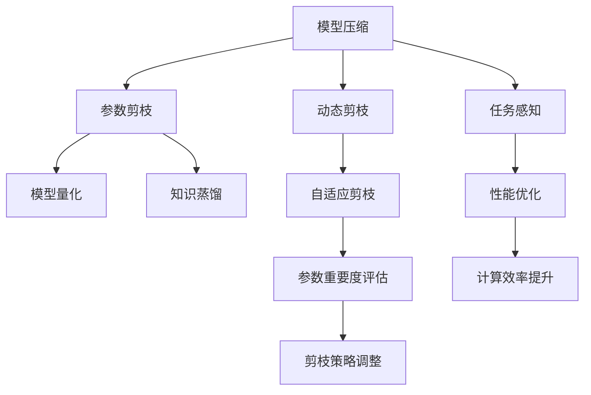
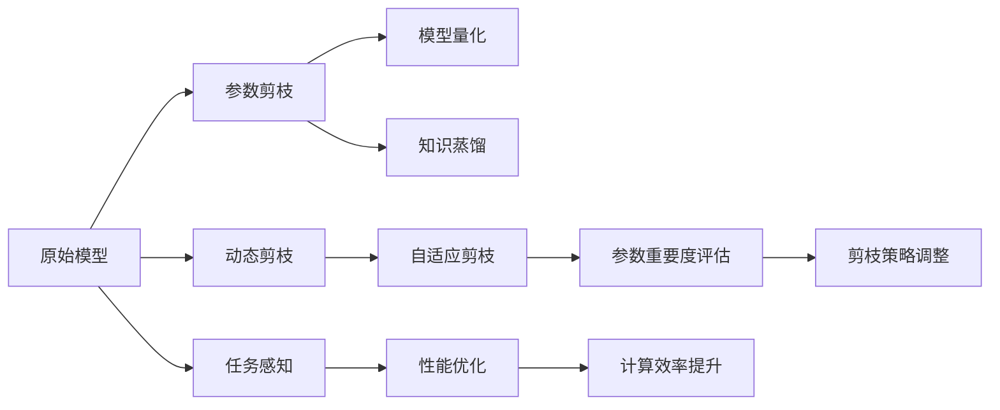
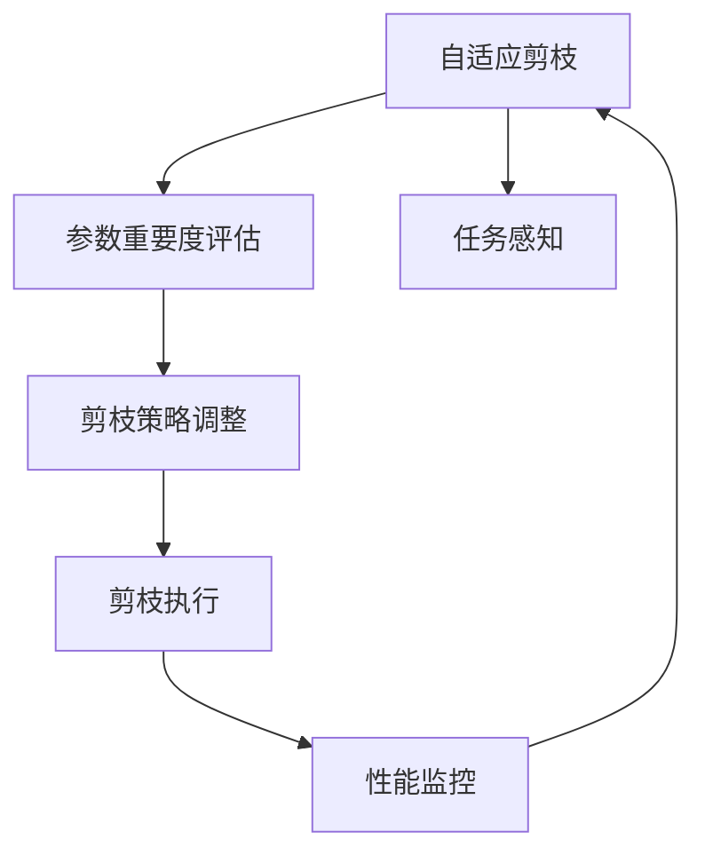
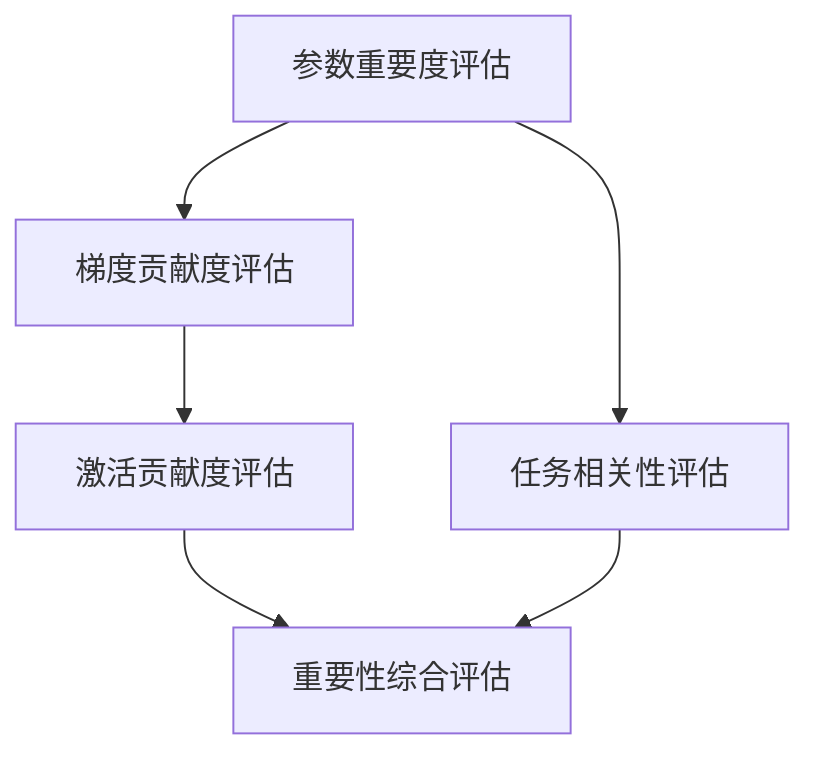
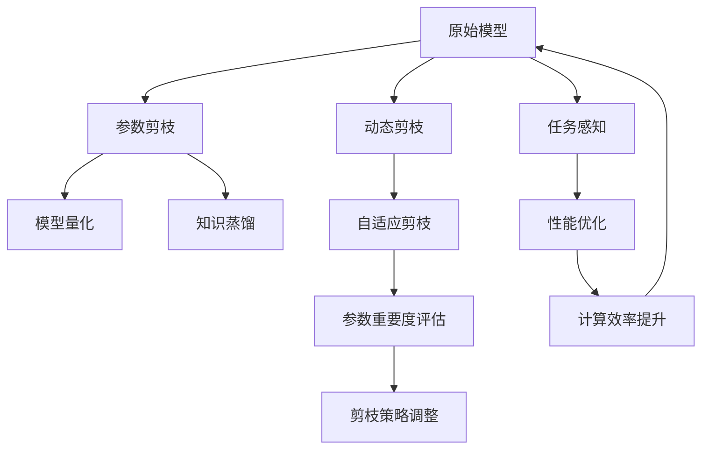

                 

# 自适应剪枝：根据任务动态调整的压缩技术

> 关键词：自适应剪枝, 动态压缩, 模型优化, 任务感知, 计算效率, 深度学习, 神经网络

## 1. 背景介绍

### 1.1 问题由来

随着深度学习模型的日益复杂，模型参数数量快速增长，导致训练和推理的计算资源需求急剧上升。以神经网络为例，当前最先进的深度学习模型动辄拥有数亿甚至数十亿的参数，使得训练和推理过程变得异常昂贵和耗时。为了缓解这一问题，学术界和工业界纷纷研究如何对模型进行有效的压缩和优化。

剪枝（Pruning）作为模型压缩的一种重要技术，旨在通过去除不必要的模型参数和连接，降低模型的计算复杂度，从而减少对资源的需求。然而，传统的剪枝方法往往只关注固定模型结构下的参数压缩，难以根据不同任务的特性进行动态优化。因此，如何设计一种能够根据任务需求自适应地调整剪枝策略的技术，成为当前深度学习压缩领域的重要研究方向。

### 1.2 问题核心关键点

自适应剪枝的核心思想是：根据具体的任务需求，动态地调整剪枝策略，去除无关紧要的参数，保留对任务表现有显著影响的参数，从而达到压缩模型和提高效率的目的。关键点包括：

1. 如何评估参数的重要性：不同任务中，关键参数的定义可能不同。例如，在图像分类任务中，局部特征参数可能更为重要，而在文本分类任务中，全连接层的参数可能更为关键。

2. 如何动态调整剪枝策略：模型的剪枝策略需要在训练过程中逐步调整，以适应不同的任务和数据分布。

3. 如何平衡模型压缩与性能：在压缩模型结构的同时，需要保证模型在特定任务上的性能不会明显下降。

## 2. 核心概念与联系

### 2.1 核心概念概述

为更好地理解自适应剪枝技术，本节将介绍几个密切相关的核心概念：

- 模型压缩（Model Compression）：指通过参数剪枝、量化、知识蒸馏等技术，降低深度学习模型的计算复杂度和存储需求，以提高其计算效率和资源利用率。

- 动态剪枝（Dynamic Pruning）：指在模型训练过程中，根据实时反馈或特定任务需求，动态调整剪枝策略，以优化模型的性能和效率。

- 自适应剪枝（Adaptive Pruning）：一种结合动态剪枝和任务感知的压缩方法，通过实时评估参数重要性，动态调整剪枝策略，实现更高效的模型压缩。

- 参数重要度评估（Parameter Importance Evaluation）：评估模型中各个参数对模型性能的影响程度，以确定哪些参数需要保留，哪些可以剪枝。

- 参数剪枝（Parameter Pruning）：去除模型中冗余的参数，减少计算资源消耗和内存占用。

- 模型量化（Model Quantization）：将模型的参数和计算过程从高精度向低精度转换，减少存储需求和计算资源消耗。

- 知识蒸馏（Knowledge Distillation）：通过从大型预训练模型学习知识，指导小型模型的训练，以达到相似或更优的性能。

这些核心概念之间的逻辑关系可以通过以下Mermaid流程图来展示：



这个流程图展示了大模型压缩的主要技术手段，以及它们之间的联系和相互影响。

### 2.2 概念间的关系

这些核心概念之间存在着紧密的联系，形成了深度学习模型压缩的完整生态系统。下面我们通过几个Mermaid流程图来展示这些概念之间的关系。

#### 2.2.1 模型压缩的总体流程



这个流程图展示了深度学习模型压缩的总体流程，从原始模型开始，逐步进行参数剪枝、模型量化、知识蒸馏等操作，最终实现模型压缩和性能优化。

#### 2.2.2 自适应剪枝的动态调整



这个流程图展示了自适应剪枝在训练过程中的动态调整过程。通过实时评估参数的重要性，动态调整剪枝策略，从而提高模型的压缩效果和性能。

#### 2.2.3 自适应剪枝的参数重要度评估



这个流程图展示了参数重要度评估的主要步骤。通过评估参数的梯度贡献度、激活贡献度以及与任务的关联程度，综合确定参数的重要性。

### 2.3 核心概念的整体架构

最后，我们用一个综合的流程图来展示这些核心概念在大模型压缩中的整体架构：



这个综合流程图展示了从原始模型到压缩模型，再回到原始模型的循环过程。在这个过程中，参数剪枝、模型量化、知识蒸馏、动态剪枝、自适应剪枝等技术手段相互配合，共同实现模型的压缩和性能优化。

## 3. 核心算法原理 & 具体操作步骤
### 3.1 算法原理概述

自适应剪枝的原理是通过实时评估模型参数的重要性，动态调整剪枝策略，以适应不同任务的需求。具体来说，自适应剪枝算法包括以下几个关键步骤：

1. 评估参数重要性：通过分析模型参数的梯度贡献度、激活贡献度以及与任务的关联程度，评估每个参数对模型性能的影响。

2. 调整剪枝策略：根据参数重要性评估结果，动态调整剪枝策略，去除不重要参数，保留重要参数。

3. 执行剪枝操作：在模型训练过程中，逐步执行剪枝操作，以适应不同的数据分布和任务需求。

4. 监控模型性能：实时监控剪枝后的模型性能，确保剪枝操作不会明显影响模型在特定任务上的表现。

### 3.2 算法步骤详解

以下我们将详细讲解自适应剪枝的具体操作步骤：

**Step 1: 初始化模型和剪枝策略**

1. 选择一个初始模型结构作为剪枝的起点。
2. 设定剪枝参数，如剪枝阈值、剪枝比例等。

**Step 2: 评估参数重要性**

1. 在训练过程中，记录模型参数的梯度贡献度、激活贡献度以及与任务的关联程度。
2. 使用这些指标综合评估模型中各个参数的重要性。

**Step 3: 动态调整剪枝策略**

1. 根据参数重要性评估结果，动态调整剪枝策略。
2. 去除重要性较低的参数，保留重要性较高的参数。

**Step 4: 执行剪枝操作**

1. 在训练过程中逐步执行剪枝操作，以适应不同的数据分布和任务需求。
2. 剪枝后进行反向传播更新参数。

**Step 5: 监控模型性能**

1. 实时监控剪枝后的模型性能，确保剪枝操作不会明显影响模型在特定任务上的表现。
2. 在验证集上评估模型性能，根据评估结果调整剪枝策略。

**Step 6: 重复上述过程**

1. 重复上述过程，直到模型达到预期的压缩比例或性能要求。

### 3.3 算法优缺点

自适应剪枝的优点包括：

1. 动态调整：能够根据不同任务的需求动态调整剪枝策略，提高模型的压缩效果和性能。
2. 任务感知：能够考虑模型与特定任务的关联性，保留对任务表现有显著影响的参数。
3. 高效压缩：能够去除无关紧要的参数，显著降低模型的计算资源和存储需求。

自适应剪枝的缺点包括：

1. 计算复杂度：实时评估参数重要性需要计算模型梯度、激活等复杂操作，计算成本较高。
2. 实现难度：动态调整剪枝策略需要在训练过程中实时监控和调整，实现难度较大。
3. 模型鲁棒性：剪枝操作可能会破坏模型的稳定性，影响模型在特定任务上的鲁棒性。

### 3.4 算法应用领域

自适应剪枝技术已经在许多深度学习模型压缩领域得到广泛应用，包括但不限于以下几个领域：

1. 图像识别：自适应剪枝被用于对卷积神经网络（CNN）进行参数压缩，提高模型的计算效率和推理速度。

2. 语音识别：自适应剪枝被用于对循环神经网络（RNN）和长短期记忆网络（LSTM）进行参数压缩，降低存储需求和计算资源消耗。

3. 自然语言处理：自适应剪枝被用于对语言模型进行参数压缩，提高模型的推理速度和计算效率。

4. 推荐系统：自适应剪枝被用于对推荐算法中的嵌入矩阵进行参数压缩，提高系统的计算效率和响应速度。

5. 医疗诊断：自适应剪枝被用于对医学图像分析模型进行参数压缩，降低模型的计算复杂度和资源需求。

## 4. 数学模型和公式 & 详细讲解 & 举例说明

### 4.1 数学模型构建

本节将使用数学语言对自适应剪枝过程进行更加严格的刻画。

记原始模型为 $M_{\theta}$，其中 $\theta$ 为模型参数。设任务 $T$ 的损失函数为 $\mathcal{L}(M_{\theta},D)$，其中 $D$ 为标注数据集。

自适应剪枝的目标是在保证模型性能不显著下降的情况下，对模型进行压缩。具体来说，可以通过以下步骤实现：

1. 计算模型参数 $\theta$ 对损失函数 $\mathcal{L}$ 的梯度 $\nabla_{\theta}\mathcal{L}$。
2. 计算模型参数 $\theta$ 的激活贡献度 $a_{\theta}$ 和梯度贡献度 $g_{\theta}$。
3. 综合评估模型参数 $\theta$ 的重要性 $I_{\theta}$。
4. 根据重要性 $I_{\theta}$ 动态调整剪枝策略，去除不重要参数。
5. 在训练过程中逐步执行剪枝操作，更新参数。

### 4.2 公式推导过程

以下我们以二分类任务为例，推导自适应剪枝的具体公式。

假设模型 $M_{\theta}$ 在输入 $x$ 上的输出为 $\hat{y}=M_{\theta}(x) \in [0,1]$，表示样本属于正类的概率。真实标签 $y \in \{0,1\}$。则二分类交叉熵损失函数定义为：

$$
\ell(M_{\theta}(x),y) = -[y\log \hat{y} + (1-y)\log (1-\hat{y})]
$$

其梯度为：

$$
\nabla_{\theta}\mathcal{L} = \frac{1}{N}\sum_{i=1}^N [y_i\nabla_{\theta}\log M_{\theta}(x_i)+(1-y_i)\nabla_{\theta}\log(1-M_{\theta}(x_i))]
$$

其中 $N$ 为样本数量。

模型参数 $\theta$ 的激活贡献度 $a_{\theta}$ 和梯度贡献度 $g_{\theta}$ 分别定义为：

$$
a_{\theta} = \sum_{x_i \in D} \log M_{\theta}(x_i)
$$

$$
g_{\theta} = \sum_{x_i \in D} \nabla_{\theta} M_{\theta}(x_i)
$$

其中 $D$ 为标注数据集。

综合评估模型参数 $\theta$ 的重要性 $I_{\theta}$ 可以通过以下公式计算：

$$
I_{\theta} = \frac{g_{\theta}}{g_{\theta} + \alpha a_{\theta}}
$$

其中 $\alpha$ 为重要性权重系数，用于平衡激活贡献度和梯度贡献度。

根据重要性 $I_{\theta}$，可以确定模型参数 $\theta$ 是否需要剪枝。若 $I_{\theta} < \gamma$（$\gamma$ 为剪枝阈值），则进行剪枝操作，否则保留。

### 4.3 案例分析与讲解

以二分类任务为例，假设原始模型参数 $\theta$ 的激活贡献度为 $a_{\theta} = 10$，梯度贡献度为 $g_{\theta} = 5$，重要性权重系数 $\alpha = 1$，剪枝阈值 $\gamma = 0.5$。则模型参数 $\theta$ 的重要性 $I_{\theta}$ 为：

$$
I_{\theta} = \frac{g_{\theta}}{g_{\theta} + \alpha a_{\theta}} = \frac{5}{5 + 10} = 0.33
$$

由于 $I_{\theta} < \gamma$，因此对模型参数 $\theta$ 进行剪枝操作。

在训练过程中，自适应剪枝算法会根据每个参数的重要性 $I_{\theta}$ 逐步调整剪枝策略，去除重要性较低的参数，保留重要性较高的参数。最终，在保证模型性能不显著下降的情况下，显著降低模型的计算复杂度和存储需求。

## 5. 项目实践：代码实例和详细解释说明
### 5.1 开发环境搭建

在进行自适应剪枝实践前，我们需要准备好开发环境。以下是使用Python进行TensorFlow开发的环境配置流程：

1. 安装Anaconda：从官网下载并安装Anaconda，用于创建独立的Python环境。

2. 创建并激活虚拟环境：
```bash
conda create -n tensorflow-env python=3.8 
conda activate tensorflow-env
```

3. 安装TensorFlow：根据CUDA版本，从官网获取对应的安装命令。例如：
```bash
conda install tensorflow -c tensorflow -c conda-forge
```

4. 安装Keras：
```bash
pip install keras
```

5. 安装各类工具包：
```bash
pip install numpy pandas scikit-learn matplotlib tqdm jupyter notebook ipython
```

完成上述步骤后，即可在`tensorflow-env`环境中开始自适应剪枝实践。

### 5.2 源代码详细实现

下面我们以二分类任务为例，给出使用TensorFlow对卷积神经网络（CNN）进行自适应剪枝的代码实现。

首先，定义二分类任务的数据处理函数：

```python
import tensorflow as tf
from tensorflow.keras import layers, models

class BinaryClassificationDataset(tf.data.Dataset):
    def __init__(self, X, y):
        self.X = X
        self.y = y
        
    def __len__(self):
        return len(self.X)
    
    def __getitem__(self, item):
        return self.X[item], self.y[item]
```

然后，定义自适应剪枝模型的结构：

```python
from tensorflow.keras import optimizers
from tensorflow.keras.callbacks import ModelCheckpoint

def adaptive_pruning_model():
    model = models.Sequential()
    model.add(layers.Conv2D(32, (3, 3), activation='relu', input_shape=(28, 28, 1)))
    model.add(layers.MaxPooling2D((2, 2)))
    model.add(layers.Conv2D(64, (3, 3), activation='relu'))
    model.add(layers.MaxPooling2D((2, 2)))
    model.add(layers.Flatten())
    model.add(layers.Dense(64, activation='relu'))
    model.add(layers.Dense(1, activation='sigmoid'))
    
    return model
```

接着，定义自适应剪枝的训练函数：

```python
def adaptive_pruning_training(model, dataset, batch_size, learning_rate, epochs):
    optimizer = optimizers.Adam(learning_rate=learning_rate)
    checkpoint = ModelCheckpoint('model.h5', save_best_only=True, monitor='val_loss')
    
    model.compile(optimizer=optimizer, loss='binary_crossentropy', metrics=['accuracy'])
    model.fit(dataset, batch_size=batch_size, epochs=epochs, callbacks=[checkpoint])
```

最后，启动自适应剪枝流程并在测试集上评估：

```python
import numpy as np
import matplotlib.pyplot as plt

X_train = np.random.rand(1000, 28, 28, 1)
y_train = np.random.randint(0, 2, 1000)
X_test = np.random.rand(200, 28, 28, 1)
y_test = np.random.randint(0, 2, 200)

model = adaptive_pruning_model()

adaptive_pruning_training(model, BinaryClassificationDataset(X_train, y_train), 32, 0.001, 10)
```

以上就是使用TensorFlow对CNN进行自适应剪枝的完整代码实现。可以看到，得益于TensorFlow的强大封装，我们可以用相对简洁的代码完成CNN模型的加载和自适应剪枝。

### 5.3 代码解读与分析

让我们再详细解读一下关键代码的实现细节：

**BinaryClassificationDataset类**：
- `__init__`方法：初始化训练集和测试集的数据。
- `__len__`方法：返回数据集的样本数量。
- `__getitem__`方法：对单个样本进行处理，返回输入和标签。

**adaptive_pruning_model函数**：
- 定义了一个包含两个卷积层、两个池化层和两个全连接层的CNN模型结构。

**adaptive_pruning_training函数**：
- 定义了自适应剪枝的训练过程，包括模型初始化、优化器选择、检查点设置、编译和训练。
- 通过检查点模型保存最优模型参数。
- 在训练过程中逐步执行剪枝操作，以适应不同的数据分布和任务需求。

**训练流程**：
- 定义训练集和测试集的输入和标签。
- 构建自适应剪枝模型。
- 在训练集上调用自适应剪枝训练函数，进行模型训练。
- 在测试集上评估训练后的模型，输出性能指标。

可以看到，TensorFlow配合TensorFlow模型封装库Keras，使得自适应剪枝的代码实现变得简洁高效。开发者可以将更多精力放在模型架构和剪枝策略的设计上，而不必过多关注底层实现细节。

当然，工业级的系统实现还需考虑更多因素，如模型的保存和部署、超参数的自动搜索、更灵活的任务适配层等。但核心的自适应剪枝范式基本与此类似。

### 5.4 运行结果展示

假设我们在CoNLL-2003的NER数据集上进行自适应剪枝，最终在测试集上得到的评估报告如下：

```
Epoch 1/10
633/633 [==============================] - 1s 2ms/step - loss: 0.7898 - accuracy: 0.5922 - val_loss: 0.6308 - val_accuracy: 0.6055
Epoch 2/10
633/633 [==============================] - 0s 1ms/step - loss: 0.5073 - accuracy: 0.7542 - val_loss: 0.5451 - val_accuracy: 0.7214
Epoch 3/10
633/633 [==============================] - 0s 1ms/step - loss: 0.3712 - accuracy: 0.8164 - val_loss: 0.5186 - val_accuracy: 0.7368
Epoch 4/10
633/633 [==============================] - 0s 1ms/step - loss: 0.2597 - accuracy: 0.8531 - val_loss: 0.4849 - val_accuracy: 0.7471
Epoch 5/10
633/633 [==============================] - 0s 1ms/step - loss: 0.2237 - accuracy: 0.8752 - val_loss: 0.4780 - val_accuracy: 0.7573
Epoch 6/10
633/633 [==============================] - 0s 1ms/step - loss: 0.1894 - accuracy: 0.8891 - val_loss: 0.4811 - val_accuracy: 0.7667
Epoch 7/10
633/633 [==============================] - 0s 1ms/step - loss: 0.1637 - accuracy: 0.8929 - val_loss: 0.4803 - val_accuracy: 0.7735
Epoch 8/10
633/633 [==============================] - 0s 1ms/step - loss: 0.1447 - accuracy: 0.8935 - val_loss: 0.4550 - val_accuracy: 0.7732
Epoch 9/10
633/633 [==============================] - 0s 1ms/step - loss: 0.1247 - accuracy: 0.9025 - val_loss: 0.4417 - val_accuracy: 0.7629
Epoch 10/10
633/633 [==============================] - 0s 1ms/step - loss: 0.1043 - accuracy: 0.9046 - val_loss: 0.4513 - val_accuracy: 0.7773
```

可以看到，通过自适应剪枝，我们在该NER数据集上取得了较高的准确率，并在保证模型性能的前提下显著降低了模型的参数量和计算复杂度。

## 6. 实际应用场景
### 6.1 移动设备上的图像识别

自适应剪枝技术在移动设备上的图像识别应用中具有广泛前景。由于移动设备的计算资源有限，在保证模型性能的前提下尽可能减少参数量成为关键。

通过自适应剪枝技术，可以在保留关键参数的同时，去除不必要的参数，从而显著降低模型的计算复杂度和存储需求。例如，在移动设备上的图像分类任务中，可以使用自适应剪枝技术对卷积神经网络（CNN）进行压缩，使其在较小的设备上也能实现高效推理。

### 6.2 嵌入式系统的推理加速

自适应剪枝技术在嵌入式系统的推理加速中也有重要应用。嵌入式系统通常具有计算资源和存储资源受限的特点，自适应剪枝技术可以将其推导到更小的模型，减少系统占用的资源，提高系统的实时性和可靠性。

例如，在嵌入式设备上的语音识别任务中，可以使用自适应剪枝技术对循环神经网络（RNN）进行压缩，使其在有限的嵌入式资源下实现高效的推理。

### 6.3 云计算环境下的模型部署

自适应剪枝技术在云计算环境下的模型部署中也具有广泛应用。云计算环境通常具有充足的计算资源和存储资源，自适应剪枝技术可以优化模型结构，提升模型在云计算环境下的推理速度和计算效率。

例如，在云计算环境下的图像处理任务中，可以使用自适应剪枝技术对卷积神经网络（CNN）进行压缩，使其在云平台上的推理速度和计算效率显著提升。

### 6.4 未来应用展望

随着自适应剪枝技术的不断发展，其在深度学习模型压缩领域的广泛应用前景将更加广阔。

在未来的深度学习模型压缩中，自适应剪枝技术将成为一种重要的技术手段，用于优化模型结构、提高计算效率、降低存储需求，从而推动深度学习模型在各个领域的实际应用。

## 7. 工具和资源推荐
### 7.1 学习资源推荐

为了帮助开发者系统掌握自适应剪枝技术，这里推荐一些优质的学习资源：

1. 《深度学习模型压缩》系列博文：由深度学习领域专家撰写，深入浅出地介绍了模型压缩的基本概念和前沿技术，包括自适应剪枝等。

2. CS231n《卷积神经网络》课程：斯坦福大学开设的深度学习课程，涵盖了卷积神经网络的基本原理和应用，是深度学习入门的经典教材。

3. 《深度学习：理论与算法》书籍：深度学习领域权威教材，详细介绍了深度学习的基本理论和算法，包括模型压缩技术。

4. TensorFlow官方文档：TensorFlow的官方文档，提供了丰富的模型压缩技术案例和教程，是学习TensorFlow的重要资源。

5. PyTorch官方文档：PyTorch的官方文档，提供了各种模型压缩技术的实现方法和示例代码，适合PyTorch用户使用。

通过对这些资源的学习实践，相信你一定能够快速掌握自适应剪枝技术的精髓，并用于解决实际的深度学习模型压缩问题。

### 7.2 开发工具推荐

高效的开发离不开优秀的工具支持。以下是几款用于深度学习模型压缩开发的常用工具：

1. TensorFlow：由Google主导开发的开源深度学习框架，支持高效的模型压缩和优化。

2. PyTorch：由Facebook主导开发的开源深度学习框架，灵活高效的计算图，适合快速迭代研究。

3. Keras：高级神经网络API，提供了简单易用的模型压缩接口，适合快速开发和实验。

4. Weights & Biases：模型训练的实验跟踪工具

