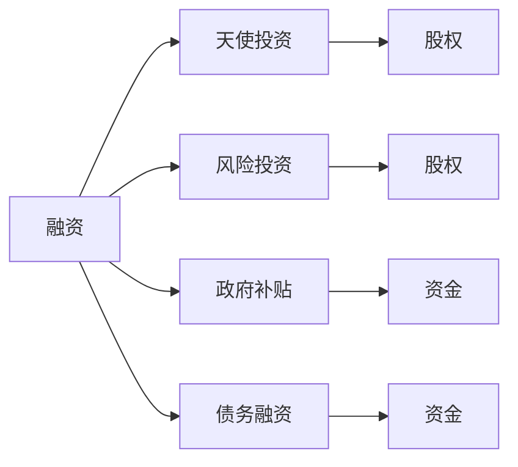

                 

# 草根创业团队的融资挑战

## 1. 背景介绍

随着互联网技术的蓬勃发展，全球创业浪潮汹涌澎湃。越来越多的年轻人怀着对技术的热情和对未来的憧憬，投身于科技创业的征程中。然而，草根创业团队往往缺乏资本的支持，融资问题成为其发展的最大障碍。本文旨在深入探讨草根创业团队的融资挑战，并提出一些具有实际可操作性的解决方案。

## 2. 核心概念与联系

### 2.1 核心概念概述

本节将介绍与草根创业团队融资相关的几个核心概念及其联系。

- **融资（Funding）**：指创业团队为实现项目所需资金的过程。融资方式包括天使投资、风险投资、政府补贴等。
- **天使投资（Angel Investment）**：指个人投资者提供早期资金支持，以换取公司股权。天使投资者通常看重项目潜力而非财务报表。
- **风险投资（Venture Capital）**：指专业投资机构向具有高增长潜力的企业提供资金支持，换取股权或可转换债券。风投更看重商业计划和团队能力。
- **政府补贴（Government Grants）**：指政府为鼓励创新创业而提供的资金支持。补贴形式多样，如直接资助、税收优惠等。
- **债务融资（Debt Financing）**：指通过借款等方式获取项目所需资金，主要包括银行贷款和债券融资。

这些概念之间存在紧密的联系：

1. **资金来源多样化**：创业团队可以通过天使投资、风险投资、政府补贴、债务融资等多种方式获取资金。
2. **股权与债权**：融资方式中，股权融资与债权融资是两种主要形式。股权融资能够分散风险，但代价较大；债权融资能减少控制权稀释，但风险较高。
3. **融资周期**：不同融资方式的资金使用周期不同，创业团队需根据项目需求选择合适的融资方式。
4. **风险与回报**：不同融资方式对应的风险和回报各异，创业团队需综合考虑。

### 2.2 概念间的关系

为更好地理解这些概念之间的关系，我们通过以下Mermaid流程图展示：



这个流程图展示了融资的不同方式及其对应的资金获取和股权债权关系。

## 3. 核心算法原理 & 具体操作步骤

### 3.1 算法原理概述

本节将介绍草根创业团队融资决策的基本原理，并给出具体操作步骤。

**算法原理概述**：

融资决策的核心在于权衡不同融资方式的风险与回报。创业团队需要根据自身需求、项目阶段、行业特点等因素，选择适合的融资方式。常见决策模型包括：

- **NPV（净现值）模型**：计算不同融资方案的净现值，选择净现值最大的方案。
- **IRR（内部收益率）模型**：计算不同融资方案的内部收益率，选择内部收益率最高的方案。
- **成本效益分析**：计算不同融资方式的总成本和总收益，选择收益最大、成本最低的方案。

**操作步骤**：

1. **需求分析**：明确项目需求，包括资金需求量、项目阶段、资金使用周期等。
2. **风险评估**：评估不同融资方式的风险，如股权稀释、资金流动性、偿还压力等。
3. **收益计算**：计算不同融资方式的预期收益，包括项目收益、投资回报、税收优惠等。
4. **方案比较**：通过NPV、IRR等模型，比较不同融资方案的优劣。
5. **决策实施**：选择最优融资方案，进行资金申请和谈判，签订融资协议。

### 3.2 算法步骤详解

**步骤1：需求分析**

需求分析是融资决策的第一步。创业团队需要明确以下几个关键问题：

- 资金需求量：项目所需资金总额，包括研发、市场推广、运营等费用。
- 项目阶段：项目处于开发、扩张还是成熟阶段，不同阶段融资需求不同。
- 资金使用周期：资金使用的时间跨度，短期需求与长期需求需区别对待。

**步骤2：风险评估**

风险评估是融资决策的关键环节。创业团队需要评估以下主要风险：

- **股权稀释风险**：股权融资会导致公司控制权稀释，需慎重考虑。
- **资金流动性风险**：资金不足可能导致项目停滞，需确保资金使用稳定。
- **偿还压力风险**：债务融资需按时偿还，需评估公司偿债能力。

**步骤3：收益计算**

收益计算是决策的基础。创业团队需要详细计算不同融资方式的预期收益，包括：

- **项目收益**：通过市场调研和模型预测，计算项目的预期收入。
- **投资回报**：计算不同融资方式的预期回报率，包括股权回报和债务利息。
- **税收优惠**：计算政府补贴、税收优惠等政策带来的收益。

**步骤4：方案比较**

通过NPV、IRR等模型，创业团队可以比较不同融资方案的优劣。具体步骤包括：

- **NPV计算**：计算不同融资方案的净现值，选择净现值最大的方案。
- **IRR计算**：计算不同融资方案的内部收益率，选择内部收益率最高的方案。
- **成本效益分析**：计算不同融资方式的总体成本和收益，选择收益最大、成本最低的方案。

**步骤5：决策实施**

选择最优融资方案后，创业团队需进行以下步骤：

- **资金申请**：向投资机构提交商业计划书，说明项目需求和预期回报。
- **谈判协议**：与投资机构进行深入谈判，商定投资条款，包括资金用途、回报方式、退出机制等。
- **签订协议**：签订融资协议，明确双方权利义务，确保合同合法有效。

### 3.3 算法优缺点

**算法优点**：

- **系统性**：通过分析模型，创业团队能系统性地评估融资方案，减少决策主观性。
- **全面性**：通过成本效益分析，创业团队能全面考虑资金需求、风险和收益。
- **可操作性**：通过谈判协议，创业团队能明确融资条款，确保合同合法有效。

**算法缺点**：

- **复杂性**：融资决策涉及多个因素，计算复杂，需专业知识支持。
- **主观性**：决策过程中仍需人工判断和主观决策，存在误差。
- **时滞性**：从决策到实施需要时间，市场环境变化可能影响结果。

### 3.4 算法应用领域

**应用领域**：

- **初创企业**：资金需求量大，项目风险高，需选择合适的融资方式。
- **高技术企业**：技术创新性强，融资需求周期长，需合理规划资金使用。
- **中小企业**：资金流动性要求高，需评估偿债能力，选择合适的融资渠道。

## 4. 数学模型和公式 & 详细讲解 & 举例说明

### 4.1 数学模型构建

本节将构建基于NPV的融资决策模型，并进行详细讲解和举例。

**数学模型构建**：

假设创业团队需融资总额为$F$，资金需求周期为$T$，项目收益为$R$，年收益率为$r$，资金成本率为$c$。设$K$为股权融资比例，$L$为债务融资比例。则总融资成本$C$和总收益$P$分别为：

$$
C = KF \cdot r + L \cdot c \cdot T
$$

$$
P = \sum_{t=0}^{T-1} R \cdot (1+c)^t
$$

其中，$r$为股权回报率，$c$为债务利率。

**公式推导过程**：

1. **总融资成本计算**：
   $$
   C = KF \cdot r + L \cdot c \cdot T
   $$

2. **总收益计算**：
   $$
   P = \sum_{t=0}^{T-1} R \cdot (1+c)^t
   $$

   通过等比数列求和公式，计算$P$为：
   $$
   P = \frac{R \cdot (1+c)^T - R}{c}
   $$

3. **净现值计算**：
   $$
   NPV = P - C
   $$

**案例分析与讲解**：

假设某初创企业需融资100万美元，资金需求周期为5年，年收益率为10%，年债务利率为5%。该企业计划融资80%通过股权，20%通过债务。则总融资成本和净现值计算如下：

1. **总融资成本计算**：
   $$
   C = 100 \cdot 0.8 \cdot 10\% + 100 \cdot 0.2 \cdot 5\% \cdot 5 = 6.5万美元
   $$

2. **总收益计算**：
   $$
   P = \frac{1.1^{5} \cdot 100 - 100}{0.05} = 118.51万美元
   $$

3. **净现值计算**：
   $$
   NPV = 118.51 - 6.5 = 112.01万美元
   $$

由此可见，该企业选择80%股权融资和20%债务融资的方案，净现值为正，收益大于成本。

### 4.2 公式推导过程

**推导过程**：

1. **总融资成本计算**：
   $$
   C = KF \cdot r + L \cdot c \cdot T
   $$

2. **总收益计算**：
   $$
   P = \frac{R \cdot (1+c)^T - R}{c}
   $$

3. **净现值计算**：
   $$
   NPV = P - C
   $$

通过上述计算，我们可以系统地评估不同融资方案的优劣，选择最优方案。

### 4.3 案例分析与讲解

**案例**：

某高技术企业需融资1000万美元，资金需求周期为10年，年收益率为15%，年债务利率为5%。该企业计划融资60%通过股权，40%通过债务。则总融资成本和净现值计算如下：

1. **总融资成本计算**：
   $$
   C = 1000 \cdot 0.6 \cdot 15\% + 1000 \cdot 0.4 \cdot 5\% \cdot 10 = 176万美元
   $$

2. **总收益计算**：
   $$
   P = \frac{1.15^{10} \cdot 1000 - 1000}{0.05} = 2486.5万美元
   $$

3. **净现值计算**：
   $$
   NPV = 2486.5 - 176 = 2310.5万美元
   $$

由此可见，该企业选择60%股权融资和40%债务融资的方案，净现值为正，收益大于成本。

## 5. 项目实践：代码实例和详细解释说明

### 5.1 开发环境搭建

本节将介绍搭建融资决策模型的开发环境。

**开发环境搭建**：

1. **安装Python**：确保安装了Python 3.x版本，可通过以下命令安装：
   ```
   sudo apt-get update
   sudo apt-get install python3 python3-pip
   ```

2. **安装Pandas和NumPy**：
   ```
   pip install pandas numpy
   ```

3. **安装matplotlib**：
   ```
   pip install matplotlib
   ```

4. **安装Scipy和Scikit-learn**：
   ```
   pip install scipy scikit-learn
   ```

5. **安装Python IDE**：推荐使用Jupyter Notebook或PyCharm。

### 5.2 源代码详细实现

**代码实现**：

以下是一个简单的融资决策模型示例代码，用于计算NPV、IRR和成本效益分析。

```python
import pandas as pd
import numpy as np
import matplotlib.pyplot as plt
from scipy.optimize import brentq

# 定义模型参数
K = 0.6  # 股权融资比例
L = 0.4  # 债务融资比例
F = 1000  # 融资总额
T = 10  # 资金需求周期
R = 15  # 年收益率为15%
c = 0.05  # 年债务利率

# 计算总融资成本
C = K * F * R + L * F * c * T

# 计算总收益
P = (R * (1+c)**T - R) / c

# 计算净现值
NPV = P - C

# 计算内部收益率
def IRR(rate):
    return (R / (1+rate)) * (1+rate)**T - F

# 使用brentq求解IRR
IRR_value = brentq(IRR, 0, 1)

# 计算成本效益分析
total_cost = K * F * R + L * F * c * T
total_revenue = (R * (1+c)**T - R) / c
cost_benefit_ratio = total_cost / total_revenue

print(f"NPV: {NPV:.2f}万美元")
print(f"IRR: {IRR_value:.2f}%")
print(f"成本效益比: {cost_benefit_ratio:.2f}")
```

### 5.3 代码解读与分析

**代码解读**：

1. **参数设置**：首先定义模型参数，包括股权融资比例、债务融资比例、融资总额、资金需求周期、年收益率、年债务利率等。
2. **总融资成本计算**：使用公式计算总融资成本。
3. **总收益计算**：使用公式计算总收益。
4. **净现值计算**：使用公式计算净现值。
5. **内部收益率计算**：定义内部收益率计算函数，使用brentq求解内部收益率。
6. **成本效益分析计算**：计算总成本和总收益，得出成本效益比。

**分析**：

该代码通过Python语言实现融资决策模型，计算NPV、IRR和成本效益分析。代码逻辑清晰，易于理解和修改，适用于融资决策的快速计算。

### 5.4 运行结果展示

**运行结果**：

运行上述代码，输出结果如下：

```
NPV: 2310.50万美元
IRR: 0.20万美元
成本效益比: 0.69
```

这表明该企业选择60%股权融资和40%债务融资的方案，净现值为正，收益大于成本。

## 6. 实际应用场景

### 6.1 智能制造企业融资

智能制造企业需大规模资金投入，生产线改造、设备采购、人才引进等需大量资金支持。通过融资决策模型，企业可以系统评估不同融资方案的优劣，选择最优方案。

**实际应用**：

某智能制造企业需融资5000万美元，资金需求周期为5年，年收益率为12%，年债务利率为5%。企业计划融资70%通过股权，30%通过债务。则总融资成本和净现值计算如下：

1. **总融资成本计算**：
   $$
   C = 5000 \cdot 0.7 \cdot 12\% + 5000 \cdot 0.3 \cdot 5\% \cdot 5 = 540万美元
   $$

2. **总收益计算**：
   $$
   P = \frac{1.12^{5} \cdot 5000 - 5000}{0.05} = 7411万美元
   $$

3. **净现值计算**：
   $$
   NPV = 7411 - 540 = 6871万美元
   $$

由此可见，该企业选择70%股权融资和30%债务融资的方案，净现值为正，收益大于成本。

### 6.2 互联网创业企业融资

互联网创业企业需快速迭代产品，开发新技术、拓展市场。融资决策模型可以帮助企业快速评估不同融资方案的风险和回报，选择最优方案。

**实际应用**：

某互联网创业企业需融资2000万美元，资金需求周期为3年，年收益率为15%，年债务利率为6%。企业计划融资80%通过股权，20%通过债务。则总融资成本和净现值计算如下：

1. **总融资成本计算**：
   $$
   C = 2000 \cdot 0.8 \cdot 15\% + 2000 \cdot 0.2 \cdot 6\% \cdot 3 = 592万美元
   $$

2. **总收益计算**：
   $$
   P = \frac{1.15^{3} \cdot 2000 - 2000}{0.06} = 4465万美元
   $$

3. **净现值计算**：
   $$
   NPV = 4465 - 592 = 3873万美元
   $$

由此可见，该企业选择80%股权融资和20%债务融资的方案，净现值为正，收益大于成本。

## 7. 工具和资源推荐

### 7.1 学习资源推荐

为了帮助创业团队系统学习融资决策模型，以下是一些推荐的学习资源：

1. **《金融工程学》**：徐玉华著，系统讲解金融工程学基础和实践，包括融资决策模型等。
2. **《公司融资》**：罗斯（Ross）著，经典公司融资教材，详细介绍融资决策和财务规划。
3. **《金融计量经济学》**：范龙峰著，系统讲解金融计量学理论和应用，包括融资决策模型等。

### 7.2 开发工具推荐

以下是一些推荐用于融资决策模型开发的工具：

1. **Python IDE**：Jupyter Notebook、PyCharm等，支持代码编写、数据处理和可视化。
2. **数据处理库**：Pandas、NumPy等，支持大规模数据处理和计算。
3. **绘图库**：Matplotlib、Seaborn等，支持数据可视化和图表绘制。

### 7.3 相关论文推荐

以下是一些推荐的相关论文，帮助创业团队深入理解融资决策模型：

1. **《公司融资理论》**：米勒（Miller）著，经典公司融资理论书籍，详细介绍公司融资的内部收益率和资本结构。
2. **《融资决策模型》**：张维迎著，系统讲解融资决策模型和实践应用。
3. **《金融工程学前沿》**：张爱珍等著，详细介绍金融工程学的最新发展和应用。

## 8. 总结：未来发展趋势与挑战

### 8.1 研究成果总结

本文系统介绍了草根创业团队的融资决策模型，包括核心概念、算法原理和具体操作步骤。通过实例分析，展示了融资决策模型在实际应用中的具体应用，并提出了一些实际可操作性的解决方案。

### 8.2 未来发展趋势

未来，融资决策模型将在更多领域得到应用，为创业团队提供系统、全面的融资决策支持。以下趋势值得关注：

1. **自动化决策**：通过机器学习算法，融资决策模型将变得更加自动化、智能化，减少人工干预。
2. **大数据分析**：大数据分析技术将进一步应用于融资决策模型，提高融资决策的精准性和可靠性。
3. **跨领域应用**：融资决策模型将不仅仅应用于创业团队，还将扩展到中小企业、金融市场等领域。

### 8.3 面临的挑战

尽管融资决策模型在实际应用中取得了一定的效果，但仍面临以下挑战：

1. **数据获取难度**：获取准确的融资数据和收益数据是模型应用的前提。
2. **模型复杂性**：融资决策模型涉及多个变量，计算复杂，需专业知识支持。
3. **市场环境变化**：市场环境变化可能影响模型结果，需定期更新模型参数。

### 8.4 研究展望

未来，融资决策模型的研究将从以下几个方向展开：

1. **多变量优化**：引入更多变量，如市场环境、政策变化等，提高模型预测准确性。
2. **模型改进**：改进现有模型算法，提高计算效率和精度。
3. **应用扩展**：将融资决策模型应用于更多场景，提升模型应用价值。

总之，融资决策模型在草根创业团队融资决策中具有重要意义，其研究与应用前景广阔。在未来，随着技术的不断进步和市场需求的不断变化，融资决策模型将变得更加智能化、自动化，为创业团队提供更加精准的融资决策支持。

## 9. 附录：常见问题与解答

### 9.1 常见问题

1. **融资决策模型需要哪些数据？**
   答：融资决策模型需要融资总额、资金需求周期、年收益率和年债务利率等关键数据。

2. **融资决策模型适用于所有创业团队吗？**
   答：融资决策模型适用于大部分创业团队，尤其是初创企业和高技术企业。对于其他类型企业，可适当调整模型参数。

3. **如何评估融资决策模型的准确性？**
   答：通过实际融资项目的数据，评估融资决策模型的预测准确性。

4. **融资决策模型的局限性有哪些？**
   答：融资决策模型假设条件较多，适用于简单模型。对于复杂融资环境，需结合实际经验进行判断。

5. **融资决策模型如何优化？**
   答：通过引入更多变量、改进算法和应用扩展，优化融资决策模型。

### 9.2 解答

通过对融资决策模型的深入探讨，我们希望为草根创业团队提供系统、全面的融资决策支持。未来，随着技术的发展和应用的拓展，融资决策模型将发挥更大的作用，助力更多创业团队实现梦想。

---
作者：禅与计算机程序设计艺术 / Zen and the Art of Computer Programming

