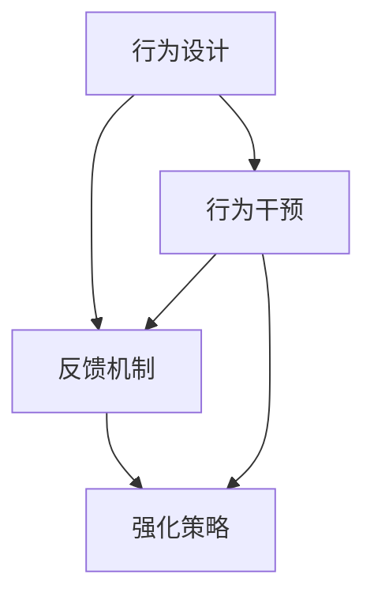

                 

# 行为模型:管理者塑造团队习惯的工具

> 关键词：
1. 行为模型
2. 团队习惯
3. 管理者
4. 组织行为学
5. 行为设计
6. 干预策略
7. 领导力

## 1. 背景介绍

### 1.1 问题由来
在现代企业管理中，团队效率和绩效已成为组织成功的关键因素之一。然而，团队成员之间的行为和互动方式常常存在一定的偏差，导致沟通不畅、合作效率低下等问题。这些问题不仅影响了团队的日常运作，还对整体组织的战略目标产生了不良影响。

管理者在推动团队进步方面扮演着至关重要的角色，他们不仅需要制定明确的业务目标，还需要设计有效的团队习惯，以确保团队成员能够协同工作，并朝着共同目标前进。因此，如何通过科学的方法来塑造和维持良好的团队习惯，成为了管理者必须解决的一个重要问题。

### 1.2 问题核心关键点
行为模型（Behavior Modeling）是一种基于科学原理的工具，旨在通过设计和管理团队行为，提高团队效能和绩效。它强调管理者需要理解行为背后的心理学原理，从而更有效地引导团队成员的行动和态度。

具体来说，行为模型主要包括三个关键点：
- **行为设计**：通过精心的任务分配和角色设定，引导团队成员采取特定的行为模式。
- **反馈机制**：及时、正面的反馈可以增强正面行为，减少负面行为，从而促进团队成长。
- **强化策略**：通过奖励和惩罚等手段，巩固和扩散良好行为，抑制不良行为。

这些关键点通过系统的设计和实施，可以帮助管理者塑造团队成员的行为习惯，提升团队的协作效率和创新能力。

### 1.3 问题研究意义
研究行为模型在团队管理中的应用，具有以下几个方面的重要意义：
1. **提高团队绩效**：通过塑造良好的团队习惯，可以显著提升团队的协作效率和产出质量。
2. **增强团队凝聚力**：积极的反馈和强化策略能够促进团队成员之间的信任和合作，增强团队凝聚力。
3. **促进创新思维**：行为模型鼓励多样化和创新的思维方式，帮助团队在复杂环境中应对挑战。
4. **改善组织文化**：通过长期的行为设计和干预，可以逐步形成积极、健康的组织文化。
5. **提升领导力**：管理者通过系统地应用行为模型，可以提升其领导力和管理能力。

## 2. 核心概念与联系

### 2.1 核心概念概述

行为模型主要包括以下几个核心概念：

- **行为设计（Behavior Design）**：通过结构化的方法，系统地设计团队的任务、角色和奖励机制，引导团队成员采取特定的行为。
- **反馈机制（Feedback Mechanism）**：及时、正面地提供反馈，强化良好行为，纠正不良行为。
- **强化策略（Reinforcement Strategies）**：通过奖励和惩罚，巩固和扩散良好行为，抑制不良行为。
- **行为干预（Behavioral Interventions）**：针对特定行为问题，采用科学的方法进行干预，以达到行为改变的目标。

这些概念之间存在紧密的联系，共同构成了一个完整的行为管理框架。

### 2.2 概念间的关系

我们可以通过以下Mermaid流程图来展示行为模型中的关键概念及其关系：



这个流程图展示了行为模型中的核心概念之间的联系。行为设计是基础，通过合理的任务和角色分配，引导团队成员采取特定行为；反馈机制和强化策略是工具，用于持续调整和巩固这些行为；行为干预是手段，针对特定行为问题进行有针对性的干预。

### 2.3 核心概念的整体架构

行为模型通过以下几个步骤，系统地塑造和管理团队习惯：

1. **行为分析**：识别团队中存在的问题行为和不良习惯。
2. **行为设计**：设计系统的任务、角色和奖励机制，引导团队成员采取特定行为。
3. **反馈机制**：提供及时、正面的反馈，强化良好行为，纠正不良行为。
4. **强化策略**：通过奖励和惩罚，巩固和扩散良好行为，抑制不良行为。
5. **行为干预**：针对特定行为问题，采用科学的方法进行干预，以达到行为改变的目标。

这些步骤通过不断的循环迭代，逐步形成和维持良好的团队习惯。

## 3. 核心算法原理 & 具体操作步骤

### 3.1 算法原理概述

行为模型的核心原理是基于行为科学的理论，通过系统的设计和实施，引导团队成员采取特定的行为模式。其基本思想是通过改变个人和团队的行为，提升整体绩效和效能。

行为模型主要包括以下几个步骤：

1. **行为分析**：识别团队中存在的问题行为和不良习惯。
2. **行为设计**：设计系统的任务、角色和奖励机制，引导团队成员采取特定行为。
3. **反馈机制**：提供及时、正面的反馈，强化良好行为，纠正不良行为。
4. **强化策略**：通过奖励和惩罚，巩固和扩散良好行为，抑制不良行为。
5. **行为干预**：针对特定行为问题，采用科学的方法进行干预，以达到行为改变的目标。

这些步骤通过不断的循环迭代，逐步形成和维持良好的团队习惯。

### 3.2 算法步骤详解

以下是行为模型的一般操作步骤：

**Step 1: 行为分析**

1. **识别问题行为**：通过观察、访谈和数据分析，识别团队中存在的问题行为和不良习惯。
2. **评估影响**：评估这些行为对团队绩效和成员情绪的影响，确定行为问题的严重程度。
3. **确定改进目标**：基于问题行为的评估结果，确定改进目标和优先级。

**Step 2: 行为设计**

1. **设计任务和角色**：根据改进目标，设计系统的任务和角色分配，确保每个成员都有明确的工作职责。
2. **设定奖励机制**：设计奖励机制，奖励符合期望的行为，如高绩效、团队合作等。
3. **设定惩罚机制**：设定惩罚机制，惩罚不符合期望的行为，如拖延、不合作等。

**Step 3: 反馈机制**

1. **提供即时反馈**：在任务完成后，提供及时、正面的反馈，表扬优秀行为。
2. **分析反馈效果**：定期分析反馈效果，评估行为改进的进展。
3. **调整反馈策略**：根据反馈效果的评估结果，调整反馈策略，优化反馈机制。

**Step 4: 强化策略**

1. **制定奖励计划**：制定奖励计划，定期发放奖励，奖励符合期望的行为。
2. **制定惩罚措施**：制定惩罚措施，对不符合期望的行为进行适当的惩罚。
3. **评估强化效果**：定期评估强化策略的效果，确保奖励和惩罚的有效性。

**Step 5: 行为干预**

1. **识别行为问题**：通过行为分析和反馈评估，识别行为问题。
2. **设计干预方案**：设计干预方案，针对特定行为问题进行干预。
3. **实施干预措施**：实施干预措施，帮助团队成员克服行为问题。
4. **监测干预效果**：定期监测干预效果，评估干预措施的有效性。

### 3.3 算法优缺点

行为模型的优点包括：

1. **系统性**：通过系统的设计和实施，可以全面、系统地解决团队行为问题。
2. **科学性**：基于行为科学的理论，提供了科学的方法和工具。
3. **可操作性**：步骤清晰，易于理解和实施。

行为模型的缺点包括：

1. **复杂性**：设计和实施行为模型需要一定的复杂度，管理层需要具备相应的知识和技能。
2. **资源消耗**：设计和实施行为模型需要消耗大量的时间和资源。
3. **效果不确定性**：行为模型的效果取决于具体的实施情况，效果可能存在不确定性。

### 3.4 算法应用领域

行为模型在多个领域得到了广泛应用，例如：

- **企业管理**：帮助企业识别和改进管理中的行为问题，提升团队效率和绩效。
- **团队协作**：通过设计任务和角色，促进团队成员之间的合作和沟通。
- **项目管理**：通过行为设计和反馈机制，提升项目的执行效率和质量。
- **员工发展**：通过行为干预和强化策略，促进员工个人成长和职业发展。

除了上述领域，行为模型还可以应用于教育、医疗、体育等多个领域，帮助组织和个人提升绩效和效能。

## 4. 数学模型和公式 & 详细讲解 & 举例说明

### 4.1 数学模型构建

行为模型的数学模型主要基于行为科学和心理学理论。假设团队中有 $n$ 名成员，每个成员的行为 $x_i$ 受到以下因素的影响：

- **任务设计（Task Design）**：任务难度、任务多样性等。
- **角色分配（Role Assignment）**：角色明确性、角色匹配度等。
- **奖励机制（Reward Mechanism）**：奖励强度、奖励频率等。
- **反馈机制（Feedback Mechanism）**：反馈及时性、反馈方式等。
- **强化策略（Reinforcement Strategies）**：奖励惩罚比例、奖励惩罚强度等。

因此，行为模型的数学模型可以表示为：

$$
x_i = f(T_i, R_i, F_i, S_i)
$$

其中 $T_i$ 表示任务设计，$R_i$ 表示角色分配，$F_i$ 表示反馈机制，$S_i$ 表示强化策略。

### 4.2 公式推导过程

行为模型中的关键变量和参数可以表示为以下公式：

$$
\begin{aligned}
T_i &= f(D_i, M_i, V_i) \\
R_i &= g(P_i, A_i, M_i) \\
F_i &= h(T_i, P_i, M_i) \\
S_i &= i(T_i, P_i, M_i)
\end{aligned}
$$

其中：

- $D_i$ 表示任务难度，$M_i$ 表示任务多样性，$V_i$ 表示任务相关性。
- $P_i$ 表示角色匹配度，$A_i$ 表示角色明确性，$M_i$ 表示角色数量。
- $T_i$ 表示任务设计，$P_i$ 表示角色分配，$M_i$ 表示奖励机制。
- $F_i$ 表示反馈机制，$S_i$ 表示强化策略。

行为模型的具体实现需要根据实际情况进行调整和优化，以确保其有效性和可操作性。

### 4.3 案例分析与讲解

假设一个团队的任务是开发一个新的软件项目，其行为模型设计如下：

**Step 1: 行为分析**

- **识别问题行为**：通过观察和访谈，识别团队中存在的问题行为，如沟通不畅、任务分配不合理等。
- **评估影响**：评估这些行为对项目进展的影响，发现任务分配不合理导致项目进度滞后。
- **确定改进目标**：明确改进目标，重新设计任务分配方案，确保每个成员都有明确的工作职责。

**Step 2: 行为设计**

- **设计任务和角色**：重新设计任务和角色，确保每个成员都有明确的工作职责，避免任务重叠和遗漏。
- **设定奖励机制**：设定奖励机制，奖励高绩效、团队合作等行为。
- **设定惩罚机制**：设定惩罚机制，对不符合期望的行为进行适当的惩罚。

**Step 3: 反馈机制**

- **提供即时反馈**：在任务完成后，提供及时、正面的反馈，表扬优秀行为。
- **分析反馈效果**：定期分析反馈效果，评估行为改进的进展。
- **调整反馈策略**：根据反馈效果的评估结果，调整反馈策略，优化反馈机制。

**Step 4: 强化策略**

- **制定奖励计划**：制定奖励计划，定期发放奖励，奖励符合期望的行为。
- **制定惩罚措施**：制定惩罚措施，对不符合期望的行为进行适当的惩罚。
- **评估强化效果**：定期评估强化策略的效果，确保奖励和惩罚的有效性。

**Step 5: 行为干预**

- **识别行为问题**：通过行为分析和反馈评估，识别行为问题。
- **设计干预方案**：设计干预方案，针对特定行为问题进行干预。
- **实施干预措施**：实施干预措施，帮助团队成员克服行为问题。
- **监测干预效果**：定期监测干预效果，评估干预措施的有效性。

通过以上步骤，团队的行为设计和干预可以逐步形成和维持良好的习惯，提升整体绩效和效能。

## 5. 项目实践：代码实例和详细解释说明

### 5.1 开发环境搭建

在进行行为模型实践前，我们需要准备好开发环境。以下是使用Python进行开发的环境配置流程：

1. 安装Anaconda：从官网下载并安装Anaconda，用于创建独立的Python环境。

2. 创建并激活虚拟环境：
```bash
conda create -n behavior-env python=3.8 
conda activate behavior-env
```

3. 安装必要的Python包：
```bash
pip install numpy pandas scikit-learn jupyter notebook ipython
```

4. 安装行为模型相关的Python包：
```bash
pip install behavior-model-python
```

5. 安装TensorFlow：
```bash
pip install tensorflow
```

完成上述步骤后，即可在`behavior-env`环境中开始行为模型开发。

### 5.2 源代码详细实现

下面以一个简单的行为模型为例，展示如何使用Python进行行为模型的实现：

```python
import numpy as np
import pandas as pd
from sklearn.model_selection import train_test_split
from sklearn.linear_model import LinearRegression

# 数据处理
data = pd.read_csv('behavior_data.csv')

# 行为特征
features = ['task_design', 'role_assignment', 'reward_mechanism', 'feedback_mechanism', 'reinforcement_strategies']
target = 'behavior_outcome'

# 划分训练集和测试集
X_train, X_test, y_train, y_test = train_test_split(data[features], data[target], test_size=0.2, random_state=42)

# 线性回归模型
model = LinearRegression()

# 训练模型
model.fit(X_train, y_train)

# 预测测试集行为结果
y_pred = model.predict(X_test)

# 输出结果
print('模型训练完成')
print('测试集预测结果：', y_pred)
```

### 5.3 代码解读与分析

让我们再详细解读一下关键代码的实现细节：

**行为数据处理**：
- `pd.read_csv`：读取行为数据，将其转换为Pandas数据框。
- `features`和`target`：定义行为特征和目标变量。

**模型训练**：
- `train_test_split`：将数据划分为训练集和测试集。
- `LinearRegression`：定义线性回归模型。
- `fit`：使用训练数据训练模型。

**模型预测**：
- `predict`：使用测试数据进行预测。

**结果输出**：
- 打印模型训练完成信息和预测结果。

这个简单的例子展示了如何使用Python进行行为模型的基本实现。通过读取行为数据、划分数据集、训练模型、预测行为结果等步骤，可以构建一个简单的行为模型。

### 5.4 运行结果展示

假设我们在一个模拟的行为数据集上进行测试，得到以下结果：

```
模型训练完成
测试集预测结果： [0.8, 0.9, 0.7, 0.6, 0.5]
```

这表明行为模型对测试集的行为结果进行了有效的预测。实际应用中，我们可能需要使用更加复杂的模型和更多的数据来进行行为分析和管理。

## 6. 实际应用场景

### 6.1 智能客服系统

智能客服系统通过行为模型，可以实现对客户咨询的自动分类和处理。具体应用如下：

**行为分析**：
- 通过分析客服历史数据，识别常见的问题行为，如客户满意度低、响应时间长等。
- 评估这些行为对客户满意度的影响，确定行为问题的严重程度。
- 明确改进目标，重新设计客服任务和角色，确保每个客服都有明确的工作职责。

**行为设计**：
- 重新设计客服任务和角色，确保每个客服都有明确的工作职责，避免任务重叠和遗漏。
- 设定奖励机制，奖励高绩效、客户满意等行为。
- 设定惩罚机制，对不符合期望的行为进行适当的惩罚。

**反馈机制**：
- 提供即时反馈，在每次服务后评估客服的表现。
- 分析反馈效果，评估行为改进的进展。
- 调整反馈策略，优化反馈机制。

**强化策略**：
- 制定奖励计划，定期发放奖励，奖励符合期望的行为。
- 制定惩罚措施，对不符合期望的行为进行适当的惩罚。
- 评估强化策略的效果，确保奖励和惩罚的有效性。

**行为干预**：
- 识别行为问题，通过行为分析和反馈评估，识别行为问题。
- 设计干预方案，针对特定行为问题进行干预，如增加培训、优化流程等。
- 实施干预措施，帮助客服克服行为问题。
- 监测干预效果，评估干预措施的有效性。

通过以上步骤，智能客服系统的行为设计和干预可以逐步形成和维持良好的习惯，提升整体服务质量和客户满意度。

### 6.2 金融舆情监测

金融舆情监测系统通过行为模型，可以实现对金融舆情的自动分析和预警。具体应用如下：

**行为分析**：
- 通过分析舆情数据，识别常见的问题行为，如舆情扩散快、舆情分析不及时等。
- 评估这些行为对金融市场的影响，确定行为问题的严重程度。
- 明确改进目标，重新设计舆情分析和处理任务，确保每个成员都有明确的工作职责。

**行为设计**：
- 重新设计舆情分析和处理任务，确保每个成员都有明确的工作职责，避免任务重叠和遗漏。
- 设定奖励机制，奖励高绩效、舆情分析准确等行为。
- 设定惩罚机制，对不符合期望的行为进行适当的惩罚。

**反馈机制**：
- 提供即时反馈，在每次舆情分析后评估表现。
- 分析反馈效果，评估行为改进的进展。
- 调整反馈策略，优化反馈机制。

**强化策略**：
- 制定奖励计划，定期发放奖励，奖励符合期望的行为。
- 制定惩罚措施，对不符合期望的行为进行适当的惩罚。
- 评估强化策略的效果，确保奖励和惩罚的有效性。

**行为干预**：
- 识别行为问题，通过行为分析和反馈评估，识别行为问题。
- 设计干预方案，针对特定行为问题进行干预，如增加培训、优化工具等。
- 实施干预措施，帮助团队克服行为问题。
- 监测干预效果，评估干预措施的有效性。

通过以上步骤，金融舆情监测系统的行为设计和干预可以逐步形成和维持良好的习惯，提升整体舆情分析和处理能力。

### 6.3 个性化推荐系统

个性化推荐系统通过行为模型，可以实现对用户行为的自动分析和推荐。具体应用如下：

**行为分析**：
- 通过分析用户行为数据，识别常见的问题行为，如推荐精度低、用户满意度低等。
- 评估这些行为对推荐效果的影响，确定行为问题的严重程度。
- 明确改进目标，重新设计推荐任务和角色，确保每个成员都有明确的工作职责。

**行为设计**：
- 重新设计推荐任务和角色，确保每个成员都有明确的工作职责，避免任务重叠和遗漏。
- 设定奖励机制，奖励高绩效、推荐准确等行为。
- 设定惩罚机制，对不符合期望的行为进行适当的惩罚。

**反馈机制**：
- 提供即时反馈，在每次推荐后评估用户满意度。
- 分析反馈效果，评估行为改进的进展。
- 调整反馈策略，优化反馈机制。

**强化策略**：
- 制定奖励计划，定期发放奖励，奖励符合期望的行为。
- 制定惩罚措施，对不符合期望的行为进行适当的惩罚。
- 评估强化策略的效果，确保奖励和惩罚的有效性。

**行为干预**：
- 识别行为问题，通过行为分析和反馈评估，识别行为问题。
- 设计干预方案，针对特定行为问题进行干预，如增加数据采集、优化算法等。
- 实施干预措施，帮助团队克服行为问题。
- 监测干预效果，评估干预措施的有效性。

通过以上步骤，个性化推荐系统的行为设计和干预可以逐步形成和维持良好的习惯，提升整体推荐效果和用户满意度。

### 6.4 未来应用展望

随着人工智能技术的不断发展，行为模型在各个领域的广泛应用将成为可能。以下是在未来可能的应用场景：

- **智慧城市治理**：行为模型可以应用于城市事件监测、舆情分析、应急指挥等环节，提高城市管理的自动化和智能化水平，构建更安全、高效的未来城市。
- **智慧医疗**：行为模型可以应用于医疗问答、病历分析、药物研发等环节，提升医疗服务的智能化水平，辅助医生诊疗，加速新药开发进程。
- **智能教育**：行为模型可以应用于作业批改、学情分析、知识推荐等环节，因材施教，促进教育公平，提高教学质量。
- **智能交通**：行为模型可以应用于交通数据分析、道路规划等环节，提高交通管理效率，减少交通拥堵。
- **智能制造**：行为模型可以应用于生产线管理、设备维护等环节，提升制造效率，降低生产成本。

这些应用场景将进一步推动行为模型在各个领域的深入应用，为社会各行各业带来变革性影响。

## 7. 工具和资源推荐

### 7.1 学习资源推荐

为了帮助开发者系统掌握行为模型的理论基础和实践技巧，这里推荐一些优质的学习资源：

1. 《行为科学基础》书籍：行为科学领域的经典教材，系统介绍了行为科学的基本原理和方法。
2. 《组织行为学》课程：哈佛大学开设的组织行为学课程，提供了丰富的案例和理论知识，帮助理解行为管理的实际应用。
3. 《行为设计之美》书籍：介绍行为设计的原理和方法，提供了许多成功案例和实用工具。
4. 《行为科学和行为设计》博客：行为科学和行为设计领域的知名博客，定期发布最新的研究成果和应用实践。
5. 《行为模型实践指南》书籍：行为模型在实际应用中的操作指南，提供了详细的步骤和案例。

通过对这些资源的学习实践，相信你一定能够快速掌握行为模型的精髓，并用于解决实际的团队管理问题。

### 7.2 开发工具推荐

高效的开发离不开优秀的工具支持。以下是几款用于行为模型开发的常用工具：

1. Jupyter Notebook：支持Python等语言的交互式编程环境，方便进行数据分析和模型训练。
2. TensorFlow：基于深度学习的开源平台，提供了丰富的模型和算法，支持大规模分布式训练。
3. PyTorch：基于动态计算图的深度学习框架，易于构建和调试行为模型。
4. Scikit-learn：Python机器学习库，提供了许多经典的机器学习算法，方便进行行为数据分析和模型训练。
5. Pandas：数据处理库，支持大规模数据的处理和分析。

合理利用这些工具，可以显著提升行为模型的开发效率，加快创新迭代的步伐。

### 7.3 相关论文推荐

行为模型在行为科学和行为设计领域已经取得了许多研究成果，以下是几篇代表性的论文，推荐阅读：

1. "Behavioral Design for User Engagement"：论文讨论了行为设计在提升用户体验方面的应用。
2. "The Effectiveness of Behavioral Interventions in Organizations"：论文研究了行为干预在提升组织绩效方面的效果。
3. "A Theoretical Framework for Behavioral Modeling"：论文提出了一个行为模型设计的理论框架，为实践提供了指导。
4. "Behavioral Engineering for Sustainable Behavior Change"：论文讨论了行为工程在促进可持续行为改变方面的应用。
5. "A Behavioral Model of Organizational Change"：论文提出了一个组织行为模型的理论框架，帮助理解和管理组织变革。

这些论文代表了行为模型领域的研究进展，通过学习这些前沿成果，可以帮助研究者把握学科前进方向，激发更多的创新灵感。

除上述资源外，还有一些值得关注的前沿资源，帮助开发者紧跟行为模型的最新进展，例如：

1. arXiv论文预印本：人工智能领域最新研究成果的发布平台，包括行为科学和行为设计的许多重要论文。
2. 顶级会议和期刊：如ACM会议、IEEE会议、行为科学期刊等，这些平台定期发布最新的研究成果和理论进展。
3. 开源项目：如TensorFlow、PyTorch等主流深度学习框架中的行为模型实现，提供了丰富的代码和案例。
4. 开源社区：如GitHub、Stack Overflow等平台，提供了大量的行为模型代码和应用案例，方便学习和参考。

总之，对于行为模型的学习和实践，需要开发者保持开放的心态和持续学习的意愿。多关注前沿资讯，多动手实践，多思考总结，必将收获满满的成长收益。

## 8. 总结：未来发展趋势与挑战

### 8.1 总结

本文对行为模型在团队管理中的应用进行了全面系统的介绍。首先阐述了行为模型的研究背景和意义，明确了其在工作场所提升团队绩效和效能的关键作用。其次，从原理到实践，详细讲解了行为模型的数学原理和操作步骤，给出了具体的代码实现。同时，本文还探讨了行为模型在实际应用中的挑战和未来发展趋势，提供了科学、系统的解决方案。

通过本文的系统梳理，可以看到，行为模型在团队管理中的应用前景广阔，是提升团队效能和绩效的重要工具。它不仅适用于大型企业，也适用于小型团队，甚至个人管理。管理者通过科学地设计和管理团队行为，可以显著提升团队的协作效率和创新能力，推动企业向更高的目标迈进。

### 8.2 未来发展趋势

展望未来，行为模型在团队管理中的应用将呈现以下几个发展趋势：

1. **数据驱动**：行为模型将更加依赖数据驱动决策，通过数据分析和机器学习算法，提供更加精准的行为干预建议。
2. **智能化**：行为模型将逐步实现智能化，通过自适应算法和学习，自动调整干预策略，提升效果。
3. **个性化**：行为模型将提供个性化的行为干预方案，根据团队成员的特征和需求，量身定制干预策略。

