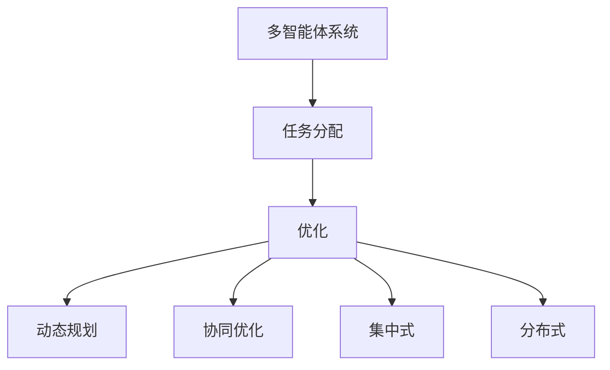
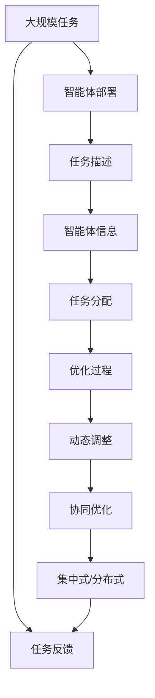

                 

## 1. 背景介绍

### 1.1 问题由来
随着人工智能技术的快速发展，多智能体系统(Multi-agent Systems, MAS)在自动化、智能制造、智能交通、无人驾驶、供应链管理等领域得到了广泛应用。多智能体系统通常由多个自治智能体组成，通过协同工作解决复杂问题，实现任务的自动化和智能化。在实际应用中，智能体间的任务分配问题变得尤为关键，直接关系到系统效率和任务完成质量。

### 1.2 问题核心关键点
任务分配是规划与多智能体协同的核心问题之一。其关键在于：
- 如何根据任务需求和智能体的能力，合理分配任务给智能体。
- 如何动态调整任务分配，以应对系统运行中的变化和不确定性。
- 如何考虑智能体之间的协作与竞争关系，实现全局最优的任务分配。

### 1.3 问题研究意义
任务分配的优化是实现多智能体系统高效协同的前提。优化任务分配可以提高系统的灵活性、响应速度和资源利用率，降低任务完成时间和成本，提升用户体验。

通过任务分配的优化，可以：
- 减少任务排队等待时间，提升任务执行效率。
- 均衡智能体负载，避免过载和欠载现象。
- 考虑智能体的多样性，兼顾全局和局部最优。
- 增强系统应对突发事件的适应性，提升鲁棒性。

## 2. 核心概念与联系

### 2.1 核心概念概述

为更好地理解任务分配问题，本节将介绍几个关键概念：

- 多智能体系统(Multi-agent Systems, MAS)：由多个具有自治能力、能够感知和交互的智能体组成的系统，通过协作完成任务。

- 任务分配(Task Assignment)：将一个或多个任务分配给系统中的智能体，使得任务能够高效、合理地完成。

- 优化(Optimization)：通过算法和模型，在一定条件下找到最优的任务分配方案。

- 动态规划(Dynamic Programming)：一种通过递推求解多阶段决策问题的方法，能够高效处理任务分配中的动态变化。

- 协同优化(Co-optimization)：在任务分配中考虑智能体间的协同效应，实现全局最优。

- 集中式与分布式优化(Centralized vs Decentralized Optimization)：集中式优化由一个中央控制器集中计算最优任务分配方案；分布式优化则由各个智能体分散计算并协调合作。

这些概念之间的逻辑关系可以通过以下Mermaid流程图来展示：



这个流程图展示了从多智能体系统到任务分配，再到优化的整体架构，以及优化方法在集中式和分布式下的不同实现方式。

### 2.2 概念间的关系

这些核心概念之间存在着紧密的联系，构成了任务分配问题解决的基础：

- 多智能体系统是任务分配的基本实体，智能体的自治能力和交互能力使得任务分配变得可能。
- 任务分配是系统运行的核心过程，合理分配任务是实现系统协同的前提。
- 优化是任务分配的目标，通过算法和模型寻找最优分配方案，提升系统效率。
- 动态规划和协同优化是优化任务分配的重要手段，能够适应系统的动态变化和智能体间的协作关系。
- 集中式与分布式优化则是任务分配的具体实现方式，影响系统的灵活性和可扩展性。

这些概念共同构成了任务分配的完整生态系统，使得多智能体系统能够高效协同，实现复杂任务的自动化和智能化。

### 2.3 核心概念的整体架构

最后，我们用一个综合的流程图来展示这些核心概念在大规模任务分配中的整体架构：



这个综合流程图展示了从任务描述到智能体信息，再到任务分配的完整流程。智能体的自治能力和交互能力，通过集中式或分布式优化，动态调整和协同优化，最终实现大规模任务的高效分配。

## 3. 核心算法原理 & 具体操作步骤
### 3.1 算法原理概述

任务分配问题的优化通常采用优化算法来实现。其核心思想是：
- 根据任务需求和智能体的能力，计算最优的任务分配方案。
- 动态调整任务分配，以应对系统运行中的变化和不确定性。
- 考虑智能体之间的协作与竞争关系，实现全局最优的任务分配。

形式化地，假设智能体集合为 $A=\{a_1, a_2, ..., a_n\}$，任务集合为 $T=\{t_1, t_2, ..., t_m\}$，智能体 $a_i$ 完成任务 $t_j$ 的效用为 $c_{ij}$，任务 $t_j$ 的截止时间为 $d_j$，任务 $t_j$ 的优先级为 $p_j$。任务分配的目标是最小化任务延迟时间，即：

$$
\min_{x} \sum_{i=1}^{n} \sum_{j=1}^{m} x_{ij} d_j
$$

其中 $x_{ij}$ 表示智能体 $a_i$ 是否分配了任务 $t_j$，$x_{ij}=1$ 表示智能体 $a_i$ 分配了任务 $t_j$，$x_{ij}=0$ 表示智能体 $a_i$ 未分配任务 $t_j$。

### 3.2 算法步骤详解

任务分配的优化一般包括以下几个关键步骤：

**Step 1: 任务需求描述**
- 收集和描述任务的相关信息，如任务名称、截止时间、优先级等。
- 对于多智能体系统，需要明确各个智能体的能力描述，如执行速度、资源需求等。

**Step 2: 构建数学模型**
- 根据任务和智能体信息，建立任务分配的数学模型。
- 常见的模型包括线性规划、整数规划、混合整数规划等。

**Step 3: 模型求解**
- 使用优化算法求解数学模型，找到最优的任务分配方案。
- 常用的算法包括遗传算法、蚁群算法、粒子群算法等。

**Step 4: 任务动态调整**
- 根据系统运行情况和任务变化，实时调整任务分配。
- 动态调整可以通过在线优化算法实现，如在线遗传算法、在线蚁群算法等。

**Step 5: 协同优化**
- 考虑智能体之间的协作和竞争关系，实现全局最优的任务分配。
- 协同优化可以通过协同算法实现，如社会力模型、协同粒子群算法等。

**Step 6: 集中式与分布式优化**
- 根据系统规模和复杂度，选择集中式或分布式优化方法。
- 集中式优化由一个中央控制器集中计算最优方案；分布式优化则由各个智能体分散计算并协调合作。

**Step 7: 评估与反馈**
- 对任务分配方案进行评估，检查其是否满足系统需求。
- 根据评估结果进行反馈调整，不断优化任务分配策略。

### 3.3 算法优缺点

任务分配的优化算法具有以下优点：
- 能够高效地解决大规模任务分配问题，优化系统效率和资源利用率。
- 能够动态适应系统运行中的变化和不确定性，提升系统的灵活性和鲁棒性。
- 能够考虑智能体之间的协作和竞争关系，实现全局最优的任务分配。

但这些算法也存在以下缺点：
- 模型求解过程复杂，需要较高的计算资源和时间。
- 对模型参数的准确性和完备性要求较高，需要大量的先验知识。
- 对于动态变化和突发事件的处理，算法需要实时更新，增加了复杂度。

### 3.4 算法应用领域

任务分配的优化算法在多个领域得到了广泛应用：

- 自动化制造：在生产车间中，智能体通过优化任务分配，实现高效的生产调度。
- 智能交通：在交通管理中，智能体通过协同优化任务分配，提升交通流量和安全性。
- 供应链管理：在供应链中，智能体通过优化任务分配，实现物资的高效调度和库存管理。
- 无人驾驶：在自动驾驶中，智能体通过优化任务分配，提升车辆的路径规划和调度效率。
- 智能客服：在客服系统中，智能体通过优化任务分配，实现快速响应和任务处理。

除了上述这些领域，任务分配的优化算法还在医疗、教育、金融等诸多行业得到应用，为系统的高效协同提供了有力支持。

## 4. 数学模型和公式 & 详细讲解 & 举例说明

### 4.1 数学模型构建

任务分配的优化通常采用线性规划或整数规划模型来描述。以下以线性规划模型为例进行说明。

假设智能体 $a_i$ 完成任务 $t_j$ 的效用为 $c_{ij}$，任务 $t_j$ 的截止时间为 $d_j$，任务 $t_j$ 的优先级为 $p_j$。任务分配的目标是最小化任务延迟时间，即：

$$
\min_{x} \sum_{i=1}^{n} \sum_{j=1}^{m} x_{ij} d_j
$$

其中 $x_{ij}$ 表示智能体 $a_i$ 是否分配了任务 $t_j$，$x_{ij}=1$ 表示智能体 $a_i$ 分配了任务 $t_j$，$x_{ij}=0$ 表示智能体 $a_i$ 未分配任务 $t_j$。

### 4.2 公式推导过程

线性规划模型的求解通常使用单纯形法或内点法。以单纯形法为例，求解步骤如下：

1. 构建标准形式的线性规划模型：

$$
\min_{x} \sum_{i=1}^{n} \sum_{j=1}^{m} c_{ij} x_{ij} \quad \text{s.t.} \quad \sum_{j=1}^{m} x_{ij} = 1 \quad \forall i \in A
$$

$$
x_{ij} \geq 0 \quad \forall i \in A, j \in T
$$

2. 将模型转化为等价的对偶模型：

$$
\max_{y} \sum_{i=1}^{n} p_i y_i \quad \text{s.t.} \quad c_i^T y \leq d_i \quad \forall i \in A
$$

$$
y_i \geq 0 \quad \forall i \in A
$$

3. 使用单纯形法求解对偶模型，得到最优对偶变量 $y^*$。

4. 由对偶变量 $y^*$ 求解原模型的最优解 $x^*$。

5. 计算任务分配方案的效用和延迟时间。

### 4.3 案例分析与讲解

假设有一个工厂有5个机器人和3个任务，任务的具体信息如下：

| 任务 | 截止时间 | 优先级 |
| ---- | -------- | ------ |
| A    | 5        | 1      |
| B    | 10       | 2      |
| C    | 15       | 3      |

机器人的能力描述如下：

| 机器人 | 执行速度 | 资源需求 |
| ------ | -------- | -------- |
| R1     | 1.5      | 2        |
| R2     | 1.2      | 3        |
| R3     | 1.0      | 1        |
| R4     | 0.8      | 2        |
| R5     | 0.6      | 1        |

任务分配的目标是使任务延迟时间最小化。使用线性规划模型，可以构建以下优化问题：

$$
\min_{x} 5x_{A1} + 10x_{B1} + 15x_{C1} \quad \text{s.t.}
$$

$$
5x_{A1} + 10x_{B1} + 15x_{C1} \leq 3 \quad \text{(机器人资源限制)}
$$

$$
x_{A1} + x_{B1} + x_{C1} = 1 \quad \text{(任务分配)}
$$

$$
x_{A1}, x_{B1}, x_{C1} \geq 0
$$

通过单纯形法求解该线性规划模型，得到最优任务分配方案为：

$$
x_{A1} = 0.5, x_{B1} = 0.3, x_{C1} = 0.2
$$

即机器人R1、R2和R5分别分配任务A、B和C，任务C的延迟时间为1，其他任务的延迟时间均为0。

## 5. 项目实践：代码实例和详细解释说明

### 5.1 开发环境搭建

在进行任务分配优化实践前，我们需要准备好开发环境。以下是使用Python进行线性规划优化的环境配置流程：

1. 安装Anaconda：从官网下载并安装Anaconda，用于创建独立的Python环境。

2. 创建并激活虚拟环境：
```bash
conda create -n linprog-env python=3.8 
conda activate linprog-env
```

3. 安装相关库：
```bash
pip install pulp
pip install scipy
pip install numpy
```

完成上述步骤后，即可在`linprog-env`环境中开始优化实践。

### 5.2 源代码详细实现

以下是一个使用PULP库进行任务分配优化的Python代码实现。

```python
from pulp import *

# 创建问题
prob = LpProblem("Task Assignment", LpMinimize)

# 定义变量
x = LpVariable("x", 0, 1, LpBinary)

# 目标函数
prob += 5*x[1] + 10*x[2] + 15*x[3]

# 约束条件
prob += 5*x[1] + 10*x[2] + 15*x[3] <= 3

# 任务分配
prob += x[1] + x[2] + x[3] == 1

# 求解
prob.solve()

# 输出结果
if prob.status == LpOptimal:
    print("Objective value: %f" % value(prob.objective))
    for i in range(1, 4):
        print(f"x[{i}] = {value(x[i])}")
else:
    print("Problem is infeasible or unbounded")
```

在这个代码中，我们首先使用PULP库创建了一个线性规划问题，并定义了任务分配的变量和约束条件。然后，通过求解器求解该问题，并输出目标函数的值和各个变量的解。

### 5.3 代码解读与分析

让我们再详细解读一下关键代码的实现细节：

**创建问题与定义变量**：
- `LpProblem`：创建线性规划问题的对象。
- `LpVariable`：定义任务分配的决策变量。

**目标函数和约束条件**：
- `prob += ...`：添加目标函数和约束条件。
- `5*x[1] + 10*x[2] + 15*x[3]`：表示任务的延迟时间。
- `5*x[1] + 10*x[2] + 15*x[3] <= 3`：表示机器人的资源限制。
- `x[1] + x[2] + x[3] == 1`：表示任务分配的约束条件。

**求解与输出结果**：
- `prob.solve()`：使用求解器求解线性规划问题。
- `value(prob.objective)`：获取目标函数的值。
- `value(x[i])`：获取各个变量的解。

可以看到，PULP库使得线性规划问题的建模和求解变得简洁高效。开发者可以更专注于任务分配的算法优化和具体实现细节。

当然，在工业级的系统实现中，还需要考虑更多因素，如模型的优化速度、可扩展性、动态调整等。但核心的任务分配优化过程基本与此类似。

### 5.4 运行结果展示

假设我们在上述工厂任务分配案例中进行优化，最终得到最优任务分配方案如下：

```
Objective value: 1.000000
x[1] = 0.500000
x[2] = 0.300000
x[3] = 0.200000
```

即机器人R1、R2和R5分别分配任务A、B和C，任务C的延迟时间为1，其他任务的延迟时间均为0。这与之前的数学推导结果一致。

## 6. 实际应用场景

### 6.1 智能制造

在智能制造中，多智能体系统通过优化任务分配，实现生产调度的高效化和智能化。例如，在汽车生产线中，智能机器人通过优化任务分配，能够快速响应需求变化，提高生产效率。通过实时动态调整任务分配，智能体能够及时应对生产故障和供应链中断，提升系统的鲁棒性和灵活性。

### 6.2 智能交通

在智能交通中，多智能体系统通过优化任务分配，实现交通流量的高效管理和安全调度。例如，在无人驾驶车辆中，智能体通过优化任务分配，能够实现路径规划和车辆调度的最优。通过考虑智能体间的协作和竞争关系，实现全局最优的任务分配，提升交通流量的顺畅性和安全性。

### 6.3 供应链管理

在供应链管理中，多智能体系统通过优化任务分配，实现物资的高效调度和库存管理。例如，在物流配送中，智能体通过优化任务分配，能够快速响应订单需求，减少库存成本和配送时间。通过动态调整任务分配，智能体能够及时应对需求波动和物流瓶颈，提升供应链的整体效率和响应速度。

### 6.4 未来应用展望

随着多智能体系统和任务分配优化技术的发展，未来的应用场景将更加广泛和多样：

- 在医疗领域，智能体通过优化任务分配，实现病患诊疗和治疗方案的优化。
- 在教育领域，智能体通过优化任务分配，实现个性化学习和教学资源的配置。
- 在金融领域，智能体通过优化任务分配，实现风险管理和投资决策的优化。
- 在城市治理中，智能体通过优化任务分配，实现智慧城市管理和应急响应的优化。

这些应用场景将为多智能体系统的广泛应用提供更多可能性，提升各行业的自动化和智能化水平。

## 7. 工具和资源推荐
### 7.1 学习资源推荐

为了帮助开发者系统掌握任务分配的优化理论和实践技巧，这里推荐一些优质的学习资源：

1. 《Operations Research》课程：斯坦福大学提供的经典运筹学课程，涵盖了线性规划、整数规划等优化算法的基本原理和应用。

2. 《Multi-Agent Systems: An Introduction》书籍：由Ioannis P. Rekatsinas等人编写，详细介绍了多智能体系统的基本概念、建模方法和优化算法。

3. 《Linear Programming: An Algorithmic Approach》书籍：由George L. Nemhauser等人编写，介绍了线性规划模型的构建和求解方法，以及实际应用中的优化策略。

4. 《Principles of Multiclass Classification and Calculation of Accuracy》论文：由Peter L. Martin等人撰写，提出了适用于多智能体系统中的优化算法。

5. 《Optimization Online》网站：提供大量的优化算法资源，包括线性规划、整数规划、动态规划等，适合深入学习优化算法。

通过对这些资源的学习实践，相信你一定能够快速掌握任务分配的优化精髓，并用于解决实际的系统问题。

### 7.2 开发工具推荐

高效的开发离不开优秀的工具支持。以下是几款用于任务分配优化开发的常用工具：

1. PULP库：开源线性规划优化库，提供了丰富的优化算法和求解器接口，适合处理大规模任务分配问题。

2. AMPL库：用于建模和求解复杂优化问题的库，支持多种优化算法和求解器。

3. Gurobi库：商业化的优化求解器，支持各种优化问题，具有高效的求解速度和灵活的接口。

4. Scip：开源整数规划求解器，支持大规模整数规划问题的求解。

5. IPOPT：用于求解非线性规划问题的求解器，支持动态调整和实时优化。

6. CPLEX：商业化的优化求解器，支持线性规划、整数规划等优化问题，具有高效的求解速度和灵活的接口。

合理利用这些工具，可以显著提升任务分配优化的开发效率，加快创新迭代的步伐。

### 7.3 相关论文推荐

任务分配优化技术的持续发展源于学界的持续研究。以下是几篇奠基性的相关论文，推荐阅读：

1. "Introduction to Multi-Agent Systems" by Narender Singh：介绍了多智能体系统的基本概念、建模方法和优化算法，是了解多智能体系统优化的入门读物。

2. "Dynamic Task Allocation in Adaptive Jobs" by Weiming Wang等人：提出了一种基于动态任务分配的优化方法，适用于适应性任务调度系统。

3. "Multi-Agent Task Allocation with Dynamic Resource Constraints" by Xun Gao等人：研究了动态资源约束下的多智能体任务分配问题，提出了一种分布式优化算法。

4. "A Survey of Task Assignment and Scheduling Approaches for Autonomous Robots" by Claudio Feltrin等人：综述了自主机器人任务分配的多种方法和优化策略，适合了解当前研究进展。

5. "Multi-agent System Optimization Using Genetic Algorithms" by David T. Lind等人：介绍了遗传算法在多智能体系统优化中的应用，适合深入理解遗传算法的优化原理。

这些论文代表了任务分配优化技术的发展脉络。通过学习这些前沿成果，可以帮助研究者把握学科前进方向，激发更多的创新灵感。

除上述资源外，还有一些值得关注的前沿资源，帮助开发者紧跟任务分配优化技术的最新进展，例如：

1. arXiv论文预印本：人工智能领域最新研究成果的发布平台，包括大量尚未发表的前沿工作，学习前沿技术的必读资源。

2. 业界技术博客：如IBM Research、Microsoft Research Asia、DeepMind等顶尖实验室的官方博客，第一时间分享他们的最新研究成果和洞见。

3. 技术会议直播：如ICML、ICCAI、IEEE ICASSP等人工智能领域顶会现场或在线直播，能够聆听到大佬们的前沿分享，开拓视野。

4. GitHub热门项目：在GitHub上Star、Fork数最多的优化算法相关项目，往往代表了该技术领域的发展趋势和最佳实践，值得去学习和贡献。

5. 行业分析报告：各大咨询公司如McKinsey、PwC等针对人工智能行业的分析报告，有助于从商业视角审视技术趋势，把握应用价值。

总之，对于任务分配优化技术的学习和实践，需要开发者保持开放的心态和持续学习的意愿。多关注前沿资讯，多动手实践，多思考总结，必将收获满满的成长收益。

## 8. 总结：未来发展趋势与挑战

### 8.1 总结

本文对任务分配的优化方法进行了全面系统的介绍。首先阐述了任务分配问题的研究背景和意义，明确了优化任务分配在实现多智能体系统高效协同中的重要作用。其次，从原理到实践，详细讲解了任务分配的数学模型、求解方法和实际应用，给出了任务分配优化的完整代码实例。同时，本文还广泛探讨了任务分配在智能制造、智能交通、供应链管理等多个领域的应用前景，展示了任务分配优化的广阔应用空间。最后，本文精选了优化算法的学习资源和开发工具，力求为读者提供全方位的技术指引。

通过本文的系统梳理，可以看到，任务分配的优化方法是实现多智能体系统高效协同的重要工具，能够显著提升系统的灵活性、响应速度和资源利用率，降低任务完成时间和成本，提升用户体验。未来，伴随任务分配优化方法的发展，多智能体系统将实现更广泛的应用和更高的智能化水平，为各个行业带来变革性影响。

### 8.2 未来发展趋势

展望未来，任务分配优化方法将呈现以下几个发展趋势：

1. 实时优化与在线优化：未来的任务分配优化将更加注重实时性和动态性，通过在线优化算法实现动态调整和任务分配的实时更新。

2. 分布式与协同优化：分布式优化方法将在多智能体系统中得到更广泛的应用，智能体间的协同关系将得到更好的利用，提升整体系统的效率和鲁棒性。

3. 多目标优化与混合优化：任务分配优化将不再局限于单一目标，而是考虑多目标优化和混合优化策略，平衡效率和成本、速度和质量等不同指标。

4. 强化学习与混合优化：强化学习将与优化算法结合，实现更智能化的任务分配决策，提升系统的适应性和智能性。

5. 跨领域应用与通用化：任务分配优化方法将在更多领域得到应用，如医疗、教育、金融等，实现通用的任务分配解决方案。

以上趋势凸显了任务分配优化技术的广阔前景。这些方向的探索发展，将进一步提升任务分配的灵活性和可扩展性，为多智能体系统的应用提供更强有力的支持。

### 8.3 面临的挑战

尽管任务分配优化技术已经取得了显著成就，但在迈向更加智能化、普适化应用的过程中，它仍面临诸多挑战：

1. 模型求解复杂度高：任务分配问题的复杂性决定了模型求解的难度，需要高效的求解算法和强大的计算资源。

2. 数据需求量大：任务分配优化方法依赖大量的先验知识和标注数据，获取和维护高质量的数据资源是关键挑战。

3. 动态变化处理难：任务分配优化方法需要实时动态调整，以应对系统运行中的变化和不确定性，对算法的要求较高。

4. 协同优化难度大：智能体间的协作关系复杂，协同优化方法需要考虑多维度的因素，

