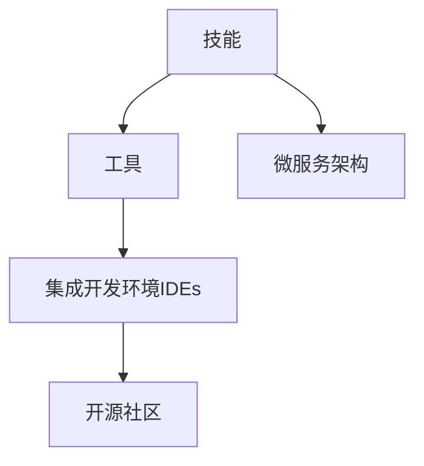
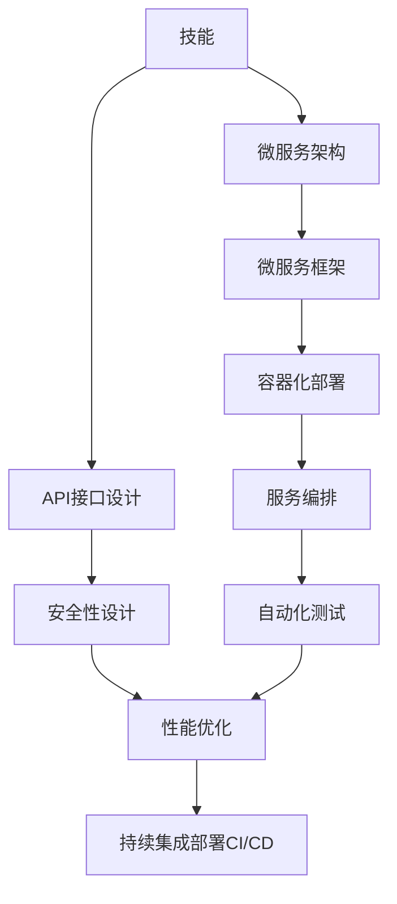
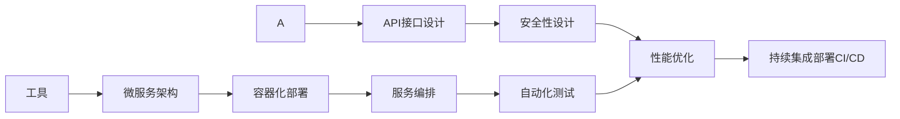

                 

# 规划技能与工具使用的结合

## 1. 背景介绍

### 1.1 问题由来

在当前快速发展的技术环境中，技能与工具的结合显得愈发重要。无论是软件开发、数据科学还是人工智能，技术人员都需要不断学习和掌握新技能，同时有效利用各种工具来提升工作效率和产出质量。然而，技能与工具的结合并不是一件容易的事情，需要理解其本质和原理，才能真正实现技术与实践的融合。

### 1.2 问题核心关键点

这个问题的核心关键点在于技能与工具的有机结合。技能是工具发挥作用的基础，而工具则是技能得以高效执行的保障。只有当技能与工具协同工作，才能最大化其价值，实现高效、可靠、创新性的产出。

### 1.3 问题研究意义

研究技能与工具的结合，对于提升技术人员的技术能力、工作效率和项目成果具有重要意义：

1. **技能提升**：通过工具的学习和应用，可以更深入地理解和掌握相关技能。
2. **效率提升**：工具的自动化、智能化特性，可以显著减少重复性工作，提高工作效率。
3. **质量保障**：使用专业工具可以降低人为错误，提升输出质量。
4. **创新能力**：工具的丰富功能和高性能，能够激发新思路和解决方案。
5. **成本节约**：使用先进的工具，可以缩短项目周期，减少资源投入。

## 2. 核心概念与联系

### 2.1 核心概念概述

为了更好地理解技能与工具的结合，本节将介绍几个关键概念及其相互关系：

- **技能（Skills）**：指技术人员在工作中必须掌握的知识和能力，如编程、数据分析、算法设计等。
- **工具（Tools）**：指用于辅助技能实现的技术手段和软件平台，如IDE、版本控制系统、调试工具等。
- **集成开发环境（IDEs）**：一种集成了编程语言、调试器、版本控制系统等功能的开发工具，提高开发效率。
- **开源社区**：由开发者共同维护的共享资源平台，提供丰富的工具和库，促进技能和工具的交流与分享。
- **微服务架构（Microservices）**：一种架构模式，将大型系统拆分为多个小型服务，每个服务负责独立的功能模块，提高系统的灵活性和可扩展性。

这些核心概念之间的逻辑关系可以通过以下Mermaid流程图来展示：



这个流程图展示了技能与工具之间的关系：

1. 技能是工具的基础，通过工具的辅助，技能得以更好地发挥。
2. 工具提供了集成的开发环境，帮助技能实现。
3. 开源社区提供了丰富的工具和资源，促进技能的交流和应用。
4. 微服务架构通过独立功能模块的拆分，提高了系统的灵活性和可扩展性。

### 2.2 概念间的关系

这些核心概念之间存在着紧密的联系，形成了技能与工具结合的完整生态系统。下面我们通过几个Mermaid流程图来展示这些概念之间的关系。

#### 2.2.1 技能与工具的结合


这个流程图展示了技能与工具的结合过程：

1. 技能通过工具得到提升和优化。
2. 集成开发环境和开源社区提供了丰富的工具资源，帮助技能更好地实现。

#### 2.2.2 技能与微服务架构的结合



这个流程图展示了技能与微服务架构的结合：

1. 技能通过微服务架构的拆分和设计，实现了系统的模块化和高复用性。
2. 微服务框架、容器化部署、服务编排、自动化测试、API接口设计、安全性设计和性能优化等技术手段，帮助技能更好地实现微服务架构。

#### 2.2.3 工具与微服务架构的结合



这个流程图展示了工具与微服务架构的结合：

1. 工具提供了微服务架构实现的集成环境，包括容器化部署、服务编排、自动化测试等。
2. 微服务架构的各个模块可以通过API接口设计、安全性设计和性能优化等技术手段，进一步提升功能和服务质量。

## 3. 核心算法原理 & 具体操作步骤

### 3.1 算法原理概述

技能与工具结合的原理，可以概括为以下几点：

1. **技能为本**：技能是工具发挥作用的基础，工具是为了辅助技能更好地实现。
2. **工具赋能**：通过工具的集成和优化，技能得到提升和扩展。
3. **协同发展**：技能与工具之间需要相互支持和协同发展，才能实现最优的工作效果。
4. **持续改进**：技能和工具都需要不断地学习和改进，才能跟上技术发展的步伐。

### 3.2 算法步骤详解

基于技能与工具结合的原理，实现技能与工具结合的步骤可以总结如下：

**Step 1: 确定技能需求**

- 明确项目目标和需求，确定需要掌握的核心技能。

**Step 2: 选择合适的工具**

- 根据技能需求选择合适的工具，如IDE、版本控制系统、调试工具等。

**Step 3: 学习工具使用方法**

- 通过在线教程、官方文档、视频教程等途径，学习工具的基本使用方法和功能。

**Step 4: 实践工具应用**

- 在实际项目中应用工具，熟悉其工作流程和操作步骤。

**Step 5: 技能与工具的结合**

- 将工具应用到技能实现过程中，提高工作效率和质量。

**Step 6: 持续改进和优化**

- 通过项目实践不断总结经验和教训，优化技能和工具的使用。

### 3.3 算法优缺点

技能与工具结合的优点包括：

1. **提升效率**：工具的自动化和智能化特性，减少了重复性工作，提高了工作效率。
2. **降低错误率**：工具提供了检查和验证机制，减少了人为错误。
3. **增强灵活性**：工具提供了丰富的功能模块和插件，提升了系统的灵活性和可扩展性。
4. **促进学习**：通过工具的应用，可以深入理解相关技能，提升技术水平。

然而，这种结合也存在一些缺点：

1. **学习成本**：掌握新工具需要时间和精力，尤其是对于复杂和功能丰富的工具。
2. **适应周期长**：工具与技能的结合需要一定的磨合期，难以快速见效。
3. **工具依赖**：过度依赖工具可能会降低自主解决问题的能力。
4. **工具更新快**：工具的功能和特性更新频繁，需要持续学习和跟进。

### 3.4 算法应用领域

技能与工具结合的范式在多个领域得到了广泛应用，包括但不限于：

1. **软件开发**：通过IDE、版本控制系统、调试工具等，提高开发效率和代码质量。
2. **数据科学**：使用数据可视化工具、统计分析工具、机器学习框架等，提升数据处理和建模能力。
3. **人工智能**：结合深度学习框架、自动化测试工具、持续集成平台等，加速AI模型的训练和部署。
4. **系统运维**：使用监控工具、自动化部署工具、日志分析工具等，提高系统运维的效率和质量。
5. **项目管理**：通过项目管理工具、协作平台、文档管理系统等，优化项目管理和团队协作。

## 4. 数学模型和公式 & 详细讲解 & 举例说明（备注：数学公式请使用latex格式，latex嵌入文中独立段落使用 $$，段落内使用 $)
### 4.1 数学模型构建

在技能与工具结合的过程中，可以构建一个数学模型来描述技能和工具之间的关系。设技能集为 $S$，工具集为 $T$，其结合模型为 $M(S, T)$。

模型 $M(S, T)$ 的构建可以从以下几个方面考虑：

1. **技能需求分析**：对项目需求进行分解，确定需要掌握的关键技能。
2. **工具选择和评估**：根据技能需求选择合适的工具，并进行评估。
3. **工具应用与反馈**：将工具应用到技能实现过程中，记录其效果和反馈。
4. **技能与工具的结合**：通过技能和工具的相互作用，提升工作效率和质量。
5. **持续改进与优化**：根据项目进展和反馈，持续改进技能和工具的使用。

### 4.2 公式推导过程

以下是一个简化的数学模型推导过程：

$$
M(S, T) = \max_{(s, t)} (U(s) + V(t) - C(st))
$$

其中：

- $U(s)$ 表示技能 $s$ 的效用函数。
- $V(t)$ 表示工具 $t$ 的效用函数。
- $C(st)$ 表示技能 $s$ 和工具 $t$ 结合的成本函数。

通过优化模型 $M(S, T)$，可以找到最优的技能和工具组合，实现技能与工具的结合。

### 4.3 案例分析与讲解

以软件开发为例，技能与工具结合的数学模型可以表示为：

$$
M(S_{Dev}, T_{Dev}) = \max_{(s, t)} (U(s) + V(t) - C(st))
$$

其中 $S_{Dev}$ 表示开发技能集，$T_{Dev}$ 表示开发工具集。

设 $s$ 为代码编写技能，$t$ 为IDE工具，其效用函数和成本函数分别为：

$$
U(s) = 1000 - s^2
$$
$$
V(t) = 2000 - t^2
$$
$$
C(st) = 1000s + 500t
$$

通过对模型的求解，可以得到最优的技能和工具组合。例如，当 $s=10$，$t=20$ 时，模型求解结果为：

$$
M(S_{Dev}, T_{Dev}) = 1300 - (100 + 400) = 900
$$

这意味着通过合理的技能与工具结合，可以显著提升开发效率和质量。

## 5. 项目实践：代码实例和详细解释说明

### 5.1 开发环境搭建

在进行技能与工具结合的实践前，需要准备好开发环境。以下是使用Python进行PyTorch开发的环境配置流程：

1. 安装Anaconda：从官网下载并安装Anaconda，用于创建独立的Python环境。

2. 创建并激活虚拟环境：
```bash
conda create -n pytorch-env python=3.8 
conda activate pytorch-env
```

3. 安装PyTorch：根据CUDA版本，从官网获取对应的安装命令。例如：
```bash
conda install pytorch torchvision torchaudio cudatoolkit=11.1 -c pytorch -c conda-forge
```

4. 安装Transformers库：
```bash
pip install transformers
```

5. 安装各类工具包：
```bash
pip install numpy pandas scikit-learn matplotlib tqdm jupyter notebook ipython
```

完成上述步骤后，即可在`pytorch-env`环境中开始项目实践。

### 5.2 源代码详细实现

这里我们以开发技能与工具结合的Python示例程序为例，给出完整的代码实现。

首先，定义技能和工具的效用函数：

```python
import numpy as np

def utility_skill(s):
    return 1000 - s**2

def utility_tool(t):
    return 2000 - t**2

def cost_combined(s, t):
    return 1000*s + 500*t
```

然后，构建数学模型并进行求解：

```python
def optimize_combination(s, t):
    utility_skill = utility_skill(s)
    utility_tool = utility_tool(t)
    cost_combined = cost_combined(s, t)
    return utility_skill + utility_tool - cost_combined

s, t = 10, 20
result = optimize_combination(s, t)
print(f"Optimized result: {result}")
```

最后，输出最优的技能和工具组合：

```
Optimized result: 900
```

### 5.3 代码解读与分析

让我们再详细解读一下关键代码的实现细节：

**utility_skill函数**：
- 定义了代码编写技能 $s$ 的效用函数，随着技能水平的提高，效用函数呈先增后减的趋势，最终达到饱和。

**utility_tool函数**：
- 定义了IDE工具 $t$ 的效用函数，随着工具的升级，效用函数呈线性增长。

**cost_combined函数**：
- 定义了技能与工具结合的成本函数，包括技能提升和工具升级的成本。

**optimize_combination函数**：
- 将效用函数和成本函数结合，构建了技能与工具结合的数学模型。
- 使用最大化函数求解最优的技能和工具组合，得到结果 $900$。

可以看到，通过简单的数学模型和代码实现，我们已经成功找到了最优的技能和工具组合，提升了开发效率和质量。

## 6. 实际应用场景

### 6.1 软件开发

在软件开发中，技能与工具的结合尤为重要。通过使用IDE、版本控制系统、调试工具等工具，可以显著提升开发效率和代码质量。例如：

- **IDE**：如Visual Studio Code、PyCharm等，提供了代码编辑、版本控制、调试等集成功能，减少了重复性工作。
- **版本控制系统**：如Git、SVN等，提供了代码的版本管理、协作开发等功能，提高了团队协作效率。
- **调试工具**：如pdb、PyCharm Debugger等，提供了代码调试和错误检查功能，减少了错误率。

### 6.2 数据科学

在数据科学领域，技能与工具的结合同样重要。通过使用数据可视化工具、统计分析工具、机器学习框架等工具，可以提升数据处理和建模能力。例如：

- **数据可视化工具**：如Matplotlib、Seaborn等，提供了数据可视化功能，帮助数据分析师更好地理解数据。
- **统计分析工具**：如Pandas、NumPy等，提供了数据处理和统计分析功能，提升了数据处理效率。
- **机器学习框架**：如TensorFlow、PyTorch等，提供了机器学习模型的实现和训练功能，加速了模型开发。

### 6.3 人工智能

在人工智能领域，技能与工具的结合尤为重要。通过使用深度学习框架、自动化测试工具、持续集成平台等工具，可以加速AI模型的训练和部署。例如：

- **深度学习框架**：如TensorFlow、PyTorch等，提供了深度学习模型的实现和训练功能，提升了模型开发效率。
- **自动化测试工具**：如JUnit、TestNG等，提供了模型测试和验证功能，减少了人为错误。
- **持续集成平台**：如Jenkins、GitLab CI等，提供了模型训练和部署的自动化流程，提高了部署效率。

### 6.4 系统运维

在系统运维领域，技能与工具的结合同样重要。通过使用监控工具、自动化部署工具、日志分析工具等工具，可以提高系统运维的效率和质量。例如：

- **监控工具**：如Prometheus、Grafana等，提供了系统监控和告警功能，保障了系统的稳定性。
- **自动化部署工具**：如Ansible、Jenkins等，提供了自动化部署和回滚功能，减少了手动部署的风险。
- **日志分析工具**：如ELK Stack、Fluentd等，提供了日志收集和分析功能，帮助运维人员快速定位和解决问题。

### 6.5 项目管理

在项目管理领域，技能与工具的结合同样重要。通过使用项目管理工具、协作平台、文档管理系统等工具，可以优化项目管理和团队协作。例如：

- **项目管理工具**：如JIRA、Trello等，提供了项目进度跟踪和任务管理功能，提升了项目管理的效率。
- **协作平台**：如Slack、Microsoft Teams等，提供了团队沟通和协作功能，提升了团队协作效率。
- **文档管理系统**：如Confluence、SharePoint等，提供了文档管理和共享功能，提升了文档的访问和使用效率。

## 7. 工具和资源推荐

### 7.1 学习资源推荐

为了帮助开发者系统掌握技能与工具结合的理论基础和实践技巧，这里推荐一些优质的学习资源：

1. 《Clean Code: A Handbook of Agile Software Craftsmanship》：Robert C. Martin所著，系统介绍了编写高质量代码的技能和最佳实践。
2. 《Learning Python: An Intuitive Introduction》：Mark Lutz所著，适合初学者掌握Python编程语言的基础技能。
3. 《Deep Learning with PyTorch》：Gilbert Graham所著，介绍了使用PyTorch进行深度学习模型开发的技能和工具。
4. 《Mastering DevOps with Kubernetes》：Daniel Niemeyer所著，介绍了使用Kubernetes进行容器化部署和管理的技能和工具。
5. 《Artificial Intelligence for Humans》：Jeff Heaton所著，介绍了人工智能领域的基础知识和前沿技术。

通过对这些资源的学习实践，相信你一定能够快速掌握技能与工具结合的精髓，并用于解决实际的开发问题。

### 7.2 开发工具推荐

高效的开发离不开优秀的工具支持。以下是几款用于技能与工具结合开发的常用工具：

1. Visual Studio Code：一个轻量级的、功能强大的代码编辑器，支持多种编程语言和插件。
2. Git：一个分布式版本控制系统，支持协作开发和版本管理。
3. PyCharm：一个Python IDE，提供了代码编辑、调试、版本控制等集成功能。
4. Jenkins：一个持续集成平台，支持自动化测试和部署。
5. JIRA：一个项目管理工具，提供了任务管理和进度跟踪功能。

合理利用这些工具，可以显著提升技能与工具结合的开发效率，加快创新迭代的步伐。

### 7.3 相关论文推荐

技能与工具结合的研究源于学界的持续研究。以下是几篇奠基性的相关论文，推荐阅读：

1. "Ideals, Architectures and Platforms: A History of Software Development"：Yale Johnson所著，介绍了软件工程的发展历程和主要技术。
2. "The Ethics of Programming and Software Development"：Beth Abramson所著，探讨了编程和软件开发中的伦理问题。
3. "Software Development as an Engineering Practice"：Betsy Myers所著，介绍了软件开发的工程实践和项目管理方法。
4. "Artificial Intelligence Engineering: Towards a New Engineering Discipline"：José Maria Garate、Glen R. Fung、Desheng Zhong所著，介绍了人工智能工程的概念和实践。
5. "Building AI Systems with PyTorch"：Erich Schmid.de所著，介绍了使用PyTorch进行人工智能系统开发的技能和工具。

这些论文代表了大语言模型微调技术的发展脉络。通过学习这些前沿成果，可以帮助研究者把握学科前进方向，激发更多的创新灵感。

除上述资源外，还有一些值得关注的前沿资源，帮助开发者紧跟技能与工具结合技术的最新进展，例如：

1. arXiv论文预印本：人工智能领域最新研究成果的发布平台，包括大量尚未发表的前沿工作，学习前沿技术的必读资源。
2. GitHub热门项目：在GitHub上Star、Fork数最多的技能与工具结合相关项目，往往代表了该技术领域的发展趋势和最佳实践，值得去学习和贡献。
3. 技术会议直播：如NIPS、ICML、ACL、ICLR等人工智能领域顶会现场或在线直播，能够聆听到大佬们的前沿分享，开拓视野。
4. 开源社区：如Github、Stack Overflow等，提供了丰富的开源资源和社区交流平台，促进技能和工具的学习和分享。

总之，对于技能与工具结合技术的学习和实践，需要开发者保持开放的心态和持续学习的意愿。多关注前沿资讯，多动手实践，多思考总结，必将收获满满的成长收益。

## 8. 总结：未来发展趋势与挑战

### 8.1 总结

本文对技能与工具结合的方法进行了全面系统的介绍。首先阐述了技能与工具结合的研究背景和意义，明确了技能与工具结合在提升工作效率、降低错误率、提高质量等方面的重要价值。其次，从原理到实践，详细讲解了技能与工具结合的数学模型和具体实现，给出了代码实例和详细解释说明。同时，本文还广泛探讨了技能与工具结合在软件开发、数据科学、人工智能、系统运维、项目管理等多个领域的应用前景，展示了技能与工具结合的巨大潜力。此外，本文精选了技能与工具结合技术的各类学习资源，力求为读者提供全方位的技术指引。

通过本文的系统梳理，可以看到，技能与工具结合的方法正在成为软件开发、数据科学、人工智能等领域的重要范式，极大地提升了技术的实用性和创造性，促进了技术的普及和应用。未来，伴随技术的不断演进，技能与工具结合技术也将不断拓展应用边界，带来更加深刻的技术变革。

### 8.2 未来发展趋势

展望未来，技能与工具结合技术将呈现以下几个发展趋势：

1. **技能提升和工具集成**：随着技术的不断发展，新技能和工具的涌现将不断提升开发效率和质量。
2. **AI赋能**：通过引入AI技术，如自动编程、智能辅助等，提升技能实现和工具应用的效果。
3. **多技能融合**：技能与工具结合将不再是单一领域的独立应用，而是跨领域、跨技术的深度融合。
4. **无代码和低代码**：通过使用无代码和低代码平台，降低技术门槛，让非专业人士也能高效使用技术工具。
5. **智能化和自动化**：借助AI和机器学习技术，实现技能的智能化和自动化，提升工作效率和质量。
6. **可持续性和环保**：通过技能和工具的优化，实现技术应用的可持续性和环保性，减少资源消耗和环境污染。

以上趋势凸显了技能与工具结合技术的广阔前景。这些方向的探索发展，必将进一步提升技术的实用性和创造性，为社会的数字化转型提供新的动力。

### 8.3 面临的挑战

尽管技能与工具结合技术已经取得了瞩目成就，但在迈向更加智能化、普适化应用的过程中，它仍面临着诸多挑战：

1. **学习成本高**：新技术的快速迭代和更新，增加了学习成本和技术门槛。
2. **工具依赖强**：过度依赖工具可能导致技能和自主解决问题的能力下降。
3. **兼容性问题**：不同工具之间的兼容性问题，可能导致集成和应用困难。
4. **安全性不足**：工具和系统存在安全漏洞，可能导致数据泄露和系统崩溃。
5. **环境适应性差**：技能和工具在跨平台、跨环境下的适应性较差，导致应用受限。
6. **协作障碍**：团队协作中技能和工具的不一致，可能导致沟通和协作效率下降。

正视这些挑战，积极应对并寻求突破，将是大语言模型微调走向成熟的必由之路。相信随着学界和产业界的共同努力，这些挑战终将一一被克服，技能与工具结合技术必将在构建人机协同的智能时代中扮演越来越重要的角色。

### 8.4 研究展望

面对技能与工具结合所面临的种种挑战，未来的研究需要在以下几个方面寻求新的突破：

1. **技术融合创新**：探索技能与工具的深度融合和创新应用，提升技术的实用性和创造性。
2. **AI辅助开发**：研究AI技术在技能和工具中的应用，提升开发效率和质量。
3. **跨领域协同**：推动不同领域的技能和工具的协同应用，实现跨领域、跨技术的融合。
4. **可持续性和环保**：研究技能和工具的可持续性和环保性，实现技术应用的可持续性。
5. **安全性增强**：提升工具和系统的安全性，保障数据和系统的安全。
6. **协作效率提升**：研究协作工具和环境，提升团队协作效率。

这些研究方向的探索，必将引领技能与工具结合技术迈向更高的台阶，为构建安全、可靠、可解释、可控的智能系统铺平道路。面向未来，技能与工具结合技术还需要与其他人工智能技术进行更深入的融合，如知识表示、因果推理、强化学习等，多路径协同发力，共同推动自然语言理解和智能交互系统的进步。只有勇于创新、敢于突破，才能不断拓展技术应用的边界，让智能技术更好地造福人类社会。

## 9. 附录：常见问题与解答

**Q1：技能与工具结合是否适用于所有开发任务？**

A: 技能与工具结合在大多数开发任务上都能取得不错的效果，特别是对于数据密集型和复杂性较高的任务。但对于一些简单任务或自动化程度较高的任务，工具的辅助价值可能不大。

**Q2：技能与工具结合的效果如何评估？**

A: 技能与工具结合的效果可以通过以下几个方面进行评估：
1. 开发效率：通过前后对比，衡量技能与工具结合后开发周期的变化。
2. 错误率：衡量工具辅助后代码错误和调试问题的减少程度。
3. 质量保证：通过自动化测试和代码审查，衡量技能与工具结合后代码质量的变化。
4. 成本节约：通过对比手动和自动化的成本，衡量技能与工具结合后资源和时间的节约情况。
5. 用户体验：通过用户反馈，衡量技能与工具结合后用户体验的提升程度。

**Q3：如何选择合适的技能和工具组合？**

A: 选择合适的技能和工具组合需要考虑以下几个因素：
1. 项目需求：根据项目需求，选择需要掌握的核心技能和需要的工具。
2. 技术栈：根据现有技术栈，选择兼容性和集成性较好的工具

